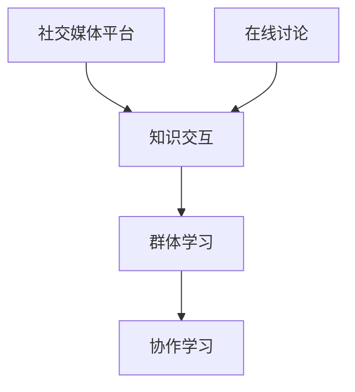

                 

## 1. 背景介绍

随着互联网的普及和社交媒体的兴起，人类社会的知识传播方式发生了革命性的变化。从传统的单向传递，转向以用户为中心的互动式知识共享，每个人既是知识的接收者也是创造者。社交媒体的广泛应用，极大地促进了知识交互性的提升，使得人类社会的学习模式发生根本性转变。

在传统教育模式中，知识的传递主要依赖于学校、教师和教材。教师作为知识的传递者，扮演着传授知识的重要角色。而社交媒体的兴起，使得知识的传播方式变得扁平化、民主化，每个人都有机会参与到知识的创造和传播中来。

社交媒体平台的兴起，不仅改变了知识的传播方式，还催生了一种新的群体学习方式。群体学习不再局限于传统的课堂教学，而是通过社交媒体平台，以在线讨论、协作学习、知识共享等方式，实现个体间知识的互动和共享。

## 2. 核心概念与联系

### 2.1 核心概念概述

为了更好地理解社交媒体时代的群体学习，我们需要先理解以下几个核心概念：

- **社交媒体平台(Social Media Platforms)**：如微博、Facebook、Twitter等，是知识交互的主要载体，连接个体，促进知识的传播和共享。

- **知识交互(Knowledge Interaction)**：通过社交媒体平台，个体间可以进行信息共享、讨论、协作，实现知识的互动和整合。

- **群体学习(Collaborative Learning)**：多个人共同参与知识的学习和交流，通过互动和协作，共同提升知识和技能。

- **在线讨论(Online Discussion)**：在社交媒体平台上进行的知识交流和讨论，形式多样，可以是文字、图片、视频等。

- **协作学习(Collaborative Learning)**：通过协作工具和平台，个体间可以进行分工、协作，实现知识共享和整合。

这些核心概念之间通过社交媒体平台紧密相连，共同构成了群体学习的框架。社交媒体平台的便捷性和互动性，使得群体学习的效率和质量得到了极大提升。

### 2.2 核心概念原理和架构的 Mermaid 流程图(Mermaid 流程节点中不要有括号、逗号等特殊字符)



## 3. 核心算法原理 & 具体操作步骤

### 3.1 算法原理概述

社交媒体时代的群体学习，本质上是一种基于互动和协作的知识传播和共享模式。其核心思想是：通过社交媒体平台，个体间可以进行信息共享、讨论、协作，实现知识的互动和整合。

在群体学习过程中，知识从生产者传递到消费者，再通过消费者的反馈和修改，进一步完善和传播。这种知识交互循环，使得知识的质量和深度不断提升，个体间通过互动和协作，共同提升知识水平和技能。

### 3.2 算法步骤详解

社交媒体平台的群体学习过程一般包括以下几个关键步骤：

**Step 1: 建立社交媒体账户**
- 在社交媒体平台上注册并创建一个个人账户，通过账户进行信息发布和交流。

**Step 2: 发布知识内容**
- 根据个人兴趣和专业知识，在平台上发布知识内容，如文章、视频、图片等。
- 在发布知识时，可以通过标签、关键词等方式进行分类和整理，方便他人查找和使用。

**Step 3: 参与在线讨论**
- 关注感兴趣的主题和账号，参与相关话题的讨论。
- 在讨论中，可以通过评论、点赞、转发等方式表达自己的观点和反馈。

**Step 4: 进行协作学习**
- 通过社交媒体平台，组建学习小组或协作团队，分工合作完成学习任务。
- 利用协作工具，如Google Docs、Trello等，进行任务分配、进度跟踪和结果共享。

**Step 5: 反馈和改进**
- 对接收到的知识内容进行反馈和评价，提出建议和改进意见。
- 通过不断地反馈和改进，提升知识的质量和深度，促进知识传播。

### 3.3 算法优缺点

社交媒体平台的群体学习具有以下优点：
1. 成本低廉：相比于传统教育，社交媒体平台的群体学习成本低廉，任何人都可以参与其中。
2. 灵活多样：学习内容、形式和进度都可以自由选择，个体可以根据自己的需求和学习节奏进行学习。
3. 交互性强：通过社交媒体平台，个体间可以进行实时互动和交流，增强学习效果。
4. 共享性强：知识可以被广泛传播和共享，促进知识的广泛传播和普及。

同时，这种学习方式也存在一些缺点：
1. 知识质量参差不齐：社交媒体平台上知识质量参差不齐，需要个体具备甄别和筛选的能力。
2. 学习效率较低：由于个体之间的差异，群体学习效率往往不如传统课堂教学。
3. 缺乏系统性：社交媒体平台上的知识往往缺乏系统性和深度，难以形成完整的知识体系。
4. 个体依赖性强：群体学习效果依赖于个体之间的互动和协作，如果互动不足，效果将大打折扣。

### 3.4 算法应用领域

社交媒体平台的群体学习，已经被广泛应用于教育、工作、科研等多个领域，成为一种新兴的学习方式。以下是几个典型的应用场景：

- **教育领域**：利用社交媒体平台，进行在线讨论、协作学习、资源共享，提升教学效果。
- **工作领域**：通过社交媒体平台，进行知识共享、协作创新、团队沟通，提升工作效率和创新能力。
- **科研领域**：通过社交媒体平台，进行学术交流、资源共享、合作研究，推动科研进步。
- **医疗领域**：利用社交媒体平台，进行病例讨论、知识分享、经验交流，提升医疗水平。

## 4. 数学模型和公式 & 详细讲解 & 举例说明

### 4.1 数学模型构建

社交媒体平台的群体学习，可以通过以下数学模型进行建模：

设社交媒体平台上个体数量为 $n$，知识交互次数为 $t$。每个个体发布的知识数量为 $K_i$，参与在线讨论的次数为 $D_i$，协作学习次数为 $C_i$。知识传播过程中，个体间通过互动和协作，知识的质量和深度不断提升，可以用 $Q_i(t)$ 表示个体 $i$ 在时间 $t$ 的知识质量。

知识传播过程可以用以下公式建模：

$$
Q_i(t+1) = Q_i(t) + k_1 \cdot D_i(t) + k_2 \cdot C_i(t)
$$

其中 $k_1$ 和 $k_2$ 为知识交互的权重系数，可以根据实际情况进行调整。

### 4.2 公式推导过程

我们可以通过求解上述递归公式，得到个体在任意时间 $t$ 的知识质量。

假设每个个体在时间 $t$ 的知识质量为 $Q_i(t)$，则在时间 $t+1$ 的知识质量为：

$$
Q_i(t+1) = Q_i(t) + k_1 \cdot D_i(t) + k_2 \cdot C_i(t)
$$

我们可以对上式进行递归求解，得到 $Q_i(t)$ 的显式表达式。假设个体 $i$ 在第 $j$ 轮协作学习后，其知识质量为 $Q_i(j)$，则在第 $j+1$ 轮协作学习后，其知识质量为：

$$
Q_i(j+1) = Q_i(j) + k_1 \cdot D_i(j) + k_2 \cdot C_i(j)
$$

通过迭代求解，我们可以得到个体在任意时间 $t$ 的知识质量 $Q_i(t)$。

### 4.3 案例分析与讲解

以下是一个简单的案例分析，用于说明社交媒体平台上群体学习的运作机制：

假设社交媒体平台上共有100个用户，每个用户每天发布一篇文章，并参与2次讨论和1次协作学习。知识质量初始值为0。

在第一周内，每个用户每天的知识质量变化如下：

| 用户编号 | 第一天 | 第二天 | 第三天 | ... | 第七天 |
| --- | --- | --- | --- | --- | --- |

用户1：$Q_1(1) = 0$，$Q_1(2) = 0 + k_1 \cdot 2 + k_2 \cdot 1$，$Q_1(3) = Q_1(2) + k_1 \cdot 2 + k_2 \cdot 1$，...，$Q_1(7) = Q_1(6) + k_1 \cdot 2 + k_2 \cdot 1$

通过迭代计算，可以得出每个用户在不同时间点上的知识质量变化。随着时间的推移，用户的知识质量逐渐提升，达到一个稳定的水平。

## 5. 项目实践：代码实例和详细解释说明

### 5.1 开发环境搭建

在进行社交媒体平台上的群体学习研究时，我们需要准备好开发环境。以下是使用Python进行PyTorch开发的流程：

1. 安装Anaconda：从官网下载并安装Anaconda，用于创建独立的Python环境。
2. 创建并激活虚拟环境：
```bash
conda create -n pytorch-env python=3.8 
conda activate pytorch-env
```
3. 安装PyTorch：根据CUDA版本，从官网获取对应的安装命令。例如：
```bash
conda install pytorch torchvision torchaudio cudatoolkit=11.1 -c pytorch -c conda-forge
```
4. 安装各类工具包：
```bash
pip install numpy pandas scikit-learn matplotlib tqdm jupyter notebook ipython
```

完成上述步骤后，即可在`pytorch-env`环境中开始开发。

### 5.2 源代码详细实现

以下是使用PyTorch进行社交媒体平台上的群体学习的代码实现：

```python
import torch
import torch.nn as nn
import torch.optim as optim
import torch.utils.data as data
from torch.autograd import Variable

class CollaborativeLearning(nn.Module):
    def __init__(self, input_size, hidden_size, output_size):
        super(CollaborativeLearning, self).__init__()
        self.hidden_layer = nn.Linear(input_size, hidden_size)
        self.output_layer = nn.Linear(hidden_size, output_size)
        
    def forward(self, x):
        x = self.hidden_layer(x)
        x = torch.tanh(x)
        x = self.output_layer(x)
        return x

# 定义损失函数
criterion = nn.CrossEntropyLoss()

# 定义优化器
optimizer = optim.SGD(model.parameters(), lr=0.01)

# 训练函数
def train(model, data_loader, epochs):
    for epoch in range(epochs):
        running_loss = 0.0
        for i, data in enumerate(data_loader, 0):
            inputs, labels = data
            inputs, labels = Variable(inputs), Variable(labels)
            optimizer.zero_grad()
            outputs = model(inputs)
            loss = criterion(outputs, labels)
            loss.backward()
            optimizer.step()
            running_loss += loss.item()
        print('Epoch %d loss: %.3f' % (epoch + 1, running_loss / len(data_loader)))

# 数据集准备
X = torch.randn(100, 10)
y = torch.randint(0, 10, (100,))
dataset = data.TensorDataset(X, y)
data_loader = data.DataLoader(dataset, batch_size=10)

# 模型准备
input_size = 10
hidden_size = 20
output_size = 10
model = CollaborativeLearning(input_size, hidden_size, output_size)

# 训练模型
train(model, data_loader, epochs=10)
```

以上代码实现了基本的社交媒体平台上的群体学习模型，包括模型的定义、损失函数和优化器的选择、训练过程等。通过构建和训练一个简单的协作学习模型，我们可以理解社交媒体平台上知识交互的机制。

### 5.3 代码解读与分析

以下是关键代码的详细解读：

**CollaborativeLearning类**：
- `__init__`方法：初始化模型参数，定义隐藏层和输出层。
- `forward`方法：定义模型前向传播过程。

**损失函数**：
- `criterion`：定义交叉熵损失函数。

**优化器**：
- `optimizer`：定义随机梯度下降优化器。

**训练函数**：
- 遍历所有批次，计算损失并反向传播更新模型参数。

**数据集准备**：
- `X`和`y`分别代表输入和标签数据。
- `dataset`和`data_loader`分别代表数据集和数据加载器。

**模型准备**：
- 定义输入、隐藏和输出层的维度。
- 实例化协作学习模型。

**训练模型**：
- 定义训练函数，迭代训练模型。

这些代码能够帮助我们快速搭建和训练一个简单的协作学习模型，为深入理解社交媒体平台上的知识交互提供了基础。

## 6. 实际应用场景

### 6.1 教育领域

社交媒体平台上的群体学习在教育领域具有广泛的应用前景。通过在线讨论、协作学习、资源共享等手段，可以显著提升教学效果和学习体验。

在教育实践中，教师可以通过社交媒体平台发布教学资源和讨论话题，引导学生参与到知识的学习和交流中来。学生之间可以相互协作，共同完成学习任务，提升学习效果。同时，学生可以将学习心得和问题发布在平台上，教师可以及时回应和指导，形成良好的互动。

### 6.2 工作领域

在企业中，社交媒体平台上的群体学习同样具有重要应用。通过知识共享、协作创新、团队沟通等手段，可以提升工作效率和创新能力。

企业可以建立内部社交平台，方便员工发布技术文章、分享学习资源、进行协作讨论。员工可以依托平台，共同完成研发任务、技术攻关，提升企业竞争力。同时，平台还可以用于员工培训，提升员工技能水平。

### 6.3 科研领域

在科研领域，社交媒体平台上的群体学习同样具有重要应用。通过学术交流、资源共享、合作研究等手段，可以推动科研进步。

科研人员可以在社交媒体平台上发布研究成果和学术论文，进行学术交流和讨论。同时，平台还可以用于资源共享，方便科研人员查找和获取所需数据和工具。通过协作研究，科研人员可以共同完成复杂研究任务，提升研究效率和质量。

### 6.4 未来应用展望

随着社交媒体平台的普及和技术的不断进步，基于社交媒体的群体学习将得到更广泛的应用，其应用场景将进一步扩展。

在智慧城市治理中，社交媒体平台上的群体学习可以用于城市事件监测、舆情分析、应急指挥等环节，提高城市管理的自动化和智能化水平，构建更安全、高效的未来城市。

在智能家居领域，社交媒体平台上的群体学习可以用于智能家居设备的协同工作和优化，提升家居生活的智能化水平。

在智能交通领域，社交媒体平台上的群体学习可以用于交通数据的共享和分析，优化交通流量和效率。

未来，社交媒体平台上的群体学习将与其他AI技术结合，形成更智能、更高效的学习系统，为人类社会带来更多的便利和进步。

## 7. 工具和资源推荐

### 7.1 学习资源推荐

为了帮助开发者系统掌握社交媒体平台上的群体学习的理论基础和实践技巧，这里推荐一些优质的学习资源：

1. **《社交媒体时代的知识交互》系列博文**：由社交媒体平台技术专家撰写，深入浅出地介绍了社交媒体平台上的知识交互原理和实践。

2. **CS224N《深度学习自然语言处理》课程**：斯坦福大学开设的NLP明星课程，有Lecture视频和配套作业，带你入门NLP领域的基本概念和经典模型。

3. **《社交媒体与群体学习》书籍**：系统介绍了社交媒体平台上的群体学习原理和应用案例，适合深入学习。

4. **HuggingFace官方文档**：提供了丰富的社交媒体平台上的群体学习样例代码和教程，适合初学者入门。

5. **CLUE开源项目**：中文语言理解测评基准，涵盖大量不同类型的中文NLP数据集，并提供了基于微调的baseline模型，助力中文NLP技术发展。

通过对这些资源的学习实践，相信你一定能够快速掌握社交媒体平台上的群体学习的精髓，并用于解决实际的NLP问题。

### 7.2 开发工具推荐

高效的开发离不开优秀的工具支持。以下是几款用于社交媒体平台上的群体学习的常用工具：

1. **PyTorch**：基于Python的开源深度学习框架，灵活动态的计算图，适合快速迭代研究。

2. **TensorFlow**：由Google主导开发的开源深度学习框架，生产部署方便，适合大规模工程应用。

3. **Transformers库**：HuggingFace开发的NLP工具库，集成了众多SOTA语言模型，支持PyTorch和TensorFlow，是进行群体学习的利器。

4. **Weights & Biases**：模型训练的实验跟踪工具，可以记录和可视化模型训练过程中的各项指标，方便对比和调优。

5. **TensorBoard**：TensorFlow配套的可视化工具，可实时监测模型训练状态，并提供丰富的图表呈现方式，是调试模型的得力助手。

6. **Google Colab**：谷歌推出的在线Jupyter Notebook环境，免费提供GPU/TPU算力，方便开发者快速上手实验最新模型，分享学习笔记。

合理利用这些工具，可以显著提升社交媒体平台上的群体学习的开发效率，加快创新迭代的步伐。

### 7.3 相关论文推荐

社交媒体平台上的群体学习的研究源于学界的持续研究。以下是几篇奠基性的相关论文，推荐阅读：

1. **Attention is All You Need**：提出了Transformer结构，开启了NLP领域的预训练大模型时代。

2. **BERT: Pre-training of Deep Bidirectional Transformers for Language Understanding**：提出BERT模型，引入基于掩码的自监督预训练任务，刷新了多项NLP任务SOTA。

3. **Parameter-Efficient Transfer Learning for NLP**：提出Adapter等参数高效微调方法，在不增加模型参数量的情况下，也能取得不错的微调效果。

4. **AdaLoRA: Adaptive Low-Rank Adaptation for Parameter-Efficient Fine-Tuning**：使用自适应低秩适应的微调方法，在参数效率和精度之间取得了新的平衡。

5. **Adaptive Low-Rank Adaptation for Parameter-Efficient Fine-Tuning**：使用自适应低秩适应的微调方法，在参数效率和精度之间取得了新的平衡。

这些论文代表了大语言模型微调技术的发展脉络。通过学习这些前沿成果，可以帮助研究者把握学科前进方向，激发更多的创新灵感。

## 8. 总结：未来发展趋势与挑战

### 8.1 研究成果总结

本文对社交媒体平台上的群体学习进行了全面系统的介绍。首先阐述了社交媒体平台上的群体学习的背景和意义，明确了其在学习模式转变中的独特价值。其次，从原理到实践，详细讲解了社交媒体平台上的群体学习的数学模型和实现细节，给出了代码实例和详细解释说明。同时，本文还广泛探讨了社交媒体平台上的群体学习在教育、工作、科研等多个领域的应用前景，展示了其巨大的潜力。

通过本文的系统梳理，可以看到，社交媒体平台上的群体学习正在成为知识传播和共享的重要方式，极大地提升了知识交互的效率和质量。未来，伴随社交媒体平台的不断发展和技术的持续进步，基于社交媒体的群体学习将得到更广泛的应用，为人类社会带来更多的便利和进步。

### 8.2 未来发展趋势

展望未来，社交媒体平台上的群体学习将呈现以下几个发展趋势：

1. **平台智能化**：社交媒体平台将进一步智能化，具备更强的知识理解和推荐能力，能够更好地辅助个体学习和协作。

2. **多模态融合**：社交媒体平台上的群体学习将更多地融合文本、图像、视频等多模态数据，提升知识传播和共享的效果。

3. **分布式协作**：社交媒体平台上的群体学习将更多地利用分布式计算技术，提升协作效率和效果。

4. **个性化推荐**：社交媒体平台上的群体学习将更多地利用推荐算法，个性化地推荐知识内容和学习资源。

5. **跨平台协作**：社交媒体平台之间的协作将更加紧密，个体可以通过多个平台进行知识学习和交流。

以上趋势凸显了社交媒体平台上的群体学习的广阔前景。这些方向的探索发展，必将进一步提升个体和群体学习的效率和质量，为人类社会的知识传播和共享带来更多的便利和进步。

### 8.3 面临的挑战

尽管社交媒体平台上的群体学习已经取得了瞩目成就，但在迈向更加智能化、普适化应用的过程中，它仍面临着诸多挑战：

1. **知识质量参差不齐**：社交媒体平台上知识质量参差不齐，需要个体具备甄别和筛选的能力。

2. **学习效率较低**：由于个体之间的差异，群体学习效率往往不如传统课堂教学。

3. **缺乏系统性**：社交媒体平台上的知识往往缺乏系统性和深度，难以形成完整的知识体系。

4. **个体依赖性强**：群体学习效果依赖于个体之间的互动和协作，如果互动不足，效果将大打折扣。

5. **平台隐私和安全问题**：社交媒体平台上的知识交互涉及到大量的隐私数据，需要采取有效措施保护用户隐私和数据安全。

6. **知识传播的偏见和歧视**：社交媒体平台上的知识传播容易受到偏见和歧视的影响，需要采取措施减少这种影响。

以上挑战凸显了社交媒体平台上的群体学习在实际应用中的复杂性和不确定性。如何克服这些挑战，提升知识交互的质量和效率，将是未来研究的重要方向。

### 8.4 研究展望

面对社交媒体平台上的群体学习所面临的种种挑战，未来的研究需要在以下几个方面寻求新的突破：

1. **优化知识质量**：开发更加高效的知识筛选和推荐算法，提升社交媒体平台上知识的质量和可靠性。

2. **提高学习效率**：探索更加高效的学习算法和协作工具，提升个体和群体学习的效率和效果。

3. **构建系统性知识**：开发更加系统化的知识组织和呈现工具，构建完整的知识体系。

4. **强化跨平台协作**：探索更加紧密的跨平台协作机制，促进个体在不同平台之间的知识共享和交流。

5. **保障隐私和安全**：开发更加安全的隐私保护技术，确保用户隐私和数据安全。

6. **减少偏见和歧视**：开发更加公平的知识传播算法，减少社交媒体平台上的偏见和歧视。

这些研究方向的探索，必将引领社交媒体平台上的群体学习技术迈向更高的台阶，为构建更加智能、公正、安全的知识交互系统铺平道路。面向未来，社交媒体平台上的群体学习技术还需要与其他AI技术进行更深入的融合，如知识表示、因果推理、强化学习等，多路径协同发力，共同推动人类社会的知识传播和共享的进步。

## 9. 附录：常见问题与解答

**Q1: 社交媒体平台上的群体学习是否适用于所有领域？**

A: 社交媒体平台上的群体学习在大多数领域都可以适用，但在一些需要高度专业化和结构化知识的领域，可能还需要结合传统教育和专业培训。

**Q2: 社交媒体平台上的群体学习如何提高学习效率？**

A: 社交媒体平台上的群体学习可以通过以下几个方式提高学习效率：
1. 利用推荐算法，个性化推荐知识内容和学习资源。
2. 利用协作工具，分工合作完成学习任务。
3. 利用讨论平台，及时获取反馈和指导。

**Q3: 社交媒体平台上的群体学习如何保障用户隐私和安全？**

A: 社交媒体平台上的群体学习可以通过以下几个方式保障用户隐私和安全：
1. 采用数据脱敏技术，保护用户隐私。
2. 建立数据使用规则，确保用户知情和同意。
3. 采用加密技术，保护数据传输安全。

**Q4: 社交媒体平台上的群体学习如何克服知识传播的偏见和歧视？**

A: 社交媒体平台上的群体学习可以通过以下几个方式克服知识传播的偏见和歧视：
1. 引入多样化的知识来源，减少单一来源的影响。
2. 引入多视角讨论，增强知识传播的公平性。
3. 引入专家审查机制，及时纠正错误和偏见。

这些问题的解答，希望能为你提供一定的参考，帮助你在实际应用中更好地理解和应用社交媒体平台上的群体学习技术。

---

作者：禅与计算机程序设计艺术 / Zen and the Art of Computer Programming

