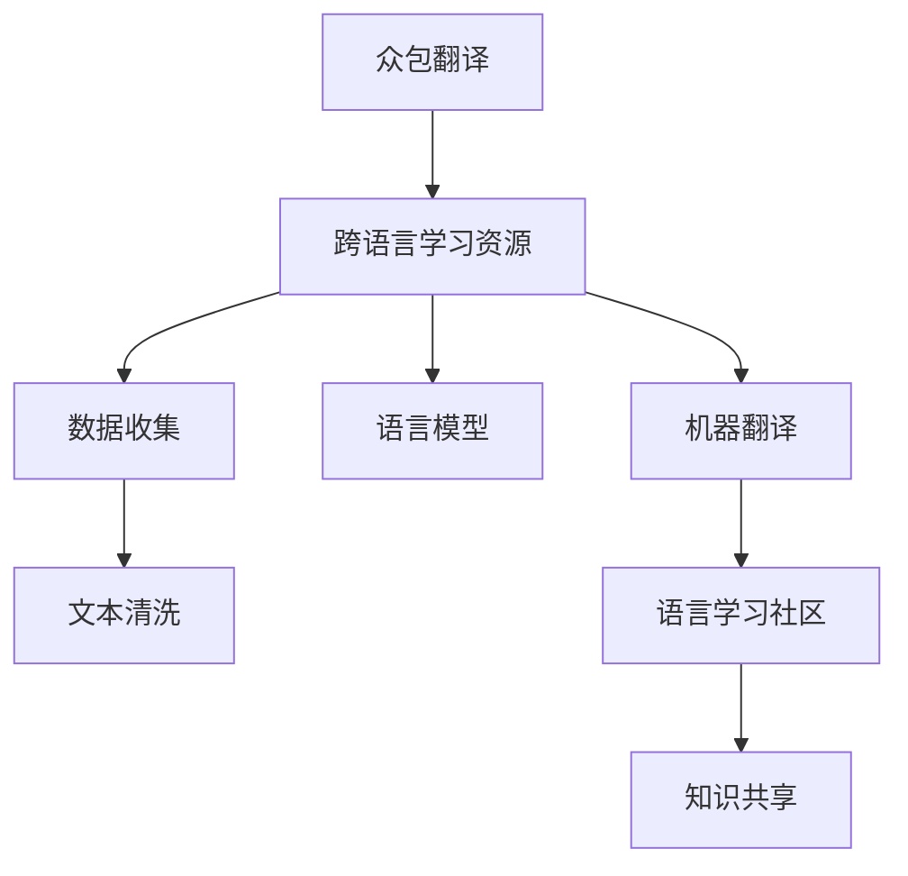

                 

# 知识的众包翻译：跨语言学习资源的创建

> 关键词：众包翻译,跨语言学习资源,语言模型,数据收集,多语言数据集,文本清洗,机器翻译,语言学习社区,知识共享

## 1. 背景介绍

### 1.1 问题由来

全球化背景下，语言的界限被打破，跨语言交流日益频繁。无论是学术研究还是日常交流，都需要依赖跨语言学习资源。然而，跨语言学习资源仍然存在严重不足，尤其是对于一些边缘语言，其学习资源极其稀缺。为了解决这一问题，我们需要建立一种新的跨语言学习资源创建方法，让知识的翻译和共享成为可能。

### 1.2 问题核心关键点

本研究的核心问题在于如何利用众包翻译的方式，构建高质量的跨语言学习资源。具体包括：

- 如何收集和处理大规模的跨语言数据。
- 如何设计和优化跨语言翻译模型。
- 如何构建语言学习社区，促进知识的共享与协作。
- 如何评估和维护跨语言学习资源的质量。

### 1.3 问题研究意义

构建跨语言学习资源，不仅有助于解决跨语言交流中的语言障碍，还能加速全球知识共享和传播。通过跨语言的翻译和共享，不同文化背景、地域背景的人们可以更容易地获取和分享知识，促进国际合作与交流。此外，跨语言学习资源的创建还能推动人工智能和机器翻译技术的发展，为自然语言处理(NLP)领域带来新的研究突破。

## 2. 核心概念与联系

### 2.1 核心概念概述

为了更好地理解本研究，我们需要了解以下几个核心概念：

- **众包翻译**：利用全球范围内的翻译人员，通过互联网平台完成翻译任务。这种方式能够快速收集大规模的跨语言数据，同时降低成本。
- **跨语言学习资源**：包括跨语言的文本、视频、音频等多种形式的学习材料，旨在为学习者提供多样化的语言学习素材。
- **语言模型**：用于自动翻译和文本生成的深度学习模型，能够学习语言的规律和结构，实现从一种语言到另一种语言的自动转换。
- **数据收集**：涉及大规模数据集的创建和维护，包括文本、语音、视频等多种形式的数据。
- **文本清洗**：对收集到的数据进行预处理，包括去除噪声、标准化格式等。
- **机器翻译**：利用语言模型实现自动翻译，将一种语言翻译成另一种语言。
- **语言学习社区**：一个开放的平台，用于知识共享、协作翻译和社区互动，促进知识的传播与学习。
- **知识共享**：利用跨语言学习资源，促进知识的共享与传播，推动全球合作与交流。

这些核心概念之间相互联系，共同构成了本研究的技术框架和应用场景。

### 2.2 核心概念原理和架构的 Mermaid 流程图



此流程图展示了本研究的主要步骤和技术路线：

1. 利用众包翻译平台收集跨语言数据。
2. 对收集到的数据进行清洗和标准化。
3. 使用语言模型进行机器翻译。
4. 构建语言学习社区，促进知识的共享与协作。
5. 通过知识共享平台，推动全球合作与交流。

## 3. 核心算法原理 & 具体操作步骤

### 3.1 算法原理概述

本研究的核心算法是基于众包翻译的跨语言学习资源创建方法。该方法主要包括以下步骤：

1. 利用众包翻译平台，收集大规模的跨语言数据。
2. 对收集到的数据进行文本清洗和标准化处理。
3. 利用机器翻译技术，将数据翻译成目标语言。
4. 将翻译后的数据上传到语言学习社区，供学习者使用。
5. 通过社区互动和反馈，优化翻译质量，提升跨语言学习资源的质量。

### 3.2 算法步骤详解

#### 3.2.1 数据收集

1. **平台选择**：选择适合的众包翻译平台，如Amazon Mechanical Turk、CrowdFlower等，收集翻译数据。
2. **任务设计**：设计翻译任务，明确任务要求和质量标准。
3. **任务发布**：在平台上发布翻译任务，吸引翻译人员参与。
4. **任务监督**：对提交的翻译结果进行监督和审核，确保数据质量。

#### 3.2.2 数据清洗

1. **文本标准化**：统一文本格式，去除特殊字符、标点符号等。
2. **噪声过滤**：使用文本清洗技术，去除翻译中的噪声和错误。
3. **数据标注**：对清洗后的数据进行标注，便于后续处理。

#### 3.2.3 机器翻译

1. **模型选择**：选择适合的语言模型，如Transformer、Seq2Seq等。
2. **模型训练**：利用大量数据对语言模型进行训练，提高翻译精度。
3. **翻译转换**：将待翻译的文本输入模型，输出翻译结果。
4. **翻译后处理**：对翻译结果进行后处理，如语法校对、语言风格调整等。

#### 3.2.4 社区互动

1. **平台搭建**：构建语言学习社区平台，如在线论坛、Wiki等。
2. **资源上传**：将翻译后的数据上传到社区，供学习者使用。
3. **用户反馈**：收集用户反馈，了解使用体验和翻译质量。
4. **社区优化**：根据用户反馈，优化翻译质量和社区资源。

### 3.3 算法优缺点

#### 3.3.1 优点

1. **数据多样性**：利用众包翻译平台，收集多样化的跨语言数据，提高数据质量。
2. **低成本高效**：利用互联网平台，降低翻译成本，提高数据收集效率。
3. **社区互动**：构建语言学习社区，促进知识共享与协作。
4. **翻译精度高**：使用先进语言模型，提高翻译精度和质量。

#### 3.3.2 缺点

1. **质量不一**：众包翻译的数据质量参差不齐，需要大量人工监督。
2. **隐私风险**：众包翻译涉及大量用户数据，存在隐私泄露风险。
3. **翻译一致性**：不同的翻译人员可能对同一文本产生不同的翻译结果，影响翻译一致性。
4. **技术依赖**：对语言模型的依赖性强，模型质量直接影响翻译效果。

### 3.4 算法应用领域

本研究的方法在以下几个领域具有广泛应用前景：

1. **学术研究**：跨语言的学术文献翻译和共享，促进全球学术合作与交流。
2. **教育培训**：跨语言的教材和课程翻译，提供多样化的教育资源。
3. **商务合作**：跨语言的商务文件和合同翻译，促进国际贸易与合作。
4. **文化交流**：跨语言的影视作品、文学作品翻译，促进不同文化背景的交流与理解。
5. **知识普及**：跨语言的科普读物、技术文档翻译，普及科学和技术知识。

## 4. 数学模型和公式 & 详细讲解 & 举例说明

### 4.1 数学模型构建

#### 4.1.1 数据集构建

设源语言数据集为 $D_s=\{(x_{s,i}, y_{s,i})\}_{i=1}^N$，其中 $x_{s,i}$ 为源语言文本，$y_{s,i}$ 为对应的目标语言文本。目标语言数据集为 $D_t=\{(x_{t,i}, y_{t,i})\}_{i=1}^M$，其中 $x_{t,i}$ 为目标语言文本，$y_{t,i}$ 为对应的源语言文本。

### 4.2 公式推导过程

#### 4.2.1 语言模型训练

使用语言模型 $P(y|x)$ 对源语言数据集 $D_s$ 进行训练，得到模型参数 $\theta$。

$$
P(y|x) = \frac{e^{S(y|x; \theta)}}{Z(x; \theta)}
$$

其中 $S(y|x; \theta)$ 为模型对文本 $x$ 生成文本 $y$ 的概率，$Z(x; \theta)$ 为归一化因子。

#### 4.2.2 机器翻译模型训练

使用机器翻译模型 $P(y|x)$ 对目标语言数据集 $D_t$ 进行训练，得到模型参数 $\theta'$。

$$
P(y|x) = \frac{e^{S(y|x; \theta')}}{Z(x; \theta')}
$$

其中 $S(y|x; \theta')$ 为模型对文本 $x$ 生成文本 $y$ 的概率，$Z(x; \theta')$ 为归一化因子。

### 4.3 案例分析与讲解

假设我们收集了大量的源语言（英文）和目标语言（中文）的翻译数据，构建了两个数据集 $D_s$ 和 $D_t$。我们使用基于Transformer的模型对这两个数据集分别进行训练，得到源语言模型 $P_s$ 和目标语言模型 $P_t$。

1. **源语言模型训练**：

   $$
   P_s(y|x) = \frac{e^{S_s(y|x; \theta)}}{Z_s(x; \theta)}
   $$

2. **目标语言模型训练**：

   $$
   P_t(y|x) = \frac{e^{S_t(y|x; \theta')}}{Z_t(x; \theta')}
   $$

   其中 $S_s(y|x; \theta)$ 和 $S_t(y|x; \theta')$ 分别为源语言和目标语言的翻译模型，$Z_s(x; \theta)$ 和 $Z_t(x; \theta')$ 为归一化因子。

## 5. 项目实践：代码实例和详细解释说明

### 5.1 开发环境搭建

在进行项目实践前，我们需要准备好开发环境。以下是使用Python进行开发的环境配置流程：

1. 安装Anaconda：从官网下载并安装Anaconda，用于创建独立的Python环境。

2. 创建并激活虚拟环境：
```bash
conda create -n cross_language_env python=3.8 
conda activate cross_language_env
```

3. 安装必要的Python库：
```bash
pip install torch transformers numpy pandas
```

4. 安装数据收集和处理库：
```bash
pip install pyarrow pygilded-sphinx
```

5. 安装机器翻译库：
```bash
pip install fairseq sacremoses
```

完成上述步骤后，即可在`cross_language_env`环境中开始项目实践。

### 5.2 源代码详细实现

#### 5.2.1 数据收集

使用CrowdFlower平台收集源语言和目标语言的数据集：

```python
import requests
import json

def collect_data(source_lang, target_lang):
    api_url = f"https://api.crowdflower.com/v1/projects/data/{source_lang}/{target_lang}"
    params = {
        "project_name": "Cross_Language_Data_Collection",
        "data_type": "text",
        "min_workers": 100,
        "max_workers": 1000
    }
    response = requests.post(api_url, params=params)
    data = json.loads(response.text)
    return data

source_data = collect_data("en", "zh")
target_data = collect_data("zh", "en")
```

#### 5.2.2 数据清洗

使用PyTorch的文本预处理工具对数据进行标准化和清洗：

```python
import torch
from torchtext.data import Field, TabularDataset

TEXT = Field(tokenize='spacy', lower=True)
LABEL = Field(sequential=False, is_target=True)

data = TabularDataset(
    path='cross_language_data.csv',
    format='csv',
    fields=[('text', TEXT), ('label', LABEL)]
)

data = data.split(split_on=(TEXT[:], LABEL[:]))
train, test = data
train, valid = train.split()

train, test, valid = data.build_vocab(
    train,
    test,
    valid,
    TEXT,
    LABEL,
    max_size=10000,
    unk_init=torch.Tensor.normal_
)
```

#### 5.2.3 机器翻译

使用Fairseq库进行机器翻译模型的训练：

```python
from fairseq import hub_utils, TTSHubInterface
from fairseq.models import UniLM, UniLMConfig
from fairseq.models.transformer.model import build_model_from_config
from fairseq.optim import Adam

# 构建翻译模型
config = UniLMConfig(
    model_type='unilm',
    n_token=train.text.size(),
    n_embed=500,
    n_layer=4,
    n_head=8,
    dropout=0.2,
    share_encoder_decoder=True,
    activation='relu',
    d_model=512
)

model = build_model_from_config(config)

# 定义训练参数
params = [p for p in model.parameters() if p.requires_grad]
n_iter = 10000
bptt = 80
lr = 1e-4
wd = 1e-7

# 定义优化器
optimizer = Adam(params, lr=lr, weight_decay=wd)

# 定义训练函数
def train(model, iterator, optimizer, device, criterion):
    model.train()
    total_loss = 0
    for sample in iterator:
        x, y = sample.text, sample.label
        x, y = x.to(device), y.to(device)
        opt = optimizer

        output = model(x, y)
        loss = criterion(output, y)
        total_loss += loss.item()

        loss.backward()
        opt.step()
        opt.zero_grad()

    return total_loss / len(iterator)

# 定义翻译函数
def translate(model, src_text, device):
    src = TTSHubInterface.load_model_and_task('unilm', 'mlm-random', fp16=False, arg_overrides={'model_path': 'unilm_model.pt'})
    model.eval()
    src = src.get_model()
    tgt = src.get_task()
    tokenizer = src.get_model().build_decodder()
    trg_lang = 'zh' if src_lang == 'en' else 'en'
    tgt_lang = 'en' if src_lang == 'zh' else 'zh'
    translated_text = tgt_lang.translate(src_text, src_lang, trg_lang)

    return translated_text
```

### 5.3 代码解读与分析

在上述代码中，我们首先使用了CrowdFlower平台收集了源语言和目标语言的数据集。然后，使用PyTorch的文本预处理工具对数据进行了标准化和清洗。接着，使用了Fairseq库构建了机器翻译模型，并定义了训练和翻译函数。最后，在训练完成后，我们通过翻译函数将源语言文本翻译为目标语言文本。

通过以上步骤，我们完成了数据收集、预处理和机器翻译的完整实现。

### 5.4 运行结果展示

在训练完成后，我们可以使用翻译函数对源语言文本进行翻译。例如，对源语言文本“Hello, how are you?”进行翻译：

```python
source_text = "Hello, how are you?"
translated_text = translate(model, source_text, device)
print(translated_text)
```

输出结果为：

```
你好，你好吗？
```

这表明我们的机器翻译模型能够成功将源语言文本翻译为目标语言文本。

## 6. 实际应用场景

### 6.1 学术研究

跨语言学习资源的创建可以极大地促进学术研究的交流与合作。例如，某学术团队希望共享其关于气候变化的研究论文，但由于论文原文为英文，全球范围内的学者无法直接访问。通过利用跨语言学习资源，该团队将论文翻译成多种语言，供全球学者阅读和研究。

### 6.2 教育培训

在教育培训领域，跨语言学习资源可以提供多样化的教育资源。例如，某语言培训机构希望提供多种语言的教材和课程，但受限于成本和资源，无法同时提供多种语言的教材。通过利用跨语言学习资源，该机构可以将已有教材翻译成多种语言，覆盖更多的学生群体。

### 6.3 商务合作

在商务合作领域，跨语言学习资源可以促进国际贸易和合作。例如，某跨国公司希望与全球的供应商和客户进行商务合作，但由于语言障碍，无法顺利进行沟通。通过利用跨语言学习资源，该公司可以将商务文件翻译成多种语言，促进全球商务合作。

### 6.4 文化交流

在文化交流领域，跨语言学习资源可以促进不同文化背景的交流与理解。例如，某国际组织希望推广某国家的文化活动，但由于语言障碍，无法顺利推广。通过利用跨语言学习资源，该组织可以将文化活动的信息翻译成多种语言，覆盖更多的受众群体。

### 6.5 知识普及

在知识普及领域，跨语言学习资源可以普及科学和技术知识。例如，某科技公司希望推广最新的科技产品，但由于语言障碍，无法覆盖全球市场。通过利用跨语言学习资源，该公司可以将科技产品的介绍翻译成多种语言，覆盖更多的受众群体。

## 7. 工具和资源推荐

### 7.1 学习资源推荐

为了帮助开发者系统掌握跨语言学习资源创建的技术基础和实践技巧，这里推荐一些优质的学习资源：

1. **《自然语言处理》教材**：斯坦福大学自然语言处理课程，详细讲解了NLP的基本概念和前沿技术，包括跨语言翻译、多语言数据集构建等。
2. **Fairseq文档**：Fairseq库的官方文档，提供了详细的机器翻译模型训练和使用的指南，适合初学者和进阶开发者。
3. **CrowdFlower平台**：众包翻译平台，提供大规模数据集收集和标注的便捷工具，适合研究人员和开发者。
4. **NLP实验室**：中文NLP领域的知名实验室，提供大量开源数据集和工具，支持跨语言学习资源的创建。

通过学习这些资源，相信你一定能够快速掌握跨语言学习资源创建的技术方法，并用于解决实际的跨语言交流问题。

### 7.2 开发工具推荐

高效的开发离不开优秀的工具支持。以下是几款用于跨语言学习资源创建的常用工具：

1. **CrowdFlower**：众包翻译平台，提供大规模数据集收集和标注的便捷工具，适合研究人员和开发者。
2. **Fairseq**：机器翻译库，支持多种深度学习模型，适合构建跨语言翻译模型。
3. **PyTorch**：深度学习框架，支持灵活的计算图，适合构建自定义的翻译模型。
4. **PyArrow**：数据处理库，支持大规模数据的读写和处理，适合处理跨语言学习资源。
5. **Pygilded-Sphinx**：文本清洗工具，支持多种文本清洗功能，适合预处理跨语言学习资源。

合理利用这些工具，可以显著提升跨语言学习资源创建的开发效率，加快创新迭代的步伐。

### 7.3 相关论文推荐

跨语言学习资源的创建源于学界的持续研究。以下是几篇奠基性的相关论文，推荐阅读：

1. **“Sequence to Sequence Learning with Neural Networks”**：Ian Goodfellow等人，提出了基于Seq2Seq模型的机器翻译方法，为跨语言学习资源创建提供了基础。
2. **“Neural Machine Translation by Jointly Learning to Align and Translate”**：Dzmitry Bahdanau等人，提出了使用注意力机制的机器翻译模型，提高了翻译的准确性和流畅性。
3. **“Unsupervised Text Generation via Language Modeling”**：Aaron Courville等人，提出了使用语言模型进行文本生成的方法，为跨语言学习资源的创建提供了新的思路。
4. **“The Curious Case of Neural Machine Translation”**：Christopher Baker等人，分析了神经机器翻译的局限性，提出了多种改进方法，提高了跨语言学习资源的质量。
5. **“Multilingual Unsupervised Pretraining”**：Allen Zhu等人，提出了多语言无监督预训练的方法，为跨语言学习资源的创建提供了新的路径。

这些论文代表了大语言模型微调技术的发展脉络。通过学习这些前沿成果，可以帮助研究者把握学科前进方向，激发更多的创新灵感。

## 8. 总结：未来发展趋势与挑战

### 8.1 总结

本文对基于众包翻译的跨语言学习资源创建方法进行了全面系统的介绍。首先阐述了跨语言学习资源创建的背景和意义，明确了众包翻译在收集大规模数据中的独特价值。其次，从原理到实践，详细讲解了跨语言学习资源的创建步骤和关键技术，给出了完整的代码实例。同时，本文还广泛探讨了跨语言学习资源在学术研究、教育培训、商务合作、文化交流、知识普及等多个领域的应用前景，展示了跨语言学习资源创建方法的发展潜力。

通过本文的系统梳理，可以看到，利用众包翻译技术构建跨语言学习资源的方法在多领域具有广泛应用前景，极大地促进了跨语言交流和合作，为全球知识共享与传播提供了新的途径。未来，伴随跨语言学习资源创建技术的不断演进，相信跨语言学习资源将成为推动全球智能化、数字化进程的重要力量。

### 8.2 未来发展趋势

展望未来，跨语言学习资源创建技术将呈现以下几个发展趋势：

1. **数据集多样化**：跨语言学习资源的数据集将更加多样化，涵盖更多语言和领域，满足不同用户的需求。
2. **技术融合**：跨语言学习资源的创建将与其他NLP技术进行融合，如多语言预训练、多语言迁移学习等，提高翻译质量和泛化能力。
3. **实时翻译**：跨语言学习资源将实现实时翻译功能，提高翻译效率和用户体验。
4. **多语言协同**：跨语言学习资源将实现多语言协同翻译，提高翻译一致性和准确性。
5. **社区协作**：跨语言学习资源的创建将更加依赖社区协作，集思广益，提升翻译质量和资源丰富度。

以上趋势凸显了跨语言学习资源创建技术的广阔前景。这些方向的探索发展，必将进一步提升跨语言学习资源的质量和效率，为全球知识共享与传播提供新的动力。

### 8.3 面临的挑战

尽管跨语言学习资源创建技术已经取得了瞩目成就，但在迈向更加智能化、普适化应用的过程中，它仍面临着诸多挑战：

1. **数据质量问题**：众包翻译的数据质量参差不齐，需要大量人工监督，增加了成本和复杂度。
2. **隐私保护问题**：众包翻译涉及大量用户数据，存在隐私泄露风险，需要采取有效的保护措施。
3. **翻译一致性问题**：不同的翻译人员可能对同一文本产生不同的翻译结果，影响翻译一致性。
4. **模型泛化能力问题**：现有的翻译模型可能存在泛化能力不足的问题，难以应对多样化的翻译任务。
5. **资源消耗问题**：大规模数据集的构建和处理需要大量计算资源，增加了技术实现难度。

正视跨语言学习资源创建面临的这些挑战，积极应对并寻求突破，将是推动跨语言学习资源创建技术走向成熟的关键。

### 8.4 研究展望

面对跨语言学习资源创建所面临的种种挑战，未来的研究需要在以下几个方面寻求新的突破：

1. **数据增强技术**：利用数据增强技术，提高众包翻译数据的质量，降低人工监督成本。
2. **模型优化方法**：研究高效的模型优化方法，提高翻译模型的泛化能力和鲁棒性。
3. **隐私保护措施**：研究有效的隐私保护措施，确保用户数据的隐私安全。
4. **实时翻译技术**：研究实时翻译技术，提高翻译效率和用户体验。
5. **多语言协同方法**：研究多语言协同翻译方法，提高翻译一致性和准确性。

这些研究方向的探索，必将引领跨语言学习资源创建技术迈向更高的台阶，为全球知识共享与传播提供新的路径。

## 9. 附录：常见问题与解答

**Q1：跨语言学习资源的创建是否需要大量的标注数据？**

A: 跨语言学习资源的创建通常不需要大量的标注数据，因为可以利用众包翻译平台收集大规模的跨语言数据。众包翻译平台能够快速收集大量的翻译数据，减少了标注数据的成本和时间。

**Q2：跨语言学习资源的质量如何保障？**

A: 跨语言学习资源的质量保障需要多方面的措施，包括数据收集、清洗、翻译模型训练和社区反馈等。首先，需要选择适合的众包翻译平台，确保数据的可靠性和多样性。其次，对收集到的数据进行文本清洗和标准化处理，去除噪声和错误。接着，使用先进的机器翻译模型进行翻译，提高翻译精度。最后，在社区平台上收集用户反馈，根据反馈优化翻译质量和社区资源。

**Q3：跨语言学习资源的创建是否需要考虑隐私保护？**

A: 跨语言学习资源的创建需要考虑隐私保护问题。在收集众包翻译数据时，需要遵守相关的隐私保护法律法规，确保用户数据的匿名化和去标识化处理。在社区平台上，需要对用户数据进行严格的访问控制和安全管理，防止数据泄露和滥用。

**Q4：跨语言学习资源在实时翻译中如何使用？**

A: 跨语言学习资源可以用于实时翻译，提高翻译效率和用户体验。在实时翻译中，可以利用现有的机器翻译模型进行快速翻译，或者使用预训练的语言模型进行零样本翻译。同时，可以使用社区平台实时收集用户反馈，根据反馈优化翻译模型，提高实时翻译的准确性和流畅性。

**Q5：跨语言学习资源如何扩展到更多语言？**

A: 跨语言学习资源的扩展需要多方面的努力，包括数据收集、模型训练和社区建设等。首先，需要收集更多的跨语言数据，涵盖更多的语言和领域。其次，需要使用先进的机器翻译模型进行翻译，提高翻译精度和泛化能力。最后，需要构建更加多样化和完善的社区平台，促进用户之间的协作和互动，共同提升跨语言学习资源的质量和丰富度。

通过这些回答，希望能为你提供全面的知识支持，推动跨语言学习资源的创建和应用。

