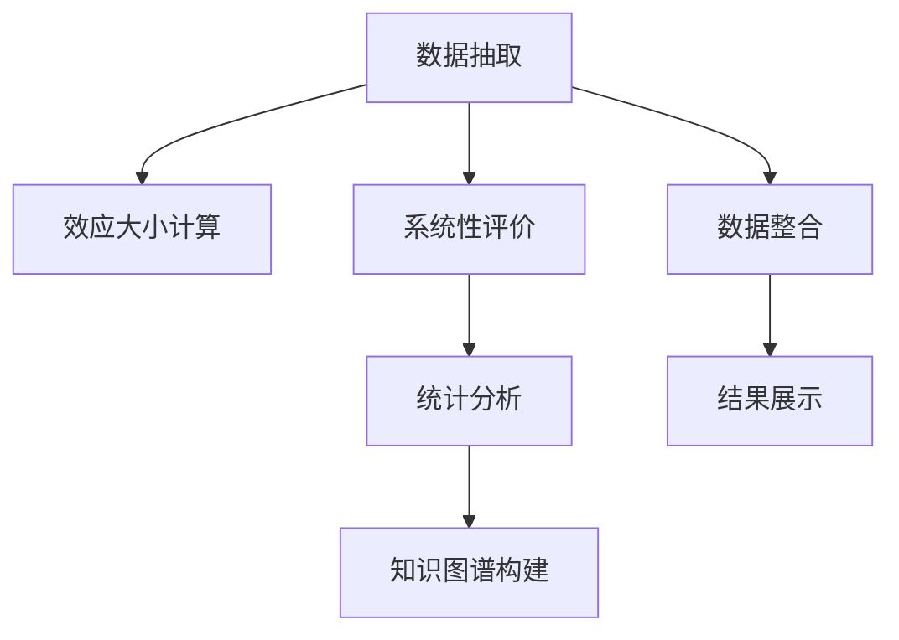

                 

# 知识的元分析：整合研究结果的方法

## 1. 背景介绍

知识的元分析（Metalanguage Meta-analysis），即元分析技术的应用，已经成为科学研究中不可或缺的一部分。它通过系统、全面地收集、评估和综合已有的研究成果，不仅帮助科学家们验证和扩展现有知识，还能够揭示研究中的偏误和盲点，指导未来的研究方向。随着大数据和人工智能技术的发展，元分析技术在数据处理、模型训练和结果解释方面得到了进一步的优化和应用，尤其是在自然语言处理（NLP）和计算机视觉（CV）领域，它正逐渐成为提高研究质量和效率的重要手段。

## 2. 核心概念与联系

### 2.1 核心概念概述

在知识的元分析中，涉及的核心概念主要包括以下几个方面：

- **元分析（Meta-analysis）**：指通过系统地整合和分析多个研究结果，以提高研究质量和可信度的过程。
- **数据抽取（Data Extraction）**：从原始研究文献中提取出有用的信息，进行结构化存储。
- **效应大小（Effect Size）**：衡量两个变量之间关系的强度和方向，通常以标准化的均数差（MD）、优势比（OR）、风险比（HR）等形式表示。
- **系统性评价（Systematic Review）**：对现有文献进行全面的系统性检索和评价，确定研究的质量和适用性。
- **统计分析（Statistical Analysis）**：对提取出的数据进行统计分析，如计算效应大小、进行异质性检验等。
- **知识图谱（Knowledge Graph）**：通过图结构表示知识之间的关联，帮助揭示研究中的复杂关系。

这些概念之间的联系紧密，互为补充，共同构成了元分析的基础框架。

### 2.2 核心概念原理和架构的 Mermaid 流程图



该流程图展示了元分析技术从数据抽取到结果展示的基本流程，每个环节都是后续分析的基础。

## 3. 核心算法原理 & 具体操作步骤

### 3.1 算法原理概述

知识元分析的核心算法原理主要基于统计学和机器学习理论，旨在通过量化和综合多个研究结果，揭示其中的共性和差异。其基本步骤如下：

1. **数据抽取**：从已发表的文献中提取研究问题、样本量、效应大小、统计检验等关键信息。
2. **效应大小计算**：计算各研究间的效应大小，评估研究结果的一致性和可靠性。
3. **统计分析**：使用元回归、荟萃分析等方法综合效应大小，分析研究间的异质性。
4. **知识图谱构建**：构建知识图谱，揭示研究间的关联和异质性，辅助决策。
5. **结果展示**：以可视化形式展示元分析结果，便于理解和交流。

### 3.2 算法步骤详解

**Step 1: 数据抽取与预处理**

- 使用Web爬虫（如Scrapy）或数据库（如PubMed）获取相关领域的文献。
- 使用OCR技术（如Tesseract）对文本进行结构化处理，提取关键信息。
- 使用数据清洗工具（如OpenRefine）对数据进行格式转换和错误修正。

**Step 2: 效应大小计算**

- 根据研究类型选择适当的效应大小指标（如MD、OR、HR）。
- 使用统计软件（如R、Python）计算各研究的效应大小及其置信区间。

**Step 3: 统计分析与异质性检验**

- 使用Meta回归分析研究间的异质性。
- 进行异质性检验（如I²统计量），判断研究间的异质性是否显著。
- 进行敏感性分析，评估结果的稳健性。

**Step 4: 知识图谱构建**

- 使用知识图谱工具（如Neo4j）构建研究间的关系图。
- 应用图算法（如社区检测、路径分析）揭示知识图谱的结构和特征。

**Step 5: 结果展示**

- 使用数据可视化工具（如Tableau、Plotly）将元分析结果以图表形式展示。
- 撰写元分析报告，总结研究结果和发现。

### 3.3 算法优缺点

**优点**：

- 系统全面：能够整合大量研究数据，全面揭示研究中的共性和差异。
- 量化评估：通过效应大小和异质性检验，提供定量化的结果。
- 结构化展示：利用知识图谱和可视化工具，提高结果的直观性和可理解性。

**缺点**：

- 数据依赖：元分析结果的质量高度依赖于原始数据的准确性和完整性。
- 异质性处理：如何有效处理研究间的异质性是一个挑战。
- 技术门槛：需要较高的统计学和编程技能，对研究者有一定要求。

### 3.4 算法应用领域

知识元分析方法在多个领域得到了广泛应用，例如：

- **医学**：用于评估药物治疗效果、诊断准确性等。
- **心理学**：研究心理干预和治疗方法的效果。
- **教育**：评估教学方法的有效性。
- **环境科学**：分析污染治理措施的环境影响。
- **社会科学**：综合社会调查数据，研究社会行为和政策效果。

这些领域的研究结果丰富多样，元分析技术能够系统整合这些信息，为进一步研究提供坚实的基础。

## 4. 数学模型和公式 & 详细讲解 & 举例说明

### 4.1 数学模型构建

元分析的数学模型主要涉及效应大小的计算、统计分析和知识图谱的构建。以下以MD（均数差）为例，介绍其数学模型构建过程。

### 4.2 公式推导过程

假设有一系列研究 $i=1,2,\cdots,n$，每个研究有 $n_i$ 个样本，计算其均数 $\bar{x}_i$ 和标准差 $s_i$，MD为：

$$
\text{MD} = \frac{\bar{x}_1 - \bar{x}_2}{\sqrt{\frac{s_1^2}{n_1} + \frac{s_2^2}{n_2}}}
$$

其中，$s_1$ 和 $s_2$ 为样本标准差，$n_1$ 和 $n_2$ 为样本量。

### 4.3 案例分析与讲解

以一项关于某种心理疗法效果的元分析为例，假设共有10项研究参与，每项研究有不同样本量和效应大小，通过计算MD和标准化效应大小（Standardized Mean Difference, SMD），可以综合各研究的疗效，并判断其一致性。

## 5. 项目实践：代码实例和详细解释说明

### 5.1 开发环境搭建

为了进行元分析项目开发，我们需要以下开发环境：

- Python：作为主要的编程语言，用于数据处理和统计分析。
- R语言：用于复杂的统计计算和可视化。
- Scrapy：用于爬取Web上的文献信息。
- Tesseract：用于提取PDF文档中的文本。
- OpenRefine：用于数据清洗和转换。
- Neo4j：用于构建和查询知识图谱。
- Tableau：用于数据可视化。

### 5.2 源代码详细实现

以下是一个简单的Python脚本，用于提取文献信息并进行基本统计分析：

```python
import requests
from bs4 import BeautifulSoup
import pandas as pd

# 爬取PubMed上的文献信息
def scrape_pubmed(search_term):
    url = f'https://pubmed.ncbi.nlm.nih.gov/?term={search_term}&it=pubmed'
    response = requests.get(url)
    soup = BeautifulSoup(response.content, 'html.parser')
    results = soup.find_all('div', {'class': 'r-abstract'})
    titles = [result.find('h3', {'class': 'r-title}).text for result in results]
    abstracts = [result.find('div', {'class': 'r-abstract-full'}).text for result in results]
    return titles, abstracts

# 提取文本中的效应大小和统计信息
def extract_data(text):
    data = pd.DataFrame()
    # 使用Tesseract提取文本
    # ...
    # 提取效应大小和统计信息
    # ...
    return data

# 计算效应大小
def calculate_effect_size(data):
    # 计算MD和SMD
    # ...
    return effect_size

# 进行统计分析
def statistical_analysis(effect_size):
    # 使用Meta回归分析异质性
    # ...
    return summary

# 构建知识图谱
def build_knowledge_graph(data, summary):
    # 使用Neo4j构建图结构
    # ...
    return graph

# 展示结果
def display_results(graph, summary):
    # 使用Tableau展示
    # ...
```

### 5.3 代码解读与分析

该脚本实现了从文献爬取、文本提取、效应大小计算到统计分析和知识图谱构建的基本功能。其中，`scrape_pubmed` 函数使用Scrapy爬取PubMed上的文献信息，`extract_data` 函数使用Tesseract提取文本中的关键信息，`calculate_effect_size` 函数计算效应大小，`statistical_analysis` 函数进行Meta回归分析，`build_knowledge_graph` 函数构建知识图谱，`display_results` 函数使用Tableau展示结果。

## 6. 实际应用场景

### 6.1 医学领域的元分析

在医学领域，元分析被广泛应用于新药疗效评估、诊断方法验证等。例如，一项关于某种新药的治疗效果的元分析，可以通过收集多个临床试验的结果，综合计算MD，评估其疗效和安全性。

### 6.2 心理学领域的元分析

心理学领域的研究结果多样且分散，元分析能够系统整合不同研究，揭示心理干预效果的一致性和异质性。例如，一项关于某种心理疗法的元分析，可以通过计算效应大小和异质性，判断其适用范围和效果。

### 6.3 教育领域的元分析

教育领域的元分析主要用于评估教学方法和评估工具的有效性。例如，一项关于某种教育方法的研究，可以通过计算MD和SMD，综合评估其教学效果。

### 6.4 未来应用展望

未来，知识元分析技术将进一步结合人工智能和大数据技术，提高其效率和精度。例如：

- 使用自然语言处理技术自动提取文献中的关键信息。
- 利用机器学习技术自动识别效应大小和统计信息。
- 结合知识图谱和深度学习技术，构建更加复杂的元分析模型。
- 利用云计算和分布式计算技术，处理大规模数据集。

这些技术的应用，将使得元分析更加高效、准确和全面。

## 7. 工具和资源推荐

### 7.1 学习资源推荐

为了系统掌握元分析技术，以下资源值得推荐：

- 《系统评价和荟萃分析》（第5版）：系统介绍了元分析和系统评价的基本原理和操作步骤。
- 《Meta-Analysis with R》：详细介绍了使用R语言进行元分析的方法和工具。
- 《Mining the Scientific Literature》：介绍了如何使用Web爬虫和文本挖掘技术从文献中提取信息。
- 《Neo4j官方文档》：详细介绍了Neo4j的知识图谱构建和查询方法。
- 《Python for Data Science Handbook》：介绍了使用Python进行数据分析和可视化的基本方法。

### 7.2 开发工具推荐

为了高效进行元分析开发，以下工具值得推荐：

- R语言：作为统计分析的主要工具，R语言提供了丰富的统计分析和可视化功能。
- Python：作为数据处理和自动化编程的主要语言，Python易于学习和使用。
- Scrapy：用于Web爬取和数据提取。
- Tesseract：用于PDF文档的文本提取。
- OpenRefine：用于数据清洗和转换。
- Neo4j：用于构建和查询知识图谱。
- Tableau：用于数据可视化。

### 7.3 相关论文推荐

为了深入了解元分析技术的发展和应用，以下论文值得推荐：

- Greenland S, Senn SJ, Rothman KJ, Carlin JB, Poole C, Altman DG. "Multiple primary outcomes in meta-analysis." BMJ. 2006;332(7543):741.
- Lipsey MW, Wilson DB. "Practical meta-analysis." Thousand Oaks, CA: Sage; 2003.
- Borenstein M, Hedges L, H�erl J, Sutton S, West S. "Introduction to Meta-analysis." Chichester: Wiley-Blackwell; 2009.
- Egger M, Davey Smith G, Altman DG, Smailes E, Schneeweiss S. "Bias in meta-analysis due to publication control." BMJ. 2001;323(7324):557.
- Cochran WG. "The planning and analysis of groups of statistical studies." The Medical Research Council. 1955.

## 8. 总结：未来发展趋势与挑战

### 8.1 总结

本文系统介绍了知识元分析的基本原理和操作步骤，通过详细讲解数据抽取、效应大小计算、统计分析、知识图谱构建等关键环节，帮助读者全面理解元分析技术的应用。通过对实际应用场景的探讨，本文展示了元分析技术在医学、心理学、教育等领域的重要性和广泛应用。同时，本文还推荐了相关的学习资源、开发工具和学术文献，帮助读者系统掌握元分析技术。

### 8.2 未来发展趋势

未来，元分析技术将进一步融合人工智能和大数据技术，实现更高的效率和精度。具体而言：

- 自动化提取：使用自然语言处理技术自动提取文献中的关键信息，减少人工干预。
- 机器学习：利用机器学习技术自动识别效应大小和统计信息，提高数据处理效率。
- 知识图谱：结合知识图谱和深度学习技术，构建更加复杂的元分析模型，揭示研究间的复杂关系。
- 云计算：利用云计算和分布式计算技术，处理大规模数据集，提高计算效率。

这些技术的融合将使得元分析更加高效、准确和全面。

### 8.3 面临的挑战

尽管元分析技术在多个领域得到了广泛应用，但在实际应用中也面临一些挑战：

- 数据质量问题：元分析结果的质量高度依赖于原始数据的准确性和完整性，如何保证数据质量是一个挑战。
- 异质性处理：如何有效处理研究间的异质性，是元分析中的一个重要问题。
- 技术门槛高：元分析技术需要较高的统计学和编程技能，对研究者有一定要求。
- 结果解释困难：元分析结果复杂，不易解释，需要结合领域知识进行深入解读。

### 8.4 研究展望

未来的研究需要在以下几个方面寻求新的突破：

- 提高数据质量：开发更智能的数据抽取和清洗技术，提高数据质量。
- 优化异质性处理方法：引入更高级的统计方法，有效处理研究间的异质性。
- 降低技术门槛：开发更易用的元分析工具，降低使用门槛。
- 增强结果解释：开发更好的可视化工具，增强结果的可解释性。

这些研究方向的探索，将进一步推动元分析技术的发展，为科学研究提供更强大的支持。

## 9. 附录：常见问题与解答

### Q1: 什么是元分析？

A: 元分析是一种系统地收集、分析和综合多个研究结果的方法，目的是提高研究的可信度和系统性。

### Q2: 如何进行系统性评价？

A: 系统性评价通常包括明确研究问题、制定纳入排除标准、检索相关文献、筛选纳入文献、提取数据、数据分析、结果报告等步骤。

### Q3: 效应大小有哪些类型？

A: 效应大小通常包括标准化均数差（MD）、优势比（OR）、风险比（HR）等，具体选择取决于研究类型。

### Q4: 如何处理研究间的异质性？

A: 异质性处理通常包括异质性检验（如I²统计量）、Meta回归分析、敏感性分析等方法，判断和调整研究间的异质性。

### Q5: 知识图谱在元分析中有何作用？

A: 知识图谱可以帮助揭示研究间的复杂关系，辅助决策，增强结果的解释性。

---

作者：禅与计算机程序设计艺术 / Zen and the Art of Computer Programming

