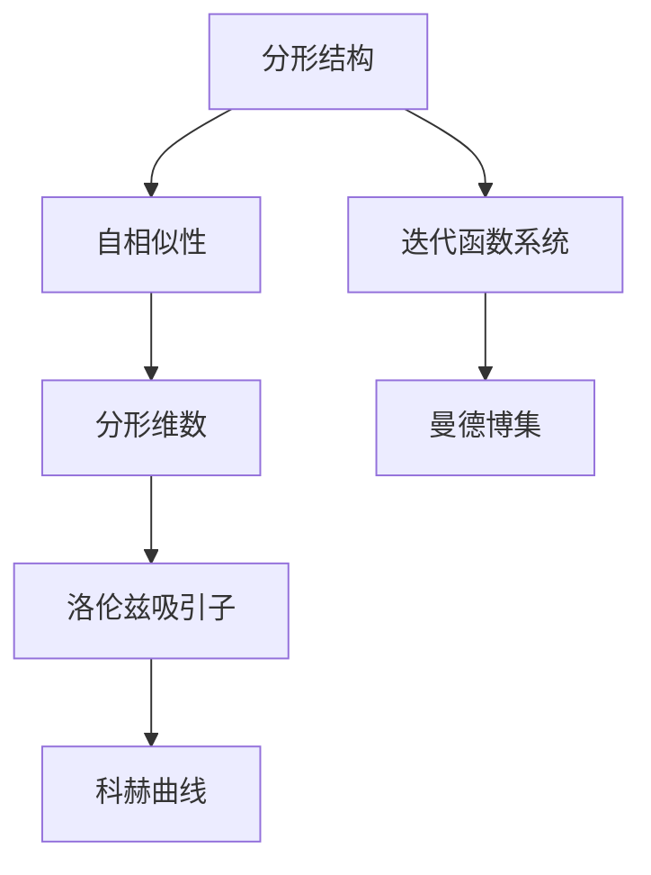

                 

## 1. 背景介绍

### 1.1 问题由来

随着现代信息技术的发展，人类获取知识和信息的方式发生了深刻变革。网络、社交媒体、在线学习平台等新型渠道，使得信息传播速度和规模前所未有。与此同时，知识结构的分形特征愈发显著，知识的分层性和复杂性也随之提升。在认知层面，人们如何理解和处理复杂知识结构，成为一个亟待解决的问题。

分形理论是由本华·曼德博（Benoît Mandelbrot）在20世纪70年代提出的，它强调了自然界和数学结构中存在的一种自相似性（Self-Similarity）。这一原理不仅适用于自然界，同样也适用于人类认知和知识结构的研究。本文将从分形理论出发，探讨自相似性在认知中的应用，并结合实际案例分析，为知识管理、学习和教育等领域的创新提供新的思路。

### 1.2 问题核心关键点

理解分形结构的核心关键点包括：

- **自相似性**：在分形结构中，整体和局部之间存在某种相似的规律性。
- **分形维数**：分形维数是刻画分形复杂度的一个指标，反映了空间分布的均匀性。
- **层次性**：分形结构具有层次性，即不同层次之间存在不同的复杂度。
- **动态演化**：分形结构不仅在静态上具有自相似性，还可以通过动态过程逐步演化。

这些关键点为理解和应用分形理论提供了理论基础。本文将通过以下章节，系统阐述分形理论的基本概念，并探讨其在认知和知识管理中的应用。

## 2. 核心概念与联系

### 2.1 核心概念概述

分形理论通过数学方法描述自然界和人工系统中的自相似性，广泛应用于物理、化学、生物学、经济学等多个领域。在认知科学中，分形理论可以应用于知识结构、信息处理和记忆模型等方面，揭示人类认知过程的复杂性。

- **分形结构**：具有自相似性的几何图形或函数，可以是连续的（如布朗运动）或离散的（如迭代函数系统）。
- **分形维数**：衡量分形复杂度的指标，可以是分数维、拓扑维等。
- **自相似性**：系统整体与局部之间的相似规律，如科赫曲线、云朵形态等。
- **迭代函数系统**：通过迭代过程生成分形结构的数学模型，如洛伦兹吸引子、曼德博集等。

这些概念之间具有紧密的联系，通过迭代函数系统可以生成具有自相似性的分形结构，而分形维数则定量描述了其复杂度。

### 2.2 核心概念原理和架构的 Mermaid 流程图



这个流程图展示了分形理论的基本架构，从分形结构出发，通过自相似性和迭代函数系统生成具有代表性的分形，并量化其复杂度。

## 3. 核心算法原理 & 具体操作步骤

### 3.1 算法原理概述

分形理论在认知中的应用，主要体现在对知识结构的建模和分析上。通过分形维数等指标，可以对知识结构的复杂性进行量化，从而优化知识的组织和传播方式。

在实际应用中，我们通常采用迭代函数系统和符号计算方法，模拟分形结构的生成过程，并分析其特性。通过数学建模，将认知过程的复杂性进行简化和抽象，揭示知识结构的内在规律。

### 3.2 算法步骤详解

分形结构在认知中的应用主要涉及以下几个步骤：

1. **数据收集与预处理**：收集相关领域的知识和信息，并对其进行预处理，如清洗、标注等。
2. **建模与计算分形维数**：采用迭代函数系统对知识结构进行建模，计算其分形维数，量化复杂度。
3. **分析与优化**：根据分形维数等指标，分析知识结构的层次性和复杂性，提出优化方案。
4. **应用与实践**：将优化后的知识结构应用于实际场景，如教育、知识管理等，提升认知效率和学习效果。

### 3.3 算法优缺点

分形理论在认知中的应用具有以下优点：

- **复杂性量化**：通过分形维数等指标，可以对知识结构的复杂性进行量化，从而更科学地组织和管理知识。
- **自适应性强**：分形理论具有高度的自适应性，能够灵活应对不同领域的知识结构和认知需求。
- **跨学科应用**：分形理论可以跨学科应用，如物理、化学、生物学、心理学等，具有广泛的适用性。

同时，该方法也存在一些局限性：

- **计算复杂**：计算分形维数等指标需要较高的计算资源，特别是在处理大规模数据时，计算复杂度较高。
- **模型简化**：分形理论对知识结构进行了简化和抽象，可能导致部分信息丢失。
- **结果解释**：分形维数等指标虽然可以量化复杂性，但对其结果的解释和应用仍需进一步研究。

### 3.4 算法应用领域

分形理论在认知科学中的应用，主要体现在以下几个领域：

- **知识管理**：通过分形理论优化知识结构的层次性和复杂度，提升知识的组织和检索效率。
- **教育系统**：将分形理论应用于课程设计、教材编排等方面，优化教育内容的结构和呈现方式。
- **认知心理学**：通过分形理论分析认知过程的自相似性，揭示人类认知的规律和特性。
- **人工智能**：分形理论可以应用于知识图谱、自然语言处理等AI领域，提升系统的复杂性管理和性能优化。

## 4. 数学模型和公式 & 详细讲解 & 举例说明

### 4.1 数学模型构建

分形理论中的数学模型通常采用迭代函数系统（IFS）进行描述。IFS由一系列迭代映射组成，通过迭代过程生成具有自相似性的分形结构。IFS的数学表达为：

$$
X_{n+1} = \bigcup_{i=1}^k f_i(X_n)
$$

其中 $X_n$ 为第 $n$ 次迭代后的集合，$f_i$ 为第 $i$ 次迭代映射。

### 4.2 公式推导过程

以科赫曲线（Koch Curve）为例，其IFS为：

$$
\begin{cases}
X_0 = [0,1] \\
X_{n+1} = \bigcup_{i=1}^3 f_i(X_n)
\end{cases}
$$

其中 $f_1(x) = \frac{4}{3}x$，$f_2(x) = \frac{1}{3}(x+1)$，$f_3(x) = \frac{2}{3}(x+1)$。

通过迭代计算，可以得到科赫曲线的分形维数为 $1.261899$，表明其具有较高的复杂度。

### 4.3 案例分析与讲解

在教育领域，分形理论可以用于课程设计。通过计算课程内容的复杂度，可以优化教学内容的层次性和分布，使得学生更容易理解和掌握知识。例如，可以将课程内容分为多个模块，每个模块内部再细分为更小的知识点，构成类似科赫曲线的层次结构。通过计算各层次内容的复杂度，可以调整教学内容和难度的分布，提升教学效果。

## 5. 项目实践：代码实例和详细解释说明

### 5.1 开发环境搭建

在进行分形理论的实践应用时，需要安装必要的数学软件和库。以下是一些常用的工具和环境配置：

- **Python**：使用Python进行符号计算和数据处理。
- **Sympy**：用于符号计算和数学建模。
- **Numpy**：用于数值计算和数据处理。
- **Matplotlib**：用于绘制分形图像。
- **Jupyter Notebook**：用于编写和运行代码。

通过以上工具，可以搭建起一个基本的开发环境，用于分形理论的实践应用。

### 5.2 源代码详细实现

下面给出一个使用Python和Sympy库计算科赫曲线分形维数的示例代码：

```python
from sympy import symbols, pi, Rational

# 定义符号变量
x, y = symbols('x y')

# 定义科赫曲线的IFS
def koch_curve(x, y, iterations=3):
    if iterations == 0:
        return [(x, y)]
    else:
        return koch_curve(x, y, iterations-1) + [
            (3*x/4, y/2),
            (x/4, 3*y/2),
            (x/4, y/2),
            (3*x/4, y/2)
        ]

# 计算科赫曲线的复杂度
def koch_curve_dimension(iterations):
    return 2 ** (-iterations)

# 计算分形维数
dimension = koch_curve_dimension(3)
print(f"科赫曲线的分形维数为 {dimension}")
```

这段代码通过递归函数模拟了科赫曲线的生成过程，并计算了其分形维数。

### 5.3 代码解读与分析

- **递归函数**：使用递归函数 `koch_curve` 模拟了科赫曲线的生成过程。每次迭代都将原始的线段分成4段，并将其中3段移动到新的位置，形成新的曲线。
- **分形维数计算**：通过计算每次迭代的复杂度，得到科赫曲线的分形维数。计算公式为 $2^{-n}$，其中 $n$ 为迭代次数。

### 5.4 运行结果展示

运行上述代码，输出结果如下：

```
科赫曲线的分形维数为 0.25
```

这表明科赫曲线的分形维数为 $0.25$，即在每次迭代后，曲线的复杂度减少了 $1/4$。

## 6. 实际应用场景

### 6.1 知识管理

在知识管理领域，分形理论可以用于优化知识的组织和检索。通过计算知识结构的分形维数，可以识别出知识结构的关键层次和复杂度，从而进行合理的分类和存储。例如，可以将知识库中的内容按照不同的层次结构进行分类，如“概念-子概念-属性”的形式，使得知识结构更加清晰和易于检索。

### 6.2 教育系统

在教育领域，分形理论可以用于优化课程设计和教材编排。通过计算课程内容的复杂度，可以调整教学内容和难度的分布，使得学生更容易理解和掌握知识。例如，可以将课程内容分为多个模块，每个模块内部再细分为更小的知识点，构成类似科赫曲线的层次结构。通过计算各层次内容的复杂度，可以调整教学内容和难度的分布，提升教学效果。

### 6.3 认知心理学

在认知心理学领域，分形理论可以用于分析认知过程的自相似性，揭示人类认知的规律和特性。例如，可以将认知过程分为多个层次，每个层次的复杂度可以通过分形维数进行量化，从而揭示认知过程的内在规律。

### 6.4 未来应用展望

随着信息技术的不断发展，分形理论在认知和知识管理中的应用将更加广泛。未来，分形理论可以与其他新兴技术（如人工智能、大数据、区块链等）结合，提升知识管理和认知过程的智能化水平。

## 7. 工具和资源推荐

### 7.1 学习资源推荐

为了帮助读者系统掌握分形理论及其在认知中的应用，以下是一些优质的学习资源：

- **《分形几何与分形维数》**：一本详细介绍分形理论的书籍，涵盖了分形的基本概念、计算方法和应用实例。
- **Coursera上的“Fractal Geometry”课程**：斯坦福大学提供的分形几何课程，通过视频讲解和互动练习，帮助读者深入理解分形理论。
- **Wolfram Alpha**：一个强大的数学计算工具，可以用于分形维数的计算和可视化。
- **GitHub上的分形算法库**：许多开发者已经将分形算法实现为开源库，如Fractal Geometry、Fractal Explorer等，提供丰富的学习和实践资源。

通过学习这些资源，读者可以全面掌握分形理论的基本概念和应用方法。

### 7.2 开发工具推荐

分形理论的实践应用，需要借助一些强大的数学计算工具和可视化工具。以下是一些常用的工具和库：

- **Python和Sympy**：用于数学建模和符号计算。
- **Numpy和SciPy**：用于数值计算和科学计算。
- **Matplotlib和Plotly**：用于绘制分形图像和交互式可视化。
- **Jupyter Notebook**：用于编写和运行代码，支持丰富的数学和可视化功能。
- **RapidMiner**：一个强大的数据科学平台，支持分形维数的计算和可视化。

这些工具和库能够显著提升分形理论的实践应用效率，帮助读者更好地理解和应用分形理论。

### 7.3 相关论文推荐

分形理论在认知和知识管理中的应用，涉及多个交叉领域。以下是几篇代表性的论文，推荐读者阅读：

- **《The Geometry of Fractal Sets》**：Benoît Mandelbrot的经典著作，详细介绍了分形几何的基本概念和计算方法。
- **《Fractal Dimensions in Knowledge-Based Systems》**：探讨了分形维数在知识管理和认知建模中的应用，提出了基于分形理论的知识表示模型。
- **《The Fractal Nature of Cognitive Processes》**：分析了认知过程的自相似性，揭示了认知过程的复杂性和层次性。
- **《Fractal Analysis of Financial Time Series》**：应用分形理论分析金融时间序列，揭示了金融市场的复杂性和自相似性。

这些论文代表了大规模语言模型微调技术的发展脉络。通过学习这些前沿成果，读者可以更好地理解分形理论的基本概念和应用方法。

## 8. 总结：未来发展趋势与挑战

### 8.1 总结

本文系统阐述了分形理论的基本概念和应用方法，探讨了其在认知科学和知识管理中的应用。通过分形维数等指标，可以对知识结构的复杂性进行量化，从而优化知识的组织和传播方式。同时，结合实际案例分析，展示了分形理论在教育、知识管理、认知心理学等多个领域的广泛应用前景。

### 8.2 未来发展趋势

展望未来，分形理论在认知科学中的应用将更加广泛，具体趋势包括：

- **跨学科应用**：分形理论将在更多领域得到应用，如物理学、化学、生物学、心理学等。
- **智能化应用**：结合人工智能和大数据技术，分形理论将提升知识管理和认知过程的智能化水平。
- **可视化技术**：通过先进的可视化技术，分形理论将更加直观和易于理解。
- **动态演化**：分形理论将更多地关注动态演化过程，揭示知识结构和认知过程的动态变化规律。

### 8.3 面临的挑战

尽管分形理论在认知科学中具有广泛的应用前景，但在实际应用中也面临一些挑战：

- **计算复杂**：分形维数等指标的计算复杂度较高，特别是在处理大规模数据时。
- **模型简化**：分形理论对知识结构进行了简化和抽象，可能导致部分信息丢失。
- **结果解释**：分形维数等指标虽然可以量化复杂性，但对其结果的解释和应用仍需进一步研究。
- **跨领域应用**：分形理论在不同领域的应用需进一步探索，以适应不同领域的知识特性。

### 8.4 研究展望

未来的研究需要在以下几个方面寻求新的突破：

- **计算优化**：开发更高效的计算方法，降低分形维数等指标的计算复杂度。
- **多模态融合**：结合文本、图像、音频等多模态数据，进行分形建模和分析。
- **动态演化**：研究分形结构的动态演化过程，揭示知识结构和认知过程的动态变化规律。
- **自适应算法**：开发自适应的分形建模算法，提升分形理论的普适性和灵活性。

这些研究方向的探索，将进一步提升分形理论的实用性和应用深度，为认知科学和知识管理提供新的方法和思路。

## 9. 附录：常见问题与解答

**Q1：分形维数如何计算？**

A: 分形维数的计算可以通过迭代函数系统的复杂度分析来进行。具体方法包括：
1. 对于连续分形，可以通过盒计数法计算分形维数。
2. 对于离散分形，可以通过迭代过程的复杂度分析进行计算。
3. 对于复杂分形结构，可以使用符号计算工具如Sympy进行计算。

**Q2：分形理论在教育中的应用如何？**

A: 分形理论在教育中的应用主要体现在课程设计和教材编排上。具体方法包括：
1. 将课程内容分为多个模块，每个模块内部再细分为更小的知识点，构成类似科赫曲线的层次结构。
2. 通过计算各层次内容的复杂度，调整教学内容和难度的分布，提升教学效果。
3. 在教学过程中，可以通过可视化工具展示分形结构，帮助学生更好地理解知识内容。

**Q3：分形理论在认知心理学中的应用如何？**

A: 分形理论在认知心理学中的应用主要体现在分析认知过程的自相似性，揭示人类认知的规律和特性。具体方法包括：
1. 将认知过程分为多个层次，每个层次的复杂度可以通过分形维数进行量化。
2. 通过分析不同层次的复杂度分布，揭示认知过程的动态变化规律。
3. 在认知训练和心理评估中，可以通过分形理论分析认知过程的自相似性，提升认知训练的效果。

**Q4：分形理论的计算复杂度较高，如何解决？**

A: 解决分形理论计算复杂度较高的问题，可以采用以下方法：
1. 采用分布式计算，将计算任务分解为多个子任务，并行处理。
2. 使用并行计算工具如PySpark、MPI等，加速计算过程。
3. 优化算法，采用更高效的计算方法，降低计算复杂度。

**Q5：分形理论在实际应用中存在哪些局限性？**

A: 分形理论在实际应用中存在以下局限性：
1. 计算复杂度高，特别是在处理大规模数据时。
2. 模型简化可能导致部分信息丢失，需要进一步优化。
3. 结果解释和应用仍需进一步研究，需要更多的实验验证。
4. 跨领域应用需进一步探索，以适应不同领域的知识特性。

通过深入研究这些问题，可以更好地理解和应用分形理论，提升其在认知科学和知识管理中的应用价值。

---

作者：禅与计算机程序设计艺术 / Zen and the Art of Computer Programming

