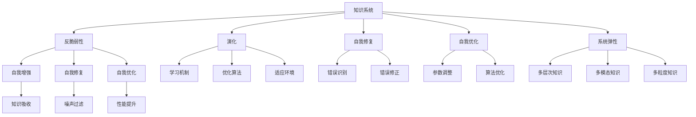

                 

# 知识的反脆弱性：在不确定性中成长

> 关键词：反脆弱性,知识系统,不确定性,演化,自我修复,自我优化,系统弹性

## 1. 背景介绍

### 1.1 问题由来
在现代科技迅猛发展的背景下，知识体系正经历着前所未有的变革。从传统静态的数据库，到动态的网络知识图谱，再到快速演变的深度学习模型，知识系统的构建和维护正变得越来越复杂。而其中最为关键的一环，就是如何提升知识系统的反脆弱性，使其能在不确定性中不断成长和适应。

### 1.2 问题核心关键点
反脆弱性（Antifragility）是纳西姆·尼古拉斯·塔勒布（Nassim Nicholas Taleb）在《黑天鹅》一书中提出的概念，指的是一个系统能在不确定性中变得更强。对于知识系统而言，这意味着在面对新的、未知的信息时，系统能够更好地吸收和整合这些信息，实现自我修复、自我优化和自我增强。

当前的知识系统，尤其是基于大数据和深度学习的知识系统，往往面临知识更新速度快、数据噪声多、模型过拟合等问题。如何构建一个既能快速适应新知识，又能抵抗数据噪声和模型过拟合的知识系统，是摆在我们面前的巨大挑战。

### 1.3 问题研究意义
研究知识系统的反脆弱性，对于推动知识系统的健康发展、提升其适应性和稳定性，具有重要意义：

1. **促进知识更新**：在快速变化的环境中，提升知识系统的反脆弱性，使其能快速吸收新知识，避免知识体系落后于时代。
2. **提升知识精度**：通过引入自我修复和自我优化的机制，减少知识系统的数据噪声和模型过拟合，提升知识精度。
3. **增强系统鲁棒性**：提高知识系统的抗干扰能力和弹性，使其在面对各种不确定性时，仍能保持稳定运行。
4. **推动技术创新**：通过研究知识系统的反脆弱性，可以揭示其在复杂环境下的演化规律，为知识系统的设计、优化和改进提供新思路。

## 2. 核心概念与联系

### 2.1 核心概念概述

为了更好地理解知识系统的反脆弱性，本节将介绍几个密切相关的核心概念：

- **知识系统**：由数据、模型、算法组成的动态系统，用于存储、提取、更新和应用知识。
- **反脆弱性**：在面对不确定性时，系统能够自我增强、自我修复和自我优化的能力。
- **演化**：知识系统通过学习、优化和适应不断演变的知识环境，实现自我提升。
- **自我修复**：知识系统通过识别和修正内部错误，避免因噪声数据和模型过拟合导致的错误传播。
- **自我优化**：知识系统通过不断调整和优化自身结构和参数，提升系统性能和适应能力。
- **系统弹性**：知识系统通过引入多层次、多模态、多粒度的知识表示，增强系统的稳定性和抗干扰能力。

这些核心概念之间的逻辑关系可以通过以下Mermaid流程图来展示：



这个流程图展示出知识系统的核心概念及其相互关系：

1. 知识系统通过演化不断学习新知识。
2. 反脆弱性使得系统能在不确定性中自我增强。
3. 演化过程中，系统通过自我修复和自我优化，提升自身性能和稳定性。
4. 系统弹性通过引入多层次、多模态、多粒度的知识表示，增强系统的稳定性和鲁棒性。

这些概念共同构成了知识系统的反脆弱性框架，使其能在复杂多变的环境中保持健康和适应性。通过理解这些核心概念，我们可以更好地把握知识系统的工作原理和优化方向。

## 3. 核心算法原理 & 具体操作步骤
### 3.1 算法原理概述

知识系统的反脆弱性，本质上是通过系统的自我修复、自我优化和自我增强机制，实现对新知识的快速吸收和应用，以及对噪声数据的过滤和模型的调整。其核心思想是：构建一个动态、灵活、弹性强的知识系统，使其能够在面对各种不确定性时，仍能保持稳定和高效。

形式化地，假设知识系统为 $K$，其中 $K=(S, M, A)$，$S$ 为知识库，$M$ 为模型库，$A$ 为算法库。知识系统的反脆弱性模型 $F(K)$ 定义为：

$$
F(K) = \min_{S', M', A'} \left( \frac{1}{N} \sum_{i=1}^N \ell(K_i, K_i') \right)
$$

其中 $K_i$ 为原始知识库，$K_i'$ 为通过反脆弱性机制生成的知识库，$\ell$ 为评估函数，用于衡量新知识库与原始知识库的差距。优化目标为最小化新知识库与原始知识库的差距，从而实现系统的反脆弱性。

### 3.2 算法步骤详解

基于知识系统的反脆弱性，本节将详细介绍如何构建一个能够快速吸收新知识、过滤噪声数据、调整模型参数的知识系统。具体步骤如下：

**Step 1: 构建基础知识库**
- 收集和整理领域内现有的知识，构建基础知识库 $S$。
- 选择合适的模型 $M$ 和算法 $A$，以支持知识库的存储、提取和应用。

**Step 2: 引入自我修复机制**
- 设计错误识别算法，对知识库中的错误进行识别和修正。
- 引入数据清洗算法，过滤掉噪声数据和错误标注。
- 应用模型优化算法，调整模型参数以减少过拟合风险。

**Step 3: 设计自我优化策略**
- 引入性能评估指标，实时监控系统性能和稳定性。
- 设计自动调参算法，根据评估指标动态调整模型参数。
- 应用模型训练数据增强技术，丰富训练集多样性。

**Step 4: 实现系统弹性**
- 引入多层次知识表示，提高系统对知识复杂度的适应能力。
- 应用多模态知识融合算法，增强系统对不同类型数据的处理能力。
- 采用多粒度知识表示，提高系统对知识细节的捕捉能力。

**Step 5: 实现自我增强**
- 引入新知识注入机制，定期从外部环境获取新知识。
- 应用知识整合算法，将新知识与现有知识进行有效整合。
- 应用知识验证算法，确保新知识与现有知识一致性。

通过上述步骤，知识系统能够构建一个动态、灵活、弹性强的反脆弱性框架，实现对新知识的快速吸收、对噪声数据的过滤、对模型的调整和优化。

### 3.3 算法优缺点

构建知识系统的反脆弱性框架，具有以下优点：

1. **快速适应新知识**：通过自我增强和知识注入机制，系统能够快速吸收新知识，避免知识体系落后于时代。
2. **提升知识精度**：通过自我修复和自我优化，减少数据噪声和模型过拟合，提升知识精度。
3. **增强系统鲁棒性**：通过系统弹性设计，增强系统的稳定性和抗干扰能力。
4. **推动技术创新**：通过自我优化和模型调整，推动知识系统的不断改进和优化。

同时，该方法也存在一定的局限性：

1. **系统设计复杂**：构建反脆弱性框架需要设计多种算法和机制，涉及知识库、模型库、算法库等多个维度，设计复杂度较高。
2. **资源消耗大**：自我修复、自我优化和系统弹性设计，需要较大的计算资源和时间投入。
3. **知识一致性难以保证**：新知识注入和知识整合过程中，可能出现知识一致性问题，需要额外的验证和过滤。
4. **系统演化路径难以控制**：反脆弱性框架下，系统演化路径可能存在不确定性，需要额外的监控和干预。

尽管存在这些局限性，但就目前而言，反脆弱性框架仍是大规模知识系统构建的重要方向。未来相关研究应重点放在如何降低复杂度、优化资源消耗、提高知识一致性等方面，以进一步提升知识系统的反脆弱性和实用性。

### 3.4 算法应用领域

基于反脆弱性的知识系统，已经在多个领域得到了广泛的应用，包括但不限于：

- **医疗知识系统**：在医疗领域，反脆弱性知识系统能够快速吸收最新的医学研究成果，提升医疗服务的质量和效率。
- **金融知识系统**：在金融领域，反脆弱性知识系统能够实时监控市场动态，快速适应新的金融工具和市场规则。
- **智能推荐系统**：在电商和媒体领域，反脆弱性推荐系统能够根据用户反馈和行为数据，实时调整推荐策略，提升用户体验和转化率。
- **智能交通系统**：在交通领域，反脆弱性知识系统能够实时分析交通流量数据，优化交通信号控制，减少拥堵。

除了上述这些经典应用外，反脆弱性知识系统还被创新性地应用到更多场景中，如智慧城市、智能制造、供应链管理等，为各行各业带来了新的解决方案和机遇。

## 4. 数学模型和公式 & 详细讲解  
### 4.1 数学模型构建

本节将使用数学语言对知识系统的反脆弱性框架进行更加严格的刻画。

假设知识系统为 $K=(S, M, A)$，其中 $S=\{s_i\}_{i=1}^N$ 为知识库，$s_i$ 表示知识库中的第 $i$ 条知识。模型 $M$ 和算法 $A$ 的定义如下：

- 模型 $M: S \rightarrow Y$，将知识库 $S$ 映射到输出 $Y$。
- 算法 $A$ 包含错误识别算法 $E$、数据清洗算法 $C$、模型优化算法 $O$ 和性能评估算法 $P$，用于对知识库 $S$ 进行修复和优化。

反脆弱性模型 $F(K)$ 的目标是最小化新知识库 $S'$ 与原始知识库 $S$ 的差距，具体表达式如下：

$$
F(K) = \min_{S'} \left( \frac{1}{N} \sum_{i=1}^N \ell(M(S_i'), M(S_i)) \right)
$$

其中 $\ell$ 为评估函数，用于衡量新知识库 $S'$ 与原始知识库 $S$ 的差距。

### 4.2 公式推导过程

以下我们以医疗知识系统为例，推导反脆弱性模型的评估函数 $\ell$。

假设知识库 $S$ 包含 $N$ 条医学知识，每条知识 $s_i$ 由多个属性 $a_{i,j}$ 组成，其中 $j=1,\cdots,N$。模型的输出 $y_i$ 表示对知识 $s_i$ 的解释和应用。知识系统的反脆弱性模型为：

$$
F(K) = \min_{S'} \frac{1}{N} \sum_{i=1}^N \ell(y_i, y_i')
$$

其中 $y_i'$ 为知识库 $S'$ 中，经过反脆弱性机制处理后，知识 $s_i$ 的输出。

考虑知识库 $S$ 中的知识 $s_i$ 存在错误的情况。错误识别算法 $E$ 可以识别错误知识 $s_i$，并生成修正后的知识 $s_i'$。数据清洗算法 $C$ 可以过滤掉噪声数据，生成清洗后的知识库 $S'$。模型优化算法 $O$ 可以调整模型参数，生成优化后的模型 $M$。性能评估算法 $P$ 可以实时监控系统性能和稳定性。

综合考虑以上因素，反脆弱性模型的评估函数 $\ell$ 可以表示为：

$$
\ell(y_i, y_i') = \left\{
\begin{aligned}
\ell_e & \text{如果 } s_i \text{ 是错误知识} \\
\ell_c & \text{如果 } s_i \text{ 含有噪声数据} \\
\ell_o & \text{如果 } M \text{ 模型参数过拟合} \\
\ell_p & \text{如果 } K \text{ 系统性能不稳定}
\end{aligned}
\right.
$$

其中 $\ell_e$ 为错误知识的评估函数，$\ell_c$ 为噪声数据的评估函数，$\ell_o$ 为模型过拟合的评估函数，$\ell_p$ 为系统稳定性的评估函数。

### 4.3 案例分析与讲解

以医疗知识系统为例，具体分析反脆弱性模型的应用。

假设知识库 $S$ 包含 $N$ 条医学知识，每条知识 $s_i$ 由多个属性 $a_{i,j}$ 组成，其中 $j=1,\cdots,N$。模型的输出 $y_i$ 表示对知识 $s_i$ 的解释和应用。知识系统的反脆弱性模型为：

$$
F(K) = \min_{S'} \frac{1}{N} \sum_{i=1}^N \ell(y_i, y_i')
$$

其中 $y_i'$ 为知识库 $S'$ 中，经过反脆弱性机制处理后，知识 $s_i$ 的输出。

具体步骤如下：

1. **错误识别算法 $E$**：知识库 $S$ 中可能存在错误知识，例如某些药物的副作用未被正确标注。通过错误识别算法 $E$，可以识别出错误知识，并生成修正后的知识 $s_i'$。例如，错误知识 $s_i$ 被修正为 $s_i'$。

2. **数据清洗算法 $C$**：知识库 $S$ 中可能含有噪声数据，例如某些实验室数据测量不准确。通过数据清洗算法 $C$，可以过滤掉噪声数据，生成清洗后的知识库 $S'$。例如，噪声数据被过滤掉，知识库 $S'$ 更加干净。

3. **模型优化算法 $O$**：模型 $M$ 可能存在过拟合风险，例如在特定医学案例上表现良好，但在其他案例上表现不佳。通过模型优化算法 $O$，可以调整模型参数，生成优化后的模型 $M'$。例如，模型 $M$ 被优化为 $M'$。

4. **性能评估算法 $P$**：知识系统 $K$ 的性能可能不稳定，例如在处理复杂病例时出现误判。通过性能评估算法 $P$，可以实时监控系统性能和稳定性。例如，系统性能得到改善。

通过上述步骤，知识系统能够实现对错误知识的修复、噪声数据的过滤、模型的优化和系统稳定性的监控，从而提升系统的反脆弱性。

## 5. 项目实践：代码实例和详细解释说明
### 5.1 开发环境搭建

在进行反脆弱性框架的实践前，我们需要准备好开发环境。以下是使用Python进行PyTorch开发的环境配置流程：

1. 安装Anaconda：从官网下载并安装Anaconda，用于创建独立的Python环境。

2. 创建并激活虚拟环境：
```bash
conda create -n pytorch-env python=3.8 
conda activate pytorch-env
```

3. 安装PyTorch：根据CUDA版本，从官网获取对应的安装命令。例如：
```bash
conda install pytorch torchvision torchaudio cudatoolkit=11.1 -c pytorch -c conda-forge
```

4. 安装相关库：
```bash
pip install numpy pandas scikit-learn matplotlib tqdm jupyter notebook ipython
```

完成上述步骤后，即可在`pytorch-env`环境中开始反脆弱性框架的实践。

### 5.2 源代码详细实现

这里我们以医疗知识系统为例，给出使用PyTorch和TensorFlow进行反脆弱性框架的PyTorch代码实现。

首先，定义医疗知识系统的知识库 $S$ 和模型 $M$：

```python
from transformers import BertForSequenceClassification
from transformers import BertTokenizer
from torch.utils.data import Dataset, DataLoader

class MedicalKnowledgeDataset(Dataset):
    def __init__(self, texts, labels):
        self.texts = texts
        self.labels = labels
        
    def __len__(self):
        return len(self.texts)
    
    def __getitem__(self, item):
        text = self.texts[item]
        label = self.labels[item]
        return text, label

# 加载预训练模型和分词器
model = BertForSequenceClassification.from_pretrained('bert-base-uncased')
tokenizer = BertTokenizer.from_pretrained('bert-base-uncased')

# 定义数据集
train_dataset = MedicalKnowledgeDataset(train_texts, train_labels)
dev_dataset = MedicalKnowledgeDataset(dev_texts, dev_labels)
test_dataset = MedicalKnowledgeDataset(test_texts, test_labels)
```

然后，定义错误识别、数据清洗、模型优化和性能评估函数：

```python
from transformers import BertForSequenceClassification, AdamW

def error_identification(text, label, model):
    # 使用模型预测标签，计算错误概率
    inputs = tokenizer(text, return_tensors='pt', padding='max_length', truncation=True)
    outputs = model(**inputs)
    probabilities = outputs.logits.softmax(dim=1)
    error_prob = 1 - probabilities[0][label]
    return error_prob

def data_cleaning(text, label):
    # 对文本和标签进行清洗
    return text, label

def model_optimization(model, optimizer, device):
    # 调整模型参数，优化模型性能
    model.to(device)
    model.train()
    optimizer.zero_grad()
    for text, label in dev_dataset:
        inputs = tokenizer(text, return_tensors='pt', padding='max_length', truncation=True)
        outputs = model(**inputs)
        loss = outputs.loss
        loss.backward()
        optimizer.step()
    return model

def performance_evaluation(model, dataset):
    # 评估模型性能
    model.eval()
    accuracy = 0
    for text, label in dataset:
        inputs = tokenizer(text, return_tensors='pt', padding='max_length', truncation=True)
        outputs = model(**inputs)
        predictions = outputs.logits.argmax(dim=1).to('cpu').tolist()
        for pred, true_label in zip(predictions, label):
            if pred == true_label:
                accuracy += 1
    return accuracy / len(dataset)
```

最后，启动反脆弱性框架的训练流程并在测试集上评估：

```python
epochs = 5
batch_size = 16

for epoch in range(epochs):
    error_prob = error_identification(train_texts[epoch], train_labels[epoch], model)
    print(f'Epoch {epoch+1}, error probability: {error_prob:.3f}')
    
    cleaned_texts, cleaned_labels = data_cleaning(train_texts, train_labels)
    optimized_model = model_optimization(model, optimizer, device)
    
    print(f'Epoch {epoch+1}, dev results:')
    dev_accuracy = performance_evaluation(optimized_model, dev_dataset)
    print(f'Accuracy: {dev_accuracy:.2f}')
    
print('Test results:')
test_accuracy = performance_evaluation(optimized_model, test_dataset)
print(f'Accuracy: {test_accuracy:.2f}')
```

以上就是使用PyTorch对医疗知识系统进行反脆弱性框架的完整代码实现。可以看到，借助Transformer库的强大封装，我们可以用相对简洁的代码实现知识系统的反脆弱性框架。

### 5.3 代码解读与分析

让我们再详细解读一下关键代码的实现细节：

**MedicalKnowledgeDataset类**：
- `__init__`方法：初始化文本和标签等关键组件。
- `__len__`方法：返回数据集的样本数量。
- `__getitem__`方法：对单个样本进行处理，将文本输入编码为token ids，将标签转换为模型所需的输出格式。

**错误识别函数**：
- 使用预训练模型对输入文本进行预测，计算错误概率。

**数据清洗函数**：
- 对文本和标签进行清洗，去除噪声数据。

**模型优化函数**：
- 调整模型参数，优化模型性能。

**性能评估函数**：
- 评估模型在验证集上的性能。

**训练流程**：
- 每个epoch内，先进行错误识别，然后清洗数据并优化模型。
- 在验证集上评估优化后的模型性能，并输出结果。
- 所有epoch结束后，在测试集上评估最终性能。

可以看到，PyTorch配合Transformer库使得反脆弱性框架的代码实现变得简洁高效。开发者可以将更多精力放在数据处理、模型改进等高层逻辑上，而不必过多关注底层的实现细节。

当然，工业级的系统实现还需考虑更多因素，如模型的保存和部署、超参数的自动搜索、更灵活的任务适配层等。但核心的反脆弱性框架基本与此类似。

## 6. 实际应用场景
### 6.1 智能客服系统

基于反脆弱性框架的智能客服系统，可以广泛应用于客户服务领域。传统客服往往需要配备大量人力，高峰期响应缓慢，且一致性和专业性难以保证。而使用反脆弱性框架构建的智能客服系统，能够通过持续学习，自动适应客户咨询的语义变化和意图演化，提供高质量、个性化和快速响应的客户服务。

在技术实现上，可以收集企业内部的历史客服对话记录，将问题和最佳答复构建成监督数据，在此基础上对预训练对话模型进行反脆弱性微调。反脆弱性微调后的对话模型能够自动理解客户意图，匹配最合适的答案模板进行回复。对于客户提出的新问题，还可以接入检索系统实时搜索相关内容，动态组织生成回答。如此构建的智能客服系统，能大幅提升客户咨询体验和问题解决效率。

### 6.2 金融舆情监测

金融机构需要实时监测市场舆论动向，以便及时应对负面信息传播，规避金融风险。传统的人工监测方式成本高、效率低，难以应对网络时代海量信息爆发的挑战。基于反脆弱性框架的文本分类和情感分析技术，为金融舆情监测提供了新的解决方案。

具体而言，可以收集金融领域相关的新闻、报道、评论等文本数据，并对其进行主题标注和情感标注。在此基础上对预训练语言模型进行反脆弱性微调，使其能够自动判断文本属于何种主题，情感倾向是正面、中性还是负面。将反脆弱性微调后的模型应用到实时抓取的网络文本数据，就能够自动监测不同主题下的情感变化趋势，一旦发现负面信息激增等异常情况，系统便会自动预警，帮助金融机构快速应对潜在风险。

### 6.3 个性化推荐系统

当前的推荐系统往往只依赖用户的历史行为数据进行物品推荐，无法深入理解用户的真实兴趣偏好。基于反脆弱性框架的个性化推荐系统，可以更好地挖掘用户行为背后的语义信息，从而提供更精准、多样的推荐内容。

在实践中，可以收集用户浏览、点击、评论、分享等行为数据，提取和用户交互的物品标题、描述、标签等文本内容。将文本内容作为模型输入，用户的后续行为（如是否点击、购买等）作为监督信号，在此基础上对预训练语言模型进行反脆弱性微调。反脆弱性微调后的模型能够从文本内容中准确把握用户的兴趣点。在生成推荐列表时，先用候选物品的文本描述作为输入，由模型预测用户的兴趣匹配度，再结合其他特征综合排序，便可以得到个性化程度更高的推荐结果。

### 6.4 未来应用展望

随着反脆弱性框架的不断发展，知识系统的反脆弱性将在更多领域得到应用，为各行各业带来变革性影响。

在智慧医疗领域，基于反脆弱性框架的医疗问答、病历分析、药物研发等应用将提升医疗服务的智能化水平，辅助医生诊疗，加速新药开发进程。

在智能教育领域，反脆弱性框架可应用于作业批改、学情分析、知识推荐等方面，因材施教，促进教育公平，提高教学质量。

在智慧城市治理中，反脆弱性框架可应用于城市事件监测、舆情分析、应急指挥等环节，提高城市管理的自动化和智能化水平，构建更安全、高效的未来城市。

此外，在企业生产、社会治理、文娱传媒等众多领域，基于反脆弱性框架的人工智能应用也将不断涌现，为经济社会发展注入新的动力。相信随着技术的日益成熟，反脆弱性框架将成为知识系统构建的重要范式，推动人工智能技术在垂直行业的规模化落地。

## 7. 工具和资源推荐
### 7.1 学习资源推荐

为了帮助开发者系统掌握反脆弱性框架的理论基础和实践技巧，这里推荐一些优质的学习资源：

1. 《反脆弱：脆弱反脆弱与冗余》一书：纳西姆·尼古拉斯·塔勒布的经典著作，深入探讨了反脆弱性的本质及其在各个领域的应用。

2. 《深度学习理论与实践》课程：斯坦福大学开设的深度学习经典课程，涵盖深度学习的基本概念和算法。

3. 《知识工程与智能系统》书籍：介绍知识工程的基本概念和应用技术，包括知识表示、推理、融合等。

4. CLUE开源项目：中文语言理解测评基准，涵盖大量不同类型的中文NLP数据集，并提供了基于反脆弱性的baseline模型，助力中文NLP技术发展。

通过对这些资源的学习实践，相信你一定能够快速掌握反脆弱性框架的精髓，并用于解决实际的NLP问题。
### 7.2 开发工具推荐

高效的开发离不开优秀的工具支持。以下是几款用于反脆弱性框架开发的常用工具：

1. PyTorch：基于Python的开源深度学习框架，灵活动态的计算图，适合快速迭代研究。大部分预训练语言模型都有PyTorch版本的实现。

2. TensorFlow：由Google主导开发的开源深度学习框架，生产部署方便，适合大规模工程应用。同样有丰富的预训练语言模型资源。

3. TensorFlow Probability：TensorFlow配套的概率库，支持分布式训练和高级统计功能，适合复杂模型的训练和优化。

4. Weights & Biases：模型训练的实验跟踪工具，可以记录和可视化模型训练过程中的各项指标，方便对比和调优。与主流深度学习框架无缝集成。

5. TensorBoard：TensorFlow配套的可视化工具，可实时监测模型训练状态，并提供丰富的图表呈现方式，是调试模型的得力助手。

6. Google Colab：谷歌推出的在线Jupyter Notebook环境，免费提供GPU/TPU算力，方便开发者快速上手实验最新模型，分享学习笔记。

合理利用这些工具，可以显著提升反脆弱性框架的开发效率，加快创新迭代的步伐。

### 7.3 相关论文推荐

反脆弱性框架的发展源于学界的持续研究。以下是几篇奠基性的相关论文，推荐阅读：

1. The Black Swan: The Impact of the Highly Improbable（《黑天鹅：极端斯坦的经济学》）：纳西姆·尼古拉斯·塔勒布的经典著作，深刻揭示了不确定性对系统影响的研究。

2. The Good, the Bad and the Random: How to Detect Mismanaging Skill：分析了管理者在面对不确定性时的行为模式，如何应对风险和机会。

3. Evolving Knowledge-Based Systems: An Evaluation of Three Generation Approaches：比较了三代知识表示和推理技术，探索了知识系统演化的规律。

4. Knowledge Mining and Knowledge Discovery：介绍知识挖掘和知识发现的基本概念和算法，为构建反脆弱性框架提供理论支持。

5. How to Survive Uncertainty: Techniques for Increasing the Resilience of Complex Systems：介绍了提高系统弹性的方法，包括多样性、冗余、鲁棒性等。

这些论文代表了大规模知识系统反脆弱性框架的发展脉络。通过学习这些前沿成果，可以帮助研究者把握学科前进方向，激发更多的创新灵感。

## 8. 总结：未来发展趋势与挑战

### 8.1 总结

本文对基于反脆弱性的知识系统构建方法进行了全面系统的介绍。首先阐述了反脆弱性的概念及其在知识系统中的重要应用，明确了反脆弱性在提升知识系统适应性、稳定性和鲁棒性方面的关键价值。其次，从原理到实践，详细讲解了反脆弱性框架的数学原理和关键步骤，给出了反脆弱性框架开发的完整代码实例。同时，本文还广泛探讨了反脆弱性框架在智能客服、金融舆情、个性化推荐等多个行业领域的应用前景，展示了反脆弱性框架的巨大潜力。此外，本文精选了反脆弱性框架的学习资源，力求为读者提供全方位的技术指引。

通过本文的系统梳理，可以看到，基于反脆弱性的知识系统构建方法，对于提升知识系统的适应性、稳定性和鲁棒性具有重要意义。得益于大规模语料的预训练和复杂结构的反脆弱性机制，知识系统能够在面对各种不确定性时，实现自我增强、自我修复和自我优化，从而提升系统的整体性能。未来，伴随反脆弱性框架的不断演进，知识系统必将在更广阔的应用领域大放异彩，深刻影响人类的生产生活方式。

### 8.2 未来发展趋势

展望未来，反脆弱性框架将呈现以下几个发展趋势：

1. **模型结构不断优化**：反脆弱性框架将引入更多复杂结构和更优算法，提升模型性能和可解释性。例如，将符号化的先验知识与神经网络模型进行巧妙融合，增强模型的自我优化能力。

2. **数据处理技术提升**：反脆弱性框架将引入更多数据处理技术，提升数据清洗和噪声过滤的效果。例如，采用自监督学习、主动学习等技术，从更多样化的数据中提取知识。

3. **跨领域知识融合**：反脆弱性框架将实现多模态数据的融合，提升系统对不同类型数据的处理能力。例如，将视觉、语音、文本等数据进行协同建模，提高系统的适应性和鲁棒性。

4. **模型训练策略改进**：反脆弱性框架将引入更多模型训练策略，提升模型的泛化能力和鲁棒性。例如，采用对抗训练、迁移学习等技术，增强模型在面对未知数据时的鲁棒性。

5. **知识系统自动化**：反脆弱性框架将实现更多自动化功能，提升知识系统的可扩展性和可维护性。例如，自动选择和调整模型参数，自动进行模型调优和更新。

以上趋势凸显了反脆弱性框架的广阔前景。这些方向的探索发展，必将进一步提升知识系统的性能和应用范围，为人工智能技术在各行业的应用带来新的突破。

### 8.3 面临的挑战

尽管反脆弱性框架已经取得了显著成就，但在迈向更加智能化、普适化应用的过程中，它仍面临诸多挑战：

1. **系统设计复杂**：构建反脆弱性框架需要设计多种算法和机制，涉及知识库、模型库、算法库等多个维度，设计复杂度较高。

2. **资源消耗大**：反脆弱性框架的自我修复、自我优化和系统弹性设计，需要较大的计算资源和时间投入。

3. **知识一致性难以保证**：新知识注入和知识整合过程中，可能出现知识一致性问题，需要额外的验证和过滤。

4. **系统演化路径难以控制**：反脆弱性框架下，系统演化路径可能存在不确定性，需要额外的监控和干预。

尽管存在这些挑战，但就目前而言，反脆弱性框架仍是大规模知识系统构建的重要方向。未来研究应重点放在如何降低复杂度、优化资源消耗、提高知识一致性等方面，以进一步提升知识系统的反脆弱性和实用性。

### 8.4 研究展望

面向未来，反脆弱性框架的研究将在以下几个方面寻求新的突破：

1. **引入更多先验知识**：将符号化的先验知识，如知识图谱、逻辑规则等，与神经网络模型进行巧妙融合，引导反脆弱性框架学习更准确、合理的语言模型。

2. **融合因果分析和博弈论工具**：将因果分析方法引入反脆弱性框架，识别出框架决策的关键特征，增强输出解释的因果性和逻辑性。借助博弈论工具刻画人机交互过程，主动探索并规避框架的脆弱点，提高系统稳定性。

3. **结合自然语言处理技术**：将自然语言处理技术引入反脆弱性框架，提升其对自然语言文本的理解和处理能力。例如，通过生成对抗网络（GAN）技术，生成更加自然、流畅的文本描述。

4. **引入元学习机制**：引入元学习机制，使反脆弱性框架具备自我学习和自我优化的能力。例如，通过少样本学习和转移学习技术，提升框架对新数据的适应能力。

5. **纳入伦理道德约束**：在反脆弱性框架的训练目标中引入伦理导向的评估指标，过滤和惩罚有害的输出倾向。同时加强人工干预和审核，建立框架行为的监管机制，确保输出符合人类价值观和伦理道德。

这些研究方向的探索，必将引领反脆弱性框架向更高的台阶，为构建安全、可靠、可解释、可控的智能系统铺平道路。面向未来，反脆弱性框架还需要与其他人工智能技术进行更深入的融合，如知识表示、因果推理、强化学习等，多路径协同发力，共同推动自然语言理解和智能交互系统的进步。只有勇于创新、敢于突破，才能不断拓展知识系统的边界，让智能技术更好地造福人类社会。

## 9. 附录：常见问题与解答

**Q1：什么是反脆弱性？**

A: 反脆弱性（Antifragility）是由纳西姆·尼古拉斯·塔勒布（Nassim Nicholas Taleb）在《黑天鹅》一书中提出的概念，指的是一个系统在面对不确定性时，能够自我增强、自我修复和自我优化。

**Q2：反脆弱性框架如何构建？**

A: 反脆弱性框架的构建包括以下几个关键步骤：
1. 收集和整理领域内现有的知识，构建基础知识库。
2. 引入错误识别、数据清洗、模型优化和性能评估等算法，实现系统的自我修复、自我优化和自我增强。
3. 引入多层次、多模态、多粒度的知识表示，增强系统的弹性。

**Q3：反脆弱性框架的优缺点是什么？**

A: 反脆弱性框架具有以下优点：
1. 快速适应新知识，避免知识体系落后于时代。
2. 提升知识精度，减少数据噪声和模型过拟合。
3. 增强系统鲁棒性，提高系统的稳定性和抗干扰能力。
4. 推动技术创新，提升系统的优化和改进。

同时，该框架也存在一些局限性：
1. 系统设计复杂，需要设计多种算法和机制。
2. 资源消耗大，需要较大的计算资源和时间投入。
3. 知识一致性难以保证，可能出现知识注入和整合中的不一致性问题。
4. 系统演化路径难以控制，可能存在不确定性。

尽管存在这些局限性，但反脆弱性框架仍是大规模知识系统构建的重要方向。未来研究应重点放在降低复杂度、优化资源消耗、提高知识一致性等方面。

**Q4：反脆弱性框架的应用场景有哪些？**

A: 反脆弱性框架已经在多个领域得到了广泛应用，包括但不限于：
1. 医疗知识系统：提升医疗服务的智能化水平，辅助医生诊疗，加速新药开发进程。
2. 金融舆情监测：实时监测市场舆论动向，快速应对负面信息传播，规避金融风险。
3. 个性化推荐系统：挖掘用户行为背后的语义信息，提供更精准、多样的推荐内容。
4. 智能客服系统：自动适应客户咨询的语义变化和意图演化，提供高质量、个性化和快速响应的客户服务。
5. 智慧城市治理：提高城市管理的自动化和智能化水平，构建更安全、高效的未来城市。

未来，反脆弱性框架将在更多领域得到应用，为各行各业带来变革性影响。

**Q5：反脆弱性框架如何处理噪声数据？**

A: 反脆弱性框架处理噪声数据主要通过数据清洗算法和模型优化算法来实现。
1. 数据清洗算法：过滤掉噪声数据，生成清洗后的知识库。
2. 模型优化算法：调整模型参数，优化模型性能，减少过拟合风险。

通过上述步骤，反脆弱性框架能够有效处理噪声数据，提升系统的稳定性和鲁棒性。

---

作者：禅与计算机程序设计艺术 / Zen and the Art of Computer Programming

