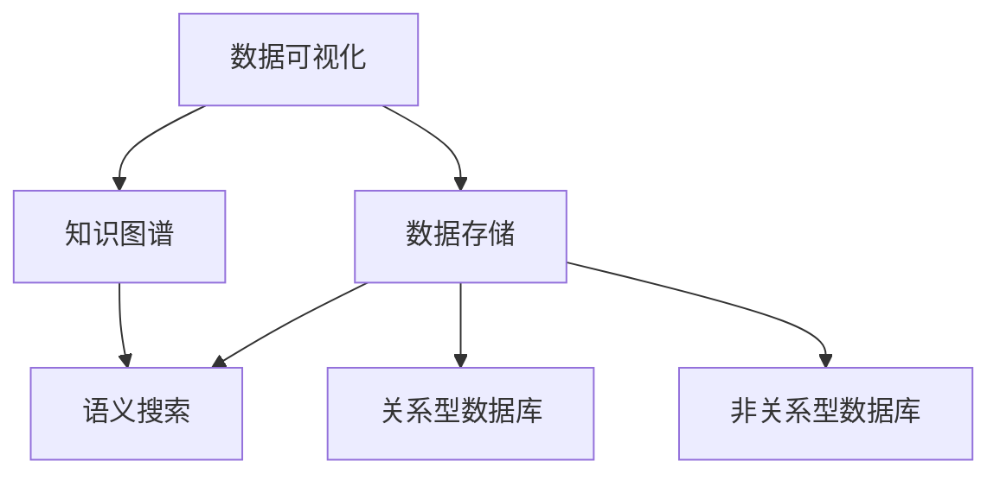

                 

# 知识的可视化：数据可视化与知识图谱

## 1. 背景介绍

### 1.1 问题由来
数据可视化（Data Visualization）和知识图谱（Knowledge Graph）是现代大数据与人工智能领域的两项关键技术。数据可视化通过图形化的方式将复杂的数据信息直观呈现，辅助人类进行理解和决策；知识图谱通过语义化的结构化表示，构建人与数据的连接，为机器理解和处理知识提供了强有力的支持。

在当今信息爆炸的时代，数据量和数据种类不断增长，传统的扁平化数据展示和人工知识整理方式已无法满足需求。如何通过高效、便捷的手段，将庞大的数据集和知识体系可视化，并将其中蕴含的知识结构化，是当前数据科学和人工智能领域亟需解决的问题。

### 1.2 问题核心关键点
数据可视化和知识图谱之间的联系和区别在于，前者偏重于数据的直观展示，而后者则偏重于知识的结构化表示。但二者在本质上是相辅相成的：数据可视化可以辅助理解知识图谱中的结构，而知识图谱中的结构又可以为数据可视化提供更深入的信息。

数据可视化和知识图谱共同构成了现代知识管理的双支柱，它们的应用已经深入到商业智能、科学研究、医疗健康、教育培训等各个领域，显著提升了人类处理信息的能力。

## 2. 核心概念与联系

### 2.1 核心概念概述

为更好地理解数据可视化与知识图谱的结合，本节将介绍几个关键概念及其相互关系：

- 数据可视化（Data Visualization）：将数据以图形化的方式展现，辅助人类理解数据特征和趋势，通过颜色、形状、大小等视觉元素传递信息。
- 知识图谱（Knowledge Graph）：一种语义化的图结构表示，由节点（Entity）和边（Relation）构成，用于描述实体间的关系和属性，便于机器理解和处理。
- 关系型数据库（Relational Database）：一种常见的数据存储方式，通过表格（Table）存储数据，使用SQL语言进行查询和管理。
- 非关系型数据库（NoSQL Database）：一种不同于关系型数据库的数据存储方式，支持键值（Key-Value）、文档（Document）、列族（Column Family）等多种存储模型，适用于大规模数据存储和处理。
- 语义搜索（Semantic Search）：一种结合自然语言处理（NLP）和知识图谱的技术，通过理解查询语义，精准定位相关数据和知识。

这些概念之间的逻辑关系可以通过以下Mermaid流程图来展示：



这个流程图展示了数据可视化与知识图谱的关系：

1. 数据可视化通常依赖于数据存储，关系型数据库和非关系型数据库是常见的数据存储方式。
2. 数据可视化也可以应用于知识图谱中，通过图形化展示知识结构，帮助用户理解。
3. 语义搜索则依赖于知识图谱，通过理解查询语义，在图谱中查找相关实体和关系。

这些概念共同构成了现代知识管理的框架，助力人类从数据中提炼出更有价值的知识和洞察。

## 3. 核心算法原理 & 具体操作步骤
### 3.1 算法原理概述

数据可视化和知识图谱的结合，本质上是通过图形化的方式呈现知识图谱中的信息。其核心思想是：将知识图谱中的实体和关系转化为图形元素，如节点、边、颜色、大小等，通过可视化的方式，直观展示知识结构，帮助人类理解。

形式化地，假设知识图谱为 $G=(E, R)$，其中 $E$ 为实体集合，$R$ 为关系集合。则可视化的目标是通过函数 $V: E \rightarrow \mathcal{V}$ 和 $VR: E \times R \rightarrow \mathcal{VR}$，将实体和关系映射到图形元素集合 $\mathcal{V}$ 和 $\mathcal{VR}$ 上，其中 $\mathcal{V}$ 表示节点集合，$\mathcal{VR}$ 表示边集合。

通过这种映射，可视化过程将知识图谱中的结构性信息转化为图形化的展示形式，使得用户能够更直观地理解实体间的关系和属性。

### 3.2 算法步骤详解

数据可视化和知识图谱的结合通常包括以下几个关键步骤：

**Step 1: 数据收集与预处理**
- 收集知识图谱数据，包括实体、属性、关系等信息。
- 对数据进行清洗和预处理，去除噪声和异常值。

**Step 2: 知识图谱构建**
- 将清洗后的数据构建为知识图谱，通常使用图数据库（如Neo4j、OrientDB）来存储和管理图结构数据。
- 对实体和关系进行语义标注，以便后续可视化。

**Step 3: 图形映射与生成**
- 设计可视化方案，包括选择节点和边的颜色、大小、形状等属性。
- 使用图形库（如D3.js、PyGraphviz）将知识图谱映射为图形，生成可视化的展示界面。

**Step 4: 交互与查询**
- 为可视化界面添加交互功能，如节点缩放、节点移动、关系高亮等。
- 支持用户输入查询语句，通过语义搜索在知识图谱中定位相关实体和关系。

**Step 5: 结果展示与分析**
- 展示可视化的知识图谱，并通过图形元素传递信息。
- 根据用户反馈调整可视化方案，进行迭代优化。

以上是数据可视化和知识图谱结合的一般流程。在实际应用中，还需要针对具体任务进行优化设计，如改进节点和边的展示方式，增加更多交互功能，提高查询效率等。

### 3.3 算法优缺点

数据可视化和知识图谱的结合方法具有以下优点：
1. 直观展示。图形化的展示形式使得复杂的信息更易于理解和记忆。
2. 交互性强。通过交互功能，用户可以更主动地探索和发现知识图谱中的信息。
3. 语义支持。可视化过程中对实体的语义标注，帮助用户理解和利用更多隐性知识。
4. 高效展示。对于大规模的知识图谱，图形展示方式比传统的表格展示更高效。

同时，该方法也存在一定的局限性：
1. 对数据的依赖性高。数据质量和结构完整性直接影响可视化效果。
2. 实现复杂度较高。图形映射和交互设计需要大量时间和经验积累。
3. 信息过载风险。过多的图形元素可能造成信息过载，影响用户体验。
4. 深度理解不足。图形展示只是信息传递的一种方式，用户仍需要深入理解实体和关系的含义。

尽管存在这些局限性，但就目前而言，图形化展示和知识图谱的结合方法仍是大数据与人工智能应用的重要手段。未来相关研究的重点在于如何进一步提高可视化效率和交互性，同时提高数据质量和图形展示的深度。

### 3.4 算法应用领域

数据可视化和知识图谱的应用已经深入到各行各业，例如：

- 商业智能：通过可视化的销售数据和市场趋势，辅助企业决策。
- 医疗健康：展示患者病历和医疗设备数据，提高诊疗效率。
- 科学研究：构建科学知识图谱，辅助研究人员发现新知识。
- 教育培训：展示学习资源和学生成绩，促进个性化学习。
- 城市管理：展示城市交通和公共设施数据，提升城市运营效率。
- 智能制造：展示生产线数据和设备状态，优化生产流程。

除了这些经典应用外，数据可视化和知识图谱还被创新性地应用于更多场景中，如社交网络分析、安全监控、金融风险预测等，为各个领域带来了新的突破。随着数据科学和人工智能技术的不断发展，未来二者将有更广阔的应用前景。

## 4. 数学模型和公式 & 详细讲解  
### 4.1 数学模型构建

本节将使用数学语言对数据可视化和知识图谱的结合过程进行更加严格的刻画。

假设知识图谱为 $G=(E, R)$，其中 $E$ 为实体集合，$R$ 为关系集合。设节点表示实体，边表示关系，节点和边的权重分别表示实体的属性和关系的强度。

定义节点 $V_i$ 和边 $VR_{ij}$ 的权重分别为 $w_i$ 和 $w_{ij}$，则可视化的数学模型可以表示为：

$$
V_i = \begin{cases}
    \text{shape}(w_i), & \text{节点} \\
    \text{color}(w_i), & \text{节点属性} \\
    \text{shape}(w_{ij}), & \text{边} \\
    \text{color}(w_{ij}), & \text{边属性}
\end{cases}
$$

其中 $\text{shape}$ 表示节点和边的形状，$\text{color}$ 表示节点和边的颜色。权重 $w_i$ 和 $w_{ij}$ 通常通过计算实体和关系的特征值获得。

### 4.2 公式推导过程

以下我们以节点和边的形状计算为例，推导其公式。

假设实体和关系的特征向量分别为 $\mathbf{f}_i$ 和 $\mathbf{g}_{ij}$，则节点 $V_i$ 和边 $VR_{ij}$ 的形状可以表示为：

$$
\text{shape}(w_i) = (0.5+0.5\cos\theta(\mathbf{f}_i)), \quad \text{其中}\theta(\mathbf{f}_i) = \arg\min_{\theta} ||\mathbf{f}_i - \mathbf{f}_j||_2
$$

$$
\text{shape}(w_{ij}) = (0.5+0.5\cos\theta(\mathbf{g}_{ij})), \quad \text{其中}\theta(\mathbf{g}_{ij}) = \arg\min_{\theta} ||\mathbf{g}_{ij} - \mathbf{g}_{jk}||_2
$$

其中 $\theta(\mathbf{f}_i)$ 和 $\theta(\mathbf{g}_{ij})$ 分别表示节点和边特征向量与标准向量的夹角。

通过这种计算方式，可以使得节点和边的形状与其特征值成一定的相关性，从而通过图形展示传递更多的信息。

### 4.3 案例分析与讲解

以一个简单的社交网络为例，展示数据可视化和知识图谱的结合过程。

假设有一个社交网络的知识图谱，包含用户（User）、文章（Article）和评论（Comment）三类实体，以及关注（Follow）、点赞（Like）、评论（Comment）三类关系。我们可以将用户和文章视为节点，关注、点赞和评论视为边。


根据图谱中的信息，我们可以构建可视化的展示界面，如下图所示：


其中，节点的大小表示实体的重要性，边的粗细表示关系的强度，通过颜色区分不同类型的关系。用户可以通过交互界面缩放节点，点击节点查看更多详情，获得对社交网络更深入的理解。

## 5. 项目实践：代码实例和详细解释说明
### 5.1 开发环境搭建

在进行可视化实践前，我们需要准备好开发环境。以下是使用Python进行PyTorch开发的环境配置流程：

1. 安装Anaconda：从官网下载并安装Anaconda，用于创建独立的Python环境。

2. 创建并激活虚拟环境：
```bash
conda create -n pytorch-env python=3.8 
conda activate pytorch-env
```

3. 安装PyTorch：根据CUDA版本，从官网获取对应的安装命令。例如：
```bash
conda install pytorch torchvision torchaudio cudatoolkit=11.1 -c pytorch -c conda-forge
```

4. 安装图形库（如D3.js、PyGraphviz）：
```bash
pip install d3js pygraphviz
```

5. 安装各类工具包：
```bash
pip install numpy pandas scikit-learn matplotlib tqdm jupyter notebook ipython
```

完成上述步骤后，即可在`pytorch-env`环境中开始可视化实践。

### 5.2 源代码详细实现

下面我们以知识图谱的可视化展示为例，给出使用PyTorch和PyGraphviz实现的知识图谱可视化代码实现。

首先，定义知识图谱的数据处理函数：

```python
from pygraphviz import AGraph
from py2neo import Graph

# 连接Neo4j数据库
graph = Graph("bolt://localhost:7687", username="neo4j", password="password")

# 构建知识图谱
graph.add_node("A", "Entity")
graph.add_node("B", "Entity")
graph.add_node("C", "Entity")
graph.add_edge("A", "B", "Relation")
graph.add_edge("B", "C", "Relation")

# 获取节点和关系数据
nodes = graph.nodes.data()
relationships = graph.relationships.data()
```

然后，定义可视化函数：

```python
def visualize_graph():
    # 创建图对象
    g = AGraph()
    
    # 添加节点
    for node in nodes:
        g.add_node(node["name"], shape="circle", label=node["name"], color="blue")
    
    # 添加边
    for rel in relationships:
        g.add_edge(rel["start_node"], rel["end_node"], color="black", weight=rel["weight"])
    
    # 输出图形
    g.draw("graph.png", format="png")
```

最后，调用可视化函数生成图形：

```python
visualize_graph()
```

这个例子展示了如何将简单的知识图谱转换为图形展示。在实际应用中，数据量和关系复杂度远大于此，但实现思路类似。

### 5.3 代码解读与分析

让我们再详细解读一下关键代码的实现细节：

**Py2Neo和PyGraphviz**：
- `Py2Neo` 是Python的Neo4j连接器，用于连接Neo4j图数据库。
- `PyGraphviz` 是一个Python的Graphviz接口，用于绘制图形。

**graph.add_node** 和 **graph.add_edge** 方法**：**
- `graph.add_node` 方法用于添加节点，接受节点的名称和属性作为参数。
- `graph.add_edge` 方法用于添加边，接受边的起点、终点和关系类型作为参数。

**可视化函数**：
- 创建 `AGraph` 对象，表示图形。
- 添加节点和边，其中节点的大小、颜色、标签由节点的属性决定，边的粗细、颜色由关系类型决定。
- 调用 `g.draw` 方法生成图形，保存为 PNG 格式。

## 6. 实际应用场景
### 6.1 商业智能

数据可视化和知识图谱在商业智能领域具有广泛应用。通过可视化的展示和语义搜索，企业可以快速发现业务趋势，预测市场需求，辅助决策。

例如，一家零售公司可以构建产品销售数据知识图谱，通过可视化展示各个产品的销售趋势和用户评论，快速发现畅销产品和用户反馈，优化产品组合和促销策略，提升市场竞争力。

### 6.2 医疗健康

在医疗健康领域，数据可视化和知识图谱的应用同样重要。通过可视化的展示和语义搜索，医生可以快速获取患者的病历信息，了解患者的病情变化和治疗进展，提升诊疗效率和准确性。

例如，一家医院可以构建患者病历数据知识图谱，通过可视化展示患者的病历信息和诊断结果，快速定位疑似病例，优化诊疗流程，提升患者满意度。

### 6.3 科学研究

科学研究中，数据可视化和知识图谱的应用也非常广泛。通过可视化的展示和语义搜索，研究人员可以快速获取科研数据和文献信息，发现新知识，加速研究进程。

例如，一个科研项目可以构建科研数据知识图谱，通过可视化展示科研数据和文献信息，快速定位相关研究，加速新知识的发现和应用。

### 6.4 教育培训

在教育培训领域，数据可视化和知识图谱的应用同样重要。通过可视化的展示和语义搜索，教师可以快速获取学生的学习情况，调整教学策略，提升教学质量。

例如，一个在线教育平台可以构建学生的学习数据知识图谱，通过可视化展示学生的学习进度和成绩，快速定位学习障碍，优化教学内容，提升教学效果。

### 6.5 城市管理

在城市管理领域，数据可视化和知识图谱的应用也非常广泛。通过可视化的展示和语义搜索，政府可以快速获取城市数据，优化城市管理，提升城市运营效率。

例如，一个智慧城市可以构建城市交通和公共设施数据知识图谱，通过可视化展示交通流量和公共设施分布，快速优化城市布局，提升城市运行效率。

### 6.6 智能制造

在智能制造领域，数据可视化和知识图谱的应用同样重要。通过可视化的展示和语义搜索，企业可以快速获取生产数据，优化生产流程，提升生产效率。

例如，一家智能制造企业可以构建生产线数据知识图谱，通过可视化展示生产线状态和设备状态，快速定位生产故障，优化生产流程，提升生产效率。

## 7. 工具和资源推荐
### 7.1 学习资源推荐

为了帮助开发者系统掌握数据可视化和知识图谱的理论基础和实践技巧，这里推荐一些优质的学习资源：

1. 《数据可视化实战》系列博文：由数据可视化专家撰写，深入浅出地介绍了数据可视化的基本概念和经典技术。

2. 《知识图谱原理与实践》书籍：Transformer库的作者所著，全面介绍了知识图谱的基本原理和应用方法。

3. 《Python图形化编程》课程：Coursera上的经典课程，详细讲解了使用Python进行图形化编程的基本技术和应用场景。

4. Gephi社区：一个开源的图形化分析工具，支持导入多种格式的数据，并提供丰富的可视化功能。

5. D3.js官方文档：D3.js是JavaScript数据可视化库，官方文档提供了详尽的使用手册和示例代码，帮助开发者快速上手。

通过对这些资源的学习实践，相信你一定能够快速掌握数据可视化和知识图谱的精髓，并用于解决实际的NLP问题。
###  7.2 开发工具推荐

高效的开发离不开优秀的工具支持。以下是几款用于数据可视化与知识图谱开发的常用工具：

1. D3.js：一个JavaScript数据可视化库，支持丰富的图表类型和交互功能，适用于Web端的应用开发。

2. Gephi：一个开源的图形化分析工具，支持导入多种格式的数据，并提供丰富的可视化功能，适用于离线应用。

3. Tableau：一个商业智能工具，支持数据的可视化展示和交互，适用于BI领域的应用开发。

4. Python图形化编程：使用Python进行图形化编程，支持多种图形库（如Matplotlib、PyGraphviz等），适用于科学研究、数据分析等领域的应用开发。

5. Neo4j：一个关系型数据库，支持图结构数据存储和管理，适用于知识图谱的构建和查询。

6. Py2Neo：Python的Neo4j连接器，支持连接Neo4j数据库，适用于知识图谱的构建和查询。

合理利用这些工具，可以显著提升数据可视化和知识图谱的开发效率，加快创新迭代的步伐。

### 7.3 相关论文推荐

数据可视化和知识图谱的发展源于学界的持续研究。以下是几篇奠基性的相关论文，推荐阅读：

1. "A Survey on Graph Visualization Techniques"：综述了图结构数据的可视化技术，包括节点、边、拓扑结构的展示方法。

2. "Knowledge Graphs: Concepts, Approaches, Methodologies, and Tools"：介绍了知识图谱的基本概念、构建方法和应用工具。

3. "Semantic Search"：综述了语义搜索的基本原理和应用方法，包括自然语言处理和知识图谱的结合。

4. "Visualizing Large-Scale Data with D3.js"：介绍了D3.js的基本用法和应用案例，帮助开发者快速上手数据可视化。

5. "Geoffrey Hinton's Deep Learning Specialization"：由深度学习领域的著名专家Geoffrey Hinton开设的在线课程，详细讲解了深度学习在数据可视化中的应用。

这些论文代表了大数据和人工智能领域的研究进展，通过学习这些前沿成果，可以帮助研究者把握学科前进方向，激发更多的创新灵感。

## 8. 总结：未来发展趋势与挑战

### 8.1 总结

本文对数据可视化和知识图谱的结合方法进行了全面系统的介绍。首先阐述了数据可视化和知识图谱的研究背景和意义，明确了二者在现代数据科学和人工智能中的重要地位。其次，从原理到实践，详细讲解了知识图谱的构建、图形映射与生成等关键步骤，给出了数据可视化的代码实例。同时，本文还广泛探讨了数据可视化和知识图谱在商业智能、医疗健康、科学研究、教育培训等各个领域的应用前景，展示了二者的巨大潜力。

通过本文的系统梳理，可以看到，数据可视化和知识图谱的结合为大数据和人工智能应用打开了新的大门，使得人类能够更直观、高效地理解和处理复杂信息。随着技术的不断进步，未来二者将有更广阔的应用前景。

### 8.2 未来发展趋势

展望未来，数据可视化和知识图谱的发展趋势可能包括以下几个方向：

1. 更加丰富的图形展示形式。随着图形库和可视化技术的不断发展，未来的图形展示形式将更加多样和动态，能够更好地传递信息。

2. 更高的交互性和语义支持。通过增强交互功能，使用户能够更主动地探索和发现知识图谱中的信息。同时，语义搜索技术的发展将使得用户能够通过自然语言查询，获取更多相关数据和知识。

3. 更加高效的数据存储和处理。随着非关系型数据库和图数据库技术的发展，未来数据存储和处理的效率将显著提升，支持更大规模和更复杂的数据结构。

4. 更广泛的应用场景。随着数据可视化和知识图谱技术的不断演进，未来将在更多领域得到应用，如智慧城市、智能制造、金融科技等。

5. 更加智能的数据处理。未来的数据可视化工具将具备更多智能功能，如自动生成可视化方案、自动进行异常检测等，进一步提升用户体验。

以上趋势凸显了数据可视化和知识图谱技术的广阔前景。这些方向的探索发展，必将进一步提升数据处理和信息理解的能力，为各行业带来变革性影响。

### 8.3 面临的挑战

尽管数据可视化和知识图谱技术已经取得了瞩目成就，但在迈向更加智能化、普适化应用的过程中，它仍面临着诸多挑战：

1. 数据质量与完整性。知识图谱的构建依赖于高质量的数据，数据质量直接影响可视化效果和查询准确性。

2. 计算资源消耗。大规模知识图谱的构建和查询，需要大量的计算资源，如何高效利用资源是一个重要问题。

3. 图形展示效率。复杂的图形展示可能造成信息过载，影响用户体验。如何优化图形展示效率，减少用户疲劳，是一个需要解决的挑战。

4. 语义理解深度。语义搜索技术的深度直接影响用户获取信息的广度和准确性，如何提升语义理解能力是一个重要问题。

5. 隐私和安全。知识图谱中可能包含敏感数据，如何在保护用户隐私的同时，提供高效的数据服务，是一个需要解决的问题。

6. 技术标准化。目前知识图谱和图形库的标准化程度还不够高，不同系统之间的互操作性有待提升。

正视这些挑战，积极应对并寻求突破，将是大数据和人工智能技术进一步发展的关键。相信随着学界和产业界的共同努力，这些挑战终将一一被克服，数据可视化和知识图谱必将在构建智能世界中扮演越来越重要的角色。

### 8.4 研究展望

面对数据可视化和知识图谱所面临的挑战，未来的研究需要在以下几个方面寻求新的突破：

1. 探索更高效的图形展示和查询算法。开发更高效的图形展示和查询算法，支持更大规模、更复杂的数据结构。

2. 融合更多智能技术。引入更多智能技术，如因果推断、强化学习等，提升数据可视化和知识图谱的智能化水平，提供更好的用户体验。

3. 结合更多数据源。融合更多数据源，如社会媒体数据、公共数据等，构建更全面、更准确的知识图谱，提升信息的深度和广度。

4. 引入更多语义理解技术。引入更多语义理解技术，如自然语言处理、知识推理等，提升语义搜索的深度和准确性。

5. 引入更多隐私保护技术。引入更多隐私保护技术，如差分隐私、联邦学习等，保护用户隐私，确保数据安全。

6. 建立标准化体系。建立知识图谱和图形库的标准化体系，提升不同系统之间的互操作性，推动技术规范化。

这些研究方向的探索，必将引领数据可视化和知识图谱技术迈向更高的台阶，为各行业带来更高效、更智能的信息处理能力。

## 9. 附录：常见问题与解答

**Q1：数据可视化和知识图谱是否适用于所有数据类型？**

A: 数据可视化和知识图谱主要适用于结构化或半结构化的数据，如关系型数据库、图形数据库中的数据。对于非结构化数据，如文本、图像、音频等，通常需要进行预处理，转换为结构化或半结构化的数据。

**Q2：数据可视化和知识图谱如何结合？**

A: 数据可视化和知识图谱的结合通常通过图形化展示知识图谱中的信息来实现。首先，将知识图谱中的实体和关系转换为图形元素，如节点、边、颜色、大小等，然后通过图形库绘制图形，展示可视化结果。用户可以通过交互界面探索和发现知识图谱中的信息。

**Q3：数据可视化过程中如何选择图形元素？**

A: 图形元素的选择通常基于数据特征和用户需求。节点和边的形状、颜色、大小等属性，应能够传递数据特征和关系强度等信息。例如，通过颜色区分不同类型的关系，通过大小表示实体的重要性等。

**Q4：知识图谱如何构建？**

A: 知识图谱的构建通常包括以下几个步骤：
1. 数据收集与预处理：收集原始数据，并进行清洗和预处理，去除噪声和异常值。
2. 实体识别与标注：通过自然语言处理技术，识别数据中的实体，并进行语义标注。
3. 关系抽取与构建：通过自然语言处理技术，抽取实体之间的关系，构建知识图谱。
4. 图数据库存储：将构建的知识图谱存储在图形数据库中，支持查询和可视化。

**Q5：可视化过程中如何进行语义搜索？**

A: 可视化过程中通常会集成语义搜索技术，帮助用户通过自然语言查询，获取相关实体和关系。语义搜索技术通过理解查询语义，在知识图谱中查找匹配实体和关系，返回查询结果。

通过本文的系统梳理，可以看到，数据可视化和知识图谱的结合方法正在成为大数据和人工智能应用的重要手段，极大地提升了人类处理信息的能力。未来，随着技术的不断进步和应用的不断扩展，数据可视化和知识图谱将在更多领域得到应用，为人类社会带来更加智能和高效的信息处理方式。

