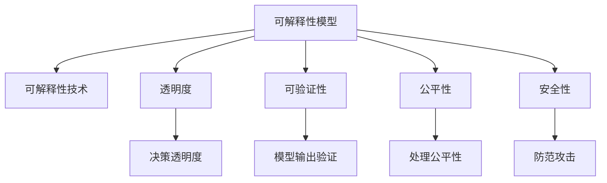

                 

# 知识的可解释性：透明AI的重要性

在人工智能（AI）领域，可解释性（Explainability）和透明性（Transparency）已成为制约AI技术广泛应用的重要瓶颈。无论是在医疗、金融、法律等高风险行业，还是在商业决策、消费者推荐等日常场景中，人们对于AI系统的“黑箱”行为普遍存在疑虑，担心AI的决策过程难以被理解、难以被审查，甚至可能导致错误的结论。因此，构建知识可解释的透明AI系统，不仅是技术发展的必然需求，也是维护用户信任、确保AI系统公平性、安全性与可靠性的重要保障。

## 1. 背景介绍

### 1.1 问题的由来

AI技术的迅猛发展，使得机器学习（Machine Learning, ML）和深度学习（Deep Learning, DL）模型在各个领域的应用越来越广泛。然而，这些复杂模型往往难以被人类理解，其内部的决策逻辑和推理过程被视为“黑箱”，这一现象被称为“AI透明性问题”（AI Transparency Problem）。例如，深度神经网络模型通过多层非线性变换，从原始输入数据中抽取复杂特征，最终输出预测结果。这些模型参数通常包含数亿个可调权重，底层决策过程隐含、复杂且难以解释，导致用户在实际应用中难以对模型输出结果产生信任。

### 1.2 问题核心关键点

AI透明性的核心在于如何使模型的决策过程和推理逻辑可被人类理解、审查和监督。具体包括：

1. **模型可解释性（Model Interpretability）**：通过某种方式使模型的内部参数、特征和推理过程变得可理解，从而降低模型的“黑箱”性质。
2. **决策透明度（Decision Transparency）**：确保模型在做出决策时，其依据的规则和数据来源都是公开且可追溯的。
3. **可验证性（Verifiability）**：模型输出应能被独立验证，以确保其正确性和可靠性。

这些核心关键点要求我们在构建AI系统时，不仅要注重模型的性能，还要考虑其透明性和可解释性。只有透明化的AI，才能获得用户的信任和社会的认可。

## 2. 核心概念与联系

### 2.1 核心概念概述

为了更好地理解AI透明性的相关概念，本节将介绍几个密切相关的核心概念：

- **可解释性模型（Interpretable Model）**：指那些决策过程可被人类理解的模型，如逻辑回归、决策树、线性回归等。
- **可解释性技术（Interpretability Techniques）**：如特征重要性分析、LIME、SHAP等，用于揭示模型内部的决策机制。
- **透明度（Transparency）**：指系统操作过程、决策依据和数据来源的公开程度，透明度越高，信任度越高。
- **可验证性（Verifiability）**：指模型输出结果可以被独立验证，确保其正确性和可靠性。
- **公平性（Fairness）**：指AI系统在处理不同群体数据时，不带有系统性的歧视，保证不同群体用户的平等待遇。
- **安全性（Security）**：指AI系统在面临攻击、篡改或恶意数据输入时，能够确保自身的稳定性和可靠性。

这些核心概念之间的逻辑关系可以通过以下Mermaid流程图来展示：



这个流程图展示了我們的核心概念及其之间的关系：

1. 可解释性模型和可解释性技术共同构成了透明AI的基础。
2. 透明度和决策透明度是透明AI的必要条件，保证了决策依据的公开性。
3. 可验证性和模型输出验证一起，确保了模型结果的正确性和可靠性。
4. 公平性和安全性是透明AI的保障，避免了偏见和攻击带来的风险。

这些概念共同构成了透明AI系统的核心框架，使得AI系统在处理复杂任务时，不仅能够产生正确结果，还能让使用者理解和信任其决策过程。

## 3. 核心算法原理 & 具体操作步骤

### 3.1 算法原理概述

构建知识可解释的透明AI系统，其核心在于将模型的决策过程和特征权重转化为可理解的形式，如可视化、特征重要性分析、模型解释图等。这一过程可以分为以下几个步骤：

1. **模型构建（Model Construction）**：选择合适的可解释性模型，或者通过预训练模型在特定任务上进行微调。
2. **特征提取（Feature Extraction）**：从输入数据中提取关键特征，并计算其对输出结果的贡献度。
3. **模型解释（Model Interpretation）**：将特征贡献度和决策路径可视化，生成解释性图表和报告。
4. **决策验证（Decision Verification）**：对模型输出结果进行独立验证，确保其正确性和可靠性。

### 3.2 算法步骤详解

以下将详细介绍实现知识可解释透明AI的详细步骤：

#### 步骤1：模型构建

选择合适的可解释性模型，或对预训练模型进行特定任务上的微调。常用的可解释性模型包括决策树、线性回归、逻辑回归等。同时，使用预训练模型（如BERT、GPT等）在特定任务上进行微调，可以更好地融合领域知识，提高模型的可解释性。

#### 步骤2：特征提取

从输入数据中提取关键特征，并计算其对输出结果的贡献度。这一步骤通常需要使用特征重要性分析技术，如LIME（Local Interpretable Model-agnostic Explanations）、SHAP（SHapley Additive exPlanations）等。这些技术可以计算每个特征对模型输出结果的贡献，从而帮助我们理解模型在决策过程中依赖的关键因素。

#### 步骤3：模型解释

将特征贡献度和决策路径可视化，生成解释性图表和报告。这一步骤需要使用特征重要性分析结果，生成模型解释图（如决策树、特征重要性图等），直观展示模型的决策逻辑。同时，可以生成详细的特征贡献报告，列出各个特征对模型输出的具体贡献，便于用户理解和审查。

#### 步骤4：决策验证

对模型输出结果进行独立验证，确保其正确性和可靠性。这一步骤通常需要使用测试集对模型进行评估，计算准确率、精确率、召回率等指标，确保模型在不同数据分布下的稳定性和一致性。同时，可以引入对抗样本测试、模型鲁棒性测试等方法，确保模型在面对噪声和攻击时的稳定性。

### 3.3 算法优缺点

#### 优点：

1. **提高用户信任**：通过可解释性技术，使模型决策过程变得透明，用户可以更信任模型的输出结果。
2. **提升模型可靠性**：通过决策验证技术，确保模型输出的正确性和可靠性，减少误判和错误。
3. **降低偏见和歧视**：通过公平性测试，识别和纠正模型中的偏见和歧视，确保模型对不同群体的公平处理。
4. **增强安全性**：通过安全性测试，确保模型在面对攻击和噪声数据时的鲁棒性，减少安全漏洞。

#### 缺点：

1. **增加计算成本**：可解释性技术通常需要额外的计算资源和时间，增加了模型的训练和部署成本。
2. **降低模型效率**：可解释性技术可能引入额外的复杂度，影响模型的推理速度和效率。
3. **解释结果的局限性**：部分可解释性技术存在一定的局限性，解释结果可能不够直观或全面，影响用户理解。

尽管存在这些缺点，但综合考虑其带来的收益，可解释性技术仍然是构建透明AI系统不可或缺的组成部分。

### 3.4 算法应用领域

知识可解释的透明AI技术已经在多个领域得到广泛应用，包括但不限于：

1. **医疗诊断**：通过可解释性技术，使AI辅助诊断系统的决策过程变得透明，增强医生的信任和决策依据。
2. **金融风控**：在金融风控系统中，使用可解释性技术揭示模型的决策依据，确保决策的公平性和可靠性。
3. **法律判决**：在司法系统中，通过可解释性技术，使AI辅助判决系统的决策过程变得透明，增强判决的公平性和公正性。
4. **消费者推荐**：在电商推荐系统中，使用可解释性技术展示推荐依据，增强用户的信任和满意度。
5. **智能制造**：在智能制造系统中，通过可解释性技术揭示模型的决策过程，确保制造过程的稳定性和可靠性。

除了上述这些经典应用外，可解释性技术还在更多场景中得到创新性地应用，如可控决策、智能合约、自动驾驶等，为AI技术的发展带来了新的突破。

## 4. 数学模型和公式 & 详细讲解 & 举例说明

### 4.1 数学模型构建

构建知识可解释的透明AI系统，其数学模型构建通常包括以下几个关键步骤：

1. **模型选择（Model Selection）**：选择合适的可解释性模型，如决策树、线性回归等。
2. **特征选择（Feature Selection）**：从输入数据中提取关键特征，如XGBoost、Lasso等特征选择方法。
3. **模型训练（Model Training）**：使用数据集训练可解释性模型，优化模型的参数。
4. **特征重要性计算（Feature Importance Calculation）**：计算每个特征对模型输出的贡献度。

### 4.2 公式推导过程

以下以LIME（Local Interpretable Model-agnostic Explanations）技术为例，详细讲解其核心算法和公式推导。

#### 公式1：局部可解释性解释

对于给定的输入样本 $x$，LIME使用近似模型 $f_{\epsilon}$ 在局部区域 $\mathcal{N}(x,\epsilon)$ 上生成近似解释。其中，$\epsilon$ 为局部区域大小。

$$
f_{\epsilon}(z) = f(x) + \sum_{i=1}^n \frac{\partial f}{\partial x_i} \delta x_i
$$

其中，$n$ 为输入维度，$\delta x_i$ 为样本 $x$ 与 $z$ 的差值。

#### 公式2：特征贡献度计算

LIME使用线性模型 $g(z)$ 拟合局部解释 $f_{\epsilon}(z)$，计算每个特征对模型输出的贡献度 $w_i$。

$$
w_i = \frac{g(z)}{g(z) - f(x)}
$$

其中，$g(z)$ 为线性模型，$f(x)$ 为原始模型的预测结果。

#### 公式3：全局可解释性解释

通过局部可解释性解释和特征贡献度计算，LIME生成全局可解释性解释，揭示模型的决策路径和特征重要性。

$$
\text{Explanation}(x) = \sum_{i=1}^n w_i x_i
$$

其中，$w_i$ 为每个特征的贡献度，$x_i$ 为输入特征。

### 4.3 案例分析与讲解

以一个简单的线性回归模型为例，展示如何使用LIME技术进行局部可解释性解释。

假设我们有一个线性回归模型 $f(x) = w_1 x_1 + w_2 x_2 + \beta$，其中 $w_1, w_2$ 为模型参数，$\beta$ 为截距。现在我们需要对给定的样本 $x=[1,2]$ 进行局部可解释性解释。

首先，在局部区域 $\mathcal{N}(x,\epsilon)$ 内生成多个样本点 $z=[1+\delta_1, 2+\delta_2]$，其中 $\delta_1,\delta_2$ 为样本 $x$ 与 $z$ 的差值。

接着，使用线性模型 $g(z) = \delta_1 x_1 + \delta_2 x_2 + \beta$ 拟合 $f_{\epsilon}(z)$，计算每个特征的贡献度 $w_i$。

最后，通过 $w_i$ 计算全局可解释性解释，解释模型的决策过程。

## 5. 项目实践：代码实例和详细解释说明

### 5.1 开发环境搭建

在进行知识可解释透明AI的开发前，我们需要准备好开发环境。以下是使用Python进行Scikit-learn和LIME开发的环境配置流程：

1. 安装Anaconda：从官网下载并安装Anaconda，用于创建独立的Python环境。

2. 创建并激活虚拟环境：
```bash
conda create -n explainability-env python=3.8 
conda activate explainability-env
```

3. 安装必要的工具包：
```bash
pip install scikit-learn lime
```

4. 安装其他推荐工具包：
```bash
pip install numpy pandas matplotlib jupyter notebook ipython
```

完成上述步骤后，即可在`explainability-env`环境中开始项目实践。

### 5.2 源代码详细实现

以下是一个使用Scikit-learn和LIME实现局部可解释性解释的Python代码示例：

```python
from sklearn.ensemble import RandomForestClassifier
from sklearn.datasets import load_iris
from lime.lime_tabular import LimeTabularExplainer
from lime.lime_tabular import explainer_choices

# 加载Iris数据集
iris = load_iris()
X = iris.data
y = iris.target

# 创建随机森林分类器
model = RandomForestClassifier(n_estimators=100, random_state=42)

# 训练模型
model.fit(X, y)

# 使用LIME进行局部可解释性解释
explainer = LimeTabularExplainer(X, model.predict_proba, discrete_features=[0, 1, 2])

# 选择解释方法
explainer.set_choice(explainer_choices[0])

# 对给定样本进行解释
explanation = explainer.explain_instance(X[0], model.predict_proba)
print(explanation)
```

以上代码展示了如何使用LIME技术对随机森林分类器进行局部可解释性解释。首先，我们使用Scikit-learn加载Iris数据集，并训练一个随机森林分类器。接着，创建LIME解释器，并选择解释方法。最后，对给定的样本进行解释，输出解释结果。

### 5.3 代码解读与分析

让我们再详细解读一下关键代码的实现细节：

1. **数据加载与模型训练**：我们使用Scikit-learn加载Iris数据集，并使用随机森林分类器进行训练。

2. **创建LIME解释器**：创建LIME解释器，指定输入数据X和模型预测函数predict_proba。

3. **选择解释方法**：从LIME提供的解释方法中选择一种，这里选择了默认解释方法。

4. **解释给定样本**：对给定的样本进行解释，输出解释结果。

### 5.4 运行结果展示

执行上述代码，将输出该样本的局部可解释性解释结果，包括各个特征对模型输出的贡献度。通过这些结果，我们可以直观地理解模型在决策过程中依赖的关键因素。

## 6. 实际应用场景

### 6.1 医疗诊断

在医疗诊断领域，AI系统通过可解释性技术，使医生的诊断过程变得透明，增强了医生的信任和决策依据。例如，AI系统可以对给定的医学影像进行诊断，并给出诊断依据，如病灶的大小、形状、位置等。这些解释结果可以帮助医生更好地理解AI系统的决策过程，提升诊断的准确性和可靠性。

### 6.2 金融风控

在金融风控系统中，AI系统通过可解释性技术，揭示模型的决策依据，确保决策的公平性和可靠性。例如，AI系统可以对客户的信用评分进行预测，并给出评分依据，如还款记录、收入水平等。这些解释结果可以帮助风控人员理解AI系统的决策逻辑，减少误判和错误。

### 6.3 法律判决

在司法系统中，AI系统通过可解释性技术，使判决过程变得透明，增强判决的公平性和公正性。例如，AI系统可以对案件进行判决预测，并给出预测依据，如证据的强度、证人的证词等。这些解释结果可以帮助法官更好地理解AI系统的判决依据，确保判决的公正性和合法性。

### 6.4 未来应用展望

随着可解释性技术的不断发展，其在更多领域的应用前景将更加广阔。以下是一些未来可能的应用场景：

1. **智能合约**：在智能合约中，AI系统通过可解释性技术，使合约条款的解释变得透明，增强合约的可执行性和可信度。

2. **自动驾驶**：在自动驾驶中，AI系统通过可解释性技术，使决策过程变得透明，确保驾驶的安全性和可靠性。

3. **智能推荐**：在电商推荐系统中，AI系统通过可解释性技术，展示推荐依据，增强用户的信任和满意度。

4. **智能制造**：在智能制造中，AI系统通过可解释性技术，揭示决策过程，确保制造过程的稳定性和可靠性。

5. **智能监控**：在智能监控中，AI系统通过可解释性技术，使监控结果变得透明，增强监控的公正性和可信度。

## 7. 工具和资源推荐

### 7.1 学习资源推荐

为了帮助开发者系统掌握知识可解释透明AI的理论基础和实践技巧，这里推荐一些优质的学习资源：

1. 《可解释性机器学习》（Interpretable Machine Learning）一书：由Christopher Molnar所著，全面介绍了可解释性机器学习的基本概念和实用技巧。

2. CS446《机器学习与数据科学》课程：斯坦福大学开设的机器学习课程，有Lecture视频和配套作业，涵盖机器学习和数据科学的多个方面。

3. 《深度学习可解释性》（Explainable AI）课程：由MIT和CSAIL联合推出的深度学习可解释性课程，系统讲解了可解释性技术的基本原理和实践方法。

4. LIME官方网站：提供LIME技术的详细介绍、使用方法和示例代码，是学习LIME技术的最佳资源之一。

5. SHAP官方网站：提供SHAP技术的详细介绍、使用方法和示例代码，是学习SHAP技术的最佳资源之一。

通过对这些资源的学习实践，相信你一定能够快速掌握知识可解释透明AI的精髓，并用于解决实际的AI问题。

### 7.2 开发工具推荐

高效的开发离不开优秀的工具支持。以下是几款用于知识可解释透明AI开发的常用工具：

1. Jupyter Notebook：交互式笔记本环境，方便开发者进行代码编写、数据处理和模型调试。

2. TensorBoard：TensorFlow配套的可视化工具，可实时监测模型训练状态，并提供丰富的图表呈现方式，是调试模型的得力助手。

3. Weights & Biases：模型训练的实验跟踪工具，可以记录和可视化模型训练过程中的各项指标，方便对比和调优。

4. Scikit-learn：Python的科学计算库，包含丰富的机器学习算法和工具，是进行可解释性模型开发的利器。

5. LIME：提供可解释性解释工具，支持多种可解释性技术，包括LIME、SHAP等。

合理利用这些工具，可以显著提升知识可解释透明AI的开发效率，加快创新迭代的步伐。

### 7.3 相关论文推荐

知识可解释透明AI的发展源于学界的持续研究。以下是几篇奠基性的相关论文，推荐阅读：

1. Axiomatic Attribute Explanations for Deep Networks（LIME原论文）：提出LIME技术，用于揭示深度神经网络的局部可解释性，是当前最流行的可解释性技术之一。

2. Deep Learning for Healthcare – Applications and Outcomes（医疗领域可解释性）：讨论深度学习在医疗领域的应用及其解释性需求，强调了透明性在医疗决策中的重要性。

3. A Fairness Tool for Debugging Recommendation Systems（推荐系统公平性）：提出一种公平性工具，用于检测和修复推荐系统中的偏见，确保推荐结果的公平性。

4. Explaining Deep Learning Models and Decision Trees（模型可解释性）：比较了深度学习和决策树在可解释性方面的优势和不足，强调了透明度在决策过程中的必要性。

5. Security and Privacy for Data Mining and Statistical Learning（数据挖掘与学习中的安全与隐私）：讨论了在数据挖掘和机器学习中，如何保障数据安全与隐私，同时保证模型的透明性和可解释性。

这些论文代表了大语言模型微调技术的发展脉络。通过学习这些前沿成果，可以帮助研究者把握学科前进方向，激发更多的创新灵感。

## 8. 总结：未来发展趋势与挑战

### 8.1 总结

本文对知识可解释透明AI进行了全面系统的介绍。首先阐述了透明性在AI系统中的重要性，明确了透明性对用户信任、公平性、安全性和可靠性的保障作用。其次，从原理到实践，详细讲解了知识可解释透明AI的核心算法和操作步骤，提供了代码实现和详细解释。同时，本文还探讨了知识可解释透明AI在多个领域的应用前景，展示了其广阔的发展潜力。

通过本文的系统梳理，可以看到，知识可解释透明AI技术已经成为AI系统开发不可或缺的一部分，其重要性日益凸显。未来，随着技术的发展，知识可解释透明AI必将在更多场景中得到应用，为构建安全、可靠、公平的AI系统提供重要保障。

### 8.2 未来发展趋势

展望未来，知识可解释透明AI技术将呈现以下几个发展趋势：

1. **算法多样化**：未来将出现更多可解释性技术，如LIME、SHAP、Causal Interpretability等，提供更多维度、更丰富的解释方式。

2. **模型泛化性增强**：通过引入更多先验知识、符号化规则等，使模型具备更强的泛化能力和鲁棒性，减少偏见和错误。

3. **多模态融合**：将视觉、语音、文本等多模态信息融合，提升模型的综合解释能力，使其在复杂场景下也能提供高质量的解释结果。

4. **可解释性评估**：建立系统的可解释性评估标准，量化评估模型的透明性和公平性，帮助开发者更好地优化模型。

5. **跨领域应用**：将知识可解释透明AI技术应用到更多领域，如自动驾驶、智能制造、智能合约等，提升AI系统的实用性和可信度。

以上趋势凸显了知识可解释透明AI技术的广阔前景。这些方向的探索发展，必将进一步提升AI系统的性能和应用范围，为构建安全、可靠、公平的智能系统提供重要保障。

### 8.3 面临的挑战

尽管知识可解释透明AI技术已经取得了显著进展，但在实际应用中，仍然面临诸多挑战：

1. **解释结果的可信度**：可解释性结果的准确性和可信度是影响透明性的关键因素，如何确保解释结果的可靠性仍是一个难题。

2. **解释的维度限制**：现有可解释性技术往往只能提供单一维度的解释，难以全面反映模型的决策过程。

3. **解释的技术复杂性**：可解释性技术的实现和应用往往需要较高的技术门槛，增加了模型开发和部署的难度。

4. **解释的实时性**：在实时应用场景中，模型的解释过程需要尽可能快，以确保系统的响应速度。

5. **解释的隐私保护**：在处理敏感数据时，如何平衡解释的透明度和数据的隐私保护，是一个重要的研究课题。

6. **解释的法律合规**：在法律领域应用可解释性技术时，需要确保解释结果符合相关法律法规，避免潜在的法律风险。

正视这些挑战，积极应对并寻求突破，将是大语言模型微调走向成熟的必由之路。相信随着学界和产业界的共同努力，这些挑战终将一一被克服，知识可解释透明AI技术必将在构建安全、可靠、公平的智能系统中扮演越来越重要的角色。

### 8.4 研究展望

面对知识可解释透明AI所面临的挑战，未来的研究需要在以下几个方面寻求新的突破：

1. **引入因果分析**：通过因果分析方法，揭示模型的决策逻辑，增强解释结果的因果性和逻辑性。

2. **多模态解释**：将视觉、语音、文本等多模态信息融合，提升模型的综合解释能力。

3. **跨领域应用**：将知识可解释透明AI技术应用到更多领域，如自动驾驶、智能制造、智能合约等，提升AI系统的实用性和可信度。

4. **隐私保护**：在处理敏感数据时，结合隐私保护技术，确保解释结果的透明性与数据隐私的平衡。

5. **法律合规**：在法律领域应用可解释性技术时，建立法律合规标准，确保解释结果符合相关法律法规。

6. **解释的实时性**：优化解释算法，提升解释结果的实时性，确保系统的响应速度。

这些研究方向的探索，必将引领知识可解释透明AI技术迈向更高的台阶，为构建安全、可靠、公平的智能系统提供重要保障。面向未来，知识可解释透明AI技术还需要与其他AI技术进行更深入的融合，如因果推理、强化学习等，多路径协同发力，共同推动AI技术的发展。

## 9. 附录：常见问题与解答

**Q1：什么是知识可解释性？**

A: 知识可解释性是指将AI系统的决策过程和推理逻辑转化为可理解的形式，使用户能够理解模型的内部工作机制和输出结果的依据。

**Q2：如何进行知识可解释性分析？**

A: 进行知识可解释性分析，首先需要选择合适的可解释性模型或技术，如LIME、SHAP等。然后，使用训练数据集训练模型，提取关键特征，计算每个特征对模型输出的贡献度。最后，将特征贡献度和决策路径可视化，生成解释性图表和报告。

**Q3：知识可解释性有哪些应用场景？**

A: 知识可解释性在多个领域都有广泛应用，包括医疗诊断、金融风控、法律判决、智能推荐等。通过可解释性技术，使AI系统的决策过程变得透明，增强系统的可信度和可靠性。

**Q4：知识可解释性有哪些技术优势？**

A: 知识可解释性的技术优势包括：
1. 提高用户信任：通过可解释性技术，使模型的决策过程变得透明，增强用户的信任和满意度。
2. 提升模型可靠性：通过解释结果的验证，确保模型输出的正确性和可靠性，减少误判和错误。
3. 降低偏见和歧视：通过解释结果的审查，识别和纠正模型中的偏见和歧视，确保模型对不同群体的公平处理。
4. 增强安全性：通过解释结果的验证，确保模型在面对攻击和噪声数据时的稳定性。

**Q5：知识可解释性有哪些挑战？**

A: 知识可解释性面临的挑战包括：
1. 解释结果的可信度：如何确保解释结果的准确性和可靠性，是影响透明性的关键因素。
2. 解释的维度限制：现有可解释性技术往往只能提供单一维度的解释，难以全面反映模型的决策过程。
3. 解释的技术复杂性：可解释性技术的实现和应用往往需要较高的技术门槛，增加了模型开发和部署的难度。
4. 解释的实时性：在实时应用场景中，模型的解释过程需要尽可能快，以确保系统的响应速度。
5. 解释的隐私保护：在处理敏感数据时，如何平衡解释的透明度和数据的隐私保护，是一个重要的研究课题。
6. 解释的法律合规：在法律领域应用可解释性技术时，需要确保解释结果符合相关法律法规，避免潜在的法律风险。

通过对这些问题的回答，相信你一定能够更好地理解知识可解释性技术的重要性和实现方法，并在实际应用中取得更好的效果。

---

作者：禅与计算机程序设计艺术 / Zen and the Art of Computer Programming

