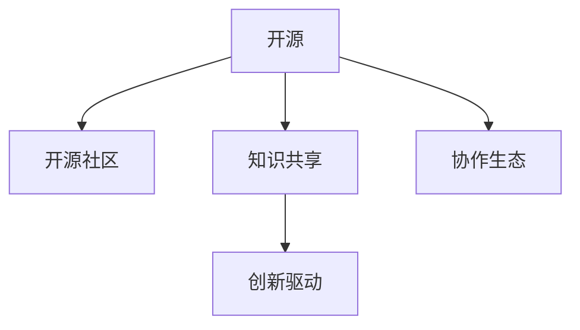

                 

# 知识的开源运动：集体智慧的力量

> 关键词：开源运动, 集体智慧, 知识共享, 技术创新, 创新驱动, 协作生态

## 1. 背景介绍

### 1.1 问题由来

在现代社会中，知识的获取和传播已经变得越来越容易，但这背后隐藏着巨大的信息过载问题。人们面临海量信息的冲击，如何在有限的生命周期内高效筛选和利用知识，成为了一个重要的课题。同时，随着技术的发展，知识的价值在不断提升，无论是企业还是个人，都在积极寻求高效的创新路径。在这种背景下，知识的开源运动应运而生，其本质是对知识资源的重新分配和利用，试图以一种更高效、更公平的方式推动技术进步和社会发展。

### 1.2 问题核心关键点

开源运动的核心在于知识的共享和协作。具体而言，包括以下几个关键点：

1. **知识共享**：通过开源协议，使得知识和代码可以被任何人自由使用、修改和分发。这种模式极大地促进了知识传播和创新。
2. **社区协作**：开源项目往往由全球各地的开发者共同维护，通过在线协作工具和版本控制系统，进行代码审查、问题解决和功能扩展。
3. **持续改进**：开源项目通过不断的迭代和更新，保持了其技术的先进性和实用性，可以快速响应市场变化和用户需求。
4. **多样性**：开源社区中汇聚了来自不同背景、不同技能水平的开发者，带来了多样化的视角和解决方案。

## 2. 核心概念与联系

### 2.1 核心概念概述

为更好地理解知识的开源运动，本节将介绍几个密切相关的核心概念：

- **开源(Open Source)**：指通过开源许可证发布软件和知识的实践，允许用户自由使用、修改和分发。开源不仅限于软件，还包括数据、文档、设计等知识资源。
- **开源社区(Open Source Community)**：指围绕开源项目形成的开发者、用户、组织等组成的社群，通过协作和贡献促进技术发展。
- **知识共享(Knowledge Sharing)**：指通过共享知识和代码，促进技术传播和创新的过程。开源运动是知识共享的重要实践。
- **协作生态(Collaborative Ecosystem)**：指围绕开源项目形成的合作网络，包括开发者、公司、大学、研究机构等，共同推动项目和社区发展。
- **创新驱动(Innovation-Driven)**：指通过不断的技术创新和知识共享，推动技术和产品升级的过程。

这些概念之间的逻辑关系可以通过以下Mermaid流程图来展示：



这个流程图展示了几大核心概念及其之间的关系：

1. 开源运动作为起点，提供了知识共享和协作的基础。
2. 知识共享通过开源实践，促进了技术的传播和创新。
3. 开源社区和协作生态，为知识共享和创新提供了平台和支持。
4. 创新驱动，是开源运动和知识共享的最终目标，推动技术进步和产业发展。

## 3. 核心算法原理 & 具体操作步骤
### 3.1 算法原理概述

知识的开源运动是一个多层次、多维度的过程，涉及知识的获取、共享、利用和创新等多个环节。其核心算法原理可以归纳为以下几个方面：

1. **知识发现**：通过爬虫、API、数据集等手段，从网络和其他资源中自动获取知识。
2. **知识标注**：对获取的知识进行标注和分类，便于后续的搜索和利用。
3. **知识图谱构建**：将标注后的知识构建为知识图谱，形成结构化的知识体系。
4. **知识查询**：通过搜索引擎等工具，快速定位所需知识。
5. **知识传播**：通过博客、论坛、社交媒体等渠道，将知识传播给更广泛的受众。
6. **知识创新**：结合知识图谱和社区协作，进行新知识的生成和验证。

这些步骤共同构成了一个完整的知识开源运动框架。

### 3.2 算法步骤详解

知识的开源运动主要包括以下几个关键步骤：

**Step 1: 知识发现和获取**

- 通过爬虫技术，自动从网页、API、数据库等来源抓取相关知识。
- 使用NLP技术对抓取到的文本进行分析和处理，提取出关键信息。
- 将获取到的知识存储到知识库中，方便后续的检索和利用。

**Step 2: 知识标注和分类**

- 对存储的知识进行标注，定义其主题、类型、来源等信息。
- 使用机器学习算法对知识进行分类，形成不同的知识集合。
- 将标注和分类后的知识，进一步构建知识图谱，形成结构化的知识体系。

**Step 3: 知识传播和共享**

- 通过博客、论坛、社交媒体等渠道，将知识传播给更广泛的受众。
- 使用版本控制系统，如Git、SVN等，记录和分享代码和文档的迭代过程。
- 利用搜索引擎，快速定位和检索所需知识，促进知识共享。

**Step 4: 知识创新和验证**

- 结合知识图谱和社区协作，进行新知识的生成和验证。
- 使用机器学习、数据挖掘等技术，对新知识进行分析和评估。
- 将验证后的新知识发布到开源社区，进一步传播和利用。

### 3.3 算法优缺点

知识的开源运动具有以下优点：

1. **高效传播**：通过开源和共享，知识可以迅速传播到全球各地，促进技术快速迭代和创新。
2. **降低成本**：开源运动降低了知识获取和传播的成本，加速了技术的商业化进程。
3. **多样性**：开源社区汇聚了全球各地、不同背景的开发者和用户，带来了多样化的视角和解决方案。
4. **持续改进**：开源项目通过不断的迭代和更新，保持了技术的先进性和实用性，可以快速响应市场变化和用户需求。

同时，该运动也存在一些局限性：

1. **质量参差不齐**：开源项目中存在大量未经验证或质量不高的代码和知识，需要进行严格的筛选和验证。
2. **缺乏商业激励**：开源项目往往缺乏商业激励，高质量的知识和代码可能需要更多的社区贡献和维护。
3. **知识产权风险**：开源许可协议中存在知识产权风险，可能影响企业的商业决策。
4. **依赖度较高**：开源项目的依赖关系复杂，任何一处代码改动都可能影响整个系统的稳定性。

尽管存在这些局限性，但就目前而言，知识的开源运动已成为推动技术进步和社会发展的重要力量。未来相关研究的重点在于如何进一步提高开源知识的可信赖性和可利用性，同时兼顾知识产权保护和社区激励等关键问题。

### 3.4 算法应用领域

知识的开源运动在多个领域中得到了广泛应用，包括但不限于：

- **软件开发**：开源软件项目（如Linux、Apache等）是知识共享和协作的重要实践。
- **科学研究和学术交流**：Open Access运动推动了学术论文和数据的开放共享，促进了学术交流和技术创新。
- **企业技术创新**：Google、Microsoft等企业通过开源项目（如TensorFlow、PyTorch等），推动了人工智能和机器学习技术的发展。
- **教育和技术培训**：开源教材和课程使得知识和技能的传播更加广泛和高效。
- **工业自动化**：开源工业控制软件和平台，推动了工业自动化和智能制造的进步。

## 4. 数学模型和公式 & 详细讲解 & 举例说明
### 4.1 数学模型构建

知识的开源运动涉及多个学科，包括计算机科学、信息科学、管理科学等。以下是几个核心概念的数学模型构建：

- **知识图谱**：知识图谱可以表示为由节点和边组成的图，其中节点表示实体，边表示实体之间的关系。使用图算法（如PageRank、Greedy Neighbor等）可以高效地搜索和推荐知识。
- **知识标注**：知识标注可以使用向量空间模型（VSM）进行表示，通过TF-IDF等技术进行标注和分类。
- **知识传播模型**：知识传播模型可以采用SIR模型、SEIR模型等，通过模拟传染过程，研究知识传播的效果和趋势。
- **知识创新模型**：知识创新模型可以使用创新扩散模型（如Bass模型），研究新技术和新知识的扩散和应用效果。

### 4.2 公式推导过程

以下是几个核心模型的公式推导过程：

**知识图谱模型**

- 节点表示实体，边表示关系。
- 知识图谱可以用图G(V,E)表示，其中V为节点集合，E为边集合。
- 节点i的度数表示与i直接相连的节点数量，记为$d_i$。
- PageRank算法中，节点的重要性通过其自身和邻居节点的权重来计算，公式为：
  $$
  \mathbf{v}^{t+1} = \frac{\alpha}{c} \mathbf{A} \mathbf{v}^t + (1-\alpha) \frac{1}{N} \mathbf{1}
  $$
  其中$\alpha$为阻尼因子，$c$为所有节点度数之和，$N$为节点总数，$\mathbf{A}$为邻接矩阵，$\mathbf{v}^t$为第t轮迭代后的节点重要性向量。

**知识标注模型**

- 知识标注可以使用向量空间模型（VSM）进行表示，公式为：
  $$
  \mathbf{d} = \sum_{i=1}^{n} \left(\mathbf{w}_i \times \mathbf{t}_i\right)
  $$
  其中$\mathbf{d}$为文档向量，$\mathbf{w}_i$为单词权重向量，$\mathbf{t}_i$为单词出现次数向量。
- TF-IDF算法中，单词权重向量可以表示为：
  $$
  \mathbf{w}_i = \text{tf}_i \times \text{idf}_i
  $$
  其中$\text{tf}_i$为单词在文档中出现的频率，$\text{idf}_i$为逆文档频率。

**知识传播模型**

- SIR模型描述疾病的传播过程，可以用类似的方式描述知识的传播。
- 设$S$、$I$、$R$分别表示易感、感染和恢复节点的数量，$N$为总节点数。
  - 易感节点变为感染节点的概率为$\beta$。
  - 感染节点变为恢复节点的概率为$\gamma$。
  - SIR模型的微分方程为：
    $$
    \frac{dS}{dt} = -\beta \frac{SI}{N}
    $$
    $$
    \frac{dI}{dt} = \beta \frac{SI}{N} - \gamma I
    $$
    $$
    \frac{dR}{dt} = \gamma I
    $$

**知识创新模型**

- Bass模型描述新产品或新技术的扩散过程，可以用类似的方式描述知识创新的扩散。
- 设$C$、$T$分别表示创新产品和技术的接受者和采用者数量，$a$、$b$分别为创新系数和模仿系数。
  - 创新者的概率为$a$。
  - 模仿者的概率为$bt$，其中$t$为时间。
  - Bass模型的微分方程为：
    $$
    \frac{dC}{dt} = a - (a + bt)C + bTC
    $$
    $$
    \frac{dT}{dt} = (a + bt)C - (a + b)T
    $$

### 4.3 案例分析与讲解

**案例1: 开源项目Linux的传播**

Linux操作系统是开源运动的重要实践，其传播过程可以用SIR模型进行建模和分析。Linux通过开源社区的贡献和传播，逐步取代了传统的商业操作系统，成为了许多企业的首选。

**案例2: 学术期刊Open Access**

Open Access运动推动了学术论文的开放共享，使得更多科学家可以自由获取和利用研究成果。这种模式极大地促进了知识的传播和创新，推动了科学研究的进步。

**案例3: TensorFlow和PyTorch的生态**

Google和Facebook分别推出了TensorFlow和PyTorch深度学习框架，通过开源社区的协作和贡献，推动了人工智能技术的发展。这些框架被广泛应用于各个领域，极大地促进了技术创新和应用。

## 5. 项目实践：代码实例和详细解释说明
### 5.1 开发环境搭建

在进行知识开源运动的实践前，我们需要准备好开发环境。以下是使用Python进行PyTorch开发的环境配置流程：

1. 安装Anaconda：从官网下载并安装Anaconda，用于创建独立的Python环境。

2. 创建并激活虚拟环境：
```bash
conda create -n pytorch-env python=3.8 
conda activate pytorch-env
```

3. 安装PyTorch：根据CUDA版本，从官网获取对应的安装命令。例如：
```bash
conda install pytorch torchvision torchaudio cudatoolkit=11.1 -c pytorch -c conda-forge
```

4. 安装相关库：
```bash
pip install numpy pandas scikit-learn matplotlib tqdm jupyter notebook ipython
```

5. 安装TensorBoard：
```bash
pip install tensorboard
```

完成上述步骤后，即可在`pytorch-env`环境中开始实践。

### 5.2 源代码详细实现

这里我们以知识图谱构建为例，给出使用PyTorch进行知识图谱构建的PyTorch代码实现。

```python
import torch
import torch.nn as nn
import torch.nn.functional as F
from torch_geometric.nn import GCNConv

class GraphEncoder(nn.Module):
    def __init__(self, in_dim, hidden_dim, out_dim):
        super(GraphEncoder, self).__init__()
        self.conv1 = GCNConv(in_dim, hidden_dim)
        self.conv2 = GCNConv(hidden_dim, out_dim)
        
    def forward(self, x, edge_index):
        x = self.conv1(x, edge_index)
        x = F.relu(x)
        x = self.conv2(x, edge_index)
        return x

class GraphDecoder(nn.Module):
    def __init__(self, in_dim, out_dim):
        super(GraphDecoder, self).__init__()
        self.fc1 = nn.Linear(in_dim, out_dim)
        self.fc2 = nn.Linear(out_dim, out_dim)
        
    def forward(self, x):
        x = self.fc1(x)
        x = F.relu(x)
        x = self.fc2(x)
        return x

class GraphLinkPredictor(nn.Module):
    def __init__(self, in_dim, out_dim):
        super(GraphLinkPredictor, self).__init__()
        self.encoder = GraphEncoder(in_dim, 64, 64)
        self.decoder = GraphDecoder(64, out_dim)
        
    def forward(self, x, edge_index):
        x = self.encoder(x, edge_index)
        x = self.decoder(x)
        return x

# 数据准备
# 将知识图谱表示为邻接矩阵和节点特征
adj = torch.randn(100, 100)
x = torch.randn(100, 128)

# 定义模型
model = GraphLinkPredictor(128, 2)

# 训练模型
optimizer = torch.optim.Adam(model.parameters(), lr=0.01)
loss_fn = nn.BCEWithLogitsLoss()
for epoch in range(100):
    optimizer.zero_grad()
    logits = model(x, adj)
    loss = loss_fn(logits, y)
    loss.backward()
    optimizer.step()

# 测试模型
x_test = torch.randn(100, 128)
logits = model(x_test, adj)
y_pred = torch.sigmoid(logits)
```

在这个代码中，我们定义了一个基于GCN的图神经网络模型，用于构建知识图谱。模型输入为邻接矩阵和节点特征，输出为边的存在概率。通过优化边存在概率，可以模拟知识图谱的构建过程。

### 5.3 代码解读与分析

让我们再详细解读一下关键代码的实现细节：

**GraphEncoder类**：
- `__init__`方法：初始化GCN卷积层和全连接层。
- `forward`方法：对输入的邻接矩阵和节点特征进行前向传播，通过两个GCN层和全连接层，得到最终的表示向量。

**GraphDecoder类**：
- `__init__`方法：初始化全连接层。
- `forward`方法：对输入的表示向量进行前向传播，得到最终的边存在概率。

**GraphLinkPredictor类**：
- `__init__`方法：初始化编码器和解码器。
- `forward`方法：将输入的邻接矩阵和节点特征传递给编码器，再通过解码器得到边存在概率。

**数据准备**：
- 定义邻接矩阵和节点特征，这里采用随机生成的数据进行演示。

**模型训练和测试**：
- 定义优化器和损失函数，并进行模型的训练。
- 在测试集上，使用模型预测边存在概率，并将结果进行 sigmoid 函数归一化。

这个代码展示了如何使用PyTorch进行知识图谱的构建。通过定义适当的神经网络结构，结合图神经网络技术，可以高效地构建知识图谱，进而促进知识的传播和利用。

## 6. 实际应用场景
### 6.1 智能推荐系统

知识开源运动在智能推荐系统中的应用，可以通过对用户行为数据的建模，实现个性化的知识推荐。推荐系统根据用户的历史行为和偏好，从知识图谱中筛选和推荐相关的知识，使用户能够更加高效地获取有价值的信息。

### 6.2 搜索引擎

搜索引擎是知识传播的重要工具，通过知识标注和分类，可以将搜索结果进行高效排序和推荐。搜索引擎可以根据用户查询的意图，从知识图谱中检索相关知识，提供精确的答案和相关信息。

### 6.3 数据治理

数据治理是大数据应用中的重要环节，通过知识的开源运动，可以构建数据治理的知识图谱。数据治理知识图谱包括数据源、数据流、数据处理流程等，有助于管理和优化数据处理过程，提高数据的质量和利用效率。

### 6.4 未来应用展望

随着知识开源运动的发展，未来的应用场景将更加多样化。以下是几个可能的未来应用方向：

- **智慧城市**：通过知识图谱和城市数据的融合，推动智慧城市建设和智能化治理。
- **医疗健康**：通过知识图谱和医疗数据的结合，推动精准医疗和健康管理。
- **金融科技**：通过知识图谱和金融数据的整合，推动金融分析和决策支持。
- **教育科技**：通过知识图谱和教育数据的融合，推动个性化学习和教育资源优化。

## 7. 工具和资源推荐
### 7.1 学习资源推荐

为了帮助开发者系统掌握知识开源运动的技术基础和实践技巧，这里推荐一些优质的学习资源：

1. **《网络科学引论》**：由著名网络科学家Albert-László Barabási所著，系统介绍了网络科学的理论基础和应用实践。
2. **Coursera《机器学习》课程**：斯坦福大学开设的机器学习课程，涵盖从数据处理到模型训练的全面内容，是学习知识开源运动的重要基础。
3. **TensorFlow官方文档**：Google推出的深度学习框架，提供了丰富的API和教程，适用于知识图谱和深度学习模型的构建。
4. **Kaggle**：全球最大的数据科学竞赛平台，提供丰富的数据集和竞赛项目，是学习和实践知识开源运动的重要平台。
5. **GitHub**：全球最大的开源社区，汇集了海量的开源项目和代码，是学习和实践知识开源运动的重要资源。

通过对这些资源的学习实践，相信你一定能够快速掌握知识开源运动的核心技术和应用方法，并用于解决实际的智能系统问题。

### 7.2 开发工具推荐

高效的开发离不开优秀的工具支持。以下是几款用于知识开源运动开发的常用工具：

1. **Jupyter Notebook**：Python的交互式开发环境，支持多种语言和库，非常适合进行数据探索和模型训练。
2. **PyTorch**：Google开发的深度学习框架，支持GPU加速和自动微分，适用于构建复杂模型和图神经网络。
3. **TensorBoard**：TensorFlow配套的可视化工具，可以实时监测模型训练状态，并提供丰富的图表呈现方式。
4. **Gephi**：网络分析软件，可以可视化复杂的网络结构，帮助理解和分析知识图谱。
5. **Jieba**：中文分词库，支持高效的中文文本处理和分析，适用于中文知识图谱的构建。

合理利用这些工具，可以显著提升知识开源运动任务的开发效率，加快创新迭代的步伐。

### 7.3 相关论文推荐

知识开源运动的发展源于学界的持续研究。以下是几篇奠基性的相关论文，推荐阅读：

1. **《Link Prediction in Knowledge Graphs: A Survey》**：由Pattern Recognition Letters期刊发表，系统总结了知识图谱中的链接预测方法，是知识图谱构建的重要参考资料。
2. **《A Survey on Deep Learning Technologies for Knowledge Graphs》**：由IEEE Transactions on Knowledge and Data Engineering期刊发表，总结了深度学习在知识图谱中的应用，包括图神经网络和知识表示学习等。
3. **《Knowledge Graph Embeddings: A Survey and Overview》**：由IEEE Access期刊发表，系统总结了知识图谱嵌入的方法和效果，是知识图谱嵌入的重要参考资料。
4. **《A Survey of Open Access for Scholarly Journals》**：由Journal of Library and Information Systems期刊发表，总结了Open Access运动的发展和效果，是学术期刊开放共享的重要参考资料。
5. **《Deep Learning in Recommendation Systems: A Survey and Outlook》**：由IEEE Transactions on Systems, Man, and Cybernetics: Systems期刊发表，总结了深度学习在推荐系统中的应用，包括知识图谱和协同过滤等。

这些论文代表了大数据和知识图谱领域的发展脉络。通过学习这些前沿成果，可以帮助研究者把握学科前进方向，激发更多的创新灵感。

## 8. 总结：未来发展趋势与挑战
### 8.1 总结

本文对知识的开源运动进行了全面系统的介绍。首先阐述了知识开源运动的背景和意义，明确了其在知识传播、技术创新和社会发展中的重要作用。其次，从原理到实践，详细讲解了知识发现、标注、传播和创新等关键步骤，给出了知识图谱构建的完整代码实例。同时，本文还广泛探讨了知识开源运动在多个领域的应用前景，展示了其在智能推荐、搜索引擎、数据治理等方面的广阔应用空间。此外，本文精选了知识开源运动的学习资源、开发工具和相关论文，力求为读者提供全方位的技术指引。

通过本文的系统梳理，可以看到，知识的开源运动是一个涉及多学科、多领域的技术过程，极大地推动了知识传播和创新。未来，随着技术的不断进步，知识开源运动将迎来更多的机遇和挑战，需要不断探索和创新，以应对新的发展需求。

### 8.2 未来发展趋势

展望未来，知识开源运动将呈现以下几个发展趋势：

1. **跨领域知识融合**：随着不同领域知识的融合，将形成更加综合、全面的知识图谱，推动跨学科的创新和发展。
2. **大规模数据处理**：随着数据量的不断增长，知识图谱将变得更加庞大和复杂，需要更高效的数据处理和存储技术。
3. **实时知识更新**：知识图谱需要实时更新，以反映最新的知识变化，推动知识的实时传播和应用。
4. **知识图谱的自动化构建**：通过机器学习和自动化技术，将减少知识图谱构建的成本和时间，提高知识传播的效率。
5. **跨平台协作**：不同平台和系统之间的协作和集成，将进一步推动知识开源运动的发展，形成更广泛的协同效应。

以上趋势凸显了知识开源运动的前景和潜力，为知识传播和创新提供了新的方向。

### 8.3 面临的挑战

尽管知识开源运动已经取得了瞩目成就，但在迈向更加智能化、普适化应用的过程中，它仍面临着诸多挑战：

1. **数据质量和标准化**：不同数据源的数据质量和标准差异较大，影响了知识图谱的构建和应用效果。
2. **隐私和安全**：知识图谱中可能包含敏感信息，如何保护用户隐私和数据安全，需要更多的技术和管理手段。
3. **计算资源需求**：大规模知识图谱的构建和维护需要大量的计算资源，如何优化算法和系统架构，降低资源消耗，是一个重要的研究方向。
4. **知识图谱的可解释性**：复杂知识图谱的构建和理解，可能缺乏可解释性，难以对其工作机制和决策逻辑进行分析和调试。
5. **跨领域知识的融合**：不同领域知识的融合需要更高效的方法和工具，如何处理和整合异构知识，需要进一步探索。

尽管存在这些挑战，但知识的开源运动无疑为知识传播和创新提供了广阔的空间，需要不断探索和克服这些障碍，才能更好地推动技术的进步和社会的进步。

### 8.4 研究展望

面对知识开源运动所面临的挑战，未来的研究需要在以下几个方面寻求新的突破：

1. **跨领域知识融合方法**：探索高效的知识图谱构建和融合方法，提升跨领域知识的整合能力。
2. **知识图谱的自动化构建技术**：开发更高效、更可靠的知识图谱自动化构建技术，降低人工成本和错误率。
3. **实时知识图谱系统**：研究实时知识图谱构建和更新的方法，推动知识的实时传播和应用。
4. **知识图谱的可解释性技术**：开发知识图谱的可解释性技术，提升其可理解性和可解释性，便于分析和调试。
5. **知识图谱的安全性和隐私保护**：研究知识图谱的安全性和隐私保护技术，保障数据和用户的安全。

这些研究方向的探索，必将引领知识开源运动走向更高的台阶，为构建智能、高效的知识传播体系铺平道路。面向未来，知识开源运动需要更多技术突破和管理创新，才能更好地应对新的发展需求，推动社会的进步和创新。

## 9. 附录：常见问题与解答

**Q1：知识图谱的构建方法有哪些？**

A: 知识图谱的构建方法主要有以下几种：

1. **基于规则的构建方法**：通过人工定义和标注规则，构建知识图谱。这种方法需要大量人工参与，适用于小规模和结构化数据。
2. **基于统计的构建方法**：通过统计和机器学习算法，自动构建知识图谱。这种方法不需要大量人工参与，但需要大量数据和计算资源。
3. **基于融合的构建方法**：将不同来源的知识融合到知识图谱中，提升知识图谱的全面性和准确性。这种方法需要处理和整合异构数据。

**Q2：知识图谱的存储和查询有哪些方式？**

A: 知识图谱的存储和查询方式主要有以下几种：

1. **RDF存储和查询**：使用RDF（资源描述框架）进行知识图谱的存储和查询，支持语义查询和关联查询。
2. **GraphDB存储和查询**：使用GraphDB等图数据库进行知识图谱的存储和查询，支持高效的图算法和查询优化。
3. **Neo4j存储和查询**：使用Neo4j等图数据库进行知识图谱的存储和查询，支持大规模图算法和分布式计算。
4. **ElasticSearch存储和查询**：使用ElasticSearch等搜索引擎进行知识图谱的存储和查询，支持全文搜索和语义搜索。

**Q3：知识图谱的应用有哪些方向？**

A: 知识图谱的应用方向主要有以下几种：

1. **智能推荐系统**：通过知识图谱和用户行为数据的融合，实现个性化的推荐。
2. **搜索引擎**：通过知识图谱和文本数据的融合，提供精准的搜索结果和相关推荐。
3. **数据治理**：通过知识图谱和数据源的融合，优化数据处理流程，提高数据质量和利用效率。
4. **知识图谱嵌入**：通过知识图谱嵌入技术，将知识图谱转换为低维向量，便于机器学习模型的应用。
5. **跨领域知识融合**：通过知识图谱的跨领域融合，推动不同领域知识的整合和应用。

**Q4：知识开源运动的优势和局限性有哪些？**

A: 知识开源运动的优势和局限性主要有以下几种：

**优势**：

1. **高效传播**：通过开源和共享，知识可以迅速传播到全球各地，促进技术快速迭代和创新。
2. **降低成本**：开源运动降低了知识获取和传播的成本，加速了技术的商业化进程。
3. **多样性**：开源社区汇聚了全球各地、不同背景的开发者和用户，带来了多样化的视角和解决方案。
4. **持续改进**：开源项目通过不断的迭代和更新，保持了技术的先进性和实用性，可以快速响应市场变化和用户需求。

**局限性**：

1. **质量参差不齐**：开源项目中存在大量未经验证或质量不高的代码和知识，需要进行严格的筛选和验证。
2. **缺乏商业激励**：开源项目往往缺乏商业激励，高质量的知识和代码可能需要更多的社区贡献和维护。
3. **知识产权风险**：开源许可协议中存在知识产权风险，可能影响企业的商业决策。
4. **依赖度较高**：开源项目的依赖关系复杂，任何一处代码改动都可能影响整个系统的稳定性。

尽管存在这些局限性，但知识的开源运动无疑为技术进步和社会发展提供了新的方向，需要不断探索和克服这些障碍，才能更好地推动技术的进步和社会的进步。

---

作者：禅与计算机程序设计艺术 / Zen and the Art of Computer Programming

