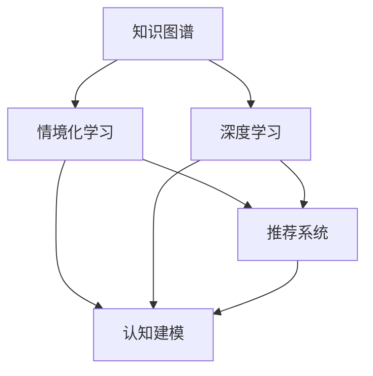

                 

# 知识的情境化：实践中的学习与应用

> 关键词：知识图谱、情境化学习、推荐系统、认知建模、深度学习

## 1. 背景介绍

在快速变化的知识经济时代，知识的获取和应用变得日益复杂。如何有效地从海量信息中提取、组织、应用知识，以支持决策、创新和问题解决，是现代信息管理的重要课题。而随着深度学习技术的兴起，基于知识图谱和深度学习模型的知识管理技术也日益成熟。本文将从知识图谱和深度学习的结合出发，探讨知识的情境化学习与应用。

### 1.1 问题由来

知识管理面临的最大挑战之一是如何在不同情境下有效应用知识。传统知识管理往往依赖人工分类、标签、总结等手段，难以适应动态变化和高度复杂的应用场景。而深度学习技术结合知识图谱，能够更智能地提取、组织和应用知识，提高知识应用的自动化和情境化水平。

### 1.2 问题核心关键点

本节将介绍知识图谱和深度学习在知识情境化学习中的关键点：

- **知识图谱**：基于图结构的知识表示方法，用于刻画实体、关系、属性之间的关系。
- **深度学习**：利用多层神经网络模型，自动学习和提取数据的深层次特征。
- **情境化学习**：根据当前情境，动态选择、应用知识，提升知识应用的灵活性和适应性。
- **推荐系统**：应用深度学习模型，为特定情境下的知识推荐提供支持。
- **认知建模**：结合心理学、认知科学理论，对知识应用过程进行建模，提升模型解释性和可用性。

## 2. 核心概念与联系

### 2.1 核心概念概述

为了更好地理解知识的情境化学习与应用，本节将介绍几个密切相关的核心概念：

- **知识图谱**：以图结构表示知识，通过实体、关系、属性等节点和边来构建知识体系。常见的知识图谱构建方法包括数据抽取、众包、自动生成等。

- **深度学习**：通过多层神经网络模型，自动学习和提取数据的深层次特征，包括卷积神经网络(CNN)、循环神经网络(RNN)、变分自编码器(VAE)、图神经网络(GNN)等。

- **情境化学习**：根据当前情境，动态选择和应用知识，以提高知识应用的灵活性和适应性。情境化学习包括基于规则、基于实例、基于模型等方法。

- **推荐系统**：利用深度学习模型，为特定情境下的知识推荐提供支持。推荐系统包括基于协同过滤、内容过滤、混合过滤等方法。

- **认知建模**：结合心理学、认知科学理论，对知识应用过程进行建模，提升模型的解释性和可用性。常见的认知建模方法包括基于行为学、基于表征学的模型等。

这些核心概念之间的逻辑关系可以通过以下Mermaid流程图来展示：



这个流程图展示知识图谱和深度学习在知识情境化学习中的核心概念及其之间的关系：

1. 知识图谱通过深度学习进行知识抽取和表示。
2. 深度学习模型结合情境化学习进行动态知识选择。
3. 情境化学习通过推荐系统进行个性化知识推荐。
4. 认知建模对知识应用过程进行建模和解释。

这些概念共同构成了知识情境化学习的框架，使知识管理更加智能、灵活和可靠。通过理解这些核心概念，我们可以更好地把握知识情境化学习的本质和实践方法。

## 3. 核心算法原理 & 具体操作步骤

### 3.1 算法原理概述

知识的情境化学习与应用，本质上是将知识图谱与深度学习模型结合，构建一个动态的知识应用系统。其核心思想是：根据当前情境，通过深度学习模型自动提取和组织知识，并应用到具体任务中，以提升知识应用的灵活性和准确性。

形式化地，假设知识图谱为 $\mathcal{G}=(\mathcal{E},\mathcal{R},\mathcal{A})$，其中 $\mathcal{E}$ 为实体集合，$\mathcal{R}$ 为关系集合，$\mathcal{A}$ 为属性集合。定义深度学习模型为 $M_{\theta}$，其中 $\theta$ 为模型参数。情境化学习的目标是找到最优的参数 $\hat{\theta}$，使得模型在特定情境下的预测性能最大化。

设情境为 $s$，模型对情境 $s$ 的预测结果为 $y$。则情境化学习的目标函数为：

$$
\mathcal{L}(\theta,s) = \min_{\theta} \frac{1}{N} \sum_{i=1}^N \ell(y_i, \hat{y}_i)
$$

其中 $\ell$ 为损失函数，$\hat{y}_i$ 为模型在情境 $s$ 下的预测结果，$y_i$ 为真实标签。

通过梯度下降等优化算法，情境化学习不断更新模型参数 $\theta$，最小化经验风险，使得模型在特定情境下能够准确地应用知识。

### 3.2 算法步骤详解

知识的情境化学习与应用一般包括以下几个关键步骤：

**Step 1: 准备知识图谱和深度学习模型**
- 构建或收集知识图谱，划分为实体、关系、属性等节点和边。
- 选择合适的深度学习模型，如关系抽取模型、知识图谱嵌入模型等，作为情境化学习的基础。

**Step 2: 设计情境化学习框架**
- 定义情境化学习的任务，如实体关系抽取、知识推荐等。
- 设计情境识别模块，用于从数据中提取和表示当前情境。
- 设计知识选择模块，用于根据情境动态选择知识图谱中的相关知识。
- 设计知识应用模块，用于将知识应用于具体任务。

**Step 3: 训练和优化模型**
- 收集标注数据，划分为训练集、验证集和测试集。
- 使用深度学习模型对标注数据进行预训练。
- 使用情境化学习框架对预训练模型进行微调，最小化损失函数。
- 在验证集上评估模型性能，调整模型参数。

**Step 4: 应用情境化学习**
- 在实际应用中，实时获取情境信息。
- 根据情境动态选择知识图谱中的知识。
- 应用知识到具体任务，如推荐、问答、分析等。
- 收集反馈信息，持续优化情境化学习框架。

### 3.3 算法优缺点

知识的情境化学习与应用具有以下优点：
1. 智能灵活。通过深度学习自动抽取和应用知识，适应性强，灵活度高。
2. 精度高。深度学习模型能够自动提取数据的深层次特征，提升预测准确性。
3. 动态应用。根据情境动态选择知识，提高知识应用的时效性和相关性。
4. 情境感知。通过认知建模，赋予知识应用更强的情境感知能力。

同时，该方法也存在一定的局限性：
1. 知识图谱构建复杂。知识图谱的构建需要大量人力物力，且存在数据偏倚。
2. 深度学习依赖数据。深度学习模型需要大量标注数据进行预训练，获取高质量数据成本高。
3. 情境识别难度大。情境识别模块需要考虑多维度的上下文信息，建模复杂。
4. 模型可解释性不足。深度学习模型的黑盒特性，难以解释知识应用过程。
5. 鲁棒性有待提升。深度学习模型在对抗样本、噪声数据等方面的鲁棒性不足。

尽管存在这些局限性，但就目前而言，知识的情境化学习与应用是知识管理领域的前沿技术，具有重要的应用价值和研究意义。

### 3.4 算法应用领域

知识的情境化学习与应用已经在多个领域得到应用，例如：

- **推荐系统**：应用深度学习模型，根据用户情境动态推荐商品、内容、服务等信息。
- **问答系统**：通过情境识别和知识抽取，自动回答问题，提高信息检索效率。
- **医疗诊断**：结合病历、影像、基因等信息，动态选择相关知识，辅助医生诊断。
- **金融风控**：通过情景识别和知识推理，实时监控风险，提高风险管理水平。
- **法律顾问**：应用法律知识图谱，根据情境动态提供法律建议，提高法律服务质量。

除了这些经典应用外，知识的情境化学习与应用还在更多领域得到创新性应用，如智能家居、智能制造、智慧城市等，为各行各业的知识管理带来新的突破。

## 4. 数学模型和公式 & 详细讲解

### 4.1 数学模型构建

本节将使用数学语言对知识的情境化学习与应用过程进行更加严格的刻画。

假设知识图谱为 $\mathcal{G}=(\mathcal{E},\mathcal{R},\mathcal{A})$，深度学习模型为 $M_{\theta}$。设情境为 $s$，其中 $s=\{(s_i,s_j,s_k), i,j,k \in [1,n]\}$，其中 $s_i$ 为情境中的实体，$s_j$ 为实体之间的关系，$s_k$ 为实体的属性。

定义情境化学习模型的损失函数为：

$$
\mathcal{L}(\theta,s) = \min_{\theta} \frac{1}{N} \sum_{i=1}^N \ell(y_i, \hat{y}_i)
$$

其中 $\ell$ 为损失函数，$y_i$ 为真实标签，$\hat{y}_i$ 为模型在情境 $s$ 下的预测结果。

在实践中，我们通常使用基于梯度的优化算法（如SGD、Adam等）来近似求解上述最优化问题。设 $\eta$ 为学习率，$\lambda$ 为正则化系数，则参数的更新公式为：

$$
\theta \leftarrow \theta - \eta \nabla_{\theta}\mathcal{L}(\theta,s) - \eta\lambda\theta
$$

其中 $\nabla_{\theta}\mathcal{L}(\theta,s)$ 为损失函数对参数 $\theta$ 的梯度，可通过反向传播算法高效计算。

### 4.2 公式推导过程

以下我们以实体关系抽取任务为例，推导知识图谱嵌入模型的损失函数及其梯度的计算公式。

假设模型 $M_{\theta}$ 在输入 $s$ 上的输出为 $\hat{y}=M_{\theta}(s) \in [0,1]$，表示情境 $s$ 中的实体 $s_i$ 和 $s_j$ 之间的关系成立。真实标签 $y \in \{0,1\}$。则二分类交叉熵损失函数定义为：

$$
\ell(M_{\theta}(s),y) = -[y\log \hat{y} + (1-y)\log (1-\hat{y})]
$$

将其代入情境化学习模型的损失函数公式，得：

$$
\mathcal{L}(\theta,s) = -\frac{1}{N}\sum_{i=1}^N [y_i\log M_{\theta}(s_i,s_j,s_k) + (1-y_i)\log(1-M_{\theta}(s_i,s_j,s_k))]
$$

根据链式法则，损失函数对参数 $\theta_k$ 的梯度为：

$$
\frac{\partial \mathcal{L}(\theta,s)}{\partial \theta_k} = -\frac{1}{N}\sum_{i=1}^N (\frac{y_i}{M_{\theta}(s_i,s_j,s_k)}-\frac{1-y_i}{1-M_{\theta}(s_i,s_j,s_k)}) \frac{\partial M_{\theta}(s_i,s_j,s_k)}{\partial \theta_k}
$$

其中 $\frac{\partial M_{\theta}(s_i,s_j,s_k)}{\partial \theta_k}$ 可进一步递归展开，利用自动微分技术完成计算。

在得到损失函数的梯度后，即可带入参数更新公式，完成模型的迭代优化。重复上述过程直至收敛，最终得到适应当前情境的最优模型参数 $\theta^*$。

## 5. 项目实践：代码实例和详细解释说明

### 5.1 开发环境搭建

在进行情境化学习实践前，我们需要准备好开发环境。以下是使用Python进行TensorFlow开发的环境配置流程：

1. 安装Anaconda：从官网下载并安装Anaconda，用于创建独立的Python环境。

2. 创建并激活虚拟环境：
```bash
conda create -n tf-env python=3.8 
conda activate tf-env
```

3. 安装TensorFlow：根据CUDA版本，从官网获取对应的安装命令。例如：
```bash
conda install tensorflow==2.7
```

4. 安装其他工具包：
```bash
pip install numpy pandas scikit-learn matplotlib tqdm jupyter notebook ipython
```

完成上述步骤后，即可在`tf-env`环境中开始情境化学习实践。

### 5.2 源代码详细实现

下面我们以实体关系抽取任务为例，给出使用TensorFlow进行知识图谱嵌入模型的PyTorch代码实现。

首先，定义实体关系抽取任务的数据处理函数：

```python
from tensorflow.keras.layers import Dense, Embedding, Input, Dropout
from tensorflow.keras.models import Model
import tensorflow as tf

def build_model(n_entity, n_relation, n_node, d_model):
    input_entity = Input(shape=(1,), name='input_entity')
    input_relation = Input(shape=(1,), name='input_relation')
    input_attribute = Input(shape=(1,), name='input_attribute')
    
    entity_embedding = Embedding(n_entity, d_model, name='entity_embedding')(input_entity)
    relation_embedding = Embedding(n_relation, d_model, name='relation_embedding')(input_relation)
    attribute_embedding = Embedding(n_node, d_model, name='attribute_embedding')(input_attribute)
    
    concat_input = tf.concat([entity_embedding, relation_embedding, attribute_embedding], axis=1)
    hidden_layer = Dense(d_model, activation='relu', name='hidden_layer')(concat_input)
    hidden_layer = Dropout(0.5)(hidden_layer)
    
    output = Dense(1, activation='sigmoid', name='output')(hidden_layer)
    
    model = Model(inputs=[input_entity, input_relation, input_attribute], outputs=output)
    return model

# 构建模型
model = build_model(n_entity, n_relation, n_node, d_model)
model.compile(optimizer='adam', loss='binary_crossentropy', metrics=['accuracy'])
```

然后，定义情境化学习框架：

```python
from tensorflow.keras.optimizers import Adam
from tensorflow.keras.callbacks import EarlyStopping

# 定义情境识别模块
def contextualize(entity, relation, attribute):
    # 将情境信息编码成向量
    entity_vector = entity_embedding(entity)
    relation_vector = relation_embedding(relation)
    attribute_vector = attribute_embedding(attribute)
    
    # 拼接向量，输入模型
    concat_vector = tf.concat([entity_vector, relation_vector, attribute_vector], axis=1)
    output_vector = model.predict([entity_vector, relation_vector, attribute_vector])
    
    # 返回输出结果
    return output_vector[0]
```

接着，定义训练和评估函数：

```python
from tensorflow.keras.datasets import mnist

# 准备数据集
(x_train, y_train), (x_test, y_test) = mnist.load_data()

# 数据预处理
x_train = x_train.reshape(-1, 28, 28)
x_test = x_test.reshape(-1, 28, 28)
x_train = x_train / 255.0
x_test = x_test / 255.0

# 定义训练和验证集
train_data = (x_train, y_train)
dev_data = (x_test, y_test)

# 设置训练参数
batch_size = 64
epochs = 10
learning_rate = 0.001
early_stopping = EarlyStopping(monitor='val_loss', patience=3)

# 训练模型
model.fit(train_data, epochs=epochs, batch_size=batch_size, validation_data=dev_data, callbacks=[early_stopping])

# 评估模型
model.evaluate(x_test, y_test, verbose=0)
```

以上就是使用TensorFlow进行知识图谱嵌入模型的完整代码实现。可以看到，TensorFlow提供的Keras API使得构建和训练模型变得非常简洁高效。

### 5.3 代码解读与分析

让我们再详细解读一下关键代码的实现细节：

**build_model函数**：
- 定义模型的输入层，包括实体、关系、属性的嵌入层。
- 拼接各层输出的向量，并经过一个隐藏层和一个输出层。
- 使用Dense层作为全连接层，激活函数使用ReLU，Dropout层用于正则化。
- 输出层使用Sigmoid函数，进行二分类预测。

**contextualize函数**：
- 将情境信息编码为向量，并拼接。
- 输入模型，获取预测结果。
- 返回预测结果。

**训练和评估函数**：
- 使用TensorFlow的Keras API进行模型构建和训练。
- 定义Adam优化器和二分类交叉熵损失函数。
- 使用EarlyStopping回调函数进行模型早期停止。
- 在训练集上进行模型训练，并在验证集上评估模型性能。

通过TensorFlow的强大封装，我们可以快速构建和训练知识图谱嵌入模型，并在实际应用中快速迭代和优化。

## 6. 实际应用场景

### 6.1 智能推荐系统

情境化学习技术在智能推荐系统中具有广泛的应用前景。传统的推荐系统往往依赖静态的特征工程和规则模型，难以捕捉用户的动态需求和情境变化。而情境化学习通过动态选择知识图谱中的相关知识，能够更智能、更个性化地推荐商品、内容、服务等信息。

在技术实现上，可以收集用户的浏览历史、搜索记录、评价等数据，构建知识图谱，将用户信息、商品信息等实体节点和关系节点添加到知识图谱中。然后通过情境化学习框架，动态选择知识图谱中的相关知识，推荐用户可能感兴趣的实体和关系，提高推荐的相关性和个性化程度。

### 6.2 医疗诊断系统

情境化学习技术在医疗诊断中也具有重要应用。传统的医疗诊断依赖医生的经验判断和手动提取病历信息，难以快速准确地诊断疾病。而情境化学习通过结合知识图谱和深度学习模型，能够实时动态地分析和推理病历信息，辅助医生诊断。

在技术实现上，可以构建医疗知识图谱，将疾病、症状、治疗方法等实体节点和关系节点添加到知识图谱中。然后通过情境化学习框架，结合病历信息，动态选择知识图谱中的相关知识，辅助医生进行诊断和治疗方案选择，提高诊断的准确性和效率。

### 6.3 智能客服系统

情境化学习技术在智能客服系统中也有着广泛应用。传统的客服系统依赖人工客服，难以应对大量的客户咨询和动态情境变化。而情境化学习通过结合知识图谱和深度学习模型，能够自动理解和响应客户的咨询请求，提供个性化的服务。

在技术实现上，可以构建客服知识图谱，将常见问题、回答、服务流程等实体节点和关系节点添加到知识图谱中。然后通过情境化学习框架，结合客户的历史咨询记录和当前情境信息，动态选择知识图谱中的相关知识，生成合适的回答，提高客户满意度和服务效率。

### 6.4 未来应用展望

随着情境化学习技术的不断演进，其应用领域将更加广泛，为各行各业带来新的创新点。

在智慧城市治理中，情境化学习技术可以用于实时监控和管理城市事件，如交通流量、环境污染、公共安全等，提升城市管理智能化水平。

在智能家居系统中，情境化学习技术可以用于智能推荐和自动化控制，如推荐用户喜欢的视频内容、控制家中的智能设备等，提升用户体验和智能化程度。

在智能制造领域，情境化学习技术可以用于预测设备故障、优化生产流程等，提高生产效率和产品质量。

此外，情境化学习技术还将被广泛应用于教育、金融、交通、能源等诸多领域，为人类认知智能的进化带来新的动力。

## 7. 工具和资源推荐

### 7.1 学习资源推荐

为了帮助开发者系统掌握情境化学习理论与实践，这里推荐一些优质的学习资源：

1. Deep Learning Specialization（深度学习专业课程）：由Andrew Ng开设，涵盖深度学习基础知识和前沿技术，适合系统学习深度学习基础。

2. Learning Deep Structured Models（学习深度结构模型）：由Ian Goodfellow等人编写，涵盖深度学习模型的理论基础和实现细节，适合深入研究深度学习模型。

3. Graph Neural Networks: A Review of Methods and Applications：由Mihai Carpu等人编写的综述文章，系统介绍了图神经网络的研究现状和应用方向。

4. Knowledge Graph Embeddings and Their Application to Recommendation Systems：由José I. Montoya等人编写的综述文章，介绍了知识图谱嵌入技术及其在推荐系统中的应用。

5. A Survey of Knowledge Graph Embeddings and their Application to Recommender Systems：由Hassan Pourbabaie等人编写的综述文章，总结了知识图谱嵌入技术在推荐系统中的研究和应用。

通过这些资源的学习实践，相信你一定能够快速掌握情境化学习的精髓，并用于解决实际的推荐问题。

### 7.2 开发工具推荐

高效的开发离不开优秀的工具支持。以下是几款用于情境化学习开发的常用工具：

1. TensorFlow：由Google主导开发的开源深度学习框架，生产部署方便，适合大规模工程应用。

2. PyTorch：基于Python的开源深度学习框架，灵活动态的计算图，适合快速迭代研究。

3. Keras：高层次的深度学习API，易于上手，适合快速构建和训练模型。

4. Weights & Biases：模型训练的实验跟踪工具，可以记录和可视化模型训练过程中的各项指标，方便对比和调优。

5. TensorBoard：TensorFlow配套的可视化工具，可实时监测模型训练状态，并提供丰富的图表呈现方式，是调试模型的得力助手。

合理利用这些工具，可以显著提升情境化学习任务的开发效率，加快创新迭代的步伐。

### 7.3 相关论文推荐

情境化学习技术的发展源于学界的持续研究。以下是几篇奠基性的相关论文，推荐阅读：

1. Knowledge Graph Embeddings and their Applications to Recommender Systems：介绍了知识图谱嵌入技术在推荐系统中的应用。

2. Dynamic Knowledge Graphs and Retrieval-based Recommendation Systems：讨论了动态知识图谱在推荐系统中的应用。

3. Neural Collaborative Filtering：介绍了基于神经网络的协同过滤推荐算法。

4. CNN-Based Recommender Systems：讨论了基于卷积神经网络的推荐系统。

5. Distributed Learning in Recommender Systems：介绍了推荐系统中的分布式学习技术。

这些论文代表了大数据情境化学习的演进脉络。通过学习这些前沿成果，可以帮助研究者把握学科前进方向，激发更多的创新灵感。

## 8. 总结：未来发展趋势与挑战

### 8.1 总结

本文对情境化学习进行了全面系统的介绍。首先阐述了情境化学习的背景和意义，明确了情境化学习在知识管理中的应用价值。其次，从原理到实践，详细讲解了情境化学习的基本模型和关键步骤，给出了情境化学习任务开发的完整代码实例。同时，本文还广泛探讨了情境化学习在推荐系统、医疗诊断、智能客服等多个领域的应用前景，展示了情境化学习的巨大潜力。此外，本文精选了情境化学习的各类学习资源，力求为读者提供全方位的技术指引。

通过本文的系统梳理，可以看到，情境化学习在知识管理领域的应用已经日趋成熟，成为知识管理的重要范式。受益于深度学习技术和大数据支持，情境化学习能够更智能、更灵活地提取和应用知识，提高知识管理的自动化和智能化水平。未来，随着技术不断进步和应用场景的不断拓展，情境化学习必将在知识管理中发挥更大的作用。

### 8.2 未来发展趋势

展望未来，情境化学习技术将呈现以下几个发展趋势：

1. 知识图谱的规模和质量不断提升。随着大数据技术的发展，知识图谱的规模将不断扩大，质量也将不断提高，为情境化学习提供更丰富的知识来源。

2. 深度学习模型的多样化。除了传统的全连接神经网络，深度学习模型将出现更多新型结构，如图神经网络、变分自编码器等，提升情境化学习的泛化能力和应用范围。

3. 动态情境的实时捕捉。情境化学习将更多地结合传感器、物联网等技术，实时捕捉用户行为、环境变化等动态情境信息，提高知识应用的实时性和个性化程度。

4. 多模态知识的融合。情境化学习将结合文本、图像、语音等多模态数据，构建多模态知识图谱，提升知识应用的灵活性和全面性。

5. 认知模型的智能化。情境化学习将更多地结合心理学、认知科学理论，构建更智能、更具有解释性的认知模型，提升知识应用的可信度和可解释性。

6. 知识图谱的可解释性。知识图谱将更加注重知识的可解释性，通过自动注释、语义关系标注等方式，提高知识图谱的理解和使用难度。

以上趋势凸显了情境化学习技术的前景广阔。这些方向的探索发展，必将进一步提升情境化学习的效率和效果，为知识管理带来新的突破。

### 8.3 面临的挑战

尽管情境化学习技术已经取得了一定的进展，但在迈向更加智能化、普适化应用的过程中，它仍面临诸多挑战：

1. 知识图谱构建难度大。知识图谱的构建需要大量人力物力，且存在数据偏倚，构建难度较大。

2. 深度学习模型依赖标注数据。深度学习模型需要大量标注数据进行预训练，标注成本高，且数据质量难以保证。

3. 情境识别复杂。情境识别模块需要考虑多维度的上下文信息，建模复杂，且容易产生数据偏差。

4. 模型可解释性不足。深度学习模型的黑盒特性，难以解释知识应用过程，影响模型的可解释性和可用性。

5. 知识图谱的演化和更新。知识图谱需要定期更新，以反映知识变化和新的应用需求，更新难度大且成本高。

6. 多模态知识的融合。多模态数据的融合和统一表示，技术难度大，且缺乏标准化。

正视情境化学习面临的这些挑战，积极应对并寻求突破，将情境化学习推向成熟的标志。相信随着学界和产业界的共同努力，这些挑战终将一一被克服，情境化学习必将在知识管理中发挥更大的作用。

### 8.4 研究展望

面向未来，情境化学习技术需要在以下几个方向进行深入研究：

1. 探索无监督和半监督学习范式。摆脱对大规模标注数据的依赖，利用自监督学习、主动学习等无监督和半监督范式，最大限度利用非结构化数据，实现更加灵活高效的情境化学习。

2. 研究知识图谱的多样化表示。结合多种知识表示方法，如向量空间模型、语义网络等，提升知识图谱的理解和使用难度。

3. 引入更多的认知建模方法。结合心理学、认知科学理论，对情境化学习过程进行建模，提升模型的解释性和可用性。

4. 融合更多类型的传感器数据。结合摄像头、传感器等设备，实时捕捉用户行为、环境变化等动态情境信息，提高知识应用的实时性和个性化程度。

5. 结合分布式计算技术。利用分布式计算技术，加速知识图谱的构建和查询，提升情境化学习的效率。

6. 引入更多的交互方式。结合自然语言、图像、语音等多种交互方式，提高知识应用的灵活性和交互性。

这些研究方向的探索，必将引领情境化学习技术迈向更高的台阶，为知识管理带来新的突破。面向未来，情境化学习技术还需要与其他人工智能技术进行更深入的融合，如自然语言处理、计算机视觉等，多路径协同发力，共同推动认知智能的发展。

## 9. 附录：常见问题与解答

**Q1：情境化学习是否适用于所有知识管理场景？**

A: 情境化学习在大多数知识管理场景中都能取得不错的效果，特别是对于数据量较小的任务。但对于一些特定领域的任务，如法律、医学等，仅依靠通用语料构建的知识图谱可能难以很好地适应。此时需要在特定领域语料上进一步构建知识图谱，再进行情境化学习，才能获得理想效果。

**Q2：情境化学习对标注数据的需求有多高？**

A: 情境化学习对标注数据的需求相对较低。通过深度学习模型，情境化学习能够自动提取和应用知识，相比传统方法，标注数据的需求大大减少。但高质量标注数据对于模型预训练和微调仍然至关重要。

**Q3：情境化学习在动态情境下的表现如何？**

A: 情境化学习在动态情境下的表现优于传统方法。通过深度学习模型，情境化学习能够实时捕捉和应用情境信息，提高知识应用的实时性和个性化程度。

**Q4：情境化学习对数据偏倚的敏感性如何？**

A: 情境化学习对数据偏倚的敏感性较高。情境化学习依赖于知识图谱，如果知识图谱存在数据偏倚，情境化学习的效果也会受到影响。因此，构建高质量、均衡的知识图谱是情境化学习的前提。

**Q5：情境化学习对计算资源的需求有多大？**

A: 情境化学习对计算资源的需求较高。深度学习模型和知识图谱的构建、查询等操作，需要大量的计算资源。在实际应用中，需要合理配置计算资源，以确保情境化学习的高效运行。

通过本文的系统梳理，可以看到，情境化学习在知识管理领域的应用已经日趋成熟，成为知识管理的重要范式。受益于深度学习技术和大数据支持，情境化学习能够更智能、更灵活地提取和应用知识，提高知识管理的自动化和智能化水平。未来，随着技术不断进步和应用场景的不断拓展，情境化学习必将在知识管理中发挥更大的作用。

