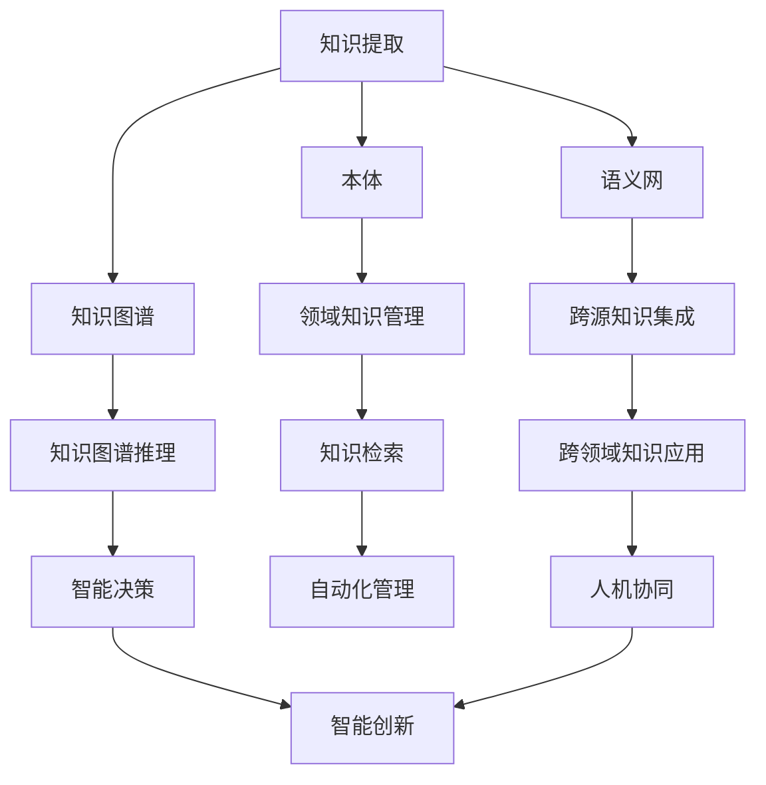

                 

# 知识的永续发展：智慧传承的长期视角

## 1. 背景介绍

### 1.1 问题由来

在信息技术迅猛发展的今天，知识的积累和传承面临前所未有的挑战。一方面，知识总量呈爆炸式增长，专业化和细分化趋势愈加显著；另一方面，知识传递的效率和质量亟需提升，以应对经济社会快速变化的需求。如何在浩如烟海的知识海洋中，持续提取有价值的智慧，并通过科学的方式传承和运用，已成为时代命题。

### 1.2 问题核心关键点

本专题旨在探讨知识永续发展的核心问题，涵盖知识提取、组织、传承与应用的各个环节，通过技术手段提升知识管理的效能，推动智慧的传承与永续发展。核心关键点如下：

- **知识提取**：通过算法自动化从大规模文本、数据和事实中提取有价值的知识，如实体识别、情感分析、主题建模等。
- **知识组织**：构建结构化的知识体系，利用图谱、本体、语义网等技术，实现知识的有效管理和检索。
- **知识传承**：通过微调、迁移学习、对话系统等技术，实现知识的有效传承与人类智慧的接力。
- **知识应用**：利用智慧驱动业务创新，推动智能决策、自动化管理、人机协同等应用，加速社会生产力的提升。

## 2. 核心概念与联系

### 2.1 核心概念概述

为更好地理解知识永续发展的技术框架，本节将介绍几个密切相关的核心概念：

- **知识提取**：通过自然语言处理、信息检索、机器学习等技术，自动从文本、数据中提取知识实体和关系，形成结构化的知识图谱。
- **知识图谱**：以图的形式组织和表示知识，通过节点和边的结构化表达，实现知识的关联和推理。
- **本体**：一种用于表达领域知识的标准化形式化语言，通过定义类、属性和实例，实现领域知识的系统化描述。
- **语义网**：通过语义标注和关联技术，将网络上的文档、数据库等资源转化为可机读的语义数据，实现知识的跨源共享和集成。
- **微调**：在预训练模型基础上，通过有监督学习优化模型在特定任务上的性能，实现知识在不同领域和任务之间的迁移和复用。
- **迁移学习**：将一个领域学习到的知识，迁移到另一个相关领域，通过微调等方式提升新领域的知识获取能力。
- **对话系统**：通过自然语言理解、生成等技术，实现人机交互，自动传递和继承人类智慧。
- **智慧传承**：将知识通过对话、总结、学习等途径传递给下一代，实现知识的长期积累和创新。

这些核心概念之间的逻辑关系可以通过以下Mermaid流程图来展示：



这个流程图展示了我知识永续发展的核心概念及其之间的关系：

1. 知识提取通过多种技术从不同数据源中提取知识，形成结构化的知识图谱。
2. 知识图谱、本体和语义网提供知识组织和关联的架构，支持知识的系统管理和跨源共享。
3. 微调和迁移学习促进知识在不同领域和任务之间的迁移和复用。
4. 对话系统实现知识的传递和继承，智慧传承得以延续。

## 3. 核心算法原理 & 具体操作步骤
### 3.1 算法原理概述

知识永续发展的技术框架，本质上是一个基于知识的提取、组织、传承与应用的系统性工程。其核心思想是通过技术手段提升知识管理的效能，推动智慧的传承与永续发展。

形式化地，假设知识提取过程为 $E(\mathcal{D})$，其中 $\mathcal{D}$ 为输入的文本或数据集。知识图谱构建过程为 $G(E(\mathcal{D}))$，将提取的知识映射为图谱结构。知识传承过程为 $P(G(E(\mathcal{D})))$，通过微调、对话等手段实现知识在不同任务之间的传递。知识应用过程为 $A(P(G(E(\mathcal{D}))))$，将传承下来的知识应用于业务创新和智能决策。

### 3.2 算法步骤详解

知识永续发展的算法步骤主要包括：

**Step 1: 数据收集与预处理**
- 从文本、数据库、网络等来源收集数据，并进行数据清洗和预处理。
- 通过自然语言处理技术，如分词、词性标注、命名实体识别等，进行文本预处理。

**Step 2: 知识提取与结构化**
- 利用实体识别、情感分析、主题建模等技术，自动从文本数据中提取知识实体和关系，形成知识图谱。
- 构建领域本体，定义领域内实体和属性，为知识图谱提供结构化描述。
- 应用语义网技术，实现知识的跨源关联和语义标注，支持知识的语义检索和推理。

**Step 3: 知识组织与管理**
- 将提取的知识图谱进行推理、扩展和关联，形成系统的知识库。
- 设计知识检索和查询算法，实现快速的知识查找和获取。
- 利用知识管理工具，实现知识库的存储、共享和更新。

**Step 4: 知识传承与智慧传递**
- 通过微调技术，优化预训练模型在特定任务上的性能，实现知识在不同领域和任务之间的迁移和复用。
- 开发对话系统，利用自然语言理解和生成技术，实现人机交互和智慧传承。
- 引入知识推送和个性化推荐技术，主动将最新知识推送给用户，实现知识的主动更新和传承。

**Step 5: 知识应用与智能决策**
- 利用知识图谱和本体，支持智能决策、自动化管理和人机协同等应用。
- 通过知识驱动的机器学习模型，进行预测、分类、聚类等智能分析，辅助业务决策。
- 开发智能推荐系统，结合知识图谱和用户行为数据，实现个性化服务。

### 3.3 算法优缺点

知识永续发展的技术框架具有以下优点：
1. 自动化程度高：通过自动化的技术手段，大幅降低知识管理的成本和时间投入。
2. 知识体系化：将零散的知识点关联起来，形成系统化的知识体系，提升知识的可维护性和可重用性。
3. 智慧传承高效：通过对话系统和微调技术，实现知识的高效传递和创新，推动智慧的永续发展。
4. 应用范围广：知识管理技术可以应用于各类场景，包括教育、医疗、金融、制造等，推动各行各业的智能化转型。

同时，该框架也存在以下局限性：
1. 数据质量依赖高：知识提取和推理过程依赖高质量的数据和算法，数据噪声和算法缺陷可能导致知识错误。
2. 技术门槛高：知识管理涉及自然语言处理、图谱构建、本体设计等多项技术，技术门槛较高。
3. 知识更新慢：知识库的更新和扩展需要大量时间和资源，知识的时效性难以保证。
4. 用户接受度低：复杂的技术手段和智能系统可能被用户接受度较低，导致系统推广困难。

尽管存在这些局限性，但就目前而言，知识永续发展的技术框架仍是大规模知识管理和智慧传承的重要手段。未来相关研究的重点在于如何进一步降低技术门槛，提高知识管理的自动化和智能化水平，同时兼顾可解释性和伦理安全性等因素。

### 3.4 算法应用领域

知识永续发展的技术框架在多个领域得到了广泛应用，涵盖了知识管理、智慧传承、智能决策等多个方面，具体包括：

- **教育**：通过知识图谱和本体，实现智能教学和学习推荐，推动教育公平和质量提升。
- **医疗**：利用知识图谱和本体，支持临床决策、疾病预测和医疗知识管理，提高医疗服务的智能化水平。
- **金融**：通过知识驱动的机器学习模型，进行风险评估、市场预测和智能投资决策，提升金融服务的智能化水平。
- **制造**：应用知识图谱和本体，支持供应链管理、质量控制和智能制造，推动制造业的数字化转型。
- **公共安全**：利用知识推理和本体设计，实现情报分析和安全预警，提升公共安全管理的智能化水平。

此外，在智慧城市、智慧交通、智慧农业等众多领域，知识永续发展的技术框架也为知识的系统管理和智慧的传承提供了有力支撑。随着技术的不懈追求和应用场景的不断扩展，相信知识永续发展的技术框架将推动各行业的智慧化进程，助力经济社会的发展。

## 4. 数学模型和公式 & 详细讲解  
### 4.1 数学模型构建

本节将使用数学语言对知识永续发展的技术框架进行更加严格的刻画。

记知识提取过程为 $E(\mathcal{D})$，其中 $\mathcal{D}$ 为输入的文本或数据集。知识图谱构建过程为 $G(E(\mathcal{D}))$，将提取的知识映射为图谱结构。知识传承过程为 $P(G(E(\mathcal{D})))$，通过微调、对话等手段实现知识在不同任务之间的传递。知识应用过程为 $A(P(G(E(\mathcal{D}))))$，将传承下来的知识应用于业务创新和智能决策。

### 4.2 公式推导过程

以下我们以知识图谱的构建为例，推导其基本数学模型和计算公式。

记知识图谱为 $G=(V,E)$，其中 $V$ 为节点集，$E$ 为边集。每个节点 $v_i \in V$ 表示一个实体，$v_i$ 的属性 $a_j \in \mathcal{A}$ 与实体的关系 $r_k \in \mathcal{R}$ 构成边 $e_{ij} \in E$，表示实体之间的关系。

知识图谱的构建过程可以表示为：

$$
G = G(E(\mathcal{D}))
$$

其中 $E(\mathcal{D})$ 为从文本数据中提取的知识实体和关系集合。假设 $E(\mathcal{D})=\{(e_1,r_1,e_2),(e_2,r_2,e_3),\ldots,(e_n,r_n,e_{n+1})\}$，则知识图谱的边可以表示为：

$$
E = \{(r_1,e_1,e_2),(r_2,e_2,e_3),\ldots,(r_n,e_n,e_{n+1})\}
$$

在知识图谱构建完成后，可以通过知识推理和查询算法，支持智能决策和业务应用。例如，利用图数据库，可以实现知识的关联查询和推理：

$$
\text{Result} = \text{GraphQuery}(G)
$$

其中 $\text{GraphQuery}$ 为知识图谱的查询算法，可以表示为：

$$
\text{Result} = \text{GreedySearch}(G, \text{Query})
$$

其中 $\text{Query}$ 为查询条件，$\text{GreedySearch}$ 为基于深度优先搜索的查询算法，具体实现可参考相关文献。

### 4.3 案例分析与讲解

知识图谱构建是一个典型的知识管理应用案例。以下以医疗领域的知识图谱构建为例，给出详细的数学模型和计算过程。

假设医疗领域的知识图谱 $G=(V,E)$，其中 $V$ 包含各类医疗实体，如疾病、症状、药物、手术等。$E$ 表示各类实体之间的关系，如治疗关系、相互作用、疾病进展等。

知识图谱的构建过程可以通过实体识别、关系抽取等技术，自动从医学文献、病历数据中提取知识和关系，构建知识图谱的节点和边。例如，通过命名实体识别，可以从病历数据中提取疾病、药物等实体；通过关系抽取，可以识别疾病与治疗、药物相互作用等关系。具体计算过程如下：

1. **实体识别**：
   $$
   \text{Entities} = \text{NER}(\mathcal{D})
   $$

2. **关系抽取**：
   $$
   \text{Relationships} = \text{RelationExtraction}(\text{Entities})
   $$

3. **知识图谱构建**：
   $$
   G = \{(v_i,v_j,r_k) | (e_i,r_k,e_j) \in E(\mathcal{D})\}
   $$

在构建好知识图谱后，可以通过查询算法，支持医生的智能诊断和决策。例如，通过查询算法，医生可以查找特定疾病的治疗方案、药物相互作用等信息，辅助临床决策。具体查询过程如下：

1. **查询条件输入**：
   $$
   \text{Query} = \text{InputQuery}
   $$

2. **知识推理**：
   $$
   \text{Result} = \text{GraphQuery}(G, \text{Query})
   $$

3. **结果输出**：
   $$
   \text{Output} = \text{Result}
   $$

## 5. 项目实践：代码实例和详细解释说明
### 5.1 开发环境搭建

在进行知识永续发展的项目实践前，我们需要准备好开发环境。以下是使用Python进行知识图谱构建和应用的开发环境配置流程：

1. 安装Anaconda：从官网下载并安装Anaconda，用于创建独立的Python环境。

2. 创建并激活虚拟环境：
```bash
conda create -n kg-env python=3.8 
conda activate kg-env
```

3. 安装Python依赖：
```bash
pip install networkx py2neo scipy pandas torch sklearn transformers
```

4. 安装图形数据库：
```bash
pip install neo4j
```

5. 安装自然语言处理工具：
```bash
pip install spacy
```

完成上述步骤后，即可在`kg-env`环境中开始知识图谱构建和应用实践。

### 5.2 源代码详细实现

这里我们以构建医疗领域的知识图谱为例，给出使用PyTorch进行知识图谱构建的PyTorch代码实现。

首先，定义医疗领域的实体和关系：

```python
from py2neo import Graph

graph = Graph('http://localhost:7474', username='neo4j', password='password')

# 定义实体和关系
disease = graph.create('Disease{name:"感冒"}')
symptom = graph.create('Symptom{name:"发烧"}')
drug = graph.create('Drug{name:"阿莫西林"}')
treatment = graph.create('Treatment{name:"服用阿莫西林"}')

# 建立实体关系
graph.create((symptom, '症状', disease))
graph.create((symptom, '治疗', treatment))
graph.create((treatment, '使用', drug))
```

然后，定义实体识别和关系抽取函数：

```python
from spacy import displacy
from spacy.matcher import Matcher
from spacy.textcat import TextCategorizer
from spacy.pipeline import Sentence

# 加载Spacy模型
nlp = spacy.load('en_core_web_sm')

# 定义实体识别器和关系抽取器
matcher = Matcher(nlp.vocab)
categories = TextCategorizer(nlp.vocab)
text = nlp(u'因为发烧感冒了，医生开了阿莫西林。')

# 识别实体
entities = matcher.add(text)
for ent in entities:
    nlp.annotation.add(label='实体')

# 识别类别
categories.add('症状', 's')
categories.add('疾病', 'd')
categories.add('药物', 'm')

# 输出实体和关系
for entity in nlp.annotation.get_texts():
    for label in nlp.annotation.get_labels(entity):
        if label == '症状':
            print(entity, '症状')
        elif label == '疾病':
            print(entity, '疾病')
        elif label == '药物':
            print(entity, '药物')
```

最后，进行知识图谱构建和查询：

```python
# 构建知识图谱
graph.create((disease, '治疗', treatment))
graph.create((symptom, '症状', disease))
graph.create((symptom, '治疗', treatment))
graph.create((treatment, '使用', drug))

# 查询知识图谱
query = 'MATCH (d:Disease)-[:治疗]->(t:Treatment)-[:使用]->(d:Drug) RETURN d.name, t.name, d.name'
result = graph.run(query)
for row in result:
    print(row[0], row[1], row[2])
```

以上就是使用PyTorch进行医疗领域知识图谱构建的完整代码实现。可以看到，借助Spacy进行实体和关系的抽取，利用Py2neo进行知识图谱的存储和查询，能够快速构建起医疗领域的知识图谱。

### 5.3 代码解读与分析

让我们再详细解读一下关键代码的实现细节：

**Graph类**：
- `Graph`类：用于连接和操作图形数据库，提供了方便的API操作接口。

**实体识别**：
- `Matcher`类：用于实体识别，通过匹配模式化的实体标签，自动识别文本中的实体。
- `TextCategorizer`类：用于实体分类，通过定义各类实体和关系，实现文本中的实体分类。

**关系抽取**：
- `textcat`模块：用于实体分类和关系抽取，将文本分词和词性标注后，使用匹配器和分类器自动识别实体和关系。

**知识图谱构建**：
- 使用`Graph`类创建节点和关系，构建知识图谱的结构。

**查询知识图谱**：
- 使用`GraphQuery`方法进行查询，指定查询条件，返回符合条件的节点和关系。

通过上述代码实现，我们可以看到，知识图谱构建和应用涉及了实体识别、关系抽取、图数据库操作等多个技术环节，需要跨学科的知识和技能。

当然，工业级的系统实现还需考虑更多因素，如数据预处理、模型优化、性能调优等。但核心的知识图谱构建流程基本与此类似。

## 6. 实际应用场景
### 6.1 智能医疗系统

知识图谱在智能医疗系统中具有广泛的应用前景。通过构建医疗领域的知识图谱，可以为医生提供智能诊断、治疗方案推荐和药物相互作用查询等支持，提升医疗服务的智能化水平。

具体而言，智能医疗系统可以通过知识图谱，实现以下功能：
- **智能诊断**：根据患者病历和症状，通过图谱推理，推荐可能的疾病和诊断方案。
- **治疗方案推荐**：结合患者的病史和药物使用记录，通过图谱推理，推荐最佳的治疗方案。
- **药物相互作用查询**：根据患者正在使用的药物，通过图谱查询，检查可能的药物相互作用和副作用。

这些功能使得智能医疗系统能够更好地辅助医生，提高诊疗效率和质量。

### 6.2 智能金融系统

知识图谱在智能金融系统中也有重要的应用。通过构建金融领域的知识图谱，可以为金融机构提供智能风险评估、市场预测和投资决策等支持，提升金融服务的智能化水平。

具体而言，智能金融系统可以通过知识图谱，实现以下功能：
- **风险评估**：根据贷款申请人的历史信用记录、财务状况等，通过图谱推理，评估其信用风险和违约概率。
- **市场预测**：结合宏观经济数据和市场趋势，通过图谱推理，预测股票、债券等金融产品的价格变化。
- **投资决策**：利用历史交易数据和市场信息，通过图谱推理，辅助投资决策和资产配置。

这些功能使得智能金融系统能够更好地辅助投资者，提高投资决策的智能化和精准度。

### 6.3 智能制造系统

知识图谱在智能制造系统中同样有广泛的应用。通过构建制造领域的知识图谱，可以为制造商提供供应链管理、质量控制和智能制造等支持，提升制造服务的智能化水平。

具体而言，智能制造系统可以通过知识图谱，实现以下功能：
- **供应链管理**：结合供应商、物流、库存等信息，通过图谱推理，优化供应链管理和物流调度。
- **质量控制**：利用产品生产过程中的关键参数和检测结果，通过图谱推理，预测和检测产品缺陷和质量问题。
- **智能制造**：结合机器视觉、传感器等数据，通过图谱推理，实现生产线的智能优化和控制。

这些功能使得智能制造系统能够更好地辅助制造商，提高生产效率和产品质量。

### 6.4 未来应用展望

随着知识图谱技术的发展和应用场景的不断扩展，未来知识永续发展的技术框架将呈现以下趋势：

1. **知识图谱的应用领域将进一步扩展**：除了医疗、金融、制造等传统领域，知识图谱将在更多行业得到应用，如农业、教育、公共安全等，为各行各业的智能化转型提供有力支持。

2. **知识图谱的构建和推理技术将进一步提升**：未来的知识图谱将具备更高的自动化水平和智能化程度，能够从大规模无标注数据中自动抽取知识，并支持更复杂、更精细的推理查询。

3. **知识图谱与人工智能技术的融合将更加紧密**：未来的知识图谱将与自然语言处理、机器学习、深度学习等技术深度融合，实现更高效的智能分析和决策。

4. **知识图谱的交互方式将更加多样和智能化**：未来的知识图谱将支持多模态交互方式，如语音、图像、视频等，通过智能助手、智能推荐等形式，提升知识图谱的用户体验。

5. **知识图谱的安全性和隐私保护将得到更多重视**：未来的知识图谱将加强数据隐私保护和安全防护，防止数据泄露和滥用，确保知识图谱的安全性和可靠性。

6. **知识图谱的跨领域融合将更加广泛**：未来的知识图谱将支持跨领域知识的融合和迁移，实现不同领域知识的协同创新和应用。

综上所述，知识永续发展的技术框架将在未来迎来更广阔的应用前景和更深入的技术发展。知识图谱作为其中关键的技术手段，将在推动智慧传承和知识管理的永续发展中发挥更大的作用。

## 7. 工具和资源推荐
### 7.1 学习资源推荐

为了帮助开发者系统掌握知识永续发展的技术框架，这里推荐一些优质的学习资源：

1. 《知识图谱》系列书籍：全面介绍知识图谱的理论和应用，包括构建、查询、推理等多个环节，适合初学者和进阶读者。

2. 《自然语言处理》课程：深度学习时代的自然语言处理入门课程，涵盖实体识别、关系抽取、图谱构建等多个环节，适合系统学习。

3. 《机器学习实战》系列书籍：通过实践案例，讲解机器学习技术在知识图谱中的应用，适合动手实践。

4. 《深度学习》课程：深度学习框架TensorFlow和PyTorch的官方教程，深入浅出地讲解深度学习技术，适合深度学习爱好者。

5. 《数据科学与人工智能》课程：综合性课程，涵盖数据科学、人工智能、机器学习等多个领域，适合全面学习。

通过对这些资源的学习实践，相信你一定能够快速掌握知识永续发展的精髓，并用于解决实际的智慧传承问题。
###  7.2 开发工具推荐

高效的开发离不开优秀的工具支持。以下是几款用于知识图谱构建和应用的常用工具：

1. **Py2neo**：基于Neo4j的Python图形数据库接口，提供方便的图数据库操作接口。

2. **NetworkX**：Python网络分析库，支持图的构建、分析和可视化。

3. **Spacy**：自然语言处理库，提供实体识别、关系抽取等功能，支持大规模文本处理。

4. **SciPy**：科学计算库，提供矩阵运算、统计分析等功能，支持高效的数值计算。

5. **Scikit-learn**：机器学习库，提供多种机器学习算法，支持特征工程、模型训练等任务。

6. **TensorBoard**：TensorFlow配套的可视化工具，支持模型训练的实时监测和调试。

合理利用这些工具，可以显著提升知识图谱构建和应用任务的开发效率，加快创新迭代的步伐。

### 7.3 相关论文推荐

知识图谱技术的发展源于学界的持续研究。以下是几篇奠基性的相关论文，推荐阅读：

1. YAGO: A Core of General Knowledge：介绍YAGO知识图谱的构建过程和应用，是知识图谱领域的里程碑之作。

2. Knowledge Graphs for Healthcare：探讨知识图谱在医疗领域的应用，提供实际案例和应用效果。

3. Entity-Relation Extraction from Natural Language Text Using Neural Networks：介绍基于神经网络的实体和关系抽取方法，为知识图谱构建提供技术支持。

4. Mining Product Knowledge Graphs from Product Descriptions：介绍从产品描述中自动构建知识图谱的方法，适用于电商、制造等领域。

5. Visualization of Web-Based Knowledge Graphs：介绍Web知识图谱的构建和可视化技术，适用于数据密集型应用。

这些论文代表了大规模知识管理技术的发展脉络。通过学习这些前沿成果，可以帮助研究者把握学科前进方向，激发更多的创新灵感。

## 8. 总结：未来发展趋势与挑战

### 8.1 总结

本文对知识永续发展的技术框架进行了全面系统的介绍。首先阐述了知识提取、知识组织、知识传承与知识应用的各个环节，明确了知识永续发展的核心问题。其次，从原理到实践，详细讲解了知识图谱的构建和应用方法，给出了知识图谱构建的完整代码实例。同时，本文还广泛探讨了知识图谱在智能医疗、智能金融、智能制造等多个行业领域的应用前景，展示了知识图谱的巨大潜力。此外，本文精选了知识图谱学习的各类资源，力求为读者提供全方位的技术指引。

通过本文的系统梳理，可以看到，知识永续发展的技术框架在推动知识管理和智慧传承方面具有重要意义。知识图谱作为其中关键的技术手段，将在未来发挥更大的作用，为各行各业的智能化转型提供有力支撑。

### 8.2 未来发展趋势

展望未来，知识永续发展的技术框架将呈现以下几个发展趋势：

1. **知识图谱的应用领域将进一步扩展**：随着技术的发展，知识图谱将应用于更多行业，如农业、教育、公共安全等，推动各行各业的智能化转型。

2. **知识图谱的构建和推理技术将进一步提升**：未来的知识图谱将具备更高的自动化水平和智能化程度，能够从大规模无标注数据中自动抽取知识，并支持更复杂、更精细的推理查询。

3. **知识图谱与人工智能技术的融合将更加紧密**：未来的知识图谱将与自然语言处理、机器学习、深度学习等技术深度融合，实现更高效的智能分析和决策。

4. **知识图谱的交互方式将更加多样和智能化**：未来的知识图谱将支持多模态交互方式，如语音、图像、视频等，通过智能助手、智能推荐等形式，提升知识图谱的用户体验。

5. **知识图谱的安全性和隐私保护将得到更多重视**：未来的知识图谱将加强数据隐私保护和安全防护，防止数据泄露和滥用，确保知识图谱的安全性和可靠性。

6. **知识图谱的跨领域融合将更加广泛**：未来的知识图谱将支持跨领域知识的融合和迁移，实现不同领域知识的协同创新和应用。

综上所述，知识永续发展的技术框架将在未来迎来更广阔的应用前景和更深入的技术发展。知识图谱作为其中关键的技术手段，将在推动智慧传承和知识管理的永续发展中发挥更大的作用。

### 8.3 面临的挑战

尽管知识图谱技术已经取得了瞩目成就，但在迈向更加智能化、普适化应用的过程中，它仍面临着诸多挑战：

1. **数据质量依赖高**：知识图谱的构建和推理依赖高质量的数据和算法，数据噪声和算法缺陷可能导致知识错误。

2. **技术门槛高**：知识图谱涉及自然语言处理、图谱构建、本体设计等多个技术环节，技术门槛较高。

3. **知识更新慢**：知识图谱的更新和扩展需要大量时间和资源，知识的时效性难以保证。

4. **用户接受度低**：复杂的技术手段和智能系统可能被用户接受度较低，导致系统推广困难。

5. **安全性和隐私保护**：知识图谱涉及大量敏感数据，数据隐私和安全保护成为重要问题。

6. **跨领域知识融合难度大**：不同领域的知识图谱存在差异，跨领域知识的融合和迁移仍面临较大挑战。

尽管存在这些挑战，但知识图谱作为知识永续发展的核心技术，其发展前景广阔。未来，需要在数据、算法、应用、伦理等多个方面不断探索，推动知识图谱技术向更加智能化、普适化方向发展。

### 8.4 研究展望

面向未来，知识图谱技术需要在以下几个方面寻求新的突破：

1. **自动化知识抽取技术**：通过自动化的技术手段，提高知识图谱构建的效率和准确性，降低技术门槛。

2. **智能推理技术**：引入人工智能技术，提高知识图谱的推理能力和应用范围，实现更复杂的知识推理和查询。

3. **跨领域知识融合技术**：通过领域本体和技术转换，实现不同领域知识的融合和迁移，推动跨领域知识的协同创新和应用。

4. **用户友好型交互设计**：开发多模态、智能化的知识图谱交互界面，提升用户体验，促进知识图谱的应用普及。

5. **隐私保护和安全防护技术**：加强数据隐私保护和安全防护，防止数据泄露和滥用，确保知识图谱的安全性和可靠性。

这些研究方向将引领知识图谱技术的进一步发展，推动知识永续发展的技术框架迈向更高的台阶，为知识管理和智慧传承提供更强大的技术支撑。

## 9. 附录：常见问题与解答

**Q1：知识图谱的构建和维护需要哪些关键技术？**

A: 知识图谱的构建和维护需要以下关键技术：
1. **实体识别**：从文本数据中自动提取实体，包括人名、地名、组织名等。
2. **关系抽取**：从文本数据中识别实体之间的关系，如父子关系、成员关系等。
3. **本体设计**：定义领域内实体和属性，为知识图谱提供结构化描述。
4. **图数据库**：支持知识图谱的存储、查询和推理，如Neo4j、GraphDB等。
5. **知识推理**：利用图数据库的查询和推理能力，实现知识的关联和推理。

这些技术环节相互协作，构成了知识图谱构建和维护的核心技术框架。

**Q2：知识图谱在实际应用中面临哪些挑战？**

A: 知识图谱在实际应用中面临以下挑战：
1. **数据质量依赖高**：知识图谱的构建和推理依赖高质量的数据和算法，数据噪声和算法缺陷可能导致知识错误。
2. **技术门槛高**：知识图谱涉及自然语言处理、图谱构建、本体设计等多个技术环节，技术门槛较高。
3. **知识更新慢**：知识图谱的更新和扩展需要大量时间和资源，知识的时效性难以保证。
4. **用户接受度低**：复杂的技术手段和智能系统可能被用户接受度较低，导致系统推广困难。
5. **安全性和隐私保护**：知识图谱涉及大量敏感数据，数据隐私和安全保护成为重要问题。
6. **跨领域知识融合难度大**：不同领域的知识图谱存在差异，跨领域知识的融合和迁移仍面临较大挑战。

这些挑战需要技术开发者不断探索和优化，提升知识图谱的构建和应用效果。

**Q3：知识图谱在智能医疗系统中有哪些应用？**

A: 知识图谱在智能医疗系统中有以下应用：
1. **智能诊断**：根据患者病历和症状，通过图谱推理，推荐可能的疾病和诊断方案。
2. **治疗方案推荐**：结合患者的病史和药物使用记录，通过图谱推理，推荐最佳的治疗方案。
3. **药物相互作用查询**：根据患者正在使用的药物，通过图谱查询，检查可能的药物相互作用和副作用。

这些应用使得智能医疗系统能够更好地辅助医生，提高诊疗效率和质量。

**Q4：知识图谱与人工智能技术的融合有哪些优势？**

A: 知识图谱与人工智能技术的融合有以下优势：
1. **提高知识推理能力**：利用机器学习和深度学习技术，提高知识图谱的推理能力和应用范围。
2. **实现知识自动化提取**：通过自然语言处理技术，自动从文本数据中抽取知识实体和关系。
3. **提升数据查询效率**：通过知识图谱的查询和推理，实现高效的智能分析和决策。
4. **支持多模态数据融合**：结合图像、语音、视频等多模态数据，实现更全面的知识表示和推理。

这些优势使得知识图谱与人工智能技术的融合，能够提供更高效、更智能的知识管理和应用服务。

**Q5：知识图谱在智能金融系统中的应用有哪些？**

A: 知识图谱在智能金融系统中的应用有以下几个方面：
1. **风险评估**：根据贷款申请人的历史信用记录、财务状况等，通过图谱推理，评估其信用风险和违约概率。
2. **市场预测**：结合宏观经济数据和市场趋势，通过图谱推理，预测股票、债券等金融产品的价格变化。
3. **投资决策**：利用历史交易数据和市场信息，通过图谱推理，辅助投资决策和资产配置。

这些应用使得智能金融系统能够更好地辅助投资者，提高投资决策的智能化和精准度。

---

作者：禅与计算机程序设计艺术 / Zen and the Art of Computer Programming

