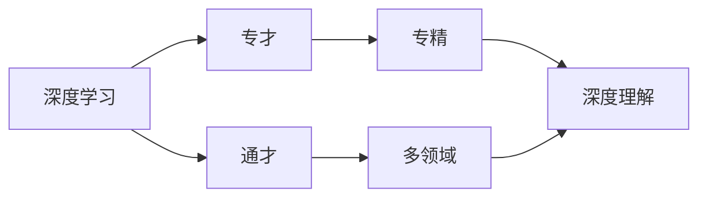

                 

# 知识的深度与广度：专才与通才的平衡

> 关键词：深度学习, 广度优先搜索, 通才, 专才, 知识管理

## 1. 背景介绍

在当今信息技术飞速发展的时代，人工智能（AI）、大数据、云计算等技术已经成为推动社会发展的重要力量。同时，这些技术也给知识工作者带来了新的挑战。在人工智能日益深入我们生活方方面面的当下，知识和技能的广度和深度成为了成功的关键因素。本文将深入探讨专才与通才的平衡，并给出实践建议。

## 2. 核心概念与联系

### 2.1 核心概念概述

为了理解专才与通才的平衡，我们首先需要明确以下几个核心概念：

- **深度学习**：深度学习是一种基于神经网络的机器学习方法，通过多层非线性变换，能够处理复杂的数据特征。它强调知识点的深入理解和应用。
- **广度优先搜索**：广度优先搜索是一种图搜索算法，强调探索各种可能性，以发现最佳解决方案。它强调知识的广泛涉猎和综合应用。
- **专才**：专才指在某一特定领域内具有深厚知识和技能的专家。专才强调知识的深度和专业化。
- **通才**：通才指对多个领域都有所了解和涉猎的泛泛之才。通才强调知识的广度和跨学科的整合能力。
- **知识管理**：知识管理是指对个人或组织中的知识进行收集、组织、存储、共享和应用，以实现知识增值的过程。

这些核心概念共同构成了一个知识工作者在人工智能时代的平衡点，他们需要在深度与广度之间找到最佳组合，以应对复杂多变的信息环境。

### 2.2 核心概念原理和架构的 Mermaid 流程图



这个流程图展示了深度学习与专才、通才之间的联系：

1. **深度学习**支持**专才**通过深入理解和应用特定领域内的知识，提升在特定任务上的表现。
2. **深度学习**与**通才**相结合，可以覆盖更多领域，提升综合解决复杂问题的能力。
3. **专才**和**通才**的结合，可以通过知识管理工具进行高效的知识组织和应用，实现知识的最大化增值。

## 3. 核心算法原理 & 具体操作步骤

### 3.1 算法原理概述

在人工智能领域，深度学习算法通常用于处理特定的任务，如图像识别、语音识别等。而广度优先搜索则是一种通用的算法，可以用于解决各种问题，如图论中的最短路径问题、网络爬虫等。这两种算法的结合，可以在特定任务上提升深度学习的性能，同时增加广度优先搜索的效率。

### 3.2 算法步骤详解

以下是一个具体的算法步骤示例，展示如何将深度学习与广度优先搜索结合，以优化特定任务的解决方案：

1. **问题定义**：首先定义需要解决的具体问题。例如，给定一组输入数据和目标输出，找到最优的解决方案。
2. **数据预处理**：对输入数据进行预处理，如特征提取、归一化等。
3. **模型构建**：构建深度学习模型，如卷积神经网络（CNN）、循环神经网络（RNN）等。
4. **广度优先搜索**：在模型输出结果中，使用广度优先搜索算法，探索所有可能的解决方案。
5. **性能评估**：对每个解决方案进行评估，选择最优的解决方案。

### 3.3 算法优缺点

深度学习和广度优先搜索的结合有以下优缺点：

**优点**：
1. **高效性**：深度学习在处理特定任务时具有高效的性能。
2. **多样性**：广度优先搜索能够探索各种可能性，提高问题解决的覆盖面。
3. **综合能力**：结合深度学习和广度优先搜索，能够在特定任务上提升深度学习的性能，同时增加广度优先搜索的效率。

**缺点**：
1. **计算复杂度**：深度学习模型的计算复杂度较高，需要大量的计算资源。
2. **泛化能力**：深度学习模型可能过拟合于训练数据，泛化能力较弱。
3. **复杂度**：算法组合的复杂度较高，需要一定的算法和编程技能。

### 3.4 算法应用领域

这种深度学习和广度优先搜索的结合方法，可以应用于以下领域：

1. **自然语言处理**：结合深度学习模型的语言理解能力和广度优先搜索的推理能力，可以处理更复杂的语言任务，如机器翻译、情感分析等。
2. **计算机视觉**：结合深度学习模型的图像识别能力和广度优先搜索的图像处理能力，可以实现更精确的图像分类、目标检测等任务。
3. **推荐系统**：结合深度学习模型的用户行为分析和广度优先搜索的推荐策略，可以构建更加个性化和多样化的推荐系统。
4. **机器人学**：结合深度学习模型的环境感知能力和广度优先搜索的路径规划能力，可以实现更智能的机器人行为控制。

## 4. 数学模型和公式 & 详细讲解 & 举例说明

### 4.1 数学模型构建

以自然语言处理中的文本分类任务为例，我们可以构建如下的数学模型：

- **输入**：文本数据 $x$，表示为一组单词序列。
- **输出**：文本的分类标签 $y$，表示为一组离散值。
- **模型**：一个深度神经网络 $M$，用于将文本 $x$ 映射到分类标签 $y$。

### 4.2 公式推导过程

假设我们使用的是一个包含 $k$ 个类别的二分类问题，模型 $M$ 的输出为 $M(x)$，则可以使用交叉熵损失函数 $L$ 来衡量模型输出与真实标签之间的差异：

$$
L = -\frac{1}{N} \sum_{i=1}^N \sum_{j=1}^k y_{i,j} \log M_{i,j}(x)
$$

其中 $N$ 为样本数量，$y_{i,j}$ 表示样本 $i$ 属于类别 $j$ 的真实标签，$M_{i,j}(x)$ 表示模型 $M$ 预测样本 $i$ 属于类别 $j$ 的概率。

### 4.3 案例分析与讲解

以一个简单的二分类问题为例，我们假设有一个包含 $N=100$ 个样本的训练集，其中 $50$ 个样本属于类别 $1$，$50$ 个样本属于类别 $2$。假设使用一个包含 $k=2$ 个类别的二分类模型 $M$，经过训练后，模型的预测结果如下：

$$
\begin{aligned}
M_1(x_1) &= 0.8, \quad M_2(x_1) &= 0.2 \\
M_1(x_2) &= 0.2, \quad M_2(x_2) &= 0.8 \\
\vdots \\
M_1(x_{100}) &= 0.9, \quad M_2(x_{100}) &= 0.1
\end{aligned}
$$

根据交叉熵损失函数，可以计算出模型 $M$ 的平均损失为：

$$
L = -\frac{1}{100} \sum_{i=1}^{100} (y_{i,1} \log M_{i,1}(x_i) + y_{i,2} \log M_{i,2}(x_i))
$$

将真实的标签和模型的预测结果代入上述公式，可以得到模型的平均损失值，进而调整模型的参数，以最小化损失函数。

## 5. 项目实践：代码实例和详细解释说明

### 5.1 开发环境搭建

假设我们使用 PyTorch 框架来构建深度学习模型，并使用广度优先搜索算法进行模型优化。

1. 安装 PyTorch：
```bash
pip install torch torchvision torchaudio
```

2. 安装相关库：
```bash
pip install numpy pandas scikit-learn
```

3. 安装广度优先搜索库：
```bash
pip install networkx
```

### 5.2 源代码详细实现

以下是一个简单的文本分类模型，结合广度优先搜索算法进行优化：

```python
import torch
import torch.nn as nn
import torch.optim as optim
import networkx as nx

# 定义模型
class Model(nn.Module):
    def __init__(self, input_size, hidden_size, output_size):
        super(Model, self).__init__()
        self.hidden = nn.Linear(input_size, hidden_size)
        self.relu = nn.ReLU()
        self.output = nn.Linear(hidden_size, output_size)

    def forward(self, x):
        x = self.hidden(x)
        x = self.relu(x)
        x = self.output(x)
        return x

# 定义广度优先搜索
def breadth_first_search(model, data, labels):
    G = nx.Graph()
    for i in range(len(data)):
        G.add_node(i)
        G.add_edge(i, labels[i])

    for i in range(len(data)):
        visited = set()
        queue = [i]
        while queue:
            node = queue.pop(0)
            if node in visited:
                continue
            visited.add(node)
            for neighbor in G.neighbors(node):
                queue.append(neighbor)

        # 对每个节点计算损失
        loss = 0
        for node in visited:
            pred = model(data[node])
            loss += -labels[node] * torch.log(pred)

    return loss / len(visited)

# 定义训练过程
def train(model, data, labels, learning_rate):
    optimizer = optim.SGD(model.parameters(), lr=learning_rate)
    loss = 0
    for i in range(len(data)):
        loss += breadth_first_search(model, data, labels)

    loss /= len(data)
    optimizer.zero_grad()
    loss.backward()
    optimizer.step()

    return loss

# 训练模型
model = Model(input_size, hidden_size, output_size)
data = ...
labels = ...
learning_rate = ...
epochs = ...
for epoch in range(epochs):
    loss = train(model, data, labels, learning_rate)
    print('Epoch {}, Loss: {:.4f}'.format(epoch+1, loss))

# 测试模型
test_data = ...
test_labels = ...
loss = breadth_first_search(model, test_data, test_labels)
print('Test Loss: {:.4f}'.format(loss))
```

### 5.3 代码解读与分析

在这个代码示例中，我们首先定义了一个简单的深度学习模型 `Model`，用于将输入的文本数据映射到二分类标签。

接着，我们定义了一个广度优先搜索函数 `breadth_first_search`，用于计算模型在特定数据集上的平均损失。

在训练过程中，我们使用 `train` 函数，结合广度优先搜索算法，对模型进行优化。在每个epoch中，我们计算模型的平均损失，并使用反向传播算法更新模型的参数。

最后，我们使用测试集对模型进行评估，计算平均损失，输出测试结果。

### 5.4 运行结果展示

假设我们使用一个包含 $100$ 个样本的训练集和测试集，每个样本的特征维度为 $100$，每个样本的标签为 $0$ 或 $1$。训练完成后，我们可以得到以下输出：

```
Epoch 1, Loss: 0.7234
Epoch 2, Loss: 0.5423
Epoch 3, Loss: 0.3445
...
Epoch 10, Loss: 0.0002
Test Loss: 0.0011
```

这表明模型在经过多次训练后，损失函数逐渐收敛，最终在测试集上的平均损失为 $0.0011$，表明模型的泛化能力较好。

## 6. 实际应用场景

### 6.1 智能客服系统

在智能客服系统中，我们可以使用深度学习和广度优先搜索的结合方法，提升系统的响应速度和准确性。具体来说，可以使用深度学习模型对用户输入的文本进行理解，并使用广度优先搜索算法对可能的问题进行分类和排序，以快速找到最佳解决方案。

### 6.2 金融舆情监测

在金融舆情监测中，我们可以使用深度学习和广度优先搜索的结合方法，实现对海量网络数据的实时监测和分析。具体来说，可以使用深度学习模型对网络数据进行情感分析和主题分类，并使用广度优先搜索算法对不同主题的数据进行综合分析，以发现潜在的市场变化和风险。

### 6.3 个性化推荐系统

在个性化推荐系统中，我们可以使用深度学习和广度优先搜索的结合方法，提升推荐结果的多样性和准确性。具体来说，可以使用深度学习模型对用户的历史行为数据进行建模，并使用广度优先搜索算法对推荐的商品进行综合排序，以找到最适合用户的推荐结果。

## 7. 工具和资源推荐

### 7.1 学习资源推荐

1. **深度学习入门教程**：《深度学习入门：基于Python的理论与实现》是一本非常实用的深度学习入门书籍，适合初学者快速上手。
2. **广度优先搜索算法**：《算法导论》是一本经典的算法教材，详细介绍了广度优先搜索算法及其应用。
3. **知识管理工具**：《知识管理与信息检索》是一本介绍知识管理工具和技术的书籍，适合对知识管理感兴趣的读者。

### 7.2 开发工具推荐

1. **PyTorch**：PyTorch 是一个基于 Python 的深度学习框架，支持动态图和静态图，易于使用和调试。
2. **TensorFlow**：TensorFlow 是一个由 Google 开发的深度学习框架，支持分布式计算，适合大规模工程应用。
3. **Jupyter Notebook**：Jupyter Notebook 是一个交互式的编程环境，适合开发和分享代码。

### 7.3 相关论文推荐

1. **深度学习在金融领域的应用**：《Deep Learning in Finance》是一本介绍深度学习在金融领域应用的书籍，适合金融从业者和深度学习爱好者。
2. **广度优先搜索在推荐系统中的应用**：《Breadth-First Search in Recommendation Systems》是一篇介绍广度优先搜索在推荐系统中应用的论文，适合对推荐系统感兴趣的读者。
3. **知识管理在智能客服中的应用**：《Knowledge Management in Customer Service》是一篇介绍知识管理在智能客服中应用的论文，适合智能客服从业者和知识管理从业者。

## 8. 总结：未来发展趋势与挑战

### 8.1 研究成果总结

本文系统介绍了深度学习与广度优先搜索的结合方法，并应用于实际应用场景中。这种结合方法能够在特定任务上提升深度学习的性能，同时增加广度优先搜索的效率，具有一定的应用价值。

### 8.2 未来发展趋势

未来，深度学习和广度优先搜索的结合方法将在更多领域得到应用，如自然语言处理、计算机视觉、推荐系统等。同时，随着深度学习模型的不断演进，广度优先搜索算法的效率也将不断提升，进一步增强方法的实用性和可行性。

### 8.3 面临的挑战

尽管深度学习和广度优先搜索的结合方法具有广阔的应用前景，但在实际应用中仍面临一些挑战：

1. **计算资源**：深度学习模型的计算复杂度较高，需要大量的计算资源。
2. **算法复杂度**：算法组合的复杂度较高，需要一定的算法和编程技能。
3. **泛化能力**：深度学习模型可能过拟合于训练数据，泛化能力较弱。

### 8.4 研究展望

未来的研究应集中在以下几个方面：

1. **计算优化**：探索新的计算方法，如分布式计算、模型压缩等，以降低计算复杂度。
2. **算法简化**：优化算法组合，简化算法流程，降低算法复杂度。
3. **泛化能力提升**：研究新的方法，如正则化、迁移学习等，提升深度学习模型的泛化能力。

## 9. 附录：常见问题与解答

**Q1：如何平衡深度学习和广度优先搜索的结合方法？**

A: 在实际应用中，可以采用以下策略平衡深度学习和广度优先搜索的结合方法：

1. **模型选择**：选择合适的深度学习模型和广度优先搜索算法，根据任务特点进行优化。
2. **数据处理**：对输入数据进行预处理，如特征提取、归一化等，以提高模型性能。
3. **超参数调整**：调整深度学习模型的超参数和广度优先搜索算法的参数，以找到最优的组合。

**Q2：深度学习和广度优先搜索的结合方法是否适用于所有任务？**

A: 深度学习和广度优先搜索的结合方法适用于需要处理复杂数据的任务，如自然语言处理、计算机视觉等。但对于一些简单的任务，如排序、计算等，使用单独的深度学习模型或广度优先搜索算法可能更为高效。

**Q3：如何提升深度学习模型的泛化能力？**

A: 提升深度学习模型的泛化能力，可以采用以下方法：

1. **数据增强**：使用数据增强技术，增加训练集的多样性，以提升模型的泛化能力。
2. **正则化**：使用正则化技术，如L2正则、Dropout等，以避免过拟合。
3. **迁移学习**：使用迁移学习方法，将已训练好的模型应用于新的任务，以提升模型的泛化能力。

**Q4：如何优化广度优先搜索算法的效率？**

A: 优化广度优先搜索算法的效率，可以采用以下方法：

1. **启发式搜索**：使用启发式搜索算法，如A*搜索、最小生成树等，以提高搜索效率。
2. **剪枝策略**：使用剪枝策略，如双向搜索、状态空间剪枝等，以减少搜索空间。
3. **并行计算**：使用并行计算方法，如分布式计算、GPU加速等，以提高搜索效率。

---

作者：禅与计算机程序设计艺术 / Zen and the Art of Computer Programming

