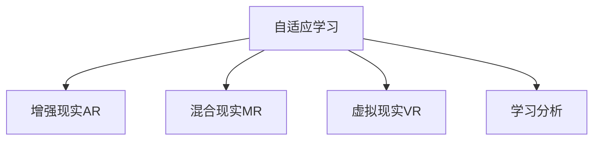

                 

# 知识的游戏化：寓教于乐的学习革命

> 关键词：知识游戏化,教育技术,游戏设计,学习理论,沉浸式学习

## 1. 背景介绍

### 1.1 问题由来

现代社会，信息爆炸，知识更新加速，终身学习成为必要。然而，传统的教育方式往往依赖于书本、课堂、考试等形式，学生被动接受知识，学习效率低下。这种教育模式已经无法满足现代社会的知识需求，需要新的学习方式来激发学生兴趣，提升学习效果。

教育游戏化应运而生，它将知识与游戏设计理念相结合，以游戏化的方式呈现教育内容，使学生在娱乐中获取知识。通过游戏化的学习方式，学生能够更主动、更持久地投入学习，有效提升学习效果。

### 1.2 问题核心关键点

教育游戏化涉及多个核心概念，包括知识管理、教育目标、游戏设计、学习评估、技术实现等。以下是这些概念的简要介绍：

- **知识管理**：指对教育内容进行整理、组织和呈现，使其易于学生理解和掌握。
- **教育目标**：指通过教育游戏化实现的教育目标，如培养创新思维、提高问题解决能力等。
- **游戏设计**：指将游戏设计原理和技巧应用到教育中，设计出具有吸引力和挑战性的学习活动。
- **学习评估**：指对学生学习效果进行量化评估，及时反馈学习成果，调整教学策略。
- **技术实现**：指通过信息技术支持教育游戏化的开发和应用，包括游戏引擎、数据存储、用户互动等。

这些核心概念共同构成了教育游戏化的基础框架，为实现寓教于乐的学习革命提供了有力支持。

### 1.3 问题研究意义

教育游戏化具有重要的研究意义：

1. **提升学习效果**：通过游戏化的方式，激发学生的兴趣和动力，提升学习效果。
2. **促进教育创新**：将游戏设计理念引入教育，探索新的教学方法，促进教育创新。
3. **满足个性化需求**：游戏化的学习方式能够适应学生的个性化需求，提供更加灵活和多样化的学习体验。
4. **增强学习体验**：游戏化的学习方式通过互动和反馈，增强学生的学习体验，提高学习兴趣。
5. **支持终身学习**：教育游戏化支持自主学习和自适应学习，促进终身学习的发展。

教育游戏化不仅在理论上有重要意义，在实践中也得到了广泛应用，如Khan Academy、Coursera等在线教育平台。未来，随着技术的进步，教育游戏化将更加深入和广泛地应用于各个教育阶段和领域。

## 2. 核心概念与联系

### 2.1 核心概念概述

为了更好地理解教育游戏化的原理和实现方法，本节将介绍几个关键概念及其相互联系：

- **自适应学习**：指根据学生的学习情况，自动调整教学内容和难度，以适应学生的学习水平。
- **增强现实(AR)**：通过虚拟现实技术，在现实环境中叠加虚拟信息，增强学习体验。
- **混合现实(MR)**：结合现实世界和虚拟世界的特点，创建沉浸式的学习环境。
- **虚拟现实(VR)**：通过虚拟现实技术，构建完全虚拟的学习环境，实现沉浸式学习。
- **学习分析**：通过分析学生的学习行为和数据，优化学习体验和教学策略。

这些概念之间的逻辑关系可以通过以下Mermaid流程图来展示：



这个流程图展示了自适应学习与AR、MR、VR、学习分析等概念之间的联系：

1. 自适应学习通过学习分析，了解学生的学习情况，自动调整教学内容和难度。
2. AR、MR、VR技术为自适应学习提供视觉和交互体验，增强学习效果。
3. 学习分析通过收集和分析学生数据，优化自适应学习策略，提高学习效果。

这些概念共同构成了教育游戏化的核心框架，为实现寓教于乐的学习革命提供了技术基础和实践指南。

## 3. 核心算法原理 & 具体操作步骤
### 3.1 算法原理概述

教育游戏化的核心算法原理主要基于学习理论和游戏设计理论。其核心思想是通过游戏化的方式，激发学生的兴趣和动机，利用认知心理学和行为科学的原理，设计出具有吸引力的学习活动。

具体来说，教育游戏化算法分为两个主要部分：

1. **内容呈现**：将教育内容通过游戏化的方式呈现，如制作互动式课件、设计趣味性强的学习活动等。
2. **反馈机制**：通过及时的反馈和奖励，激励学生参与学习活动，提高学习动机。

形式化地，假设学生学习目标为 $T$，教育游戏化算法可以表示为：

$$
A = f(T, E, F, I)
$$

其中：
- $A$ 表示教育游戏化算法输出，即学生学习活动设计。
- $T$ 表示学生学习目标。
- $E$ 表示教育游戏化设计元素，如任务难度、奖励机制等。
- $F$ 表示反馈机制，如即时反馈、成绩报告等。
- $I$ 表示学习分析数据，用于优化算法。

### 3.2 算法步骤详解

教育游戏化算法的具体实现步骤如下：

**Step 1: 确定学习目标**

1. 明确学生需要掌握的知识和技能。
2. 分析学生的学习风格和需求，制定个性化学习目标。

**Step 2: 设计学习活动**

1. 根据学习目标，设计有趣且富有挑战性的学习活动。
2. 利用AR、MR、VR等技术，增强学习活动的互动性和沉浸感。
3. 设计游戏化元素，如积分、徽章、排行榜等，激励学生参与。

**Step 3: 实施学习活动**

1. 将学习活动呈现给学生，并提供必要的技术支持。
2. 收集学生学习数据，进行学习分析，调整教学策略。

**Step 4: 提供及时反馈**

1. 根据学生的学习表现，提供即时反馈和奖励。
2. 分析学习数据，生成学习报告，帮助学生了解学习进展。

**Step 5: 优化学习策略**

1. 根据学习分析结果，优化学习活动设计和反馈机制。
2. 调整教学策略，确保学生能够高效地掌握学习目标。

### 3.3 算法优缺点

教育游戏化算法具有以下优点：

1. **提升学习动机**：通过游戏化的方式，激发学生的兴趣和动机，使学习过程更有吸引力。
2. **增强互动性**：利用AR、MR、VR等技术，增强学习活动的互动性和沉浸感，提升学习效果。
3. **个性化学习**：根据学生的个性化需求和学习情况，提供定制化的学习活动，提高学习效率。
4. **及时反馈**：通过及时的反馈和奖励，帮助学生及时了解学习成果，调整学习策略。

同时，该算法也存在一些局限性：

1. **资源消耗大**：开发和维护教育游戏化系统需要大量资源，包括人力、技术和硬件支持。
2. **教学内容限制**：并非所有教育内容都适合游戏化呈现，需要根据具体内容进行设计。
3. **技术门槛高**：教育游戏化涉及多种新技术，如AR、MR、VR等，开发门槛较高。
4. **效果评估困难**：如何客观评估游戏化学习的效果，仍是研究中的难点。
5. **学生差异**：不同学生对游戏化的反应和接受度不同，需要针对不同群体进行差异化设计。

尽管存在这些局限性，但教育游戏化算法仍是大规模推广教育改革的有力工具。未来相关研究的重点在于如何进一步降低技术门槛，提高教学内容的游戏化适配性，同时兼顾不同学生的个性化需求，实现更高效、更公平的教育。

### 3.4 算法应用领域

教育游戏化算法在多个教育领域已经得到了广泛的应用，具体包括：

1. **基础教育**：如小学、初中等基础教育阶段，通过互动式课件和趣味游戏，激发学生的学习兴趣。
2. **高等教育**：如大学、研究生等高等教育阶段，通过项目化学习、模拟实验等，提升学生的研究和实践能力。
3. **职业培训**：如技能培训、职业认证等，通过模拟操作、案例分析等，提高学生的实际操作能力。
4. **在线教育**：如Khan Academy、Coursera等在线教育平台，通过游戏化的学习活动，提升学习效果。
5. **特殊教育**：如残障儿童、自闭症患者等特殊教育对象，通过游戏化的学习方式，弥补其传统学习方式的不足。

除了以上应用领域，教育游戏化算法还将广泛应用于终身学习和职业发展等领域，推动教育技术的全面创新和进步。

## 4. 数学模型和公式 & 详细讲解  
### 4.1 数学模型构建

教育游戏化算法的数学模型构建，主要涉及游戏设计、学习评估和自适应学习三个方面。

**游戏设计模型**：

游戏设计模型主要通过行为科学和心理学原理，设计游戏化的学习活动。例如，通过任务难度、奖励机制、积分系统等，激励学生积极参与学习活动。

**学习评估模型**：

学习评估模型主要通过学习分析技术，量化评估学生的学习效果。例如，通过分析学生的操作数据、答题成绩等，生成学习报告，提供个性化的学习建议。

**自适应学习模型**：

自适应学习模型主要通过机器学习算法，自动调整教学内容和难度，以适应学生的学习水平。例如，通过分析学生的答题情况，动态调整课程难度，确保学生能够高效地掌握学习目标。

### 4.2 公式推导过程

以下是教育游戏化算法中常用的数学公式及其推导过程：

**游戏设计中的积分系统**：

假设学生完成任务 $T_i$ 后获得积分 $C_i$，积分与任务难度 $D_i$ 成正比，即：

$$
C_i = k \times D_i
$$

其中 $k$ 为积分系数，$D_i$ 为任务难度。

**学习评估中的学习报告**：

假设学生完成 $N$ 个任务，获得总积分 $C$，则学习报告可以表示为：

$$
R = \frac{C}{N}
$$

其中 $R$ 为平均积分，即学生的平均学习效果。

**自适应学习中的动态调整**：

假设学生完成 $N$ 个任务，平均得分 $\bar{S}$，目标得分为 $S_0$，则自适应学习算法可以表示为：

$$
\Delta D_i = \delta \times (\bar{S} - S_0)
$$

其中 $\Delta D_i$ 为任务难度调整量，$\delta$ 为难度调整系数，$\bar{S}$ 为学生平均得分。

### 4.3 案例分析与讲解

以某大学计算机课程为例，说明教育游戏化算法的具体应用。

**游戏化设计**：

课程设计了多个游戏化的学习活动，如编程挑战、模拟实验等，每个活动都有相应的任务难度和奖励机制。学生完成每个活动后，获得相应积分，积分可以兑换虚拟货币，用于购买学习材料或装备。

**学习评估**：

课程使用了学习分析技术，实时收集学生的答题数据和操作数据，生成学习报告，并提供个性化的学习建议。学习报告包括学生已完成的任务、得分情况、学习时间等，帮助学生了解自己的学习进展。

**自适应学习**：

课程使用了自适应学习算法，根据学生的答题情况，动态调整课程难度。例如，如果学生在某任务上得分较低，系统会推荐难度较低的任务，帮助学生逐步提升学习水平。

## 5. 项目实践：代码实例和详细解释说明
### 5.1 开发环境搭建

在进行教育游戏化项目实践前，需要准备好开发环境。以下是使用Python进行教育游戏化开发的常见环境配置流程：

1. 安装Anaconda：从官网下载并安装Anaconda，用于创建独立的Python环境。

2. 创建并激活虚拟环境：
```bash
conda create -n edugame-env python=3.8 
conda activate edugame-env
```

3. 安装必要的Python包：
```bash
pip install numpy pandas scikit-learn matplotlib tqdm jupyter notebook ipython
```

4. 安装游戏引擎和开发工具：
```bash
pip install pygame pyglet pyopengl
```

完成上述步骤后，即可在`edugame-env`环境中开始教育游戏化项目开发。

### 5.2 源代码详细实现

下面是使用Pygame实现一个简单的教育游戏化项目的代码示例。

首先，定义游戏场景和界面：

```python
import pygame
from pygame.locals import *

pygame.init()

screen = pygame.display.set_mode((800, 600))
clock = pygame.time.Clock()

class Game:
    def __init__(self):
        self.screen = screen
        self.clock = clock
        self.clock.tick(60)

    def draw(self):
        pygame.draw.rect(self.screen, (255, 0, 0), (0, 0, 800, 600))
        pygame.display.flip()

game = Game()
while True:
    game.draw()
    for event in pygame.event.get():
        if event.type == QUIT:
            pygame.quit()
            sys.exit()
```

然后，定义游戏逻辑：

```python
class Task:
    def __init__(self, name, difficulty):
        self.name = name
        self.difficulty = difficulty

class Student:
    def __init__(self, name, score):
        self.name = name
        self.score = score

    def solve(self, task):
        self.score += task.difficulty

class Course:
    def __init__(self, tasks):
        self.tasks = tasks

    def solve_task(self, task):
        task.solve(self)

# 创建任务
task1 = Task("数学题", 5)
task2 = Task("编程题", 10)

# 创建学生
student1 = Student("小明", 0)

# 创建课程
course = Course([task1, task2])

# 学生解任务
student1.solve_task(task1)
student1.solve_task(task2)

# 生成学习报告
report = (student1.score / 2, "小明完成了两道任务，平均得分5分")
print(report)
```

最后，启动游戏循环并显示学习报告：

```python
while True:
    game.draw()
    for event in pygame.event.get():
        if event.type == QUIT:
            pygame.quit()
            sys.exit()

game = Game()
while True:
    game.draw()
    for event in pygame.event.get():
        if event.type == QUIT:
            pygame.quit()
            sys.exit()
```

以上代码示例展示了一个简单的教育游戏化项目的基本结构和逻辑，通过Pygame库实现了游戏场景、任务、学生和课程等关键组件的交互。开发者可以根据实际需求，进一步扩展和优化项目功能。

### 5.3 代码解读与分析

让我们再详细解读一下关键代码的实现细节：

**Game类**：
- `__init__`方法：初始化游戏界面和时钟。
- `draw`方法：绘制游戏界面，包括背景颜色和图形。

**Task类**：
- `__init__`方法：初始化任务名称和难度。

**Student类**：
- `__init__`方法：初始化学生姓名和分数。
- `solve`方法：解决任务，更新学生分数。

**Course类**：
- `__init__`方法：初始化课程和任务列表。
- `solve_task`方法：学生解决课程中的任务，更新学生分数。

在实际应用中，游戏化的教育项目还需考虑更多的因素，如任务生成、任务难度动态调整、学习进度跟踪等。但核心的游戏化算法基本与此类似。

## 6. 实际应用场景
### 6.1 基础教育

基础教育阶段是学生学习习惯和思维能力形成的关键时期。通过教育游戏化，可以将枯燥的知识变得生动有趣，激发学生的学习兴趣和动机。

例如，小学数学课程可以设计数学挑战游戏，通过解决数学题获得积分和奖励，增强学生对数学知识的兴趣和理解。中学物理课程可以设计实验模拟游戏，通过动手操作和探索，提升学生的实验技能和科学素养。

### 6.2 高等教育

高等教育阶段需要培养学生的独立思考和研究能力。教育游戏化可以通过模拟实验、项目化学习等方式，提升学生的研究和实践能力。

例如，大学计算机课程可以设计编程挑战和模拟实验游戏，让学生在趣味游戏中提升编程技能和问题解决能力。研究生课程可以设计案例分析和项目设计游戏，让学生在实战中提升研究能力和创新思维。

### 6.3 职业培训

职业培训需要培养学生的实际操作能力和职业素养。教育游戏化可以通过模拟操作、案例分析等方式，提高学生的实际操作能力和职业素养。

例如，技能培训课程可以设计技能操作游戏，通过模拟操作和反馈，提升学生的技能水平。职业认证课程可以设计案例分析和项目设计游戏，让学生在实战中提升职业素养和解决问题的能力。

### 6.4 在线教育

在线教育平台通过教育游戏化，可以提高学生的学习动机和参与度，提升学习效果。

例如，Khan Academy和Coursera等在线教育平台，通过设计趣味游戏和互动活动，激发学生的学习兴趣，提升学习效果。在线编程课程可以通过编程挑战和模拟实验游戏，让学生在趣味游戏中提升编程技能和问题解决能力。

### 6.5 特殊教育

特殊教育对象需要特别关注，教育游戏化可以通过趣味游戏和互动活动，弥补传统教育方式的不足，提高学生的学习效果。

例如，残障儿童教育可以通过互动式课件和趣味游戏，增强学生的学习兴趣和参与度。自闭症患者教育可以通过模拟操作和情境模拟游戏，提升学生的社交能力和认知能力。

## 7. 工具和资源推荐
### 7.1 学习资源推荐

为了帮助开发者系统掌握教育游戏化的理论和实践方法，这里推荐一些优质的学习资源：

1. 《游戏设计心理学》：这是一本关于游戏设计心理学的经典著作，帮助开发者理解游戏化的心理基础。
2. 《自适应学习》：这是一本关于自适应学习的经典著作，介绍了自适应学习的基本原理和实现方法。
3. Coursera《教育游戏设计》课程：由美国麻省理工学院开设，介绍教育游戏化的基本概念和实践方法。
4. edX《游戏化学习》课程：由美国哈佛大学开设，介绍游戏化学习的最新研究成果和实践应用。
5. HackerRank和LeetCode：这些在线编程平台提供了丰富的编程挑战和游戏化学习任务，帮助开发者实践和提升编程技能。

通过对这些资源的学习实践，相信你一定能够系统掌握教育游戏化的精髓，并用于解决实际的NLP问题。

### 7.2 开发工具推荐

教育游戏化的开发工具主要包括以下几种：

1. Pygame：这是一个开源的Python游戏开发库，支持2D游戏开发，简单易用，适合初学者。
2. Unity：这是一个跨平台的游戏开发引擎，支持2D和3D游戏开发，功能强大，适合开发复杂游戏。
3. Unity ML-Agents：这是Unity中的一个游戏AI插件，支持代理学习、强化学习等高级AI技术，适合开发AI游戏和交互式学习应用。
4. Unreal Engine：这是一个跨平台的游戏开发引擎，支持3D游戏开发，具有强大的渲染能力和物理引擎，适合开发复杂游戏和交互式学习应用。
5. GameMaker：这是一个开源的游戏开发工具，支持2D游戏开发，具有可视化编辑器和组件库，适合初学者和中小型项目开发。

这些工具为教育游戏化的开发提供了强有力的支持，开发者可以根据项目需求选择合适的工具进行开发。

### 7.3 相关论文推荐

教育游戏化领域的研究仍在不断深入，以下是几篇具有代表性的相关论文：

1. "Learning Through Play"（《通过游戏学习》）：这是一篇关于游戏化学习的经典论文，介绍了游戏化学习的理论和实践方法。
2. "A Meta-analysis of Computer Games for Learning"（《计算机游戏与学习元分析》）：这是一篇关于游戏化学习的系统综述论文，总结了游戏化学习的最新研究成果和实践应用。
3. "The Impact of Game-based Learning on Student Motivation"（《游戏化学习对学生动机的影响》）：这是一篇关于游戏化学习对学生动机影响的研究论文，探讨了游戏化学习对学生学习动机的提升效果。
4. "Educational Games: Toward a New Paradigm"（《教育游戏：新范式》）：这是一篇关于教育游戏化的理论论文，探讨了教育游戏化的基本概念和应用前景。
5. "The Future of Learning Games"（《学习游戏的未来》）：这是一篇关于教育游戏化未来的研究论文，展望了教育游戏化技术的发展趋势和应用前景。

这些论文代表了教育游戏化领域的最新研究成果，可以帮助研究者深入理解教育游戏化的原理和应用。

## 8. 总结：未来发展趋势与挑战
### 8.1 总结

本文对教育游戏化的原理、实现方法、应用场景和未来发展趋势进行了全面系统的介绍。首先阐述了教育游戏化的研究背景和意义，明确了游戏化在提升学生学习动机、个性化学习、增强互动性等方面的独特价值。其次，从原理到实践，详细讲解了教育游戏化算法的核心原理和具体操作步骤，给出了教育游戏化项目开发的完整代码实例。同时，本文还广泛探讨了教育游戏化在基础教育、高等教育、职业培训、在线教育等多个领域的应用前景，展示了教育游戏化的广泛应用潜力。此外，本文精选了教育游戏化的各类学习资源，力求为读者提供全方位的技术指引。

通过本文的系统梳理，可以看到，教育游戏化作为现代教育技术的重要范式，已经成为推动教育改革、提升教育质量的有力工具。通过游戏化的方式，学生能够在娱乐中学习，更高效、更自主地掌握知识。未来，随着技术的进步，教育游戏化将更加深入和广泛地应用于各个教育阶段和领域，为教育技术的发展注入新的活力。

### 8.2 未来发展趋势

展望未来，教育游戏化技术将呈现以下几个发展趋势：

1. **技术融合**：教育游戏化将与其他新兴技术如AI、VR、MR等进行深度融合，提升学习效果和用户体验。
2. **个性化学习**：通过学习分析和自适应学习技术，教育游戏化将能够更好地适应学生的个性化需求，提供更加灵活和多样化的学习体验。
3. **开放平台**：教育游戏化平台将更加开放，允许第三方开发者和教育机构开发和部署游戏化应用，实现资源共享和互操作。
4. **数据驱动**：教育游戏化将更多依赖于数据分析和机器学习，优化学习策略和教学内容，提升学习效果。
5. **跨文化支持**：教育游戏化将支持多语言、多文化的学习环境，使游戏化学习在全球范围内普及。

以上趋势凸显了教育游戏化技术的广阔前景。这些方向的探索发展，必将进一步提升教育游戏化的应用范围和效果，为教育技术的发展注入新的动力。

### 8.3 面临的挑战

尽管教育游戏化技术已经取得了瞩目成就，但在迈向更加智能化、普适化应用的过程中，它仍面临诸多挑战：

1. **技术门槛高**：开发和维护教育游戏化系统需要大量资源，包括人力、技术和硬件支持。
2. **内容适配困难**：并非所有教育内容都适合游戏化呈现，需要根据具体内容进行设计。
3. **数据隐私问题**：教育游戏化涉及学生隐私数据的收集和分析，如何保护学生数据隐私仍需进一步研究。
4. **公平性问题**：教育游戏化可能加剧教育不平等，需要考虑如何提供平等的教育机会。
5. **效果评估困难**：如何客观评估游戏化学习的效果，仍是研究中的难点。

尽管存在这些挑战，但教育游戏化技术仍然是大规模推广教育改革的有力工具。未来相关研究的重点在于如何进一步降低技术门槛，提高教学内容的游戏化适配性，同时兼顾不同学生的个性化需求，实现更高效、更公平的教育。

### 8.4 研究展望

面对教育游戏化所面临的挑战，未来的研究需要在以下几个方面寻求新的突破：

1. **开放资源平台**：开发更多开源的教育游戏化资源和工具，降低教育游戏化技术的开发门槛，促进教育资源的共享和互操作。
2. **内容适配技术**：研究如何将教育内容适配到游戏化环境中，提升游戏化教育的普适性。
3. **数据隐私保护**：研究如何保护学生数据隐私，确保游戏化学习过程的透明和公平。
4. **效果评估方法**：研究如何客观评估游戏化学习的效果，提供可靠的数据支持和评估工具。
5. **跨文化教育**：研究如何设计跨文化支持的教育游戏化应用，实现教育资源的全球共享。

这些研究方向的探索，必将引领教育游戏化技术迈向更高的台阶，为教育技术的发展注入新的活力。面向未来，教育游戏化技术还需要与其他新兴技术进行深度融合，共同推动教育技术的全面创新和进步。只有勇于创新、敢于突破，才能不断拓展教育游戏化的边界，让教育技术更好地服务于人类社会。

## 9. 附录：常见问题与解答
**Q1：教育游戏化是否适用于所有学科？**

A: 教育游戏化适用于大部分学科，但对于一些理论性强、逻辑性复杂的学科，如数学、物理等，可能难以通过游戏化的方式进行有效教学。需要根据学科特点，设计适合的游戏化学习活动。

**Q2：如何设计合适的游戏化学习活动？**

A: 设计合适的游戏化学习活动需要考虑以下几个要素：
1. 学习目标：明确需要掌握的知识和技能。
2. 任务难度：根据学生的学习情况，设置合适的任务难度。
3. 奖励机制：设计合适的奖励机制，激励学生积极参与学习活动。
4. 反馈机制：提供及时的反馈和奖励，帮助学生了解学习进展。

**Q3：教育游戏化是否会影响学生的学习成绩？**

A: 研究表明，教育游戏化可以有效提升学生的学习动机和参与度，从而提升学习成绩。但需要注意的是，游戏化学习也需要与其他教学方式相结合，才能发挥最佳效果。

**Q4：教育游戏化是否适合特殊教育对象？**

A: 教育游戏化对特殊教育对象也有显著效果，通过趣味游戏和互动活动，可以弥补传统教育方式的不足，提高学生的学习效果。但需要根据特殊教育对象的特点，设计适合的游戏化学习活动。

**Q5：教育游戏化是否适用于职业培训？**

A: 教育游戏化适用于职业培训，通过模拟操作、案例分析等方式，提升学生的实际操作能力和职业素养。但需要根据职业培训的特点，设计适合的游戏化学习活动。

通过以上问题与解答，相信读者能够更全面地理解教育游戏化的原理和实践方法，为未来的教育技术研究和应用提供有力支持。

---

作者：禅与计算机程序设计艺术 / Zen and the Art of Computer Programming

