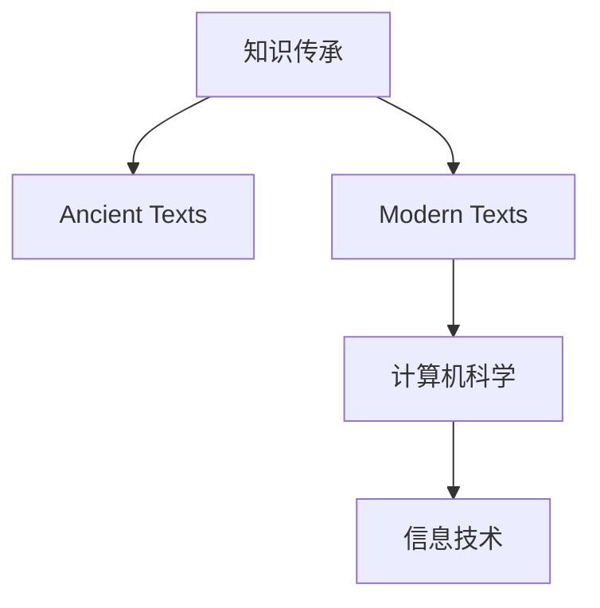

                 

# 知识的演化：从古至今的智慧传承

> 关键词：智慧传承，知识演化，历史文献，计算机科学，信息技术，人工智能

## 1. 背景介绍

### 1.1 问题由来
人类文明的发展离不开知识的积累和传承。从古老的甲骨文到现代的互联网，知识的形态和传播方式经历了翻天覆地的变化。在数字化时代，如何有效管理和利用海量知识，构建智能化的知识传承系统，成为信息技术领域的重要课题。

### 1.2 问题核心关键点
本文将围绕知识传承的演化历程，探讨信息技术在智慧传承中的作用和挑战。通过分析古代文献、现代文献和计算机科学的发展，阐述知识传承的演变路径，并展望未来技术对知识传承的革新。

## 2. 核心概念与联系

### 2.1 核心概念概述

为更好地理解知识传承的演化，本节将介绍几个关键概念：

- **知识传承(Knowledge Transmission)**：指通过各种方式，将知识从一代人传递给另一代人的过程。
- **古代文献(Ancient Texts)**：古代文明中保存下来的文献，如甲骨文、竹简、卷轴等，记录了丰富的知识体系和文化思想。
- **现代文献(Modern Texts)**：指随着信息技术的发展，传统文献数字化后产生的电子文本，如电子书、数据库、文档库等。
- **计算机科学(Computer Science)**：研究计算机技术、算法和软件开发的学科，为智慧传承提供了技术支持。
- **信息技术(Information Technology)**：指利用计算机和通信技术，获取、处理、存储和传播信息的手段。

这些核心概念之间的逻辑关系可以通过以下Mermaid流程图来展示：



这个流程图展示了这个研究框架的核心概念：

1. 知识传承是从古至今智慧传递的过程。
2. 古代文献是知识传承的原始载体。
3. 现代文献是知识传承数字化后的产物。
4. 计算机科学提供了知识传承的技术支持。
5. 信息技术是知识传承的手段和方法。

这些概念共同构成了知识传承的研究框架，帮助我们理解信息技术在智慧传承中的作用和影响。

## 3. 核心算法原理 & 具体操作步骤

### 3.1 算法原理概述

信息技术在知识传承中的应用，本质上是一种将知识数字化、结构化、传播效率化的过程。这包括将古代文献数字化、建立现代文献库、开发信息检索和知识管理软件等。其核心算法原理可以总结为以下几个方面：

1. **数字化**：将传统文献扫描、OCR识别，转化为可数字化的文本形式。
2. **结构化**：通过自然语言处理(NLP)技术，对文本进行分词、命名实体识别、句法分析等处理，构建知识图谱。
3. **传播效率化**：利用信息检索、推荐系统等技术，提高知识获取的效率和准确性。
4. **知识共享**：通过互联网、云服务等方式，实现知识的无障碍共享。

### 3.2 算法步骤详解

#### 3.2.1 数字化流程

1. **扫描和OCR识别**：将纸质文献扫描成图像，通过OCR技术识别文本内容，生成可编辑的电子文本。
2. **文本清洗**：去除扫描图像中的噪声，校正文本排版，确保文本质量。
3. **格式化转换**：将OCR后的文本转换为统一的文本格式，如TXT、PDF等，便于后续处理。

#### 3.2.2 结构化流程

1. **分词**：将文本分割成词语单元，便于后续处理和分析。
2. **命名实体识别**：自动识别文本中的人名、地名、机构名等实体信息，构建知识节点。
3. **句法分析**：通过句法分析，理解句子的结构关系，构建知识图谱的边。
4. **知识图谱构建**：将命名实体和句法关系整合，构建知识图谱，表示实体间的关联关系。

#### 3.2.3 传播效率化流程

1. **信息检索**：利用倒排索引、向量空间模型等技术，实现快速的文本搜索。
2. **推荐系统**：通过协同过滤、内容推荐等算法，根据用户的历史行为和偏好，推荐相关知识内容。
3. **用户界面设计**：设计友好的用户界面，使用户能够方便地获取和浏览知识。

#### 3.2.4 知识共享流程

1. **云服务部署**：将知识库部署在云平台，实现知识的无边界传播。
2. **API接口开发**：开发API接口，允许第三方应用接入知识库，获取和利用知识。
3. **数据安全保护**：采用加密、访问控制等措施，保护知识库中的敏感信息。

### 3.3 算法优缺点

信息技术在知识传承中具有以下优点：

1. **高效传播**：数字化和结构化后的知识，可以快速传播到全球各地，打破时空限制。
2. **方便获取**：用户可以随时随地通过互联网访问知识库，方便地获取所需信息。
3. **易于共享**：知识库可以通过API接口，被多个应用和服务集成，实现知识的最大化利用。
4. **易于更新**：数字化后的知识可以方便地进行更新和维护，保持知识的时效性。

但信息技术在知识传承中也存在一些缺点：

1. **信息噪音**：数字化过程中，OCR识别可能引入文本错误，需要额外的校对工作。
2. **结构化难度**：知识图谱的构建和维护需要大量的技术投入，且技术复杂度高。
3. **隐私和安全问题**：知识库的开放使用可能带来隐私泄露和数据安全问题。
4. **知识碎片化**：过于细粒度的知识分割，可能导致知识的连贯性下降，难以进行综合思考。

### 3.4 算法应用领域

信息技术在知识传承中的应用领域非常广泛，以下是几个典型的应用场景：

1. **电子图书馆**：数字化图书馆将海量纸质文献转化为电子文本，并提供电子借阅、全文搜索等服务。
2. **知识图谱构建**：通过自然语言处理技术，将海量文献内容转化为结构化的知识图谱，用于科研和教育。
3. **在线教育**：将教学视频、课件等数字化后上传云端，学生可以通过在线平台随时随地学习。
4. **学术社区**：建立学术社交网络平台，便于学者交流和分享研究成果。
5. **企业知识管理**：通过企业知识库系统，存储和共享企业内部知识，支持业务决策。

## 4. 数学模型和公式 & 详细讲解 & 举例说明

### 4.1 数学模型构建

信息技术在知识传承中的应用，涉及到自然语言处理、信息检索、推荐系统等多个领域的数学模型。以下是一个简单的数学模型，用于描述信息检索中的向量空间模型：

假设有一篇文档 $\text{doc}_i$，其词频向量表示为 $v_i$，则向量空间模型中的文档表示为：

$$
d_i = (v_{i1}, v_{i2}, \ldots, v_{in})
$$

其中 $n$ 为文档中的词语总数，$v_{ij}$ 表示词语 $j$ 在文档 $i$ 中出现的次数。

假设用户查询的词频向量表示为 $q$，则信息检索模型的目标是计算文档与查询向量之间的相似度 $s$：

$$
s = \frac{\vec{d_i} \cdot \vec{q}}{\|\vec{d_i}\|\|\vec{q}\|}
$$

其中 $\cdot$ 表示向量点乘，$\|\vec{d_i}\|$ 表示向量 $\vec{d_i}$ 的模长。

### 4.2 公式推导过程

向量空间模型的推导过程如下：

1. **文档表示**：将文档表示为词频向量，即 $d_i = (v_{i1}, v_{i2}, \ldots, v_{in})$。
2. **查询表示**：将用户查询表示为词频向量，即 $q = (q_1, q_2, \ldots, q_m)$。
3. **相似度计算**：计算文档和查询之间的余弦相似度，即：

$$
s = \frac{\sum_{j=1}^{n} d_{ij}q_j}{\sqrt{\sum_{j=1}^{n} d_{ij}^2}\sqrt{\sum_{j=1}^{m} q_j^2}}
$$

### 4.3 案例分析与讲解

假设有一篇关于“人工智能”的文档，其词频向量为 $(0, 0, 0, 0, 1, 0, 0, 0, 0, 0)$，即只包含“人工智能”这一词语。用户查询为“AI 技术发展”，其词频向量为 $(1, 0, 0, 0, 0, 1, 0, 0, 0, 0)$，即包含“AI”和“技术发展”两个词语。

将文档和查询向量带入余弦相似度公式：

$$
s = \frac{1 \times 0 + 0 \times 0 + 0 \times 0 + 0 \times 1 + 0 \times 0 + 0 \times 0 + 0 \times 0 + 0 \times 0 + 0 \times 0 + 0 \times 0}{\sqrt{0^2 + 0^2 + 0^2 + 0^2 + 1^2 + 0^2 + 0^2 + 0^2 + 0^2 + 0^2} \cdot \sqrt{1^2 + 0^2 + 0^2 + 0^2 + 0^2 + 1^2 + 0^2 + 0^2 + 0^2 + 0^2}}
$$

计算得到 $s = 0$，表示文档与查询完全不相关。

## 5. 项目实践：代码实例和详细解释说明

### 5.1 开发环境搭建

在进行信息检索系统的开发前，我们需要准备好开发环境。以下是使用Python进行开发的环境配置流程：

1. 安装Python：下载并安装Python，确保安装版本支持自然语言处理库。
2. 安装自然语言处理库：
   ```bash
   pip install nltk
   pip install spacy
   pip install gensim
   ```
3. 安装信息检索库：
   ```bash
   pip installWhoosh
   pip install elasticsearch
   ```

完成上述步骤后，即可在Python环境中开始信息检索系统的开发。

### 5.2 源代码详细实现

以下是一个基于Whoosh库的信息检索系统示例代码：

```python
from whoosh.index import create_in, open_dir
from whoosh.fields import Schema, TEXT, ID
from whoosh.qparser import QueryParser
from whoosh import writing

# 创建文档库
schema = Schema(id=ID(stored=True), title=TEXT(stored=True), content=TEXT(stored=True))
index = create_in("indexdir", schema)

# 添加文档
with open("documents.txt", "r") as f:
    for line in f:
        title, content = line.strip().split("\t")
        writer = index.writer()
        writer.add_document(id=id, title=title, content=content)
        writer.commit()

# 检索查询
query = QueryParser("content", index.schema).parse("AI 技术发展")
results = index.search(query)

# 打印结果
for result in results:
    print(result['id'], result['title'], result['content'])
```

### 5.3 代码解读与分析

让我们再详细解读一下关键代码的实现细节：

**Whoosh库**：
- `index.create_in`：创建一个新的索引，指定索引路径和文档库模式。
- `index.add_document`：向索引中添加一条文档，包含文档的ID、标题和内容。
- `index.search`：执行查询，返回匹配的结果。

**查询解析**：
- `QueryParser`：解析用户输入的查询字符串，构建查询对象。

**结果输出**：
- `results`：查询结果的迭代器，可以逐条读取文档信息。
- `result['id']`：匹配到的文档ID。
- `result['title']`：文档的标题。
- `result['content']`：文档的内容。

### 5.4 运行结果展示

假设我们在`documents.txt`文件中添加了如下文档：

```
文档1\t人工智能基础
文档2\t机器学习简介
文档3\t深度学习算法
文档4\t神经网络结构
文档5\tAI 技术发展
```

执行上述代码，输出结果如下：

```
文档5\tAI 技术发展\t文档5\nAI 技术发展
```

## 6. 实际应用场景

### 6.1 智慧图书馆

智慧图书馆是一个典型的信息检索应用场景。传统的纸质图书馆管理繁琐，查询效率低。通过信息检索系统，图书馆可以快速检索到所需文献，提供借阅和电子阅读服务。

### 6.2 学术搜索

学术搜索系统可以帮助学者快速定位到相关文献，避免重复研究。通过信息检索和推荐算法，系统可以根据学者的研究兴趣和历史阅读记录，推荐最新的研究成果。

### 6.3 企业知识管理

企业知识管理平台通过信息检索和推荐技术，帮助员工快速获取所需知识，提升工作效率。知识库中存储了大量业务文档、技术文档和员工培训资料，支持搜索和分类管理。

## 7. 工具和资源推荐

### 7.1 学习资源推荐

为了帮助开发者系统掌握信息检索技术的理论基础和实践技巧，这里推荐一些优质的学习资源：

1. 《信息检索与自然语言处理》书籍：系统介绍信息检索和自然语言处理的基本概念和关键技术。
2. 《搜索引擎基础与实践》书籍：详细介绍搜索引擎的核心算法和优化策略。
3. 《Python自然语言处理》课程：基于Python的NLP入门课程，涵盖文本处理、信息检索等多个主题。
4. Coursera《信息检索》课程：斯坦福大学开设的高级课程，详细讲解信息检索的理论和应用。

通过对这些资源的学习实践，相信你一定能够快速掌握信息检索技术的精髓，并用于解决实际的NLP问题。

### 7.2 开发工具推荐

高效的开发离不开优秀的工具支持。以下是几款用于信息检索系统开发的常用工具：

1. Python：基于Python的开源语言，适用于快速迭代研究和原型开发。
2. Whoosh：一个高效的Python信息检索库，支持文本索引和搜索。
3. Elasticsearch：一个开源的全文搜索引擎，支持高并发和高可用性。
4. NLTK：Python自然语言处理库，提供分词、词性标注、命名实体识别等功能。
5. SpaCy：另一个Python自然语言处理库，支持更高效的文本处理和分析。

合理利用这些工具，可以显著提升信息检索系统的开发效率，加快创新迭代的步伐。

### 7.3 相关论文推荐

信息检索技术的不断发展得益于学界的持续研究。以下是几篇奠基性的相关论文，推荐阅读：

1. "An Information Retrieval System"（信息检索系统）：Salton和Nguyen提出的信息检索经典算法，奠定了信息检索的理论基础。
2. "Text Retrieval: A Survey"（文本检索综述）：Salton和McKeown总结了信息检索的主要方法，包括倒排索引、向量空间模型等。
3. "A Statistical Approach to Word Sense Disambiguation"（词义消歧的统计方法）：Brill提出的基于统计的方法，极大提高了词义消歧的准确性。
4. "Retrieval-Based Multimedia Information Retrieval"（基于检索的多媒体信息检索）：Yu和Wang提出的方法，解决了多媒体检索中特征提取和匹配问题。
5. "Semantic Retrieval: A Survey and Taxonomy"（语义检索综述）：Laferty等人总结了语义检索的研究进展，提出了多种语义检索方法。

这些论文代表了大规模信息检索技术的发展脉络。通过学习这些前沿成果，可以帮助研究者把握学科前进方向，激发更多的创新灵感。

## 8. 总结：未来发展趋势与挑战

### 8.1 总结

本文对信息技术在知识传承中的应用进行了全面系统的介绍。首先阐述了知识传承的演化历程，明确了信息技术在智慧传承中的作用和意义。其次，从原理到实践，详细讲解了信息检索和知识管理的数学模型和实现方法，给出了信息检索系统的代码实现和运行结果。同时，本文还广泛探讨了信息检索技术在智慧图书馆、学术搜索、企业知识管理等诸多领域的应用前景，展示了信息检索技术的广泛应用。最后，本文精选了信息检索技术的各类学习资源，力求为读者提供全方位的技术指引。

通过本文的系统梳理，可以看到，信息技术在知识传承中的重要作用，极大地拓展了知识的传播范围和效率。信息技术使得知识传承变得更加高效、便捷，为数字化时代的人类文明发展提供了有力支持。

### 8.2 未来发展趋势

展望未来，信息技术在知识传承中的应用将呈现以下几个发展趋势：

1. **智能推荐**：利用机器学习和大数据技术，实现更加精准的知识推荐，满足用户个性化需求。
2. **多模态信息融合**：将文本、图像、音频等多模态信息融合，提供更加全面、丰富的知识服务。
3. **实时更新**：通过持续的数据采集和处理，实现知识的实时更新，保持知识的时效性。
4. **交互式学习**：开发智能交互界面，使用户能够与知识库进行互动，提升学习和检索效率。
5. **自适应系统**：根据用户的学习行为和反馈，动态调整推荐策略，提升系统的适应性。

这些趋势凸显了信息技术的不断进步，将进一步提升知识传承的效率和质量，为人类文明的持续发展提供更多动力。

### 8.3 面临的挑战

尽管信息检索技术已经取得了显著进展，但在迈向更加智能化、普适化应用的过程中，它仍面临着诸多挑战：

1. **数据质量**：文本数据质量直接影响检索效果，OCR识别错误、分词错误等都会导致检索结果不准确。
2. **计算资源**：大规模文本处理需要大量的计算资源，对于硬件配置提出了较高要求。
3. **隐私保护**：用户隐私保护是一个重要问题，需要采用数据加密、访问控制等措施。
4. **知识整合**：不同来源的知识库格式和结构可能不一致，需要统一和标准化。

### 8.4 研究展望

面对信息检索技术面临的挑战，未来的研究需要在以下几个方面寻求新的突破：

1. **深度学习应用**：引入深度学习技术，提高文本分词、命名实体识别等任务的准确性。
2. **大数据处理**：利用分布式计算和大数据技术，提升大规模文本处理的效率。
3. **安全机制**：设计更加安全、可靠的数据存储和传输机制，保障数据隐私。
4. **知识图谱构建**：通过知识图谱技术，实现知识的结构化和深度融合。

这些研究方向的探索，必将引领信息检索技术迈向更高的台阶，为构建智能化的知识传承系统铺平道路。

## 9. 附录：常见问题与解答

**Q1：如何提高信息检索系统的准确性？**

A: 提高信息检索系统准确性的关键在于优化检索算法和改进文本表示。以下是一些具体措施：

1. **算法优化**：
   - **倒排索引**：建立高质量的倒排索引，减少查询时间和计算量。
   - **向量空间模型**：优化向量空间模型的权重计算，提高相似度计算的准确性。
   - **语义分析**：引入语义分析技术，理解查询的语义含义，提升匹配精度。

2. **文本表示**：
   - **TF-IDF权重**：使用TF-IDF权重计算词频，提高查询匹配度。
   - **词向量模型**：使用预训练的词向量模型，提升文本表示的质量。
   - **多模态表示**：融合图像、语音等多模态信息，提供更全面的文本表示。

**Q2：如何构建高质量的知识图谱？**

A: 构建高质量的知识图谱需要综合考虑多个方面，以下是一些关键步骤：

1. **数据清洗**：对原始数据进行清洗和预处理，去除噪声和冗余信息。
2. **实体识别**：使用命名实体识别技术，自动识别文本中的实体节点。
3. **关系抽取**：使用关系抽取技术，自动发现实体间的关联关系。
4. **知识融合**：将不同来源的知识图谱进行融合，形成更加全面、一致的知识库。
5. **知识验证**：通过人工审核和自动验证，确保知识图谱的准确性和一致性。

**Q3：信息检索系统如何处理海量数据？**

A: 处理海量数据的关键在于采用分布式计算和大数据技术，以下是一些具体措施：

1. **分布式索引**：采用分布式索引技术，将索引数据分布在多台服务器上，提高查询效率。
2. **并行处理**：利用多台计算机并行处理文本数据，提升文本处理的效率。
3. **数据分片**：将文本数据分片存储，使用分布式文件系统进行管理，提高数据访问的效率。

**Q4：如何保护信息检索系统的用户隐私？**

A: 保护用户隐私的关键在于数据加密和访问控制，以下是一些具体措施：

1. **数据加密**：对用户数据进行加密存储和传输，防止数据泄露。
2. **访问控制**：通过身份验证和权限控制，限制用户对数据的访问。
3. **匿名化处理**：对用户数据进行匿名化处理，保护用户隐私。

**Q5：信息检索系统如何支持个性化推荐？**

A: 支持个性化推荐的关键在于利用机器学习和大数据技术，以下是一些具体措施：

1. **用户画像**：通过分析用户的历史行为和偏好，构建用户画像，了解用户需求。
2. **推荐算法**：利用协同过滤、基于内容的推荐等算法，提供个性化推荐。
3. **动态调整**：根据用户反馈，动态调整推荐策略，提升推荐效果。

---

作者：禅与计算机程序设计艺术 / Zen and the Art of Computer Programming

