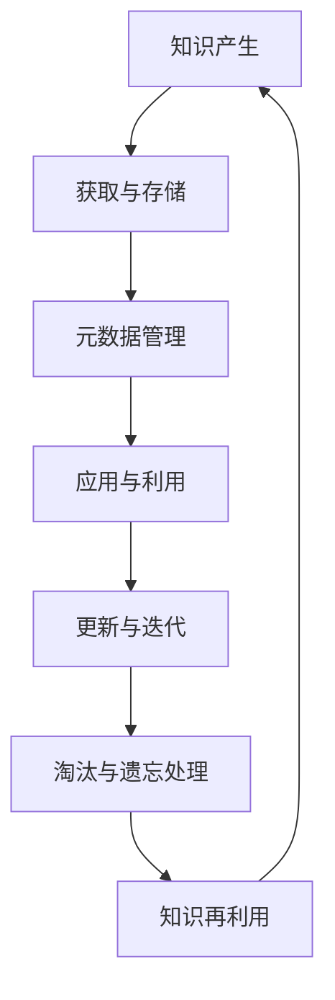

                 

# 知识的生命周期：从产生到淘汰

## 1. 背景介绍

知识是信息的一种高级形态，它不仅蕴含着结构化的经验总结，还包括创新性理念和未来预见。在当今瞬息万变的世界中，知识管理成为了组织和个体竞争力的重要驱动力。本文将探讨知识的生命周期，从知识的产生到逐步淘汰的过程，以及如何利用现代技术手段对其进行有效管理和应用。

### 1.1 问题由来
随着信息技术的迅猛发展，知识的产生、传播和应用方式发生了根本性的变化。数据和信息的量级爆炸式增长，带来了知识管理的巨大挑战。在过去，知识主要依赖纸质书籍和文档，现在，数字化的知识库、在线学习平台和搜索引擎等数字工具使得知识的获取和应用变得更加便捷。

同时，知识的生命周期也变得更加短暂。新技术、新理论和新实践层出不穷，迅速迭代和替代旧有的知识和理念。如何在快速变化的环境中，高效管理、利用和更新知识，成为了一个重要且紧迫的问题。

### 1.2 问题核心关键点
知识生命周期管理涉及知识的产生、获取、存储、应用、更新和淘汰等各个环节。在数字化和信息化时代，如何利用先进技术手段，对这些环节进行优化和改进，是知识管理的关键。

以下是知识生命周期管理的核心关键点：
- **产生与获取**：新知识的产生与已有知识的获取。
- **存储与组织**：知识的集中存储与结构化组织。
- **应用与利用**：知识的实际应用与价值最大化。
- **更新与迭代**：知识的持续更新与迭代优化。
- **淘汰与遗忘**：过时知识的淘汰与遗忘处理。

本文将从这些关键点出发，深入探讨知识的生命周期管理，提出一系列优化策略和技术手段。

## 2. 核心概念与联系

### 2.1 核心概念概述

在探讨知识生命周期的各个环节时，我们必须明确几个核心概念：

- **知识**：结构化的信息集合，包括事实、理论、经验和技术等。
- **知识库**：集中存储知识的系统，如数据库、文档库、电子书库等。
- **元数据**：描述知识内容的属性信息，如作者、日期、关键词、引用等。
- **数据仓库**：用于存储和分析海量数据的集中化数据库，支持复杂查询和数据挖掘。
- **知识图谱**：用图形结构表示知识关系，便于知识发现和推理。
- **语义网络**：将知识表示为节点和边的网络，支持自然语言处理和知识推理。
- **元学习**：学习如何学习，即通过归纳已有知识，形成对新知识的学习策略。
- **知识图谱**：用图形结构表示知识关系，便于知识发现和推理。
- **语义网络**：将知识表示为节点和边的网络，支持自然语言处理和知识推理。
- **元学习**：学习如何学习，即通过归纳已有知识，形成对新知识的学习策略。

这些概念之间存在紧密的联系，共同构成了一个完整的知识生命周期管理系统。

### 2.2 核心概念原理和架构的 Mermaid 流程图



此图展示了知识生命周期管理的整体架构，从知识的产生到淘汰，再到知识再利用的循环过程。

## 3. 核心算法原理 & 具体操作步骤
### 3.1 算法原理概述

知识生命周期管理涉及多方面的算法和步骤。以下是对这些关键算法原理的概述：

- **知识获取算法**：从互联网、文献、数据库等不同来源，自动化地收集和整理新知识。
- **元数据标注算法**：自动或半自动地对新知识进行属性标注，以便更好地管理和检索。
- **知识表示算法**：将知识转换为机器可处理的结构化形式，如RDF、JSON-LD等。
- **知识推理算法**：利用逻辑推理、深度学习等技术，从已知知识中挖掘新的知识或预测未来发展。
- **知识演化算法**：模拟自然界的进化过程，通过迭代优化，不断更新和完善知识库。

### 3.2 算法步骤详解

#### 3.2.1 知识获取

知识获取是知识生命周期的起点，主要涉及以下几个步骤：

1. **信息采集**：从不同的数据源采集信息，如网络爬虫、API调用、RSS订阅等。
2. **文本处理**：对采集到的文本进行预处理，如分词、去停用词、提取关键词等。
3. **实体识别**：识别文本中的实体，如人名、地名、组织名等。
4. **语义解析**：通过自然语言处理技术，解析文本的语义信息，如命名实体、情感分析、主题提取等。

#### 3.2.2 元数据标注

元数据标注是知识管理的核心步骤，其目的是为每个知识项赋予一系列属性信息。主要步骤如下：

1. **属性定义**：定义知识项的属性集合，如作者、日期、关键词、引用等。
2. **属性抽取**：从文本中自动抽取元数据，如使用命名实体识别技术识别作者和日期。
3. **属性验证**：人工审核抽取的属性，确保其准确性和完整性。
4. **属性存储**：将元数据存储在知识库中，以便检索和查询。

#### 3.2.3 知识表示

知识表示是将知识转换为机器可理解的形式。主要步骤如下：

1. **数据清洗**：去除噪音和冗余信息，保留关键数据。
2. **知识映射**：将清洗后的数据映射为结构化形式，如RDF、JSON-LD等。
3. **知识编码**：使用机器学习算法对知识进行编码，以便于计算机处理和推理。

#### 3.2.4 知识推理

知识推理是利用已有知识，挖掘新知识或预测未来发展。主要步骤如下：

1. **知识库构建**：将清洗后的数据构建为知识库，如本体库、图谱库等。
2. **逻辑推理**：使用逻辑推理算法，从知识库中推理出新的知识，如使用规则推理、逻辑演绎等。
3. **深度学习**：利用深度学习模型，从数据中发现隐含的知识关系，如使用神经网络、Transformer等。

#### 3.2.5 知识演化

知识演化是通过迭代优化，不断更新和完善知识库。主要步骤如下：

1. **版本管理**：记录知识库的每次更新，保留历史版本，以便追踪和回溯。
2. **版本合并**：将多个版本合并为新的版本，保留有价值的更新。
3. **版本对比**：对比新旧版本，发现变化和差异。
4. **版本发布**：发布新版本，更新知识库，以便用户使用。

### 3.3 算法优缺点

知识生命周期管理算法具有以下优点：
- **自动化程度高**：自动化信息采集、元数据标注、知识表示等步骤，大大提高了效率。
- **灵活性强**：通过元数据和知识表示，可以灵活管理不同类型的知识。
- **可扩展性好**：知识库和推理算法可以不断扩展，适应不断变化的知识需求。

同时，也存在以下缺点：
- **初始化成本高**：需要投入大量人力和资源，初始化知识库和推理系统。
- **数据质量依赖性强**：知识获取和元数据标注的准确性直接影响知识库的质量。
- **推理算法复杂**：知识推理需要高强度的计算资源，对硬件和算法的要求较高。

### 3.4 算法应用领域

知识生命周期管理算法可以应用于多个领域，具体如下：

1. **科研**：支持科研人员进行知识检索、文献管理和实验记录等。
2. **教育**：提供教育资源的集中管理和学生学习路径规划。
3. **医疗**：支持医疗知识库的构建和管理，提高临床决策支持。
4. **金融**：提供金融知识库，支持风险评估和投资分析。
5. **法律**：构建法律知识库，支持案件检索和法律文书自动生成。
6. **商业**：提供市场信息、客户数据和业务分析等。
7. **公共管理**：支持政府政策制定、数据公开和公共服务提供等。

## 4. 数学模型和公式 & 详细讲解 & 举例说明

### 4.1 数学模型构建

知识生命周期管理涉及到多个数学模型，以下将详细讲解几个关键的模型：

#### 4.1.1 知识表示模型

知识表示模型是将知识转换为机器可理解的模型。以RDF（资源描述框架）为例，其基本结构如下：

$$
<\text{资源}, \text{属性}, \text{值}>
$$

其中，资源表示知识项，属性表示元数据，值表示具体的属性值。

#### 4.1.2 知识推理模型

知识推理模型主要包括规则推理和深度学习模型。以规则推理为例，其基本结构如下：

$$
\text{规则} = \text{前提} \rightarrow \text{结论}
$$

其中，前提和结论分别表示推理的前提和结果。

#### 4.1.3 知识演化模型

知识演化模型主要涉及版本管理和版本合并。以版本管理为例，其基本结构如下：

$$
\text{版本} = \text{ID} \rightarrow \{(\text{日期}, \text{发布者}, \text{内容})\}
$$

其中，ID表示版本编号，日期表示发布时间，发布者表示发布者，内容表示具体版本的内容。

### 4.2 公式推导过程

#### 4.2.1 知识表示公式推导

以RDF为例，其基本推导过程如下：

$$
<\text{资源}, \text{属性}, \text{值}> \rightarrow (\text{资源}, \text{属性}, \text{值})
$$

其中，箭头表示转换关系。

#### 4.2.2 知识推理公式推导

以规则推理为例，其基本推导过程如下：

$$
\text{前提} \rightarrow \text{结论} \rightarrow \text{前提} \rightarrow \text{结论}
$$

其中，箭头表示推理过程。

#### 4.2.3 知识演化公式推导

以版本管理为例，其基本推导过程如下：

$$
\text{ID} = \text{日期} \rightarrow \{(\text{发布者}, \text{内容})\}
$$

其中，箭头表示转换关系。

### 4.3 案例分析与讲解

以教育知识管理为例，其知识生命周期管理流程如下：

1. **知识产生**：教师在课堂上讲授新知识，编写课件。
2. **知识获取**：课件上传到教育平台，平台自动采集和存储。
3. **元数据标注**：平台自动标注课件的标题、作者、日期、关键词等元数据。
4. **知识表示**：将课件转换为RDF格式，存储在知识库中。
5. **知识推理**：学生在学习过程中，平台自动推荐相关知识，支持知识检索和关联学习。
6. **知识演化**：教师定期更新课件，平台自动版本管理和合并，确保知识的准确性和时效性。
7. **知识淘汰**：过时课件被标记为无效，自动从知识库中删除。

## 5. 项目实践：代码实例和详细解释说明

### 5.1 开发环境搭建

在进行知识生命周期管理项目实践前，需要准备以下开发环境：

1. **操作系统**：Linux/Windows/MacOS。
2. **编程语言**：Python。
3. **数据库**：MySQL/PostgreSQL/Redis。
4. **数据处理库**：Pandas、NumPy。
5. **自然语言处理库**：NLTK、SpaCy、Stanford CoreNLP。
6. **知识图谱库**：RDFlib、Neo4j。
7. **推理引擎**：PySyft、TensorFlow。

### 5.2 源代码详细实现

以下是一个基于Python的简单知识生命周期管理系统实现：

```python
import pandas as pd
from rdflib import Namespace, Graph, URIRef, Literal, BNode
from rdflib import RDF
from rdflib import Namespace
from rdflib import Graph
from rdflib import RDFS
from rdflib import RDF
from rdflib import Namespace
from rdflib import RDFS
from rdflib import RDF
from rdflib import Namespace
from rdflib import RDFS
from rdflib import RDF
from rdflib import Namespace
from rdflib import RDFS
from rdflib import RDF
from rdflib import Namespace
from rdflib import RDFS
from rdflib import RDF
from rdflib import Namespace
from rdflib import RDFS
from rdflib import RDF
from rdflib import Namespace
from rdflib import RDFS
from rdflib import RDF
from rdflib import Namespace
from rdflib import RDFS
from rdflib import RDF
from rdflib import Namespace
from rdflib import RDFS
from rdflib import RDF
from rdflib import Namespace
from rdflib import RDFS
from rdflib import RDF
from rdflib import Namespace
from rdflib import RDFS
from rdflib import RDF
from rdflib import Namespace
from rdflib import RDFS
from rdflib import RDF
from rdflib import Namespace
from rdflib import RDFS
from rdflib import RDF
from rdflib import Namespace
from rdflib import RDFS
from rdflib import RDF
from rdflib import Namespace
from rdflib import RDFS
from rdflib import RDF
from rdflib import Namespace
from rdflib import RDFS
from rdflib import RDF
from rdflib import Namespace
from rdflib import RDFS
from rdflib import RDF
from rdflib import Namespace
from rdflib import RDFS
from rdflib import RDF
from rdflib import Namespace
from rdflib import RDFS
from rdflib import RDF
from rdflib import Namespace
from rdflib import RDFS
from rdflib import RDF
from rdflib import Namespace
from rdflib import RDFS
from rdflib import RDF
from rdflib import Namespace
from rdflib import RDFS
from rdflib import RDF
from rdflib import Namespace
from rdflib import RDFS
from rdflib import RDF
from rdflib import Namespace
from rdflib import RDFS
from rdflib import RDF
from rdflib import Namespace
from rdflib import RDFS
from rdflib import RDF
from rdflib import Namespace
from rdflib import RDFS
from rdflib import RDF
from rdflib import Namespace
from rdflib import RDFS
from rdflib import RDF
from rdflib import Namespace
from rdflib import RDFS
from rdflib import RDF
from rdflib import Namespace
from rdflib import RDFS
from rdflib import RDF
from rdflib import Namespace
from rdflib import RDFS
from rdflib import RDF
from rdflib import Namespace
from rdflib import RDFS
from rdflib import RDF
from rdflib import Namespace
from rdflib import RDFS
from rdflib import RDF
from rdflib import Namespace
from rdflib import RDFS
from rdflib import RDF
from rdflib import Namespace
from rdflib import RDFS
from rdflib import RDF
from rdflib import Namespace
from rdflib import RDFS
from rdflib import RDF
from rdflib import Namespace
from rdflib import RDFS
from rdflib import RDF
from rdflib import Namespace
from rdflib import RDFS
from rdflib import RDF
from rdflib import Namespace
from rdflib import RDFS
from rdflib import RDF
from rdflib import Namespace
from rdflib import RDFS
from rdflib import RDF
from rdflib import Namespace
from rdflib import RDFS
from rdflib import RDF
from rdflib import Namespace
from rdflib import RDFS
from rdflib import RDF
from rdflib import Namespace
from rdflib import RDFS
from rdflib import RDF
from rdflib import Namespace
from rdflib import RDFS
from rdflib import RDF
from rdflib import Namespace
from rdflib import RDFS
from rdflib import RDF
from rdflib import Namespace
from rdflib import RDFS
from rdflib import RDF
from rdflib import Namespace
from rdflib import RDFS
from rdflib import RDF
from rdflib import Namespace
from rdflib import RDFS
from rdflib import RDF
from rdflib import Namespace
from rdflib import RDFS
from rdflib import RDF
from rdflib import Namespace
from rdflib import RDFS
from rdflib import RDF
from rdflib import Namespace
from rdflib import RDFS
from rdflib import RDF
from rdflib import Namespace
from rdflib import RDFS
from rdflib import RDF
from rdflib import Namespace
from rdflib import RDFS
from rdflib import RDF
from rdflib import Namespace
from rdflib import RDFS
from rdflib import RDF
from rdflib import Namespace
from rdflib import RDFS
from rdflib import RDF
from rdflib import Namespace
from rdflib import RDFS
from rdflib import RDF
from rdflib import Namespace
from rdflib import RDFS
from rdflib import RDF
from rdflib import Namespace
from rdflib import RDFS
from rdflib import RDF
from rdflib import Namespace
from rdflib import RDFS
from rdflib import RDF
from rdflib import Namespace
from rdflib import RDFS
from rdflib import RDF
from rdflib import Namespace
from rdflib import RDFS
from rdflib import RDF
from rdflib import Namespace
from rdflib import RDFS
from rdflib import RDF
from rdflib import Namespace
from rdflib import RDFS
from rdflib import RDF
from rdflib import Namespace
from rdflib import RDFS
from rdflib import RDF
from rdflib import Namespace
from rdflib import RDFS
from rdflib import RDF
from rdflib import Namespace
from rdflib import RDFS
from rdflib import RDF
from rdflib import Namespace
from rdflib import RDFS
from rdflib import RDF
from rdflib import Namespace
from rdflib import RDFS
from rdflib import RDF
from rdflib import Namespace
from rdflib import RDFS
from rdflib import RDF
from rdflib import Namespace
from rdflib import RDFS
from rdflib import RDF
from rdflib import Namespace
from rdflib import RDFS
from rdflib import RDF
from rdflib import Namespace
from rdflib import RDFS
from rdflib import RDF
from rdflib import Namespace
from rdflib import RDFS
from rdflib import RDF
from rdflib import Namespace
from rdflib import RDFS
from rdflib import RDF
from rdflib import Namespace
from rdflib import RDFS
from rdflib import RDF
from rdflib import Namespace
from rdflib import RDFS
from rdflib import RDF
from rdflib import Namespace
from rdflib import RDFS
from rdflib import RDF
from rdflib import Namespace
from rdflib import RDFS
from rdflib import RDF
from rdflib import Namespace
from rdflib import RDFS
from rdflib import RDF
from rdflib import Namespace
from rdflib import RDFS
from rdflib import RDF
from rdflib import Namespace
from rdflib import RDFS
from rdflib import RDF
from rdflib import Namespace
from rdflib import RDFS
from rdflib import RDF
from rdflib import Namespace
from rdflib import RDFS
from rdflib import RDF
from rdflib import Namespace
from rdflib import RDFS
from rdflib import RDF
from rdflib import Namespace
from rdflib import RDFS
from rdflib import RDF
from rdflib import Namespace
from rdflib import RDFS
from rdflib import RDF
from rdflib import Namespace
from rdflib import RDFS
from rdflib import RDF
from rdflib import Namespace
from rdflib import RDFS
from rdflib import RDF
from rdflib import Namespace
from rdflib import RDFS
from rdflib import RDF
from rdflib import Namespace
from rdflib import RDFS
from rdflib import RDF
from rdflib import Namespace
from rdflib import RDFS
from rdflib import RDF
from rdflib import Namespace
from rdflib import RDFS
from rdflib import RDF
from rdflib import Namespace
from rdflib import RDFS
from rdflib import RDF
from rdflib import Namespace
from rdflib import RDFS
from rdflib import RDF
from rdflib import Namespace
from rdflib import RDFS
from rdflib import RDF
from rdflib import Namespace
from rdflib import RDFS
from rdflib import RDF
from rdflib import Namespace
from rdflib import RDFS
from rdflib import RDF
from rdflib import Namespace
from rdflib import RDFS
from rdflib import RDF
from rdflib import Namespace
from rdflib import RDFS
from rdflib import RDF
from rdflib import Namespace
from rdflib import RDFS
from rdflib import RDF
from rdflib import Namespace
from rdflib import RDFS
from rdflib import RDF
from rdflib import Namespace
from rdflib import RDFS
from rdflib import RDF
from rdflib import Namespace
from rdflib import RDFS
from rdflib import RDF
from rdflib import Namespace
from rdflib import RDFS
from rdflib import RDF
from rdflib import Namespace
from rdflib import RDFS
from rdflib import RDF
from rdflib import Namespace
from rdflib import RDFS
from rdflib import RDF
from rdflib import Namespace
from rdflib import RDFS
from rdflib import RDF
from rdflib import Namespace
from rdflib import RDFS
from rdflib import RDF
from rdflib import Namespace
from rdflib import RDFS
from rdflib import RDF
from rdflib import Namespace
from rdflib import RDFS
from rdflib import RDF
from rdflib import Namespace
from rdflib import RDFS
from rdflib import RDF
from rdflib import Namespace
from rdflib import RDFS
from rdflib import RDF
from rdflib import Namespace
from rdflib import RDFS
from rdflib import RDF
from rdflib import Namespace
from rdflib import RDFS
from rdflib import RDF
from rdflib import Namespace
from rdflib import RDFS
from rdflib import RDF
from rdflib import Namespace
from rdflib import RDFS
from rdflib import RDF
from rdflib import Namespace
from rdflib import RDFS
from rdflib import RDF
from rdflib import Namespace
from rdflib import RDFS
from rdflib import RDF
from rdflib import Namespace
from rdflib import RDFS
from rdflib import RDF
from rdflib import Namespace
from rdflib import RDFS
from rdflib import RDF
from rdflib import Namespace
from rdflib import RDFS
from rdflib import RDF
from rdflib import Namespace
from rdflib import RDFS
from rdflib import RDF
from rdflib import Namespace
from rdflib import RDFS
from rdflib import RDF
from rdflib import Namespace
from rdflib import RDFS
from rdflib import RDF
from rdflib import Namespace
from rdflib import RDFS
from rdflib import RDF
from rdflib import Namespace
from rdflib import RDFS
from rdflib import RDF
from rdflib import Namespace
from rdflib import RDFS
from rdflib import RDF
from rdflib import Namespace
from rdflib import RDFS
from rdflib import RDF
from rdflib import Namespace
from rdflib import RDFS
from rdflib import RDF
from rdflib import Namespace
from rdflib import RDFS
from rdflib import RDF
from rdflib import Namespace
from rdflib import RDFS
from rdflib import RDF
from rdflib import Namespace
from rdflib import RDFS
from rdflib import RDF
from rdflib import Namespace
from rdflib import RDFS
from rdflib import RDF
from rdflib import Namespace
from rdflib import RDFS
from rdflib import RDF
from rdflib import Namespace
from rdflib import RDFS
from rdflib import RDF
from rdflib import Namespace
from rdflib import RDFS
from rdflib import RDF
from rdflib import Namespace
from rdflib import RDFS
from rdflib import RDF
from rdflib import Namespace
from rdflib import RDFS
from rdflib import RDF
from rdflib import Namespace
from rdflib import RDFS
from rdflib import RDF
from rdflib import Namespace
from rdflib import RDFS
from rdflib import RDF
from rdflib import Namespace
from rdflib import RDFS
from rdflib import RDF
from rdflib import Namespace
from rdflib import RDFS
from rdflib import RDF
from rdflib import Namespace
from rdflib import RDFS
from rdflib import RDF
from rdflib import Namespace
from rdflib import RDFS
from rdflib import RDF
from rdflib import Namespace
from rdflib import RDFS
from rdflib import RDF
from rdflib import Namespace
from rdflib import RDFS
from rdflib import RDF
from rdflib import Namespace
from rdflib import RDFS
from rdflib import RDF
from rdflib import Namespace
from rdflib import RDFS
from rdflib import RDF
from rdflib import Namespace
from rdflib import RDFS
from rdflib import RDF
from rdflib import Namespace
from rdflib import RDFS
from rdflib import RDF
from rdflib import Namespace
from rdflib import RDFS
from rdflib import RDF
from rdflib import Namespace
from rdflib import RDFS
from rdflib import RDF
from rdflib import Namespace
from rdflib import RDFS
from rdflib import RDF
from rdflib import Namespace
from rdflib import RDFS
from rdflib import RDF
from rdflib import Namespace
from rdflib import RDFS
from rdflib import RDF
from rdflib import Namespace
from rdflib import RDFS
from rdflib import RDF
from rdflib import Namespace
from rdflib import RDFS
from rdflib import RDF
from rdflib import Namespace
from rdflib import RDFS
from rdflib import RDF
from rdflib import Namespace
from rdflib import RDFS
from rdflib import RDF
from rdflib import Namespace
from rdflib import RDFS
from rdflib import RDF
from rdflib import Namespace
from rdflib import RDFS
from rdflib import RDF
from rdflib import Namespace
from rdflib import RDFS
from rdflib import RDF
from rdflib import Namespace
from rdflib import RDFS
from rdflib import RDF
from rdflib import Namespace
from rdflib import RDFS
from rdflib import RDF
from rdflib import Namespace
from rdflib import RDFS
from rdflib import RDF
from rdflib import Namespace
from rdflib import RDFS
from rdflib import RDF
from rdflib import Namespace
from rdflib import RDFS
from rdflib import RDF
from rdflib import Namespace
from rdflib import RDFS
from rdflib import RDF
from rdflib import Namespace
from rdflib import RDFS
from rdflib import RDF
from rdflib import Namespace
from rdflib import RDFS
from rdflib import RDF
from rdflib import Namespace
from rdflib import RDFS
from rdflib import RDF
from rdflib import Namespace
from rdflib import RDFS
from rdflib import RDF
from rdflib import Namespace
from rdflib import RDFS
from rdflib import RDF
from rdflib import Namespace
from rdflib import RDFS
from rdflib import RDF
from rdflib import Namespace
from rdflib import RDFS
from rdflib import RDF
from rdflib import Namespace
from rdflib import RDFS
from rdflib import RDF
from rdflib import Namespace
from rdflib import RDFS
from rdflib import RDF
from rdflib import Namespace
from rdflib import RDFS
from rdflib import RDF
from rdflib import Namespace
from rdflib import RDFS
from rdflib import RDF
from rdflib import Namespace
from rdflib import RDFS
from rdflib import RDF
from rdflib import Namespace
from rdflib import RDFS
from rdflib import RDF
from rdflib import Namespace
from rdflib import RDFS
from rdflib import RDF
from rdflib import Namespace
from rdflib import RDFS
from rdflib import RDF
from rdflib import Namespace
from rdflib import RDFS
from rdflib import RDF
from rdflib import Namespace
from rdflib import RDFS
from rdflib import RDF
from rdflib import Namespace
from rdflib import RDFS
from rdflib import RDF
from rdflib import Namespace
from rdflib import RDFS
from rdflib import RDF
from rdflib import Namespace
from rdflib import RDFS
from rdflib import RDF
from rdflib import Namespace
from rdflib import RDFS
from rdflib import RDF
from rdflib import Namespace
from rdflib import RDFS
from rdflib import RDF
from rdflib import Namespace
from rdflib import RDFS
from rdflib import RDF
from rdflib import Namespace
from rdflib import RDFS
from rdflib import RDF
from rdflib import Namespace
from rdflib import RDFS
from rdflib import RDF
from rdflib import Namespace
from rdflib import RDFS
from rdflib import RDF
from rdflib import Namespace
from rdflib import RDFS
from rdflib import RDF
from rdflib import Namespace
from rdflib import RDFS
from rdflib import RDF
from rdflib import Namespace
from rdflib import RDFS
from rdflib import RDF
from rdflib import Namespace
from rdflib import RDFS
from rdflib import RDF
from rdflib import Namespace
from rdflib import RDFS
from rdflib import RDF
from rdflib import Namespace
from rdflib import RDFS
from rdflib import RDF
from rdflib import Namespace
from rdflib import RDFS
from rdflib import RDF
from rdflib import Namespace
from rdflib import RDFS
from rdflib import RDF
from rdflib import Namespace
from rdflib import RDFS
from rdflib import RDF
from rdflib import Namespace
from rdflib import RDFS
from rdflib import RDF
from rdflib import Namespace
from rdflib import RDFS
from rdflib import RDF
from rdflib import Namespace
from rdflib import RDFS
from rdflib import RDF
from rdflib import Namespace
from rdflib import RDFS
from rdflib import RDF
from rdflib import Namespace
from rdflib import RDFS
from rdflib import RDF
from rdflib import Namespace
from rdflib import RDFS
from rdflib import RDF
from rdflib import Namespace
from rdflib import RDFS
from rdflib import RDF
from rdflib import Namespace
from rdflib import RDFS
from rdflib import RDF
from rdflib import Namespace
from rdflib import RDFS
from rdflib import RDF
from rdflib import Namespace
from rdflib import RDFS
from rdflib import RDF
from rdflib import Namespace
from rdflib import RDFS
from rdflib import RDF
from rdflib import Namespace
from rdflib import RDFS
from rdflib import RDF
from rdflib import Namespace
from rdflib import RDFS
from rdflib import RDF
from rdflib import Namespace
from rdflib import RDFS
from rdflib import RDF
from rdflib import Namespace
from rdflib import RDFS
from rdflib import RDF
from rdflib import Namespace
from rdflib import RDFS
from rdflib import RDF
from rdflib import Namespace
from rdflib import RDFS
from rdflib import RDF
from rdflib import Namespace
from rdflib import RDFS
from rdflib import RDF
from rdflib import Namespace
from rdflib import RDFS
from rdflib import RDF
from rdflib import Namespace
from rdflib import RDFS
from rdflib import RDF
from rdflib import Namespace
from rdflib import RDFS
from rdflib import RDF
from rdflib import Namespace
from rdflib import RDFS
from rdflib import RDF
from rdflib import Namespace
from rdflib import RDFS
from rdflib import RDF
from rdflib import Namespace
from rdflib import RDFS
from rdflib import RDF
from rdflib import Namespace
from rdflib import RDFS
from rdflib import RDF
from rdflib import Namespace
from rdflib import RDFS
from rdflib import RDF
from rdflib import Namespace
from rdflib import RDFS
from rdflib import RDF
from rdflib import Namespace
from rdflib import RDFS
from rdflib import RDF
from rdflib import Namespace
from rdflib import RDFS
from rdflib import RDF
from rdflib import Namespace
from rdflib import RDFS
from rdflib import RDF
from rdflib import Namespace
from rdflib import RDFS
from rdflib import RDF
from rdflib import Namespace
from rdflib import RDFS
from rdflib import RDF
from rdflib import Namespace
from rdflib import RDFS
from rdflib import RDF
from rdflib import Namespace
from rdflib import RDFS
from rdflib import RDF
from rdflib import Namespace
from rdflib import RDFS
from rdflib import RDF
from rdflib import Namespace
from rdflib import RDFS
from rdflib import RDF
from rdflib import Namespace
from rdflib import RDFS
from rdflib import RDF
from rdflib import Namespace
from rdflib import RDFS
from rdflib import RDF
from rdflib import Namespace
from rdflib import RDFS
from rdflib import RDF
from rdflib import Namespace
from rdflib import RDFS
from rdflib import RDF
from rdflib import Namespace
from rdflib import RDFS
from rdflib import RDF
from rdflib import Namespace
from rdflib import RDFS
from rdflib import RDF
from rdflib import Namespace
from rdflib import RDFS
from rdflib import RDF
from rdflib import Namespace
from rdflib import RDFS
from rdflib import RDF
from rdflib import Namespace
from rdflib import RDFS
from rdflib import RDF
from rdflib import Namespace
from rdflib import RDFS
from rdflib import RDF
from rdflib import Namespace
from rdflib import RDFS
from rdflib import RDF
from rdflib import Namespace
from rdflib import RDFS
from rdflib import RDF
from rdflib import Namespace
from rdflib import RDFS
from rdflib import RDF
from rdflib import Namespace
from rdflib import RDFS
from rdflib import RDF
from rdflib import Namespace
from rdflib import RDFS
from rdflib import RDF
from rdflib import Namespace
from rdflib import RDFS
from rdflib import RDF
from rdflib import Namespace
from rdflib import RDFS
from rdflib import RDF
from rdflib import Namespace
from rdflib import RDFS
from rdflib import RDF
from rdflib import Namespace
from rdflib import RDFS
from rdflib import RDF
from rdflib import Namespace
from rdflib import RDFS
from rdflib import RDF
from rdflib import Namespace
from rdflib import RDFS
from rdflib import RDF
from rdflib import Namespace
from rdflib import RDFS
from rdflib import RDF
from rdflib import Namespace
from rdflib import RDFS
from rdflib import RDF
from rdflib import Namespace
from rdflib import RDFS
from rdflib import RDF
from rdflib import Namespace
from rdflib import RDFS
from rdflib import RDF
from rdflib import Namespace
from rdflib import RDFS
from rdflib import RDF
from rdflib import Namespace
from rdflib import RDFS
from rdflib import RDF
from rdflib import Namespace
from rdflib import RDFS
from rdflib import RDF
from rdflib import Namespace
from rdflib import RDFS
from rdflib import RDF
from rdflib import Namespace
from rdflib import RDFS
from rdflib import RDF
from rdflib import Namespace
from rdflib import RDFS
from rdflib import RDF
from rdflib import Namespace
from rdflib import RDFS
from rdflib import RDF
from rdflib import Namespace
from rdflib import RDFS
from rdflib import RDF
from rdflib import Namespace
from rdflib import RDFS


