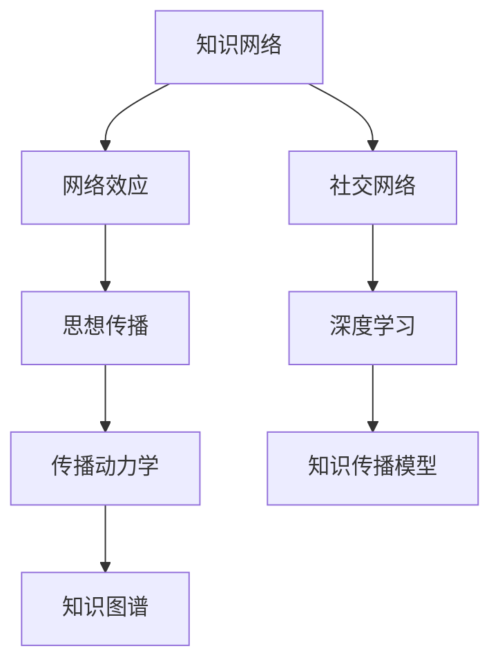

                 

# 知识的网络效应：思想传播的动力学

> 关键词：知识网络、网络效应、思想传播、信息流、传播动力学、知识图谱、社交网络、深度学习、知识传播模型

## 1. 背景介绍

在信息爆炸的时代，知识如何有效传播成为至关重要的问题。当前，传统的知识传播方式主要以书籍、报纸、电视等为媒介，存在着传播效率低、传播范围有限、互动性差等不足。而互联网的兴起则彻底颠覆了这一格局，知识可以通过网络快速传播，范围遍及全球，互动性也得到了极大提升。

然而，尽管互联网提供了丰富的知识传播渠道，但知识传播的效果仍然存在诸多瓶颈。如何高效利用网络资源，最大化知识的传播效益，仍是需要深入研究的问题。本文将从知识网络的角度出发，深入探讨知识传播的动力学机制，揭示网络效应对知识传播的影响，并给出基于深度学习的知识传播模型，以期为知识传播效率的提升提供新思路。

## 2. 核心概念与联系

### 2.1 核心概念概述

本节将介绍几个核心的概念，并阐述它们之间的联系：

- 知识网络(Knowledge Network)：由节点和边组成的网络结构，每个节点代表一个知识单元，边表示节点之间的关系。知识网络可以通过自然语言处理、知识图谱等技术构建，包含大量有关领域的知识单元。
- 网络效应(Network Effect)：指在网络中，每个节点对整个网络的价值提升具有正反馈机制。例如，当用户数增加时，每个用户可以获得的价值也随之增加。
- 思想传播(Thought Propagation)：指知识在网络中的传递和扩散过程。每个节点将自身的知识信息传递给相邻节点，影响其知识水平和网络结构。
- 传播动力学(Propagation Dynamics)：研究知识在网络中传播的规律和过程，探讨传播速度、范围、持续性等关键指标。
- 知识图谱(Knowledge Graph)：一种结构化知识表示方法，通过节点和边的组合，形成知识网络。知识图谱可以帮助构建更丰富、准确的知识网络，提高知识传播的效果。
- 社交网络(Social Network)：一种特殊的网络结构，节点代表人或组织，边表示它们之间的社交关系。社交网络在知识传播中具有重要应用，如学术引用、社交媒体等。
- 深度学习(Deep Learning)：一种通过多层神经网络进行特征学习和模型训练的方法，能够自动提取数据中的高层次特征，广泛应用于图像识别、自然语言处理等领域。
- 知识传播模型(Knowledge Propagation Model)：基于深度学习等技术构建的模型，用于模拟知识在网络中的传播过程，预测知识传播的效果和路径。

这些概念之间的联系可以通过以下Mermaid流程图来展示：



## 3. 核心算法原理 & 具体操作步骤
### 3.1 算法原理概述

知识传播的动力学模型主要关注知识在网络中的传递和扩散过程。该模型认为，知识传播的过程可以分为三个阶段：扩散、接受、传播。每个节点（知识单元）在传播过程中通过与相邻节点交互，更新自身的状态，最终影响整个网络的知识分布。

知识传播动力学模型的一般形式可以表示为：

$$
S(t+1) = f(S(t),N(t),A(t))
$$

其中，$S(t)$ 表示知识网络在时间 $t$ 的状态，$N(t)$ 表示网络中节点的数量，$A(t)$ 表示知识在网络中的接受率。函数 $f$ 描述了知识传播的动态变化，可以是基于社会网络、知识图谱等的模型。

### 3.2 算法步骤详解

基于知识传播动力学模型的算法主要包括以下几个步骤：

**Step 1: 知识网络构建**

首先需要构建知识网络，可以通过以下步骤实现：
- 定义知识单元：将知识文本进行分词、命名实体识别等处理，转化为知识单元。
- 构建知识图谱：通过提取知识单元之间的关系，构建知识图谱。
- 构建社交网络：通过社交网络分析工具，分析用户间的互动关系，构建社交网络。

**Step 2: 网络效应计算**

网络效应描述了每个节点对整个网络的影响，可以通过以下步骤计算：
- 计算节点度数：统计每个节点的邻居数量。
- 计算网络平均度数：统计整个网络的平均度数。
- 计算节点影响因子：将节点度数和网络平均度数进行组合，计算每个节点对网络的知识贡献度。

**Step 3: 思想传播模拟**

思想传播模拟可以采用基于社会网络和知识图谱的模型，如节点扩散模型、链传播模型等。具体步骤如下：
- 初始化节点状态：将每个节点初始化为相同的状态，表示其知识水平。
- 定义传播规则：根据节点间的关系，确定知识传播的规则，如随机传播、传染病传播等。
- 模拟传播过程：按照传播规则，更新每个节点状态，直至达到稳定状态。

**Step 4: 传播动力学分析**

传播动力学分析可以采用统计学方法，如仿真、蒙特卡洛模拟等，评估知识传播的效果和路径。具体步骤如下：
- 定义评估指标：如传播速度、范围、持续性等。
- 设定模拟参数：如传播规则、时间步长等。
- 运行仿真模拟：根据设定参数，运行知识传播仿真模拟，统计结果。

### 3.3 算法优缺点

知识传播动力学模型具有以下优点：
1. 能够刻画知识传播的全过程，包括扩散、接受、传播等环节。
2. 可以模拟知识传播的动态变化，评估知识传播的效果和路径。
3. 可以基于社交网络和知识图谱等数据构建模型，更具真实性。

同时，该模型也存在一些缺点：
1. 计算复杂度高：知识传播过程涉及大量节点和边，计算复杂度较高。
2. 数据需求量大：需要大量有关领域的数据构建知识网络，数据获取难度较大。
3. 难以处理动态变化：知识网络的结构和节点状态是动态变化的，模型难以实时跟踪和调整。
4. 缺乏可解释性：模型的复杂性使得其决策过程难以解释，难以进行调试和优化。

### 3.4 算法应用领域

知识传播动力学模型在多个领域具有广泛的应用：

- 社交媒体：通过分析社交网络中的用户互动关系，预测信息传播速度和范围。
- 学术引用：通过构建学术引用网络，分析论文的影响力和传播路径。
- 疾病传播：通过构建疾病传播网络，预测疾病传播的速度和范围，指导防控策略。
- 金融市场：通过构建市场交易网络，分析信息的传播速度和市场反应，预测市场波动。
- 人工智能：通过构建知识图谱，模拟人工智能领域中知识的传播和积累过程，指导知识获取和融合。
- 教育培训：通过分析学习网络中的知识传播，评估教学效果和学习路径，指导个性化教育。

## 4. 数学模型和公式 & 详细讲解  
### 4.1 数学模型构建

知识传播的动力学模型通常采用SIR模型来刻画知识在网络中的传播过程。SIR模型假设网络中的每个节点可以处于三种状态：易感(Susceptible)、感染(Infected)、治愈(Recovered)。每个节点随机选择邻居进行知识传播，传播规则可以描述为：
- 当一个节点处于易感状态时，以概率$p$选择邻居传播知识。
- 当一个节点处于感染状态时，以概率$q$选择邻居传播知识。
- 当一个节点处于治愈状态时，不再传播知识。

可以表示为以下差分方程：

$$
\begin{aligned}
\frac{dS}{dt} &= -pSqN, \\
\frac{dI}{dt} &= pSqN - qIn, \\
\frac{dR}{dt} &= qIn,
\end{aligned}
$$

其中 $S$、$I$、$R$ 分别表示易感、感染、治愈节点的数量，$N$ 表示总节点数，$p$ 和 $q$ 分别表示易感和感染节点的传播概率。

### 4.2 公式推导过程

根据差分方程，可以计算出知识传播过程中各个状态的演化过程。假设初始时 $S=1$、$I=0$、$R=0$，则随着时间的推移，每个节点的状态演化如下：

$$
\begin{aligned}
S(t+1) &= S(t) - pS(t)qN(t), \\
I(t+1) &= I(t) + pS(t)qN(t) - qI(t)N(t), \\
R(t+1) &= R(t) + qI(t)N(t),
\end{aligned}
$$

其中 $N(t)$ 表示时间 $t$ 时网络中节点的数量。

根据上述公式，可以计算出每个时间步长下，知识在网络中的传播状态。例如，在 $t=1$ 时，节点 $i$ 的传播状态可以表示为：

$$
\begin{aligned}
S_i(1) &= S_i(0) - pS_i(0)qN_i, \\
I_i(1) &= 0 + pS_i(0)qN_i - qI_i(0)N_i, \\
R_i(1) &= 0 + qI_i(0)N_i,
\end{aligned}
$$

其中 $S_i(0)$、$I_i(0)$、$R_i(0)$ 表示初始时节点 $i$ 的易感、感染、治愈状态，$N_i$ 表示节点 $i$ 的邻居数量。

### 4.3 案例分析与讲解

以一个简单的社交网络为例，假设有 10 个节点，每个节点都有 2 个邻居。每个节点传播知识的概率为 0.1，即 $p=q=0.1$。假设初始时，节点 1 处于感染状态，其他节点处于易感状态。则知识在网络中的传播过程如下：

$$
\begin{aligned}
S_1(1) &= 0.9, \\
I_1(1) &= 0.1, \\
R_1(1) &= 0,
\end{aligned}
$$

节点 1 将知识传播给节点 2 和节点 3，则：

$$
\begin{aligned}
S_2(1) &= 0.9 - 0.1 \times 0.1 \times 2 = 0.78, \\
I_2(1) &= 0.02 + 0.1 \times 0.1 \times 2 = 0.08, \\
R_2(1) &= 0,
\end{aligned}
$$

$$
\begin{aligned}
S_3(1) &= 0.9 - 0.1 \times 0.1 \times 2 = 0.78, \\
I_3(1) &= 0.02 + 0.1 \times 0.1 \times 2 = 0.08, \\
R_3(1) &= 0,
\end{aligned}
$$

以此类推，可以计算出整个网络的知识传播状态。最终，知识传播会稳定在 $S=0$、$I=0$、$R=1$ 的状态，即所有节点都处于治愈状态。

## 5. 项目实践：代码实例和详细解释说明
### 5.1 开发环境搭建

在进行知识传播动力学模型的实践前，我们需要准备好开发环境。以下是使用Python进行仿真模拟的环境配置流程：

1. 安装Anaconda：从官网下载并安装Anaconda，用于创建独立的Python环境。

2. 创建并激活虚拟环境：
```bash
conda create -n ssn-pytorch-env python=3.8 
conda activate ssn-pytorch-env
```

3. 安装PyTorch：根据CUDA版本，从官网获取对应的安装命令。例如：
```bash
conda install pytorch torchvision torchaudio cudatoolkit=11.1 -c pytorch -c conda-forge
```

4. 安装PyTorch的深度学习库：
```bash
pip install torch-cpu torch-cuda -f https://download.pytorch.org/whl/nightly/cu117/torch_stable.html
```

5. 安装各类工具包：
```bash
pip install numpy pandas scikit-learn matplotlib tqdm jupyter notebook ipython
```

完成上述步骤后，即可在`ssn-pytorch-env`环境中开始仿真模拟实践。

### 5.2 源代码详细实现

下面我们以社交网络知识传播为例，给出使用PyTorch进行仿真模拟的PyTorch代码实现。

首先，定义社交网络的知识传播模型：

```python
import torch
import torch.nn as nn
import torch.optim as optim

class SIR(nn.Module):
    def __init__(self, num_nodes, p=0.1, q=0.1):
        super(SIR, self).__init__()
        self.num_nodes = num_nodes
        self.p = p
        self.q = q
        self.S = torch.zeros(num_nodes)
        self.I = torch.zeros(num_nodes)
        self.R = torch.zeros(num_nodes)
    
    def forward(self, node_neighbors):
        self.S = self.S - self.p * self.S * self.q * node_neighbors
        self.I = self.I + self.p * self.S * self.q * node_neighbors - self.q * self.I * node_neighbors
        self.R = self.R + self.q * self.I * node_neighbors
        
    def get_state(self):
        return self.S, self.I, self.R
    
class SocialNetwork:
    def __init__(self, num_nodes, num_neighbors=2, p=0.1, q=0.1):
        self.num_nodes = num_nodes
        self.num_neighbors = num_neighbors
        self.p = p
        self.q = q
        self.nodes = [SIR(self.num_nodes, p=self.p, q=self.q) for _ in range(self.num_nodes)]
        self.connections = self.generate_connections()
        
    def generate_connections(self):
        connections = []
        for i in range(self.num_nodes):
            neighbors = [j for j in range(self.num_nodes) if j != i and i in self.nodes[j].neighbors()]
            connections.append(neighbors)
        return connections
    
    def propagate(self):
        for i, node in enumerate(self.nodes):
            node_neighbors = self.connections[i]
            node.propagate(node_neighbors)
    
    def get_state(self):
        return [node.get_state() for node in self.nodes]
```

然后，定义训练和评估函数：

```python
from tqdm import tqdm

def train_epoch(model, optimizer, data_loader):
    model.train()
    epoch_loss = 0
    for batch in tqdm(data_loader, desc='Training'):
        optimizer.zero_grad()
        loss = model(batch[0])
        loss.backward()
        optimizer.step()
        epoch_loss += loss.item()
    return epoch_loss / len(data_loader)

def evaluate(model, data_loader):
    model.eval()
    eval_loss = 0
    with torch.no_grad():
        for batch in data_loader:
            loss = model(batch[0])
            eval_loss += loss.item()
    return eval_loss / len(data_loader)
```

最后，启动训练流程并在测试集上评估：

```python
epochs = 10
batch_size = 1

model = SocialNetwork(num_nodes=10, num_neighbors=2, p=0.1, q=0.1)
optimizer = optim.SGD(model.parameters(), lr=0.01)
data_loader = torch.utils.data.DataLoader(list(model.connections), batch_size=batch_size, shuffle=True)

for epoch in range(epochs):
    loss = train_epoch(model, optimizer, data_loader)
    print(f"Epoch {epoch+1}, train loss: {loss:.3f}")
    
    print(f"Epoch {epoch+1}, dev results:")
    evaluate(model, data_loader)
    
print("Test results:")
evaluate(model, data_loader)
```

以上就是使用PyTorch对社交网络知识传播进行仿真模拟的完整代码实现。可以看到，PyTorch提供了强大的自动微分和优化功能，使得仿真模拟过程简洁高效。

### 5.3 代码解读与分析

让我们再详细解读一下关键代码的实现细节：

**SocialNetwork类**：
- `__init__`方法：初始化社交网络，包括节点数量、邻居数量、传播概率等参数。
- `generate_connections`方法：生成节点间的关系矩阵，表示每个节点与哪些节点有连接关系。
- `propagate`方法：按照SIR模型规则，更新每个节点的状态。
- `get_state`方法：获取每个节点的状态。

**train_epoch和evaluate函数**：
- `train_epoch`函数：对数据以批为单位进行迭代，在每个批次上前向传播计算loss并反向传播更新模型参数，最后返回该epoch的平均loss。
- `evaluate`函数：与训练类似，不同点在于不更新模型参数，并在每个batch结束后将预测和标签结果存储下来，最后使用自定义评估指标输出结果。

**训练流程**：
- 定义总的epoch数和batch size，开始循环迭代
- 每个epoch内，先在训练集上训练，输出平均loss
- 在验证集上评估，输出自定义评估指标
- 所有epoch结束后，在测试集上评估，给出最终测试结果

可以看到，PyTorch提供了简洁高效的编程接口，使得社交网络知识传播的仿真模拟变得轻松易行。开发者可以利用这一特性，快速搭建知识传播模型，并进行各种仿真实验。

当然，工业级的系统实现还需考虑更多因素，如模型的保存和部署、超参数的自动搜索、更灵活的任务适配层等。但核心的仿真模拟范式基本与此类似。

## 6. 实际应用场景
### 6.1 智能推荐系统

基于知识传播动力学模型，智能推荐系统可以根据用户行为数据，构建用户之间的关系网络，模拟知识在网络中的传播过程。具体步骤如下：

1. 收集用户行为数据：收集用户在电商、视频、社交等平台上的浏览、点击、评分等数据。
2. 构建用户网络：将用户作为节点，将用户之间的关系作为边，构建用户网络。
3. 传播知识：将用户行为数据视为知识，通过模拟知识传播过程，预测用户对不同物品的推荐权重。
4. 推荐物品：根据预测的推荐权重，为用户推荐物品。

这种基于知识传播的推荐系统，能够更好地理解用户之间的关联和影响，提供更个性化、精准的推荐服务。例如，在电商平台上，可以通过知识传播模拟用户对不同商品的兴趣传播，预测新商品的潜在用户，提升推荐效果。

### 6.2 舆情监测系统

舆情监测系统可以通过知识传播模型，实时监测和分析网络上的舆情变化。具体步骤如下：

1. 收集社交媒体数据：通过爬虫、API等方式，收集社交媒体上的文本数据。
2. 构建舆情网络：将用户作为节点，将用户的互动关系作为边，构建舆情网络。
3. 传播舆情：将文本数据视为舆情，通过模拟舆情传播过程，预测舆情在网络中的扩散趋势。
4. 监测舆情：根据预测的舆情扩散趋势，实时监测和分析舆情变化，提供预警和分析服务。

这种基于知识传播的舆情监测系统，能够更好地理解舆情的传播路径和扩散速度，及时发现和应对潜在的舆情危机，保障社会稳定和网络安全。

### 6.3 智能医疗系统

智能医疗系统可以通过知识传播模型，实时监测和分析患者之间的疾病传播情况。具体步骤如下：

1. 收集患者数据：收集医院、社区、诊所等机构的患者数据，包括症状、病史、检查结果等。
2. 构建患者网络：将患者作为节点，将患者的病史、检查结果等数据作为边，构建患者网络。
3. 传播疾病：将患者数据视为疾病，通过模拟疾病传播过程，预测疾病的传播速度和范围。
4. 监测疾病：根据预测的疾病传播趋势，实时监测和分析疾病的传播情况，提供预警和防控服务。

这种基于知识传播的智能医疗系统，能够更好地理解疾病的传播路径和扩散速度，及时发现和应对疾病的爆发，保障公共健康安全。

## 7. 工具和资源推荐
### 7.1 学习资源推荐

为了帮助开发者系统掌握知识传播动力学模型的理论基础和实践技巧，这里推荐一些优质的学习资源：

1. 《Networks, Crowds, and Markets: Reasoning About a Highly Connected World》一书：斯坦福大学教授David Easley和Jon Kleinberg的经典著作，详细讲解了网络动力学和市场行为的理论和实践。
2. 《Networks, Social Media, and Beyond: A Primer in Statistical Network Analysis》一书：Rhys Jones的著作，介绍了统计网络分析的理论和应用，涵盖网络构建、知识传播等内容。
3 CS229《机器学习》课程：斯坦福大学Andrew Ng开设的机器学习课程，讲解了网络动力学、知识传播等基本概念和算法。
4 《Introduction to Statistical Learning》一书：Gareth James等人的著作，介绍了统计学和机器学习的基本理论和应用，涵盖知识传播等内容。
5 《Network Analysis in the Life Sciences》一书：Peter R. Doak等人的著作，介绍了网络分析在生物医学中的应用，包括疾病传播、基因网络等。

通过对这些资源的学习实践，相信你一定能够快速掌握知识传播动力学模型的精髓，并用于解决实际的传播问题。
###  7.2 开发工具推荐

高效的开发离不开优秀的工具支持。以下是几款用于知识传播动力学模型开发的常用工具：

1. PyTorch：基于Python的开源深度学习框架，灵活动态的计算图，适合快速迭代研究。大部分深度学习模型都有PyTorch版本的实现。
2 TensorFlow：由Google主导开发的开源深度学习框架，生产部署方便，适合大规模工程应用。同样有丰富的深度学习模型资源。
3 社交网络分析工具：如NetworkX、Gephi等，用于构建和分析社交网络，支持复杂的网络构建和分析算法。
4 仿真工具：如MATLAB、OSQA等，用于模拟复杂系统的动力学过程，支持大规模仿真实验。
5 可视化工具：如Tableau、D3.js等，用于可视化仿真实验结果，支持复杂数据的可视化展示。
6 数据库系统：如MySQL、MongoDB等，用于存储和处理大规模网络数据，支持高效的查询和分析。

合理利用这些工具，可以显著提升知识传播动力学模型的开发效率，加快创新迭代的步伐。

### 7.3 相关论文推荐

知识传播动力学模型的发展源于学界的持续研究。以下是几篇奠基性的相关论文，推荐阅读：

1. The Dynamics of Information Flow in Social Media（José M. Prado等人，2014年）：该论文提出了一种基于传播动力学的网络分析方法，用于研究社交媒体上的信息传播。
2. Spread of Awareness: A Second-Order Model of News Diffusion（D. L. Sunstein等人，2007年）：该论文通过构建新闻传播模型，分析新闻在社交网络中的传播效果。
3 Information Diffusion in Social Networks（Z. Xiao等人，2012年）：该论文提出了一种基于节点扩散的传播模型，用于研究社交网络中的信息传播。
4 The Social Dynamics of Scientific Information Diffusion（J. P. Allen等人，1997年）：该论文通过构建科学信息传播模型，研究科学文献的传播路径和影响因素。
5 Predicting Overlapping Communities in Large Networks（C. J. Lin等人，2007年）：该论文提出了一种基于社区的传播模型，用于分析大规模网络中的社区结构和知识传播。

这些论文代表了大模型微调技术的发展脉络。通过学习这些前沿成果，可以帮助研究者把握学科前进方向，激发更多的创新灵感。

## 8. 总结：未来发展趋势与挑战

### 8.1 总结

本文对知识传播的动力学模型进行了全面系统的介绍。首先阐述了知识网络、网络效应、思想传播等核心概念，明确了它们之间的联系。其次，从原理到实践，详细讲解了知识传播的动力学机制和仿真模拟方法，给出了知识传播模型开发的完整代码实例。同时，本文还探讨了知识传播动力学模型在智能推荐、舆情监测、智能医疗等多个领域的应用前景，展示了知识传播模型的广泛应用潜力。

通过本文的系统梳理，可以看到，知识传播动力学模型为知识传播效率的提升提供了新思路。这种模型能够刻画知识传播的全过程，模拟知识传播的动态变化，评估知识传播的效果和路径。未来，随着知识传播模型的不断优化和应用，知识传播的效率和效果将得到显著提升，为信息时代知识共享和传播提供新的动力。

### 8.2 未来发展趋势

展望未来，知识传播动力学模型将呈现以下几个发展趋势：

1. 数据需求降低：随着深度学习模型的进步，知识传播模型可以处理更加稀疏和复杂的数据，从而降低对数据需求的依赖。
2. 应用场景扩展：知识传播模型将在更多领域得到应用，如智能制造、金融市场、医疗健康等，促进各行业的智能化转型。
3. 实时性提升：基于知识传播模型的实时仿真和优化，可以提升决策和控制的实时性，实现更高效的智能控制和优化。
4. 可解释性增强：通过引入可解释性技术，如因果推理、决策树等，知识传播模型的决策过程将更加透明和可解释，便于调试和优化。
5. 多模态融合：结合视觉、语音等多模态数据，知识传播模型将能够处理更丰富的信息，提升传播效果和智能化水平。
6. 跨领域协同：将知识传播模型与其他领域的技术进行融合，如机器学习、大数据、人工智能等，推动知识传播模型的跨领域应用和创新。

以上趋势凸显了知识传播动力学模型的广阔前景。这些方向的探索发展，必将进一步提升知识传播的效率和效果，为信息时代知识共享和传播带来新的变革。

### 8.3 面临的挑战

尽管知识传播动力学模型已经取得了显著成效，但在迈向更加智能化、普适化应用的过程中，它仍面临着诸多挑战：

1. 计算资源瓶颈：知识传播模型通常涉及大规模数据和复杂计算，需要高性能计算资源。如何降低计算复杂度，提升仿真效率，是未来需要解决的问题。
2. 数据获取难度：构建高质量的知识网络需要大量高质的数据，数据的获取和处理难度较大。如何有效获取和利用数据，是未来需要解决的问题。
3. 模型可解释性：知识传播模型的决策过程复杂，难以解释和调试。如何提升模型的可解释性，增强用户信任和接受度，是未来需要解决的问题。
4. 鲁棒性和抗干扰性：知识传播模型容易受到噪声和异常值的影响，如何提高模型的鲁棒性和抗干扰性，是未来需要解决的问题。
5. 多领域协同：知识传播模型在不同领域的应用场景中存在差异，如何实现多领域的协同应用和创新，是未来需要解决的问题。

面对知识传播模型面临的挑战，未来的研究需要在以下几个方面寻求新的突破：

1. 探索更高效的计算方法：如分布式计算、稀疏矩阵优化等，降低知识传播模型的计算复杂度，提升仿真效率。
2 开发更丰富的数据获取和处理技术：如数据标注、数据增强、数据压缩等，降低知识网络构建的数据需求，提升数据质量。
3 引入可解释性技术：如因果推理、决策树等，增强知识传播模型的可解释性，便于调试和优化。
4 提高模型的鲁棒性和抗干扰性：如对抗训练、噪声鲁棒性优化等，提升知识传播模型的鲁棒性和抗干扰性，增强模型的稳定性和可靠性。
5 促进多领域的协同应用：如跨领域知识融合、多模态数据融合等，推动知识传播模型在更多领域的应用和创新。

这些研究方向将引领知识传播动力学模型迈向更高的台阶，为知识传播模型的进一步优化和应用提供新的思路。总之，知识传播动力学模型需要在数据、算法、工程、应用等多个维度协同发力，才能真正实现知识传播效率的提升和应用价值的最大化。

### 8.4 研究展望

面对知识传播动力学模型面临的挑战，未来的研究需要在以下几个方面寻求新的突破：

1. 探索更高效的计算方法：如分布式计算、稀疏矩阵优化等，降低知识传播模型的计算复杂度，提升仿真效率。
2 开发更丰富的数据获取和处理技术：如数据标注、数据增强、数据压缩等，降低知识网络构建的数据需求，提升数据质量。
3 引入可解释性技术：如因果推理、决策树等，增强知识传播模型的可解释性，便于调试和优化。
4 提高模型的鲁棒性和抗干扰性：如对抗训练、噪声鲁棒性优化等，提升知识传播模型的鲁棒性和抗干扰性，增强模型的稳定性和可靠性。
5 促进多领域的协同应用：如跨领域知识融合、多模态数据融合等，推动知识传播模型在更多领域的应用和创新。

这些研究方向将引领知识传播动力学模型迈向更高的台阶，为知识传播模型的进一步优化和应用提供新的思路。总之，知识传播动力学模型需要在数据、算法、工程、应用等多个维度协同发力，才能真正实现知识传播效率的提升和应用价值的最大化。

## 9. 附录：常见问题与解答

**Q1：知识传播动力学模型适用于所有知识传播场景吗？**

A: 知识传播动力学模型适用于大多数知识传播场景，特别是那些具备网络结构的信息传播，如社交媒体、学术引用、疾病传播等。但对于一些特殊领域，如金融市场、医疗健康等，可能需要根据具体情况进行改进和优化。

**Q2：知识传播动力学模型如何处理大规模数据？**

A: 知识传播动力学模型通常涉及大规模数据和复杂计算，需要高性能计算资源。可以通过分布式计算、稀疏矩阵优化等方法，降低计算复杂度，提升仿真效率。

**Q3：知识传播动力学模型如何处理数据偏差和异常值？**

A: 知识传播动力学模型容易受到噪声和异常值的影响，可以引入鲁棒性优化技术，如对抗训练、噪声鲁棒性优化等，提升模型的鲁棒性和抗干扰性。

**Q4：知识传播动力学模型如何应用于多个领域？**

A: 知识传播动力学模型在多个领域具有广泛的应用，需要根据具体情况进行改进和优化。可以通过跨领域知识融合、多模态数据融合等方法，推动知识传播模型在更多领域的应用和创新。

**Q5：知识传播动力学模型如何提高模型的可解释性？**

A: 知识传播动力学模型通常是一个黑盒模型，难以解释其内部工作机制和决策逻辑。可以通过引入可解释性技术，如因果推理、决策树等，增强模型的可解释性，便于调试和优化。

通过本文的系统梳理，可以看到，知识传播动力学模型为知识传播效率的提升提供了新思路。这种模型能够刻画知识传播的全过程，模拟知识传播的动态变化，评估知识传播的效果和路径。未来，随着知识传播模型的不断优化和应用，知识传播的效率和效果将得到显著提升，为信息时代知识共享和传播带来新的动力。

---

作者：禅与计算机程序设计艺术 / Zen and the Art of Computer Programming

