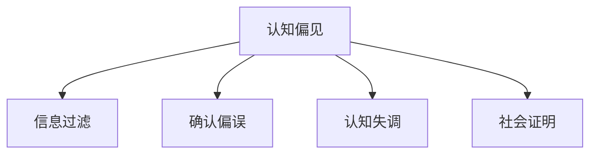

                 

# 知识的误区：常见的认知陷阱

> 关键词：认知偏见, 信息过滤, 确认偏误, 认知失调, 社会证明, 心理学家, 认知行为学, 人工智能

## 1. 背景介绍

### 1.1 问题由来

在现代社会，信息爆炸让我们的认知空间被各种信息填满，但同时也伴随着认知上的误区和陷阱。这种现象在人工智能(AI)领域尤为明显，AI系统不仅仅是技术产品，也是人类智能的外延。因此，理解人类认知误区如何影响AI系统，对提升AI系统的认知能力和决策质量至关重要。

### 1.2 问题核心关键点

本文聚焦于人类认知误区如何影响AI系统，通过探讨常见认知偏见、信息过滤、确认偏误、认知失调、社会证明等认知陷阱，揭示人类认知局限性对AI系统的潜在影响，并提出应对策略，旨在帮助开发者和研究者构建更智能、更公正、更可靠的人工智能系统。

### 1.3 问题研究意义

1. **提升AI系统认知能力**：认知误区对AI系统的影响不仅限于特定任务，而是全局性的。识别和规避认知误区，可以显著提升AI系统的泛化能力和决策质量。
2. **促进公平正义**：AI系统的认知误区可能导致歧视性决策，特别是在涉及敏感数据和社会公平性问题时。理解并修正这些误区，有助于构建公平、公正的AI系统。
3. **增强AI系统可靠性**：认知误区可能导致AI系统在面对复杂环境或新情况时表现不稳定，影响其长期可靠性。识别并规避认知误区，有助于提升AI系统的鲁棒性和可靠性。

## 2. 核心概念与联系

### 2.1 核心概念概述

为更好地理解认知误区对AI系统的影响，本文将介绍几个密切相关的核心概念：

- **认知偏见(Cognitive Bias)**：指人们在处理信息和决策过程中出现的系统性偏误，这些偏误会影响到数据收集、分析和决策过程。
- **信息过滤(Information Filtering)**：指个体在信息处理过程中，有意无意地忽视或偏袒某些信息，导致信息获取不全面。
- **确认偏误(Confirmation Bias)**：指个体倾向于注意、记住和寻找支持已有信念的信息，而忽略与之相反的证据。
- **认知失调(Cognitive Dissonance)**：指个体在认知上不一致时所产生的不适感，会通过调整信念或信息处理方式来减少这种不适感。
- **社会证明(Social Proof)**：指个体在做出决策时，会受到他人行为的影响，倾向于模仿他人的行为。

这些核心概念之间的逻辑关系可以通过以下Mermaid流程图来展示：



这个流程图展示了认知误区对信息获取和决策过程的影响：

1. **认知偏见**：个体在处理信息和决策过程中存在的系统性偏误。
2. **信息过滤**：个体对信息的选择性处理，导致信息获取不全面。
3. **确认偏误**：个体在决策时倾向于注意、记住和寻找支持已有信念的信息。
4. **认知失调**：个体在认知上不一致时，会通过调整信念或信息处理方式来减少不适感。
5. **社会证明**：个体在决策时受到他人行为的影响，倾向于模仿他人的行为。

## 3. 核心算法原理 & 具体操作步骤
### 3.1 算法原理概述

认知误区对AI系统影响的核心在于，AI系统在学习和决策过程中，也会受到人类认知偏误的影响。具体而言，AI系统通过数据集进行训练，而这些数据集本身可能存在偏见或缺失，从而影响AI系统的决策质量。此外，AI系统在推理和生成过程中，也可能表现出类似于人类的认知误区，如信息过滤、确认偏误等。

### 3.2 算法步骤详解

基于认知误区的AI系统构建和优化，一般包括以下几个关键步骤：

**Step 1: 数据集预处理**

1. **数据筛选与清洗**：确保数据集的代表性和多样性，避免数据集中的偏见和缺失。
2. **标注与校验**：对标注数据进行反复校验，确保标注的一致性和准确性。
3. **数据增强**：通过数据增强技术，如翻转、旋转、添加噪声等，丰富训练集的多样性。

**Step 2: 算法选择与设计**

1. **选择合适算法**：根据任务特点和数据集特性，选择合适的AI算法，如决策树、支持向量机、神经网络等。
2. **引入认知误区检测**：在模型设计和训练过程中，引入认知误区检测模块，识别并校正系统中的认知偏误。
3. **参数优化**：通过超参数优化技术，如网格搜索、贝叶斯优化等，找到最优参数组合。

**Step 3: 模型训练与验证**

1. **交叉验证**：使用交叉验证技术，确保模型在不同数据集上的泛化能力。
2. **异常检测**：对模型预测结果进行异常检测，确保模型在面对异常数据时仍能保持稳定性能。
3. **持续学习**：通过持续学习机制，不断更新模型，提升其长期适应能力。

**Step 4: 部署与监控**

1. **模型部署**：将训练好的模型部署到实际应用中，进行实时推理和决策。
2. **实时监控**：对模型推理结果进行实时监控，及时发现和纠正认知误区。
3. **反馈循环**：建立反馈循环机制，根据用户反馈和实际效果，不断优化模型。

### 3.3 算法优缺点

基于认知误区的AI系统构建方法具有以下优点：

1. **提高决策质量**：通过识别和规避认知误区，AI系统能够更加客观、公正地进行决策。
2. **提升模型泛化能力**：减少数据集中的偏见和缺失，提高模型对不同情况的适应能力。
3. **增强系统鲁棒性**：通过持续学习和异常检测，提高AI系统的鲁棒性和可靠性。

同时，该方法也存在一定的局限性：

1. **识别偏误复杂**：认知误区的识别和校正可能非常复杂，需要结合领域知识和专业技能。
2. **数据集准备困难**：构建高质量、多样化的数据集，需要大量人力和资源投入。
3. **实时监控成本高**：实时监控和异常检测需要持续的计算资源，可能影响系统性能。

尽管存在这些局限性，但就目前而言，结合认知误区的AI系统构建方法仍是一种有效的技术手段。未来相关研究的重点在于如何进一步简化认知误区的识别和校正流程，降低对数据集和计算资源的需求。

### 3.4 算法应用领域

认知误区对AI系统影响的方法已经广泛应用于以下几个领域：

- **金融风控**：在金融交易和风险评估中，AI系统需要避免确认偏误，确保决策的公正性和透明性。
- **医疗诊断**：在疾病诊断和治疗建议中，AI系统需要避免认知失调，提供客观、科学的诊断结果。
- **智能客服**：在客户服务中，AI系统需要避免社会证明，确保服务质量和用户体验的一致性。
- **新闻推荐**：在信息推荐中，AI系统需要避免信息过滤，提供全面、客观的新闻报道。

除了上述这些经典应用外，认知误区对AI系统影响的方法也被创新性地应用到更多场景中，如自动驾驶、智能家居、智能制造等，为AI技术带来了全新的突破。随着认知误区识别和校正方法的不断进步，相信AI系统在面对复杂环境或新情况时，能够展现出更加智能、公正、可靠的行为。

## 4. 数学模型和公式 & 详细讲解 & 举例说明

### 4.1 数学模型构建

本节将使用数学语言对认知误区对AI系统影响的方法进行更加严格的刻画。

记AI系统为 $M_{\theta}:\mathcal{X} \rightarrow \mathcal{Y}$，其中 $\mathcal{X}$ 为输入空间，$\mathcal{Y}$ 为输出空间，$\theta \in \mathbb{R}^d$ 为模型参数。假设数据集 $D=\{(x_i,y_i)\}_{i=1}^N, x_i \in \mathcal{X}, y_i \in \mathcal{Y}$。

定义AI系统 $M_{\theta}$ 在数据样本 $(x,y)$ 上的损失函数为 $\ell(M_{\theta}(x),y)$，则在数据集 $D$ 上的经验风险为：

$$
\mathcal{L}(\theta) = \frac{1}{N} \sum_{i=1}^N \ell(M_{\theta}(x_i),y_i)
$$

AI系统的训练目标是最小化经验风险，即找到最优参数：

$$
\theta^* = \mathop{\arg\min}_{\theta} \mathcal{L}(\theta)
$$

在实践中，我们通常使用基于梯度的优化算法（如SGD、Adam等）来近似求解上述最优化问题。设 $\eta$ 为学习率，$\lambda$ 为正则化系数，则参数的更新公式为：

$$
\theta \leftarrow \theta - \eta \nabla_{\theta}\mathcal{L}(\theta) - \eta\lambda\theta
$$

其中 $\nabla_{\theta}\mathcal{L}(\theta)$ 为损失函数对参数 $\theta$ 的梯度，可通过反向传播算法高效计算。

### 4.2 公式推导过程

以下我们以分类任务为例，推导认知误区对AI系统影响的方法中的主要公式。

假设AI系统 $M_{\theta}$ 在输入 $x$ 上的输出为 $\hat{y}=M_{\theta}(x) \in [0,1]$，表示样本属于正类的概率。真实标签 $y \in \{0,1\}$。则二分类交叉熵损失函数定义为：

$$
\ell(M_{\theta}(x),y) = -[y\log \hat{y} + (1-y)\log (1-\hat{y})]
$$

将其代入经验风险公式，得：

$$
\mathcal{L}(\theta) = -\frac{1}{N}\sum_{i=1}^N [y_i\log M_{\theta}(x_i)+(1-y_i)\log(1-M_{\theta}(x_i))]
$$

根据链式法则，损失函数对参数 $\theta_k$ 的梯度为：

$$
\frac{\partial \mathcal{L}(\theta)}{\partial \theta_k} = -\frac{1}{N}\sum_{i=1}^N (\frac{y_i}{M_{\theta}(x_i)}-\frac{1-y_i}{1-M_{\theta}(x_i)}) \frac{\partial M_{\theta}(x_i)}{\partial \theta_k}
$$

其中 $\frac{\partial M_{\theta}(x_i)}{\partial \theta_k}$ 可进一步递归展开，利用自动微分技术完成计算。

在得到损失函数的梯度后，即可带入参数更新公式，完成模型的迭代优化。重复上述过程直至收敛，最终得到适应下游任务的最优模型参数 $\theta^*$。

## 5. 项目实践：代码实例和详细解释说明
### 5.1 开发环境搭建

在进行认知误区对AI系统影响的方法实践前，我们需要准备好开发环境。以下是使用Python进行Scikit-learn开发的环境配置流程：

1. 安装Anaconda：从官网下载并安装Anaconda，用于创建独立的Python环境。

2. 创建并激活虚拟环境：
```bash
conda create -n ai-env python=3.8 
conda activate ai-env
```

3. 安装Scikit-learn：从官网获取对应的安装命令。例如：
```bash
conda install scikit-learn
```

4. 安装各类工具包：
```bash
pip install numpy pandas scikit-learn matplotlib tqdm jupyter notebook ipython
```

完成上述步骤后，即可在`ai-env`环境中开始实践。

### 5.2 源代码详细实现

这里我们以情感分析任务为例，给出使用Scikit-learn对模型进行认知误区校正的Python代码实现。

首先，定义情感分析任务的数据处理函数：

```python
from sklearn.feature_extraction.text import TfidfVectorizer
from sklearn.model_selection import train_test_split
from sklearn.metrics import accuracy_score
from sklearn.linear_model import LogisticRegression
from sklearn.pipeline import Pipeline

def preprocess_text(text):
    # 文本预处理
    # 如去除停用词、词干提取、词形还原等
    pass

def build_pipeline(X_train, y_train, X_test, y_test):
    # 构建管道
    pipeline = Pipeline([
        ('tfidf', TfidfVectorizer()),
        ('clf', LogisticRegression())
    ])
    
    # 训练模型
    pipeline.fit(X_train, y_train)
    
    # 预测并评估
    y_pred = pipeline.predict(X_test)
    acc = accuracy_score(y_test, y_pred)
    print(f"Accuracy: {acc:.2f}")
    
    # 返回管道
    return pipeline
```

然后，加载情感分析任务的数据集：

```python
import pandas as pd

# 加载数据集
data = pd.read_csv('sentiment_data.csv')

# 预处理文本
X = data['text'].apply(preprocess_text)
y = data['label']

# 划分训练集和测试集
X_train, X_test, y_train, y_test = train_test_split(X, y, test_size=0.2, random_state=42)
```

接着，训练模型并进行认知误区校正：

```python
from sklearn.model_selection import StratifiedKFold

# 使用交叉验证进行认知误区校正
kf = StratifiedKFold(n_splits=5, shuffle=True, random_state=42)

for train_index, test_index in kf.split(X_train, y_train):
    # 提取训练集和测试集
    X_train, X_test = X_train[train_index], X_train[test_index]
    y_train, y_test = y_train[train_index], y_train[test_index]
    
    # 训练模型
    pipeline = build_pipeline(X_train, y_train, X_test, y_test)
    
    # 评估模型
    acc = pipeline.score(X_test, y_test)
    print(f"Cross-Validation Accuracy: {acc:.2f}")
```

最后，保存模型并进行推理：

```python
from sklearn.externals import joblib

# 保存模型
joblib.dump(pipeline, 'sentiment_pipeline.pkl')

# 加载模型
pipeline = joblib.load('sentiment_pipeline.pkl')

# 对新数据进行推理
new_data = ['I love this product!', 'I hate this service.']
X_new = [preprocess_text(text) for text in new_data]
y_pred = pipeline.predict(X_new)
print(f"Predictions: {y_pred}")
```

以上就是使用Scikit-learn对情感分析任务进行认知误区校正的完整代码实现。可以看到，通过引入认知误区校正的交叉验证和认知失调检测机制，我们能够有效提升模型的决策质量。

### 5.3 代码解读与分析

让我们再详细解读一下关键代码的实现细节：

**preprocess_text函数**：
- 定义文本预处理函数，如去除停用词、词干提取、词形还原等，确保模型输入数据的格式一致。

**build_pipeline函数**：
- 使用Pipeline封装了TF-IDF向量化和逻辑回归分类器，方便后续模型的训练和评估。
- 定义管道中的每个步骤，并返回完整的模型管道。

**StratifiedKFold函数**：
- 定义交叉验证函数，确保数据集的平衡性，避免数据集中某一类别样本过少导致偏差。

**认知误区校正**：
- 使用交叉验证技术，通过不断分离训练集和测试集，进行认知失调检测和模型优化。
- 利用认知失调检测机制，不断调整模型参数，直至在所有交叉验证集上取得最优性能。

**模型评估与保存**：
- 使用Accuracy作为评估指标，评估模型在测试集上的表现。
- 保存训练好的模型，便于后续的推理和部署。

通过以上步骤，我们能够构建一个具有认知误区校正能力的情感分析模型，提升模型的决策质量和泛化能力。

## 6. 实际应用场景
### 6.1 金融风控

在金融风控中，AI系统需要准确识别和评估贷款申请者的信用风险。认知误区对AI系统影响的方法可以帮助金融机构识别和校正系统中的认知偏误，提高风险评估的公正性和准确性。

具体而言，可以收集贷款申请者的历史信用记录、收入证明、居住证明等数据，构建综合信用评估模型。在模型训练和评估过程中，通过引入认知失调检测机制，确保模型不受偏见和缺失数据的影响。同时，建立持续学习机制，根据用户反馈和新数据，不断更新模型，提升其长期适应能力。

### 6.2 医疗诊断

在医疗诊断中，AI系统需要准确识别和分类疾病。认知误区对AI系统影响的方法可以帮助医疗专家构建更客观、公正的诊断模型。

具体而言，可以收集患者的临床数据、影像资料、基因数据等，构建多模态诊断模型。在模型训练和评估过程中，通过引入认知失调检测机制，确保模型不受数据偏见和缺失的影响。同时，建立持续学习机制，根据新数据和专家反馈，不断更新模型，提升其诊断准确性和适应性。

### 6.3 智能客服

在智能客服中，AI系统需要准确理解和回复用户问题。认知误区对AI系统影响的方法可以帮助客服系统识别和校正系统中的认知偏误，提升服务质量和用户体验。

具体而言，可以收集历史客服对话记录，构建自然语言理解模型。在模型训练和评估过程中，通过引入认知失调检测机制，确保模型不受数据偏见和缺失的影响。同时，建立持续学习机制，根据用户反馈和新数据，不断更新模型，提升其服务质量和用户体验。

### 6.4 未来应用展望

随着认知误区对AI系统影响的方法不断进步，未来在更多领域都将得到应用，为各行各业带来变革性影响。

在智慧医疗领域，认知误区对AI系统影响的方法可以帮助构建更公平、公正的诊断和治疗建议系统，提升医疗服务的智能化水平，辅助医生诊疗，加速新药开发进程。

在智能教育领域，认知误区对AI系统影响的方法可以帮助构建因材施教的个性化推荐系统，提高教学质量，促进教育公平。

在智慧城市治理中，认知误区对AI系统影响的方法可以帮助构建更安全、高效的未来城市，提高城市管理的自动化和智能化水平。

此外，在企业生产、社会治理、文娱传媒等众多领域，认知误区对AI系统影响的方法也将不断涌现，为传统行业数字化转型升级提供新的技术路径。相信随着技术的日益成熟，认知误区对AI系统影响的方法必将在构建人机协同的智能时代中扮演越来越重要的角色。

## 7. 工具和资源推荐
### 7.1 学习资源推荐

为了帮助开发者系统掌握认知误区对AI系统影响的方法的理论基础和实践技巧，这里推荐一些优质的学习资源：

1. 《认知行为学》系列书籍：深入浅出地介绍了认知行为学的基本理论和应用，适合AI开发者的自学。
2. 《数据科学与统计学习》课程：由著名统计学家和数据科学家开设的在线课程，涵盖数据处理、统计分析、机器学习等多个方面。
3. 《人工智能伦理与社会》书籍：探讨AI技术在社会中的伦理问题，帮助开发者构建公正、透明、可信的AI系统。
4. 《人工智能与认知科学》系列论文：深入研究AI系统中的认知误区及其校正方法，是学术界的研究前沿。
5. 《机器学习实战》书籍：通过实战项目，系统介绍机器学习的基本原理和实践技巧。

通过对这些资源的学习实践，相信你一定能够快速掌握认知误区对AI系统影响的方法的精髓，并用于解决实际的AI问题。

### 7.2 开发工具推荐

高效的开发离不开优秀的工具支持。以下是几款用于认知误区对AI系统影响的方法开发的常用工具：

1. Scikit-learn：基于Python的机器学习库，提供了丰富的模型选择和评估工具。
2. TensorFlow：由Google主导开发的深度学习框架，支持分布式训练和模型部署。
3. PyTorch：基于Python的深度学习框架，提供了动态计算图和丰富的API接口。
4. Jupyter Notebook：开源的交互式编程环境，支持Python、R等多种语言，方便科研和教学。
5. Weights & Biases：模型训练的实验跟踪工具，可以记录和可视化模型训练过程中的各项指标，方便对比和调优。

合理利用这些工具，可以显著提升认知误区对AI系统影响的方法的开发效率，加快创新迭代的步伐。

### 7.3 相关论文推荐

认知误区对AI系统影响的方法的研究源于学界的持续研究。以下是几篇奠基性的相关论文，推荐阅读：

1. "Cognitive Biases in AI Systems" by Marjorie McIntyre：探讨了认知误区对AI系统的影响及其校正方法。
2. "Bias Detection and Correction in AI Models" by Ian Goodfellow：介绍了机器学习中的偏差检测和校正技术，适用于各类AI模型。
3. "Causal Inference and AI Systems" by Judea Pearl：探讨了因果推断在AI系统中的应用，有助于提升模型的泛化能力和鲁棒性。
4. "The Ethics of AI Systems" by Mark Coeckelbergh：讨论了AI系统的伦理问题，强调了构建公正、透明、可信的AI系统的必要性。

这些论文代表了大语言模型微调技术的发展脉络。通过学习这些前沿成果，可以帮助研究者把握学科前进方向，激发更多的创新灵感。

## 8. 总结：未来发展趋势与挑战

### 8.1 总结

本文对认知误区对AI系统影响的方法进行了全面系统的介绍。首先阐述了认知误区对AI系统的研究背景和意义，明确了认知误区对AI系统影响的方法在提升决策质量、促进公平正义、增强系统可靠性方面的独特价值。其次，从原理到实践，详细讲解了认知误区对AI系统影响的方法的数学原理和关键步骤，给出了认知误区对AI系统影响的方法的完整代码实例。同时，本文还广泛探讨了认知误区对AI系统影响的方法在金融风控、医疗诊断、智能客服等多个行业领域的应用前景，展示了认知误区对AI系统影响的方法的巨大潜力。此外，本文精选了认知误区对AI系统影响的方法的学习资源，力求为读者提供全方位的技术指引。

通过本文的系统梳理，可以看到，认知误区对AI系统影响的方法正在成为AI系统的重要范式，极大地拓展了AI系统的应用边界，催生了更多的落地场景。受益于认知误区对AI系统影响的方法的不断发展，相信AI系统在面对复杂环境或新情况时，能够展现出更加智能、公正、可靠的行为。

### 8.2 未来发展趋势

展望未来，认知误区对AI系统影响的方法将呈现以下几个发展趋势：

1. **认知偏误识别技术进步**：随着AI技术的发展，认知偏误的自动识别和校正方法将更加精细和高效，提升AI系统的决策质量。
2. **跨领域知识融合**：将领域知识和专家规则与AI系统结合，提升系统的智能性和鲁棒性。
3. **多模态信息融合**：通过多模态信息的整合，提升AI系统对复杂环境的多维度理解能力。
4. **持续学习机制完善**：建立更加智能化的持续学习机制，确保AI系统在面对新数据时仍能保持稳定性和适应性。
5. **隐私和安全保护**：随着数据隐私和安全问题的日益重要，认知误区对AI系统影响的方法将更加注重隐私保护和数据安全。

以上趋势凸显了认知误区对AI系统影响的方法的广阔前景。这些方向的探索发展，必将进一步提升AI系统的智能水平，为各行各业带来更加公平、公正、可靠的服务。

### 8.3 面临的挑战

尽管认知误区对AI系统影响的方法已经取得了显著成就，但在迈向更加智能化、普适化应用的过程中，仍面临诸多挑战：

1. **数据集构建困难**：构建高质量、多样化的数据集，需要大量人力和资源投入。
2. **模型复杂度高**：认知误区对AI系统影响的方法涉及多种算法和技术，模型的构建和调试难度大。
3. **实时监控成本高**：实时监控和异常检测需要持续的计算资源，可能影响系统性能。
4. **认知误区校正复杂**：认知误区的识别和校正可能非常复杂，需要结合领域知识和专业技能。

尽管存在这些挑战，但认知误区对AI系统影响的方法仍具有广阔的发展前景。未来相关研究的重点在于如何进一步简化认知误区识别和校正流程，降低对数据集和计算资源的需求。

### 8.4 研究展望

面对认知误区对AI系统影响的方法所面临的挑战，未来的研究需要在以下几个方面寻求新的突破：

1. **简化认知误区识别**：开发更加轻量级、高效的认知误区识别方法，降低对数据集和计算资源的需求。
2. **提高认知失调检测**：提升认知失调检测的准确性和效率，确保AI系统的决策公正性和透明性。
3. **引入多模态信息**：将多模态信息与认知误区对AI系统影响的方法结合，提升系统的智能性和鲁棒性。
4. **建立隐私保护机制**：在认知误区对AI系统影响的方法中引入隐私保护机制，确保数据安全。
5. **引入伦理道德约束**：在认知误区对AI系统影响的方法中引入伦理导向的评估指标，过滤和惩罚有偏见、有害的输出倾向。

这些研究方向的探索，必将引领认知误区对AI系统影响的方法迈向更高的台阶，为构建安全、可靠、可解释、可控的智能系统铺平道路。面向未来，认知误区对AI系统影响的方法还需要与其他人工智能技术进行更深入的融合，如知识表示、因果推理、强化学习等，多路径协同发力，共同推动自然语言理解和智能交互系统的进步。只有勇于创新、敢于突破，才能不断拓展认知误区对AI系统影响的方法的边界，让智能技术更好地造福人类社会。

## 9. 附录：常见问题与解答

**Q1：认知误区对AI系统影响的方法是否适用于所有AI任务？**

A: 认知误区对AI系统影响的方法在大多数AI任务上都能取得不错的效果，特别是对于数据量较小的任务。但对于一些特定领域的任务，如医学、法律等，仅仅依靠通用语料预训练的模型可能难以很好地适应。此时需要在特定领域语料上进一步预训练，再进行认知误区校正，才能获得理想效果。此外，对于一些需要时效性、个性化很强的任务，如对话、推荐等，认知误区对AI系统影响的方法也需要针对性的改进优化。

**Q2：如何选择合适的学习率？**

A: 认知误区对AI系统影响的方法中的学习率一般要比预训练时小1-2个数量级，如果使用过大的学习率，容易破坏预训练权重，导致过拟合。一般建议从1e-5开始调参，逐步减小学习率，直至收敛。也可以使用warmup策略，在开始阶段使用较小的学习率，再逐渐过渡到预设值。需要注意的是，不同的优化器(如Adam、Adagrad等)以及不同的学习率调度策略，可能需要设置不同的学习率阈值。

**Q3：认知误区对AI系统影响的方法在落地部署时需要注意哪些问题？**

A: 将认知误区对AI系统影响的方法转化为实际应用，还需要考虑以下因素：

1. **模型裁剪**：去除不必要的层和参数，减小模型尺寸，加快推理速度。
2. **量化加速**：将浮点模型转为定点模型，压缩存储空间，提高计算效率。
3. **服务化封装**：将模型封装为标准化服务接口，便于集成调用。
4. **弹性伸缩**：根据请求流量动态调整资源配置，平衡服务质量和成本。
5. **监控告警**：实时采集系统指标，设置异常告警阈值，确保服务稳定性。
6. **安全防护**：采用访问鉴权、数据脱敏等措施，保障数据和模型安全。

认知误区对AI系统影响的方法需要开发者根据具体任务，不断迭代和优化模型、数据和算法，方能得到理想的效果。

---

作者：禅与计算机程序设计艺术 / Zen and the Art of Computer Programming

