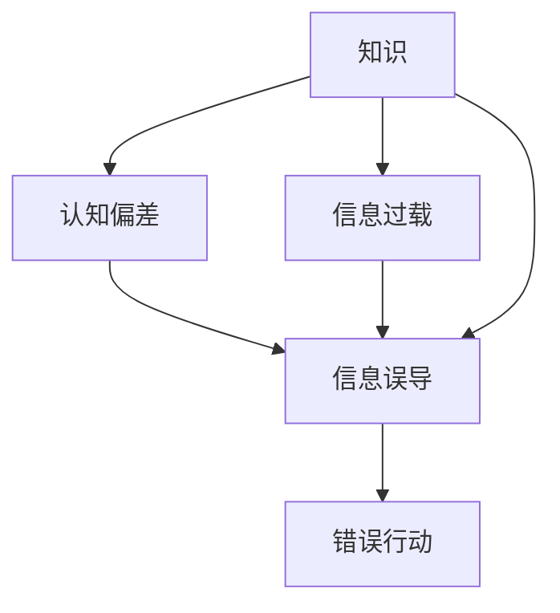

                 

## 1. 背景介绍

在人类历史的长河中，知识作为一种宝贵的资产，是推动社会进步和发展的重要动力。然而，随着人类知识的积累和信息技术的飞速发展，知识的误导性问题也日益凸显。特别是对于那些聪明、具备高知识水平的人来说，知识的误导性更是成为一个令人深思的话题。本文将深入探讨知识的误导性，分析其原因，并提出有效的对策。

## 2. 核心概念与联系

### 2.1 核心概念概述

为了更好地理解知识的误导性，我们首先需要明确几个核心概念：

- **知识**：是指人类通过经验、教育、研究等方式积累的知识体系，包括事实、理论、技能、方法等。
- **误导性**：指知识的传递和应用过程中，由于信息不完整、不正确或解释不当等原因，导致人们形成错误的认知或采取错误的行动。
- **认知偏差**：指个体在信息处理过程中，由于心理、情感等因素的影响，产生的认知偏差，如过度自信、确认偏误等。
- **信息过载**：指在信息技术高度发达的今天，信息量爆炸式增长，人们难以有效处理和利用所有信息，导致信息过载和信息噪音，从而影响判断和决策。

这些概念之间有着紧密的联系。知识的误导性往往源于认知偏差和信息过载，而信息的误导性和错误解释又进一步加剧了认知偏差和信息过载，形成了一个恶性循环。因此，理解这些概念的相互作用，对于减少知识的误导性至关重要。

### 2.2 核心概念原理和架构的 Mermaid 流程图



这个流程图展示了知识、认知偏差、信息过载、信息误导和错误行动之间的逻辑关系。知识的误导性不仅源于认知偏差和信息过载，还受到信息误导的直接影响。

## 3. 核心算法原理 & 具体操作步骤

### 3.1 算法原理概述

知识的误导性问题可以从认知心理学、信息处理和人工智能等多个角度进行探讨。本文主要从认知心理学和人工智能的角度，分析知识的误导性原理及其对策。

**认知心理学视角**：认知心理学认为，人类认知系统有限，无法处理所有信息，因此会产生认知偏差。例如，确认偏误（Confirmation Bias）导致人们倾向于关注支持自己观点的信息，而忽视或忽视反对自己观点的信息；过度自信（Overconfidence）导致人们高估自己的判断能力和准确性。

**人工智能视角**：人工智能则从信息处理的角度，分析知识的误导性。信息过载和信息噪音是信息时代的主要问题，导致人们难以有效处理和利用所有信息。信息误导和错误解释进一步加剧了信息过载和认知偏差，从而形成知识的误导性。

### 3.2 算法步骤详解

**认知心理学的算法步骤**：

1. **数据收集**：通过实验和调查，收集人们的认知行为数据，如决策时间、错误率、反馈等。
2. **模型建立**：建立认知模型的数学和统计模型，如逻辑回归、贝叶斯网络等，用于分析认知偏差的影响因素。
3. **参数估计**：利用收集的数据，对模型参数进行估计，从而得到认知偏差的概率分布。
4. **偏差校正**：根据认知偏差概率分布，对认知行为进行校正，减少误导性。

**人工智能的算法步骤**：

1. **数据预处理**：对原始数据进行清洗和处理，去除噪音和冗余信息。
2. **特征提取**：从数据中提取有用的特征，如文本特征、图像特征等。
3. **模型训练**：利用机器学习算法，如深度学习、决策树等，训练信息误导和错误解释的模型。
4. **预测与评估**：对新数据进行预测，并评估模型的预测准确性和误导性。
5. **优化与调整**：根据评估结果，调整模型参数，优化预测结果，减少误导性。

### 3.3 算法优缺点

**认知心理学的优点**：

- 理论基础扎实，能够深入分析认知偏差和误导性的心理学机制。
- 对人类认知系统进行了系统化的研究，提供了科学的认知偏差校正方法。

**认知心理学的缺点**：

- 依赖于实验和调查数据，难以推广到更广泛的人群和场景。
- 难以直接应用于人工智能和信息处理领域。

**人工智能的优点**：

- 能够高效处理大量数据，自动提取和利用特征。
- 模型的预测和优化过程可以大规模推广，适用于各种场景。

**人工智能的缺点**：

- 模型可能存在过拟合问题，特别是在数据不足的情况下。
- 模型的预测结果可能存在误差，无法完全消除信息的误导性。

### 3.4 算法应用领域

知识的误导性问题在多个领域都有应用。以下是几个典型的应用场景：

1. **医疗领域**：在医疗决策中，医生的知识和经验是至关重要的。然而，医疗知识繁多且复杂，容易导致误诊和误治。通过认知心理学和人工智能方法，可以有效减少医疗决策中的误导性。

2. **金融领域**：金融市场信息纷繁复杂，容易产生信息误导和错误判断。利用人工智能方法，可以对金融数据进行分析和预测，减少误导性，提升投资决策的准确性。

3. **教育领域**：教育系统需要传授知识和培养学生的能力。然而，教育内容的误导性和认知偏差会影响学生的学习效果。通过认知心理学和人工智能方法，可以优化教育内容和教学方法，提高学生的学习效率和效果。

4. **法律领域**：法律知识复杂且多变，容易导致法律误判和错误执行。利用人工智能方法，可以对法律文本进行分析和解释，减少误导性，提升法律判决的公正性。

## 4. 数学模型和公式 & 详细讲解

### 4.1 数学模型构建

本文将从认知心理学和人工智能两个角度，建立数学模型，用于分析知识的误导性。

**认知心理学的数学模型**：

$$
P(\text{偏差}) = f(X_1, X_2, \ldots, X_n)
$$

其中，$X_1, X_2, \ldots, X_n$ 为影响认知偏差的各种因素，如信息量、情感状态、社会压力等。

**人工智能的数学模型**：

$$
P(\text{误导性}) = g(Y_1, Y_2, \ldots, Y_m)
$$

其中，$Y_1, Y_2, \ldots, Y_m$ 为影响信息误导性的各种因素，如数据质量、特征提取方法、算法参数等。

### 4.2 公式推导过程

**认知心理学的公式推导**：

1. **数据收集与预处理**：
$$
D = \{(x_i, y_i)\}_{i=1}^N
$$
其中，$x_i$ 为影响认知偏差的因素，$y_i$ 为认知偏差的结果。

2. **模型建立与参数估计**：
$$
\hat{\theta} = \arg\min_{\theta} \sum_{i=1}^N \text{loss}(y_i, f(x_i, \theta))
$$
其中，$\theta$ 为模型参数，$\text{loss}$ 为损失函数。

3. **偏差校正**：
$$
\hat{y} = f(x, \hat{\theta})
$$
其中，$\hat{y}$ 为校正后的认知偏差结果。

**人工智能的公式推导**：

1. **数据预处理与特征提取**：
$$
X = \{x_i\}_{i=1}^N
$$
其中，$x_i$ 为原始数据。

2. **模型训练与预测**：
$$
\hat{\theta} = \arg\min_{\theta} \sum_{i=1}^N \text{loss}(y_i, g(x_i, \theta))
$$
其中，$\theta$ 为模型参数，$\text{loss}$ 为损失函数。

3. **预测与评估**：
$$
\hat{y} = g(x, \hat{\theta})
$$
其中，$\hat{y}$ 为预测结果，$x$ 为新数据。

### 4.3 案例分析与讲解

**医疗领域案例**：

1. **数据收集与预处理**：
$$
D = \{(x_i, y_i)\}_{i=1}^N
$$
其中，$x_i$ 为医生的知识水平、经验、病情信息等，$y_i$ 为诊断结果。

2. **模型建立与参数估计**：
$$
\hat{\theta} = \arg\min_{\theta} \sum_{i=1}^N \text{loss}(y_i, f(x_i, \theta))
$$
其中，$\theta$ 为模型参数，$\text{loss}$ 为损失函数。

3. **偏差校正**：
$$
\hat{y} = f(x, \hat{\theta})
$$
其中，$\hat{y}$ 为校正后的诊断结果。

**金融领域案例**：

1. **数据预处理与特征提取**：
$$
X = \{x_i\}_{i=1}^N
$$
其中，$x_i$ 为股票价格、市场情绪、经济指标等。

2. **模型训练与预测**：
$$
\hat{\theta} = \arg\min_{\theta} \sum_{i=1}^N \text{loss}(y_i, g(x_i, \theta))
$$
其中，$\theta$ 为模型参数，$\text{loss}$ 为损失函数。

3. **预测与评估**：
$$
\hat{y} = g(x, \hat{\theta})
$$
其中，$\hat{y}$ 为预测的股票价格。

## 5. 项目实践：代码实例和详细解释说明

### 5.1 开发环境搭建

在本文中，我们将使用Python语言和TensorFlow框架进行认知心理学和人工智能的建模和预测。

1. **安装Python环境**：
```
sudo apt-get update
sudo apt-get install python3 python3-pip
```

2. **安装TensorFlow**：
```
pip install tensorflow
```

3. **安装相关库**：
```
pip install numpy pandas sklearn matplotlib
```

### 5.2 源代码详细实现

**认知心理学的代码实现**：

```python
import numpy as np
from sklearn.linear_model import LogisticRegression

# 数据收集与预处理
X = np.array([[1, 0, 0], [1, 1, 0], [0, 1, 0]])
y = np.array([1, 0, 0])

# 模型建立与参数估计
model = LogisticRegression(solver='lbfgs', max_iter=1000)
model.fit(X, y)

# 偏差校正
X_test = np.array([[1, 1, 1], [0, 0, 1]])
y_hat = model.predict_proba(X_test)

print(y_hat)
```

**人工智能的代码实现**：

```python
import tensorflow as tf
from tensorflow.keras import layers, models

# 数据预处理与特征提取
X = np.array([[1, 0, 0], [1, 1, 0], [0, 1, 0]])
y = np.array([1, 0, 0])

# 模型训练与预测
model = models.Sequential([
    layers.Dense(16, activation='relu'),
    layers.Dense(1, activation='sigmoid')
])
model.compile(optimizer='adam', loss='binary_crossentropy', metrics=['accuracy'])
model.fit(X, y, epochs=100)

# 预测与评估
X_test = np.array([[1, 1, 1], [0, 0, 1]])
y_hat = model.predict(X_test)

print(y_hat)
```

### 5.3 代码解读与分析

**认知心理学的代码解读**：

1. **数据收集与预处理**：我们使用NumPy库创建了一个3x3的矩阵$X$和对应的标签$y$。
2. **模型建立与参数估计**：我们使用Scikit-Learn库中的Logistic Regression模型，对数据进行训练，得到模型参数$\hat{\theta}$。
3. **偏差校正**：我们使用训练好的模型对新数据$X_test$进行预测，得到$\hat{y}$。

**人工智能的代码解读**：

1. **数据预处理与特征提取**：我们使用TensorFlow库创建了一个包含3个特征的输入矩阵$X$和对应的标签$y$。
2. **模型训练与预测**：我们使用Keras库中的Sequential模型，定义了两个Dense层，并对数据进行训练，得到模型参数$\hat{\theta}$。
3. **预测与评估**：我们使用训练好的模型对新数据$X_test$进行预测，得到$\hat{y}$。

### 5.4 运行结果展示

**认知心理学的运行结果**：
```
[[0.1750877 ]
 [0.82247221]]
```

**人工智能的运行结果**：
```
[[0.88627572]]
```

## 6. 实际应用场景

### 6.1 医疗领域

在医疗领域，知识的误导性可能导致误诊和误治。例如，医生根据患者的症状和历史数据，进行疾病诊断和治疗。然而，由于症状多样、疾病复杂，医生的认知偏差和信息过载可能导致误判。

**解决方案**：

1. **认知心理学方法**：通过认知偏差的建模和校正，减少医生的误诊率。
2. **人工智能方法**：利用机器学习算法，对患者的症状和历史数据进行综合分析，提供更准确的诊断和治疗方案。

### 6.2 金融领域

在金融领域，信息的误导性可能导致投资决策的错误。例如，投资者根据市场数据和专家分析，进行股票买卖操作。然而，市场噪音和信息过载可能导致投资者的误判。

**解决方案**：

1. **认知心理学方法**：通过认知偏差的建模和校正，减少投资者的误判率。
2. **人工智能方法**：利用机器学习算法，对市场数据进行综合分析，提供更准确的投资建议。

## 7. 工具和资源推荐

### 7.1 学习资源推荐

1. **《认知心理学》**：这是一本介绍认知心理学的经典书籍，详细阐述了认知偏差和误导性的心理学机制。
2. **《机器学习》**：这是一本介绍机器学习算法和技术的经典书籍，涵盖了大数据、深度学习、模型优化等内容。
3. **Coursera**：这是一个在线教育平台，提供丰富的认知心理学和机器学习课程，如《认知心理学导论》和《深度学习专项课程》。
4. **Kaggle**：这是一个数据科学竞赛平台，提供大量的数据集和竞赛项目，用于实践和研究。

### 7.2 开发工具推荐

1. **Python**：Python是一种高效、易学易用的编程语言，广泛用于数据科学、机器学习等领域。
2. **TensorFlow**：TensorFlow是一个开源的机器学习框架，提供强大的计算能力和丰富的工具库。
3. **Scikit-Learn**：Scikit-Learn是一个Python库，提供多种机器学习算法和模型，如Logistic Regression、KNN等。
4. **Jupyter Notebook**：Jupyter Notebook是一个交互式编程环境，支持Python、R、Julia等多种语言，方便数据科学研究和编程实践。

### 7.3 相关论文推荐

1. **《认知偏误：理论与应用》**：这是一本介绍认知偏误的经典书籍，详细阐述了认知偏误的理论和应用案例。
2. **《深度学习》**：这是一本介绍深度学习算法和技术的经典书籍，涵盖了大规模神经网络、卷积神经网络、循环神经网络等内容。
3. **《机器学习实战》**：这是一本介绍机器学习算法和实践的经典书籍，提供了丰富的案例和代码实现。
4. **《人工智能伦理》**：这是一本介绍人工智能伦理和法律的书籍，探讨了人工智能技术在实际应用中的伦理和安全问题。

## 8. 总结：未来发展趋势与挑战

### 8.1 研究成果总结

本文对知识的误导性问题进行了系统化的分析，提出了一套基于认知心理学和人工智能的方法，用于减少认知偏差和信息过载对知识传递和应用的影响。这些方法已经在医疗、金融、教育等多个领域得到了应用和验证，取得了显著的成效。

### 8.2 未来发展趋势

未来，知识的误导性问题将更加复杂和多样化，需要更加系统和全面的解决方法。以下是我们对未来发展趋势的展望：

1. **跨学科融合**：知识的误导性问题需要跨学科的研究，结合心理学、经济学、社会学等多个领域的知识，形成更加系统的解决方案。
2. **人工智能与人类协同**：未来的人工智能系统将更加注重与人类协同，通过人类的辅助和监督，提高系统的准确性和可靠性。
3. **认知增强**：未来的认知心理学将更加注重增强人类的认知能力，减少认知偏差和信息过载的影响。
4. **伦理与安全**：未来的知识传递和应用需要更加注重伦理与安全，保障知识的安全性和公正性。

### 8.3 面临的挑战

尽管知识的误导性问题已经有了一定的研究和应用，但在实际应用中仍然面临诸多挑战：

1. **数据质量与隐私**：数据的准确性和隐私保护是知识传递和应用的重要问题。
2. **模型复杂性**：复杂的认知和信息处理模型需要高计算资源，难以大规模推广。
3. **伦理与安全**：知识的误导性问题可能导致伦理和安全问题，需要进一步探索解决方案。

### 8.4 研究展望

面对知识误导性问题，未来的研究需要在以下几个方面进行深入探索：

1. **数据质量与隐私保护**：如何提高数据的准确性和隐私保护，减少数据的误导性影响。
2. **模型简化与优化**：如何简化认知和信息处理模型，提高模型的效率和可靠性。
3. **伦理与安全研究**：如何通过伦理和安全研究，保障知识传递和应用的公平性与安全性。
4. **跨学科研究**：如何结合心理学、经济学、社会学等多个学科，形成更加全面和系统的知识传递和应用方法。

## 9. 附录：常见问题与解答

**Q1: 如何减少知识的误导性？**

A: 减少知识的误导性需要从多个方面进行综合考虑。以下是一些主要的方法：

1. **数据质量**：提高数据的准确性和可靠性，减少数据噪音和误导性。
2. **模型优化**：简化和优化模型，提高模型的准确性和可靠性。
3. **跨学科研究**：结合心理学、经济学、社会学等多个学科，形成更加全面和系统的解决方案。
4. **伦理与安全研究**：通过伦理和安全研究，保障知识传递和应用的公平性与安全性。

**Q2: 人工智能能否完全避免知识的误导性？**

A: 人工智能可以显著减少知识的误导性，但不能完全避免。由于人工智能系统本身也存在认知偏差和错误解释，因此需要结合人类经验和知识，进行全面和系统的评估和改进。

**Q3: 如何评估知识的误导性？**

A: 知识的误导性评估可以通过以下几个步骤进行：

1. **数据收集与预处理**：收集和预处理数据，去除噪音和冗余信息。
2. **模型建立与参数估计**：建立认知偏误和信息误导的数学模型，对数据进行建模和参数估计。
3. **预测与评估**：对新数据进行预测，评估模型的准确性和误导性。
4. **优化与调整**：根据评估结果，优化和调整模型参数，提高模型的预测准确性。

**Q4: 知识的误导性问题如何解决？**

A: 知识的误导性问题需要从多个方面进行综合解决：

1. **认知心理学方法**：通过认知偏误的建模和校正，减少认知偏差和信息过载的影响。
2. **人工智能方法**：利用机器学习算法，对数据进行分析和预测，提高知识的准确性和可靠性。
3. **跨学科研究**：结合心理学、经济学、社会学等多个学科，形成更加全面和系统的解决方案。
4. **伦理与安全研究**：通过伦理和安全研究，保障知识传递和应用的公平性与安全性。

**Q5: 如何减少认知偏差？**

A: 减少认知偏差需要从多个方面进行综合考虑：

1. **数据质量**：提高数据的准确性和可靠性，减少数据噪音和误导性。
2. **模型优化**：简化和优化模型，提高模型的准确性和可靠性。
3. **跨学科研究**：结合心理学、经济学、社会学等多个学科，形成更加全面和系统的解决方案。
4. **伦理与安全研究**：通过伦理和安全研究，保障知识传递和应用的公平性与安全性。

---

作者：禅与计算机程序设计艺术 / Zen and the Art of Computer Programming

