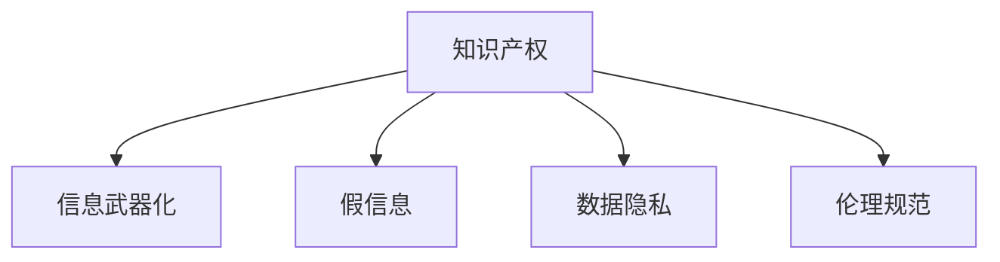

                 

# 知识的误用：防范信息武器化的策略

## 1. 背景介绍

### 1.1 问题由来
在信息技术飞速发展的今天，知识的正向利用带来了巨大的生产力提升和社会进步，但与此同时，知识的误用也日益凸显，成为亟待解决的重要问题。无论是商业竞争、学术抄袭，还是信息武器化，知识的误用不仅损害了知识产权和创新环境，还可能对社会稳定和国家安全造成严重威胁。

### 1.2 问题核心关键点
知识误用问题涉及多个方面，包括但不限于：
1. **知识产权侵犯**：盗用、抄袭他人知识成果，破坏知识产权保护体系。
2. **信息武器化**：利用知识进行恶意攻击和操控，破坏目标社会稳定和经济发展。
3. **假信息传播**：利用知识生成和传播虚假信息，误导公众舆论和社会行为。
4. **数据隐私泄露**：在知识收集和处理过程中，违反隐私政策，导致个人隐私泄露。
5. **伦理道德失衡**：利用知识进行不道德、非法的行为，如网络欺诈、网络诈骗等。

这些问题不仅对个人、企业和学术机构造成了直接损失，还可能引发更广泛的社会问题，甚至威胁国家安全。因此，防范知识的误用，构建一个安全、公正的知识生态系统，具有重要而紧迫的意义。

### 1.3 问题研究意义
防范知识误用，不仅涉及技术层面，还涉及伦理、法律、政策等多方面的内容。通过对知识误用问题的系统研究，可以：
1. **提升知识产权保护**：构建更加完善的知识产权法律体系和技术手段，减少知识产权侵犯。
2. **维护社会稳定和国家安全**：防止信息武器化，提高应对恶意攻击的能力。
3. **净化信息传播环境**：限制假信息的传播，构建健康的信息生态。
4. **保护用户隐私**：在知识收集和处理过程中，严格遵守隐私保护政策，防止数据泄露。
5. **强化伦理约束**：建立健全的伦理规范和道德标准，抑制知识的滥用行为。

## 2. 核心概念与联系

### 2.1 核心概念概述

为更好地理解防范知识误用策略，本节将介绍几个密切相关的核心概念：

- **知识产权**：指创作活动产生的智力成果的专有使用权，如文学、艺术、科学等领域的创作成果。
- **信息武器化**：指将知识用于恶意攻击或操控，如网络战、心理战、舆论操控等。
- **假信息**：指通过伪造、篡改等手段生成的虚假信息，用于误导公众、欺骗他人。
- **数据隐私**：指个人信息在收集、存储、处理和使用过程中，保护其不被滥用的权利。
- **伦理规范**：指在知识应用过程中，应当遵守的道德标准和行为规范。

这些概念之间的逻辑关系可以通过以下Mermaid流程图来展示：



这个流程图展示了几大核心概念之间的相互关系：

1. 知识产权是知识的正当归属和保护。
2. 信息武器化是对知识产权的滥用，可能引发恶意攻击。
3. 假信息通过侵害知识产权，破坏信息的真实性。
4. 数据隐私保护知识产权和个人隐私，防止不当使用。
5. 伦理规范在知识应用中提供道德约束，抑制不当行为。

## 3. 核心算法原理 & 具体操作步骤

### 3.1 算法原理概述

防范知识误用策略，涉及多个学科的交叉，包括法律、技术、伦理等。其核心思想是通过技术手段和政策法规，构建一个安全、公正的知识生态系统，防范知识的误用。

形式化地，防范知识误用策略可以表示为：

$$
\text{策略} = \mathop{\arg\min}_{\text{技术}} \mathcal{L}(\text{知识产权}, \text{信息武器化}, \text{假信息}, \text{数据隐私}, \text{伦理规范})
$$

其中，$\mathcal{L}$ 为综合损失函数，衡量各项策略措施在防范知识误用中的效果。通过最小化该损失函数，找到最优的防范策略。

### 3.2 算法步骤详解

防范知识误用的策略主要包括以下几个关键步骤：

**Step 1: 识别知识误用风险**
- 通过数据分析、社会调查等方式，识别知识误用的主要形式和来源。
- 评估知识误用的影响范围和严重程度，确定防范优先级。

**Step 2: 设计防范措施**
- 针对不同风险类型，设计相应的技术手段和政策法规。
- 采用多种防范措施组合，形成多重防线，提高防范效果。

**Step 3: 实施和监控**
- 将设计好的防范措施付诸实施，并在实际应用中持续监控其效果。
- 根据监控结果，动态调整防范策略，优化防范措施。

**Step 4: 应对和改进**
- 在防范措施被突破或效果不显著时，及时采取应对措施。
- 总结经验教训，改进防范策略，提升防范能力。

### 3.3 算法优缺点

防范知识误用的策略具有以下优点：
1. **综合性强**：考虑了知识产权、信息武器化、假信息、数据隐私、伦理规范等多方面的因素，形成全面的防范体系。
2. **灵活性高**：可以根据不同场景和风险，灵活调整防范措施。
3. **适应性强**：可以不断改进和优化，提升防范效果。

同时，该策略也存在一定的局限性：
1. **技术依赖**：防范措施需要依赖先进的技术手段，存在技术局限。
2. **法律复杂**：防范知识误用涉及复杂的法律和政策问题，执行难度大。
3. **成本高**：设计和实施防范策略，需要投入大量资源和时间。
4. **伦理争议**：在平衡知识应用与伦理道德之间，可能存在争议。

尽管存在这些局限性，但就目前而言，综合考虑技术、法律、伦理等多个方面的防范策略，仍是最主流和有效的防范手段。

### 3.4 算法应用领域

防范知识误用的策略，在多个领域都有广泛应用，包括但不限于：

- **商业领域**：防止商业间谍、专利侵权等知识产权侵犯行为。
- **政府领域**：防范信息武器化，维护国家安全和社会稳定。
- **学术领域**：防止学术不端、假信息传播，保护知识产权。
- **网络安全**：防范网络攻击、数据泄露等风险，保障信息安全。
- **公共安全**：防止假信息传播，维护公共秩序和社会安全。

## 4. 数学模型和公式 & 详细讲解 & 举例说明

### 4.1 数学模型构建

防范知识误用策略的数学模型，可以表示为：

$$
\min_{\text{技术}} \mathcal{L}(\text{知识产权}, \text{信息武器化}, \text{假信息}, \text{数据隐私}, \text{伦理规范})
$$

其中，$\text{技术}$ 包括多种技术手段，如区块链、加密技术、人工智能等。

### 4.2 公式推导过程

假设有一个基于区块链的知识产权保护系统，可以表示为：

$$
\min_{\text{技术}} \mathcal{L}(\text{知识产权}, \text{信息武器化}, \text{假信息}, \text{数据隐私}, \text{伦理规范}) = \min_{\text{区块链技术}} \mathcal{L}(\text{区块链技术}, \text{知识产权}, \text{信息武器化}, \text{假信息}, \text{数据隐私}, \text{伦理规范})
$$

推导过程如下：

1. 设计区块链技术，用于记录和验证知识产权的转移和使用情况。
2. 评估区块链技术在防范信息武器化、假信息、数据隐私和伦理规范方面的效果。
3. 最小化综合损失函数，找到最优的区块链技术方案。

### 4.3 案例分析与讲解

假设某公司开发了一种新的技术产品，涉及到复杂的知识产权保护。该公司可以采用基于区块链的知识产权保护系统，具体步骤如下：

1. 在区块链上记录产品开发和使用的详细信息，确保知识产权的可追溯性和不可篡改性。
2. 使用区块链技术记录和验证公司的授权使用情况，防止侵权和不当使用。
3. 在区块链上公开产品设计和使用方法，防止假信息传播，保护用户体验。
4. 确保区块链系统符合数据隐私保护政策，防止用户数据泄露。
5. 建立区块链系统的使用规范和伦理标准，防止不当使用，保障社会伦理。

通过上述措施，公司可以有效地防范知识产权侵犯、信息武器化、假信息传播、数据隐私泄露和伦理失衡等风险，构建一个安全、公正的知识生态系统。

## 5. 项目实践：代码实例和详细解释说明

### 5.1 开发环境搭建

在进行防范知识误用的策略实践前，我们需要准备好开发环境。以下是使用Python进行区块链开发的环境配置流程：

1. 安装Python：从官网下载并安装Python 3.x版本。
2. 安装区块链框架：如Hyperledger Fabric、Ethereum等，可以使用pip安装。
3. 安装区块链工具：如Go语言、JavaScript等，用于编写智能合约和应用程序。
4. 搭建区块链网络：使用多节点部署工具搭建区块链网络，如Hyperledger Composer。
5. 编写和部署智能合约：使用Solidity语言编写智能合约，并通过区块链网络部署。

完成上述步骤后，即可在区块链环境下进行防范知识误用的策略开发。

### 5.2 源代码详细实现

这里以Hyperledger Fabric为例，给出基于区块链的知识产权保护系统的源代码实现。

1. 创建区块链网络：
```python
# 创建Fabric网络
from hyperledger.fabric.python.client import Fabric
from hyperledger.fabric.protos.blockchain import Channel, Block

# 创建Fabric通道
channel = Channel('mychannel', client)

# 创建Fabric网络节点
node = Fabric('mychannel', client)
```

2. 创建和部署智能合约：
```python
# 创建智能合约
from hyperledger.fabric.python.shim import Chaincode

class IntellectualPropertyContract(Chaincode):
    def __init__(self, stub):
        super(IntellectualPropertyContract, self).__init__(stub)

    # 查询知识产权信息
    def queryIntellectualProperty(self, stub, args):
        # 从区块链上查询知识产权信息
        # ...

    # 记录知识产权转移
    def recordIntellectualPropertyTransfer(self, stub, args):
        # 记录知识产权转移
        # ...

    # 验证知识产权使用权限
    def verifyUsagePermission(self, stub, args):
        # 验证使用权限
        # ...
```

3. 部署智能合约：
```python
# 创建Fabric网络节点
node = Fabric('mychannel', client)

# 部署智能合约
node.deploy(Chaincode('IntellectualPropertyContract'), {
    'path': 'IntellectualPropertyContract'
})
```

4. 使用智能合约：
```python
# 查询知识产权信息
query_response = stub.query('queryIntellectualProperty', args)

# 记录知识产权转移
record_response = stub.execute('recordIntellectualPropertyTransfer', args)

# 验证使用权限
verify_response = stub.execute('verifyUsagePermission', args)
```

### 5.3 代码解读与分析

让我们再详细解读一下关键代码的实现细节：

**创建区块链网络**：
- `Fabric`类：用于创建和管理Fabric网络，包括通道、节点、智能合约等。
- `Channel`类：用于创建和管理区块链通道，是Fabric网络的组织单元。
- `Block`类：用于创建和管理区块链区块，是数据存储的基本单元。

**智能合约实现**：
- `IntellectualPropertyContract`类：定义了知识产权保护的智能合约，包括查询、记录和验证使用权限等功能。
- `queryIntellectualProperty`方法：用于查询区块链上的知识产权信息。
- `recordIntellectualPropertyTransfer`方法：用于记录知识产权的转移操作。
- `verifyUsagePermission`方法：用于验证使用权限，防止不当使用。

**智能合约部署和调用**：
- `node.deploy`方法：用于在区块链网络上部署智能合约。
- `stub.query`方法：用于查询区块链上的知识产权信息。
- `stub.execute`方法：用于执行智能合约中的操作，如记录和验证使用权限。

## 6. 实际应用场景

### 6.1 知识产权保护

区块链技术在知识产权保护方面具有独特的优势，可以构建一个透明、不可篡改的知识产权管理系统。具体应用场景包括：
- **专利保护**：记录专利申请、授权和使用的详细信息，防止专利侵权。
- **版权保护**：记录作品的创作、使用和授权情况，防止盗版和侵权。
- **商标保护**：记录商标的注册、使用和授权情况，防止商标侵权。

通过区块链技术，可以确保知识产权的可追溯性和不可篡改性，增强知识产权的保护力度。

### 6.2 信息安全

区块链技术可以应用于信息安全领域，构建一个安全、透明的信息共享和交换系统。具体应用场景包括：
- **数据溯源**：记录数据的来源、处理和使用情况，防止数据篡改和伪造。
- **交易验证**：记录交易的详细信息，确保交易的透明性和不可篡改性。
- **身份认证**：记录和管理用户的身份信息，防止身份伪造和盗用。

通过区块链技术，可以构建一个去中心化的信息安全系统，增强信息的可信度和安全性。

### 6.3 假信息防范

区块链技术可以用于防范假信息的传播，构建一个真实、可信的信息生态。具体应用场景包括：
- **内容验证**：记录和管理内容的真实性，防止假信息的传播。
- **事件记录**：记录和验证事件的详细信息，确保事件的透明性和真实性。
- **舆论监督**：记录和管理舆论的详细信息，防止假信息和谣言的传播。

通过区块链技术，可以构建一个真实、可信的信息生态，防止假信息的传播，维护社会的稳定和秩序。

## 7. 工具和资源推荐

### 7.1 学习资源推荐

为了帮助开发者系统掌握防范知识误用策略的理论基础和实践技巧，这里推荐一些优质的学习资源：

1. **《区块链技术与应用》**：详细介绍区块链技术的基本原理、应用场景和开发方法。
2. **《人工智能伦理与隐私保护》**：探讨人工智能技术的伦理问题和隐私保护措施。
3. **《知识产权法律与实践》**：系统介绍知识产权法律框架和实践操作。
4. **《信息安全技术基础》**：深入浅出地讲解信息安全的原理和实践。
5. **《区块链应用开发实战》**：详细介绍区块链应用的开发方法和实践案例。

通过对这些资源的学习实践，相信你一定能够快速掌握防范知识误用的策略，并用于防范实际的知识应用风险。

### 7.2 开发工具推荐

防范知识误用的策略开发，离不开优秀的工具支持。以下是几款用于区块链开发的常用工具：

1. **Hyperledger Fabric**：由Hyperledger开源的区块链平台，支持智能合约开发和部署。
2. **Ethereum**：由Ethereum基金会开发的智能合约平台，支持智能合约和去中心化应用开发。
3. **Hyperledger Composer**：Hyperledger的开发工具，用于快速搭建和管理区块链网络。
4. **Truffle**：基于Solidity语言的智能合约开发框架，支持智能合约的测试和部署。
5. **Web3.js**：JavaScript库，用于在Web应用中集成和交互以太坊网络。

合理利用这些工具，可以显著提升防范知识误用策略的开发效率，加快创新迭代的步伐。

### 7.3 相关论文推荐

防范知识误用的策略研究源于学界的持续研究。以下是几篇奠基性的相关论文，推荐阅读：

1. **《区块链在知识产权保护中的应用》**：探讨区块链技术在知识产权保护中的应用。
2. **《基于区块链的信息安全技术》**：介绍区块链技术在信息安全中的应用。
3. **《假信息传播的区块链解决方案》**：研究区块链技术在假信息防范中的应用。
4. **《人工智能伦理与隐私保护技术》**：探讨人工智能技术的伦理问题和隐私保护措施。

这些论文代表了大语言模型微调技术的发展脉络。通过学习这些前沿成果，可以帮助研究者把握学科前进方向，激发更多的创新灵感。

## 8. 总结：未来发展趋势与挑战

### 8.1 总结

本文对防范知识误用策略进行了全面系统的介绍。首先阐述了知识误用问题的背景和意义，明确了防范知识误用策略在知识产权保护、信息安全、假信息防范等方面的重要作用。其次，从原理到实践，详细讲解了防范知识误用的数学模型和具体操作步骤，给出了区块链技术防范知识误用的代码实例。同时，本文还广泛探讨了区块链技术在知识产权保护、信息安全、假信息防范等实际应用场景中的应用前景，展示了防范知识误用策略的广阔潜力。最后，本文精选了防范知识误用策略的学习资源、开发工具和相关论文，力求为读者提供全方位的技术指引。

通过本文的系统梳理，可以看到，防范知识误用策略具有广泛的应用前景和深远的社会意义。知识的正当使用，对于促进技术进步、保护知识产权、维护社会稳定等方面具有重要价值。防范知识误用，构建一个安全、公正的知识生态系统，是大势所趋。

### 8.2 未来发展趋势

展望未来，防范知识误用策略将呈现以下几个发展趋势：

1. **技术手段多样化**：未来将有更多技术手段应用于防范知识误用，如区块链、人工智能、物联网等。
2. **法律政策完善**：法律和政策将不断完善，为防范知识误用提供更全面的法律保障。
3. **社会认知提升**：社会对知识误用问题的认知将不断提高，形成更加健康的信息生态。
4. **国际合作加强**：国际合作将加强，形成更加统一和高效的防范体系。
5. **伦理道德重视**：伦理道德将得到更加重视，构建更加公正的知识生态。

以上趋势凸显了防范知识误用策略的广阔前景。这些方向的探索发展，必将进一步提升防范知识误用的效果，构建一个更加安全、公正的知识生态系统。

### 8.3 面临的挑战

尽管防范知识误用策略已经取得了一定的成果，但在迈向更加智能化、普适化应用的过程中，仍面临诸多挑战：

1. **技术复杂性**：防范知识误用策略需要依赖先进的技术手段，存在技术复杂性。
2. **法律政策执行**：防范知识误用策略需要法律和政策的配合，执行难度大。
3. **成本高昂**：设计和实施防范策略，需要投入大量资源和时间。
4. **伦理争议**：在平衡知识应用与伦理道德之间，可能存在争议。
5. **效果评估**：防范知识误用的效果评估方法尚不完善，需要进一步研究。

尽管存在这些挑战，但防范知识误用策略仍然是大势所趋，具有重要的应用前景。未来需要不断改进和优化，以适应社会和技术的发展。

### 8.4 研究展望

面对防范知识误用策略所面临的挑战，未来的研究需要在以下几个方面寻求新的突破：

1. **技术手段创新**：开发更加先进的技术手段，提高防范知识误用的效果。
2. **法律政策优化**：优化法律和政策，为防范知识误用提供更全面的保障。
3. **社会认知普及**：加强对知识误用问题的宣传和教育，提升社会认知。
4. **国际合作深化**：加强国际合作，构建统一的防范体系。
5. **伦理道德规范**：建立健全的伦理规范和道德标准，抑制不当行为。

这些研究方向的探索，必将引领防范知识误用策略迈向更高的台阶，为构建安全、公正的知识生态系统提供新的解决方案。面向未来，防范知识误用策略需要与信息技术、法律政策、伦理道德等各个领域紧密结合，协同发力，共同构建一个更加安全、公正、透明的知识生态系统。

## 9. 附录：常见问题与解答

**Q1：区块链技术能否完全防范知识误用？**

A: 区块链技术在防范知识误用方面具有独特的优势，但并非万能。区块链技术可以记录和验证信息的真实性和不可篡改性，但不能完全防范知识的误用。例如，对于假信息的生成和传播，区块链技术只能防范其内容的真实性，但无法防止信息生成的初衷和传播的目的。因此，防范知识误用需要多种手段结合，综合施策。

**Q2：防范知识误用策略是否适用于所有行业？**

A: 防范知识误用策略具有广泛的应用前景，适用于大多数行业。但不同的行业和领域，防范知识误用的策略和措施可能有所不同。例如，在金融行业，需要重点防范金融欺诈和数据泄露；在医疗行业，需要重点防范假信息和患者隐私泄露。因此，需要根据具体行业特点，设计适合的防范策略。

**Q3：区块链技术防范知识误用是否存在技术瓶颈？**

A: 区块链技术在防范知识误用方面具有独特的优势，但也存在技术瓶颈。例如，区块链的扩展性、安全性等问题，可能影响其防范效果。此外，区块链技术的实施和维护也需要大量的资源和技术支持，存在一定的成本和复杂性。因此，需要在技术和管理上进行综合考虑，选择合适的技术手段。

**Q4：如何防范假信息在区块链上的传播？**

A: 区块链技术可以记录和验证信息的真实性和不可篡改性，但无法完全防止假信息的传播。可以通过以下方法防范假信息的传播：
1. 提高公众的信息素养，提升识别假信息的能力。
2. 建立虚假信息的举报和验证机制，及时发现和处理假信息。
3. 加强对区块链系统的维护和管理，防止恶意攻击和篡改。

通过这些措施，可以构建一个更加安全、透明、可信的信息生态，防范假信息的传播。

**Q5：防范知识误用策略是否需要依赖法律和政策？**

A: 防范知识误用策略需要依赖法律和政策，但也需要技术的支撑。法律和政策可以为防范知识误用提供制度保障，技术则提供了具体的实施手段。因此，防范知识误用策略需要法律、技术、政策等多方面的协同，才能发挥最大效果。

---

作者：禅与计算机程序设计艺术 / Zen and the Art of Computer Programming

