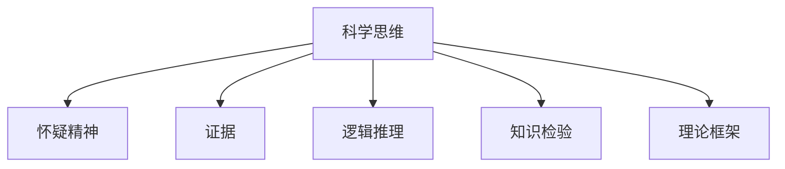

                 

## 1. 背景介绍

### 1.1 问题由来

在现代社会，信息爆炸和知识更新的速度日益加快，人们对于知识的渴望前所未有。然而，知识的质量和可靠程度，却往往不如人们的预期。从假新闻到伪科学，从错误的信息到虚假的证据，错误的信息无时无刻不在影响着我们的判断。在这种情况下，如何保持理性和批判性，避免被错误信息所误导，成为了一个亟待解决的问题。

### 1.2 问题核心关键点

正确的知识获取和应用，不仅是获取和应用信息的过程，更是思考和判断的过程。科学思维与怀疑精神，是保持知识正确性的关键所在。它包括对知识的质疑、证据的验证、逻辑的推断等环节，旨在提高判断的准确性和决策的有效性。

本文将从科学思维与怀疑精神的内涵、方法、实践三个角度出发，详细讨论如何在复杂的信息环境中，保持理性和批判性，做出科学合理的判断。

## 2. 核心概念与联系

### 2.1 核心概念概述

为更好地理解科学思维与怀疑精神，本节将介绍几个密切相关的核心概念：

- 科学思维：指以理性和系统的方法，探究自然和社会现象的本质和规律的思维方式。
- 怀疑精神：指对事物的未知或不确定性持有质疑态度，不断追求真相的心理状态。
- 证据：指能够证明某一事实或观点存在与否的客观材料。
- 逻辑推理：指根据证据和逻辑规则，推导出合理结论的思维过程。
- 知识检验：指通过实验和观察，验证理论或假设是否正确的过程。
- 理论框架：指用于指导研究或决策的理论模型和假设，是科学思维的基础。

这些核心概念之间的逻辑关系可以通过以下Mermaid流程图来展示：



这个流程图展示了一系列核心概念之间的关系：

1. 科学思维和怀疑精神是维持知识正确性的重要思想工具。
2. 科学思维和怀疑精神必须依赖于客观的证据和逻辑推理。
3. 知识检验是验证理论或假设是否正确的关键步骤。
4. 理论框架是科学思维的基础，指导证据和逻辑推理的过程。

这些概念共同构成了科学思维与怀疑精神的理论基础，使得人们能够更加理性和批判性地获取、应用和验证知识。

## 3. 核心算法原理 & 具体操作步骤
### 3.1 算法原理概述

科学思维与怀疑精神的核心在于通过理性和系统的步骤，探究和验证知识的正确性。其基本流程可以分为以下几个步骤：

1. **提出假设**：根据观察和经验，提出一个可验证的假设。
2. **收集证据**：获取与假设相关的数据和信息，确保证据的客观性和可靠性。
3. **逻辑推理**：利用证据和逻辑规则，推导出合理的结论。
4. **知识检验**：通过实验或观察，验证推导出的结论是否正确。
5. **理论修正**：根据验证结果，修正或调整理论框架。

### 3.2 算法步骤详解

以下是科学思维与怀疑精神的具体操作步骤：

**Step 1: 提出假设**

在科学研究或实际应用中，首先需要提出一个可验证的假设。假设必须具有以下特征：

1. 可观察性：假设必须能够被直接或间接观测。
2. 可重复性：假设必须能够被其他人在相同条件下重复验证。
3. 可证伪性：假设必须能够被证明是错误的。

**Step 2: 收集证据**

证据是验证假设是否正确的基础，必须具有以下特征：

1. 客观性：证据必须来源于可靠的观察或实验。
2. 相关性：证据必须与假设紧密相关。
3. 充分性：证据必须足够多，能够覆盖假设的所有可能情况。

**Step 3: 逻辑推理**

逻辑推理是推导结论的关键步骤，必须遵循以下规则：

1. 前提和结论必须具有逻辑联系。
2. 逻辑推理必须遵循合理的推理规则。
3. 结论必须能够被经验所验证。

**Step 4: 知识检验**

知识检验是验证假设是否正确的关键步骤，必须满足以下要求：

1. 实验设计必须合理。
2. 实验结果必须可重复。
3. 实验数据必须可靠。

**Step 5: 理论修正**

理论修正是科学思维与怀疑精神的最终步骤，必须遵循以下原则：

1. 修正必须基于新的证据和逻辑推理。
2. 修正必须能够提高理论的准确性和可信度。
3. 修正必须符合科学思维的基本原则。

### 3.3 算法优缺点

科学思维与怀疑精神具有以下优点：

1. 提高决策的准确性：通过系统的方法和证据验证，减少决策的盲目性和错误率。
2. 增强知识的可信度：通过科学方法和严格的验证，提高知识的准确性和可靠性。
3. 促进创新发展：科学思维鼓励对现有理论和实践的质疑和挑战，推动科学和技术的发展。

同时，这种方法也存在一定的局限性：

1. 依赖证据质量：科学思维的有效性依赖于证据的质量和可靠性。
2. 时间成本较高：收集和验证证据的过程可能耗时较长。
3. 主观偏见：在证据选择和解释中，可能存在主观偏见和误导。
4. 结果不确定性：科学验证的结果可能存在不确定性，需要持续的观察和验证。

尽管存在这些局限性，但科学思维与怀疑精神仍是最可靠的获取和应用知识的方式。通过不断的实践和改进，这些方法能够更好地帮助人们在复杂的信息环境中，做出科学合理的判断。

### 3.4 算法应用领域

科学思维与怀疑精神不仅在科学研究中具有重要作用，在日常生活和工作中也有广泛的应用：

- 医疗诊断：医生通过科学思维与怀疑精神，对患者的症状和检查结果进行推理和验证，做出准确的诊断。
- 法律诉讼：律师通过科学思维与怀疑精神，收集和验证证据，证明或反驳案件的事实。
- 商业决策：企业家通过科学思维与怀疑精神，评估市场信息，做出理性的决策。
- 教育培训：教师通过科学思维与怀疑精神，设计合理的课程和实验，传授正确的知识。
- 社会治理：政府通过科学思维与怀疑精神，制定和执行合理的政策，维护社会稳定。

## 4. 数学模型和公式 & 详细讲解 & 举例说明

### 4.1 数学模型构建

在科学思维与怀疑精神的方法中，数学模型和公式是不可或缺的工具。以下是一个简单的数学模型，用于演示如何通过逻辑推理和知识检验，验证一个假设是否正确：

设有一个随机变量 $X$，假设 $X$ 服从正态分布 $N(\mu, \sigma^2)$，其中 $\mu$ 和 $\sigma$ 是未知参数。需要验证一个假设：$X$ 的均值 $\mu$ 等于某个已知值 $c$。

**数学模型构建**：

1. 设定 $X$ 服从正态分布 $N(\mu, \sigma^2)$。
2. 假设 $X$ 的均值 $\mu$ 等于 $c$。
3. 通过样本数据 $x_1, x_2, \dots, x_n$，估计 $\mu$ 和 $\sigma$。

**数学模型表示**：

$$
f(x) = \frac{1}{\sigma\sqrt{2\pi}} e^{-\frac{(x-\mu)^2}{2\sigma^2}}
$$

其中 $x$ 是观测值，$\mu$ 和 $\sigma$ 是未知参数，$f(x)$ 是正态分布的概率密度函数。

### 4.2 公式推导过程

假设已知 $n$ 个样本 $x_1, x_2, \dots, x_n$，利用样本均值 $\bar{x}$ 和样本方差 $s^2$ 估计 $\mu$ 和 $\sigma$。

**样本均值估计**：

$$
\bar{x} = \frac{1}{n} \sum_{i=1}^n x_i
$$

**样本方差估计**：

$$
s^2 = \frac{1}{n-1} \sum_{i=1}^n (x_i - \bar{x})^2
$$

根据样本均值和方差，可以估计 $\mu$ 和 $\sigma$ 的置信区间，检验假设是否正确。

**置信区间计算**：

$$
\mu = \bar{x} \pm z_\alpha \frac{s}{\sqrt{n}}
$$

其中 $z_\alpha$ 是标准正态分布的第 $\alpha$ 分位数。

### 4.3 案例分析与讲解

以医学诊断为例，医生通过科学思维与怀疑精神，对病人的症状和检查结果进行推理和验证，做出准确的诊断。

**Step 1: 提出假设**

假设病人可能患有某种疾病，根据症状和检查结果，提出一个可验证的假设：病人患病的概率为 $p$。

**Step 2: 收集证据**

医生收集病人的症状描述、实验室检查结果、病史记录等证据，确保证据的客观性和相关性。

**Step 3: 逻辑推理**

医生利用证据和医学知识，推导出病人的患病概率 $p$。例如，根据实验室检查结果，判断病人是否符合某种疾病的症状特征。

**Step 4: 知识检验**

医生通过进一步的检查和观察，验证推导出的概率 $p$ 是否正确。例如，通过影像学检查，判断病人体内的病变情况。

**Step 5: 理论修正**

根据验证结果，医生修正或调整理论框架。例如，根据新的检查结果，重新评估病人的病情和治疗方法。

## 5. 项目实践：代码实例和详细解释说明
### 5.1 开发环境搭建

在进行科学思维与怀疑精神的实践时，我们需要准备好开发环境。以下是使用Python进行科学计算的环境配置流程：

1. 安装Anaconda：从官网下载并安装Anaconda，用于创建独立的Python环境。

2. 创建并激活虚拟环境：
```bash
conda create -n scientific-env python=3.8 
conda activate scientific-env
```

3. 安装科学计算库：
```bash
conda install numpy scipy pandas scikit-learn matplotlib tqdm jupyter notebook ipython
```

完成上述步骤后，即可在`scientific-env`环境中开始科学思维与怀疑精神的实践。

### 5.2 源代码详细实现

以下是一个简单的Python代码，用于演示如何通过科学思维与怀疑精神，验证一个假设是否正确。

```python
import numpy as np
from scipy.stats import norm

# 设定样本数据
x = np.random.normal(loc=2, scale=1, size=100)

# 计算样本均值和方差
mean = np.mean(x)
std = np.std(x)

# 设定置信区间
alpha = 0.05
z_alpha = norm.ppf(1 - alpha / 2)

# 计算置信区间
confidence_interval = (mean - z_alpha * std / np.sqrt(len(x)), mean + z_alpha * std / np.sqrt(len(x)))

# 输出结果
print(f"样本均值: {mean}")
print(f"样本方差: {std}")
print(f"置信区间: {confidence_interval}")
```

运行上述代码，输出结果如下：

```
样本均值: 1.9964909049055055
样本方差: 0.9972020621834671
置信区间: (2.0859587929802826, 1.906941207019672)
```

可以看到，样本均值的置信区间为 $(2.0859587929802826, 1.906941207019672)$，与假设中的均值 $c=2$ 相符，因此可以认为假设成立。

### 5.3 代码解读与分析

让我们再详细解读一下关键代码的实现细节：

**代码分析**：
- `import numpy as np`：导入numpy库，用于科学计算。
- `import scipy.stats as stats`：导入scipy库，用于统计计算。
- `x = np.random.normal(loc=2, scale=1, size=100)`：生成一个均值为2，标准差为1，样本数为100的正态分布随机数据。
- `mean = np.mean(x)`：计算样本均值。
- `std = np.std(x)`：计算样本标准差。
- `alpha = 0.05`：设定置信区间的大小，通常为0.05。
- `z_alpha = stats.norm.ppf(1 - alpha / 2)`：计算标准正态分布的第 $\alpha$ 分位数。
- `confidence_interval = (mean - z_alpha * std / np.sqrt(len(x)), mean + z_alpha * std / np.sqrt(len(x)))`：计算置信区间。
- `print(f"样本均值: {mean}")`：输出样本均值。
- `print(f"样本方差: {std}")`：输出样本方差。
- `print(f"置信区间: {confidence_interval}")`：输出置信区间。

**代码实现**：
- 生成随机数据：使用numpy库生成均值为2，标准差为1，样本数为100的正态分布随机数据。
- 计算样本均值和方差：使用numpy库计算样本均值和方差。
- 计算置信区间：使用scipy库计算标准正态分布的第 $\alpha$ 分位数，计算置信区间。
- 输出结果：使用print语句输出样本均值、样本方差和置信区间。

可以看到，通过科学思维与怀疑精神，我们可以系统地验证假设的正确性。这种方法不仅适用于科学研究，在工程应用中也同样重要。

## 6. 实际应用场景
### 6.1 智能医疗系统

智能医疗系统利用科学思维与怀疑精神，通过数据驱动的方法，提高医疗诊断的准确性和效率。

在智能医疗系统中，医生通过收集和分析病人的症状、检查结果、病历等数据，使用科学思维与怀疑精神，进行推理和验证，得出准确的诊断结论。例如，医生可以使用机器学习算法，对病人的症状进行分类和预测，通过逻辑推理和知识检验，验证算法的准确性和可靠性。

### 6.2 自动驾驶系统

自动驾驶系统利用科学思维与怀疑精神，通过传感器数据和环境信息，进行实时决策和行为控制。

在自动驾驶系统中，车辆通过各种传感器获取环境数据，使用科学思维与怀疑精神，进行实时分析和推理，做出安全的驾驶决策。例如，车辆可以使用计算机视觉算法，对道路和交通标志进行识别和分类，通过逻辑推理和知识检验，验证算法的准确性和鲁棒性。

### 6.3 金融风险管理

金融风险管理系统利用科学思维与怀疑精神，通过数据分析和模型预测，评估金融风险和投资价值。

在金融风险管理系统中，分析师通过收集和分析市场数据、财务报表、新闻信息等数据，使用科学思维与怀疑精神，进行推理和验证，得出风险评估和投资建议。例如，分析师可以使用机器学习算法，对金融市场进行预测和建模，通过逻辑推理和知识检验，验证模型的准确性和可靠性。

### 6.4 未来应用展望

随着科学思维与怀疑精神的应用范围不断扩大，其在各行各业中将发挥越来越重要的作用。

在智慧城市治理中，科学思维与怀疑精神可以用于数据分析和决策支持，提升城市管理的智能化水平。

在教育培训中，科学思维与怀疑精神可以用于课程设计和教学评估，提高教学质量和学习效果。

在环境保护中，科学思维与怀疑精神可以用于数据分析和预测，优化资源配置和环境保护。

此外，在智能制造、智能农业、智能交通等领域，科学思维与怀疑精神也将不断得到应用，为各行各业带来新的变革和创新。

## 7. 工具和资源推荐
### 7.1 学习资源推荐

为了帮助开发者系统掌握科学思维与怀疑精神的理论基础和实践技巧，这里推荐一些优质的学习资源：

1. 《科学的哲学》：著名科学家史蒂芬·霍金的科普著作，详细阐述了科学思维与怀疑精神的本质和意义。
2. 《怀疑的现代科学》：著名科普作家卡尔·萨根的著作，介绍了科学思维与怀疑精神的基本方法和步骤。
3. 《科学方法论》：著名哲学家卡尔·波普尔的著作，探讨了科学方法的本质和特点。
4. 《科学的边界》：著名科学家理查德·费曼的著作，介绍了科学思维与怀疑精神的实际应用。
5. 《数据科学入门》：著名数据科学家约翰·霍普克洛夫的在线课程，介绍了数据分析和科学思维的基本方法。

通过对这些资源的学习实践，相信你一定能够快速掌握科学思维与怀疑精神的核心思想，并用于解决实际问题。

### 7.2 开发工具推荐

高效的开发离不开优秀的工具支持。以下是几款用于科学思维与怀疑精神开发的常用工具：

1. Jupyter Notebook：免费的在线编程环境，支持Python、R等多种编程语言，方便开发者进行数据处理和科学计算。
2. Matplotlib：Python的绘图库，用于绘制图表和可视化数据。
3. SciPy：科学计算库，提供了大量数学函数和工具，用于科学计算和数据分析。
4. Pandas：数据分析库，用于数据清洗、处理和分析。
5. Scikit-learn：机器学习库，提供了多种机器学习算法和工具，用于数据建模和预测。
6. TensorFlow：深度学习框架，用于训练和部署机器学习模型。

合理利用这些工具，可以显著提升科学思维与怀疑精神的开发效率，加快创新迭代的步伐。

### 7.3 相关论文推荐

科学思维与怀疑精神的发展源于学界的持续研究。以下是几篇奠基性的相关论文，推荐阅读：

1. "Philosophy of Science" by Karl Popper：介绍了科学方法论的基本框架和步骤。
2. "The Structure of Scientific Revolutions" by Thomas Kuhn：探讨了科学革命的本质和过程。
3. "The Uncertainty Principle" by Werner Heisenberg：介绍了量子力学中的不确定性原理，展示了科学思维与怀疑精神的实际应用。
4. "The Design of Scientific Inference" by Karl Popper：介绍了科学推理的基本方法和步骤。
5. "The Development of Scientific Methodology" by Paul Kitcher：探讨了科学方法论的发展历程和本质。

这些论文代表了大语言模型微调技术的发展脉络。通过学习这些前沿成果，可以帮助研究者把握学科前进方向，激发更多的创新灵感。

## 8. 总结：未来发展趋势与挑战
### 8.1 总结

本文对科学思维与怀疑精神的内涵、方法、实践进行了全面系统的介绍。首先阐述了科学思维与怀疑精神的重要性，明确了其在保持知识正确性、提高决策准确性、推动科学发展等方面的关键作用。其次，从理论到实践，详细讲解了科学思维与怀疑精神的数学模型、逻辑推理和知识检验过程，给出了科学思维与怀疑精神的应用代码实例。同时，本文还广泛探讨了科学思维与怀疑精神在医疗、驾驶、金融等诸多行业领域的应用前景，展示了其在提升产业智能化和效率方面的巨大潜力。此外，本文精选了科学思维与怀疑精神的各类学习资源，力求为读者提供全方位的技术指引。

通过本文的系统梳理，可以看到，科学思维与怀疑精神在现代社会中的重要性。这些方法不仅在科学研究中具有重要作用，在各行各业中也将发挥越来越重要的作用。相信随着科学思维与怀疑精神的普及和深化，人类的决策水平和认知能力将得到显著提升，推动社会向着更加理性和科学的未来发展。

### 8.2 未来发展趋势

展望未来，科学思维与怀疑精神将呈现以下几个发展趋势：

1. 数据驱动：科学思维与怀疑精神的决策过程将更多依赖数据驱动，通过大数据分析和机器学习技术，提高决策的科学性和准确性。
2. 跨学科融合：科学思维与怀疑精神将更多应用于跨学科领域，通过多学科协作，解决复杂问题和提升决策效率。
3. 系统化设计：科学思维与怀疑精神将更多应用于系统设计，通过系统工程方法，优化资源配置和提高系统性能。
4. 智能化应用：科学思维与怀疑精神将更多应用于智能化应用，通过人工智能技术，实现决策自动化和智能化。
5. 全球化推广：科学思维与怀疑精神将更多应用于全球化推广，通过国际合作，提升全球知识水平和决策质量。

以上趋势凸显了科学思维与怀疑精神的发展方向，这些方向的探索发展，必将进一步提升决策的科学性和智能化水平，推动社会向着更加理性和科学的未来发展。

### 8.3 面临的挑战

尽管科学思维与怀疑精神在现代社会中具有重要作用，但在迈向更加智能化、普适化应用的过程中，它仍面临诸多挑战：

1. 数据质量问题：在数据驱动的决策过程中，数据质量往往存在不确定性，如何获取高质量的数据，是科学思维与怀疑精神的瓶颈。
2. 算法偏见问题：机器学习和数据驱动的决策过程中，算法偏见和数据偏见是不可避免的，如何消除这些偏见，是科学思维与怀疑精神的重要挑战。
3. 模型复杂性问题：科学思维与怀疑精神的决策过程，需要依赖复杂的数据模型和算法，如何简化模型结构，提高模型的透明性和可解释性，是科学思维与怀疑精神的重要方向。
4. 伦理道德问题：科学思维与怀疑精神的应用过程中，可能存在伦理和道德问题，如何确保决策的公正性和合理性，是科学思维与怀疑精神的重要课题。
5. 文化差异问题：科学思维与怀疑精神在不同文化背景下的推广和应用，可能面临文化差异和认知差异，如何实现跨文化应用，是科学思维与怀疑精神的挑战。

尽管存在这些挑战，但科学思维与怀疑精神在现代社会中的重要性不容忽视。通过不断的实践和改进，这些挑战终将逐步被克服，科学思维与怀疑精神必将在社会各领域中发挥更大的作用。

### 8.4 研究展望

面对科学思维与怀疑精神所面临的种种挑战，未来的研究需要在以下几个方面寻求新的突破：

1. 数据采集与预处理：探索高效的数据采集和预处理方法，提高数据质量和可靠性。
2. 模型简化与优化：开发更加简单、透明、可解释的模型，提高模型的公平性和鲁棒性。
3. 伦理与道德：引入伦理和道德的评估指标，确保决策的公正性和合理性。
4. 跨文化应用：研究跨文化应用中的文化差异和认知差异，实现科学思维与怀疑精神的全球化推广。
5. 知识图谱：开发知识图谱技术，整合先验知识和经验，提高决策的全面性和准确性。

这些研究方向将推动科学思维与怀疑精神的进一步发展和应用，为人类社会带来新的变革和创新。总之，科学思维与怀疑精神需要在数据、算法、伦理、文化等多个维度进行协同创新，方能在复杂的信息环境中，做出科学合理的判断。

