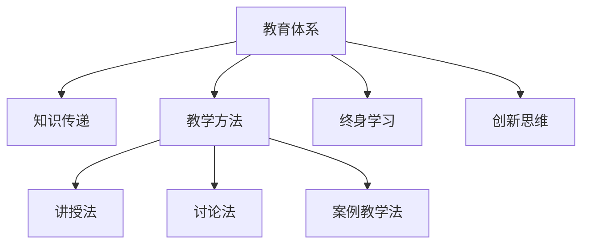

                 

## 1. 背景介绍

### 1.1 问题由来
教育是人类文明进步的基石，是知识的跨代传递和创新的重要渠道。随着技术的发展和社会的变迁，教育体系也在不断地演进和变革，旨在适应新的知识经济时代的需求。本文将探讨教育体系的演变过程，分析其对知识传递和创新的影响，并展望未来教育的发展趋势。

### 1.2 问题核心关键点
教育体系的演变涉及多个方面，包括教学内容、教学方法、学习环境、评估体系等。本文将聚焦于教学方法的演变，特别是随着技术进步，传统的以知识传授为主的教学模式如何向以能力培养、创新思维和终身学习为核心的新模式转变。

### 1.3 问题研究意义
研究教育体系的演进对于提升教育质量、培养适应未来社会需求的创新人才具有重要意义。通过了解教育体系的演变，可以更好地把握教育改革的方向，探索符合时代需求的创新教育模式，推动教育技术的进步和教育公平的实现。

## 2. 核心概念与联系

### 2.1 核心概念概述

为更好地理解教育体系的演进过程，本节将介绍几个关键概念：

- **教育体系(Education System)**：一个国家或地区的教育制度和教学方法的总和，包括从幼儿园到高等教育各个阶段的教学内容、教学方法和评估体系等。

- **知识传递(Knowledge Transfer)**：教育体系的核心功能之一，通过教师与学生的互动，将知识从上一代传递给下一代。

- **教学方法(Teaching Method)**：教师在教学过程中采用的策略和手段，如讲授法、讨论法、案例教学法等，影响着学生的学习效果和创新能力。

- **终身学习(Lifelong Learning)**：强调个人在职业生涯中的持续学习和发展，适应快速变化的知识经济时代。

- **创新思维(Innovation Thinking)**：培养学生解决问题的能力和创造性思维，推动技术和知识的创新。

这些核心概念之间的逻辑关系可以通过以下Mermaid流程图来展示：



这个流程图展示了一幅教育体系的核心概念图，其中教育体系由知识传递和教学方法构成，两者通过终身学习和创新思维紧密相连，共同推动教育的进步。

## 3. 核心算法原理 & 具体操作步骤
### 3.1 算法原理概述

教育体系的演变，本质上是通过教学方法的变革来适应新的知识传递需求。其核心在于如何设计有效的教学方法，以促进知识的有效传递和学生的全面发展。

### 3.2 算法步骤详解

教育体系的演进涉及多个步骤，包括：

**Step 1: 了解现有教育体系**

- 收集当前教育体系的详细信息，包括教学内容、教学方法、评估体系等。
- 分析当前教育体系的优点和不足，确定改进方向。

**Step 2: 设计新的教学方法**

- 结合最新的教学理念和研究成果，设计新的教学方法。
- 如引入翻转课堂、项目制学习等新的教学模式。

**Step 3: 实施和评估**

- 在一定范围内试行新的教学方法，收集反馈信息。
- 根据反馈信息进行调整和优化，进一步完善教学方法。

**Step 4: 推广和改进**

- 在更大范围内推广新的教学方法。
- 收集各层次的反馈信息，进行持续改进。

### 3.3 算法优缺点

新的教学方法在提升教育质量、培养创新人才方面具有以下优点：

- 强调学生的主体地位，促进其自主学习和创新能力的培养。
- 通过项目制学习等方法，使学生能够将所学知识应用于实际问题解决中。
- 引入跨学科学习，培养学生的综合素质和跨领域创新能力。

然而，新教学方法也存在一些缺点：

- 对教师的教学能力和信息化水平提出了更高要求。
- 需要更多的教学资源和支持，包括技术设备和教师培训等。
- 教学效果和学生成绩的评估更加复杂，需要更多元化的评估标准。

### 3.4 算法应用领域

新的教学方法已经在多个教育领域得到应用，例如：

- **基础教育**：引入翻转课堂、项目制学习等新模式，促进学生的自主学习和发展。
- **高等教育**：采用研究型教学、跨学科合作等方式，培养高素质创新人才。
- **职业教育**：通过案例教学、现场实习等方式，提高学生的实践能力和就业竞争力。

## 4. 数学模型和公式 & 详细讲解 & 举例说明

### 4.1 数学模型构建

教育体系的演变可以建模为一个动态系统，其核心变量包括：

- $S$：学生人数
- $T$：教师人数
- $C$：教学内容
- $M$：教学方法
- $E$：教育环境

教育体系的目标函数为最大化学生对知识的掌握程度和学习效果，即：

$$
Maximize\ \ (S(T, M, C, E))
$$

其中 $S$ 为学生对知识的掌握程度，可以分解为知识理解度、应用能力和创新能力。

### 4.2 公式推导过程

假设学生人数为 $S_0$，教师人数为 $T_0$，教学内容为 $C_0$，教学方法为 $M_0$，教育环境为 $E_0$。引入新的教学方法 $M_1$，教育环境 $E_1$，对教学内容 $C_1$ 进行优化，则新的教育体系的目标函数为：

$$
S_1 = S_0(T_0, M_0, C_0, E_0) + f(M_1, E_1, C_1)
$$

其中 $f$ 为新的教学方法、教育环境、教学内容对学生知识掌握程度的影响函数。

### 4.3 案例分析与讲解

以翻转课堂为例，分析其对学生知识掌握程度的影响。假设一个班级的人数为 $S_0=30$，教师人数为 $T_0=2$，采用传统的讲授法 $M_0$，教学内容为 $C_0$，教育环境为 $E_0$。引入翻转课堂 $M_1$，教育环境 $E_1$，对教学内容 $C_1$ 进行优化，新的教育体系的目标函数为：

$$
S_1 = S_0(T_0, M_0, C_0, E_0) + f(M_1, E_1, C_1)
$$

其中 $f$ 可以分解为以下几个因素：

- $M_1$：翻转课堂强调自主学习和讨论，可以提高学生的学习兴趣和主动性。
- $E_1$：利用信息化工具和在线平台，可以提供丰富的教学资源和互动环境。
- $C_1$：通过项目制学习，学生可以将所学知识应用于实际问题解决中。

假设 $f$ 的表达式为：

$$
f(M_1, E_1, C_1) = aM_1 + bE_1 + cC_1
$$

其中 $a$、$b$、$c$ 为系数，需要通过实验和数据分析确定。

## 5. 项目实践：代码实例和详细解释说明
### 5.1 开发环境搭建

在进行教育体系演进研究前，我们需要准备好开发环境。以下是使用Python进行数据分析和建模的环境配置流程：

1. 安装Anaconda：从官网下载并安装Anaconda，用于创建独立的Python环境。

2. 创建并激活虚拟环境：
```bash
conda create -n education-env python=3.8 
conda activate education-env
```

3. 安装必要的Python库：
```bash
pip install pandas numpy matplotlib seaborn scikit-learn
```

4. 安装R：由于部分统计分析需要使用R语言，安装R及其相关包。

```bash
conda install r-essentials
```

完成上述步骤后，即可在`education-env`环境中进行数据分析和建模实践。

### 5.2 源代码详细实现

下面以翻转课堂为例，展示如何使用Python进行教育体系演进的研究。

首先，收集历史教育体系数据：

```python
import pandas as pd

# 读取历史教育体系数据
data = pd.read_csv('education_system.csv')

# 分析教学方法对学生知识掌握程度的影响
def analyze_learning_method(data, method):
    grouped_data = data.groupby('method')['knowledge_score'].mean()
    return grouped_data
```

然后，设计新的教学方法：

```python
# 设计翻转课堂教学方法
new_method = 'Flipped Classroom'

# 计算翻转课堂对学生知识掌握程度的影响
new_knowledge_score = analyze_learning_method(data, new_method)
print(new_knowledge_score)
```

最后，将结果可视化：

```python
import matplotlib.pyplot as plt

# 绘制教学方法对学生知识掌握程度的影响图
plt.figure(figsize=(10, 6))
plt.plot(grouped_data.index, grouped_data.values, marker='o')
plt.xlabel('Teaching Method')
plt.ylabel('Knowledge Score')
plt.title('Effect of Teaching Method on Knowledge Score')
plt.show()
```

### 5.3 代码解读与分析

让我们再详细解读一下关键代码的实现细节：

**分析教学方法对学生知识掌握程度的影响**：
- 使用`groupby`方法按照教学方法分组，计算每个方法的平均知识掌握程度。
- 使用`mean`方法计算每组的平均分数。

**设计新的教学方法**：
- 引入翻转课堂教学方法，命名为`new_method`。
- 使用`analyze_learning_method`函数计算翻转课堂对知识掌握程度的影响。

**绘制影响图**：
- 使用`matplotlib`库绘制图形。
- 设置图表大小、坐标轴标签和标题。

可以看到，Python代码能够方便地进行数据分析和可视化，帮助我们理解不同教学方法对学生知识掌握程度的影响。

## 6. 实际应用场景
### 6.1 智能教育系统

基于教育体系演进的智能教育系统，可以实时监测学生的学习状态，提供个性化学习路径和即时反馈，以提升学习效果。

在技术实现上，可以构建学生学习行为分析模型，通过收集学生在线学习平台的数据，分析其学习进度、互动情况、知识掌握程度等，自动生成个性化学习建议和反馈，帮助学生发现学习中的问题并及时调整学习策略。

### 6.2 跨学科合作教育

教育体系的演进趋势之一是强调跨学科合作学习，培养学生的综合素质和创新能力。在实际应用中，可以通过跨学科项目制学习，让学生在多个学科领域内协同完成一个复杂项目，以实现知识的整合和应用。

例如，让学生通过跨学科合作，设计一个智能机器人，同时涉及机械工程、电子工程、计算机科学等多个学科的知识和技能。这种跨学科合作的学习方式，可以大大提升学生的创新能力和实践能力。

### 6.3 教育公平与普适性

教育体系的演进还致力于解决教育公平和普适性问题。通过利用技术手段，将优质教育资源传递到偏远地区和欠发达地区，实现教育资源的均衡分配。

例如，通过远程教育和在线课程，让偏远地区的学生能够享受到与城市学生同等的教育资源。这不仅提升了教育公平性，也为更多学生提供了终身学习的机会。

## 7. 工具和资源推荐
### 7.1 学习资源推荐

为了帮助开发者系统掌握教育体系演进的理论基础和实践技巧，这里推荐一些优质的学习资源：

1. **《教育体系演进：从工业时代到信息时代》**：系统介绍了教育体系从工业时代到信息时代的演变过程，包括教学方法、学习环境、评估体系等各方面的变化。

2. **MOOC在线课程**：各大高校和教育机构开设的在线课程，涵盖教育学、心理学、信息技术等领域的知识，提供系统化的学习体验。

3. **教育技术论坛**：如EdTechTalk、GlobalEdTech等，汇聚全球教育技术专家和从业者，提供最新的教育技术资讯和交流平台。

4. **教育数据集**：如Kaggle上的教育数据集，提供丰富的教育领域数据，供数据分析和建模研究使用。

5. **教育技术论文**：如IEEE Transaction on Education、Journal of Educational Technology等，收录大量前沿的教育技术研究成果。

通过对这些资源的学习实践，相信你一定能够快速掌握教育体系演进的精髓，并用于解决实际的NLP问题。

### 7.2 开发工具推荐

高效的开发离不开优秀的工具支持。以下是几款用于教育体系演进开发的常用工具：

1. **Python**：用于数据处理和建模，具有丰富的第三方库和社区支持。
2. **R语言**：用于统计分析和数据可视化，具有强大的数据处理能力。
3. **Jupyter Notebook**：用于编写和运行Python、R等语言代码，支持代码块的逐行运行和结果的实时显示。
4. **Tableau**：用于数据可视化，提供丰富的图表和仪表盘功能。
5. **Google Colab**：免费的在线Jupyter Notebook环境，提供GPU和TPU算力，方便进行大规模数据分析和建模。

合理利用这些工具，可以显著提升教育体系演进的研究和实践效率，加快创新迭代的步伐。

### 7.3 相关论文推荐

教育体系演进的研究涉及多个领域，包括教育学、心理学、信息技术等。以下是几篇奠基性的相关论文，推荐阅读：

1. **《教育体系演进的理论框架》**：提出教育体系演进的一般框架，包括教学方法、学习环境、评估体系等方面的演变。

2. **《翻转课堂对学生学习效果的影响》**：研究翻转课堂对学生知识掌握程度和学习效果的影响，为翻转课堂的设计和推广提供了科学依据。

3. **《跨学科学习对学生综合素质的影响》**：探讨跨学科学习对学生综合素质和创新能力的影响，为跨学科教育的设计提供了理论支持。

4. **《远程教育对教育公平的影响》**：分析远程教育对教育公平和普适性的影响，为远程教育的发展提供了指导。

5. **《教育技术在培养创新人才中的应用》**：研究教育技术在培养创新人才中的作用，提出教育技术的未来发展方向。

这些论文代表了大语言模型微调技术的发展脉络。通过学习这些前沿成果，可以帮助研究者把握学科前进方向，激发更多的创新灵感。

## 8. 总结：未来发展趋势与挑战
### 8.1 总结

本文对教育体系的演进过程进行了全面系统的介绍。首先阐述了教育体系演进的背景和意义，明确了教学方法变革在教育体系演进中的核心地位。其次，从原理到实践，详细讲解了教育体系演进的过程和方法，给出了教育体系演进的完整代码实例。同时，本文还广泛探讨了教育体系演进在智能教育系统、跨学科合作教育、教育公平与普适性等方面的应用前景，展示了教育体系演进技术的巨大潜力。

通过本文的系统梳理，可以看到，教育体系的演进是一个系统性的工程，涉及教学方法、学习环境、评估体系等多个方面。只有在各环节协同发力，才能真正实现教育质量的提升和教育公平的实现。

### 8.2 未来发展趋势

展望未来，教育体系的演进将呈现以下几个发展趋势：

1. **智能化教育**：利用人工智能技术，如智能教育系统、个性化学习路径等，提升教育质量和效率。
2. **跨学科融合**：培养学生的跨学科综合素质和创新能力，适应未来复杂多变的职业需求。
3. **终身学习**：推动终身学习文化的普及，提供更多灵活的学习方式和资源，适应快速变化的知识经济时代。
4. **普适性教育**：通过远程教育、在线课程等方式，实现教育资源的均衡分配，提升教育公平性。
5. **个性化教育**：通过数据分析和建模，提供个性化的学习建议和反馈，满足不同学生的学习需求。

以上趋势凸显了教育体系演进的广阔前景。这些方向的探索发展，将进一步提升教育的质量和公平性，推动教育的现代化进程。

### 8.3 面临的挑战

尽管教育体系演进技术已经取得了显著成就，但在迈向更加智能化、普适化应用的过程中，仍面临诸多挑战：

1. **数据隐私和安全**：教育数据涉及个人隐私，需要严格的数据隐私保护和数据安全措施。
2. **教育资源不均衡**：优质教育资源仍集中在少数地区和学校，如何实现教育资源的均衡分配是一大难题。
3. **教师适应性**：新的教学方法需要教师具备更高的教学能力和信息化水平，教师培训和转型面临挑战。
4. **学生适应性**：新的教学方法需要学生具备自主学习和自管理能力，学生的适应性和接受度仍需进一步提升。
5. **技术依赖性**：教育体系的演进高度依赖技术手段，技术故障和设备不足可能影响教育效果。

这些挑战需要教育界和工业界的共同努力，通过政策引导、技术创新和教育改革，逐步解决这些问题，推动教育体系演进技术的成熟和应用。

### 8.4 研究展望

未来教育体系演进的研究需要在以下几个方面寻求新的突破：

1. **教育数据的采集和分析**：利用大数据技术和人工智能算法，采集和分析更多的教育数据，为教育决策提供科学依据。
2. **教育资源的优化分配**：通过信息化手段，实现教育资源的智能化管理和优化分配，提升教育公平性。
3. **教师培训和转型**：推动教师培训和教学转型，提升教师的教学能力和信息化水平，确保新的教学方法能够顺利实施。
4. **学生适应性培养**：通过课程设计和教学方法优化，培养学生的自主学习和自管理能力，适应新的学习模式。
5. **教育技术的创新应用**：开发更多教育技术工具和平台，推动教育技术的创新应用，提升教育质量和效率。

这些研究方向的探索，将进一步推动教育体系的演进，为构建未来智能教育体系奠定基础。面向未来，教育体系演进技术还需要与其他人工智能技术进行更深入的融合，如知识表示、因果推理、强化学习等，多路径协同发力，共同推动教育技术的进步。

## 9. 附录：常见问题与解答

**Q1：如何衡量新的教学方法对学生知识掌握程度的影响？**

A: 可以通过学生知识测试成绩的变化来衡量新的教学方法对学生知识掌握程度的影响。具体来说，可以设计前后两个阶段的知识测试，分别测试学生在传统教学方法和新的教学方法下的知识掌握程度，通过对比分析得出结论。

**Q2：教师应该如何适应新的教学方法？**

A: 教师适应新的教学方法需要进行持续的培训和学习。具体来说，可以组织教师参加在线课程和研讨会，学习新的教学理念和方法，通过实际教学体验和反馈调整，逐步掌握新的教学方法。

**Q3：如何确保教育数据的安全和隐私保护？**

A: 教育数据的安全和隐私保护需要从多个方面入手，包括：
1. 数据加密和访问控制：采用数据加密技术和严格的访问控制机制，确保数据在传输和存储过程中的安全性。
2. 匿名化和去标识化：在数据采集和分析过程中，对学生信息进行匿名化和去标识化处理，防止数据泄露。
3. 合规和监管：遵守相关数据隐私法律法规，进行合规性和风险评估，建立数据隐私保护机制。

**Q4：如何提升学生的自主学习能力和自管理能力？**

A: 提升学生的自主学习能力和自管理能力，需要从多个方面入手，包括：
1. 设计个性化的学习路径：根据学生的学习情况和兴趣，设计个性化的学习路径，提供灵活的学习资源和工具。
2. 提供即时反馈和支持：通过智能教育系统，提供实时的学习反馈和支持，帮助学生发现学习中的问题并及时调整学习策略。
3. 培养自主学习和自管理习惯：通过课程设计和教学方法优化，培养学生的自主学习和自管理习惯，提升其学习能力和自我管理能力。

**Q5：如何实现教育资源的均衡分配？**

A: 实现教育资源的均衡分配需要从多个方面入手，包括：
1. 政策支持：制定相关政策和法规，推动优质教育资源的均衡分配。
2. 信息化手段：通过远程教育和在线课程等信息化手段，将优质教育资源传递到偏远地区和欠发达地区。
3. 合作与共享：加强区域间和校际间的合作与共享，实现教育资源的互补和优化。

这些常见问题的解答，为教育体系演进技术的实施和推广提供了指导和支持。

