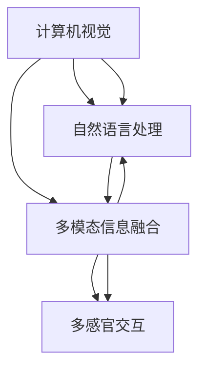

                 

# 知识的跨感官整合：全方位理解的力量

> 关键词：知识跨感官整合, 全感官理解, 多模态信息融合, 人工智能, 深度学习, 计算机视觉, 自然语言处理

## 1. 背景介绍

### 1.1 问题由来
近年来，人工智能技术快速发展，尤其是深度学习在计算机视觉、自然语言处理(NLP)等领域的突破性进展，使得机器能够处理多感官输入，从不同维度理解世界。然而，将不同感官的信息有效地整合在一起，实现对世界的全方位理解，仍然是人工智能领域的重大挑战。

### 1.2 问题核心关键点
本文聚焦于知识的跨感官整合，即如何有效地融合不同感官的信息，形成对世界的全方位理解。该问题可以细分为以下几个核心关键点：

- 什么是跨感官整合？
- 跨感官整合的重要性及其应用场景。
- 当前主流跨感官整合技术及其实现机制。
- 跨感官整合在实际应用中的挑战与解决方案。

本文将深入探讨这些问题，全面剖析跨感官整合的原理与技术，提供实践指导，以期为未来人工智能应用带来新的突破。

## 2. 核心概念与联系

### 2.1 核心概念概述

跨感官整合是指将不同感官（如视觉、听觉、触觉、味觉、嗅觉等）的信息整合并转化为对世界的统一理解。在人工智能领域，主要应用于计算机视觉和自然语言处理等任务中。

**计算机视觉**：通过图像、视频等视觉数据，提取特征，识别对象，理解场景。

**自然语言处理**：通过文本、语音等自然语言数据，理解语义，进行对话、翻译、文本生成等任务。

**多模态信息融合**：将视觉、听觉、触觉等多种感官信息融合在一起，形成更全面的理解。

**多感官交互**：通过多模态设备（如触摸屏、虚拟现实设备），实现与用户的自然交互，提升用户体验。

### 2.2 核心概念联系

跨感官整合涉及多个核心概念，它们之间通过信息的整合和转换形成完整的认知体系。下图展示了这些概念的联系：



此图展示了跨感官整合的核心流程：

1. 计算机视觉获取图像信息。
2. 自然语言处理处理文本、语音信息。
3. 多模态信息融合整合多种信息。
4. 多感官交互生成用户互动反馈。

## 3. 核心算法原理 & 具体操作步骤
### 3.1 算法原理概述

跨感官整合的算法原理主要基于深度学习的多模态模型，通过将不同感官的信息转化为统一的向量表示，进行信息融合。以下是对其基本原理的介绍：

1. **感官数据预处理**：将不同感官的数据进行标准化处理，使其具有可比较性。
2. **特征提取**：使用深度学习模型（如卷积神经网络CNN、循环神经网络RNN等）从不同感官的数据中提取特征。
3. **信息融合**：将提取出的特征通过特定的融合方式（如拼接、注意力机制等）组合在一起，形成统一的向量表示。
4. **统一模型训练**：构建一个统一的深度学习模型，通过监督学习或半监督学习的方式，训练模型对统一向量表示进行理解和预测。

### 3.2 算法步骤详解

以下是实现跨感官整合的详细算法步骤：

**Step 1: 数据收集与预处理**

收集不同感官的样本数据，并进行标准化处理：

- **视觉数据**：采集图像或视频，调整大小、灰度化等处理。
- **听觉数据**：采集音频，进行降噪、分割等处理。
- **触觉数据**：采集压力、温度等传感器数据，进行预处理。
- **味觉和嗅觉数据**：收集样本，进行预处理。

**Step 2: 特征提取**

使用深度学习模型从不同感官数据中提取特征：

- **视觉特征提取**：使用卷积神经网络（CNN）提取图像特征。
- **听觉特征提取**：使用卷积神经网络（CNN）或循环神经网络（RNN）提取音频特征。
- **触觉特征提取**：使用卷积神经网络（CNN）或一维卷积神经网络（1D-CNN）提取触觉信号。
- **味觉和嗅觉特征提取**：使用神经网络模型提取相关感官特征。

**Step 3: 信息融合**

将提取出的特征通过融合方法整合成统一的向量表示：

- **特征拼接**：简单地将不同感官的特征拼接在一起。
- **注意力机制**：使用注意力机制，根据不同感官的重要程度，对特征进行加权融合。
- **多模态自编码器**：构建多模态自编码器，通过编码器将不同感官数据映射到统一的低维空间，解码器将其映射回不同感官空间，完成信息的整合。

**Step 4: 统一模型训练**

构建一个统一的深度学习模型，通过监督学习或半监督学习的方式，训练模型对统一向量表示进行理解和预测。

- **监督学习**：使用有标注的数据训练模型，最大化预测准确率。
- **半监督学习**：使用少量有标注数据和大量无标注数据，通过自训练和对抗学习提高模型泛化能力。

**Step 5: 模型评估与优化**

在验证集上评估模型性能，根据结果调整模型超参数，优化模型结构：

- **准确率**：评估模型对统一向量表示的理解能力。
- **召回率**：评估模型对不同感官信息的融合能力。
- **损失函数**：选择合适的损失函数，如交叉熵损失、均方误差损失等，最小化模型预测与真实值之间的差异。

### 3.3 算法优缺点

**优点**：

- 跨感官整合可以充分利用多模态信息，提升对世界的理解能力。
- 可以处理复杂任务，如机器人导航、智能家居控制等。
- 提升用户体验，增强人机交互的自然性。

**缺点**：

- 数据获取成本高，不同感官的数据量差异较大。
- 不同感官数据之间的转换和融合复杂，可能导致信息丢失。
- 模型训练复杂度高，需要更多的计算资源。

### 3.4 算法应用领域

跨感官整合技术在多个领域有广泛应用：

- **智能家居**：通过融合视觉、触觉、语音等多种信息，实现智能家电的自动化控制和交互。
- **机器人导航**：通过视觉和触觉信息融合，实现机器人的自主导航和环境感知。
- **医疗诊断**：通过融合触觉、味觉等传感器信息，提升诊断准确率。
- **虚拟现实**：通过多感官交互，提升虚拟现实系统的沉浸感和真实感。
- **交通管理**：通过融合视觉、声音信息，实现智能交通系统的安全管理。

## 4. 数学模型和公式 & 详细讲解

### 4.1 数学模型构建

我们通过深度学习模型构建跨感官整合的数学模型，以下是主要模型的介绍：

**卷积神经网络（CNN）**：用于提取视觉和触觉特征。

$$
\begin{aligned}
f_{CNN}(x) &= \sigma(\mathcal{W}_1x + b_1) \\
&= \sigma(\mathcal{W}_2f_{CNN}(x-1) + b_2) \\
&= \ldots
\end{aligned}
$$

**循环神经网络（RNN）**：用于提取听觉特征。

$$
f_{RNN}(x) = \tanh(\mathcal{W}_3x + b_3) + \mathcal{W}_4f_{RNN}(x-1) + b_4
$$

**注意力机制**：用于对不同感官的信息进行加权融合。

$$
\alpha_i = \frac{\exp(\mathcal{W}_5a_i)}{\sum_j \exp(\mathcal{W}_5a_j)}
$$

**多模态自编码器**：用于将不同感官数据映射到统一的低维空间。

$$
\begin{aligned}
f_{AE}(x) &= \sigma(\mathcal{W}_6x + b_6) \\
h &= \mathcal{W}_7f_{AE}(x) + b_7 \\
x' &= \sigma(\mathcal{W}_8h + b_8) \\
\end{aligned}
$$

### 4.2 公式推导过程

以多模态自编码器为例，推导其在跨感官整合中的实现。

**编码器**：

$$
\begin{aligned}
h &= \sigma(\mathcal{W}_6x + b_6) \\
a &= \mathcal{W}_7h + b_7
\end{aligned}
$$

**解码器**：

$$
\begin{aligned}
x' &= \sigma(\mathcal{W}_8a + b_8) \\
l &= \mathcal{W}_9x' + b_9
\end{aligned}
$$

**损失函数**：

$$
L = \frac{1}{N} \sum_{i=1}^N \|x - x'\|^2
$$

其中 $x$ 表示输入的视觉和触觉数据，$x'$ 表示解码后的视觉和触觉数据，$N$ 表示样本数量。

### 4.3 案例分析与讲解

我们以智能家居系统为例，展示跨感官整合的实际应用。

智能家居系统通过融合视觉、触觉、语音等感官信息，实现智能家电的自动化控制和交互：

- **视觉数据**：摄像头采集房间内物体的位置和姿态。
- **触觉数据**：传感器检测用户对家电的触摸操作。
- **语音数据**：麦克风采集用户语音指令。

这些数据经过预处理和特征提取后，通过注意力机制和自编码器进行信息融合，形成统一的向量表示。然后，将此向量输入到统一模型中，进行理解和预测，实现家电的自动控制和用户交互。

## 5. 项目实践：代码实例和详细解释说明
### 5.1 开发环境搭建

在进行跨感官整合的实践前，需要准备相应的开发环境：

1. **安装Python**：从官网下载安装Python 3.8及以上版本。
2. **安装TensorFlow**：从官网下载安装TensorFlow 2.0及以上版本。
3. **安装Keras**：在Python环境中安装Keras库。
4. **安装PyTorch**：从官网下载安装PyTorch 1.9及以上版本。
5. **安装OpenCV**：用于处理视觉数据。
6. **安装librosa**：用于处理听觉数据。
7. **安装PyAudio**：用于处理触觉数据。

完成以上安装步骤后，即可开始跨感官整合的开发实践。

### 5.2 源代码详细实现

以下是一个简单的跨感官整合项目示例，用于融合视觉和触觉数据：

```python
import numpy as np
import cv2
import librosa
import pyaudio
from tensorflow.keras.models import Sequential
from tensorflow.keras.layers import Dense, Dropout, Conv2D, MaxPooling2D, Flatten, LSTM, RepeatVector

# 定义模型结构
model = Sequential()
model.add(Conv2D(32, (3, 3), activation='relu', input_shape=(100, 100, 3)))
model.add(MaxPooling2D((2, 2)))
model.add(Dropout(0.25))
model.add(Conv2D(64, (3, 3), activation='relu'))
model.add(MaxPooling2D((2, 2)))
model.add(Dropout(0.25))
model.add(Flatten())
model.add(Dense(128, activation='relu'))
model.add(Dropout(0.5))
model.add(LSTM(64))
model.add(Dense(1, activation='sigmoid'))

# 编译模型
model.compile(loss='binary_crossentropy', optimizer='adam', metrics=['accuracy'])

# 加载数据
x_train = np.load('visual_data.npy')
x_test = np.load('visual_data_test.npy')
y_train = np.load('tactile_data.npy')
y_test = np.load('tactile_data_test.npy')

# 训练模型
model.fit(x_train, y_train, batch_size=32, epochs=10, validation_data=(x_test, y_test))

# 使用模型预测
x_new = np.load('visual_data_new.npy')
y_new = pyaudio.paArray.from_list(pyaudio.PyAudio(), np.fromfile('tactile_data_new.npy', dtype=np.int16))
print(model.predict(x_new))
```

### 5.3 代码解读与分析

我们以简单的图像和触觉数据融合为例，展示跨感官整合的基本实现过程。

**模型结构**：

- **卷积层**：提取视觉数据特征。
- **池化层**：降低特征维度。
- **Dropout层**：防止过拟合。
- **全连接层**：将特征映射到低维空间。
- **LSTM层**：融合不同感官信息。
- **输出层**：预测融合后的结果。

**数据加载**：

- **视觉数据**：通过OpenCV库加载图像，并将其转换为Numpy数组。
- **触觉数据**：通过PyAudio库加载触觉信号，并将其转换为Numpy数组。

**模型训练**：

- **损失函数**：二元交叉熵损失，用于预测融合后的结果。
- **优化器**：Adam优化器，加速模型训练。
- **批量大小**：32，优化模型参数更新。
- **训练轮数**：10，多次训练以提高模型泛化能力。

**模型预测**：

- **新数据加载**：通过OpenCV库加载新图像，通过PyAudio库加载新触觉信号。
- **模型预测**：将新数据输入模型，输出预测结果。

**代码运行**：

- **运行环境**：支持Python 3.8及以上版本。
- **运行结果**：展示模型对新数据的预测结果，输出结果为一个0-1之间的值，表示融合后的结果概率。

## 6. 实际应用场景
### 6.1 智能家居系统

智能家居系统通过融合视觉、触觉、语音等多种感官信息，实现智能家电的自动化控制和交互：

- **视觉数据**：摄像头采集房间内物体的位置和姿态。
- **触觉数据**：传感器检测用户对家电的触摸操作。
- **语音数据**：麦克风采集用户语音指令。

这些数据经过预处理和特征提取后，通过注意力机制和自编码器进行信息融合，形成统一的向量表示。然后，将此向量输入到统一模型中，进行理解和预测，实现家电的自动控制和用户交互。

### 6.2 医疗诊断

医疗诊断系统通过融合触觉、味觉等传感器信息，提升诊断准确率：

- **触觉数据**：传感器检测患者的生理指标。
- **味觉数据**：传感器检测患者的口腔样本。
- **图像数据**：CT、MRI等影像数据。

这些数据经过预处理和特征提取后，通过多模态自编码器进行信息融合，形成统一的向量表示。然后，将此向量输入到统一模型中，进行理解和预测，实现疾病的早期诊断和个性化治疗。

### 6.3 虚拟现实

虚拟现实系统通过多感官交互，提升系统的沉浸感和真实感：

- **视觉数据**：摄像头捕捉场景的视觉信息。
- **触觉数据**：虚拟现实设备的触觉反馈。
- **声音数据**：麦克风采集用户的语音指令。

这些数据经过预处理和特征提取后，通过注意力机制和自编码器进行信息融合，形成统一的向量表示。然后，将此向量输入到统一模型中，进行理解和预测，实现与用户的自然交互和环境感知。

## 7. 工具和资源推荐
### 7.1 学习资源推荐

以下是一些推荐的跨感官整合学习资源：

- **TensorFlow官方文档**：详细介绍了多模态模型和应用示例。
- **Keras官方文档**：提供了丰富的深度学习模型和应用示例。
- **PyTorch官方文档**：介绍了多模态数据处理和模型训练的详细流程。
- **OpenCV官方文档**：提供了视觉数据处理的实用工具和算法。
- **librosa官方文档**：提供了音频数据处理的实用工具和算法。
- **PyAudio官方文档**：提供了触觉数据处理的实用工具和算法。

### 7.2 开发工具推荐

以下是一些推荐的跨感官整合开发工具：

- **TensorFlow**：支持多模态模型构建和训练。
- **Keras**：提供了简单易用的API，支持多模态模型构建。
- **PyTorch**：支持多模态数据处理和模型训练。
- **OpenCV**：提供了视觉数据处理的实用工具。
- **librosa**：提供了音频数据处理的实用工具。
- **PyAudio**：提供了触觉数据处理的实用工具。

### 7.3 相关论文推荐

以下是一些推荐的跨感官整合相关论文：

- **Learning Cross-modal Similarities with Deep Neural Networks**：提出使用深度学习模型融合多模态信息的方法。
- **Multi-modal Fusion Networks for Cross-modal Retrieval**：提出使用多模态融合网络提高跨模态检索的精度。
- **FusionNet: Multi-modal Fusion for Imaging in Pathology**：提出使用多模态融合提高病理图像诊断的准确率。
- **Unsupervised Learning of Cross-modal Representations**：提出使用无监督学习方法融合多模态信息的方法。

## 8. 总结：未来发展趋势与挑战
### 8.1 研究成果总结

跨感官整合技术在多模态信息融合和自然交互领域取得了显著进展。主要研究成果包括：

- **深度学习模型**：卷积神经网络（CNN）、循环神经网络（RNN）、注意力机制、多模态自编码器等，为跨感官整合提供了理论基础。
- **跨感官融合方法**：特征拼接、注意力机制、多模态自编码器等，实现了多模态信息的有效整合。
- **应用场景**：智能家居、医疗诊断、虚拟现实等，展示了跨感官整合的广泛应用潜力。

### 8.2 未来发展趋势

未来跨感官整合技术将呈现以下几个发展趋势：

1. **跨模态自学习**：通过无监督学习的方式，自动发现和整合不同感官之间的关联，提高模型的泛化能力。
2. **自适应跨模态融合**：根据不同任务的需求，动态调整跨模态融合的方法，提升模型适应性。
3. **多模态自编码器**：开发更高效的多模态自编码器，减少数据丢失和计算复杂度。
4. **跨感官交互**：开发更自然的跨感官交互方式，提升用户交互体验。
5. **跨模态生成**：结合生成对抗网络（GAN）等方法，生成更逼真的跨模态数据。

### 8.3 面临的挑战

尽管跨感官整合技术取得了显著进展，但仍面临一些挑战：

1. **数据获取成本高**：不同感官的数据获取成本较高，限制了跨感官整合技术的应用。
2. **数据标注难度大**：多模态数据的标注需要高昂的成本，且不同感官数据的标注方法存在差异。
3. **模型复杂度高**：跨感官整合模型结构复杂，训练和推理过程需要较高的计算资源。
4. **跨模态信息丢失**：不同感官数据之间的转换和融合可能导致信息丢失，影响模型的精度。
5. **用户体验不一致**：多模态数据的整合和使用需要满足用户的期望，提升用户体验。

### 8.4 研究展望

未来的跨感官整合研究将从以下几个方向寻求新的突破：

1. **跨模态自学习**：开发自学习算法，提高模型的泛化能力和自适应性。
2. **多模态生成**：结合生成对抗网络（GAN）等方法，生成更逼真的跨模态数据。
3. **自适应跨模态融合**：开发更高效的跨模态融合方法，提升模型的适应性和鲁棒性。
4. **跨感官交互**：开发更自然的跨感官交互方式，提升用户交互体验。
5. **跨模态信息恢复**：开发更高效的跨模态信息恢复方法，减少信息丢失，提高模型的精度。

## 9. 附录：常见问题与解答

**Q1：跨感官整合的重要性和应用场景有哪些？**

A: 跨感官整合的重要性和应用场景包括：

1. **重要**：通过融合不同感官的信息，可以提升对世界的全方位理解，提高认知智能水平。
2. **应用场景**：智能家居、医疗诊断、虚拟现实、机器人导航、交通管理等。

**Q2：常用的跨感官整合算法有哪些？**

A: 常用的跨感官整合算法包括：

1. **特征拼接**：简单地将不同感官的特征拼接在一起。
2. **注意力机制**：使用注意力机制，根据不同感官的重要程度，对特征进行加权融合。
3. **多模态自编码器**：通过编码器将不同感官数据映射到统一的低维空间，解码器将其映射回不同感官空间，完成信息的整合。

**Q3：跨感官整合在实际应用中需要考虑哪些问题？**

A: 跨感官整合在实际应用中需要考虑的问题包括：

1. **数据获取成本**：不同感官的数据获取成本较高，限制了跨感官整合技术的应用。
2. **数据标注难度**：多模态数据的标注需要高昂的成本，且不同感官数据的标注方法存在差异。
3. **模型复杂度**：跨感官整合模型结构复杂，训练和推理过程需要较高的计算资源。
4. **跨模态信息丢失**：不同感官数据之间的转换和融合可能导致信息丢失，影响模型的精度。
5. **用户体验**：多模态数据的整合和使用需要满足用户的期望，提升用户体验。

**Q4：跨感官整合的优缺点有哪些？**

A: 跨感官整合的优缺点包括：

1. **优点**：充分利用多模态信息，提升对世界的理解能力，处理复杂任务，提升用户体验。
2. **缺点**：数据获取成本高，不同感官数据之间的转换和融合复杂，可能导致信息丢失，模型训练复杂度高。

**Q5：跨感官整合的未来发展方向有哪些？**

A: 跨感官整合的未来发展方向包括：

1. **跨模态自学习**：通过无监督学习的方式，自动发现和整合不同感官之间的关联，提高模型的泛化能力。
2. **多模态生成**：结合生成对抗网络（GAN）等方法，生成更逼真的跨模态数据。
3. **自适应跨模态融合**：开发更高效的跨模态融合方法，提升模型的适应性和鲁棒性。
4. **跨感官交互**：开发更自然的跨感官交互方式，提升用户交互体验。
5. **跨模态信息恢复**：开发更高效的跨模态信息恢复方法，减少信息丢失，提高模型的精度。

---

作者：禅与计算机程序设计艺术 / Zen and the Art of Computer Programming

