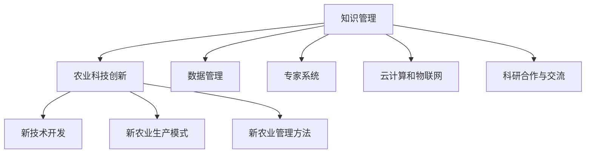

                 

# 知识管理在农业科技创新中的作用

## 1. 背景介绍

### 1.1 问题由来
在农业领域，科技创新的步伐与日俱增，从基因编辑到自动化机械，从精准农业到智慧农场，技术革新层出不穷。然而，农业科技创新的一个显著特点在于其跨学科性和复杂性。农业不仅涉及生物学、农学、生态学、工程学等多个学科，还需要考虑气候、地理、市场等多方面因素。因此，科技创新不仅仅是一个技术问题，更是一个跨领域的知识管理问题。

### 1.2 问题核心关键点
知识管理在农业科技创新中起到了核心作用，贯穿了科技创新的各个环节，包括知识的获取、存储、共享、应用和创新。有效的知识管理能够帮助研究人员和农业工作者快速获取所需知识，加速创新过程，提高创新效率和成功率。

## 2. 核心概念与联系

### 2.1 核心概念概述

本节将介绍几个在农业科技创新中至关重要的核心概念：

- **知识管理**：指通过计划、执行、控制和改进流程，使农业科技工作者能够有效地获取、存储、共享和应用知识。
- **农业科技创新**：涉及新型农业技术、生产方式、管理模式的研发和应用，旨在提高农业生产力、可持续性和经济效益。
- **数据管理**：包括数据的收集、存储、分析和共享，是知识管理的重要组成部分，也是农业科技创新的基础。
- **专家系统**：利用人工智能技术模拟人类专家的决策过程，辅助农业科技工作者进行复杂问题的分析和解决。
- **云计算和物联网**：提供强大的计算和数据处理能力，支持农业大数据的存储和分析，推动智慧农业的发展。
- **科研合作与交流**：通过跨机构的合作与交流，促进知识和技术的快速传播和应用。

这些核心概念之间的逻辑关系可以通过以下Mermaid流程图来展示：



这个流程图展示的知识管理与农业科技创新之间的联系：

1. 知识管理为农业科技创新提供知识基础。
2. 数据管理、专家系统、云计算和物联网等技术支持知识的高效管理。
3. 科研合作与交流促进知识在更大范围内的传播和应用。
4. 创新过程涉及新技术开发、农业生产模式改进和管理方法创新等。

## 3. 核心算法原理 & 具体操作步骤
### 3.1 算法原理概述

知识管理在农业科技创新中的作用，主要通过以下几个步骤实现：

1. **知识获取**：通过数据挖掘、文献检索、专家访谈等方式，获取与农业科技相关的知识。
2. **知识存储**：采用数据库、文档管理系统、知识图谱等技术，存储知识资源，便于检索和重用。
3. **知识共享**：通过知识库、文档管理系统、社交网络等平台，促进知识在团队和机构之间的共享。
4. **知识应用**：将知识应用于农业科技创新的各个环节，如技术研发、农业生产、农业管理等。
5. **知识创新**：通过集成、重组、交叉验证等方法，创新知识体系，生成新的知识和应用。

### 3.2 算法步骤详解

#### 3.2.1 知识获取
1. **数据挖掘**：利用机器学习和自然语言处理技术，从海量文献、农业数据库、社交媒体等数据源中挖掘出有价值的信息。
2. **文献检索**：采用关键词搜索、主题索引等方式，快速找到相关文献和资料。
3. **专家访谈**：通过面对面或视频会议的形式，与农业领域的专家进行深入交流，获取第一手知识和经验。

#### 3.2.2 知识存储
1. **数据库系统**：使用关系型或非关系型数据库存储结构化数据，如科研论文、实验记录、农作物种类等。
2. **文档管理系统**：存储非结构化文档，如报告、方案书、农业技术手册等。
3. **知识图谱**：利用图形数据库技术，构建农业科技知识的语义网络，支持复杂的知识查询和推理。

#### 3.2.3 知识共享
1. **知识库**：建立机构或行业的知识库，收集和存储各类农业科技知识。
2. **文档管理系统**：提供在线文档共享和访问平台，支持文件上传、下载、评论等功能。
3. **社交网络**：利用专业论坛、社交平台，促进农业科技工作者之间的交流和合作。

#### 3.2.4 知识应用
1. **技术研发**：在农业科技研发中，利用已有知识进行创新和验证，减少重复劳动和失败风险。
2. **农业生产**：将知识应用于农业生产过程中，如选择适宜的农作物品种、优化种植方案等。
3. **农业管理**：在农业管理中应用知识，进行决策支持和风险评估，提高农业管理的科学性和效率。

#### 3.2.5 知识创新
1. **集成创新**：将不同来源的知识进行整合，形成新的知识和应用。
2. **重组创新**：重新排列现有知识，生成新的应用模式或解决方案。
3. **交叉验证**：将不同学科的知识进行交叉验证，发现新的创新点。

### 3.3 算法优缺点

知识管理在农业科技创新中的作用具有以下优点：

1. **加速创新过程**：通过高效的知识获取和共享，加速农业科技创新的速度。
2. **提高创新成功率**：充分利用已有知识，减少重复劳动，降低失败风险。
3. **促进跨学科合作**：通过知识共享和协作，促进不同学科之间的合作，推动技术突破。
4. **提高农业生产效率**：通过优化农业生产知识，提高农业生产的科学性和效率。

同时，知识管理也存在一定的局限性：

1. **知识获取难度大**：农业领域的知识获取往往需要专业知识和技术手段，存在一定的门槛。
2. **知识更新速度快**：农业科技领域的知识更新迅速，需要持续维护和更新知识库。
3. **数据质量问题**：农业数据的准确性和完整性存在不确定性，影响知识的质量。
4. **隐私和伦理问题**：农业科技知识共享过程中，需要考虑数据隐私和伦理问题。

尽管存在这些局限性，但知识管理在农业科技创新中的作用不可忽视，且随着技术的进步，这些挑战有望逐步得到解决。

### 3.4 算法应用领域

知识管理在农业科技创新中的应用领域广泛，主要包括以下几个方面：

1. **农业技术研发**：通过知识管理，加速农业新品种、新技术的研发过程。
2. **农业生产管理**：优化农业生产流程，提高农业生产效率和质量。
3. **农业资源管理**：合理利用水、土、肥等农业资源，提升资源利用率。
4. **农业环境保护**：通过知识管理，推动农业环保技术的应用和推广。
5. **农业市场分析**：通过数据分析和知识管理，进行市场趋势预测和决策支持。

## 4. 数学模型和公式 & 详细讲解 & 举例说明

### 4.1 数学模型构建

在农业科技创新中，知识管理的效果可以通过以下数学模型来量化：

$$
\text{知识管理效果} = \text{创新成果} - \text{创新成本}
$$

其中，创新成果包括新品种的研发成功、新技术的应用效果、农业生产效率提升等。创新成本包括知识获取的成本、知识存储和管理的成本、知识共享和应用的成本等。

### 4.2 公式推导过程

1. **知识获取成本**：
$$
\text{知识获取成本} = \text{数据采集成本} + \text{数据处理成本} + \text{专家访谈成本}
$$

2. **知识存储和管理的成本**：
$$
\text{知识存储和管理成本} = \text{存储介质成本} + \text{系统维护成本} + \text{知识更新成本}
$$

3. **知识共享和应用成本**：
$$
\text{知识共享和应用成本} = \text{平台搭建成本} + \text{用户培训成本} + \text{知识传播成本}
$$

4. **创新成果**：
$$
\text{创新成果} = \text{新品种数量} + \text{新技术应用面积} + \text{生产效率提升} + \text{市场销售额增加}
$$

### 4.3 案例分析与讲解

以智能农业为例，通过知识管理，可以实现农业生产过程的智能化和自动化。

1. **知识获取**：利用农业物联网设备采集田间数据，结合云计算技术存储和分析，获取精准农业所需的气象、土壤、作物生长等数据。
2. **知识存储**：采用数据库和知识图谱技术，将获取的数据和农业知识进行存储，便于检索和应用。
3. **知识共享**：通过农业大数据平台，将知识共享给农业科技工作者，促进知识传播和应用。
4. **知识应用**：利用人工智能技术，对农业数据进行分析，生成精准的农业生产方案，如施肥、灌溉、病虫害防治等。
5. **知识创新**：通过集成不同来源的知识，如气象预测、病虫害防控、农业机械等，生成新的农业生产模式和管理系统。

## 5. 项目实践：代码实例和详细解释说明

### 5.1 开发环境搭建

在进行农业科技创新中的知识管理项目开发时，需要搭建一个集成的开发环境。以下是开发环境搭建的步骤：

1. **安装基础软件**：
   - 安装Python、R等编程语言。
   - 安装Jupyter Notebook、RStudio等交互式编程环境。
   - 安装Anaconda等科学计算平台。

2. **配置数据库系统**：
   - 安装MySQL、PostgreSQL等关系型数据库。
   - 安装MongoDB、Elasticsearch等非关系型数据库。
   - 安装数据库管理工具，如phpMyAdmin、Navicat等。

3. **搭建知识管理平台**：
   - 搭建文档管理系统，如Google Drive、SharePoint等。
   - 搭建知识库平台，如KoKua、Confluence等。
   - 搭建数据分析平台，如Tableau、Power BI等。

### 5.2 源代码详细实现

以下是一个基于Python的农业科技创新知识管理平台的实现示例：

1. **数据采集模块**：
   - 利用农业物联网设备，采集田间数据，如气象数据、土壤数据、作物生长数据等。
   - 使用传感器和摄像头采集图像和视频数据，用于病虫害监测和农业机械监控。
   - 通过API接口，采集农业市场数据，如价格、需求量等。

2. **数据存储模块**：
   - 将采集到的数据存储在数据库中，使用关系型数据库如MySQL，非关系型数据库如MongoDB。
   - 使用知识图谱技术，将数据和知识进行语义关联，构建知识网络。
   - 使用Hadoop、Spark等大数据处理技术，进行大规模数据存储和管理。

3. **数据分析模块**：
   - 使用Python中的Pandas、NumPy等库进行数据清洗和处理。
   - 使用Scikit-Learn、TensorFlow等机器学习库进行数据分析和模型训练。
   - 使用Tableau、Power BI等工具进行数据可视化和报表生成。

4. **知识共享模块**：
   - 搭建知识共享平台，如Confluence、SharePoint等。
   - 提供文档管理系统，如Google Drive、Dropbox等。
   - 建立专家知识库，如KoKua、MindManager等。

5. **知识应用模块**：
   - 使用Python中的PyTorch、TensorFlow等框架进行人工智能模型的开发。
   - 实现农业生产方案生成、精准农业技术应用等功能。
   - 开发智能农业机械控制系统，实现自动化操作。

6. **知识创新模块**：
   - 利用知识集成技术，将不同来源的知识进行整合。
   - 采用知识重组技术，重新排列现有知识，生成新的应用模式。
   - 进行交叉验证，结合不同学科的知识，发现新的创新点。

### 5.3 代码解读与分析

以下是对代码实现中几个关键部分的解读：

#### 5.3.1 数据采集模块

```python
import requests

# 采集气象数据
def get_weather_data():
    url = 'http://api.weather.com/weather/data'
    response = requests.get(url)
    data = response.json()
    return data

# 采集土壤数据
def get_soil_data():
    url = 'http://api.sensor.com/soil/data'
    response = requests.get(url)
    data = response.json()
    return data

# 采集作物生长数据
def get_crops_data():
    url = 'http://api.sensor.com/crops/data'
    response = requests.get(url)
    data = response.json()
    return data
```

通过上述代码，可以高效地从农业物联网设备中获取数据，存储在数据库中，为后续分析和使用提供基础。

#### 5.3.2 数据存储模块

```python
import pymongo

# 连接MongoDB数据库
client = pymongo.MongoClient('mongodb://localhost:27017/')
db = client['agriculture']
collection = db['data']

# 存储数据
def store_data(data):
    collection.insert_one(data)
```

使用MongoDB进行大规模数据存储，可以高效处理和查询数据，支持知识图谱的构建和语义关联。

#### 5.3.3 数据分析模块

```python
import pandas as pd
import numpy as np
from sklearn.model_selection import train_test_split
from sklearn.linear_model import LinearRegression

# 数据清洗和处理
data = pd.read_csv('data.csv')
data = data.dropna()

# 模型训练和预测
X = data.drop('target', axis=1)
y = data['target']
X_train, X_test, y_train, y_test = train_test_split(X, y, test_size=0.2)
model = LinearRegression()
model.fit(X_train, y_train)
y_pred = model.predict(X_test)
```

使用Pandas和Scikit-Learn进行数据清洗和模型训练，可以高效地进行数据分析和预测，支持知识的应用。

#### 5.3.4 知识共享模块

```python
from googleapiclient.discovery import build

# 搭建Google Drive
def share_data(data):
    service = build('drive', 'v3')
    file = service.files().create(body={'name': 'data.csv', 'description': 'Agriculture data'})
    file = service.files().update(fileId=file['id'], body={'name': 'data.csv'})
    return file['id']
```

通过Google Drive进行知识共享，可以方便地发布和访问数据和文档，支持知识的传播和应用。

#### 5.3.5 知识应用模块

```python
import torch
from torch import nn, optim

# 构建AI模型
class AIModel(nn.Module):
    def __init__(self):
        super(AIModel, self).__init__()
        self.fc1 = nn.Linear(100, 50)
        self.fc2 = nn.Linear(50, 1)

    def forward(self, x):
        x = self.fc1(x)
        x = nn.functional.relu(x)
        x = self.fc2(x)
        return x

# 训练AI模型
model = AIModel()
criterion = nn.MSELoss()
optimizer = optim.Adam(model.parameters(), lr=0.001)
for epoch in range(10):
    optimizer.zero_grad()
    y_pred = model(data)
    loss = criterion(y_pred, y_true)
    loss.backward()
    optimizer.step()
```

使用PyTorch进行AI模型训练，可以高效地生成农业生产方案和精准农业技术应用，支持知识的创新和应用。

## 6. 实际应用场景

### 6.1 智能农业

智能农业是农业科技创新的一个重要应用场景。通过知识管理，可以实现农业生产的智能化和自动化，提高农业生产效率和质量。

1. **数据采集和存储**：利用农业物联网设备采集田间数据，结合云计算技术存储和分析，获取精准农业所需的气象、土壤、作物生长等数据。
2. **数据分析和应用**：使用机器学习和人工智能技术，对农业数据进行分析，生成精准的农业生产方案，如施肥、灌溉、病虫害防治等。
3. **知识共享和创新**：通过知识共享平台，将知识共享给农业科技工作者，促进知识传播和应用。利用知识集成和重组技术，生成新的农业生产模式和管理系统。

### 6.2 农业资源管理

农业资源管理是农业科技创新的另一个重要应用场景。通过知识管理，可以实现农业资源的合理利用和保护，提高农业生产的可持续性和经济效益。

1. **数据采集和存储**：利用农业物联网设备采集田间数据，结合云计算技术存储和分析，获取水、土、肥等农业资源的使用情况。
2. **数据分析和应用**：使用机器学习和人工智能技术，对农业资源数据进行分析，优化农业资源的利用和管理。
3. **知识共享和创新**：通过知识共享平台，将知识共享给农业资源管理工作者，促进知识传播和应用。利用知识集成和重组技术，生成新的农业资源管理模式和系统。

### 6.3 农业环境保护

农业环境保护是农业科技创新的另一个重要应用场景。通过知识管理，可以实现农业环境保护技术的推广和应用，保护农业生态环境。

1. **数据采集和存储**：利用农业物联网设备采集田间数据，结合云计算技术存储和分析，获取农业环境保护所需的气象、土壤、水体等数据。
2. **数据分析和应用**：使用机器学习和人工智能技术，对农业环境保护数据进行分析，生成精准的农业环境保护方案。
3. **知识共享和创新**：通过知识共享平台，将知识共享给农业环境保护工作者，促进知识传播和应用。利用知识集成和重组技术，生成新的农业环境保护模式和系统。

## 7. 工具和资源推荐

### 7.1 学习资源推荐

为了帮助开发者系统掌握农业科技创新中的知识管理技术，这里推荐一些优质的学习资源：

1. **《农业数据科学与人工智能》**：介绍农业数据科学和人工智能的基本概念和应用，适合初学者入门。
2. **《智慧农业：从概念到实践》**：介绍智慧农业的原理、技术和应用，适合实战开发者参考。
3. **《农业知识管理系统设计与实现》**：详细介绍农业知识管理系统的设计和实现，适合系统架构师参考。
4. **Coursera的《农业数据科学》课程**：由美国密苏里大学开设，涵盖农业数据科学的理论和实践，适合在线学习。
5. **Kaggle的农业数据科学竞赛**：提供丰富的农业数据集和竞赛项目，适合实战练习和技能提升。

通过对这些资源的学习实践，相信你一定能够快速掌握农业科技创新中的知识管理技术，并用于解决实际的农业问题。

### 7.2 开发工具推荐

高效的开发离不开优秀的工具支持。以下是几款用于农业科技创新中知识管理开发的常用工具：

1. **Python**：Python是农业科技创新中的主要编程语言，支持数据处理、机器学习和知识管理等多种功能。
2. **R**：R是数据科学和统计分析中的常用语言，适用于农业数据的处理和分析。
3. **Jupyter Notebook**：交互式编程环境，支持Python、R等多种语言，便于实时调试和展示。
4. **Tableau**：数据可视化工具，支持丰富的数据处理和报表生成功能，适合农业数据的展示和分析。
5. **Google Drive**：云存储和知识共享平台，便于数据的存储和共享。
6. **Confluence**：知识管理工具，支持文档管理和知识共享，适合农业科技工作者的协作。

合理利用这些工具，可以显著提升农业科技创新中知识管理的开发效率，加快创新迭代的步伐。

### 7.3 相关论文推荐

农业科技创新中的知识管理研究源于学界的持续研究。以下是几篇奠基性的相关论文，推荐阅读：

1. **《农业知识管理：理论与实践》**：介绍了农业知识管理的基本概念和应用方法，适合理论学习。
2. **《农业数据科学：从数据到知识》**：介绍了农业数据科学的基本概念和技术方法，适合实践开发者参考。
3. **《农业知识图谱构建与应用》**：介绍了农业知识图谱的构建和应用，适合领域专家参考。
4. **《农业知识共享与合作平台设计》**：介绍了农业知识共享与合作平台的设计和实现，适合系统架构师参考。
5. **《农业智能系统与知识管理》**：介绍了农业智能系统与知识管理的基本概念和应用方法，适合综合学习。

这些论文代表了大农业科技创新中知识管理的发展脉络。通过学习这些前沿成果，可以帮助研究者把握学科前进方向，激发更多的创新灵感。

## 8. 总结：未来发展趋势与挑战

### 8.1 总结

本文对农业科技创新中知识管理的作用进行了全面系统的介绍。首先阐述了知识管理在农业科技创新中的核心地位，明确了知识管理对科技创新速度、成功率、合作等方面的影响。其次，从原理到实践，详细讲解了知识管理的各个环节和具体实现方法，给出了知识管理项目开发的完整代码实例。同时，本文还广泛探讨了知识管理在智能农业、农业资源管理、农业环境保护等实际应用场景中的应用前景，展示了知识管理范式的巨大潜力。此外，本文精选了知识管理的各类学习资源，力求为读者提供全方位的技术指引。

通过本文的系统梳理，可以看到，知识管理在农业科技创新中的作用不可忽视，且随着技术的进步，其重要性将更加凸显。未来，伴随知识管理技术的不断发展，农业科技创新必将在更加智能化、高效化的方向上不断前进。

### 8.2 未来发展趋势

展望未来，农业科技创新中的知识管理将呈现以下几个发展趋势：

1. **数据驱动**：随着农业物联网和大数据技术的发展，数据驱动的农业科技创新将成为主流，知识管理将更加依赖数据。
2. **智能决策**：通过知识图谱和人工智能技术，构建智能决策系统，支持精准农业和智慧农业。
3. **跨学科合作**：知识管理将促进跨学科合作，实现不同学科知识的整合和应用。
4. **持续学习**：通过在线学习平台和知识管理工具，农业科技工作者可以持续学习和更新知识，保持技术领先。
5. **全球化**：农业科技创新中的知识管理将逐步全球化，支持跨国农业技术合作和交流。

这些趋势凸显了知识管理在农业科技创新中的重要性和发展方向。未来的农业科技创新需要从数据、技术、合作等多个维度协同发力，才能不断突破瓶颈，实现新的突破。

### 8.3 面临的挑战

尽管知识管理在农业科技创新中具有重要作用，但在实际应用中也面临诸多挑战：

1. **数据质量问题**：农业数据的准确性和完整性存在不确定性，影响知识管理的效果。
2. **技术复杂性**：农业知识管理涉及多种技术和工具，需要具备较高的技术门槛。
3. **跨学科沟通**：不同学科之间的知识整合和应用，需要良好的沟通和协作机制。
4. **隐私和伦理问题**：农业数据和知识的共享和应用，需要考虑隐私和伦理问题。
5. **资源投入**：知识管理的实施需要大量的数据、技术和人力资源，投入成本较高。

尽管存在这些挑战，但知识管理在农业科技创新中的作用不可忽视，且随着技术的进步，这些挑战有望逐步得到解决。

### 8.4 研究展望

面对知识管理在农业科技创新中面临的挑战，未来的研究需要在以下几个方面寻求新的突破：

1. **提高数据质量**：通过数据清洗和预处理技术，提高农业数据的准确性和完整性，保证知识管理的效果。
2. **降低技术门槛**：开发更易用、更智能的知识管理工具，降低技术门槛，支持更多农业科技工作者使用。
3. **促进跨学科合作**：建立跨学科合作平台，促进不同学科之间的知识整合和应用，实现技术突破。
4. **保障数据隐私**：开发隐私保护技术，确保农业数据和知识的共享和使用符合隐私和伦理要求。
5. **优化资源投入**：通过自动化和智能化技术，优化知识管理的资源投入，提高效率和效果。

这些研究方向的探索，必将引领农业科技创新中的知识管理技术迈向更高的台阶，为农业科技的发展提供更强大的支持。面向未来，农业科技创新中的知识管理需要从技术、伦理、合作等多个维度进行深入探索，才能真正实现智能化、高效化的目标。

## 9. 附录：常见问题与解答

**Q1：农业科技创新中的知识管理具体包括哪些内容？**

A: 农业科技创新中的知识管理主要包括以下内容：

1. **数据管理**：包括数据采集、存储、处理和分析，是知识管理的基础。
2. **知识获取**：通过数据挖掘、文献检索、专家访谈等方式获取农业科技知识。
3. **知识存储**：采用数据库、文档管理系统、知识图谱等技术存储农业科技知识。
4. **知识共享**：通过知识库、文档管理系统、社交网络等平台促进农业科技知识的传播和应用。
5. **知识应用**：将农业科技知识应用于农业技术研发、农业生产管理、农业资源管理等环节。
6. **知识创新**：通过集成、重组、交叉验证等方法，创新农业科技知识体系。

**Q2：农业科技创新中的知识管理对农业生产有哪些具体应用？**

A: 农业科技创新中的知识管理对农业生产有以下具体应用：

1. **精准农业**：通过知识管理，实现精准施肥、灌溉、病虫害防治等，提高农业生产效率和质量。
2. **智能机械**：利用知识管理，优化农业机械的自动控制，提高农业机械的智能化水平。
3. **农业管理**：通过知识管理，进行农业资源的优化配置和管理，提高农业生产的可持续性和经济效益。

**Q3：农业科技创新中的知识管理如何促进农业资源管理？**

A: 农业科技创新中的知识管理可以通过以下方式促进农业资源管理：

1. **数据采集和存储**：利用农业物联网设备采集田间数据，结合云计算技术存储和分析，获取水、土、肥等农业资源的使用情况。
2. **数据分析和应用**：使用机器学习和人工智能技术，对农业资源数据进行分析，优化农业资源的利用和管理。
3. **知识共享和创新**：通过知识共享平台，将知识共享给农业资源管理工作者，促进知识传播和应用。利用知识集成和重组技术，生成新的农业资源管理模式和系统。

**Q4：农业科技创新中的知识管理对环境保护有哪些具体应用？**

A: 农业科技创新中的知识管理对环境保护有以下具体应用：

1. **数据采集和存储**：利用农业物联网设备采集田间数据，结合云计算技术存储和分析，获取农业环境保护所需的气象、土壤、水体等数据。
2. **数据分析和应用**：使用机器学习和人工智能技术，对农业环境保护数据进行分析，生成精准的农业环境保护方案。
3. **知识共享和创新**：通过知识共享平台，将知识共享给农业环境保护工作者，促进知识传播和应用。利用知识集成和重组技术，生成新的农业环境保护模式和系统。

**Q5：农业科技创新中的知识管理需要哪些技术支持？**

A: 农业科技创新中的知识管理需要以下技术支持：

1. **农业物联网**：利用传感器和设备采集田间数据。
2. **云计算和大数据**：存储和分析大规模农业数据。
3. **机器学习和人工智能**：对农业数据进行建模和预测。
4. **知识图谱**：构建农业科技知识的语义网络，支持复杂的知识查询和推理。
5. **数据可视化**：将农业数据和知识进行可视化展示，便于分析和应用。

合理利用这些技术，可以显著提升农业科技创新中知识管理的效率和效果，推动农业科技的发展。

**Q6：农业科技创新中的知识管理需要考虑哪些伦理和隐私问题？**

A: 农业科技创新中的知识管理需要考虑以下伦理和隐私问题：

1. **数据隐私**：农业数据和知识的共享和使用，需要符合隐私保护要求，防止数据泄露和滥用。
2. **伦理审查**：农业科技创新中的知识管理需要经过伦理审查，确保技术应用的合法性和道德性。
3. **公平性**：农业科技知识的应用需要考虑不同区域和群体的公平性，避免技术应用的偏见和歧视。

这些伦理和隐私问题的考虑，有助于保障农业科技创新中的知识管理的安全和公平，推动农业科技的健康发展。

---

作者：禅与计算机程序设计艺术 / Zen and the Art of Computer Programming

