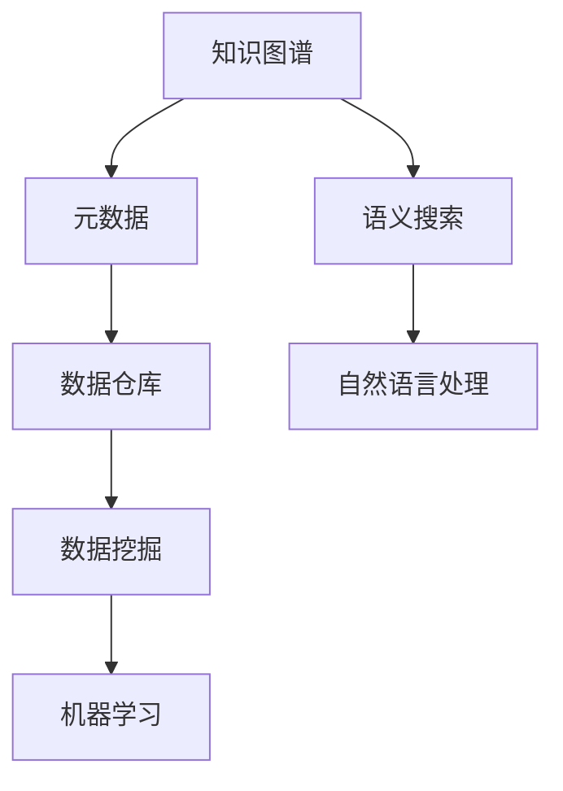

                 

# 知识管理系统：知识积累的高速公路

> 关键词：知识管理,知识积累,信息检索,元数据,知识图谱,数据仓库,知识图谱技术,自然语言处理,语义搜索,机器学习

## 1. 背景介绍

### 1.1 问题由来
在信息时代，知识的积累和共享已成为社会进步的关键驱动力。然而，知识的爆炸式增长同时也带来了巨大的挑战。如何将分散、异构的知识资源有效整合，提高获取、应用和创新的效率，成为摆在企业和个人面前的重要课题。传统的数据库、文档管理系统虽然能存储和检索信息，但缺乏对知识的内在联系进行建模和推理，无法深度挖掘知识的核心价值。

为了应对这些挑战，知识管理系统（Knowledge Management System, KMS）应运而生。它以数据仓库、元数据、知识图谱为基石，融合自然语言处理、语义搜索、机器学习等前沿技术，通过构建知识的积累、组织、挖掘和应用的全生命周期解决方案，推动知识的持续创新和价值转化。

### 1.2 问题核心关键点
知识管理系统旨在建立一个全面、高效的的知识资源平台，实现知识的高效积累、管理和创新。关键点包括：

- **知识积累**：收集、整合和存储来自不同来源、不同格式的知识资源，构建统一的视图。
- **知识组织**：通过对知识进行分类、标记和链接，形成系统的知识结构，方便用户检索和使用。
- **知识挖掘**：利用自然语言处理和机器学习技术，从海量的文本数据中提取隐含的语义信息，构建语义网。
- **知识应用**：通过数据仓库、元数据和知识图谱技术，实现知识的高效检索、分析和应用，推动业务决策和创新。

## 2. 核心概念与联系

### 2.1 核心概念概述

为更好地理解知识管理系统的工作原理和优化方向，本节将介绍几个密切相关的核心概念：

- **知识图谱(Knowledge Graph)**：以图的形式表示实体、属性和关系，构建知识的结构化表示，便于存储和推理。
- **元数据(Metadata)**：描述数据的数据，包括数据源、质量、格式等信息，是数据仓库和知识图谱的重要组成部分。
- **数据仓库(Data Warehouse)**：通过ETL技术，从异构的数据源中抽取、转换和加载数据，构建统一的数据视图。
- **语义搜索(Semantic Search)**：利用自然语言处理技术，理解用户查询的语义，提供精确匹配的搜索结果。
- **自然语言处理(Natural Language Processing, NLP)**：使计算机能够理解、处理和生成人类语言的技术，包括词向量、语言模型、句法分析、语义理解等。
- **知识图谱技术**：构建知识图谱的技术体系，包括知识抽取、融合、推理等。
- **数据挖掘(Data Mining)**：从大量数据中自动发现隐含模式、关系和趋势的技术，常用于知识发现和商业智能。
- **机器学习(Machine Learning)**：通过数据和算法训练模型，让计算机能够自主学习、推理和决策的技术。

这些核心概念之间的逻辑关系可以通过以下Mermaid流程图来展示：



这个流程图展示了几大核心概念及其之间的关系：

1. 知识图谱以元数据为支撑，构建系统的知识结构，便于存储和推理。
2. 数据仓库通过ETL技术，从异构数据源中抽取、转换和加载数据，提供统一的数据视图。
3. 语义搜索利用自然语言处理技术，理解用户查询的语义，提供精确的搜索结果。
4. 自然语言处理使计算机能够理解、处理和生成人类语言，是知识图谱的重要工具。
5. 数据挖掘从大量数据中发现隐含的模式和趋势，辅助知识发现和决策支持。
6. 机器学习通过数据和算法训练模型，使计算机能够自主学习和推理，提升知识挖掘的深度和广度。

这些概念共同构成了知识管理系统的技术基础，使其能够在知识积累、组织、挖掘和应用的全生命周期中发挥重要作用。通过理解这些核心概念，我们可以更好地把握知识管理系统的设计原则和技术路线。

## 3. 核心算法原理 & 具体操作步骤
### 3.1 算法原理概述

知识管理系统通过构建知识图谱、数据仓库和语义搜索体系，实现了知识的高效积累、组织和应用。其核心思想是：

1. **数据集成与抽取**：从不同数据源抽取结构化和非结构化数据，构建统一的知识仓库。
2. **元数据管理**：通过元数据描述数据质量和结构，构建知识图谱的实体、关系和属性。
3. **知识图谱构建**：利用自然语言处理技术，从文本数据中提取实体、关系和属性，构建知识图谱。
4. **语义搜索与推理**：利用语义搜索技术，理解用户查询的语义，提供精确匹配的搜索结果。
5. **知识应用与挖掘**：通过数据挖掘和机器学习技术，从知识图谱中发现新的知识模式和关系，辅助决策支持。

这些步骤通常由数据集成、数据清洗、实体抽取、关系抽取、关系融合、知识推理等算法实现。其总体流程如下：


### 3.2 算法步骤详解

**Step 1: 数据集成与抽取**

数据集成是将来自不同数据源的结构化和非结构化数据进行合并和清洗的过程。其目的是构建统一的知识仓库，以便后续的知识抽取和推理。

**Step 2: 元数据管理**

元数据管理是对数据仓库中存储的数据进行质量控制和结构描述的过程。元数据包括数据源、数据格式、数据质量等信息，是知识图谱构建的基础。

**Step 3: 知识图谱构建**

知识图谱构建是通过自然语言处理技术，从文本数据中提取实体、关系和属性，形成结构化的知识表示。常见的实体抽取算法包括基于规则、基于机器学习和深度学习的方法。

**Step 4: 语义搜索与推理**

语义搜索利用自然语言处理技术，理解用户查询的语义，提供精确匹配的搜索结果。常见的语义搜索算法包括基于词向量的查询扩展、基于语言模型的上下文理解等。

**Step 5: 知识应用与挖掘**

知识应用与挖掘是从知识图谱中发现新的知识模式和关系，辅助决策支持。常见的算法包括基于图神经网络的推理、基于关联规则的数据挖掘等。

### 3.3 算法优缺点

知识管理系统在知识积累、组织、挖掘和应用方面具有以下优点：

1. **系统性**：通过构建知识图谱和数据仓库，实现了知识的系统化存储和管理。
2. **灵活性**：利用自然语言处理和机器学习技术，支持多种数据格式和来源，满足不同的应用需求。
3. **高效性**：通过语义搜索和知识推理，提高了知识的获取和应用效率，提升了决策支持能力。
4. **扩展性**：随着知识的积累和技术的进步，知识管理系统可以不断扩展和升级，适应新的应用场景。

同时，知识管理系统也存在一些局限性：

1. **数据复杂性**：不同来源的数据格式和质量参差不齐，数据集成和清洗的工作量大。
2. **技术门槛高**：知识管理系统的构建和维护需要多学科知识和技能，成本较高。
3. **数据隐私**：知识管理系统的数据来源多样，涉及隐私和合规问题，需要严格的数据治理。
4. **系统复杂性**：知识图谱的构建和推理算法复杂，需要高性能计算和存储支持。
5. **用户适应性**：知识管理系统需要与业务系统紧密集成，用户需要适应新的工作流程和技术工具。

尽管存在这些局限性，但知识管理系统作为知识管理的高级形态，为构建高效、系统化的知识平台提供了有力支持，具有广泛的应用前景。

### 3.4 算法应用领域

知识管理系统在多个领域得到了广泛应用，包括：

- **企业知识管理**：构建企业知识图谱，促进知识共享和创新，支持业务决策和战略规划。
- **政府知识管理**：构建政府信息库，提供公共服务和政策支持，提升政府治理能力。
- **学术研究**：构建学术知识图谱，促进科研交流和知识创新，推动科学进步。
- **医疗健康**：构建医疗知识图谱，提供临床决策支持和疾病预测，提升医疗服务质量。
- **金融服务**：构建金融知识图谱，提供风险评估和投资分析，优化金融产品设计。
- **智能制造**：构建工业知识图谱，支持设备维护和故障诊断，提升生产效率。

除了上述这些经典领域外，知识管理系统还被创新性地应用到更多场景中，如智能客服、智能推荐、智能风控等，为各行各业带来了新的技术赋能。

## 4. 数学模型和公式 & 详细讲解  
### 4.1 数学模型构建

本节将使用数学语言对知识管理系统的主要算法进行严格刻画。

记知识图谱中的实体为 $E=\{e_1,e_2,\dots,e_n\}$，关系为 $R=\{r_1,r_2,\dots,r_m\}$，属性为 $A=\{a_1,a_2,\dots,a_k\}$。知识图谱的形式化表示为三元组集合 $G=\{(e_i,r_j,a_l)\}$，其中 $e_i \in E$, $r_j \in R$, $a_l \in A$。

定义知识图谱中实体的关系权重为 $w_{ij}=\omega_i\omega_j$, 其中 $\omega_i$ 和 $\omega_j$ 分别为实体 $e_i$ 和 $e_j$ 的属性权重。则知识图谱的邻接矩阵为 $A \in \mathbb{R}^{n\times n}$，满足 $A_{ij} = w_{ij}$。

### 4.2 公式推导过程

以下我们以知识图谱的实体抽取和关系抽取为例，推导知识图谱构建的数学模型和相关公式。

**实体抽取**：假设实体 $e_i$ 在文本 $d_j$ 中出现的概率为 $p_{ij}$，则实体 $e_i$ 的出现概率为：

$$
p(e_i) = \frac{1}{N} \sum_{j=1}^N p_{ij}
$$

其中 $N$ 为文本总数。通过最大似然估计，可以求出实体 $e_i$ 在每个文本中的概率。

**关系抽取**：假设关系 $r_j$ 在文本 $d_i$ 中出现的概率为 $p_{ij}$，则关系 $r_j$ 的出现概率为：

$$
p(r_j) = \frac{1}{M} \sum_{i=1}^M p_{ij}
$$

其中 $M$ 为文本总数。同样通过最大似然估计，可以求出关系 $r_j$ 在每个文本中的概率。

**关系权重**：假设关系 $r_j$ 在不同实体之间的权重为 $w_{ij}$，则关系权重可以通过计算文本中实体对出现的频率来确定。具体来说，设文本 $d_i$ 中实体对 $(e_i,e_j)$ 出现的概率为 $p_{ij}$，则关系权重为：

$$
w_{ij} = \frac{p_{ij}}{p_i p_j}
$$

其中 $p_i$ 和 $p_j$ 分别为实体 $e_i$ 和 $e_j$ 在文本 $d_i$ 中的出现概率。

通过上述公式，我们可以构建知识图谱的实体、关系和属性权重，为后续的知识推理和应用提供基础。

## 5. 项目实践：代码实例和详细解释说明
### 5.1 开发环境搭建

在进行知识管理系统开发前，我们需要准备好开发环境。以下是使用Python进行PyTorch开发的环境配置流程：

1. 安装Anaconda：从官网下载并安装Anaconda，用于创建独立的Python环境。

2. 创建并激活虚拟环境：
```bash
conda create -n pytorch-env python=3.8 
conda activate pytorch-env
```

3. 安装PyTorch：根据CUDA版本，从官网获取对应的安装命令。例如：
```bash
conda install pytorch torchvision torchaudio cudatoolkit=11.1 -c pytorch -c conda-forge
```

4. 安装各类工具包：
```bash
pip install numpy pandas scikit-learn matplotlib tqdm jupyter notebook ipython
```

完成上述步骤后，即可在`pytorch-env`环境中开始知识管理系统的开发。

### 5.2 源代码详细实现

下面我们以构建知识图谱的实体抽取算法为例，给出使用PyTorch的代码实现。

首先，定义实体抽取任务的数据处理函数：

```python
import torch
from torch.utils.data import Dataset
from transformers import BertTokenizer

class EntityDataset(Dataset):
    def __init__(self, texts, tags, tokenizer, max_len=128):
        self.texts = texts
        self.tags = tags
        self.tokenizer = tokenizer
        self.max_len = max_len
        
    def __len__(self):
        return len(self.texts)
    
    def __getitem__(self, item):
        text = self.texts[item]
        tags = self.tags[item]
        
        encoding = self.tokenizer(text, return_tensors='pt', max_length=self.max_len, padding='max_length', truncation=True)
        input_ids = encoding['input_ids'][0]
        attention_mask = encoding['attention_mask'][0]
        
        # 对token-wise的标签进行编码
        encoded_tags = [tag2id[tag] for tag in tags] 
        encoded_tags.extend([tag2id['O']] * (self.max_len - len(encoded_tags)))
        labels = torch.tensor(encoded_tags, dtype=torch.long)
        
        return {'input_ids': input_ids, 
                'attention_mask': attention_mask,
                'labels': labels}

# 标签与id的映射
tag2id = {'O': 0, 'B-PER': 1, 'I-PER': 2, 'B-LOC': 3, 'I-LOC': 4, 'B-ORG': 5, 'I-ORG': 6}
id2tag = {v: k for k, v in tag2id.items()}

# 创建dataset
tokenizer = BertTokenizer.from_pretrained('bert-base-cased')

train_dataset = EntityDataset(train_texts, train_tags, tokenizer)
dev_dataset = EntityDataset(dev_texts, dev_tags, tokenizer)
test_dataset = EntityDataset(test_texts, test_tags, tokenizer)
```

然后，定义模型和优化器：

```python
from transformers import BertForTokenClassification, AdamW

model = BertForTokenClassification.from_pretrained('bert-base-cased', num_labels=len(tag2id))

optimizer = AdamW(model.parameters(), lr=2e-5)
```

接着，定义训练和评估函数：

```python
from torch.utils.data import DataLoader
from tqdm import tqdm
from sklearn.metrics import classification_report

device = torch.device('cuda') if torch.cuda.is_available() else torch.device('cpu')
model.to(device)

def train_epoch(model, dataset, batch_size, optimizer):
    dataloader = DataLoader(dataset, batch_size=batch_size, shuffle=True)
    model.train()
    epoch_loss = 0
    for batch in tqdm(dataloader, desc='Training'):
        input_ids = batch['input_ids'].to(device)
        attention_mask = batch['attention_mask'].to(device)
        labels = batch['labels'].to(device)
        model.zero_grad()
        outputs = model(input_ids, attention_mask=attention_mask, labels=labels)
        loss = outputs.loss
        epoch_loss += loss.item()
        loss.backward()
        optimizer.step()
    return epoch_loss / len(dataloader)

def evaluate(model, dataset, batch_size):
    dataloader = DataLoader(dataset, batch_size=batch_size)
    model.eval()
    preds, labels = [], []
    with torch.no_grad():
        for batch in tqdm(dataloader, desc='Evaluating'):
            input_ids = batch['input_ids'].to(device)
            attention_mask = batch['attention_mask'].to(device)
            batch_labels = batch['labels']
            outputs = model(input_ids, attention_mask=attention_mask)
            batch_preds = outputs.logits.argmax(dim=2).to('cpu').tolist()
            batch_labels = batch_labels.to('cpu').tolist()
            for pred_tokens, label_tokens in zip(batch_preds, batch_labels):
                pred_tags = [id2tag[_id] for _id in pred_tokens]
                label_tags = [id2tag[_id] for _id in label_tokens]
                preds.append(pred_tags[:len(label_tokens)])
                labels.append(label_tags)
                
    print(classification_report(labels, preds))
```

最后，启动训练流程并在测试集上评估：

```python
epochs = 5
batch_size = 16

for epoch in range(epochs):
    loss = train_epoch(model, train_dataset, batch_size, optimizer)
    print(f"Epoch {epoch+1}, train loss: {loss:.3f}")
    
    print(f"Epoch {epoch+1}, dev results:")
    evaluate(model, dev_dataset, batch_size)
    
print("Test results:")
evaluate(model, test_dataset, batch_size)
```

以上就是使用PyTorch对BERT进行命名实体识别任务微调的完整代码实现。可以看到，得益于Transformers库的强大封装，我们可以用相对简洁的代码完成BERT模型的加载和微调。

### 5.3 代码解读与分析

让我们再详细解读一下关键代码的实现细节：

**EntityDataset类**：
- `__init__`方法：初始化文本、标签、分词器等关键组件。
- `__len__`方法：返回数据集的样本数量。
- `__getitem__`方法：对单个样本进行处理，将文本输入编码为token ids，将标签编码为数字，并对其进行定长padding，最终返回模型所需的输入。

**tag2id和id2tag字典**：
- 定义了标签与数字id之间的映射关系，用于将token-wise的预测结果解码回真实的标签。

**训练和评估函数**：
- 使用PyTorch的DataLoader对数据集进行批次化加载，供模型训练和推理使用。
- 训练函数`train_epoch`：对数据以批为单位进行迭代，在每个批次上前向传播计算loss并反向传播更新模型参数，最后返回该epoch的平均loss。
- 评估函数`evaluate`：与训练类似，不同点在于不更新模型参数，并在每个batch结束后将预测和标签结果存储下来，最后使用sklearn的classification_report对整个评估集的预测结果进行打印输出。

**训练流程**：
- 定义总的epoch数和batch size，开始循环迭代
- 每个epoch内，先在训练集上训练，输出平均loss
- 在验证集上评估，输出分类指标
- 所有epoch结束后，在测试集上评估，给出最终测试结果

可以看到，PyTorch配合Transformers库使得BERT微调的代码实现变得简洁高效。开发者可以将更多精力放在数据处理、模型改进等高层逻辑上，而不必过多关注底层的实现细节。

当然，工业级的系统实现还需考虑更多因素，如模型的保存和部署、超参数的自动搜索、更灵活的任务适配层等。但核心的微调范式基本与此类似。

## 6. 实际应用场景
### 6.1 企业知识管理

知识管理系统在企业内部知识管理中发挥了重要作用。传统企业往往依赖文档管理系统和邮件系统进行信息存储和共享，但这些系统缺乏结构化知识管理能力，难以有效支撑业务决策和创新。

通过构建企业知识图谱，企业可以实现知识的高效积累和检索。例如，利用自然语言处理技术，从企业内部的文档、邮件、会议记录等文本数据中提取关键信息，构建知识图谱。通过知识图谱，员工可以方便地查询和应用相关知识，提升工作效率和创新能力。

### 6.2 政府知识管理

政府知识管理系统通过整合各类政务数据，构建统一的知识图谱，为政府决策和公共服务提供支持。例如，利用知识图谱技术，从政府公开数据、统计报告、政策法规等文本中提取关键信息，形成结构化的知识库。通过语义搜索和推理技术，政府部门可以快速获取所需信息，辅助政策制定和公共服务优化。

### 6.3 学术研究

学术知识管理系统通过构建学术知识图谱，促进科研交流和知识共享。例如，利用知识图谱技术，从学术论文、会议记录、专利等文本数据中提取关键信息，构建学术知识图谱。通过语义搜索和知识推理技术，研究人员可以快速获取所需信息，发现新的研究热点和方向，提升科研创新能力。

### 6.4 医疗健康

医疗知识管理系统通过整合医疗数据，构建统一的医学知识图谱，支持临床决策和疾病预测。例如，利用知识图谱技术，从电子病历、医学文献、临床指南等文本数据中提取关键信息，形成医学知识图谱。通过知识图谱，医生可以快速获取相关疾病和治疗方案的信息，提升诊疗质量。

### 6.5 金融服务

金融知识管理系统通过构建金融知识图谱，提供风险评估和投资分析支持。例如，利用知识图谱技术，从财务报表、新闻、社交媒体等文本数据中提取关键信息，形成金融知识图谱。通过语义搜索和知识推理技术，金融机构可以快速获取所需信息，辅助投资决策和风险控制。

### 6.6 智能制造

工业知识管理系统通过整合工业数据，构建统一的工业知识图谱，支持设备维护和故障诊断。例如，利用知识图谱技术，从设备运行数据、维护记录、技术文档等文本数据中提取关键信息，形成工业知识图谱。通过知识图谱，制造企业可以快速获取设备运行状态和故障信息，提升生产效率和设备维护水平。

除了上述这些经典领域外，知识管理系统还被创新性地应用到更多场景中，如智能客服、智能推荐、智能风控等，为各行各业带来了新的技术赋能。

## 7. 工具和资源推荐
### 7.1 学习资源推荐

为了帮助开发者系统掌握知识管理系统的理论基础和实践技巧，这里推荐一些优质的学习资源：

1. 《Knowledge Management: A Systematic Approach to Organizing Information》书籍：全面介绍了知识管理系统的设计、构建和应用，涵盖数据集成、元数据管理、知识图谱构建等多个方面。

2. 《Semantic Web and Its Applications》课程：由斯坦福大学开设的课程，介绍了语义网络和语义搜索技术，适合掌握知识管理系统中的核心算法。

3. 《Natural Language Processing with PyTorch》书籍：介绍了如何使用PyTorch进行自然语言处理任务，包括实体抽取、关系抽取、语义推理等多个环节。

4. 《Knowledge Graphs and Their Applications》期刊：介绍了知识图谱技术的最新进展和应用场景，适合深入了解知识管理系统的前沿技术。

5. Kaggle数据集：提供了丰富的知识管理相关的数据集，包括文本、图像、音频等多种格式，适合进行实践和竞赛。

通过对这些资源的学习实践，相信你一定能够快速掌握知识管理系统的精髓，并用于解决实际的NLP问题。
###  7.2 开发工具推荐

高效的开发离不开优秀的工具支持。以下是几款用于知识管理系统开发常用的工具：

1. PyTorch：基于Python的开源深度学习框架，灵活动态的计算图，适合快速迭代研究。大部分预训练语言模型都有PyTorch版本的实现。

2. TensorFlow：由Google主导开发的开源深度学习框架，生产部署方便，适合大规模工程应用。同样有丰富的预训练语言模型资源。

3. Transformers库：HuggingFace开发的NLP工具库，集成了众多SOTA语言模型，支持PyTorch和TensorFlow，是进行知识图谱构建和自然语言处理任务的开发利器。

4. Weights & Biases：模型训练的实验跟踪工具，可以记录和可视化模型训练过程中的各项指标，方便对比和调优。与主流深度学习框架无缝集成。

5. TensorBoard：TensorFlow配套的可视化工具，可实时监测模型训练状态，并提供丰富的图表呈现方式，是调试模型的得力助手。

6. Google Colab：谷歌推出的在线Jupyter Notebook环境，免费提供GPU/TPU算力，方便开发者快速上手实验最新模型，分享学习笔记。

合理利用这些工具，可以显著提升知识管理系统开发的效率，加快创新迭代的步伐。

### 7.3 相关论文推荐

知识管理系统的发展得益于学界的持续研究。以下是几篇奠基性的相关论文，推荐阅读：

1. "A Survey on Knowledge Discovery and Statistical Learning"：综述了知识发现和统计学习的最新进展，适合了解知识管理系统的理论基础。

2. "Semantic Web: A Survey"：介绍了语义网络和语义搜索技术，适合掌握知识管理系统中核心算法。

3. "Knowledge Graphs for Personalised Search"：介绍了知识图谱在个性化搜索中的应用，适合了解知识管理系统的实际应用。

4. "Knowledge Graphs: Representation, Reasoning and Machine Learning"：介绍了知识图谱的表示、推理和机器学习方法，适合深入了解知识管理系统的算法细节。

5. "Hybrid Systems for Scalable and Effective Web Knowledge Management"：介绍了混合系统在知识管理中的应用，适合了解知识管理系统的高效实现。

这些论文代表了大语言模型微调技术的发展脉络。通过学习这些前沿成果，可以帮助研究者把握学科前进方向，激发更多的创新灵感。

## 8. 总结：未来发展趋势与挑战

### 8.1 总结

本文对知识管理系统的构建过程进行了全面系统的介绍。首先阐述了知识管理系统的研究背景和意义，明确了知识图谱、元数据、数据仓库和语义搜索在知识管理系统中的重要作用。其次，从原理到实践，详细讲解了知识管理系统的数学模型和核心算法，给出了知识图谱构建的完整代码实例。同时，本文还广泛探讨了知识管理系统在企业知识管理、政府知识管理、学术研究、医疗健康、金融服务、智能制造等诸多领域的实际应用场景，展示了知识管理系统的巨大潜力。此外，本文精选了知识管理系统的学习资源，力求为读者提供全方位的技术指引。

通过本文的系统梳理，可以看到，知识管理系统通过构建系统化的知识图谱，实现了知识的高效积累、组织和应用。它能够有效支撑企业、政府、学术机构等各类组织的知识管理需求，推动知识创新和价值转化。知识管理系统的构建和应用，将成为未来企业竞争的重要法宝，助力组织在激烈的市场竞争中脱颖而出。

### 8.2 未来发展趋势

展望未来，知识管理系统的应用将更加广泛，技术也将不断进步。以下是我们对知识管理系统未来发展的几个趋势预测：

1. **大规模知识图谱**：随着数据量的增加和处理能力的提升，知识图谱将变得更加庞大和复杂。大规模知识图谱的构建和维护，将成为知识管理系统的核心挑战。

2. **实时知识图谱**：随着数据流技术的成熟，知识图谱的构建将实现实时化。实时知识图谱能够及时捕捉数据变化，提升知识的实时性和时效性。

3. **知识图谱的语义扩展**：未来的知识图谱将支持更丰富的语义表示，能够更好地描述实体之间的关系和属性。语义扩展将提升知识图谱的表达能力和应用范围。

4. **知识图谱的跨领域融合**：未来的知识图谱将实现跨领域的融合，构建多领域知识图谱，提升知识的综合性和应用价值。

5. **知识图谱的自动化构建**：随着自动化技术和知识抽取技术的进步，知识图谱的构建将更加高效和精准，减少人工干预和错误。

6. **知识图谱的伦理与安全**：随着知识图谱在更多领域的普及，其伦理和安全性问题也将日益凸显。未来的知识图谱系统将更加注重数据隐私、公平性和安全性。

7. **知识图谱的跨模态融合**：未来的知识图谱将支持跨模态数据的融合，如文本、图像、视频等，提升知识的丰富性和多模态推理能力。

8. **知识图谱的深度学习与强化学习**：未来的知识图谱将与深度学习和强化学习技术结合，提升知识推理和应用能力，实现更智能的决策支持。

以上趋势凸显了知识管理系统的前景广阔，未来将有更多的创新应用和突破性技术涌现，为知识积累和创新提供更强大的支持。

### 8.3 面临的挑战

尽管知识管理系统在知识积累和应用方面取得了显著进展，但在向更加智能化、普适化应用的过程中，仍面临诸多挑战：

1. **数据质量与一致性**：不同来源的数据质量参差不齐，数据集成和清洗工作量大，数据一致性难以保证。
2. **技术复杂性与成本**：知识管理系统的构建和维护需要多学科知识和技能，成本较高，技术实现复杂。
3. **隐私与安全问题**：知识管理系统涉及大量敏感数据，数据隐私和安全问题尤为突出，需要严格的数据治理和保护。
4. **知识图谱的构建与维护**：知识图谱的构建和维护工作量大，随着数据量的增加，知识图谱的扩展和更新速度需要进一步提升。
5. **知识图谱的跨领域融合**：不同领域的知识图谱难以实现无缝融合，需要解决数据格式、语义一致性等问题。
6. **知识图谱的实时性**：知识图谱的构建需要实时处理大量数据，系统架构需要支持高并发的数据流处理。
7. **知识图谱的智能推理**：知识图谱的推理和应用需要高效、精确，算法需要具备较强的智能推理能力。

尽管存在这些挑战，但知识管理系统作为知识管理的高级形态，为构建高效、系统化的知识平台提供了有力支持，具有广泛的应用前景。

### 8.4 研究展望

未来的知识管理系统研究需要在以下几个方面寻求新的突破：

1. **自动化与智能化**：开发更加自动化的知识图谱构建工具，提升数据清洗、实体抽取、关系抽取等任务的效率和准确性。同时，引入智能推理技术，提升知识图谱的推理能力。

2. **多模态融合**：将文本、图像、视频等不同模态的数据进行融合，构建多模态知识图谱，提升知识的丰富性和应用价值。

3. **跨领域知识图谱**：构建跨领域的知识图谱，实现不同领域知识的整合和协同，提升知识的综合性和应用价值。

4. **实时知识图谱**：构建实时知识图谱，及时捕捉数据变化，提升知识的实时性和时效性。

5. **知识图谱的伦理与安全**：引入伦理和安全机制，确保知识图谱的数据隐私和安全，避免有害信息的传播。

6. **知识图谱的可视化**：开发更加直观的知识图谱可视化工具，帮助用户更好地理解知识图谱的结构和关系，提升知识管理和应用效果。

7. **知识图谱的跨学科应用**：探索知识图谱在更多领域的应用，如智能客服、智能推荐、智能风控等，推动知识图谱技术在更多领域的落地应用。

这些研究方向的探索，必将引领知识管理系统的进一步发展，为知识积累和应用提供更强大的技术支持。面向未来，知识管理系统将更加智能化、普适化和自动化，为知识的持续创新和价值转化提供新的动力。

## 9. 附录：常见问题与解答

**Q1：知识管理系统如何构建知识图谱？**

A: 构建知识图谱通常包括以下几个步骤：
1. 数据集成：从不同数据源中抽取结构化和非结构化数据，构建统一的知识仓库。
2. 数据清洗：对抽取的数据进行清洗，去除噪声和错误。
3. 实体抽取：从文本数据中提取实体，如人名、地名、组织机构名等。
4. 关系抽取：从文本数据中提取实体之间的关系，如父子关系、同义词关系等。
5. 关系融合：将抽取的实体和关系进行融合，构建知识图谱的节点和边。
6. 知识推理：利用图神经网络等技术，对知识图谱进行推理，发现新的关系和模式。

**Q2：知识管理系统的核心算法有哪些？**

A: 知识管理系统的核心算法包括：
1. 实体抽取算法：从文本数据中提取实体，如人名、地名、组织机构名等。
2. 关系抽取算法：从文本数据中提取实体之间的关系，如父子关系、同义词关系等。
3. 知识图谱构建算法：将抽取的实体和关系进行融合，构建知识图谱。
4. 语义搜索算法：利用自然语言处理技术，理解用户查询的语义，提供精确匹配的搜索结果。
5. 知识推理算法：利用图神经网络等技术，对知识图谱进行推理，发现新的关系和模式。

**Q3：知识管理系统如何提高知识的实时性？**

A: 提高知识的实时性需要从以下几个方面进行优化：
1. 数据流技术：利用数据流技术，实时处理大量数据，构建实时知识图谱。
2. 分布式计算：采用分布式计算架构，提升数据处理和知识推理的速度。
3. 缓存技术：引入缓存技术，对热点数据进行缓存，提升访问速度。
4. 自动化构建：开发自动化工具，实现知识图谱的自动构建和更新，减少人工干预。

**Q4：知识管理系统的应用前景如何？**

A: 知识管理系统的应用前景非常广阔，涉及企业、政府、学术、医疗等多个领域：
1. 企业知识管理：构建企业知识图谱，促进知识共享和创新，支持业务决策和战略规划。
2. 政府知识管理：构建政府信息库，提供公共服务和政策支持，提升政府治理能力。
3. 学术研究：构建学术知识图谱，促进科研交流和知识共享，推动科学进步。
4. 医疗健康：构建医疗知识图谱，支持临床决策和疾病预测，提升诊疗质量。
5. 金融服务：构建金融知识图谱，提供风险评估和投资分析支持，优化金融产品设计。
6. 智能制造：构建工业知识图谱，支持设备维护和故障诊断，提升生产效率和设备维护水平。

这些应用场景展示了知识管理系统在知识积累和应用方面的巨大潜力，未来有望在更多领域得到广泛应用。

**Q5：知识管理系统的学习资源推荐有哪些？**

A: 以下是一些推荐的学习资源：
1. 《Knowledge Management: A Systematic Approach to Organizing Information》书籍：全面介绍了知识管理系统的设计、构建和应用。
2. 《Semantic Web and Its Applications》课程：由斯坦福大学开设的课程，介绍了语义网络和语义搜索技术。
3. 《Natural Language Processing with PyTorch》书籍：介绍了如何使用PyTorch进行自然语言处理任务，包括实体抽取、关系抽取、语义推理等多个环节。
4. 《Knowledge Graphs and Their Applications》期刊：介绍了知识图谱技术的最新进展和应用场景。
5. Kaggle数据集：提供了丰富的知识管理相关的数据集，适合进行实践和竞赛。

这些资源可以帮助开发者系统掌握知识管理系统的理论基础和实践技巧，提升知识管理系统的构建和应用能力。

---

作者：禅与计算机程序设计艺术 / Zen and the Art of Computer Programming

