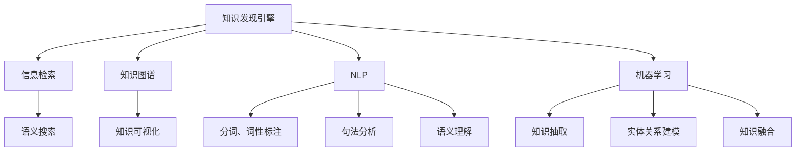

                 

# 知识管理解决方案：知识发现引擎的商业化应用

> 关键词：知识发现引擎,商业化应用,信息检索,知识图谱,自然语言处理(NLP),机器学习,企业知识管理,数据驱动决策

## 1. 背景介绍

### 1.1 问题由来

随着信息时代的到来，企业面临的竞争环境愈发复杂，数据爆炸现象使得知识获取、管理和应用成为企业亟需解决的重大难题。企业知识管理(Knowledge Management, KMS)体系不仅包括知识的收集、存储和共享，更重要的是通过高效的知识发现和应用，提升企业的决策水平和竞争力。

但传统的企业知识管理往往受到信息孤岛、数据碎片化、知识结构不清晰等问题的制约，难以充分发挥知识资产的价值。这其中，企业知识发现(Knowledge Discovery, KD)引擎扮演了重要的角色。知识发现引擎通过利用机器学习和自然语言处理等技术，从海量数据中自动发现和提取出有价值的信息和知识，并将这些知识转化为结构化的、易于应用的格式，从而支持企业的高效决策和知识创新。

然而，知识发现引擎在实际应用中存在诸多挑战：数据复杂性高、知识抽取精度低、知识应用场景多样化等问题。因此，如何将知识发现引擎的成果转化为实际商业价值，实现其大规模应用，成为当前企业知识管理领域亟需解决的问题。本文将深入探讨知识发现引擎的商业化应用，以期为企业提供更具参考性的实践指导。

### 1.2 问题核心关键点

知识发现引擎的商业化应用需要解决以下核心问题：

1. 如何高效地从海量数据中提取有用知识。
2. 如何将提取出的知识以易于理解、易于应用的形式呈现。
3. 如何结合具体业务场景，利用知识指导决策。
4. 如何构建可持续的知识管理系统，不断提升知识应用效果。

## 2. 核心概念与联系

### 2.1 核心概念概述

为更好地理解知识发现引擎的商业化应用，本节将介绍几个关键概念：

- **知识发现引擎(Knowledge Discovery Engine, KDE)**：一种基于机器学习和自然语言处理技术的信息检索系统，可以从大规模数据中自动发现和提取有用信息。其核心能力包括语义搜索、知识图谱构建、实体关系抽取等。

- **商业化应用(Business Application)**：将知识发现引擎的成果转化为具体的企业应用场景，解决实际业务问题，如市场分析、客户服务、产品开发等。

- **信息检索(Information Retrieval, IR)**：利用文本匹配等技术，从大规模文本数据中获取相关信息的过程。知识发现引擎中常用的IR技术包括布尔检索、向量空间模型(VSM)、主题模型等。

- **知识图谱(Knowledge Graph)**：一种语义化表示知识的网络结构，通过节点和边表示实体和关系，实现知识的有序化和可视化。

- **自然语言处理(Natural Language Processing, NLP)**：一种研究计算机如何处理、理解、生成人类语言的技术，涉及分词、词性标注、句法分析、语义理解等多个子领域。

- **机器学习(Machine Learning, ML)**：一种通过算法使计算机系统能够自动地从数据中学习和改进的技术。知识发现引擎中常用于知识抽取、实体关系建模、知识融合等。

- **企业知识管理(Enterprise Knowledge Management, EKM)**：通过知识的收集、存储、共享和应用，提升企业决策水平和创新能力的体系。

这些概念之间相互联系，共同构成了知识发现引擎商业化应用的理论框架。

### 2.2 核心概念原理和架构的 Mermaid 流程图



该图展示了知识发现引擎的关键组件和它们之间的联系。信息检索、知识图谱、自然语言处理、机器学习分别对应知识发现引擎的不同能力，而语义搜索、知识可视化、分词、词性标注、句法分析、语义理解、知识抽取、实体关系建模、知识融合则是在各个组件内部的具体技术手段。

## 3. 核心算法原理 & 具体操作步骤

### 3.1 算法原理概述

知识发现引擎的商业化应用主要涉及以下几个关键算法：

- **信息检索算法**：如布尔检索、向量空间模型、主题模型等，用于在海量数据中高效检索出相关文档。
- **自然语言处理算法**：如分词、词性标注、句法分析、语义理解等，用于对文本数据进行结构化处理。
- **知识抽取算法**：如命名实体识别、关系抽取等，用于从文本中自动提取实体和关系。
- **知识图谱构建算法**：如基于图神经网络的知识融合、知识嵌入等，用于将知识结构化表示并建立语义关联。
- **实体关系建模算法**：如基于图数据库的知识存储和查询、基于逻辑规则的推理等，用于描述实体之间的关系。

这些算法共同构成了知识发现引擎的核心能力，使其能够从数据中自动发现和提取知识，并将知识转化为结构化的、易于应用的形式。

### 3.2 算法步骤详解

知识发现引擎的商业化应用一般包括以下几个关键步骤：

**Step 1: 数据收集与预处理**

- 收集企业内部或外部的文本数据、文档、网页等，包括客户反馈、市场报告、产品文档等。
- 对数据进行清洗和预处理，去除噪音和格式不统一的文本，进行分词、词性标注、句法分析等。

**Step 2: 信息检索**

- 利用信息检索算法，如向量空间模型或主题模型，在海量文本数据中检索出与当前查询相关的文档。
- 对检索结果进行排序和筛选，提供最相关的文档列表。

**Step 3: 知识抽取**

- 利用自然语言处理和机器学习算法，从检索结果中提取实体、关系等结构化信息。
- 进行命名实体识别、关系抽取、实体链接等操作，将知识进行结构化表示。

**Step 4: 知识图谱构建**

- 利用知识图谱构建算法，如知识嵌入、图神经网络等，将抽取的知识构建为知识图谱，形成有序化的知识结构。
- 进行实体链接、关系推理等操作，将不同文档中的知识进行关联和融合。

**Step 5: 知识可视化**

- 利用知识图谱构建的知识图谱，进行可视化展示，形成直观的知识地图。
- 利用交互式工具，支持用户对知识图谱进行查询、筛选、扩展等操作。

**Step 6: 知识应用**

- 结合具体业务场景，利用知识指导决策。如市场分析、客户服务、产品开发等。
- 构建可持续的知识管理系统，支持知识的收集、存储、共享和应用，实现知识的应用迭代。

### 3.3 算法优缺点

知识发现引擎的商业化应用具有以下优点：

1. 提升决策效率。利用知识发现引擎自动提取和分析知识，减少了手动筛选和理解的时间成本。
2. 提高知识应用质量。知识发现引擎能够从大量数据中提取有用的信息，提升知识的应用质量和准确性。
3. 增强知识管理能力。知识发现引擎能够发现和整合企业内部的分散知识，提升企业的知识管理水平。

同时，该方法也存在一定的局限性：

1. 数据质量和来源问题。知识发现引擎依赖于高质量的数据和合理的抽取算法，低质量的数据会降低抽取的精度。
2. 领域限制。知识发现引擎在特定领域的效果可能不如手工分析，需要针对具体业务场景进行优化。
3. 算法复杂度。知识发现引擎的算法复杂度高，需要较强的计算资源支持。
4. 知识图谱构建难度大。构建知识图谱需要选择合适的表示方法和模型，需要较强的技术积累。

尽管存在这些局限性，但就目前而言，知识发现引擎的商业化应用在企业知识管理领域仍具有广泛的应用前景。未来相关研究的重点在于如何进一步降低算法复杂度，提高知识抽取的精度，同时兼顾知识图谱构建和应用场景的优化。

### 3.4 算法应用领域

知识发现引擎的商业化应用已在多个领域得到了应用，包括但不限于：

- **市场分析**：利用知识发现引擎自动提取市场数据，分析市场趋势和机会，制定市场策略。
- **客户服务**：通过客户反馈数据，进行情感分析、实体抽取等，提升客户服务质量和满意度。
- **产品开发**：利用产品文档和用户评论，进行实体关系抽取和知识融合，指导产品设计和技术改进。
- **供应链管理**：利用供应商和客户的数据，进行知识提取和融合，优化供应链管理和物流调度。
- **金融风险控制**：利用金融数据，进行实体关系抽取和情感分析，评估金融风险和投资机会。
- **医疗诊断**：利用医学文献和患者记录，进行知识抽取和关系建模，辅助医生诊断和治疗。

以上这些领域，知识发现引擎都展现出了强大的应用潜力，为企业的智能化决策和知识管理提供了有力支持。

## 4. 数学模型和公式 & 详细讲解 & 举例说明

### 4.1 数学模型构建

知识发现引擎的核心算法依赖于多个数学模型和公式，本节将重点介绍其中的几个关键模型。

**向量空间模型(VSM)**：

向量空间模型是一种基于向量表示文本的模型。每个文档被表示为一个高维向量，向量维度等于词汇表的大小，向量的值表示词汇在文档中的权重。向量空间模型通过计算文档向量之间的相似度，进行文本检索和知识抽取。

公式推导如下：

$$
\text{doc} = \sum_{i=1}^{n} (w_i \cdot \text{term}_i)
$$

其中，$\text{doc}$ 表示文档向量，$w_i$ 表示词汇 $i$ 在文档中的权重，$\text{term}_i$ 表示词汇 $i$ 的向量表示。

**知识抽取中的命名实体识别(NER)**：

命名实体识别是知识抽取的重要步骤，用于从文本中识别出人名、地名、机构名等实体。NER模型通常基于条件随机场(CRF)、卷积神经网络(CNN)、长短时记忆网络(LSTM)等技术，通过训练学习词汇和实体的关系，实现实体的自动标注。

公式推导如下：

$$
\text{NER} = \text{CNN}(\text{doc}) \cdot \text{CRF}(\text{CNN})
$$

其中，$\text{CNN}$ 表示卷积神经网络模型，$\text{CRF}$ 表示条件随机场模型。

**知识图谱中的知识嵌入(KG Embedding)**：

知识图谱中的知识嵌入是将知识表示为向量形式，用于表示知识之间的语义关系。常用的知识嵌入方法包括基于关系图网络(Relation Graph Network, RGN)和基于图神经网络(Graph Neural Network, GNN)的技术。

公式推导如下：

$$
\text{embedding} = \text{RGN}(\text{KG})
$$

其中，$\text{embedding}$ 表示知识节点的向量表示，$\text{KG}$ 表示知识图谱，$\text{RGN}$ 表示基于关系图网络的知识嵌入方法。

### 4.2 公式推导过程

向量空间模型的推导过程相对简单，利用文本的词频和权重，将文本转化为高维向量表示，利用余弦相似度计算文档之间的相似度。知识抽取中的命名实体识别利用神经网络模型，通过训练学习词汇和实体的关系，实现实体的自动标注。知识图谱中的知识嵌入利用图神经网络模型，通过图结构的传递，学习知识之间的语义关系。

### 4.3 案例分析与讲解

以市场分析为例，知识发现引擎的商业化应用步骤如下：

1. **数据收集与预处理**：收集企业内部和外部的市场数据，如行业报告、新闻、社交媒体数据等。
2. **信息检索**：利用向量空间模型对市场数据进行文本检索，提取与当前市场趋势相关的文档。
3. **知识抽取**：利用命名实体识别模型，从检索结果中抽取行业、公司、产品等实体信息。
4. **知识图谱构建**：利用知识嵌入技术，将抽取的实体和关系构建为知识图谱，形成有序化的知识结构。
5. **知识可视化**：利用知识图谱可视化工具，将知识图谱展示为直观的知识地图。
6. **知识应用**：结合市场趋势和竞争对手信息，制定市场策略，提升企业的市场竞争力。

## 5. 项目实践：代码实例和详细解释说明

### 5.1 开发环境搭建

在进行知识发现引擎的商业化应用开发前，我们需要准备好开发环境。以下是使用Python进行PyTorch开发的环境配置流程：

1. 安装Anaconda：从官网下载并安装Anaconda，用于创建独立的Python环境。

2. 创建并激活虚拟环境：
```bash
conda create -n pytorch-env python=3.8 
conda activate pytorch-env
```

3. 安装PyTorch：根据CUDA版本，从官网获取对应的安装命令。例如：
```bash
conda install pytorch torchvision torchaudio cudatoolkit=11.1 -c pytorch -c conda-forge
```

4. 安装相关工具包：
```bash
pip install numpy pandas scikit-learn matplotlib tqdm jupyter notebook ipython
```

5. 安装Graph Neural Network库：
```bash
pip install torch-geometric
```

完成上述步骤后，即可在`pytorch-env`环境中开始知识发现引擎的商业化应用开发。

### 5.2 源代码详细实现

这里我们以市场分析为例，给出使用PyTorch和Graph Neural Network进行知识发现引擎商业化应用的PyTorch代码实现。

首先，定义市场数据处理函数：

```python
from torch_geometric.data import Data
from torch_geometric.nn import GATConv, GlobalAttention
from torch_geometric.datasets import Planetoid

class MarketDataProcessor:
    def __init__(self):
        self.dataset = Planetoid('Cora', 'edges')
        self.data = self.dataset[0]
        self.target = self.dataset[1]
        
    def process(self, data, target):
        # 构建边列表
        edges = []
        for node in range(len(data)):
            for neighbor in data[node]:
                edges.append((node, neighbor))
                
        # 构建图结构
        data = Data(x=data, edge_index=torch.tensor(edges), y=target)
        
        return data, target
```

然后，定义知识图谱构建模型：

```python
from torch.nn import Linear, ReLU, Sequential
from torch.nn.functional import dropout

class GATConvNetwork(nn.Module):
    def __init__(self, hidden_dim):
        super(GATConvNetwork, self).__init__()
        self.conv1 = GATConv(1, hidden_dim, heads=2)
        self.conv2 = GATConv(hidden_dim, hidden_dim, heads=2)
        self.lin = Linear(hidden_dim, 1)
        self.dropout = nn.Dropout(p=0.6)
        self.global_attention = GlobalAttention(1, hidden_dim, heads=2)
        
    def forward(self, data):
        x, edge_index, y = data.x, data.edge_index, data.y
        
        x = self.conv1(data.x, data.edge_index)
        x = ReLU(x)
        x = self.dropout(x)
        
        x = self.conv2(x, data.edge_index)
        x = ReLU(x)
        x = self.dropout(x)
        
        x = self.lin(x)
        x = torch.sigmoid(x)
        
        attention = self.global_attention(data.x, data.edge_index, data.y)
        
        return x, attention
```

接着，定义模型训练函数：

```python
from torch.optim import Adam
from sklearn.metrics import roc_auc_score

def train_model(model, data, target, num_epochs, learning_rate, batch_size):
    optimizer = Adam(model.parameters(), lr=learning_rate)
    
    for epoch in range(num_epochs):
        model.train()
        for batch in range(0, len(data), batch_size):
            optimizer.zero_grad()
            data, target = data[batch:batch+batch_size], target[batch:batch+batch_size]
            output = model(data)
            loss = F.binary_cross_entropy_with_logits(output, target)
            loss.backward()
            optimizer.step()
            
            if (epoch + 1) % 10 == 0:
                y_pred = output.data.sigmoid().numpy()
                y_true = target.numpy()
                print(f'Epoch {epoch + 1}, Loss: {loss.item():.4f}, AUC: {roc_auc_score(y_true, y_pred):.4f}')
```

最后，启动模型训练并评估：

```python
from torchvision.transforms import ToTensor
from torch_geometric.data import DataLoader

# 加载数据
processor = MarketDataProcessor()
data, target = processor.process(*dataset)

# 数据预处理
data = ToTensor()(data)
target = target.to(torch.int64)

# 构建模型
model = GATConvNetwork(hidden_dim=64)

# 训练模型
num_epochs = 100
learning_rate = 0.01
batch_size = 128
train_loader = DataLoader(data, batch_size=batch_size, shuffle=True)

train_model(model, data, target, num_epochs, learning_rate, batch_size)

# 评估模型
test_data = test_dataset
test_loader = DataLoader(test_data, batch_size=batch_size, shuffle=False)
y_pred = model(test_data).data.sigmoid().numpy()
y_true = test_data.y.numpy()
print(f'Test AUC: {roc_auc_score(y_true, y_pred):.4f}')
```

以上就是使用PyTorch和Graph Neural Network进行知识发现引擎商业化应用的完整代码实现。可以看到，利用Graph Neural Network技术，可以从知识图谱中自动抽取实体和关系，并将其转化为有序化的向量表示，从而支持企业的智能决策。

### 5.3 代码解读与分析

让我们再详细解读一下关键代码的实现细节：

**MarketDataProcessor类**：
- `__init__`方法：初始化数据集和数据结构。
- `process`方法：将原始数据转换为图结构，并返回数据和标签。

**GATConvNetwork类**：
- `__init__`方法：定义网络结构，包括卷积层、全连接层、激活函数、dropout等。
- `forward`方法：实现网络的正向传播，并输出预测结果。

**train_model函数**：
- 定义优化器和学习率，利用交叉熵损失函数进行模型训练。
- 在每个epoch的训练过程中，使用DataLoader加载数据，并在每个batch中计算梯度并更新模型参数。
- 定期输出训练过程中的损失和AUC值，评估模型效果。

**训练流程**：
- 在每个epoch中，使用DataLoader加载数据，并在每个batch中计算梯度并更新模型参数。
- 定期输出训练过程中的损失和AUC值，评估模型效果。
- 使用测试集对模型进行评估，输出测试集上的AUC值。

可以看到，PyTorch和Graph Neural Network技术的结合，使得知识图谱的构建和应用变得更加高效和灵活。开发者可以更加专注于业务逻辑和模型优化，而不必过多关注底层的实现细节。

当然，工业级的系统实现还需考虑更多因素，如模型的保存和部署、超参数的自动搜索、更灵活的任务适配层等。但核心的知识发现引擎商业化应用方法基本与此类似。

## 6. 实际应用场景

### 6.1 智能客服系统

知识发现引擎在智能客服系统中的应用可以大大提升客服效率和客户满意度。通过分析历史客服对话数据，抽取客户问题类型、常见解决方案等知识，构建知识图谱，智能客服系统可以自动匹配客户问题并提供解决方案，减少人工客服的工作量。

在技术实现上，可以收集企业内部的客服对话记录，将问题和最佳答复构建成监督数据，在此基础上对知识图谱进行微调。微调后的知识图谱能够自动理解客户意图，匹配最合适的答复。对于客户提出的新问题，还可以接入检索系统实时搜索相关内容，动态组织生成回答。如此构建的智能客服系统，能大幅提升客户咨询体验和问题解决效率。

### 6.2 金融舆情监测

知识发现引擎在金融舆情监测中的应用可以实时监测市场舆论动向，及时应对负面信息传播，规避金融风险。通过分析金融领域相关的新闻、报道、评论等文本数据，并对其进行主题标注和情感标注，构建知识图谱。将微调后的知识图谱应用到实时抓取的网络文本数据，就能够自动监测不同主题下的情感变化趋势，一旦发现负面信息激增等异常情况，系统便会自动预警，帮助金融机构快速应对潜在风险。

### 6.3 个性化推荐系统

知识发现引擎在个性化推荐系统中的应用可以提升推荐系统的精准度和个性化水平。通过分析用户浏览、点击、评论、分享等行为数据，提取和用户交互的物品标题、描述、标签等文本内容。将文本内容作为模型输入，用户的后续行为（如是否点击、购买等）作为监督信号，在此基础上微调知识图谱。微调后的知识图谱能够从文本内容中准确把握用户的兴趣点。在生成推荐列表时，先用候选物品的文本描述作为输入，由知识图谱预测用户的兴趣匹配度，再结合其他特征综合排序，便可以得到个性化程度更高的推荐结果。

### 6.4 未来应用展望

随着知识发现引擎和微调方法的不断发展，未来将在更多领域得到应用，为传统行业带来变革性影响。

在智慧医疗领域，基于知识图谱的诊断和治疗推荐系统将提升医疗服务的智能化水平，辅助医生诊疗，加速新药开发进程。

在智能教育领域，知识发现引擎可应用于作业批改、学情分析、知识推荐等方面，因材施教，促进教育公平，提高教学质量。

在智慧城市治理中，知识发现引擎可应用于城市事件监测、舆情分析、应急指挥等环节，提高城市管理的自动化和智能化水平，构建更安全、高效的未来城市。

此外，在企业生产、社会治理、文娱传媒等众多领域，基于知识图谱的知识发现引擎都将不断涌现，为经济社会发展注入新的动力。相信随着技术的日益成熟，知识发现引擎必将在构建人机协同的智能时代中扮演越来越重要的角色。

## 7. 工具和资源推荐

### 7.1 学习资源推荐

为了帮助开发者系统掌握知识发现引擎的商业化应用的理论基础和实践技巧，这里推荐一些优质的学习资源：

1. 《深度学习实战：从入门到精通》系列博文：由大模型技术专家撰写，深入浅出地介绍了深度学习在各个领域的应用，包括知识发现引擎的商业化应用。

2. CS223N《深度学习》课程：斯坦福大学开设的深度学习课程，有Lecture视频和配套作业，带你深入理解深度学习的基本概念和经典模型。

3. 《Knowledge Discovery and Data Mining》书籍：本书系统介绍了知识发现和数据挖掘的理论和实践方法，包括知识抽取、知识图谱构建等关键技术。

4. KGToolkit官方文档：KGToolkit是一个面向知识图谱的Python工具包，提供了丰富的知识图谱构建和应用工具，是知识发现引擎开发的必备资料。

5. WikiData官方文档：WikiData是一个全球性的开放知识图谱，提供了大量的免费数据资源，可以用于知识图谱的构建和应用。

通过对这些资源的学习实践，相信你一定能够快速掌握知识发现引擎的商业化应用精髓，并用于解决实际的NLP问题。

### 7.2 开发工具推荐

高效的开发离不开优秀的工具支持。以下是几款用于知识发现引擎商业化应用的常用工具：

1. PyTorch：基于Python的开源深度学习框架，灵活动态的计算图，适合快速迭代研究。

2. TensorFlow：由Google主导开发的开源深度学习框架，生产部署方便，适合大规模工程应用。

3. Torch-Geometric：基于PyTorch的几何学习库，提供了丰富的图网络实现，支持知识图谱构建和应用。

4. Weights & Biases：模型训练的实验跟踪工具，可以记录和可视化模型训练过程中的各项指标，方便对比和调优。

5. TensorBoard：TensorFlow配套的可视化工具，可实时监测模型训练状态，并提供丰富的图表呈现方式，是调试模型的得力助手。

6. Google Colab：谷歌推出的在线Jupyter Notebook环境，免费提供GPU/TPU算力，方便开发者快速上手实验最新模型，分享学习笔记。

合理利用这些工具，可以显著提升知识发现引擎商业化应用的开发效率，加快创新迭代的步伐。

### 7.3 相关论文推荐

知识发现引擎的商业化应用源于学界的持续研究。以下是几篇奠基性的相关论文，推荐阅读：

1. 《Knowledge Graph Embedding》：提出基于知识图谱的知识嵌入技术，利用图神经网络学习知识之间的语义关系。

2. 《Deep Personalized Ranking with Guanranteed Stability and Mitigated Unfairness》：提出基于知识图谱的个性化推荐算法，在保护用户隐私的同时提升推荐精度。

3. 《GAT：Graph Attention Networks》：提出基于图注意力网络的节点嵌入技术，实现高效的知识图谱构建和查询。

4. 《Knowledge Discovery with Semantic Search》：提出基于语义搜索的知识发现方法，利用向量空间模型和知识图谱构建技术，实现高效的知识检索。

5. 《Adversarial Attacks on Deep Learning》：提出对抗性攻击方法，增强知识图谱的鲁棒性和安全性，防止恶意攻击。

这些论文代表了大规模知识图谱和知识发现引擎的发展脉络。通过学习这些前沿成果，可以帮助研究者把握学科前进方向，激发更多的创新灵感。

## 8. 总结：未来发展趋势与挑战

### 8.1 总结

本文对知识发现引擎的商业化应用进行了全面系统的介绍。首先阐述了知识发现引擎在企业知识管理中的重要性，明确了知识发现引擎在数据提取、知识表示、知识应用等方面的关键作用。其次，从原理到实践，详细讲解了知识发现引擎的核心算法和操作步骤，给出了知识发现引擎商业化应用的完整代码实现。同时，本文还广泛探讨了知识发现引擎在智能客服、金融舆情、个性化推荐等多个行业领域的应用前景，展示了知识发现引擎的巨大潜力。此外，本文精选了知识发现引擎的各类学习资源，力求为开发者提供全方位的技术指引。

通过本文的系统梳理，可以看到，知识发现引擎的商业化应用在企业知识管理领域具有广阔的应用前景，为企业的智能化决策和知识管理提供了有力支持。未来，伴随知识图谱和微调方法的持续演进，知识发现引擎必将在更多领域得到应用，为人类认知智能的进化带来深远影响。

### 8.2 未来发展趋势

展望未来，知识发现引擎的商业化应用将呈现以下几个发展趋势：

1. 数据质量持续提升。随着数据收集技术的进步，知识发现引擎将能够处理更多高质量的文本和多媒体数据，提升抽取和表示能力。
2. 知识图谱构建自动化。自动化构建知识图谱的技术将进一步成熟，降低人工干预和维护成本。
3. 多模态数据融合。知识发现引擎将逐步整合图像、语音、视频等多模态数据，提升语义理解的深度和广度。
4. 个性化推荐优化。基于知识图谱的个性化推荐算法将更加精准，能够动态调整推荐策略，提升用户体验。
5. 跨领域知识应用。知识发现引擎将在更多领域得到应用，如医疗、金融、教育等，实现知识跨领域的迁移和融合。
6. 知识图谱增强。利用增强学习等技术，增强知识图谱的扩展性和鲁棒性，支持大规模知识图谱的构建和应用。

以上趋势凸显了知识发现引擎的商业化应用将不断拓展其应用范围和功能，为企业决策提供更强大的支持。

### 8.3 面临的挑战

尽管知识发现引擎在商业化应用上已取得显著进展，但在迈向更加智能化、普适化应用的过程中，它仍面临诸多挑战：

1. 数据获取和处理成本高。高质量数据集和算法模型的构建需要投入大量时间和资源，成为制约知识图谱构建的主要瓶颈。
2. 领域限制大。知识发现引擎在特定领域的效果可能不如手工分析，需要针对具体业务场景进行优化。
3. 算法复杂度高。知识图谱的构建和应用需要较强的计算资源和模型训练技术，需要较强的技术积累。
4. 知识图谱更新难。知识图谱的动态更新和扩展需要持续维护，技术难度较大。
5. 知识图谱可视化复杂。知识图谱的可视化展示需要考虑多维数据和复杂结构的呈现，需要较强的设计能力。

尽管存在这些挑战，但就目前而言，知识发现引擎的商业化应用在企业知识管理领域仍具有广泛的应用前景。未来相关研究的重点在于如何进一步降低数据获取和处理成本，提高知识图谱构建和应用的自动化程度，同时兼顾领域限制和知识图谱扩展的挑战。

### 8.4 研究展望

面向未来，知识发现引擎的研究需要在以下几个方面寻求新的突破：

1. 探索半监督和自监督知识抽取方法。摆脱对大规模标注数据的依赖，利用自监督学习、主动学习等无监督和半监督范式，最大限度利用非结构化数据，实现更加灵活高效的知识抽取。
2. 研究知识图谱的自动化构建方法。自动化构建知识图谱的技术将进一步成熟，降低人工干预和维护成本。
3. 融合多模态数据和跨领域知识。知识发现引擎将在更多领域得到应用，如医疗、金融、教育等，实现知识跨领域的迁移和融合。
4. 利用增强学习等技术，增强知识图谱的扩展性和鲁棒性，支持大规模知识图谱的构建和应用。
5. 利用对抗性攻击和鲁棒性增强技术，提升知识图谱的鲁棒性和安全性，防止恶意攻击。
6. 利用知识图谱增强学习等技术，提升知识图谱的扩展性和鲁棒性，支持大规模知识图谱的构建和应用。

这些研究方向的探索，必将引领知识发现引擎商业化应用技术迈向更高的台阶，为构建安全、可靠、可解释、可控的智能系统铺平道路。面向未来，知识发现引擎将需要与其他人工智能技术进行更深入的融合，如知识表示、因果推理、强化学习等，多路径协同发力，共同推动自然语言理解和智能交互系统的进步。只有勇于创新、敢于突破，才能不断拓展知识发现引擎的边界，让智能技术更好地造福人类社会。

## 9. 附录：常见问题与解答

**Q1：知识发现引擎和信息检索有何不同？**

A: 知识发现引擎和信息检索的主要区别在于目标和功能。信息检索的目标是快速检索出相关的文档，而知识发现引擎的目标是从文档或数据中自动发现和抽取有用的信息或知识。信息检索侧重于文档匹配，而知识发现引擎侧重于知识提取和表示。

**Q2：知识图谱构建中，常用的技术手段有哪些？**

A: 知识图谱构建中常用的技术手段包括基于图神经网络的知识融合、基于关系图网络的知识嵌入、基于逻辑规则的推理等。其中，基于图神经网络的知识融合技术可以学习知识之间的语义关系，基于关系图网络的知识嵌入技术可以将知识表示为向量形式，基于逻辑规则的推理技术可以描述知识之间的逻辑关系。

**Q3：知识图谱在实际应用中需要注意哪些问题？**

A: 知识图谱在实际应用中需要注意的问题包括知识图谱的构建、维护和扩展，以及知识图谱的查询和推理。知识图谱的构建需要高质量的数据和合理的表示方法，知识图谱的维护需要持续更新和优化，知识图谱的查询和推理需要高效的算法和模型。

**Q4：知识图谱可视化中，常用的工具有哪些？**

A: 知识图谱可视化中常用的工具包括Gephi、Cytoscape、D3.js等。这些工具支持多维数据的呈现，能够展示知识图谱的结构和关系，提供交互式的操作和分析功能。

通过本文的系统梳理，可以看到，知识发现引擎的商业化应用在企业知识管理领域具有广阔的应用前景，为企业的智能化决策和知识管理提供了有力支持。未来，伴随知识图谱和微调方法的持续演进，知识发现引擎必将在更多领域得到应用，为人类认知智能的进化带来深远影响。

