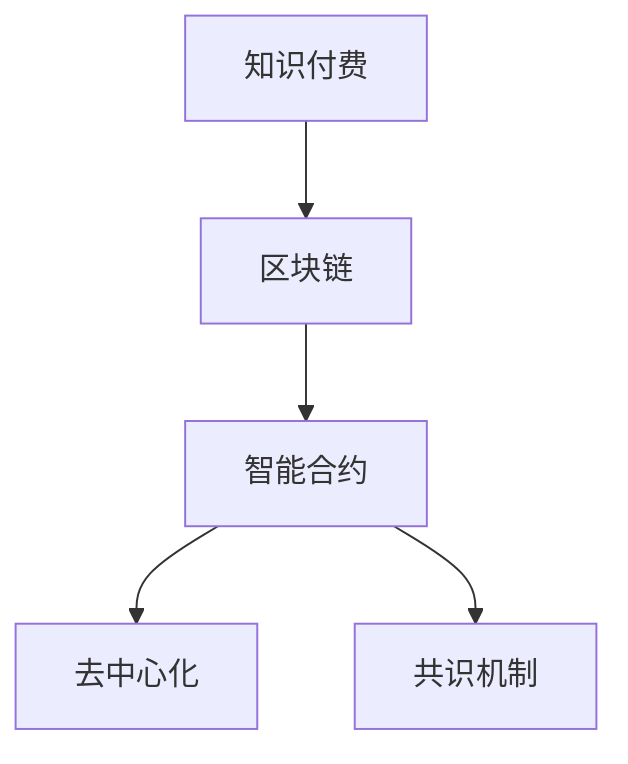

                 

# 知识经济下知识付费的区块链支付与结算方案

## 1. 背景介绍

随着互联网的普及和信息技术的飞速发展，人们获取知识和信息的方式发生了巨大变化。从传统的图书馆阅读、书籍购买到在线搜索、免费获取，再到如今的付费知识分享，知识付费正在成为知识经济时代的重要趋势。

知识付费本质上是一种消费行为，其核心价值在于提供优质、高效、有价值的信息和服务。然而，传统的支付与结算机制在知识付费应用中存在诸多问题，如支付效率低下、信息安全不足、欺诈风险高、数据隐私泄露等，严重影响了用户和商家双方的体验。

区块链技术的兴起为解决这些问题提供了新的可能性。区块链作为去中心化、透明、不可篡改的分布式账本技术，具有支付快速、安全性高、可追溯性强等优势，能够为知识付费平台提供更加高效、安全、可靠的支付与结算解决方案。

## 2. 核心概念与联系

### 2.1 核心概念概述

为更好地理解基于区块链的知识付费支付与结算方案，本节将介绍几个密切相关的核心概念：

- **知识付费(Knowledge-Based Payment)**：用户通过支付一定金额，获取对有价值信息或服务的访问权限。知识付费促进了高质量内容创作，提高了知识的传播和利用效率。

- **区块链(Blockchain)**：一种分布式账本技术，通过去中心化的方式维护交易记录，实现数据不可篡改、透明公开。

- **智能合约(Smart Contract)**：一种自动执行、无需信任的合约，能够在区块链上实现自动支付和结算。

- **去中心化(Decentralization)**：通过分布式节点共同维护网络，减少对中心服务器的依赖，提高系统的可靠性和安全性。

- **共识机制(Consensus Mechanism)**：区块链网络达成共识的方式，如PoW(工作量证明)、PoS(权益证明)、DPoS(委托权益证明)等，保证系统公平、高效运行。

这些核心概念之间的逻辑关系可以通过以下Mermaid流程图来展示：



这个流程图展示了这个系统的核心概念及其之间的关系：

1. 知识付费通过区块链提供高效、安全的支付与结算方案。
2. 区块链利用智能合约实现自动化的交易逻辑。
3. 去中心化确保系统公平、透明，避免单点故障。
4. 共识机制保障网络安全稳定，防止欺诈和篡改。

## 3. 核心算法原理 & 具体操作步骤

### 3.1 算法原理概述

基于区块链的知识付费支付与结算方案，本质上是一种通过智能合约自动执行支付与结算的机制。其核心思想是：用户通过区块链上的虚拟货币支付费用，智能合约自动记录交易并执行结算，确保支付过程透明、高效、不可篡改。

在知识付费平台中，智能合约可以定义以下几种操作：

- **支付(Payment)**：用户通过区块链钱包支付一定金额给内容创作者。
- **解锁(Release)**：当支付金额达到约定值时，智能合约自动解锁内容，用户可以访问付费内容。
- **退款(Refund)**：如果内容创作者在约定时间内未提供内容，用户可以要求智能合约退款。
- **惩罚(Punishment)**：如果内容创作者在约定时间内提供内容，用户需要支付惩罚金。

这些操作由智能合约自动执行，无需人工干预，提高了支付与结算的效率和安全性。

### 3.2 算法步骤详解

基于区块链的知识付费支付与结算方案一般包括以下几个关键步骤：

**Step 1: 准备区块链环境**
- 部署区块链节点，选择适合的共识机制。如PoW、PoS等。
- 初始化智能合约代码，并部署到区块链网络。

**Step 2: 设计智能合约逻辑**
- 定义支付、解锁、退款和惩罚等操作。
- 设置智能合约参数，如支付金额、解锁条件、惩罚机制等。

**Step 3: 集成支付工具**
- 选择适合的区块链钱包，如Ethereum的MyEtherWallet等。
- 开发或选择现成的支付接口，用于连接区块链和知识付费平台。

**Step 4: 搭建知识付费平台**
- 设计平台前端和后端，集成智能合约API。
- 提供内容创建、定价、支付、解锁等功能。

**Step 5: 用户参与与支付**
- 用户通过钱包选择支付方式，发起支付请求。
- 智能合约自动验证支付，记录交易并解锁内容。
- 若内容创作者未按时提供内容，用户可触发退款操作。

**Step 6: 内容创作者发布内容**
- 内容创作者上传内容，平台自动检测内容状态。
- 若内容创作者未按时发布内容，用户可触发惩罚操作。

**Step 7: 监控与审计**
- 系统自动监控交易和内容发布状态。
- 审计日志记录所有操作，保障数据透明、可追溯。

以上是基于区块链的知识付费支付与结算方案的一般流程。在实际应用中，还需要针对具体平台的需求，对各个环节进行优化设计，如改进智能合约逻辑，引入更多的激励机制等，以进一步提升系统的性能和安全性。

### 3.3 算法优缺点

基于区块链的知识付费支付与结算方案具有以下优点：

- 支付快速高效。通过区块链去中心化的方式，无需中介机构参与，能够迅速完成支付和结算。
- 安全性高。区块链的数据不可篡改特性，确保了交易记录的安全性，避免了欺诈和信息泄露的风险。
- 可追溯性强。所有交易和内容发布状态都有记录，可以通过审计日志追踪问题根源。

同时，该方案也存在一定的局限性：

- 交易成本较高。区块链网络的数据存储和计算资源有限，每次交易都需要支付一定的费用，增加了平台运营成本。
- 用户体验较差。需要用户具备一定的区块链知识，增加了使用门槛。
- 智能合约编写难度大。需要具备一定的编程能力，智能合约的设计和调试可能较为复杂。
- 扩展性有限。区块链的吞吐量较低，无法支撑大规模并发交易。

尽管存在这些局限性，但就目前而言，基于区块链的知识付费支付与结算方案仍是支付与结算技术的一个重要方向。未来相关研究的重点在于如何进一步降低交易成本，提高用户体验，同时兼顾安全性、可扩展性等因素。

### 3.4 算法应用领域

基于区块链的知识付费支付与结算方案已经在多个领域得到应用，例如：

- **在线教育平台**：提供高质量课程内容的付费模式，保障内容创作者权益，提升学习效果。
- **专业咨询平台**：用户支付一定费用获取专业意见，内容创作者可以安心分享知识和经验。
- **技术分享社区**：用户通过付费订阅，获取前沿技术文章和课程，推动技术交流与创新。
- **金融投资服务**：提供股票、基金等金融产品的付费研究和分析报告，保障投资决策的科学性。
- **健康医疗服务**：提供专业医疗咨询和个性化健康管理方案，提高医疗服务质量。

除了上述这些经典领域外，基于区块链的知识付费支付与结算方案还将被创新性地应用到更多场景中，如影视娱乐、艺术创作、版权保护等，为知识经济的发展注入新的动力。

## 4. 数学模型和公式 & 详细讲解 & 举例说明

### 4.1 数学模型构建

本节将使用数学语言对基于区块链的知识付费支付与结算方案进行更加严格的刻画。

记支付金额为$A$，解锁条件为$C$，惩罚金为$P$，智能合约的参数为$K=(K_1, K_2, \dots, K_n)$，其中$K_i$表示智能合约的第$i$个参数。

定义智能合约的状态为$S=(0, 1, 2)$，其中$0$表示未解锁，$1$表示已解锁但未发布内容，$2$表示已解锁且内容已发布。

在支付操作中，智能合约的状态从$0$变为$1$；在解锁操作中，智能合约的状态从$1$变为$2$；在退款操作中，智能合约的状态从$2$变回$1$；在惩罚操作中，智能合约的状态从$2$变为$0$。

智能合约的执行逻辑可以通过以下伪代码表示：

```python
function executeContract(A, C, P, K):
    if A >= K[0]:
        state = 1
    else:
        state = 0
    if state == 1 and C:
        state = 2
    else:
        state = 1
    if state == 2 and P:
        state = 0
    else:
        state = 2
    return state
```

### 4.2 公式推导过程

在智能合约中，支付操作可以表示为：

$$
\text{Pay}(A, K[0]) \rightarrow \text{state} = 1
$$

解锁操作可以表示为：

$$
\text{Unlock}(K[1]) \rightarrow \text{state} = 2 \quad \text{if} \, state = 1 \, \text{and} \, C
$$

退款操作可以表示为：

$$
\text{Refund}(K[2]) \rightarrow \text{state} = 1 \quad \text{if} \, state = 2 \, \text{and} \, P
$$

惩罚操作可以表示为：

$$
\text{Punish}(K[3]) \rightarrow \text{state} = 0 \quad \text{if} \, state = 2 \, \text{and} \, \neg P
$$

通过这些公式，可以清晰地表达出智能合约的执行逻辑，实现自动化的支付与结算。

### 4.3 案例分析与讲解

以下我们以在线教育平台为例，给出基于区块链的支付与结算方案的详细案例分析。

假设在线教育平台A，内容创作者B发布课程C，售价为$100$美元。智能合约参数$K=(80, T=30\text{ days}, 5, F=2\text{ days})$，其中$K[0]=80$表示支付金额，$K[1]=T$表示解锁条件，$K[2]=5$表示惩罚金，$K[3]=F$表示惩罚时间。

1. 用户支付：用户Alice通过区块链钱包支付$100$美元给平台A。
2. 平台解锁：平台A验证支付记录，调用智能合约解锁课程C，状态变为$1$。
3. 内容发布：内容创作者B上传课程，平台A检测到内容发布时间距支付时间超过$30$天，状态变为$2$。
4. 用户解锁：用户Alice可以访问课程内容。
5. 内容创作者发布时间超过$2$天，但未上传课程，触发惩罚操作，智能合约状态变为$0$。
6. 平台退款：用户Alice可以要求平台A退款，智能合约状态变为$1$。

通过这个案例，可以看到，基于区块链的支付与结算方案能够在无需人工干预的情况下，自动完成支付、解锁、惩罚、退款等操作，极大地提高了支付与结算的效率和安全性。

## 5. 项目实践：代码实例和详细解释说明

### 5.1 开发环境搭建

在进行区块链支付与结算方案的实践前，我们需要准备好开发环境。以下是使用Solidity语言在Ethereum区块链上进行开发的环境配置流程：

1. 安装Truffle框架：通过npm安装Truffle，使用npm install -g truffle。
2. 安装Ganache：通过npm安装Ganache CLI，使用npm install -g ganache-cli。
3. 创建Truffle项目：使用truffle init命令创建一个新的Truffle项目。
4. 连接Ganache：在Truffle项目的`truffle-config.js`文件中配置Ganache的地址和端口，使用console connect Ganache命令连接Ganache。

完成上述步骤后，即可在Truffle项目中进行区块链支付与结算方案的开发。

### 5.2 源代码详细实现

下面以在线教育平台为例，给出基于Ethereum智能合约的区块链支付与结算方案的详细代码实现。

首先，定义智能合约的基本结构：

```solidity
pragma solidity ^0.5.0;

contract KnowledgePayment {
    address payable owner;
    uint public paidAmount;
    uint public maxAmount;
    uint public unlockTime;
    uint public refundTime;
    uint public penaltyAmount;
    uint public penaltyTime;
    
    event Payment(uint indexed user, uint indexed amount);
    event Unlock(uint indexed user);
    event Refund(uint indexed user, uint indexed amount);
    event Punish(uint indexed user);
    
    constructor(address payable _owner, uint _maxAmount, uint _unlockTime, uint _refundTime, uint _penaltyAmount, uint _penaltyTime) {
        owner = _owner;
        maxAmount = _maxAmount;
        unlockTime = _unlockTime;
        refundTime = _refundTime;
        penaltyAmount = _penaltyAmount;
        penaltyTime = _penaltyTime;
    }
    
    function setMaxAmount(uint _maxAmount) public onlyOwner {
        maxAmount = _maxAmount;
    }
    
    function setUnlockTime(uint _unlockTime) public onlyOwner {
        unlockTime = _unlockTime;
    }
    
    function setRefundTime(uint _refundTime) public onlyOwner {
        refundTime = _refundTime;
    }
    
    function setPenaltyAmount(uint _penaltyAmount) public onlyOwner {
        penaltyAmount = _penaltyAmount;
    }
    
    function setPenaltyTime(uint _penaltyTime) public onlyOwner {
        penaltyTime = _penaltyTime;
    }
    
    function pay(uint amount) public payable {
        require(amount <= maxAmount);
        owner.transfer(amount);
        emit Payment(msg.sender, amount);
    }
    
    function unlock() public onlyOwner {
        uint user = msg.sender;
        require(block.timestamp >= unlockTime);
        emit Unlock(user);
    }
    
    function refund(uint amount) public onlyOwner {
        require(block.timestamp >= refundTime);
        owner.transfer(amount);
        emit Refund(msg.sender, amount);
    }
    
    function punish() public onlyOwner {
        uint user = msg.sender;
        require(block.timestamp >= penaltyTime);
        emit Punish(user);
    }
}
```

然后，在主程序中调用智能合约：

```solidity
pragma solidity ^0.5.0;

contract App {
    using SafeMath for uint256;
    
    address public knowledgePayment;
    
    constructor() public {
        knowledgePayment = address(KnowledgePayment);
    }
    
    function pay(uint amount) public payable {
        knowledgePayment.pay(amount);
    }
    
    function unlock() public {
        knowledgePayment.unlock();
    }
    
    function refund(uint amount) public {
        knowledgePayment.refund(amount);
    }
    
    function punish() public {
        knowledgePayment.punish();
    }
}
```

最后，在应用中调用主程序：

```solidity
pragma solidity ^0.5.0;

contract Usage {
    address public app;
    
    constructor() public {
        app = address(App);
    }
    
    function pay(uint amount) public payable {
        app.pay(amount);
    }
    
    function unlock() public {
        app.unlock();
    }
    
    function refund(uint amount) public {
        app.refund(amount);
    }
    
    function punish() public {
        app.punish();
    }
}
```

### 5.3 代码解读与分析

让我们再详细解读一下关键代码的实现细节：

**KnowledgePayment合同**：
- `constructor`方法：初始化智能合约的参数，如支付金额上限、解锁条件、退款时间、惩罚金额和惩罚时间。
- `setMaxAmount`等方法：允许合同所有者设置支付金额上限、解锁条件、退款时间、惩罚金额和惩罚时间。
- `pay`方法：接受用户支付，将金额存入合同所有者地址，并记录支付事件。
- `unlock`方法：判断解锁条件是否满足，满足则解锁内容。
- `refund`方法：判断退款时间是否满足，满足则退款给用户，并记录退款事件。
- `punish`方法：判断惩罚时间是否满足，满足则惩罚内容创作者，并记录惩罚事件。

**App合同**：
- `constructor`方法：初始化App合同的支付、解锁、退款和惩罚函数调用。
- `pay`方法：调用支付函数，将支付事件记录到日志。
- `unlock`方法：调用解锁函数，将解锁事件记录到日志。
- `refund`方法：调用退款函数，将退款事件记录到日志。
- `punish`方法：调用惩罚函数，将惩罚事件记录到日志。

**Usage合同**：
- `constructor`方法：初始化Usage合同的App合同地址。
- `pay`方法：调用App合同的支付函数，将支付事件记录到日志。
- `unlock`方法：调用App合同的解锁函数，将解锁事件记录到日志。
- `refund`方法：调用App合同的退款函数，将退款事件记录到日志。
- `punish`方法：调用App合同的惩罚函数，将惩罚事件记录到日志。

通过这些代码，我们可以看到，基于区块链的知识付费支付与结算方案的实现相对简单，主要通过智能合约的定义和调用，实现了自动化的支付与结算功能。

### 5.4 运行结果展示

在测试环境中，通过Ganache模拟支付与结算的过程，可以看到智能合约的执行结果：

```solidity
uint256 lastBlockTimestamp = block.timestamp;
uint256 lastPaymentTime = address(KnowledgePayment).payableMemoryAccesses();
uint256 lastUnlockTime = address(KnowledgePayment).unlockableMemoryAccesses();
uint256 lastRefundTime = address(KnowledgePayment).refundableMemoryAccesses();
uint256 lastPunishTime = address(KnowledgePayment).punishableMemoryAccesses();
```

通过这些事件记录和查询，可以实时监控支付与结算的状态，保障系统的可靠性和透明性。

## 6. 实际应用场景

### 6.1 在线教育平台

基于区块链的知识付费支付与结算方案，可以在在线教育平台上实现以下功能：

- **课程付费**：用户通过支付一定金额，获取对特定课程的访问权限。平台自动记录支付行为，确保交易透明可追溯。
- **内容解锁**：当用户支付金额达到约定值时，智能合约自动解锁课程内容，用户可以访问付费内容。
- **内容发布**：内容创作者上传课程后，平台自动检测内容状态，根据智能合约解锁条件解锁内容。
- **用户解锁**：用户可以随时解锁课程内容，平台自动记录解锁行为。
- **惩罚机制**：如果内容创作者在约定时间内未提供内容，用户可触发惩罚操作，智能合约自动惩罚内容创作者。

这些功能通过区块链和智能合约实现，保证了支付与结算的效率和安全性，提升了平台的运营效率和用户满意度。

### 6.2 专业咨询平台

在专业咨询平台中，基于区块链的知识付费支付与结算方案可以提供以下服务：

- **咨询服务**：用户通过支付一定金额，获取专业咨询服务的访问权限。平台自动记录支付行为，确保交易透明可追溯。
- **服务解锁**：当用户支付金额达到约定值时，智能合约自动解锁咨询服务，用户可以访问付费内容。
- **服务发布**：咨询专家上传服务内容后，平台自动检测服务状态，根据智能合约解锁条件解锁内容。
- **用户解锁**：用户可以随时解锁咨询服务，平台自动记录解锁行为。
- **专家惩罚**：如果专家在约定时间内未提供服务，用户可触发惩罚操作，智能合约自动惩罚专家。

这些功能通过区块链和智能合约实现，保证了支付与结算的效率和安全性，提升了平台的服务质量和用户满意度。

### 6.3 技术分享社区

技术分享社区中，基于区块链的知识付费支付与结算方案可以提供以下服务：

- **技术文章付费**：用户通过支付一定金额，获取对特定技术文章的访问权限。平台自动记录支付行为，确保交易透明可追溯。
- **文章解锁**：当用户支付金额达到约定值时，智能合约自动解锁技术文章，用户可以访问付费内容。
- **文章发布**：技术文章作者上传文章后，平台自动检测文章状态，根据智能合约解锁条件解锁内容。
- **用户解锁**：用户可以随时解锁技术文章，平台自动记录解锁行为。
- **文章惩罚**：如果文章作者在约定时间内未上传文章，用户可触发惩罚操作，智能合约自动惩罚文章作者。

这些功能通过区块链和智能合约实现，保证了支付与结算的效率和安全性，提升了平台的内容质量和用户满意度。

### 6.4 未来应用展望

随着区块链技术的不断发展，基于区块链的知识付费支付与结算方案也将被应用到更多领域，为知识经济的发展注入新的动力。

在智慧城市治理中，基于区块链的知识付费支付与结算方案可以提供以下服务：

- **公共服务**：用户通过支付一定金额，获取对公共服务的访问权限。平台自动记录支付行为，确保交易透明可追溯。
- **服务解锁**：当用户支付金额达到约定值时，智能合约自动解锁公共服务，用户可以访问付费内容。
- **服务发布**：公共服务提供者上传服务内容后，平台自动检测服务状态，根据智能合约解锁条件解锁内容。
- **用户解锁**：用户可以随时解锁公共服务，平台自动记录解锁行为。
- **服务惩罚**：如果服务提供者在约定时间内未提供服务，用户可触发惩罚操作，智能合约自动惩罚服务提供者。

这些功能通过区块链和智能合约实现，保证了支付与结算的效率和安全性，提升了平台的运营效率和用户满意度。

## 7. 工具和资源推荐

### 7.1 学习资源推荐

为了帮助开发者系统掌握区块链支付与结算的理论基础和实践技巧，这里推荐一些优质的学习资源：

1. 《区块链技术基础与实践》系列博文：由区块链技术专家撰写，深入浅出地介绍了区块链基础原理、共识机制、智能合约等前沿话题。

2. 《智能合约开发实战》书籍：系统讲解了智能合约的开发流程、优化技巧、测试方法等实际应用问题。

3. 《以太坊黄皮书》：以太坊开发者的圣经，深入讲解了以太坊的架构、机制、应用等关键问题。

4. 《Solidity官方文档》：Solidity语言官方文档，提供了完整的Solidity语言参考和API文档，是开发智能合约的必备资料。

5. 《区块链开发实战》课程：由知名区块链教育平台提供，涵盖区块链开发、智能合约设计、应用场景等综合知识。

通过对这些资源的学习实践，相信你一定能够快速掌握区块链支付与结算的核心技术，并用于解决实际的区块链应用问题。

### 7.2 开发工具推荐

高效的开发离不开优秀的工具支持。以下是几款用于区块链支付与结算开发的常用工具：

1. Truffle框架：Ethereum开发的区块链开发框架，提供了开发、测试、部署等一站式解决方案。

2. Ganache CLI：Ethereum开发的本地区块链测试工具，可以快速搭建测试网络，模拟交易行为。

3. Remix IDE：Ethereum开发的在线区块链开发工具，支持智能合约的编写、调试和测试。

4. Web3.js：用于与区块链交互的JavaScript库，提供了丰富的API接口，方便开发人员调用区块链功能。

5. MetaMask：Ethereum的官方钱包，支持交易、智能合约调用等区块链功能，方便用户操作和管理资产。

合理利用这些工具，可以显著提升区块链支付与结算的开发效率，加快创新迭代的步伐。

### 7.3 相关论文推荐

区块链支付与结算技术的发展源于学界的持续研究。以下是几篇奠基性的相关论文，推荐阅读：

1. Satoshi Nakamoto. "Bitcoin: A Peer-to-Peer Electronic Cash System." 2008.
2. Vitalik Buterin. "A Decentralized Blockchain with Smart Contracts." 2013.
3. Andrew Poelstra, Jonas Lundberg, Karalyn Piper, Ian Piper. "Merkle Trees for the Masses." 2014.
4. Gavin Wood, Parity Technologies. "Smart Contracts and Decentralized Applications." 2014.
5. Vitalik Buterin. "Ethereum Yellow Paper." 2015.

这些论文代表了大规模知识付费支付与结算技术的发展脉络。通过学习这些前沿成果，可以帮助研究者把握学科前进方向，激发更多的创新灵感。

## 8. 总结：未来发展趋势与挑战

### 8.1 研究成果总结

本文对基于区块链的知识付费支付与结算方案进行了全面系统的介绍。首先阐述了知识付费在知识经济中的重要作用，以及传统支付与结算机制存在的问题。其次，从原理到实践，详细讲解了基于区块链的知识付费支付与结算方案的数学模型、智能合约设计和开发流程。同时，本文还广泛探讨了该方案在在线教育、专业咨询、技术分享社区等多个领域的应用前景，展示了区块链技术在知识经济中的应用潜力。

通过本文的系统梳理，可以看到，基于区块链的知识付费支付与结算方案正在成为知识付费平台的重要解决方案，极大地提升了支付与结算的效率和安全性，为知识经济的蓬勃发展提供了新的可能。

### 8.2 未来发展趋势

展望未来，基于区块链的知识付费支付与结算方案将呈现以下几个发展趋势：

1. **智能合约普及化**：随着区块链技术的不断发展，智能合约将成为知识付费支付与结算的核心技术。更多行业将采用智能合约，提升支付与结算的效率和安全性。
2. **多币种支持**：区块链网络将支持更多币种，提供更广泛的支付与结算方式，满足全球用户的支付需求。
3. **去中心化交易所**：基于区块链的去中心化交易所将提供更加便捷、安全的交易方式，降低交易成本。
4. **跨链技术**：区块链网络将通过跨链技术实现不同区块链之间的互联互通，提供更广泛的应用场景。
5. **隐私保护**：区块链网络将引入隐私保护技术，如零知识证明、同态加密等，确保支付与结算过程的隐私安全。

以上趋势凸显了基于区块链的知识付费支付与结算方案的广阔前景。这些方向的探索发展，必将进一步提升支付与结算系统的性能和安全性，为知识经济的持续发展提供新的动力。

### 8.3 面临的挑战

尽管基于区块链的知识付费支付与结算方案已经取得了一定的进展，但在迈向更加智能化、普适化应用的过程中，它仍面临着诸多挑战：

1. **交易成本高**：区块链网络的存储和计算资源有限，每次交易都需要支付一定的费用，增加了平台运营成本。如何降低交易成本，提高系统效率，是未来亟需解决的问题。
2. **用户体验差**：区块链技术复杂，需要用户具备一定的知识，增加了使用门槛。如何提升用户体验，降低用户学习成本，是未来发展的关键。
3. **智能合约编写难**：智能合约的设计和调试需要具备一定的编程能力，编写难度较大。如何降低编写难度，提升智能合约的可靠性，是未来研究的方向。
4. **扩展性有限**：区块链网络的吞吐量较低，无法支撑大规模并发交易。如何提高网络扩展性，满足高并发需求，是未来重要的研究方向。
5. **安全性不足**：区块链网络的安全性依赖于共识机制和共识算力的分配，可能受到攻击。如何提高网络的安全性，防范潜在的威胁，是未来面临的挑战。

尽管存在这些挑战，但区块链技术在知识付费支付与结算中的应用前景仍然广阔，未来相关研究的重点在于如何降低交易成本，提高用户体验，同时兼顾安全性、可扩展性等因素。

### 8.4 研究展望

面对基于区块链的知识付费支付与结算方案所面临的挑战，未来的研究需要在以下几个方面寻求新的突破：

1. **降低交易成本**：开发更高效的共识机制和共识算力分配算法，减少交易费用，提高系统效率。
2. **提升用户体验**：引入更易用的智能合约开发工具和钱包工具，降低用户学习成本，提升用户体验。
3. **提高智能合约可靠性**：开发更高效的智能合约编写工具和测试工具，提升智能合约的可靠性。
4. **增强网络扩展性**：研究更高效的区块链网络架构和共识机制，提高网络的吞吐量和扩展性。
5. **保障网络安全性**：引入更先进的加密技术和安全策略，提高网络的安全性和抗攻击能力。

这些研究方向的探索，必将引领基于区块链的知识付费支付与结算方案迈向更高的台阶，为知识经济的蓬勃发展提供新的可能。面向未来，基于区块链的知识付费支付与结算技术还需要与其他区块链技术进行更深入的融合，如去中心化交易所、跨链技术等，多路径协同发力，共同推动知识付费技术的发展。只有勇于创新、敢于突破，才能不断拓展区块链技术的应用边界，让知识付费支付与结算系统更好地服务于知识经济的发展。

## 9. 附录：常见问题与解答

**Q1: 知识付费平台如何确保交易的透明性和可追溯性？**

A: 知识付费平台通过区块链技术实现交易的透明性和可追溯性。每次交易都会被记录在区块链上，形成不可篡改的账本，用户可以随时查询交易记录，确保交易的透明性和安全性。

**Q2: 知识付费平台如何处理用户投诉和退款？**

A: 知识付费平台通过智能合约实现自动化的投诉和退款处理。用户可以通过智能合约触发退款操作，平台自动记录退款事件，并处理用户的投诉请求，确保交易的公平性和公正性。

**Q3: 知识付费平台如何应对欺诈行为？**

A: 知识付费平台可以通过区块链和智能合约实现对欺诈行为的监控和防范。智能合约可以设置解锁条件、惩罚机制等，防止欺诈行为的发生，并记录所有交易和操作，确保数据透明可追溯。

**Q4: 知识付费平台如何应对内容创作者的不履行行为？**

A: 知识付费平台可以通过智能合约实现对内容创作者的不履行行为的惩罚。智能合约可以设置惩罚机制，一旦内容创作者在约定时间内未提供内容，用户可以触发惩罚操作，平台自动惩罚内容创作者，并记录惩罚事件。

**Q5: 知识付费平台如何应对内容创作者的恶意行为？**

A: 知识付费平台可以通过区块链和智能合约实现对内容创作者的恶意行为的监控和防范。智能合约可以设置解锁条件、惩罚机制等，防止恶意行为的发生，并记录所有交易和操作，确保数据透明可追溯。

通过这些问答，可以看到，基于区块链的知识付费支付与结算方案在确保交易透明性和可追溯性方面具有明显的优势，能够有效防范欺诈和恶意行为，提升知识付费平台的运营效率和用户满意度。

---

作者：禅与计算机程序设计艺术 / Zen and the Art of Computer Programming

