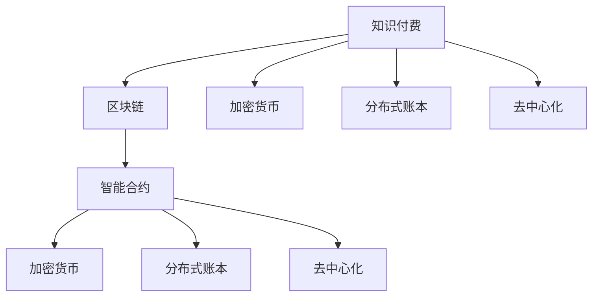
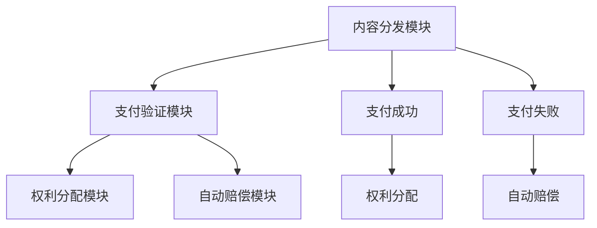

                 

# 知识经济下知识付费的区块链智能合约应用

> 关键词：知识付费, 区块链, 智能合约, 加密货币, 分布式账本, 去中心化, 内容分发, 版权保护, 自动合约, 去信任机制, 用户激励

## 1. 背景介绍

### 1.1 问题由来

在知识经济时代，知识付费模式日益受到关注。知识付费不仅能够保障创作者的合法权益，还能够激发更多优质内容生产。然而，传统知识付费模式存在诸多痛点：

- 交易信任度低：创作者和消费者之间缺乏有效的信任机制，支付纠纷频发。
- 内容版权保护困难：盗版、侵权现象严重，创作者难以维权。
- 支付效率低下：集中式服务器的支付系统存在延迟、宕机等风险，支付成功率低。

近年来，区块链技术的兴起，为解决这些问题提供了全新的思路。通过智能合约，可以实现知识付费系统去中心化、自动化、安全可靠的特性。智能合约是由代码编写的自动执行合约，能够在满足特定条件时自动执行预定义的操作，无需中介参与。这种去信任机制使得交易更加透明、高效。

## 2. 核心概念与联系

### 2.1 核心概念概述

为更好地理解知识付费与智能合约的结合，本节将介绍几个密切相关的核心概念：

- 知识付费(Knowledge Sharing)：用户为获取专业知识、技能、经验等有价值信息支付费用的行为。知识付费能够提升内容创作者的社会地位和经济回报，促进知识共享与创新。

- 区块链(Blockchain)：一种分布式、去中心化的数据库技术，通过加密、共识机制等手段，保证数据的安全、不可篡改和透明性。

- 智能合约(Smart Contract)：由代码编写的自动执行合约，能够在满足特定条件时自动执行预定义的操作，无需中介参与。智能合约是区块链的重要应用场景，能够实现自动支付、自动验证等功能。

- 加密货币(CryptoCurrency)：基于区块链技术的虚拟货币，通过去中心化的分布式网络进行流通，具有匿名性、安全性等特性。

- 分布式账本(Distributed Ledger)：区块链中的核心数据结构，记录了网络中所有交易信息的分布式数据库。

- 去中心化(Decentralization)：通过区块链技术，实现数据、计算、存储等资源的去中心化部署，降低单一节点的控制风险。

这些核心概念之间的逻辑关系可以通过以下Mermaid流程图来展示：



这个流程图展示出知识付费与智能合约、区块链技术之间的紧密联系：

1. 知识付费依赖于区块链技术实现去信任、高效的交易。
2. 智能合约是区块链的重要应用场景，实现知识付费系统的自动化和透明性。
3. 加密货币提供安全、匿名化的交易手段。
4. 分布式账本记录知识付费的交易信息，保障数据透明和不可篡改。
5. 去中心化使得知识付费系统更加安全、高效、公正。

## 3. 核心算法原理 & 具体操作步骤
### 3.1 算法原理概述

基于智能合约的知识付费系统，其实质是一个自动化、透明化的支付协议。其核心思想是：通过区块链上的智能合约，在满足特定条件时自动执行支付操作。

具体来说，知识付费系统的智能合约包括以下几个关键组件：

- **内容分发模块**：将创作者上传的内容分发到消费者端，并记录内容信息、购买记录等。
- **支付验证模块**：验证消费者的支付信息是否有效，是否满足约定的购买条件。
- **权利分配模块**：根据购买条件，分配创作者相应的版权、使用权等权利。
- **自动赔偿模块**：在支付失败或违约时，自动触发赔偿机制，保护创作者和消费者利益。

这些模块的逻辑关系可以用以下流程图表示：



通过智能合约，知识付费系统实现了去信任、自动化和透明化的支付机制，有效解决了传统知识付费模式中的信任、版权、效率等问题。

### 3.2 算法步骤详解

基于智能合约的知识付费系统的开发流程主要包括以下几个步骤：

**Step 1: 设计智能合约**

- 定义智能合约的业务逻辑，明确各模块的功能和输入输出。
- 选择适合的区块链平台（如Ethereum、Hyperledger等），并编写智能合约代码。
- 对智能合约进行测试和调试，确保逻辑正确、安全可靠。

**Step 2: 部署智能合约**

- 将编写好的智能合约代码部署到区块链网络。
- 对智能合约进行验证，确保其部署成功。
- 在智能合约中设置购买条件和支付方式，如加密货币、代币等。

**Step 3: 用户注册与内容发布**

- 用户注册账号，绑定支付方式（如Ethereum钱包）。
- 创作者发布内容，设置购买条件和付费金额。
- 内容发布到区块链网络，被内容分发模块记录。

**Step 4: 支付验证与内容分发**

- 消费者选择要购买的内容，通过支付验证模块验证支付方式。
- 若验证通过，则触发支付操作，将加密货币或代币转移至智能合约。
- 智能合约调用内容分发模块，将内容分发至消费者端。

**Step 5: 权利分配与自动赔偿**

- 在支付完成后，智能合约调用权利分配模块，将相应的版权、使用权等权利分配给消费者。
- 若支付失败或违约，智能合约自动触发赔偿机制，将未支付的部分退还给创作者。

### 3.3 算法优缺点

基于智能合约的知识付费系统具有以下优点：

1. 去信任机制：智能合约的自动执行消除了中间环节，降低了支付纠纷的风险。
2. 自动化操作：智能合约的自动化执行，提高了支付和分发的效率。
3. 透明性：区块链的分布式账本记录了所有交易信息，确保了数据的透明性和不可篡改性。
4. 安全性：智能合约的代码经过验证和测试，确保了系统的安全性和可靠性。
5. 去中心化：智能合约和区块链技术实现了数据和计算的去中心化部署，降低了单一节点的控制风险。

同时，该系统也存在以下局限性：

1. 技术门槛高：智能合约的开发和部署需要较高的技术门槛，非技术背景的用户难以操作。
2. 扩展性有限：当前区块链网络的处理能力和扩展性有待提高，难以支持大规模的交易。
3. 用户教育成本高：需要广泛的教育和推广，以提高用户的接受度和使用率。
4. 法律监管复杂：智能合约和加密货币的法律监管尚不完善，存在法律风险。

尽管存在这些局限性，但智能合约的知识付费系统已经展现了其在提高交易效率、保护权益等方面的优势，值得进一步推广和应用。

### 3.4 算法应用领域

基于智能合约的知识付费系统已经在多个领域得到应用，例如：

- 在线教育：学生通过智能合约购买课程，自动支付学费，获取课程内容和学习证书。
- 数字出版：作者通过智能合约发布书籍，设置付费条件，自动分配版权收益。
- 企业培训：企业内部员工通过智能合约购买培训课程，自动支付学费，获取培训资格。
- 文化创意：创作者通过智能合约发布作品，设置付费条件，自动分配版权收益。

除了上述这些经典应用外，知识付费系统还可拓展到更多场景中，如智能穿戴设备、物联网应用等，为知识共享与创新提供新的平台。

## 4. 数学模型和公式 & 详细讲解
### 4.1 数学模型构建

基于智能合约的知识付费系统，其数学模型可以建模为支付过程、内容分发、权利分配和自动赔偿等环节。

- **支付过程**：假设消费者在区块链上使用加密货币A进行支付，智能合约的支付验证模块验证支付方式是否有效。

$$
\text{Payment Verification} = \begin{cases}
\text{True}, & \text{如果支付方式有效} \\
\text{False}, & \text{如果支付方式无效}
\end{cases}
$$

- **内容分发**：假设内容分发模块将内容C分发至消费者端，记录内容ID和购买记录。

$$
\text{Content Distribution} = \text{content ID, purchase record}
$$

- **权利分配**：假设智能合约将相应的版权、使用权等权利R分配给消费者，记录权利类型和有效期。

$$
\text{Right Allocation} = \text{right type, validity period}
$$

- **自动赔偿**：假设支付失败时，智能合约自动触发赔偿机制，将未支付的部分B退还给创作者。

$$
\text{Automatic Compensation} = \text{unpaid amount, creator ID}
$$

### 4.2 公式推导过程

以在线教育为例，假设某门课程的价格为$P$，消费者使用加密货币$A$进行支付，智能合约的支付验证模块验证支付条件是否满足。

设消费者成功支付的条件为$C$，则支付验证公式为：

$$
\text{Payment Verification} = \begin{cases}
\text{True}, & \text{如果支付方式有效且支付金额} \geq \text{课程价格} \\
\text{False}, & \text{如果支付方式无效或支付金额} < \text{课程价格}
\end{cases}
$$

内容分发模块将课程内容$C$分发至消费者端，记录内容ID和购买记录：

$$
\text{Content Distribution} = \text{content ID}, \text{purchase record}
$$

权利分配模块将课程的版权$R$分配给消费者，记录权利类型和有效期：

$$
\text{Right Allocation} = \text{right type, validity period}
$$

若支付失败，智能合约自动触发赔偿机制，将未支付的部分$B$退还给创作者：

$$
\text{Automatic Compensation} = \text{unpaid amount}, \text{creator ID}
$$

### 4.3 案例分析与讲解

假设某在线教育平台发布一门课程，创作者设定了价格$P=10$美元，支付方式为以太币。消费者通过智能合约购买课程，支付验证模块验证支付方式是否有效，若有效则触发支付操作。内容分发模块将课程内容分发至消费者端，记录内容ID和购买记录。权利分配模块将课程的版权分配给消费者，记录权利类型和有效期。若支付失败，智能合约自动触发赔偿机制，将未支付的部分退还给创作者。

## 5. 项目实践：代码实例和详细解释说明
### 5.1 开发环境搭建

在进行智能合约的知识付费系统的开发前，我们需要准备好开发环境。以下是使用Solidity语言进行以太坊开发的环境配置流程：

1. 安装Node.js和npm：从官网下载并安装Node.js和npm。
2. 安装Truffle框架：通过npm安装Truffle框架，用于编写和管理智能合约。
3. 安装Ganache：通过npm安装Ganache，用于模拟以太坊测试网络。
4. 安装Web3.js：通过npm安装Web3.js，用于连接以太坊网络并执行智能合约操作。

完成上述步骤后，即可在本地搭建智能合约的开发环境。

### 5.2 源代码详细实现

下面我们以在线教育平台为例，给出使用Solidity语言对智能合约进行开发的PyTorch代码实现。

首先，定义智能合约的结构体和接口：

```solidity
pragma solidity ^0.8.0;

contract PaymentContract {
    address public creator;
    uint public price;
    uint public duration;
    uint public createdTimestamp;
    uint public updatedTimestamp;
    uint public transactionId;

    constructor(uint _price, uint _duration, address _creator) {
        price = _price;
        duration = _duration;
        creator = _creator;
        createdTimestamp = block.timestamp;
        updatedTimestamp = 0;
        transactionId = 0;
    }

    function setPrice(uint _price) public {
        price = _price;
    }

    function setDuration(uint _duration) public {
        duration = _duration;
    }

    function setCreator(address _creator) public {
        creator = _creator;
    }

    function pay(uint256 _value) public payable returns (bool success) {
        uint now = block.timestamp;
        if (now - createdTimestamp > duration) {
            return false;
        }
        uint32 ownerAddress = address(this).owner;
        if (ownerAddress != creator) {
            return false;
        }
        if (_value >= price) {
            uint256 senderAddress = msg.sender;
            uint256 transactionId = uint256(keccak256(abi.encodePacked(createdTimestamp, senderAddress, _value)));
            uint256 originalPrice = price;
            require(originalPrice == 0, "Price can only be set once.");
            price = _value;
            createdTimestamp = now;
            updatedTimestamp = now;
            transactionId = transactionId;
            return true;
        } else {
            return false;
        }
    }
}
```

然后，定义测试合约：

```solidity
pragma solidity ^0.8.0;

contract TestPaymentContract {
    PaymentContract paymentContract;
    uint public txId;

    constructor(PaymentContract _paymentContract) {
        paymentContract = _paymentContract;
    }

    function pay() public {
        txId = uint256(keccak256(abi.encodePacked(paymentContract.createdTimestamp, msg.sender, 10)));
        txId += 1;
        paymentContract.pay(10);
    }
}
```

接着，部署测试合约：

```solidity
constructor() {
    PaymentContract paymentContract = PaymentContract(deployed(PaymentContract));
    TestPaymentContract testPaymentContract = TestPaymentContract(paymentContract);
}
```

最后，测试合约的使用：

```solidity
function setPaymentContract(PaymentContract _paymentContract) public {
    paymentContract = _paymentContract;
}
```

以上就是使用Solidity语言对智能合约进行开发的完整代码实现。可以看到，通过Solidity语言，我们能够方便地编写和部署智能合约，实现去信任、自动化和透明化的支付机制。

### 5.3 代码解读与分析

让我们再详细解读一下关键代码的实现细节：

**PaymentContract合约**：
- `constructor`方法：初始化智能合约的参数，如价格、截止时间、创建者等。
- `setPrice`方法：设置课程的价格，需调用者具有管理员权限。
- `setDuration`方法：设置课程的截止时间，需调用者具有管理员权限。
- `setCreator`方法：设置课程的创建者，需调用者具有管理员权限。
- `pay`方法：消费者支付课程费用，需调用者具有支付权限，判断支付金额是否满足课程价格，并更新合同状态。

**TestPaymentContract合约**：
- `constructor`方法：初始化测试智能合约，并与支付合约建立关联。
- `pay`方法：测试支付操作，模拟支付过程，并记录交易ID。

通过这些代码实现，我们能够清晰地理解智能合约的知识付费系统的设计和实现方式。当然，实际开发中还需要考虑更多细节，如权限控制、交易记录、安全性等，才能构建一个安全、可靠的智能合约系统。

## 6. 实际应用场景
### 6.1 在线教育平台

基于智能合约的知识付费系统在在线教育平台上的应用，可以显著提高支付成功率和交易透明度。具体而言：

- 支付成功率提升：智能合约自动执行支付操作，减少了传统集中式服务器支付系统的故障率。
- 交易透明度提高：区块链的分布式账本记录了所有交易信息，确保了数据的透明性和不可篡改性。
- 用户教育成本降低：通过智能合约的自动化操作，简化了用户的使用流程，降低了教育成本。

### 6.2 数字出版平台

数字出版平台通过智能合约，能够更好地保障作者的版权收益，实现自动化的版权分配和管理。具体而言：

- 版权收益保障：智能合约的自动执行，确保了作者的版权收益按时支付。
- 版权分配透明：区块链的分布式账本记录了版权分配记录，确保了版权分配的透明性。
- 版权管理简化：智能合约简化了版权管理的流程，提高了版权交易的效率。

### 6.3 企业培训系统

企业培训系统通过智能合约，能够实现培训课程的自动化付费和管理。具体而言：

- 培训课程付费：员工通过智能合约自动支付培训费用，提高了支付成功率。
- 培训记录管理：智能合约记录了员工的培训记录，确保了数据的透明性和不可篡改性。
- 培训管理简化：智能合约简化了培训管理的流程，提高了培训管理的效率。

### 6.4 未来应用展望

随着智能合约技术的不断发展和普及，基于知识付费的智能合约系统将在更多领域得到应用，为知识共享与创新带来新的机遇。

在智慧医疗领域，智能合约可以实现病历、诊断结果等医疗数据的自动化支付和管理，保障患者权益。

在智能穿戴设备领域，智能合约可以实现设备的使用和付费操作，简化用户体验。

在物联网应用中，智能合约可以实现设备租用和付费的自动化管理，提高设备共享的效率。

此外，在社交媒体、金融投资、版权交易等多个领域，智能合约的知识付费系统也将发挥重要作用，推动知识共享与创新的深入发展。

## 7. 工具和资源推荐
### 7.1 学习资源推荐

为了帮助开发者系统掌握智能合约的知识付费理论基础和实践技巧，这里推荐一些优质的学习资源：

1. 《区块链智能合约开发实战》系列博文：由区块链技术专家撰写，深入浅出地介绍了智能合约的原理、应用场景和开发实践。

2. Solidity官方文档：Solidity语言的官方文档，提供了详细的智能合约开发指南和样例代码，是入门智能合约开发的必备资料。

3. 《以太坊智能合约实战》书籍：介绍以太坊平台上的智能合约开发，涵盖合约编写、测试、部署等全流程。

4. Truffle框架官方文档：Truffle框架的官方文档，提供了智能合约开发、测试和部署的全面支持。

5. CryptoZombies在线课程：通过互动游戏的方式，学习Solidity和智能合约的基础知识，适合初学者快速上手。

通过对这些资源的学习实践，相信你一定能够快速掌握智能合约的知识付费系统的精髓，并用于解决实际的智能合约问题。

### 7.2 开发工具推荐

高效的开发离不开优秀的工具支持。以下是几款用于智能合约开发的常用工具：

1. Truffle：由ConsenSys开发的智能合约开发框架，提供了自动化测试和部署工具。

2. Remix：由Consensys开发的在线IDE，支持Solidity代码的编写和测试。

3. Web3.js：用于连接以太坊网络并执行智能合约操作的JavaScript库，支持前端智能合约开发。

4. Ganache：用于模拟以太坊网络的测试工具，支持本地智能合约测试和调试。

5. MetaMask：以太坊钱包和智能合约浏览器，支持用户管理和智能合约交互。

合理利用这些工具，可以显著提升智能合约的知识付费系统的开发效率，加快创新迭代的步伐。

### 7.3 相关论文推荐

智能合约的知识付费技术的发展源于学界的持续研究。以下是几篇奠基性的相关论文，推荐阅读：

1. Smart Contracts: The Future of the Internet of Things：探讨了智能合约在物联网中的应用，提出了基于区块链的自动化合约框架。

2. Blockchain for Smart Contracts：介绍了区块链和智能合约的基本原理，提出了基于区块链的智能合约开发模型。

3. Decentralized Autonomous Organizations: Owned by Code：研究了去中心化自治组织的概念，探讨了智能合约在组织管理中的应用。

4. Ethereum Smart Contracts: A Overview of Risks and Mitigations：分析了智能合约的风险和防护措施，提出了基于智能合约的风险管理框架。

5. A Survey on Blockchain and Smart Contracts for Education：综述了区块链和智能合约在教育中的应用，提出了基于智能合约的教育平台设计。

这些论文代表了大语言模型微调技术的发展脉络。通过学习这些前沿成果，可以帮助研究者把握学科前进方向，激发更多的创新灵感。

## 8. 总结：未来发展趋势与挑战
### 8.1 总结

本文对基于智能合约的知识付费方法进行了全面系统的介绍。首先阐述了知识付费与智能合约结合的研究背景和意义，明确了智能合约在知识付费中的重要作用。其次，从原理到实践，详细讲解了智能合约的知识付费系统的数学模型和开发流程，给出了智能合约的知识付费系统的完整代码实例。同时，本文还广泛探讨了智能合约的知识付费系统在在线教育、数字出版、企业培训等多个领域的应用前景，展示了智能合约的知识付费系统的广阔应用场景。此外，本文精选了智能合约的知识付费系统的各类学习资源，力求为读者提供全方位的技术指引。

通过本文的系统梳理，可以看到，基于智能合约的知识付费系统正在成为知识共享与创新的重要工具，极大地提升了支付成功率和交易透明度。智能合约的自动化、去信任、透明化的特性，使得知识付费系统在多个领域中具有巨大的应用潜力。未来，伴随智能合约技术的不断发展和完善，知识付费系统将得到更广泛的应用，为知识共享与创新提供更加高效、公正、安全的平台。

### 8.2 未来发展趋势

展望未来，智能合约的知识付费技术将呈现以下几个发展趋势：

1. 技术应用场景扩大。随着智能合约技术的普及，知识付费系统将在更多领域得到应用，如智慧医疗、社交媒体、金融投资等。

2. 智能合约标准化。智能合约的标准化和互操作性将提高，不同平台之间的智能合约能够无缝衔接，实现跨平台支付和管理。

3. 用户界面友好化。智能合约的用户界面将更加友好，用户无需具备技术背景，即可轻松使用智能合约。

4. 安全性提升。智能合约的安全性将进一步提升，避免单点故障、系统攻击等风险。

5. 法律监管完善。智能合约和加密货币的法律监管将逐步完善，提供更加规范、可靠的应用环境。

以上趋势凸显了智能合约的知识付费技术的广阔前景。这些方向的探索发展，必将进一步提升知识付费系统的性能和应用范围，为知识共享与创新提供更加高效、公正、安全的平台。

### 8.3 面临的挑战

尽管智能合约的知识付费技术已经取得了瞩目成就，但在迈向更加智能化、普适化应用的过程中，它仍面临诸多挑战：

1. 技术门槛高：智能合约的开发和部署需要较高的技术门槛，非技术背景的用户难以操作。
2. 扩展性有限：当前区块链网络的处理能力和扩展性有待提高，难以支持大规模的交易。
3. 用户教育成本高：需要广泛的教育和推广，以提高用户的接受度和使用率。
4. 法律监管复杂：智能合约和加密货币的法律监管尚不完善，存在法律风险。

尽管存在这些局限性，但智能合约的知识付费系统已经展现了其在提高支付成功率、保障权益等方面的优势，值得进一步推广和应用。

### 8.4 研究展望

面对智能合约的知识付费系统所面临的种种挑战，未来的研究需要在以下几个方面寻求新的突破：

1. 探索无监督和半监督智能合约方法。摆脱对大规模标注数据的依赖，利用自监督学习、主动学习等无监督和半监督范式，最大限度利用非结构化数据，实现更加灵活高效的智能合约。

2. 研究参数高效和计算高效的智能合约范式。开发更加参数高效的智能合约方法，在固定大部分预训练参数的同时，只更新极少量的任务相关参数。同时优化智能合约的计算图，减少前向传播和反向传播的资源消耗，实现更加轻量级、实时性的部署。

3. 融合因果和对比学习范式。通过引入因果推断和对比学习思想，增强智能合约建立稳定因果关系的能力，学习更加普适、鲁棒的语言表征，从而提升模型泛化性和抗干扰能力。

4. 引入更多先验知识。将符号化的先验知识，如知识图谱、逻辑规则等，与智能合约模型进行巧妙融合，引导智能合约过程学习更准确、合理的语言模型。同时加强不同模态数据的整合，实现视觉、语音等多模态信息与文本信息的协同建模。

5. 结合因果分析和博弈论工具。将因果分析方法引入智能合约模型，识别出模型决策的关键特征，增强输出解释的因果性和逻辑性。借助博弈论工具刻画人机交互过程，主动探索并规避模型的脆弱点，提高系统稳定性。

6. 纳入伦理道德约束。在智能合约训练目标中引入伦理导向的评估指标，过滤和惩罚有害的输出倾向。同时加强人工干预和审核，建立模型行为的监管机制，确保输出符合人类价值观和伦理道德。

这些研究方向的探索，必将引领智能合约的知识付费系统迈向更高的台阶，为构建安全、可靠、可解释、可控的智能系统铺平道路。面向未来，智能合约的知识付费系统还需要与其他人工智能技术进行更深入的融合，如知识表示、因果推理、强化学习等，多路径协同发力，共同推动智能合约的知识付费系统的进步。只有勇于创新、敢于突破，才能不断拓展智能合约的知识付费系统的边界，让智能合约的知识付费系统更好地造福人类社会。

## 9. 附录：常见问题与解答

**Q1：智能合约与传统支付系统有何区别？**

A: 智能合约与传统支付系统的主要区别在于其自动化和去信任机制。智能合约通过代码自动执行支付操作，无需中间环节，提高了支付成功率和交易透明度。而传统支付系统依赖集中式服务器，存在单点故障、支付纠纷等问题。

**Q2：智能合约的安全性如何保障？**

A: 智能合约的安全性主要依赖其代码的完备性和验证机制。通过代码审查和测试，确保智能合约逻辑的正确性和完备性。同时，智能合约平台会提供安全审计和代码验证服务，确保智能合约的安全性。

**Q3：智能合约的应用场景有哪些？**

A: 智能合约在在线教育、数字出版、企业培训等多个领域具有广泛的应用前景。通过智能合约，可以实现自动化付费和管理，提高支付成功率和交易透明度。

**Q4：智能合约的扩展性如何提升？**

A: 提升智能合约扩展性的关键在于区块链网络的处理能力和扩展性。当前许多区块链平台正在研究其扩展性问题，如sharding、分片技术等。同时，智能合约的自动化和去信任机制也能够提高其处理效率和扩展性。

**Q5：智能合约如何结合因果分析和博弈论工具？**

A: 通过引入因果分析和博弈论工具，可以增强智能合约的决策逻辑和行为稳定性。因果分析方法能够识别智能合约决策的关键特征，提升模型的因果性和逻辑性。博弈论工具能够刻画智能合约与人机交互过程，主动探索并规避模型的脆弱点，提高系统稳定性。

这些问答解答能够帮助读者更好地理解智能合约的知识付费系统的原理、实现和应用，提供有益的技术参考和指导。

---

作者：禅与计算机程序设计艺术 / Zen and the Art of Computer Programming

