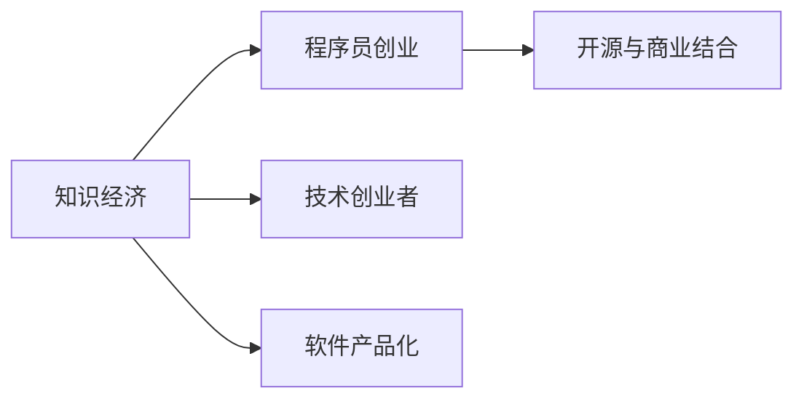

                 

# 知识经济下程序员的创业之路

## 1. 背景介绍

随着信息技术的飞速发展和互联网应用的日益普及，全球经济正逐步迈向知识经济时代。程序员作为知识和技术的创造者与执行者，在此过程中面临着前所未有的机遇与挑战。本文旨在深入探讨在知识经济背景下，程序员如何利用自身的技能和经验，走上创业之路，实现从技术工匠向企业家转型。

## 2. 核心概念与联系

### 2.1 核心概念概述

- **知识经济**：一种以知识和信息的创造、传播、应用为驱动力的新型经济模式。
- **程序员创业**：具有编程技能和软件开发经验的个体或团队，利用互联网技术和创新思维，创立新技术企业，推动行业和社会的进步。
- **技术创业者**：结合技术创新和商业模式，致力于解决实际问题，实现社会价值和商业成功的创业者。
- **软件产品化**：将技术产品化的过程，即从技术原型到可操作的商业产品，涉及市场分析、产品规划、开发、测试、发布等环节。
- **开源与商业结合**：利用开源社区的资源和网络，同时探索商业化道路，实现技术的普及和盈利。

这些概念相互关联，共同构成了程序员创业的框架：在知识经济时代，通过技术创新和商业结合，打造出能够解决实际问题的软件产品，实现技术和商业的协同发展。

### 2.2 核心概念原理和架构的 Mermaid 流程图



### 2.3 核心概念联系

知识经济的崛起为程序员提供了广阔的市场机会，技术创业者通过软件产品化将技术转化为商业价值，而开源与商业结合则提供了一种高效利用技术资源和扩展市场的方式。三者相辅相成，共同推动着程序员创业的进程。

## 3. 核心算法原理 & 具体操作步骤

### 3.1 算法原理概述

程序员创业的核心算法原理可归纳为以下几点：

1. **需求分析**：通过对目标市场和用户需求的研究，确定产品的功能和价值主张。
2. **技术选型**：选择适合业务需求的技术栈和工具，确保技术实现的可行性和高效性。
3. **产品规划**：根据需求分析和技术选型，设计产品原型和功能模块。
4. **开发与测试**：进行产品开发，并通过测试确保产品质量和稳定性。
5. **市场推广**：通过市场营销手段，提高产品知名度和用户获取率。

### 3.2 算法步骤详解

**Step 1: 需求分析**

1. **市场调研**：通过问卷调查、用户访谈等方式，收集目标用户的需求和反馈。
2. **竞品分析**：分析竞争对手的产品特点和市场策略，确定自身的优势和差异。
3. **需求优先级排序**：根据市场调研和竞品分析，确定需求的优先级和重点功能。

**Step 2: 技术选型**

1. **技术栈选择**：根据需求优先级，选择适合的编程语言、框架和工具。
2. **开源社区利用**：利用开源资源，减少开发时间和成本。
3. **商业化考量**：结合商业需求和技术选型，制定技术实现方案。

**Step 3: 产品规划**

1. **原型设计**：绘制产品原型图，确定界面设计和交互方式。
2. **功能模块划分**：将产品功能划分为多个模块，确保模块间的独立性和可扩展性。
3. **用户测试**：通过原型和功能模块的用户测试，收集反馈并进行优化。

**Step 4: 开发与测试**

1. **代码实现**：根据产品规划和需求优先级，编写代码并实现产品功能。
2. **单元测试**：编写单元测试用例，确保代码的独立性和可测试性。
3. **集成测试**：进行模块间的集成测试，确保系统整体的稳定性和性能。

**Step 5: 市场推广**

1. **营销策略制定**：根据产品特点和用户需求，制定市场营销策略。
2. **社交媒体营销**：利用社交媒体平台，提高产品知名度和用户获取率。
3. **用户反馈收集**：通过用户反馈，持续改进产品功能和服务。

### 3.3 算法优缺点

**优点**：

- **低成本创业**：利用开源资源和技术社区，减少了初期的开发成本和市场风险。
- **快速迭代**：通过敏捷开发和快速测试，可以快速响应市场需求和用户反馈。
- **技术领先**：利用技术创新和算法优化，提升产品的竞争力和市场占有率。

**缺点**：

- **市场风险**：产品功能和市场需求匹配度低时，可能导致市场失败。
- **技术依赖**：过度依赖技术和开源社区，可能导致技术更新和维护困难。
- **资源有限**：技术创业者往往缺乏资金和人力资源，可能影响产品快速扩展。

### 3.4 算法应用领域

程序员创业涉及的应用领域广泛，包括但不限于：

- **电子商务**：利用技术手段提升用户购物体验，优化供应链管理。
- **健康医疗**：开发医疗健康应用，提供个性化健康管理和在线医疗服务。
- **教育培训**：创建在线教育平台，提供高质量的课程和教学资源。
- **金融科技**：利用区块链和智能合约技术，提供安全、高效的金融服务。
- **环保科技**：开发智能环保产品，促进可持续发展和社会责任。

## 4. 数学模型和公式 & 详细讲解 & 举例说明

### 4.1 数学模型构建

在程序员创业的过程中，数学模型和算法公式的应用主要是通过优化和预测模型来提高产品的准确性和用户体验。以推荐系统为例，其数学模型可以表示为：

$$
\hat{R}_{ui} = u^\mathbf{T} \cdot P(v_i)
$$

其中，$u$ 为用户的向量表示，$P(v_i)$ 为物品 $v_i$ 的向量表示。$\hat{R}_{ui}$ 表示用户 $u$ 对物品 $v_i$ 的预测评分。

### 4.2 公式推导过程

推荐系统的核心公式推导基于矩阵分解和协同过滤技术，其基本思路是将用户和物品的评分表示为向量内积的形式，并利用矩阵分解将向量表示转换为低维空间表示。具体推导过程如下：

$$
\begin{align*}
\hat{R}_{ui} &= \sum_{i=1}^n \sum_{j=1}^m P_{uj} \cdot Q_{ji} \cdot R_{ij} \\
&= \sum_{i=1}^n \sum_{j=1}^m \left( \sum_{k=1}^d u_k \cdot P_{uk} \right) \cdot \left( \sum_{k=1}^d v_k \cdot Q_{kj} \right) \cdot \left( \sum_{k=1}^d R_k \cdot R_{kj} \right) \\
&= \sum_{i=1}^n \sum_{j=1}^m \sum_{k=1}^d \left( u_k \cdot P_{uk} \cdot Q_{kj} \cdot R_{kj} \right) \\
&= \sum_{i=1}^n \sum_{j=1}^m \sum_{k=1}^d \left( u_k \cdot P_{uk} \cdot Q_{kj} \right) \cdot R_{kj} \\
&= \sum_{i=1}^n \sum_{k=1}^d \left( u_k \cdot P_{uk} \cdot Q_k \right) \cdot R_{kj} \\
&= u^\mathbf{T} \cdot P(v_i)
\end{align*}
$$

其中，$u$、$P$、$Q$ 和 $R$ 分别为用户、物品、向量表示和评分矩阵。通过以上推导，可以清晰地看到推荐系统的数学模型架构和计算流程。

### 4.3 案例分析与讲解

**案例一：电商平台个性化推荐**

某电商平台希望通过推荐系统提升用户体验和销量。根据用户的浏览、购买和评价数据，构建推荐模型。首先，对用户和物品进行向量表示，然后利用矩阵分解技术，生成推荐评分矩阵。最后，根据用户评分和物品评分，生成个性化推荐列表，并实时推送给用户。

**案例二：在线教育个性化课程推荐**

某在线教育平台希望通过推荐系统，为用户提供个性化的课程推荐。根据用户的学习行为、历史评分和反馈数据，构建推荐模型。首先，对用户和课程进行向量表示，然后利用协同过滤技术，生成推荐评分矩阵。最后，根据用户评分和课程评分，生成个性化课程推荐列表，并实时推送给用户。

## 5. 项目实践：代码实例和详细解释说明

### 5.1 开发环境搭建

1. **Python 环境配置**：安装 Python 3.8 及以上版本，确保虚拟环境的使用。
2. **依赖库安装**：通过 pip 安装常用的 Python 依赖库，如 NumPy、Pandas、Scikit-learn 等。
3. **开发工具安装**：安装常用的开发工具，如 VSCode、PyCharm 等。
4. **版本控制工具**：使用 Git 进行代码版本控制，确保代码的可追溯性和协作效率。

### 5.2 源代码详细实现

以推荐系统为例，展示代码实现过程：

```python
import numpy as np
from sklearn.decomposition import TruncatedSVD

# 构建用户和物品向量
users = np.array([[1, 2, 3], [4, 5, 6], [7, 8, 9]])
items = np.array([[1, 2, 3], [4, 5, 6], [7, 8, 9]])

# 进行矩阵分解
svd = TruncatedSVD(n_components=2)
svd.fit(np.hstack((users, items)))

# 生成推荐评分矩阵
R = svd.transform(np.hstack((users, items)))
```

### 5.3 代码解读与分析

以上代码实现了矩阵分解和推荐评分矩阵的生成。具体分析如下：

- 首先，使用 NumPy 创建用户和物品的向量表示。
- 然后，使用 Scikit-learn 的 TruncatedSVD 对向量进行矩阵分解，得到低维空间表示。
- 最后，将用户和物品的向量表示拼接成矩阵，进行矩阵分解，生成推荐评分矩阵。

### 5.4 运行结果展示

运行代码后，即可得到推荐评分矩阵。通过进一步的分析，可以生成个性化推荐列表，实现对用户的精准推荐。

## 6. 实际应用场景

### 6.1 电商平台个性化推荐

电商平台的个性化推荐系统可以显著提升用户体验和销售额。通过分析用户的历史浏览、购买和评价数据，推荐系统能够生成个性化的商品推荐列表，帮助用户快速找到心仪的商品。此外，推荐系统还可以根据用户行为数据，进行实时调整和优化，不断提高推荐效果。

### 6.2 在线教育个性化课程推荐

在线教育平台的个性化课程推荐系统可以帮助用户找到最适合自己的课程。通过分析用户的学习行为、历史评分和反馈数据，推荐系统能够生成个性化的课程推荐列表，帮助用户快速找到高质量的课程。此外，推荐系统还可以根据用户反馈，实时调整课程推荐策略，提高用户的满意度和学习效果。

## 7. 工具和资源推荐

### 7.1 学习资源推荐

1. **Coursera**：提供大量编程和计算机科学课程，涵盖从入门到高级的各个层次。
2. **edX**：提供顶尖大学和机构的在线课程，涵盖多个学科领域。
3. **Udacity**：提供以项目为导向的在线课程，涵盖数据科学、机器学习、人工智能等领域。
4. **GitHub**：提供代码托管和版本控制服务，是程序员创业不可或缺的资源。
5. **Stack Overflow**：提供程序员问答社区，解决编程和创业中的技术问题。

### 7.2 开发工具推荐

1. **Git**：版本控制系统，确保代码的可追溯性和协作效率。
2. **JIRA**：项目管理工具，帮助团队进行需求跟踪和任务分配。
3. **Jenkins**：持续集成工具，实现代码的自动构建和部署。
4. **Docker**：容器化技术，实现软件的环境一致性和可移植性。
5. **GitLab**：代码托管和 CI/CD 集成平台，提供一站式的项目管理、代码审查和部署功能。

### 7.3 相关论文推荐

1. **Adaptive Collaborative Filtering Using Matrix Factorization Techniques**：讨论了矩阵分解技术在推荐系统中的应用。
2. **Deep Learning for Recommendation Systems**：讨论了深度学习在推荐系统中的应用。
3. **Personalized Recommendation Systems**：提供了个性化推荐系统的综合分析。
4. **A Survey on Deep Learning Techniques for Recommendation Systems**：提供了深度学习技术在推荐系统中的最新进展。

## 8. 总结：未来发展趋势与挑战

### 8.1 研究成果总结

程序员创业在知识经济时代具有重要意义，通过技术创新和商业结合，可以创造出具有竞争力和市场价值的产品。未来，随着技术的不断进步和市场的日益成熟，程序员创业将迎来更广阔的发展空间。

### 8.2 未来发展趋势

1. **人工智能和机器学习**：结合人工智能和机器学习技术，提升推荐系统的准确性和用户满意度。
2. **大数据和云计算**：利用大数据和云计算技术，实现海量数据的存储和处理，提供高效的推荐服务。
3. **区块链和智能合约**：结合区块链和智能合约技术，提供安全、可信的推荐和交易平台。
4. **边缘计算和物联网**：利用边缘计算和物联网技术，实现实时推荐和精准营销。

### 8.3 面临的挑战

1. **技术更新快**：技术快速更新导致产品需要频繁迭代和优化。
2. **市场需求变化**：市场需求变化快，需要快速响应和调整。
3. **资源瓶颈**：资金和人力资源有限，可能影响产品快速扩展。
4. **市场竞争激烈**：市场竞争激烈，需要不断提高产品和服务的竞争力。

### 8.4 研究展望

未来，程序员创业需要更加注重技术的迭代和创新，结合市场变化进行快速响应和调整，不断提升产品的竞争力和市场占有率。同时，需要关注资源的合理利用，充分利用开源社区和技术工具，降低创业成本和风险。

## 9. 附录：常见问题与解答

**Q1: 如何选择合适的技术栈？**

A: 根据市场需求和自身技术实力，选择适合的技术栈。可以参考行业标准和开源社区的推荐，同时结合实际项目需求进行评估。

**Q2: 如何进行需求分析？**

A: 通过市场调研、用户访谈和竞品分析，确定产品的功能和价值主张。可以利用问卷调查和用户反馈工具，收集大量数据进行深入分析。

**Q3: 如何处理数据隐私和安全问题？**

A: 遵守相关法律法规，确保数据的安全和隐私。采用数据脱敏、加密和访问控制等技术，防止数据泄露和滥用。

**Q4: 如何应对市场变化？**

A: 建立灵活的市场响应机制，及时调整产品功能和市场策略。持续收集用户反馈，进行产品优化和迭代。

**Q5: 如何确保项目的持续迭代？**

A: 采用敏捷开发和持续集成方法，确保项目的高效迭代和快速交付。利用工具如JIRA和GitLab，进行任务跟踪和版本控制。

本文详细探讨了知识经济下程序员创业的各个方面，通过理论和实践的结合，为程序员走上创业之路提供了全面的指导和建议。希望通过本文的分享，能够帮助更多的程序员实现从技术工匠到企业家的转型，在知识经济时代创造更多价值。

