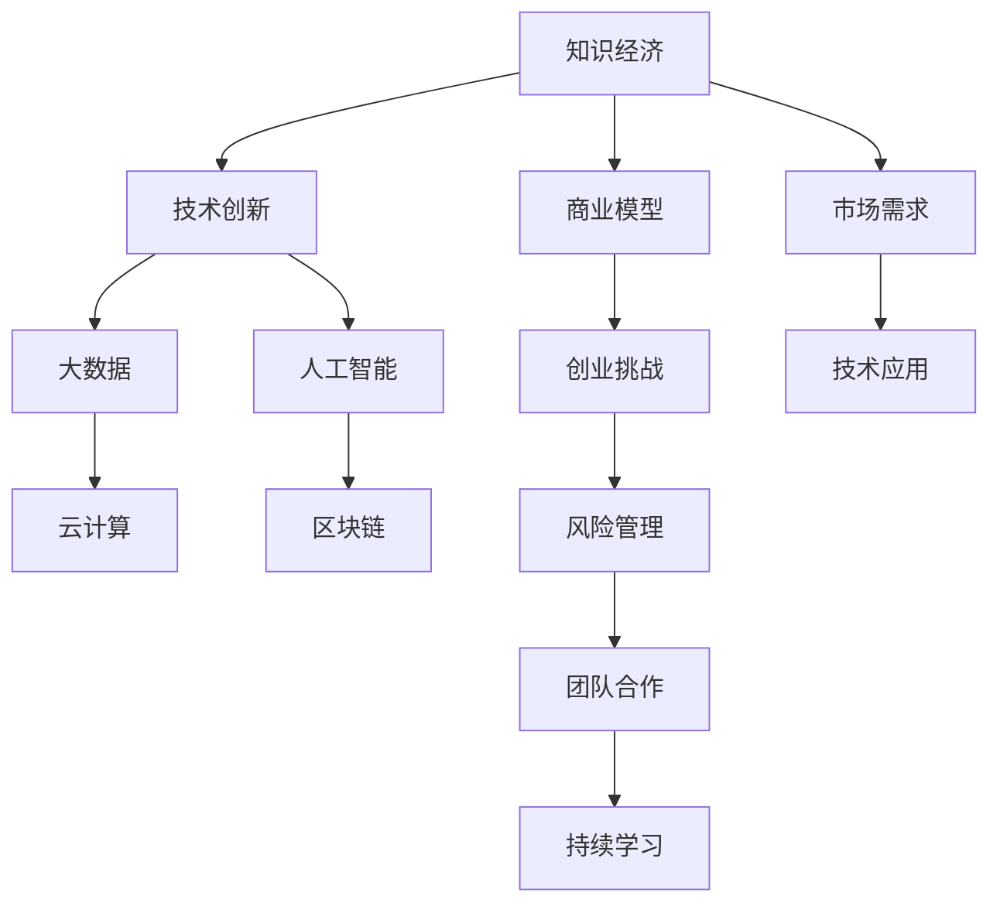

                 

# 知识经济下程序员的创业思路

> 关键词：知识经济,程序员,创业思路,技术创新,人工智能,大数据,云计算,区块链,商业模型,创业挑战

## 1. 背景介绍

### 1.1 问题由来

在21世纪，全球经济正向知识经济转型。传统的制造业、农业等行业逐步被信息技术、数字经济所取代，知识和技术成为推动经济增长、提高竞争力的关键要素。技术创新和信息技术应用，成为各国竞相争夺的战略高地。在这个大背景下，程序员们面临着前所未有的机遇和挑战。

一方面，知识经济需要大量高素质、高技能的程序员，推动技术进步，创新产品和服务。程序员们可以通过创业，实现自身价值，同时也为社会创造财富。另一方面，新技术不断涌现，行业需求多变，程序员需要不断学习和适应，才能在激烈的市场竞争中立足。

### 1.2 问题核心关键点

程序员创业成功的关键在于以下几点：
1. **技术优势**：掌握前沿技术，具备持续学习的能力。
2. **市场洞察**：深入理解市场需求，找到技术应用的切入点。
3. **商业模式**：设计有效的商业模式，确保项目有稳定的盈利模式。
4. **团队合作**：组建优秀的团队，分工明确，各司其职。
5. **风险管理**：评估项目风险，制定应对策略，减少不确定性。

## 2. 核心概念与联系

### 2.1 核心概念概述

为更好地理解程序员的创业思路，我们首先介绍几个关键概念：

- **知识经济**：一种以知识和信息为核心的经济模式，强调知识的创新、应用和增值。
- **技术创新**：通过新技术的开发和应用，提升产品或服务的竞争力和效率。
- **大数据**：大规模数据集的分析处理，用于支持决策和优化。
- **人工智能**：使机器具备人类智能的技术，包括机器学习、深度学习等。
- **云计算**：通过网络提供计算和存储资源，按需使用，按量计费。
- **区块链**：去中心化的分布式账本技术，保证数据透明、安全。
- **商业模型**：企业的商业模式设计，包括产品、定价、渠道、客户等要素。
- **创业挑战**：在创业过程中可能遇到的各种问题和挑战。

这些概念共同构成了程序员创业的基本框架，帮助理解创业的路径和策略。

### 2.2 核心概念原理和架构的 Mermaid 流程图



该流程图展示了知识经济下程序员创业的关键环节及其联系。

## 3. 核心算法原理 & 具体操作步骤

### 3.1 算法原理概述

程序员创业的核心在于将技术优势转化为商业价值。其核心算法原理可以概括为以下几个步骤：

1. **需求分析**：深入理解市场需求，找到技术应用的切入点。
2. **技术研发**：结合市场需求，开发创新技术，提升产品或服务的竞争力。
3. **商业模式设计**：设计有效的商业模式，确保项目有稳定的盈利模式。
4. **市场验证**：通过小范围试点或MVP验证商业模式和产品，获取用户反馈。
5. **持续优化**：根据市场反馈和用户需求，持续优化产品和技术，提升用户体验。

### 3.2 算法步骤详解

**步骤1：需求分析**

- **市场调研**：通过市场调研，了解用户需求和痛点，找到潜在市场。
- **竞品分析**：分析竞争对手的产品和服务，找到差异化点，确定市场切入点。
- **用户访谈**：与目标用户进行访谈，获取详细需求和期望，指导产品设计。

**步骤2：技术研发**

- **技术选型**：根据需求分析，选择合适的技术栈，进行技术调研。
- **技术开发**：根据技术栈，设计产品架构和技术细节，开发核心功能。
- **原型设计**：制作MVP（最小可行产品）原型，验证核心功能。

**步骤3：商业模式设计**

- **盈利模式**：确定项目的盈利模式，如广告、订阅、交易手续费等。
- **定价策略**：设计合理的定价策略，确保产品和服务的竞争力。
- **渠道策略**：选择合适的销售和推广渠道，扩大市场覆盖。

**步骤4：市场验证**

- **小范围试点**：在小范围市场推出试点版本，收集用户反馈。
- **用户测试**：进行用户测试，获取真实使用数据，分析产品问题。
- **迭代优化**：根据测试结果，优化产品功能和用户体验，提升产品竞争力。

**步骤5：持续优化**

- **用户反馈**：持续收集用户反馈，了解用户需求和痛点。
- **数据分析**：通过数据分析，挖掘用户行为和市场需求，指导产品改进。
- **技术升级**：根据市场趋势和技术发展，持续更新产品技术，保持竞争力。

### 3.3 算法优缺点

**优点**：
- **技术驱动**：技术优势明显，有助于提升产品竞争力。
- **快速迭代**：持续优化产品，提升用户体验。
- **市场灵活**：可以根据市场需求快速调整方向，抓住商机。

**缺点**：
- **风险高**：创业过程中存在较高的技术风险和市场风险。
- **资源投入**：创业初期需要大量资源投入，包括资金、人力等。
- **市场竞争**：市场上已有大量竞争者，需要精准定位，找到差异化优势。

### 3.4 算法应用领域

程序员创业的思路适用于多个领域，包括但不限于：

- **人工智能**：开发AI产品和服务，如智能助手、智能推荐等。
- **大数据**：利用大数据分析，提供商业洞察和决策支持。
- **云计算**：提供云服务解决方案，如SaaS、PaaS等。
- **区块链**：开发区块链应用，如数字货币、智能合约等。
- **物联网**：开发IoT设备和管理平台，提高设备互联互通性。
- **教育培训**：开发在线教育平台，提供个性化学习方案。
- **健康医疗**：开发医疗健康应用，如在线诊疗、健康管理等。

## 4. 数学模型和公式 & 详细讲解

### 4.1 数学模型构建

这里我们将以一个典型的人工智能创业项目为例，构建数学模型。假设我们开发了一个智能推荐系统，该系统能够根据用户的历史行为数据和兴趣，推荐个性化的商品或服务。我们的目标是最小化预测误差，最大化用户满意度。

### 4.2 公式推导过程

我们采用线性回归模型来预测用户对推荐商品的评分，公式如下：

$$
\hat{y} = \theta_0 + \theta_1x_1 + \theta_2x_2 + ... + \theta_nx_n
$$

其中，$x_i$ 为影响用户评分的特征向量，$\theta_i$ 为模型参数，$\hat{y}$ 为预测评分，$y$ 为真实评分。

根据最小二乘法，我们求解最小化预测误差的模型参数：

$$
\hat{\theta} = \mathop{\arg\min}_{\theta} \sum_{i=1}^N (y_i - \hat{y}_i)^2
$$

通过求解上述优化问题，可以得到最优的模型参数 $\hat{\theta}$。

### 4.3 案例分析与讲解

以一个电商平台为例，我们收集了用户的历史浏览记录、购买记录和评分数据，将其作为训练数据。采用上述线性回归模型，在训练集上训练模型，得到最优参数 $\hat{\theta}$。在测试集上评估模型性能，通过计算均方误差（MSE）来衡量模型的预测能力。

## 5. 项目实践：代码实例和详细解释说明

### 5.1 开发环境搭建

- **编程语言**：Python、Java等主流编程语言。
- **开发环境**：Jupyter Notebook、IDE等。
- **开发工具**：Git、Docker、Kubernetes等。
- **数据处理工具**：Pandas、Scikit-learn、TensorFlow等。

### 5.2 源代码详细实现

这里提供一个简单的线性回归模型的Python代码实现，用于预测用户评分：

```python
import pandas as pd
import numpy as np
from sklearn.linear_model import LinearRegression

# 加载数据
data = pd.read_csv('user_bean.csv')

# 分割数据集
train_data = data[:8000]
test_data = data[8000:]

# 特征工程
train_features = train_data.drop('label', axis=1)
train_labels = train_data['label']
test_features = test_data.drop('label', axis=1)
test_labels = test_data['label']

# 模型训练
model = LinearRegression()
model.fit(train_features, train_labels)

# 模型预测
predictions = model.predict(test_features)

# 评估指标
mse = np.mean((predictions - test_labels)**2)
print('MSE:', mse)
```

### 5.3 代码解读与分析

**特征工程**：
- **数据加载**：使用Pandas加载数据，便于数据处理和分析。
- **数据分割**：将数据集分为训练集和测试集，用于模型训练和评估。
- **特征选择**：选择与预测目标相关的特征，去除冗余特征。

**模型训练**：
- **模型选择**：选择线性回归模型作为预测模型，简单易用，计算高效。
- **模型训练**：在训练集上训练模型，得到最优参数。
- **模型预测**：在测试集上使用模型进行预测，生成预测结果。

**评估指标**：
- **均方误差**：计算预测结果与真实标签之间的差异，评估模型性能。

## 6. 实际应用场景

### 6.1 电商平台智能推荐系统

在电商平台，智能推荐系统能够根据用户历史行为数据，推荐个性化的商品。系统基于用户的浏览、点击、购买等行为，构建用户画像，通过机器学习模型，预测用户对商品的需求，提供推荐。这种推荐系统能够显著提高用户满意度和购买转化率，为平台带来更高的用户粘性和收入。

### 6.2 在线教育个性化学习系统

在线教育平台通过智能推荐系统，提供个性化学习方案，帮助学生高效学习。系统收集学生的学习数据，包括观看视频、完成作业、测试成绩等，利用机器学习模型，分析学生的学习行为和知识掌握情况，推荐适合的学习资源和练习题。这种系统能够提高学生的学习效率，提升整体教学质量。

### 6.3 医疗健康智能诊断系统

医疗健康领域，智能诊断系统能够根据病人的病历、症状和检查结果，预测疾病风险，提供诊断建议。系统通过收集大量医疗数据，训练机器学习模型，预测疾病发生的概率，推荐治疗方案。这种系统能够帮助医生做出更准确的诊断，减少误诊和漏诊。

## 7. 工具和资源推荐

### 7.1 学习资源推荐

1. **在线课程**：如Coursera、Udacity等，提供机器学习和人工智能相关课程，帮助程序员学习新技术和工具。
2. **开源项目**：如GitHub、Apache等，提供丰富的开源项目资源，便于学习和复用。
3. **技术社区**：如Stack Overflow、Kaggle等，提供技术交流和问题解答平台，帮助程序员解决技术难题。

### 7.2 开发工具推荐

1. **IDE**：如Visual Studio Code、PyCharm等，提供开发环境集成，提高开发效率。
2. **版本控制**：如Git、SVN等，提供代码版本控制，便于团队协作。
3. **容器化**：如Docker、Kubernetes等，提供容器化部署，提高系统可靠性。

### 7.3 相关论文推荐

1. **深度学习**：《Deep Learning》by Ian Goodfellow。
2. **机器学习**：《Pattern Recognition and Machine Learning》by Christopher Bishop。
3. **数据分析**：《Python for Data Analysis》by Wes McKinney。

## 8. 总结：未来发展趋势与挑战

### 8.1 总结

本文对知识经济下程序员的创业思路进行了详细分析。通过介绍核心概念和算法原理，展示了程序员创业的关键步骤和方法。结合实际应用场景，讨论了程序员创业的潜在价值和挑战。

### 8.2 未来发展趋势

1. **技术发展**：随着人工智能和机器学习技术的不断进步，程序员可以通过不断学习和应用新技术，提高产品和服务的竞争力。
2. **市场需求**：随着知识经济的深入发展，市场需求将不断增加，为程序员创业提供了广阔的空间。
3. **跨界融合**：互联网、医疗、教育等领域的融合趋势将为程序员创业带来新的机遇。
4. **政策支持**：各国政府对创新创业的支持政策，将为程序员创业提供更多资源和支持。

### 8.3 面临的挑战

1. **技术复杂**：新技术的发展速度和复杂度，要求程序员具备更高的技术水平。
2. **市场竞争**：市场上已有大量竞争者，需要精准定位，找到差异化优势。
3. **资金压力**：创业初期需要大量资金投入，资金不足可能导致项目失败。
4. **人才短缺**：高素质人才资源紧张，导致创业项目难以快速推进。

### 8.4 研究展望

未来的研究将侧重于以下几个方面：
1. **技术创新**：开发更多前沿技术，如自然语言处理、计算机视觉等，推动技术进步。
2. **市场开拓**：开拓更多应用场景，挖掘潜在市场机会，提升产品覆盖面。
3. **团队建设**：组建更专业的团队，提高团队协作和创新能力。
4. **风险管理**：评估项目风险，制定应对策略，确保项目顺利推进。

总之，程序员在知识经济下创业，需要不断学习和适应新技术，深入理解市场需求，设计有效的商业模式，组建优秀的团队，才能在激烈的市场竞争中取得成功。未来，随着技术的发展和市场需求的增加，程序员创业将迎来更多机遇和挑战。

## 9. 附录：常见问题与解答

**Q1：程序员创业与传统创业有何不同？**

A: 程序员创业强调技术优势和产品创新，注重技术实现和算法优化。而传统创业更多依赖于商业模式、市场运营和团队管理。

**Q2：如何评估一个创业项目的潜力？**

A: 评估项目潜力需要考虑市场需求、竞争环境、技术难度、团队实力等多个方面。通过市场调研和用户测试，获取真实数据和反馈，才能做出准确判断。

**Q3：如何降低创业风险？**

A: 降低创业风险需要从多个维度进行评估和准备，如市场调研、风险评估、团队建设、资金筹措等。选择合适的商业模式和合理的定价策略，也能有效降低风险。

**Q4：程序员创业时需要注意哪些法律和道德问题？**

A: 程序员创业时需要注意数据隐私、知识产权、商业保密等法律问题，确保技术和数据的安全性。同时，要遵守道德规范，避免滥用技术带来的负面影响。

**Q5：如何应对创业失败？**

A: 创业失败是常见现象，需要积极面对和总结经验。及时调整方向，学习失败教训，积累经验和资源，为下一次创业做好准备。

---

作者：禅与计算机程序设计艺术 / Zen and the Art of Computer Programming

