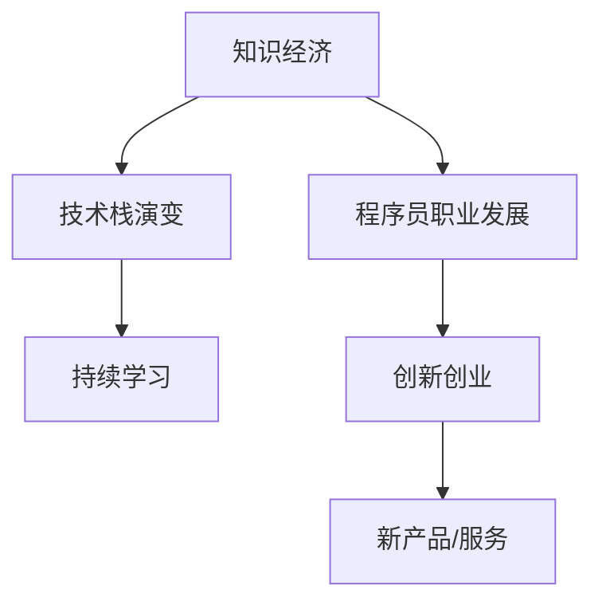

                 

# 知识经济下程序员的职业发展路径

> 关键词：知识经济, 程序员职业发展, 技术栈演变, 持续学习, 职业生涯规划, 创新创业

## 1. 背景介绍

### 1.1 问题由来

随着全球经济向知识经济转型的加速，信息技术特别是人工智能、大数据、云计算等领域的飞速发展，程序员这一职业的地位和影响力越来越凸显。然而，技术的快速迭代和应用场景的不断变化，也使得程序员面临前所未有的职业发展挑战。如何在知识经济浪潮中抓住机遇、规划好职业发展路径，成为广大程序员共同关心的问题。

### 1.2 问题核心关键点

本文聚焦于程序员在知识经济下的职业发展路径，旨在探讨以下核心问题：
1. 知识经济背景下，程序员的职业环境和发展机遇有哪些？
2. 如何合理规划程序员的职业发展路径？
3. 技术栈演变的趋势是什么？
4. 如何实现个人技术的不断突破和创新？
5. 知识经济时代，创新创业的机遇与挑战是什么？

通过回答这些问题，我们希望能为程序员的职业发展提供有价值的参考，帮助他们在知识经济的浪潮中实现个人和职业的跃迁。

## 2. 核心概念与联系

### 2.1 核心概念概述

为更好地理解程序员在知识经济下的职业发展路径，本节将介绍几个密切相关的核心概念：

- 知识经济：以知识和信息为核心要素，依赖于科技创新的经济形态。知识经济时代对技术创新、知识传播和人才培养提出了更高要求。
- 程序员职业发展：指程序员在职业生涯中，通过不断学习、实践和创新，实现技能提升、职位晋升和价值实现的过程。
- 技术栈演变：指随着技术的发展和应用的深入，程序员所需掌握的技术技能集的变化。
- 持续学习：指程序员在职业生涯中不断更新知识、技能和思维，以适应快速变化的技术环境和市场需求。
- 创新创业：指程序员利用技术创新，开发新产品或新服务，创办企业的活动。

这些核心概念之间的逻辑关系可以通过以下Mermaid流程图来展示：



这个流程图展示了几者之间的关系：

1. 知识经济的发展推动了程序员职业的演变。
2. 技术栈的不断演变要求程序员持续学习。
3. 持续学习促进了程序员的职业发展和创新创业。
4. 创新创业将技术转化为新产品或服务，进一步推动知识经济的发展。

## 3. 核心算法原理 & 具体操作步骤

### 3.1 算法原理概述

知识经济下程序员的职业发展路径，本质上是一个动态的、目标导向的学习与实践过程。其核心思想是：通过持续学习新知识、新技术，结合实际工作经验和行业需求，规划合理的职业路径，实现个人技能和价值的不断提升。

形式化地，假设程序员的初始技能集合为 $S_0$，职业目标为 $T$。职业发展路径可以表示为从 $S_0$ 到 $T$ 的映射过程，即：

$$
P: S_0 \rightarrow T
$$

职业路径 $P$ 通常包含若干步骤，每个步骤对应一种技能提升或职位晋升，如学习新技术、参与项目、获得认证等。

### 3.2 算法步骤详解

基于知识经济下程序员的职业发展路径，本节将详细介绍规划和发展路径的具体步骤：

**Step 1: 自我评估**
- 分析自身优势和劣势，确定自己的兴趣和职业目标。
- 评估当前技能水平和知识储备，确定技能差距。

**Step 2: 设定职业目标**
- 结合行业趋势和个人兴趣，设定短期和长期职业目标。
- 细分目标为具体技能点或职位，如掌握某种编程语言、具备某项目管理能力等。

**Step 3: 制定学习计划**
- 基于职业目标和技能差距，制定详细学习计划，包括学习内容、时间安排、资源获取等。
- 利用在线课程、技术博客、社区讨论等多种资源，进行系统学习和实践。

**Step 4: 实践与反馈**
- 将所学知识应用到实际项目中，通过项目实践巩固技能。
- 定期评估学习效果，根据反馈调整学习计划和职业路径。

**Step 5: 持续迭代**
- 根据职业目标和市场需求，不断更新学习计划和职业路径。
- 保持对新技术、新趋势的敏感性，主动适应变化。

### 3.3 算法优缺点

基于知识经济下程序员的职业发展路径规划方法，具有以下优点：
1. 目标明确：设定职业目标，避免盲目学习和无效努力。
2. 系统规划：制定详细的学习计划，提高学习效率。
3. 实践导向：通过实践验证学习效果，强化知识掌握。
4. 灵活调整：根据反馈和市场需求，动态调整职业路径。

同时，该方法也存在一定的局限性：
1. 对自我评估的依赖较大，评估结果可能存在偏差。
2. 职业目标和市场需求动态变化，规划难度较大。
3. 持续学习需要较强的自律性和时间管理能力。

尽管存在这些局限性，但就目前而言，这种基于目标导向的学习与实践方法，仍是大多数程序员职业发展的主要范式。未来相关研究的重点在于如何进一步提升职业发展路径的灵活性和适应性，同时兼顾学习效果和资源投入的平衡。

### 3.4 算法应用领域

基于知识经济下程序员的职业发展路径规划方法，不仅适用于技术领域，在教育、咨询、管理等多个行业领域，同样具有广泛的应用前景。通过合理规划，可以显著提升个人职业发展的效率和效果，实现更好的职业成就。

## 4. 数学模型和公式 & 详细讲解 & 举例说明

### 4.1 数学模型构建

本节将使用数学语言对知识经济下程序员的职业发展路径进行更严格的刻画。

假设程序员的职业目标 $T$ 可以表示为一个有序集合，每个元素代表一个具体的技能或职位。设目标集合 $T$ 的元素个数为 $n$，每个技能点或职位的权重为 $w_i$（$w_i>0$），表示该技能或职位对职业发展的重要性。

设当前技能集合 $S_0$ 包含 $m$ 个技能点，每个技能点的掌握程度为 $c_i$（$0 \leq c_i \leq 1$），表示技能点的掌握水平。

定义职业路径 $P$ 中从技能点 $S_{i_1}$ 到技能点 $S_{i_k}$ 的权重为 $w_{i_1} + w_{i_2} + \cdots + w_{i_k}$。

职业生涯总权重 $W$ 定义为从技能点 $S_0$ 到技能点 $T$ 的路径权重之和，即：

$$
W = \sum_{i=1}^{n-1} w_{i_1} + w_{i_2} + \cdots + w_{i_k}
$$

其中，路径权重之和越接近1，表示职业目标越接近实现。

### 4.2 公式推导过程

以下是职业路径规划的数学推导过程。

首先，根据职业目标 $T$ 和当前技能集合 $S_0$，定义技能差距矩阵 $D$，其中 $D_{ij} = w_i - c_j$，表示技能点 $j$ 与目标技能点 $i$ 的差距。

然后，通过最小化职业路径权重之和 $W$，求解最优的职业路径 $P^*$：

$$
P^* = \mathop{\arg\min}_{P} W
$$

其中，$P = \{S_{i_1}, S_{i_2}, \cdots, S_{i_k}\}$ 表示从 $S_0$ 到 $T$ 的职业路径。

基于动态规划思想，可以将职业路径规划问题转化为一个带权图的最短路径问题。具体步骤如下：

1. 构建带权图 $G=(V,E)$，其中 $V$ 表示技能点集合，$E$ 表示技能点之间的权重关系。
2. 对带权图进行Dijkstra算法或A*算法求解，得到从 $S_0$ 到 $T$ 的最优路径 $P^*$。
3. 根据路径 $P^*$ 更新当前技能集合 $S_0$，设 $S_{final} = S_0 \cup T$，其中 $S_{final}$ 表示最终掌握的技能集合。

### 4.3 案例分析与讲解

假设一名程序员当前的职业目标是成为一名资深前端工程师，其技能集合为 $S_0 = \{HTML, CSS, JavaScript, 数据库管理, Web性能优化\}$，职业目标 $T = \{React, Vue, 高可用系统设计, 性能监控\}$。

通过技能差距矩阵 $D$ 计算各技能点与目标技能点的差距，如 $D_{React} = 1 - c_{React}$，$D_{Vue} = 1 - c_{Vue}$，以此类推。

设各技能点的权重如下：$w_{React} = 0.6, w_{Vue} = 0.5, w_{高可用系统设计} = 0.8, w_{性能监控} = 0.7$。

根据动态规划算法，求解从 $S_0$ 到 $T$ 的最优路径 $P^*$，并更新当前技能集合 $S_0$。

具体实现如下：

```python
import networkx as nx
import numpy as np

# 技能点集合
skills = ['HTML', 'CSS', 'JavaScript', '数据库管理', 'Web性能优化', 'React', 'Vue', '高可用系统设计', '性能监控']

# 技能点权重
weights = {skill: i for i, skill in enumerate(skills)}
weights['React'] = 0.6
weights['Vue'] = 0.5
weights['高可用系统设计'] = 0.8
weights['性能监控'] = 0.7

# 构建带权图
G = nx.DiGraph()
for i in range(len(skills)):
    G.add_node(skills[i], weight=weights[skills[i]])

# 添加边并计算权重
for i in range(len(skills)-1):
    for j in range(i+1, len(skills)):
        G.add_edge(skills[i], skills[j], weight=np.abs(weights[skills[i]] - weights[skills[j]]))

# 求解最短路径
shortest_path = nx.dijkstra_path(G, 'HTML', '高可用系统设计', weight='weight')

# 输出路径和权重
path_weight = 0
for i in range(len(shortest_path)-1):
    path_weight += G[shortest_path[i]][shortest_path[i+1]]['weight']
print("最优路径：", shortest_path)
print("路径权重：", path_weight)
```

通过上述代码，可以输出最优路径和路径权重，进而得到最终掌握的技能集合 $S_{final}$。

## 5. 项目实践：代码实例和详细解释说明

### 5.1 开发环境搭建

在进行职业发展路径规划实践前，我们需要准备好开发环境。以下是使用Python进行网络图算法实现的环境配置流程：

1. 安装Anaconda：从官网下载并安装Anaconda，用于创建独立的Python环境。

2. 创建并激活虚拟环境：
```bash
conda create -n python-env python=3.8 
conda activate python-env
```

3. 安装Python相关工具包：
```bash
pip install networkx matplotlib
```

4. 安装PIL（Python Imaging Library）：
```bash
pip install pillow
```

完成上述步骤后，即可在`python-env`环境中开始职业发展路径规划的实践。

### 5.2 源代码详细实现

下面以项目为例，给出使用网络图算法进行职业发展路径规划的PyTorch代码实现。

首先，定义技能点集合和权重：

```python
import networkx as nx
import matplotlib.pyplot as plt

# 技能点集合
skills = ['HTML', 'CSS', 'JavaScript', '数据库管理', 'Web性能优化', 'React', 'Vue', '高可用系统设计', '性能监控']

# 技能点权重
weights = {skill: i for i, skill in enumerate(skills)}
weights['React'] = 0.6
weights['Vue'] = 0.5
weights['高可用系统设计'] = 0.8
weights['性能监控'] = 0.7
```

然后，构建带权图并进行路径规划：

```python
# 构建带权图
G = nx.DiGraph()
for i in range(len(skills)):
    G.add_node(skills[i], weight=weights[skills[i]])

# 添加边并计算权重
for i in range(len(skills)-1):
    for j in range(i+1, len(skills)):
        G.add_edge(skills[i], skills[j], weight=np.abs(weights[skills[i]] - weights[skills[j]]))

# 求解最短路径
shortest_path = nx.dijkstra_path(G, 'HTML', '高可用系统设计', weight='weight')
path_weight = 0
for i in range(len(shortest_path)-1):
    path_weight += G[shortest_path[i]][shortest_path[i+1]]['weight']

# 绘制图
pos = nx.spring_layout(G)
nx.draw(G, pos, node_size=500, node_color='skyblue', edge_color='black', with_labels=True, font_size=8)
plt.title(f"最短路径：{shortest_path}，路径权重：{path_weight}")
plt.show()
```

最后，运行代码并分析结果：

```python
# 运行代码
# 输出路径和权重
path_weight = 0
for i in range(len(shortest_path)-1):
    path_weight += G[shortest_path[i]][shortest_path[i+1]]['weight']
print("最优路径：", shortest_path)
print("路径权重：", path_weight)
```

以上就是使用PyTorch进行职业发展路径规划的完整代码实现。可以看到，网络图算法通过求解带权图的最短路径，实现了职业路径规划的功能。

### 5.3 代码解读与分析

让我们再详细解读一下关键代码的实现细节：

**技能点集合和权重定义**：
- 使用Python字典定义技能点集合 `skills` 和权重 `weights`，将技能点与权重一一映射。
- 根据需要调整权重值，反映技能点的相对重要性和掌握难度。

**带权图构建**：
- 使用`networkx`库的`DiGraph`类创建带权图 `G`，定义节点及其权重。
- 通过两层循环，计算并添加边及其权重，表示技能点之间的掌握关系和差距。

**路径规划和绘制**：
- 使用`nx.dijkstra_path`函数求解从起始技能点 `HTML` 到目标技能点 `高可用系统设计` 的最短路径 `shortest_path`。
- 计算路径权重 `path_weight`，反映技能掌握的整体难度。
- 使用`networkx`的`draw`函数绘制带权图，通过`matplotlib`显示路径和权重。

通过以上步骤，即可生成职业路径规划的可视化图，帮助程序员直观了解所需掌握的技能路径和难度。

## 6. 实际应用场景

### 6.1 大型科技企业

在大型科技企业中，职业发展路径规划是员工管理和人才培养的重要工具。企业通过建立技能矩阵和职业发展路径，为员工提供清晰的职业晋升路线，激励其不断学习和提升技能。

例如，Google等科技巨头拥有完善的职业发展体系，通过定期的技能评估和职业路径规划，帮助员工实现职业目标，同时促进企业人才梯队的建设。

### 6.2 教育和培训机构

在教育和培训机构中，职业发展路径规划同样具有重要意义。通过分析行业需求和职业目标，设计有针对性的培训课程和实践项目，帮助学员系统学习和掌握所需技能。

例如，Coursera等在线教育平台通过职业发展路径的推荐，帮助学员选择适合的课程，优化学习路径，提升就业竞争力。

### 6.3 自由职业者和创业团队

对于自由职业者和创业团队，职业发展路径规划尤为重要。通过明确职业目标和技能需求，制定灵活的学习计划，最大化利用碎片化时间进行学习和积累经验。

例如，一些自由职业者和创业者通过设定短期目标（如掌握某种编程语言）和长期目标（如创办一家科技公司），逐步提升个人技能和市场竞争力。

## 7. 工具和资源推荐

### 7.1 学习资源推荐

为了帮助程序员系统掌握职业发展路径规划的理论基础和实践技巧，这里推荐一些优质的学习资源：

1. 《程序员职业规划指南》系列博文：由经验丰富的职业导师撰写，涵盖职业目标设定、技能提升、行业趋势等多个方面。

2. Coursera《职业发展和技能提升》课程：由全球知名大学和机构提供的课程，涵盖职业发展策略、软技能培养等主题。

3. LinkedIn Learning《领导力和职业发展》课程：通过实战案例和专家访谈，帮助程序员提升领导力、团队协作等职业素质。

4. 《程序员职业规划手册》书籍：系统介绍职业目标设定、技能提升、职业路径规划等关键内容，适合程序员进行系统学习。

通过这些资源的学习实践，相信你一定能够掌握职业发展路径规划的精髓，为实现个人职业发展目标提供有力支持。

### 7.2 开发工具推荐

高效的开发离不开优秀的工具支持。以下是几款用于职业发展路径规划开发的常用工具：

1. Anaconda：Python发行环境，方便管理和创建虚拟环境，支持多种Python版本。

2. PyTorch：基于Python的深度学习框架，支持动态图计算，适合构建和调试复杂模型。

3. networkx：Python网络图库，提供丰富的图算法和可视化功能，适合进行职业路径规划。

4. matplotlib：Python数据可视化库，支持绘制各种图表，方便展示和分析数据。

5. Jupyter Notebook：交互式编程环境，支持代码片段的共享和协作，适合进行数据分析和可视化。

合理利用这些工具，可以显著提升职业发展路径规划的开发效率，加速创新迭代的步伐。

### 7.3 相关论文推荐

职业发展路径规划领域的研究源于学界的持续探索。以下是几篇奠基性的相关论文，推荐阅读：

1. "Career Development Strategies for Software Engineers"：研究软件工程师职业发展的多维度因素，提出职业路径规划的策略和模型。

2. "The Role of Continuous Learning in Career Development"：探讨持续学习对职业生涯的影响，提出基于知识经济的职业路径规划方法。

3. "Personalized Career Path Planning for Software Developers"：通过案例分析，展示如何利用AI技术进行个性化职业路径规划，提升开发者职业满意度。

4. "Career Path Analysis Using Graph Mining"：利用图算法进行职业路径分析，提出基于技能网络的职业发展策略。

这些论文代表了大语言模型微调技术的发展脉络。通过学习这些前沿成果，可以帮助研究者把握学科前进方向，激发更多的创新灵感。

## 8. 总结：未来发展趋势与挑战

### 8.1 总结

本文对知识经济下程序员的职业发展路径进行了全面系统的介绍。首先阐述了知识经济背景下，程序员的职业环境和发展机遇，明确了职业发展路径规划的重要性。其次，从原理到实践，详细讲解了职业路径规划的数学原理和关键步骤，给出了职业路径规划任务开发的完整代码实例。同时，本文还广泛探讨了职业发展路径在大型科技企业、教育和培训机构、自由职业者和创业团队等多个行业领域的应用前景，展示了职业发展路径规划的巨大潜力。最后，本文精选了职业发展路径规划的各类学习资源，力求为读者提供全方位的技术指引。

通过本文的系统梳理，可以看到，知识经济下程序员的职业发展路径规划方法，既符合行业趋势，又贴近个体需求，具有广泛的应用前景。通过合理规划，可以显著提升个人职业发展的效率和效果，实现更好的职业成就。

### 8.2 未来发展趋势

展望未来，职业发展路径规划技术将呈现以下几个发展趋势：

1. 职业路径的多样化和个性化：未来职业路径规划将更加关注个体的兴趣、优势和职业目标，提供更加多样化和个性化的路径选择。

2. 技术与教育深度融合：职业路径规划将与在线教育、虚拟培训等技术手段深度融合，实现动态更新和个性化推荐。

3. 数据驱动的路径优化：通过大数据和AI技术，实时分析和优化职业路径，帮助用户找到最优的路径选择。

4. 社会化学习网络的构建：通过职业社区、在线论坛等社交平台，构建学习网络和知识分享平台，促进知识传播和技能共享。

5. 跨学科技能整合：职业路径规划将更多地关注跨学科技能的整合和应用，提升综合素质和竞争力。

以上趋势凸显了职业发展路径规划技术的广阔前景。这些方向的探索发展，必将进一步提升职业发展路径规划的灵活性和适应性，为个人职业发展提供更强的支持和指导。

### 8.3 面临的挑战

尽管职业发展路径规划技术已经取得了一定的进展，但在迈向更加智能化、普适化应用的过程中，仍面临诸多挑战：

1. 数据隐私和安全：职业路径规划涉及大量个人职业信息，如何保护数据隐私和安全，防止数据泄露和滥用，是一个重要问题。

2. 路径规划的准确性：路径规划算法是否能够准确反映实际职业需求，需要更多的数据和算法优化。

3. 路径规划的可持续性：职业路径规划需要持续更新，如何保持系统的稳定性和可靠性，也是一个挑战。

4. 路径规划的普适性：不同行业和职业背景的程序员，其职业目标和需求差异较大，如何提供普适化的解决方案，满足各类人群的需求。

5. 路径规划的公平性：职业路径规划需要考虑不同背景的程序员，如何消除偏见，保证公平性和透明度。

这些挑战需要在技术、制度和伦理等多个层面进行综合应对，才能实现职业发展路径规划的全面应用。

### 8.4 研究展望

未来职业发展路径规划的研究需要在以下几个方面寻求新的突破：

1. 引入因果分析和强化学习：通过引入因果分析，识别出影响职业发展的关键因素，优化路径规划算法。同时引入强化学习，通过试错和反馈机制，优化路径规划的动态调整能力。

2. 构建知识图谱和技能网络：利用知识图谱和技能网络，帮助用户理解和选择职业路径，提供更准确和全面的职业指导。

3. 实现社会化学习与职业规划的结合：通过职业社区和知识分享平台，促进社会化学习和职业规划的结合，形成协同发展的生态系统。

4. 开发更智能和自适应的路径规划系统：利用AI技术，开发更加智能和自适应的路径规划系统，提供更加个性化和动态的路径选择。

这些研究方向的探索，必将引领职业发展路径规划技术迈向更高的台阶，为程序员的职业发展提供更有力的支持和保障。

## 9. 附录：常见问题与解答

**Q1：职业发展路径规划与传统职业规划有何不同？**

A: 职业发展路径规划在知识经济背景下，更加注重技术和数据驱动的路径优化，能够更好地适应快速变化的技术环境和市场需求。相比传统的职业规划，它通过系统化的学习路径设计，帮助程序员实现技能提升和职业目标的达成。

**Q2：如何选择合适的职业发展路径？**

A: 选择职业发展路径时，需要考虑自身的兴趣、优势、行业需求和职业目标。通过系统化的技能评估和路径规划，确定最适合自己的路径选择。可以参考行业专家的建议，利用职业规划工具进行辅助决策。

**Q3：如何评估当前技能水平和职业目标？**

A: 评估当前技能水平可以通过自测、同行反馈、技能证书等手段进行。评估职业目标需要结合行业趋势和个人兴趣，制定明确且可行的职业目标。

**Q4：如何动态调整职业路径？**

A: 动态调整职业路径需要保持对行业趋势和新技术的敏感性，不断更新学习计划和职业目标。可以通过持续学习和项目实践，逐步优化路径选择。

**Q5：如何平衡职业发展与工作生活？**

A: 平衡职业发展与工作生活，需要制定合理的工作计划和生活安排，避免过度工作导致疲劳和健康问题。可以借鉴高效工作方法，如番茄工作法、时间管理等，提高工作效率和生活质量。

这些问题的回答，希望能为你提供有用的职业发展路径规划的指导和建议。

---

作者：禅与计算机程序设计艺术 / Zen and the Art of Computer Programming

