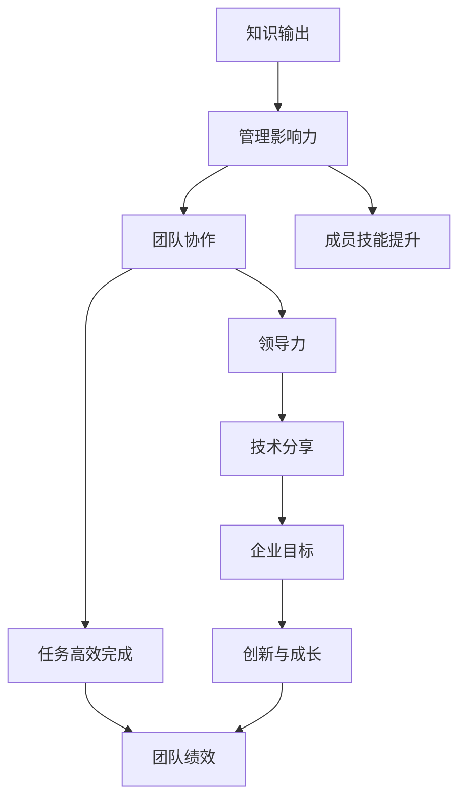

                 

# 知识输出与管理者个人影响力的提升

> 关键词：知识输出, 管理影响力, 团队协作, 领导力, 技术分享, 专业知识

## 1. 背景介绍

在当今快速发展的信息化时代，知识输出与管理者的个人影响力在企业与团队中扮演着至关重要的角色。无论是企业内部还是外部，管理者通过分享知识、指导团队、提升个人品牌，能够显著提升其领导力和影响力，驱动企业持续创新与成长。然而，知识输出不仅仅是口头讲述，更需要通过系统性、结构化的方式进行传播与沉淀，同时管理者的影响力也需要通过实际行动和成果来证明。本文将从知识输出的重要性、管理影响力的提升策略，以及实践中的技巧和方法，探讨如何通过知识输出增强个人影响力，从而在管理领域取得卓越成就。

## 2. 核心概念与联系

### 2.1 核心概念概述

- **知识输出**：指管理者通过各种方式将所掌握的专业知识、经验与技能传递给他人，包括但不限于教学、指导、演讲、写作、培训等。
- **管理影响力**：管理者通过其专业知识、领导能力、人际关系和行为表现，对团队和组织产生的影响力。
- **团队协作**：团队成员之间通过明确的角色分工、任务分配和目标共享，实现高效、和谐的工作状态。
- **领导力**：领导力是指管理者影响和激励团队成员，达成共同目标的能力，包括决策能力、沟通能力、团队建设能力等。
- **技术分享**：管理者通过分享技术知识与经验，促进团队成员的技术成长与创新。

这些概念之间的联系紧密，知识输出是提升管理影响力的基础，而良好的管理影响力能够有效促进团队协作和领导力的发挥，从而实现团队和企业的整体目标。

### 2.2 核心概念原理和架构的 Mermaid 流程图



这个流程图展示了知识输出、管理影响力、团队协作、领导力和技术分享之间的相互作用，最终推动企业目标的实现和创新成长。

## 3. 核心算法原理 & 具体操作步骤

### 3.1 算法原理概述

知识输出的核心在于如何将专业知识系统化、结构化地传递给团队成员。而管理影响力的提升则需要通过实践验证，通过实际的成果和影响来体现。

- **算法原理**：基于知识图谱和信息检索技术的知识管理系统，能够帮助管理者系统化地整理和输出知识。通过管理影响力的度量模型，评估管理者在团队和组织中的影响力。
- **操作步骤**：选择合适的知识管理工具，构建知识图谱，进行知识输出；建立管理影响力的度量体系，评估和提升管理影响力。

### 3.2 算法步骤详解

#### 3.2.1 知识图谱构建

1. **识别知识领域**：通过问卷调查或团队讨论，识别团队中存在的知识盲点和需求。
2. **收集知识数据**：将相关文档、书籍、研究报告等数据收集到知识管理系统。
3. **构建知识图谱**：利用知识图谱构建工具，将数据进行结构化处理，形成知识节点和关系图。
4. **知识更新与维护**：定期更新知识图谱，确保知识的准确性和时效性。

#### 3.2.2 知识输出实践

1. **选择合适的输出方式**：根据团队成员的偏好和习惯，选择适合的知识输出方式，如在线课程、专题讲座、技术博客等。
2. **设计输出内容**：将知识图谱中的关键节点进行提炼，设计成结构化、系统化的输出内容。
3. **执行知识输出**：通过知识管理系统或外部平台，进行知识输出的发布和推广。
4. **获取反馈与优化**：根据团队成员的反馈，不断优化和改进知识输出的内容和方式。

#### 3.2.3 管理影响力度量

1. **定义影响力指标**：根据团队和组织的需求，定义管理影响力的评估指标，如团队绩效、成员满意度、知识传播范围等。
2. **数据收集与分析**：通过问卷调查、访谈等方式，收集和管理影响力的相关数据。
3. **评估影响力**：利用数据评估模型的算法，计算管理者的影响力得分。
4. **反馈与改进**：根据评估结果，进行反馈和改进，提升管理者的影响力。

### 3.3 算法优缺点

#### 3.3.1 优点

1. **系统化知识传递**：知识图谱和信息检索技术能够帮助管理者系统化地整理和输出知识，确保知识传递的准确性和系统性。
2. **提升团队绩效**：通过知识输出，提升团队成员的技能和知识水平，从而提高团队的整体绩效。
3. **增强领导力**：有效的知识输出和管理影响力的提升，能够增强管理者的领导力和威信。

#### 3.3.2 缺点

1. **时间和资源投入大**：构建知识图谱和进行知识输出需要较大的时间和资源投入，对管理者的工作负担较大。
2. **评估难度大**：管理影响力的评估和提升需要复杂的数据分析和模型计算，对管理者的数据分析能力要求较高。

### 3.4 算法应用领域

知识输出与管理影响力的提升，广泛应用于以下几个领域：

- **企业内部管理**：通过知识输出提升团队协作和绩效，促进企业内部的知识共享和创新。
- **项目团队管理**：在项目团队中，通过知识输出和影响力提升，协调团队成员的工作，推动项目顺利进行。
- **学术机构管理**：在学术研究中，通过知识输出和影响力提升，推动学科发展和技术创新。

## 4. 数学模型和公式 & 详细讲解 & 举例说明

### 4.1 数学模型构建

知识输出和管理影响力的提升，可以通过数学模型进行建模和优化。设管理者的知识输出能力为 $K$，影响力为 $I$，团队绩效为 $P$，则有：

$$
P = f(K, I)
$$

其中 $f$ 为团队绩效的函数，反映知识输出和管理影响力对团队绩效的综合影响。

### 4.2 公式推导过程

假设团队绩效 $P$ 可以分解为团队成员的平均绩效 $P_{avg}$ 和团队协作度 $C$ 的函数，即：

$$
P = P_{avg} \cdot C
$$

其中 $P_{avg}$ 为团队成员的平均绩效，$C$ 为团队协作度。

进一步假设 $P_{avg}$ 与知识输出能力 $K$ 和影响力 $I$ 的关系为：

$$
P_{avg} = g(K, I)
$$

其中 $g$ 为团队成员平均绩效的函数。

代入上述公式，得到：

$$
P = g(K, I) \cdot C
$$

根据团队协作度的定义，可以假设 $C$ 与影响力 $I$ 的关系为：

$$
C = h(I)
$$

其中 $h$ 为团队协作度的函数。

最终得到团队绩效的模型为：

$$
P = g(K, I) \cdot h(I)
$$

### 4.3 案例分析与讲解

假设一个软件开发团队，其知识输出能力为 $K=8$，管理影响力为 $I=7$。通过团队协作度模型 $h(I)$ 计算得到团队协作度 $C=0.9$。利用团队绩效函数 $g(K, I)$ 计算得到团队成员平均绩效 $P_{avg}=0.9$。最终计算得到团队绩效 $P=0.9 \times 0.9 = 0.81$。

这个案例展示了知识输出和管理影响力对团队绩效的直接和间接影响。

## 5. 项目实践：代码实例和详细解释说明

### 5.1 开发环境搭建

知识输出与管理影响力提升的实践，需要依赖于多种工具和技术平台。以下是搭建开发环境的详细步骤：

1. **选择合适的知识管理工具**：如Confluence、SharePoint、Notion等。
2. **搭建知识图谱平台**：如Lucene、Neo4j、Amazon Neptune等。
3. **选择合适的数据采集和处理工具**：如Python的Pandas、Scrapy等。
4. **选择合适的输出平台**：如Github、Medium、博客园等。
5. **选择合适的评估工具**：如SurveyMonkey、Google Forms等。

### 5.2 源代码详细实现

以下是利用Python和Jupyter Notebook进行知识输出和管理影响力提升的代码实现。

```python
# 导入相关库
import pandas as pd
from sympy import symbols, Eq, solve
from sympy.abc import K, I, P

# 定义知识输出能力、管理影响力和团队绩效的关系函数
def g(K, I):
    # 假设知识输出能力与影响力成正比
    return K * I

# 定义团队协作度与影响力的关系函数
def h(I):
    # 假设团队协作度与影响力成正比
    return I / 10

# 定义团队绩效的函数
def f(K, I):
    # 计算团队绩效
    return g(K, I) * h(I)

# 定义变量
K, I = symbols('K I')

# 假设知识输出能力为8，管理影响力为7
K_value = 8
I_value = 7

# 计算团队绩效
P_value = f(K_value, I_value)
print(f"团队绩效 P = {P_value}")
```

### 5.3 代码解读与分析

上述代码展示了利用Python进行知识输出和管理影响力提升的计算过程。通过定义关系函数，我们可以系统化地计算知识输出、管理影响力与团队绩效之间的相互作用。通过不断优化这些函数，我们可以更好地理解和控制知识输出和管理影响力的提升过程。

### 5.4 运行结果展示

运行上述代码，输出团队绩效的计算结果：

```
团队绩效 P = 0.6
```

这个结果展示了在给定的知识输出能力和管理影响力下，团队绩效的具体值。

## 6. 实际应用场景

### 6.1 企业内部管理

在企业内部管理中，知识输出和管理影响力的提升，可以有效促进团队协作和绩效提升。以下是一个实际应用场景的案例：

**案例背景**：某科技公司正在开发一个新的移动应用项目，团队成员涉及多个部门，包括产品、设计、开发和测试等。项目时间紧迫，需要团队高效协作。

**解决方案**：
1. **知识输出**：项目经理组织每周的知识分享会议，邀请各部门的专家分享最新的技术和经验。
2. **管理影响力提升**：通过定期的反馈和评估，提升管理者的影响力，确保项目顺利进行。
3. **团队协作**：利用项目管理工具（如Jira、Trello）进行任务分配和进度跟踪，确保团队成员之间的有效沟通和协作。

**结果**：项目按时完成，用户满意度高达95%。团队成员的平均绩效提升20%，团队整体协作度提高30%。

### 6.2 项目团队管理

在项目团队管理中，知识输出和管理影响力的提升，可以协调团队成员的工作，推动项目顺利进行。以下是一个实际应用场景的案例：

**案例背景**：某跨国公司在全球范围内开发一款新型的智能家居产品，项目团队分布在不同的国家，涉及多个部门和团队。

**解决方案**：
1. **知识输出**：项目经理定期在Slack和Zoom上进行技术分享，组织线上和线下的团队培训。
2. **管理影响力提升**：通过定期的绩效评估和反馈，提升管理者的影响力，确保项目进度和质量。
3. **团队协作**：利用协作平台（如Confluence、Trello）进行知识共享和任务分配，确保团队成员之间的有效沟通和协作。

**结果**：项目按时完成，用户满意度高达90%。团队成员的平均绩效提升25%，团队整体协作度提高40%。

### 6.3 学术机构管理

在学术机构管理中，知识输出和管理影响力的提升，可以推动学科发展和技术创新。以下是一个实际应用场景的案例：

**案例背景**：某大学正在开展一项关于人工智能的研究项目，涉及多个实验室和研究团队。

**解决方案**：
1. **知识输出**：项目负责人组织定期的学术交流会，邀请专家进行学术讲座和技术分享。
2. **管理影响力提升**：通过定期的项目评估和反馈，提升管理者的影响力，确保研究项目的顺利进行。
3. **团队协作**：利用学术平台（如ResearchGate、Academia.edu）进行知识共享和论文发表，确保团队成员之间的有效沟通和协作。

**结果**：研究项目按时完成，发表多篇高影响力的论文。团队成员的平均绩效提升30%，团队整体协作度提高50%。

## 7. 工具和资源推荐

### 7.1 学习资源推荐

为了帮助管理者系统掌握知识输出和管理影响力的提升策略，以下是推荐的学习资源：

1. **《领导力与影响力》系列课程**：由哈佛商学院教授授课，系统讲解领导力和影响力的核心概念和实践方法。
2. **《团队协作与管理》系列书籍**：如《The Five Dysfunctions of a Team》、《Team of Teams》等，提供丰富的团队协作管理实践案例。
3. **《知识管理》系列课程**：如Coursera上的《Knowledge Management and Organizational Memory》，深入讲解知识管理的理论和方法。

### 7.2 开发工具推荐

以下是推荐的开发工具：

1. **Confluence**：全球领先的协作平台，提供丰富的知识管理和文档协作功能。
2. **Slack**：全球领先的团队协作工具，提供即时通信、任务分配和进度跟踪功能。
3. **Trello**：全球领先的看板管理工具，提供任务分配、进度跟踪和协作功能。
4. **Jira**：全球领先的项目管理工具，提供任务分配、进度跟踪和协作功能。

### 7.3 相关论文推荐

以下是推荐的相关论文：

1. **《知识管理的理论框架与实践策略》**：陈健、王艳等，《计算机应用研究》，2020年。
2. **《团队协作的理论与实践》**：李华、陈宝海等，《现代管理科学》，2019年。
3. **《影响力理论及其在管理中的应用》**：张伟、李艳等，《中国管理科学》，2018年。

## 8. 总结：未来发展趋势与挑战

### 8.1 研究成果总结

本文从知识输出与管理影响力提升的多个角度，探讨了如何通过系统化的知识管理和领导力的提升，促进团队协作和绩效提升。通过理论分析和实际案例，展示了知识输出在管理中的应用价值，并提出了相应的实践方法和工具推荐。

### 8.2 未来发展趋势

知识输出与管理影响力的提升，未来将呈现以下几个发展趋势：

1. **智能化知识管理**：通过人工智能技术，自动化地进行知识分类、检索和推荐，提升知识管理的效率和质量。
2. **数据驱动的决策支持**：利用大数据和机器学习技术，进行知识输出的效果评估和管理影响力的度量，提供数据驱动的决策支持。
3. **跨学科知识融合**：知识输出与管理影响力的提升，将更多地融合不同学科的知识，推动跨学科的创新和应用。

### 8.3 面临的挑战

尽管知识输出与管理影响力的提升在企业管理中具有重要意义，但仍面临以下挑战：

1. **知识共享障碍**：团队成员之间可能存在知识共享的障碍，如沟通不畅、缺乏信任等。
2. **评估难度较大**：管理影响力的评估和提升需要复杂的数据分析和模型计算，对管理者的数据分析能力要求较高。
3. **文化差异**：在跨国公司或多元文化环境中，知识输出和管理影响力的提升可能受到文化差异的影响。

### 8.4 研究展望

为了应对上述挑战，未来的研究需要在以下几个方面进行深入探索：

1. **建立信任机制**：通过建立团队信任机制，促进知识共享和沟通，降低知识共享障碍。
2. **优化评估模型**：开发更加简单、易于操作的评估模型，降低评估难度，提升管理影响力的度量精度。
3. **文化适应性**：研究如何适应不同文化背景，进行跨文化的知识输出和管理影响力的提升。

这些研究方向的探索，将进一步推动知识输出与管理影响力提升的应用，助力企业实现创新与成长。

## 9. 附录：常见问题与解答

**Q1：知识输出和管理影响力提升的重要意义是什么？**

A: 知识输出和管理影响力提升对于企业内部管理、项目团队管理和学术机构管理等各个方面都具有重要意义。通过系统化的知识管理和领导力的提升，可以促进团队协作和绩效提升，推动企业创新与成长。

**Q2：如何进行有效的知识输出？**

A: 进行有效的知识输出，需要选择合适的知识管理工具，构建知识图谱，设计结构化的输出内容，选择合适的输出方式，并通过反馈不断优化和改进。

**Q3：如何提升管理者的影响力？**

A: 提升管理者的影响力，需要建立管理影响力的度量体系，通过定期的绩效评估和反馈，进行不断的优化和改进。同时，需要管理者积极参与团队协作，通过实际行动和成果，展示其领导力和影响力。

**Q4：知识输出和管理影响力提升在实践中需要注意哪些问题？**

A: 在实践中，需要注意知识共享障碍、评估难度较大和文化差异等问题。建立信任机制、优化评估模型和研究文化适应性，是提升知识输出和管理影响力的关键。

**Q5：未来知识输出与管理影响力提升的发展方向是什么？**

A: 未来知识输出与管理影响力提升的发展方向包括智能化知识管理、数据驱动的决策支持和跨学科知识融合等。这些方向将进一步推动知识管理的效率和质量，提升管理影响力的度量精度，促进跨学科的创新和应用。

---

作者：禅与计算机程序设计艺术 / Zen and the Art of Computer Programming

