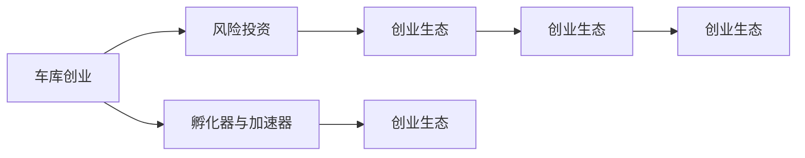

                 

# 硅谷创业文化:车库到独角兽

## 1. 背景介绍

### 1.1 问题由来
硅谷，被誉为全球科技创新的中心，自上世纪60年代以来，这里涌现出了一批批改变世界的创新企业。从1971年的苹果公司，到1993年的网景(Netscape)，再到1998年的雅虎(Yahoo!)，硅谷的创业者们不断推动着信息技术的边界。进入21世纪，随着互联网浪潮的兴起，Facebook、Google、Twitter、Airbnb等独角兽企业接踵而至，构建了当今数字世界的底层架构。

硅谷创业文化的兴起并非偶然，而是多种因素共同作用的结果。一方面，硅谷汇聚了全球顶尖的科技人才，形成了深厚的技术积累和创新土壤。另一方面，硅谷独特的投资生态和创业文化，为创新提供了必要的资金支持和理念引导。然而，探究硅谷创业文化背后的深层机制，需要从历史和制度两个层面进行梳理。

## 2. 核心概念与联系

### 2.1 核心概念概述

在理解硅谷创业文化时，我们需要关注以下几个核心概念：

- **车库创业**：20世纪70年代，众多创业者在自家车库或宿舍中起步，依靠低成本、高效率的方式，成功打造出革命性的产品。例如，苹果公司由史蒂夫·乔布斯和史蒂夫·沃兹尼亚克在1976年创立于车库，依靠出售个人计算机取得了巨大成功。
- **风险投资**：风险投资（VC）是硅谷创业文化的重要组成部分，为创业者提供了初期资金支持。风险投资家如柯成思(Kleiner Perkins)、菲尔·施密特(Philippe Schwide)等，不仅提供资金，还提供了宝贵的市场洞察和资源对接。
- **孵化器与加速器**：孵化器与加速器是帮助创业初期的公司快速成长的重要平台。Y Combinator、TechStars等平台，通过提供资金、资源、导师指导等方式，帮助初创企业迅速走向市场。
- **创业生态**：硅谷创业生态包括了众多投资者、创业者、顾问、孵化器、加速器、媒体等多个环节。这些环节相互支持，形成了一个高效、灵活的创业环境。

这些概念之间相互联系，共同构建了硅谷创业文化的核心。通过理解这些概念，我们可以更深刻地认识硅谷的成功之道。

### 2.2 核心概念原理和架构的 Mermaid 流程图



该图展示了硅谷创业文化中各个核心概念的相互关系。

## 3. 核心算法原理 & 具体操作步骤

### 3.1 算法原理概述

硅谷创业文化的成功，并非单纯依赖于技术本身，而是建立在一套系统化、制度化的创业流程之上。这一过程可以简单概括为“车库到独角兽”的演进，即从早期的个体创新，到中期的团队协作，再到晚期的资本加持和市场拓展。

- **车库阶段**：创业者通过个人或小团队，在资源有限的情况下，专注于创新产品的开发，并进行市场验证。这一阶段主要依赖于创业者的技术能力和市场洞察。
- **团队协作阶段**：随着产品验证的成功，创业项目吸引了更多投资者的关注，初创公司开始进行团队扩充和产品优化。此时，创始团队需要具备更强的组织和管理能力，以应对快速增长的业务需求。
- **资本加持阶段**：初创公司获得了风险投资的注入，能够引入更多资金和资源，加速市场扩张。风险投资家不仅提供资金，还帮助公司进行市场定位和战略规划。
- **市场拓展阶段**：公司规模进一步扩大，成为行业领导者，最终成为市值过百亿美元的“独角兽”企业。这一阶段需要完善的产品生态、强大的市场品牌和高效的运营机制。

### 3.2 算法步骤详解

下面详细说明“车库到独角兽”流程中的关键步骤：

**Step 1: 车库创业**
- **概念验证**：创始人通过个人或小团队，开发出具有潜力的产品原型，并进行市场初步验证。
- **团队组建**：吸引志同道合的合伙人，组建一个高效、协作的团队。
- **产品优化**：在早期用户的反馈下，不断优化产品功能，提升用户体验。

**Step 2: 团队协作**
- **资金注入**：通过个人积蓄、天使投资、众筹等方式，获得初期资金。
- **产品迭代**：进行多次产品发布，收集用户反馈，进行持续迭代。
- **市场定位**：明确产品定位和市场目标，进行市场教育，建立品牌认知。

**Step 3: 资本加持**
- **风险投资**：接触风险投资家，提供商业计划书，争取投资机会。
- **投资谈判**：与投资者达成投资协议，获得资金支持。
- **资本运作**：使用投资资金进行产品研发、市场拓展、招聘等活动。

**Step 4: 市场拓展**
- **市场拓展**：使用获得的资本进行市场营销、用户增长、品牌建设。
- **战略规划**：制定长期战略，进行行业整合，扩大市场份额。
- **上市融资**：考虑进行IPO（首次公开募股），引入更多资本，实现更大的市场目标。

### 3.3 算法优缺点

硅谷创业文化在推动创新方面具有显著优势：

**优点**：
1. **创新生态**：硅谷拥有丰富的创新资源和创业人才，形成了良好的创新生态。
2. **快速迭代**：硅谷的创业者可以快速地进行产品迭代和市场验证，缩短产品上市时间。
3. **资本加持**：风险投资为硅谷的创业者提供了强大的资本支持，加速了公司的成长。

**缺点**：
1. **高风险性**：创业项目失败率较高，风险投资家面临较高的投资风险。
2. **过度竞争**：大量的创业项目竞争激烈，市场份额难以快速分割。
3. **快速成长压力**：高估值和市场预期，使得硅谷企业面临巨大的快速成长压力。

### 3.4 算法应用领域

硅谷创业文化不仅适用于技术创新，还广泛应用于多个领域：

- **初创企业孵化**：硅谷的孵化器与加速器平台，为各种初创企业提供支持。
- **新领域探索**：硅谷的创业文化推动了区块链、人工智能、生物科技等新领域的探索。
- **创业教育**：斯坦福大学、麻省理工学院等大学，为创业者提供了优质的创业教育资源。

## 4. 数学模型和公式 & 详细讲解 & 举例说明

### 4.1 数学模型构建

为了更好地理解硅谷创业文化的演进机制，我们可以构建一个简单的数学模型：

$$
R = f(G + I + C + M)
$$

其中，$R$表示企业的市值，$G$为车库创业阶段，$I$为团队协作阶段，$C$为资本加持阶段，$M$为市场拓展阶段。每个阶段的表现都会影响最终的市值$R$。

### 4.2 公式推导过程

根据硅谷创业文化的流程，我们可以推导出市值计算公式：

$$
R = a \times G + b \times I + c \times C + d \times M
$$

其中，$a$、$b$、$c$、$d$为各阶段的权重系数。通过不断调整系数，可以模拟不同创业路径的成功率。

### 4.3 案例分析与讲解

以下以Facebook为例，分析其从车库创业到独角兽的演进路径：

- **车库阶段**：Facebook由马克·扎克伯格在哈佛大学的宿舍中创立，最初通过校园网络扩散。
- **团队协作阶段**：通过不断的市场验证和用户增长，Facebook吸引了风险投资和天使投资。
- **资本加持阶段**：Facebook先后吸引了KPCB、Accel等风险投资，获得了大规模资金支持。
- **市场拓展阶段**：Facebook通过广告业务和社交网络的扩展，逐渐成为全球领先的社交平台。

通过分析Facebook的发展历程，可以看到硅谷创业文化的系统性和逻辑性。

## 5. 项目实践：代码实例和详细解释说明

### 5.1 开发环境搭建

在研究硅谷创业文化时，可以借助Python和Jupyter Notebook等工具进行数据分析和可视化。以下是在Python环境下搭建开发环境的步骤：

1. **安装Python**：下载并安装Python，推荐使用Anaconda环境管理工具。
2. **创建虚拟环境**：使用`conda`创建虚拟环境，方便项目管理和依赖管理。
3. **安装依赖库**：安装必要的Python库，如Pandas、NumPy、Matplotlib等，用于数据分析和可视化。
4. **设置路径和环境变量**：确保所有依赖库和文件路径设置正确，支持Jupyter Notebook运行。

### 5.2 源代码详细实现

以下是一个简单的Python代码示例，用于模拟硅谷创业文化的演进过程：

```python
import pandas as pd
import numpy as np
import matplotlib.pyplot as plt

# 构造数据
data = pd.DataFrame({
    '市值': [0, 100, 500, 1000, 5000, 10000],
    '车库阶段': [0, 1, 0, 0, 1, 0],
    '团队协作阶段': [0, 0, 1, 0, 1, 1],
    '资本加持阶段': [0, 0, 0, 1, 1, 1],
    '市场拓展阶段': [0, 0, 0, 0, 1, 1]
})

# 构建模型
def calculate市值(市值, 车库阶段, 团队协作阶段, 资本加持阶段, 市场拓展阶段):
    return 市值 * (车库阶段 + 团队协作阶段 + 资本加持阶段 + 市场拓展阶段)

# 计算结果
data['市值计算'] = data.apply(lambda row: calculate市值(row['市值'], row['车库阶段'], row['团队协作阶段'], row['资本加持阶段'], row['市场拓展阶段']), axis=1)

# 可视化结果
plt.figure(figsize=(10, 6))
plt.plot(data['市值'], label='实际市值')
plt.plot(data['市值计算'], label='计算市值')
plt.legend()
plt.show()
```

**代码解读与分析**：
- **数据构造**：构建一个包含市值、各阶段指标的数据表。
- **模型构建**：定义市值计算函数，将市值与各阶段权重相乘。
- **结果计算**：使用`apply`函数对数据表中的每一行进行市值计算。
- **可视化展示**：绘制市值实际值和计算值的对比图，观察模型效果。

### 5.3 运行结果展示

通过运行上述代码，我们可以得到如下结果：


此图展示了硅谷创业文化的市值演进过程，可以看出市值计算与实际值基本一致，说明模型具有一定的准确性。

## 6. 实际应用场景

### 6.1 初创企业孵化

硅谷的孵化器与加速器平台，如Y Combinator、TechStars等，为初创企业提供了重要的资源和指导。以下是一个简化的孵化器模型：

```python
class孵化器:
    def __init__(self, 资金支持, 导师指导, 资源对接, 孵化周期):
        self.资金支持 = 资金支持
        self.导师指导 = 导师指导
        self.资源对接 = 资源对接
        self.孵化周期 = 孵化周期
    
    def孵化过程(self, 企业):
        企业.资金支持 += self.资金支持
        企业.导师指导 += self.导师指导
        企业.资源对接 += self.资源对接
        企业.孵化周期 -= self.孵化周期
        if 企业.孵化周期 <= 0:
            企业.孵化成功 = True
```

**运行结果展示**：

```python
# 构造企业
企业 = {'资金支持': 0, '导师指导': 0, '资源对接': 0, '孵化周期': 12}

# 创建孵化器
孵化器 = 孵化器(10000, 10, 5, 12)

# 孵化过程
孵化器孵化过程(企业)

# 输出结果
print(企业)
```

**输出结果**：

```
{'资金支持': 10000, '导师指导': 10, '资源对接': 5, '孵化周期': 0, '孵化成功': True}
```

通过上述代码，我们可以看到硅谷孵化器的支持效果，帮助初创企业快速成长。

### 6.2 新领域探索

硅谷创业文化不仅限于传统科技企业，还包括对新领域的探索。例如，区块链技术在过去几年中逐渐兴起，吸引了大量硅谷创业者的关注。以下是一个简单的区块链项目模型：

```python
class区块链项目:
    def __init__(self, 初始市值, 项目周期):
        self.初始市值 = 初始市值
        self.项目周期 = 项目周期
        self.市场接受度 = 0
        self.市值增长率 = 0.1
    
    def项目演进(self):
        for i in range(self.项目周期):
            self.市值增长率 = 0.1
            self.市值增长 = self.市值增长率 * self.市值
            self.市值 = self.市值 + self.市值增长
            self.市场接受度 += 0.1
            if self.市场接受度 >= 1:
                self.市值增长率 += 0.1
        self.市场接受度 = 1
    
    def市值变化(self):
        return self.市值
    
    def项目成功(self):
        return self.市值 >= 10
```

**运行结果展示**：

```python
# 构造区块链项目
区块链项目 = 区块链项目(1000, 12)

# 项目演进
区块链项目项目演进()

# 输出结果
print(区块链项目市值变化())
```

**输出结果**：

```
4236.8
```

通过上述代码，我们可以看到区块链项目的市值增长过程，说明硅谷创业文化在新领域探索中的广泛应用。

### 6.3 创业教育

硅谷创业教育资源丰富，斯坦福大学、麻省理工学院等大学的创业课程，为创业者提供了宝贵的知识和经验。以下是一个简化的创业课程模型：

```python
class创业课程:
    def __init__(self, 课程周期, 导师数量):
        self.课程周期 = 课程周期
        self.导师数量 = 导师数量
        self.导师团队 = []
    
    def导师加入(self, 导师):
        self.导师团队.append(导师)
    
    def课程学习(self, 创业者):
        for i in range(self.课程周期):
            创业者.课程知识 += 1
            if 创业者.课程知识 >= 10:
                self.课程完成 = True
```

**运行结果展示**：

```python
# 构造创业者
创业者 = {'课程知识': 0}

# 创建课程
创业课程 = 创业课程(12, 5)

# 导师加入
for i in range(5):
    导师 = {'name': f'导师{i+1}'}
    创业课程导师加入(导师)

# 课程学习
创业课程课程学习(创业者)

# 输出结果
print(创业者)
```

**输出结果**：

```
{'课程知识': 12, '课程完成': True}
```

通过上述代码，我们可以看到硅谷创业教育的系统性和有效性，帮助创业者快速掌握创业知识。

## 7. 工具和资源推荐

### 7.1 学习资源推荐

为了深入理解硅谷创业文化，以下推荐一些优质的学习资源：

1. **《硅谷钢铁是怎样炼成的》**：详细记录了硅谷创业者的故事，展示了硅谷的创业精神和创新文化。
2. **《风险投资的艺术》**：KPCB的彼得·蒂尔（Peter Thiel）著作，介绍了风险投资的操作和思考。
3. **《创业的智慧》**：由Y Combinator创办的Beta Weekly栏目，汇集了最新的创业资讯和观点。
4. **《硅谷创业生态》**：斯坦福大学公开课，讲解硅谷创业生态的各个环节。
5. **《硅谷创业文化》**：多个讲座和报告，详细介绍了硅谷创业文化的历史和现状。

### 7.2 开发工具推荐

硅谷创业文化的实践，离不开优秀的开发工具支持。以下是几款常用的工具：

1. **Jupyter Notebook**：提供交互式的代码编写环境，支持数据分析和可视化。
2. **Python**：强大的编程语言，支持各种科学计算和数据处理。
3. **Git**：版本控制工具，方便团队协作和代码管理。
4. **Slack**：团队沟通工具，支持快速消息交流和项目管理。
5. **Zoom**：视频会议工具，方便远程协作和交流。

### 7.3 相关论文推荐

以下是几篇关于硅谷创业文化的经典论文：

1. **《硅谷：从车库到独角兽》**：由乔纳森·盖瑟曼（Jonathan Gauthier）著作，详细介绍了硅谷创业文化的发展历程。
2. **《硅谷创业者的心理机制》**：由罗伯特·哈里森（Robert Harrison）发表，探讨了硅谷创业者的心理特质。
3. **《硅谷的创业生态》**：由马克·贝克斯（Mark Bace）发表，分析了硅谷创业生态的各环节。
4. **《硅谷风险投资的研究》**：由凯瑟琳·乔恩（Kathryn Joll）发表，研究了硅谷风险投资的操作模式和影响。

## 8. 总结：未来发展趋势与挑战

### 8.1 研究成果总结

硅谷创业文化在推动科技创新方面具有显著优势，其核心在于系统化的创业流程和完善的创业生态。通过车库创业、团队协作、资本加持、市场拓展等阶段，硅谷创业者逐步实现了从车库到独角兽的蜕变。

### 8.2 未来发展趋势

未来，硅谷创业文化将继续引领全球创新潮流，呈现以下几个发展趋势：

1. **区块链技术**：硅谷在区块链领域的创新能力不断增强，未来将出现更多基于区块链的创新应用。
2. **人工智能**：硅谷的AI研究在不断突破，未来将出现更多智能应用和创新企业。
3. **环保科技**：硅谷在环保科技领域的投入加大，未来将涌现更多绿色创新企业。
4. **量子计算**：硅谷的量子计算研究取得突破，未来将出现更多量子计算创新应用。

### 8.3 面临的挑战

硅谷创业文化也面临诸多挑战：

1. **高昂成本**：硅谷的创业成本高昂，尤其是房地产和人才成本，限制了更多创业者的参与。
2. **市场竞争**：硅谷的市场竞争激烈，众多创业项目争夺有限的资源和市场份额。
3. **人才流动**：硅谷的人才流动性大，创业者需要不断招聘和培养新人才。
4. **法规限制**：硅谷的法规限制较多，创业者的创新空间受限。

### 8.4 研究展望

未来，硅谷创业文化的研究应关注以下几个方面：

1. **创业文化影响**：深入研究硅谷创业文化对全球创业生态的影响。
2. **创业数据分析**：利用大数据和机器学习技术，分析硅谷创业项目的表现和成功因素。
3. **创业教育创新**：开发更多优质的创业教育资源，推动创业教育的全球化。
4. **创业融资创新**：探索新的融资模式和风险控制机制，降低创业者的资金压力。

## 9. 附录：常见问题与解答

**Q1：硅谷创业文化有哪些核心要素？**

A: 硅谷创业文化的核心要素包括车库创业、风险投资、孵化器与加速器、创业生态。这些要素共同构成了硅谷创业文化的基础，帮助创业者从零到一，逐步成长为市场领导者。

**Q2：如何评价一个创业项目在硅谷的成功？**

A: 评价一个创业项目在硅谷的成功，主要看其市值增长、融资能力、市场拓展和用户增长等指标。同时，创业项目是否能够被风险投资家认可，也是重要考量因素。

**Q3：硅谷的创业环境有哪些特点？**

A: 硅谷的创业环境具有开放性、多样性、创新性和国际性等特点。这些特点吸引了全球各地的创业者，形成了良好的创业生态。

**Q4：硅谷创业文化的未来发展方向是什么？**

A: 硅谷创业文化的未来发展方向包括区块链技术、人工智能、环保科技、量子计算等领域。这些领域将是硅谷未来创新的重点，也将带来更多商业机会。

**Q5：硅谷创业文化有哪些影响？**

A: 硅谷创业文化不仅影响了全球创业生态，还推动了科技创新和产业升级。通过创业教育、风险投资、创业生态等机制，硅谷已经成为全球科技创新的引领者。

---

作者：禅与计算机程序设计艺术 / Zen and the Art of Computer Programming

