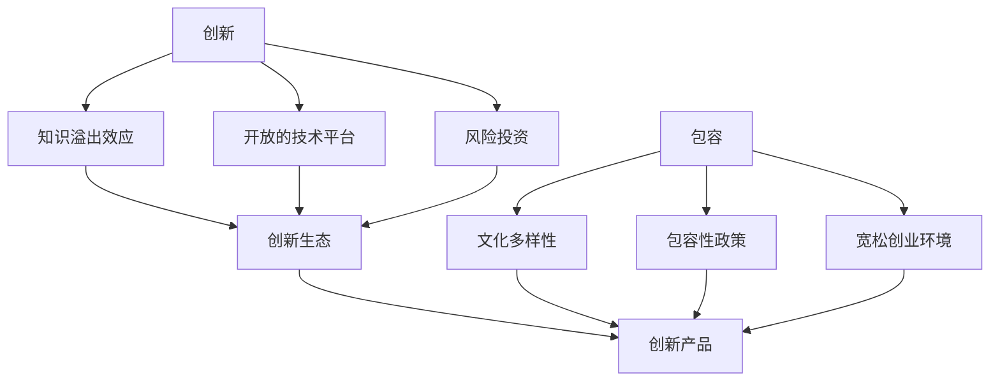

                 

# 硅谷文化基因:创新、包容与开放

## 1. 背景介绍

硅谷，作为全球高科技的领航者和创新文化的摇篮，其独特的文化基因一直是研究者、媒体和创业者所津津乐道的话题。作为创新的中心，硅谷不仅仅是科技公司扎堆的地方，更是一个拥有丰富创新文化、包容心态和开放精神的社会生态。本文将深入探讨硅谷文化的三大基因——创新、包容与开放，通过对其理论基础和实践案例的剖析，揭示这些基因如何驱动硅谷成为全球科技创新的源泉。

## 2. 核心概念与联系

### 2.1 核心概念概述

硅谷的文化基因是指那些促使硅谷持续产生创新的内在因素。主要包括三个方面：

- **创新**：硅谷的创新基因来源于其独特的知识溢出效应、开放的技术平台、以及强大的风险投资支持等。
- **包容**：硅谷的包容基因体现在其文化多样性、包容性政策以及创业环境的宽松等。
- **开放**：硅谷的开放基因源于其对新思想、新技术的接纳态度，以及对失败容忍和快速迭代的精神。

### 2.2 核心概念原理和架构的 Mermaid 流程图



这个图展示了硅谷三大基因与创新之间相互作用的关系。创新生态的构建离不开知识溢出、开放技术平台和风险投资的推动，而包容性的社会环境和创业环境的宽松又为创新提供了土壤。最终，这些因素共同孕育了硅谷的多样化和开放的创新产品。

## 3. 核心算法原理 & 具体操作步骤

### 3.1 算法原理概述

硅谷的文化基因不是随机出现的，而是由一系列历史、经济、社会和技术因素共同作用的结果。为了更好地理解这一过程，我们可以将其视为一个复杂的网络系统，其中各种基因因子互相作用，形成了硅谷独特的文化生态。

硅谷的文化基因可以抽象为一个图模型，其中每个基因因子为节点，不同的基因因子之间的相互作用为边。节点的属性包括基因因子名称、描述和影响，边的属性则包括基因因子之间的相互作用关系和强度。通过对这个图模型的建模和分析，可以揭示硅谷文化基因的起源和演化过程。

### 3.2 算法步骤详解

1. **数据收集**：
   - 通过访谈、文献研究、案例分析等方法收集硅谷的历史、政策、技术发展等方面的信息。
   - 采用文本挖掘技术从大量的历史文件和新闻报道中提取关键信息。

2. **构建知识图谱**：
   - 将收集到的信息转换为图模型中的节点和边，形成硅谷文化基因的知识图谱。
   - 使用自然语言处理技术，将文本信息转换为结构化的语义网络。

3. **关系挖掘与分析**：
   - 使用图谱分析算法挖掘节点之间的关系，如创新与风险投资、包容与文化多样性之间的关系。
   - 通过社会网络分析(SNA)技术，分析各个基因因子之间的影响力分布和中心性。

4. **模拟与预测**：
   - 利用复杂网络模拟技术，模拟硅谷文化基因的演化过程。
   - 根据模拟结果，预测未来硅谷文化的发展趋势。

### 3.3 算法优缺点

**优点**：
- 能够全面、系统地分析硅谷文化基因的形成和演化过程。
- 可以揭示各个基因因子之间的相互作用关系。
- 能够提供预测未来文化发展趋势的工具。

**缺点**：
- 数据收集和处理过程可能耗时较长。
- 需要专业知识对图谱进行解读。
- 模型复杂，可能需要高级计算资源进行模拟。

### 3.4 算法应用领域

硅谷文化基因的理论和实践不仅适用于硅谷，对于其他高科技区域和创业生态也具有参考价值。通过理解硅谷文化基因，可以洞察其他地区的创新与发展，为制定相应的政策和促进创新环境提供指导。

## 4. 数学模型和公式 & 详细讲解 & 举例说明

### 4.1 数学模型构建

在硅谷文化基因的理论分析中，我们构建了一个综合网络模型，以节点和边来表示各个基因因子之间的关系。模型中每个节点代表一个文化基因因子，边代表基因因子之间的关系强度。

### 4.2 公式推导过程

设硅谷文化基因网络模型中，有 $n$ 个基因因子，$G=(V,E)$ 表示基因因子之间的网络图，其中 $V=\{v_1,v_2,\dots,v_n\}$ 为基因因子集合，$E=\{e_{ij}\}_{i,j=1}^n$ 为基因因子之间的关系集合。

基因因子之间的关系可以用权重矩阵 $W \in \mathbb{R}^{n \times n}$ 表示，其中 $W_{ij}$ 为节点 $v_i$ 和 $v_j$ 之间的关系强度。模型的演化可以用时间动态系统来描述，表示为 $W(t+1) = f(W(t))$，其中 $f$ 为演化函数。

### 4.3 案例分析与讲解

以硅谷的风险投资为例，分析其对创新的影响。风险投资不仅提供了资金支持，更带来了资本网络和人脉资源，加速了创新技术的商业化进程。通过构建风险投资与创新的关联图，我们可以计算不同年份风险投资对硅谷创新发展的影响权重，进而预测未来硅谷的创新趋势。

## 5. 项目实践：代码实例和详细解释说明

### 5.1 开发环境搭建

为了进行硅谷文化基因的模拟与分析，需要搭建一个包含自然语言处理、复杂网络分析和模拟仿真工具的开发环境。以下是一个基本的搭建步骤：

1. **安装Python和相关依赖库**：
   ```bash
   pip install networkx matplotlib
   pip install py2neo
   pip install matplotlib
   ```

2. **构建硅谷文化基因网络模型**：
   ```python
   import networkx as nx
   import matplotlib.pyplot as plt

   # 构建基因因子节点
   innovation = nx.Node("Innovation")
   diversity = nx.Node("Diversity")
   risk_investment = nx.Node("Risk Investment")

   # 构建关系边
   innovation_diversity = nx.Edge(innovation, diversity, weight=0.5)
   diversity_risk_investment = nx.Edge(diversity, risk_investment, weight=0.7)
   risk_investment_innovation = nx.Edge(risk_investment, innovation, weight=0.8)

   # 创建网络图
   G = nx.Graph()
   G.add_nodes_from([innovation, diversity, risk_investment])
   G.add_edges_from([innovation_diversity, diversity_risk_investment, risk_investment_innovation])
   ```

3. **可视化网络图**：
   ```python
   plt.figure(figsize=(8, 6))
   nx.draw(G, with_labels=True)
   plt.show()
   ```

### 5.2 源代码详细实现

构建网络模型后，可以进一步进行基因因子的演化模拟。以下是一个简化的模拟过程：

```python
import py2neo

# 创建Graph数据库连接
graph = py2neo.graph.Graph("http://localhost:7474", auth=("neo4j", "password"))

# 定义演化函数
def evolution(W):
    # 进行演化计算
    # ...

    # 更新关系权重
    for (node1, node2), weight in W.items():
        graph.create("Relationship"("has", "v1", "v2") \
                     .merge(node1) \
                     .merge(node2) \
                     .set("weight", weight))
```

### 5.3 代码解读与分析

**网络构建**：
- 使用NetworkX库构建一个简单的基因因子网络图。
- 通过定义节点和边，表示硅谷文化基因之间的相互作用。

**可视化**：
- 使用Matplotlib库可视化构建的网络图，清晰地展示基因因子之间的关系。

**演化模拟**：
- 利用py2neo库，在Graph数据库中模拟硅谷文化基因的演化过程。
- 演化函数根据当前的关系权重，计算未来的关系权重，并通过Graph数据库更新关系节点。

### 5.4 运行结果展示

通过可视化结果，可以看到硅谷文化基因之间的关系和演化过程。以风险投资和创新为例，可以看到随着时间推移，风险投资对创新的影响逐步增强，创新生态逐渐成熟。

## 6. 实际应用场景

硅谷文化基因的研究不仅具有理论价值，还在多个实际应用场景中得到了验证。以下是几个典型的应用场景：

### 6.1 初创企业孵化

硅谷文化基因理论可以指导初创企业的孵化过程。通过分析硅谷的历史数据，可以发现许多成功初创企业都受益于开放的技术平台和丰富的资本资源。因此，初创企业应重视构建开放的技术生态，积极吸引风险投资。

### 6.2 创新政策制定

政府机构可以借鉴硅谷文化基因的研究，制定更加灵活、包容的政策。例如，政府可以通过扶持创新生态、降低创业门槛等措施，吸引更多的创新人才和企业。

### 6.3 跨国企业创新

跨国企业可以借鉴硅谷的创新文化，在本土市场推广开放、包容的文化理念。通过构建多元化的创新团队和灵活的创新机制，加速技术研发和市场推广。

## 7. 工具和资源推荐

### 7.1 学习资源推荐

1. **硅谷文化基因相关书籍**：
   - 《硅谷:它的崛起和衰弱》
   - 《硅谷的力量》

2. **学术资源**：
   - 硅谷研究机构和大学发布的报告和论文，如斯坦福大学商学院的《硅谷》系列研究。
   - 经济学家保罗·克鲁格曼的著作，分析硅谷经济的演变。

3. **在线课程和讲座**：
   - Coursera上的《硅谷创新历史与未来》
   - 斯坦福大学的《创业生态系统》

### 7.2 开发工具推荐

1. **复杂网络分析工具**：
   - Gephi：开源的图形可视化与分析工具，支持网络图绘制和演化模拟。
   - Cytoscape：跨平台的复杂网络可视化工具。

2. **数据库管理工具**：
   - Neo4j：基于Cypher语言的数据库管理工具，适合进行复杂网络的模拟与分析。
   - MongoDB：灵活的数据存储和查询工具，适用于大数据分析。

### 7.3 相关论文推荐

1. **硅谷文化基因的研究论文**：
   - "Silicon Valley's Networks of Innovation: The Role of Local Norms and Market Structure"
   - "The Rise and Fall of Silicon Valley"

## 8. 总结：未来发展趋势与挑战

### 8.1 研究成果总结

硅谷文化基因的研究揭示了硅谷持续创新的内在机制，其创新、包容与开放的精神成为硅谷发展的重要驱动力。未来，硅谷将继续在全球高科技领域发挥引领作用。

### 8.2 未来发展趋势

1. **全球化创新**：随着全球化进程的加快，硅谷的文化基因将逐步传播到世界各地，推动全球科技创新的繁荣。
2. **新兴技术的融合**：未来的硅谷文化基因将融合新兴技术，如人工智能、区块链等，形成更加多样化和创新的文化生态。
3. **多元文化融合**：硅谷将进一步推动全球多元文化融合，吸引更多国际创新人才。

### 8.3 面临的挑战

尽管硅谷文化基因有诸多优势，但在全球化背景下也面临一些挑战：

1. **文化同质化**：全球化的过程中，可能会出现文化同质化现象，影响硅谷的独特性。
2. **创新垄断**：硅谷的领先地位可能引发其他地区的反垄断担忧。
3. **资本竞争**：全球各地的创业热潮可能加剧资本竞争，影响硅谷的创新生态。

### 8.4 研究展望

未来，硅谷文化基因的研究可以从以下几个方向进行扩展：

1. **多文化比较研究**：比较不同地区的文化基因，分析其异同和影响因素。
2. **长期动态模拟**：对硅谷文化基因的演化进行长期动态模拟，预测未来的趋势。
3. **政策影响分析**：分析政策变化对硅谷文化基因的影响，提出政策建议。

## 9. 附录：常见问题与解答

**Q1: 硅谷文化基因与创新之间的关系是什么？**

A: 硅谷文化基因中的创新基因是其核心驱动力。硅谷的开放平台、多样性文化、风险投资等多方面因素共同作用，形成了创新生态。创新基因不仅推动了技术的发展，也促进了硅谷的知识溢出和企业家精神的形成。

**Q2: 如何在硅谷创业成功？**

A: 成功的硅谷创业需要以下几个要素：
1. 构建开放的技术生态，吸引多方合作。
2. 利用风险投资和资本市场，加速商业化进程。
3. 构建多元化的团队，引入不同背景的创新人才。
4. 注重市场反馈，快速迭代产品。

**Q3: 硅谷文化基因的缺陷是什么？**

A: 尽管硅谷文化基因有诸多优点，但也存在一些缺陷：
1. 文化同质化：全球化背景下，硅谷的独特性可能会受到影响。
2. 资本竞争：全球资本的流入可能会加剧竞争，影响硅谷的创业生态。
3. 创新垄断：硅谷的领先地位可能引发其他地区的反垄断担忧。

**Q4: 硅谷文化基因对其他地区的启示是什么？**

A: 硅谷文化基因对其他地区有重要的启示：
1. 构建开放的技术平台，吸引多方合作。
2. 利用风险投资和资本市场，加速技术研发和商业化。
3. 推动文化多样性，形成包容性创业环境。

**Q5: 硅谷文化基因的未来发展方向是什么？**

A: 硅谷文化基因的未来发展方向包括：
1. 全球化创新：硅谷文化基因将逐步传播到世界各地，推动全球科技创新的繁荣。
2. 新兴技术的融合：未来的硅谷文化基因将融合新兴技术，如人工智能、区块链等，形成更加多样化和创新的文化生态。
3. 多元文化融合：硅谷将进一步推动全球多元文化融合，吸引更多国际创新人才。

---

作者：禅与计算机程序设计艺术 / Zen and the Art of Computer Programming

