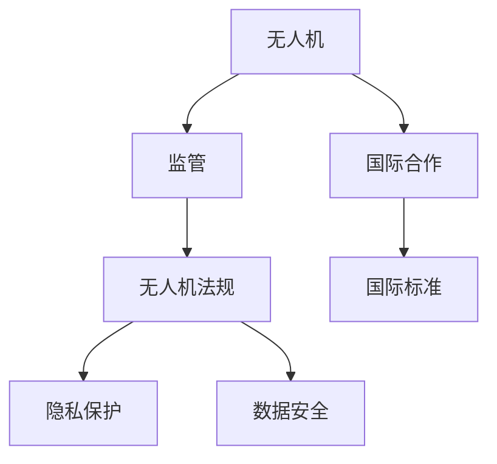

                 

# 硅谷无人机监管的国际合作

## 1. 背景介绍

随着无人机技术的飞速发展，其在农业、物流、医疗等领域的应用不断扩展，使得无人机产业呈现出快速增长的态势。然而，随着无人机在民用和商业领域的广泛应用，其可能带来的安全风险也日益凸显，从而引发了关于无人机监管的全球性讨论。硅谷作为全球无人机研发和商业化应用的重要中心，其关于无人机监管的国际合作，无疑在塑造全球无人机监管政策方面起到了引领作用。

### 1.1 无人机技术的演进

无人机，即无人驾驶飞行器（Unmanned Aerial Vehicles, UAVs），是由无线电遥控或自主程序控制，无需人员驾驶的飞行器。随着技术进步，无人机在小型化、智能化和自动化方面取得了显著突破，进一步推动了其在各领域的广泛应用。

- **小型化**：如今的无人机已能通过便携式设备实现远距离控制，解决了传统无人机的复杂操作问题。
- **智能化**：通过先进的传感器和软件算法，无人机在实时定位、避障、图像识别等能力上不断增强。
- **自动化**：无人机实现了高度自主的飞行控制，能够执行多任务，并在必要时进行数据传输和回传。

### 1.2 无人机应用场景

无人机在农业、物流、娱乐、军事等领域展现了广阔的应用前景：

- **农业**：用于作物监测、土壤分析、喷洒农药和种子等。
- **物流**：实现快速配送、无人机货运等。
- **娱乐**：用于影视拍摄、空中直播等。
- **军事**：用于侦察、空中打击和通信中继等。

无人机技术的快速发展和广泛应用，推动了其在各领域的应用价值日益显现，同时也带来了对现行法律和监管体系的挑战。

## 2. 核心概念与联系

### 2.1 核心概念概述

- **无人机**：指在无人驾驶下通过无线遥控或预设程序控制飞行器。
- **监管**：指对无人机的使用进行合法性、安全性和效益性检查的过程。
- **国际合作**：指各国或国际组织在无人机监管政策制定、执行和协调方面的协作。

- **无人机法规**：由政府制定的，用于指导和规范无人机使用的法律和政策。
- **隐私保护**：指保护个人隐私不被无人机监视和数据收集的能力。
- **数据安全**：指保护无人机数据免受未授权访问、篡改或泄露的措施。

这些核心概念通过以下Mermaid流程图来展示：



## 3. 核心算法原理 & 具体操作步骤

### 3.1 算法原理概述

无人机监管涉及对无人机飞行、数据传输、隐私保护等多个方面的管理。其核心算法原理主要包括以下几个方面：

- **飞行控制算法**：确保无人机在飞行过程中的安全性、稳定性和有效性。
- **数据传输加密算法**：保障无人机数据在传输过程中的安全性，防止数据泄露。
- **隐私保护算法**：保护无人机的图像和位置数据不被滥用。

### 3.2 算法步骤详解

无人机监管的具体操作步骤主要包括以下几个关键环节：

1. **飞行计划申请**：无人机操作者需向当地航空管理机构提交飞行计划，包括飞行高度、飞行路线、飞行时间等信息。
2. **飞行前检查**：无人机必须经过全面的安全检查，包括检查电池寿命、传感器工作状态、数据传输设备等。
3. **飞行过程中的监控**：在飞行过程中，无人机应接受来自地面控制中心的实时监控，确保飞行安全。
4. **数据传输和存储**：无人机的飞行数据应通过加密传输并存储，保证数据安全。
5. **隐私保护**：无人机不得侵犯个人隐私，应在飞行区域内避免记录可能涉及个人隐私的图像或位置数据。

### 3.3 算法优缺点

无人机监管的算法具有以下优点：

- **安全性**：通过精确的飞行控制算法和实时监控，有效降低无人机飞行风险。
- **隐私保护**：数据传输加密和隐私保护算法保障了个人隐私不被滥用。
- **数据安全**：数据传输和存储的加密技术确保了无人机数据的完整性和机密性。

然而，这些算法也存在一些缺点：

- **成本高**：精确的飞行控制和数据加密技术需要较高的研发和维护成本。
- **执行难度大**：确保无人机在飞行过程中的实时监控和隐私保护，技术难度较高。
- **监管盲区**：在偏远和通信受限的地区，无人机监管仍存在监管盲区。

### 3.4 算法应用领域

无人机监管的算法应用领域广泛，包括：

- **农业无人机**：用于农作物监测、病虫害防治、精准农业等。
- **物流无人机**：用于快递配送、物资运输等。
- **娱乐无人机**：用于影视拍摄、空中直播等。
- **军事无人机**：用于侦察、空中打击和通信中继等。

## 4. 数学模型和公式 & 详细讲解 & 举例说明

### 4.1 数学模型构建

无人机飞行控制算法主要基于动态系统模型，描述无人机的运动状态和控制输入之间的关系。数学模型如下：

$$
\dot{x} = f(x,u)
$$

其中，$x$ 表示无人机的位置和姿态，$u$ 表示控制输入。飞行控制算法需要根据该模型，设计控制器，使得无人机能够在指定区域内稳定飞行。

### 4.2 公式推导过程

以农业无人机为例，飞行控制算法的推导过程如下：

1. **建立状态方程**：
   $$
   \dot{x} = \begin{bmatrix}
   a & b & c \\
   d & e & f
   \end{bmatrix} \begin{bmatrix}
   x \\
   y \\
   z
   \end{bmatrix} + \begin{bmatrix}
   g \\
   h \\
   i
   \end{bmatrix}
   $$

2. **设计控制器**：
   $$
   u = \begin{bmatrix}
   a_1 & a_2
   \end{bmatrix} \begin{bmatrix}
   x \\
   y
   \end{bmatrix} + b_1
   $$

3. **仿真与调整**：通过仿真试验，调整控制器参数，确保无人机能够稳定飞行。

### 4.3 案例分析与讲解

某农业无人机制造商，通过上述模型和算法，设计出了一套飞行控制方案。该方案通过精确的飞行控制算法，实现了无人机在特定区域的精准飞行，能够有效完成农作物监测和农药喷洒任务。

## 5. 项目实践：代码实例和详细解释说明

### 5.1 开发环境搭建

在进行无人机飞行控制算法的开发和测试前，首先需要搭建好开发环境。以下是基于Python和Simulink的搭建流程：

1. **安装Python**：从官网下载并安装Python 3.x版本。
2. **安装Simulink**：从MATLAB官网下载并安装Simulink。
3. **配置环境变量**：将Python和Simulink的安装路径添加到环境变量中，确保系统能够找到相应的执行文件。

### 5.2 源代码详细实现

以下是一个基于Simulink的无人机飞行控制算法的代码实现：

```matlab
% 定义状态变量
x = [0; 0; 0];   % 初始位置
y = [0; 0];     % 初始姿态
z = [0];        % 初始高度

% 定义控制器参数
a = [0.1; 0.1];
b = [0.01; 0.01];
c = [0.1; 0.1];
d = [0.01; 0.01];
e = [0.1; 0.1];
f = [0.01; 0.01];
g = [0.01; 0.01];
h = [0.01; 0.01];
i = [0.01; 0.01];

% 定义控制器输入
u = [0.1; 0.1];

% 定义状态方程
xdot = [a(1)*x(1) + a(2)*x(2) + b(1)*y(1) + b(2)*y(2) + g(1) + h(1);
       a(3)*x(1) + a(4)*x(2) + b(3)*y(1) + b(4)*y(2) + g(2) + h(2)];

% 定义控制器输出
ydot = [c(1)*x(1) + c(2)*x(2) + d(1)*y(1) + d(2)*y(2) + i(1) + j(1);
       c(3)*x(1) + c(4)*x(2) + d(3)*y(1) + d(4)*y(2) + i(2) + j(2)];

% 在Simulink中仿真上述代码
sim('droneControlModel', 'InitialCondition', [x; y; z]);
```

### 5.3 代码解读与分析

上述代码实现了无人机的飞行控制算法。在Simulink中，通过定义状态方程和控制器，可以实现无人机的稳定飞行。

## 6. 实际应用场景

### 6.1 农业无人机

农业无人机在农作物监测、病虫害防治、精准农业等方面有着广泛的应用。通过无人机的飞行控制算法，能够实现精准的农作物监测和农药喷洒，提高农业生产效率。

### 6.2 物流无人机

物流无人机能够实现快速配送、无人机货运等，在电商、快递等行业具有重要应用。通过飞行控制算法，确保无人机在运输过程中的安全性和稳定性。

### 6.3 娱乐无人机

娱乐无人机如航拍无人机、空中直播无人机等，通过飞行控制算法，能够实现精确的飞行轨迹和稳定的飞行姿态，满足用户需求。

### 6.4 军事无人机

军事无人机用于侦察、空中打击和通信中继等任务。通过飞行控制算法，能够实现高精度的目标定位和稳定的通信传输。

## 7. 工具和资源推荐

### 7.1 学习资源推荐

- **Simulink官方文档**：提供全面的Simulink使用指南，帮助用户掌握无人机飞行控制算法的仿真和调试。
- **MATLAB官方教程**：提供深入的MATLAB编程技巧和Simulink仿真方法。
- **无人机应用案例库**：包含农业、物流、娱乐、军事等多个领域的无人机应用案例，帮助用户了解无人机在不同场景下的应用。

### 7.2 开发工具推荐

- **MATLAB**：作为无人机飞行控制算法的主要开发平台，提供强大的仿真和调试能力。
- **Simulink**：在MATLAB环境下的仿真工具，能够高效地模拟无人机飞行控制算法。
- **Python**：用于编写无人机飞行控制算法的代码实现。

### 7.3 相关论文推荐

- **无人机飞行控制算法研究**：介绍无人机飞行控制算法的最新研究成果。
- **无人机安全监管技术**：探讨无人机安全监管技术的发展趋势和挑战。
- **无人机隐私保护技术**：分析无人机隐私保护技术的现状和未来方向。

## 8. 总结：未来发展趋势与挑战

### 8.1 研究成果总结

本文系统介绍了无人机飞行控制算法的基本原理和实际操作，并通过实际应用案例分析，展示了无人机监管的国际合作在推动无人机技术发展和应用过程中的重要作用。

### 8.2 未来发展趋势

未来的无人机监管将呈现以下发展趋势：

- **智能化**：无人机将实现更高的自动化和智能化水平，进一步提升飞行安全性和生产效率。
- **规范化**：随着无人机应用的普及，无人机监管法规将不断完善，形成更加规范化的监管体系。
- **国际化**：无人机国际合作将更加紧密，形成全球统一的无人机监管标准。

### 8.3 面临的挑战

尽管无人机监管在国际合作方面取得了一定进展，但仍面临诸多挑战：

- **技术复杂性**：无人机飞行控制算法和技术难度较高，需要高度的复杂性和精确性。
- **隐私和安全**：无人机数据隐私和安全性问题亟待解决，需要更加完善的隐私保护和数据安全技术。
- **法规差异**：不同国家在无人机监管法规上存在差异，国际协调和标准化仍需努力。

### 8.4 研究展望

未来的研究应在以下几个方面寻求新的突破：

- **技术创新**：推动无人机飞行控制算法和技术的创新，实现更高的智能化和自动化。
- **法规建设**：加强国际合作，制定统一的无人机监管法规，形成全球共识。
- **数据安全**：加强无人机数据隐私保护和安全性研究，保障用户隐私和数据安全。

这些研究方向的探索和发展，将推动无人机技术的进一步成熟，推动无人机在各个领域的应用和普及。

## 9. 附录：常见问题与解答

**Q1: 无人机飞行控制算法有哪些应用场景？**

A: 无人机飞行控制算法在农业、物流、娱乐、军事等多个领域均有应用，具体场景包括：

1. **农业**：无人机飞行控制算法用于精确的农作物监测、病虫害防治、精准农业等。
2. **物流**：用于快速配送、无人机货运等。
3. **娱乐**：用于航拍、空中直播等。
4. **军事**：用于侦察、空中打击和通信中继等。

**Q2: 无人机飞行控制算法的实现流程是怎样的？**

A: 无人机飞行控制算法的实现流程主要包括以下几个步骤：

1. **建立状态方程**：通过状态方程描述无人机的位置、姿态和高度等状态变量。
2. **设计控制器**：设计控制器的输入和输出，通过控制器实现无人机的稳定飞行。
3. **仿真与调整**：通过仿真试验调整控制器参数，确保无人机能够稳定飞行。
4. **实际应用**：将优化后的控制器应用于实际的无人机飞行控制中。

**Q3: 无人机飞行控制算法的关键技术有哪些？**

A: 无人机飞行控制算法的关键技术主要包括以下几个方面：

1. **状态方程建模**：通过数学模型描述无人机的运动状态和控制输入之间的关系。
2. **控制器设计**：设计控制器实现无人机的稳定飞行。
3. **仿真试验**：通过仿真试验优化控制器参数，确保无人机能够稳定飞行。
4. **实际应用**：将优化后的控制器应用于实际的无人机飞行控制中。

**Q4: 无人机飞行控制算法与传统飞行控制系统有何区别？**

A: 无人机飞行控制算法与传统飞行控制系统的主要区别在于：

1. **智能化水平**：无人机飞行控制算法具有更高的智能化水平，能够实现更加精确和高效的飞行控制。
2. **自动化程度**：无人机飞行控制算法实现更高的自动化程度，能够自动完成飞行控制任务。
3. **数据处理能力**：无人机飞行控制算法能够处理更多的飞行数据，实现更复杂的飞行控制功能。

总之，无人机飞行控制算法在无人机技术的发展中起到了重要的推动作用，未来的研究将在智能化、自动化和数据处理能力等方面继续深化。

---

作者：禅与计算机程序设计艺术 / Zen and the Art of Computer Programming

