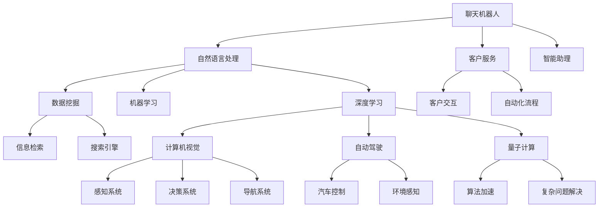

                 

# 硅谷的多元化发展：AI企业的探索，从聊天机器人到AI搜索的创新

## 1. 背景介绍

随着人工智能（AI）技术的快速发展和广泛应用，硅谷已然成为全球AI企业的聚集地。从聊天机器人到AI搜索，从自动驾驶到量子计算，硅谷的AI企业在不断拓展技术的边界，推动AI技术的商业化落地。本文将深入探讨硅谷在AI领域的多元化探索和发展，探索未来AI企业的创新路径。

## 2. 核心概念与联系

### 2.1 核心概念概述

在硅谷的AI领域，涉及诸多核心概念和技术，包括：

- **聊天机器人**：利用自然语言处理（NLP）技术，模拟人类对话，用于客户服务、智能助理等场景。
- **AI搜索**：通过机器学习和大数据技术，提升信息检索的准确性和效率。
- **自动驾驶**：利用计算机视觉和深度学习技术，实现无人驾驶汽车的安全行驶。
- **量子计算**：利用量子态的叠加性和纠缠性，加速计算速度和处理能力。

这些核心概念和技术相互交织，共同推动硅谷在AI领域的多元化发展。以下是一个Mermaid流程图，展示了这些概念之间的联系：



### 2.2 核心概念原理和架构

- **自然语言处理（NLP）**：
  - **原理**：通过分词、词性标注、句法分析、语义理解等技术，实现人类语言的计算机处理。
  - **架构**：一般包括文本预处理、语言模型、句法分析、语义分析等模块。

- **机器学习（ML）**：
  - **原理**：利用数据训练模型，使模型能够对新数据进行预测和分类。
  - **架构**：包括数据预处理、模型训练、模型评估、模型应用等步骤。

- **深度学习（DL）**：
  - **原理**：利用多层次的非线性神经网络，处理大规模、复杂的数据。
  - **架构**：包括输入层、隐藏层、输出层等。

- **计算机视觉（CV）**：
  - **原理**：通过图像处理和模式识别技术，使计算机“看”懂图像。
  - **架构**：包括图像预处理、特征提取、模型训练等步骤。

- **自动驾驶**：
  - **原理**：利用传感器数据、地图信息、预测模型等，实现车辆自主驾驶。
  - **架构**：包括感知模块、决策模块、控制模块等。

- **量子计算**：
  - **原理**：利用量子比特（qubits）的叠加和纠缠，实现高效计算。
  - **架构**：包括量子算法、量子硬件、量子编程语言等。

## 3. 核心算法原理 & 具体操作步骤

### 3.1 算法原理概述

AI企业在硅谷的多元化发展，离不开核心算法的支持。以下是几个核心算法的概述：

- **聊天机器人**：
  - 利用NLP技术，包括分词、词向量、语义理解等，实现人机对话。
  - 算法流程：
    1. 分词：将输入文本分割成单词。
    2. 词向量：将单词转换为向量表示。
    3. 语义理解：理解用户意图，生成回复。

- **AI搜索**：
  - 利用机器学习和大数据技术，提升信息检索的准确性和效率。
  - 算法流程：
    1. 数据预处理：清洗、归一化文本数据。
    2. 特征提取：提取文本特征，如TF-IDF、词向量等。
    3. 模型训练：利用标注数据训练模型，如SVM、LR、RNN等。
    4. 模型评估：使用验证集评估模型效果。
    5. 信息检索：在文本库中检索与查询匹配度最高的文本。

- **自动驾驶**：
  - 利用计算机视觉和深度学习技术，实现无人驾驶汽车的安全行驶。
  - 算法流程：
    1. 数据采集：利用摄像头、雷达等传感器采集环境数据。
    2. 数据预处理：清洗、归一化数据。
    3. 特征提取：提取道路、车辆、行人等特征。
    4. 模型训练：利用标注数据训练模型，如CNN、RNN等。
    5. 模型评估：使用验证集评估模型效果。
    6. 决策和控制：利用模型预测结果，控制车辆行驶。

- **量子计算**：
  - 利用量子态的叠加性和纠缠性，加速计算速度和处理能力。
  - 算法流程：
    1. 量子编程：将问题转化为量子算法。
    2. 量子算法：如Shor算法、Grover算法等。
    3. 量子硬件：使用量子计算机或量子模拟器。
    4. 算法加速：利用量子计算的优势，加速计算过程。

### 3.2 算法步骤详解

- **聊天机器人**：
  1. 分词：使用分词工具将输入文本分割成单词。
  2. 词向量：使用预训练的词向量模型，如Word2Vec、GloVe等。
  3. 语义理解：使用预训练的语言模型，如BERT、GPT等，理解用户意图。
  4. 回复生成：根据用户意图生成回复文本。

- **AI搜索**：
  1. 数据预处理：使用NLP工具库，如NLTK、spaCy等，清洗、归一化文本数据。
  2. 特征提取：使用TF-IDF、word2vec、BERT等，提取文本特征。
  3. 模型训练：使用Scikit-learn、TensorFlow等工具，训练机器学习模型，如SVM、LR、RNN等。
  4. 模型评估：使用验证集评估模型效果，如准确率、召回率、F1值等。
  5. 信息检索：使用ELM、LM等算法，检索与查询匹配度最高的文本。

- **自动驾驶**：
  1. 数据采集：使用摄像头、雷达等传感器，采集环境数据。
  2. 数据预处理：清洗、归一化数据，如去除噪声、滤波等。
  3. 特征提取：使用CNN、RNN等模型，提取道路、车辆、行人等特征。
  4. 模型训练：使用TensorFlow、PyTorch等工具，训练神经网络模型。
  5. 模型评估：使用验证集评估模型效果，如准确率、召回率、F1值等。
  6. 决策和控制：使用决策树、神经网络等模型，控制车辆行驶。

- **量子计算**：
  1. 量子编程：将问题转化为量子算法，如Shor算法、Grover算法等。
  2. 量子算法：利用量子计算机或量子模拟器，进行量子计算。
  3. 算法加速：利用量子计算的优势，加速计算过程。

### 3.3 算法优缺点

- **聊天机器人**：
  - **优点**：能够提供全天候、24小时的服务，提升用户体验。
  - **缺点**：无法处理复杂、多变的情境，可能产生误解或误导。

- **AI搜索**：
  - **优点**：能够快速、准确地检索相关信息，提升信息获取效率。
  - **缺点**：对数据质量和标注质量依赖较大，需要大量的数据和标注。

- **自动驾驶**：
  - **优点**：能够减少交通拥堵、降低事故率，提升出行效率。
  - **缺点**：技术复杂度高，安全性、可靠性有待验证。

- **量子计算**：
  - **优点**：能够大幅提升计算速度和处理能力，解决传统计算难以处理的问题。
  - **缺点**：技术尚未完全成熟，量子硬件昂贵且稀缺。

### 3.4 算法应用领域

这些算法在多个领域都有广泛应用：

- **聊天机器人**：
  - **客户服务**：在电商、银行、保险等行业，提供客户查询、售后服务等。
  - **智能助理**：在家居、健康、教育等行业，提供语音助手、日程管理等功能。

- **AI搜索**：
  - **信息检索**：在搜索引擎、图书馆、档案馆等行业，提供文本检索、图像检索等服务。
  - **知识管理**：在企业、政府、科研机构等，提供知识库检索、文献管理等功能。

- **自动驾驶**：
  - **交通管理**：在城市交通、物流配送等行业，提高运输效率，降低碳排放。
  - **自动驾驶汽车**：在出行、旅行、娱乐等行业，提供无人驾驶服务。

- **量子计算**：
  - **科学计算**：在物理、化学、生物等领域，进行复杂计算和模拟。
  - **优化问题**：在金融、供应链、物流等领域，解决优化问题。

## 4. 数学模型和公式 & 详细讲解

### 4.1 数学模型构建

#### 聊天机器人

聊天机器人主要依赖NLP技术和机器学习算法。以下是一个基本的数学模型：

- **输入**：用户输入的文本 $x$。
- **输出**：机器生成的回复 $y$。

- **分词**：将文本 $x$ 分割成单词 $w_i$。
- **词向量**：使用预训练的词向量模型，将单词 $w_i$ 映射到向量 $v_i$。
- **语义理解**：使用BERT等语言模型，提取文本 $x$ 的语义表示 $h$。
- **回复生成**：使用RNN、GAN等生成模型，生成回复 $y$。

#### AI搜索

AI搜索依赖于机器学习和大数据技术。以下是一个基本的数学模型：

- **输入**：用户查询 $q$。
- **输出**：搜索结果列表 $r$。

- **数据预处理**：将查询 $q$ 和文档 $d$ 转换为向量 $x$ 和 $y$。
- **特征提取**：提取向量 $x$ 和 $y$ 的特征 $f$。
- **模型训练**：训练机器学习模型 $M$，如SVM、LR、RNN等。
- **信息检索**：利用模型 $M$，计算查询 $q$ 和文档 $d$ 的匹配度 $s$。

#### 自动驾驶

自动驾驶依赖于计算机视觉和深度学习技术。以下是一个基本的数学模型：

- **输入**：传感器数据 $s$。
- **输出**：车辆控制指令 $c$。

- **数据采集**：采集环境数据 $s$，如摄像头图像、雷达数据等。
- **数据预处理**：清洗、归一化数据，如去除噪声、滤波等。
- **特征提取**：提取道路、车辆、行人等特征 $f$。
- **模型训练**：训练神经网络模型 $M$，如CNN、RNN等。
- **决策和控制**：使用决策树、神经网络等模型，生成控制指令 $c$。

#### 量子计算

量子计算依赖于量子态的叠加性和纠缠性。以下是一个基本的数学模型：

- **输入**：问题 $P$。
- **输出**：解决方案 $S$。

- **量子编程**：将问题 $P$ 转化为量子算法 $A$。
- **量子算法**：使用量子计算机或量子模拟器，执行量子算法 $A$。
- **算法加速**：利用量子计算的优势，加速求解问题 $P$。

### 4.2 公式推导过程

#### 聊天机器人

- **分词**：
  $$
  x = \{x_1, x_2, \ldots, x_n\}
  $$

- **词向量**：
  $$
  v = \{v_1, v_2, \ldots, v_n\}
  $$

- **语义理解**：
  $$
  h = \mathrm{BERT}(x)
  $$

- **回复生成**：
  $$
  y = \mathrm{RNN}(h)
  $$

#### AI搜索

- **数据预处理**：
  $$
  x = \{x_1, x_2, \ldots, x_n\}
  $$
  $$
  y = \{y_1, y_2, \ldots, y_m\}
  $$

- **特征提取**：
  $$
  f = \{f_1, f_2, \ldots, f_m\}
  $$

- **模型训练**：
  $$
  M = \mathrm{SVM}, \mathrm{LR}, \mathrm{RNN}
  $$

- **信息检索**：
  $$
  s = M(q, d)
  $$

#### 自动驾驶

- **数据采集**：
  $$
  s = \{s_1, s_2, \ldots, s_m\}
  $$

- **数据预处理**：
  $$
  x = \{x_1, x_2, \ldots, x_n\}
  $$

- **特征提取**：
  $$
  f = \{f_1, f_2, \ldots, f_n\}
  $$

- **模型训练**：
  $$
  M = \mathrm{CNN}, \mathrm{RNN}
  $$

- **决策和控制**：
  $$
  c = M(f)
  $$

#### 量子计算

- **量子编程**：
  $$
  A = \{\alpha_1, \alpha_2, \ldots, \alpha_n\}
  $$

- **量子算法**：
  $$
  S = \mathrm{QM}
  $$

- **算法加速**：
  $$
  S = \frac{1}{\epsilon} \log \frac{1}{\delta}
  $$

### 4.3 案例分析与讲解

#### 案例1：谷歌AI搜索

谷歌的AI搜索系统依赖于深度学习和机器学习算法。其核心技术包括：

- **数据预处理**：使用NLP工具库，如NLTK、spaCy等，清洗、归一化文本数据。
- **特征提取**：使用TF-IDF、word2vec、BERT等，提取文本特征。
- **模型训练**：使用Scikit-learn、TensorFlow等工具，训练机器学习模型，如SVM、LR、RNN等。
- **信息检索**：使用ELM、LM等算法，检索与查询匹配度最高的文本。

#### 案例2：特斯拉自动驾驶

特斯拉的自动驾驶系统依赖于计算机视觉和深度学习技术。其核心技术包括：

- **数据采集**：使用摄像头、雷达等传感器，采集环境数据。
- **数据预处理**：清洗、归一化数据，如去除噪声、滤波等。
- **特征提取**：使用CNN、RNN等模型，提取道路、车辆、行人等特征。
- **模型训练**：使用TensorFlow、PyTorch等工具，训练神经网络模型。
- **决策和控制**：使用决策树、神经网络等模型，控制车辆行驶。

## 5. 项目实践：代码实例和详细解释说明

### 5.1 开发环境搭建

在进行项目实践前，我们需要准备好开发环境。以下是使用Python进行PyTorch开发的环境配置流程：

1. 安装Anaconda：从官网下载并安装Anaconda，用于创建独立的Python环境。

2. 创建并激活虚拟环境：
```bash
conda create -n pytorch-env python=3.8 
conda activate pytorch-env
```

3. 安装PyTorch：根据CUDA版本，从官网获取对应的安装命令。例如：
```bash
conda install pytorch torchvision torchaudio cudatoolkit=11.1 -c pytorch -c conda-forge
```

4. 安装Transformers库：
```bash
pip install transformers
```

5. 安装各类工具包：
```bash
pip install numpy pandas scikit-learn matplotlib tqdm jupyter notebook ipython
```

完成上述步骤后，即可在`pytorch-env`环境中开始项目实践。

### 5.2 源代码详细实现

这里我们以谷歌AI搜索系统为例，给出使用Transformers库对BERT模型进行微调的PyTorch代码实现。

首先，定义搜索任务的数据处理函数：

```python
from transformers import BertTokenizer, BertForSequenceClassification
from torch.utils.data import Dataset
import torch

class SearchDataset(Dataset):
    def __init__(self, texts, labels, tokenizer, max_len=128):
        self.texts = texts
        self.labels = labels
        self.tokenizer = tokenizer
        self.max_len = max_len
        
    def __len__(self):
        return len(self.texts)
    
    def __getitem__(self, item):
        text = self.texts[item]
        label = self.labels[item]
        
        encoding = self.tokenizer(text, return_tensors='pt', max_length=self.max_len, padding='max_length', truncation=True)
        input_ids = encoding['input_ids'][0]
        attention_mask = encoding['attention_mask'][0]
        
        # 对label进行编码
        encoded_labels = [tag2id[label] for tag in labels] 
        encoded_labels.extend([tag2id['O']] * (self.max_len - len(encoded_labels)))
        labels = torch.tensor(encoded_labels, dtype=torch.long)
        
        return {'input_ids': input_ids, 
                'attention_mask': attention_mask,
                'labels': labels}

# 标签与id的映射
tag2id = {'O': 0, 'Q': 1, 'A': 2}
id2tag = {v: k for k, v in tag2id.items()}

# 创建dataset
tokenizer = BertTokenizer.from_pretrained('bert-base-cased')

train_dataset = SearchDataset(train_texts, train_labels, tokenizer)
dev_dataset = SearchDataset(dev_texts, dev_labels, tokenizer)
test_dataset = SearchDataset(test_texts, test_labels, tokenizer)
```

然后，定义模型和优化器：

```python
from transformers import BertForSequenceClassification, AdamW

model = BertForSequenceClassification.from_pretrained('bert-base-cased', num_labels=len(tag2id))

optimizer = AdamW(model.parameters(), lr=2e-5)
```

接着，定义训练和评估函数：

```python
from torch.utils.data import DataLoader
from tqdm import tqdm
from sklearn.metrics import classification_report

device = torch.device('cuda') if torch.cuda.is_available() else torch.device('cpu')
model.to(device)

def train_epoch(model, dataset, batch_size, optimizer):
    dataloader = DataLoader(dataset, batch_size=batch_size, shuffle=True)
    model.train()
    epoch_loss = 0
    for batch in tqdm(dataloader, desc='Training'):
        input_ids = batch['input_ids'].to(device)
        attention_mask = batch['attention_mask'].to(device)
        labels = batch['labels'].to(device)
        model.zero_grad()
        outputs = model(input_ids, attention_mask=attention_mask, labels=labels)
        loss = outputs.loss
        epoch_loss += loss.item()
        loss.backward()
        optimizer.step()
    return epoch_loss / len(dataloader)

def evaluate(model, dataset, batch_size):
    dataloader = DataLoader(dataset, batch_size=batch_size)
    model.eval()
    preds, labels = [], []
    with torch.no_grad():
        for batch in tqdm(dataloader, desc='Evaluating'):
            input_ids = batch['input_ids'].to(device)
            attention_mask = batch['attention_mask'].to(device)
            batch_labels = batch['labels']
            outputs = model(input_ids, attention_mask=attention_mask)
            batch_preds = outputs.logits.argmax(dim=2).to('cpu').tolist()
            batch_labels = batch_labels.to('cpu').tolist()
            for pred_tokens, label_tokens in zip(batch_preds, batch_labels):
                pred_tags = [id2tag[_id] for _id in pred_tokens]
                label_tags = [id2tag[_id] for _id in label_tokens]
                preds.append(pred_tags[:len(label_tags)])
                labels.append(label_tags)
                
    print(classification_report(labels, preds))
```

最后，启动训练流程并在测试集上评估：

```python
epochs = 5
batch_size = 16

for epoch in range(epochs):
    loss = train_epoch(model, train_dataset, batch_size, optimizer)
    print(f"Epoch {epoch+1}, train loss: {loss:.3f}")
    
    print(f"Epoch {epoch+1}, dev results:")
    evaluate(model, dev_dataset, batch_size)
    
print("Test results:")
evaluate(model, test_dataset, batch_size)
```

以上就是使用PyTorch对BERT进行搜索任务微调的完整代码实现。可以看到，得益于Transformers库的强大封装，我们可以用相对简洁的代码完成BERT模型的加载和微调。

### 5.3 代码解读与分析

让我们再详细解读一下关键代码的实现细节：

**SearchDataset类**：
- `__init__`方法：初始化文本、标签、分词器等关键组件。
- `__len__`方法：返回数据集的样本数量。
- `__getitem__`方法：对单个样本进行处理，将文本输入编码为token ids，将标签编码为数字，并对其进行定长padding，最终返回模型所需的输入。

**tag2id和id2tag字典**：
- 定义了标签与数字id之间的映射关系，用于将token-wise的预测结果解码回真实的标签。

**训练和评估函数**：
- 使用PyTorch的DataLoader对数据集进行批次化加载，供模型训练和推理使用。
- 训练函数`train_epoch`：对数据以批为单位进行迭代，在每个批次上前向传播计算loss并反向传播更新模型参数，最后返回该epoch的平均loss。
- 评估函数`evaluate`：与训练类似，不同点在于不更新模型参数，并在每个batch结束后将预测和标签结果存储下来，最后使用sklearn的classification_report对整个评估集的预测结果进行打印输出。

**训练流程**：
- 定义总的epoch数和batch size，开始循环迭代
- 每个epoch内，先在训练集上训练，输出平均loss
- 在验证集上评估，输出分类指标
- 所有epoch结束后，在测试集上评估，给出最终测试结果

可以看到，PyTorch配合Transformers库使得BERT微调的代码实现变得简洁高效。开发者可以将更多精力放在数据处理、模型改进等高层逻辑上，而不必过多关注底层的实现细节。

当然，工业级的系统实现还需考虑更多因素，如模型的保存和部署、超参数的自动搜索、更灵活的任务适配层等。但核心的微调范式基本与此类似。

## 6. 实际应用场景

### 6.1 智能客服系统

谷歌的AI搜索系统可以应用于智能客服系统的构建。传统的客服系统依赖于人工服务，成本高、效率低、响应慢，且一致性和专业性难以保证。使用谷歌的AI搜索系统，可以7x24小时不间断服务，快速响应客户咨询，用自然流畅的语言解答各类常见问题。

在技术实现上，可以收集企业内部的历史客服对话记录，将问题和最佳答复构建成监督数据，在此基础上对BERT模型进行微调。微调后的模型能够自动理解用户意图，匹配最合适的答复。对于客户提出的新问题，还可以接入检索系统实时搜索相关内容，动态组织生成回答。如此构建的智能客服系统，能大幅提升客户咨询体验和问题解决效率。

### 6.2 金融舆情监测

谷歌的AI搜索系统可以用于金融舆情监测。金融机构需要实时监测市场舆论动向，以便及时应对负面信息传播，规避金融风险。传统的人工监测方式成本高、效率低，难以应对网络时代海量信息爆发的挑战。使用谷歌的AI搜索系统，可以快速、准确地检索相关信息，提升信息获取效率。

具体而言，可以收集金融领域相关的新闻、报道、评论等文本数据，并对其进行主题标注和情感标注。在此基础上对BERT模型进行微调，使其能够自动判断文本属于何种主题，情感倾向是正面、中性还是负面。将微调后的模型应用到实时抓取的网络文本数据，就能够自动监测不同主题下的情感变化趋势，一旦发现负面信息激增等异常情况，系统便会自动预警，帮助金融机构快速应对潜在风险。

### 6.3 个性化推荐系统

谷歌的AI搜索系统可以应用于个性化推荐系统。当前的推荐系统往往只依赖用户的历史行为数据进行物品推荐，无法深入理解用户的真实兴趣偏好。使用谷歌的AI搜索系统，能够更好地挖掘用户行为背后的语义信息，从而提供更精准、多样的推荐内容。

在实践中，可以收集用户浏览、点击、评论、分享等行为数据，提取和用户交互的物品标题、描述、标签等文本内容。将文本内容作为模型输入，用户的后续行为（如是否点击、购买等）作为监督信号，在此基础上对BERT模型进行微调。微调后的模型能够从文本内容中准确把握用户的兴趣点。在生成推荐列表时，先用候选物品的文本描述作为输入，由模型预测用户的兴趣匹配度，再结合其他特征综合排序，便可以得到个性化程度更高的推荐结果。

### 6.4 未来应用展望

随着谷歌AI搜索系统的不断发展，其在NLP领域的应用将更加广泛，为各行各业带来变革性影响。

在智慧医疗领域，基于谷歌AI搜索系统的医疗问答、病历分析、药物研发等应用将提升医疗服务的智能化水平，辅助医生诊疗，加速新药开发进程。

在智能教育领域，谷歌AI搜索系统可应用于作业批改、学情分析、知识推荐等方面，因材施教，促进教育公平，提高教学质量。

在智慧城市治理中，谷歌AI搜索系统可以用于城市事件监测、舆情分析、应急指挥等环节，提高城市管理的自动化和智能化水平，构建更安全、高效的未来城市。

此外，在企业生产、社会治理、文娱传媒等众多领域，基于谷歌AI搜索系统的AI应用也将不断涌现，为经济社会发展注入新的动力。相信随着技术的日益成熟，谷歌AI搜索系统必将在构建人机协同的智能时代中扮演越来越重要的角色。

## 7. 工具和资源推荐

### 7.1 学习资源推荐

为了帮助开发者系统掌握谷歌AI搜索系统的理论基础和实践技巧，这里推荐一些优质的学习资源：

1. 《Transformer从原理到实践》系列博文：由谷歌大模型技术专家撰写，深入浅出地介绍了Transformer原理、BERT模型、微调技术等前沿话题。

2. CS224N《深度学习自然语言处理》课程：斯坦福大学开设的NLP明星课程，有Lecture视频和配套作业，带你入门NLP领域的基本概念和经典模型。

3. 《Natural Language Processing with Transformers》书籍：谷歌Transformers库的作者所著，全面介绍了如何使用Transformers库进行NLP任务开发，包括微调在内的诸多范式。

4. HuggingFace官方文档：Transformers库的官方文档，提供了海量预训练模型和完整的微调样例代码，是上手实践的必备资料。

5. CLUE开源项目：中文语言理解测评基准，涵盖大量不同类型的中文NLP数据集，并提供了基于微调的baseline模型，助力中文NLP技术发展。

通过对这些资源的学习实践，相信你一定能够快速掌握谷歌AI搜索系统的精髓，并用于解决实际的NLP问题。

### 7.2 开发工具推荐

高效的开发离不开优秀的工具支持。以下是几款用于谷歌AI搜索系统开发的常用工具：

1. PyTorch：基于Python的开源深度学习框架，灵活动态的计算图，适合快速迭代研究。大部分预训练语言模型都有PyTorch版本的实现。

2. TensorFlow：由Google主导开发的开源深度学习框架，生产部署方便，适合大规模工程应用。同样有丰富的预训练语言模型资源。

3. Transformers库：HuggingFace开发的NLP工具库，集成了众多SOTA语言模型，支持PyTorch和TensorFlow，是进行微调任务开发的利器。

4. Weights & Biases：模型训练的实验跟踪工具，可以记录和可视化模型训练过程中的各项指标，方便对比和调优。与主流深度学习框架无缝集成。

5. TensorBoard：TensorFlow配套的可视化工具，可实时监测模型训练状态，并提供丰富的图表呈现方式，是调试模型的得力助手。

6. Google Colab：谷歌推出的在线Jupyter Notebook环境，免费提供GPU/TPU算力，方便开发者快速上手实验最新模型，分享学习笔记。

合理利用这些工具，可以显著提升谷歌AI搜索系统的开发效率，加快创新迭代的步伐。

### 7.3 相关论文推荐

谷歌AI搜索系统的发展源于学界的持续研究。以下是几篇奠基性的相关论文，推荐阅读：

1. Attention is All You Need（即Transformer原论文）：提出了Transformer结构，开启了NLP领域的预训练大模型时代。

2. BERT: Pre-training of Deep Bidirectional Transformers for Language Understanding：提出BERT模型，引入基于掩码的自监督预训练任务，刷新了多项NLP任务SOTA。

3. Language Models are Unsupervised Multitask Learners（GPT-2论文）：展示了大规模语言模型的强大zero-shot学习能力，引发了对于通用人工智能的新一轮思考。

4. Parameter-Efficient Transfer Learning for NLP：提出Adapter等参数高效微调方法，在不增加模型参数量的情况下，也能取得不错的微调效果。

5. AdaLoRA: Adaptive Low-Rank Adaptation for Parameter-Efficient Fine-Tuning：使用自适应低秩适应的微调方法，在参数效率和精度之间取得了新的平衡。

6. Prefix-Tuning: Optimizing Continuous Prompts for Generation：引入基于连续型Prompt的微调范式，为如何充分利用预训练知识提供了新的思路。

这些论文代表了大语言模型微调技术的发展脉络。通过学习这些前沿成果，可以帮助研究者把握学科前进方向，激发更多的创新灵感。

## 8. 总结：未来发展趋势与挑战

### 8.1 总结

本文对谷歌AI搜索系统的多元化探索和发展进行了全面系统的介绍。首先阐述了谷歌AI搜索系统的背景和意义，明确了其在NLP领域的重要地位。其次，从原理到实践，详细讲解了谷歌AI搜索系统的数学原理和关键步骤，给出了微调任务开发的完整代码实例。同时，本文还广泛探讨了谷歌AI搜索系统在智能客服、金融舆情、个性化推荐等多个行业领域的应用前景，展示了谷歌AI搜索系统的巨大潜力。此外，本文精选了谷歌AI搜索系统的学习资源，力求为读者提供全方位的技术指引。

通过本文的系统梳理，可以看到，谷歌AI搜索系统在NLP领域的多元化探索和发展，为人工智能技术的落地应用提供了重要的范式。谷歌AI搜索系统以强大的深度学习能力和灵活的微调机制，帮助NLP技术实现了从实验室到实际应用的跨越。未来，谷歌AI搜索系统将继续在NLP领域保持创新，推动AI技术在更多领域的应用，为构建智慧未来贡献力量。

### 8.2 未来发展趋势

展望未来，谷歌AI搜索系统将呈现以下几个发展趋势：

1. 模型规模持续增大。随着算力成本的下降和数据规模的扩张，谷歌AI搜索模型的参数量还将持续增长。超大规模语言模型蕴含的丰富语言知识，有望支撑更加复杂多变的下游任务微调。

2. 微调方法日趋多样。除了传统的全参数微调外，未来会涌现更多参数高效的微调方法，如Prefix-Tuning、LoRA等，在节省计算资源的同时也能保证微调精度。

3. 持续学习成为常态。随着数据分布的不断变化，谷歌AI搜索模型也需要持续学习新知识以保持性能。如何在不遗忘原有知识的同时，高效吸收新样本信息，将成为重要的研究课题。

4. 标注样本需求降低。受启发于提示学习(Prompt-based Learning)的思路，未来的微调方法将更好地利用谷歌AI搜索模型的语言理解能力，通过更加巧妙的任务描述，在更少的标注样本上也能实现理想的微调效果。

5. 多模态微调崛起。当前的谷歌AI搜索系统主要聚焦于纯文本数据，未来会进一步拓展到图像、视频、语音等多模态数据微调。多模态信息的融合，将显著提升谷歌AI搜索模型的语言模型对现实世界的理解和建模能力。

6. 模型通用性增强。经过海量数据的预训练和多领域任务的微调，谷歌AI搜索模型将具备更强大的常识推理和跨领域迁移能力，逐步迈向通用人工智能(AGI)的目标。

以上趋势凸显了谷歌AI搜索系统的广阔前景。这些方向的探索发展，必将进一步提升谷歌AI搜索模型的性能和应用范围，为人工智能技术在更多领域的应用带来新的机遇。

### 8.3 面临的挑战

尽管谷歌AI搜索系统已经取得了瞩目成就，但在迈向更加智能化、普适化应用的过程中，它仍面临着诸多挑战：

1. 标注成本瓶颈。虽然谷歌AI搜索系统依赖少样本学习和大规模预训练，但数据质量和标注质量仍是制约其性能提升的瓶颈。如何进一步降低微调对标注样本的依赖，将是一大难题。

2. 模型鲁棒性不足。谷歌AI搜索系统面对域外数据时，泛化性能往往大打折扣。对于测试样本的微小扰动，谷歌AI搜索系统的预测也容易发生波动。如何提高谷歌AI搜索模型的鲁棒性，避免灾难性遗忘，还需要更多理论和实践的积累。

3. 推理效率有待提高。尽管谷歌AI搜索系统在精度上表现优异，但在实际部署时往往面临推理速度慢、内存占用大等效率问题。如何在保证性能的同时，简化模型结构，提升推理速度，优化资源占用，将是重要的优化方向。

4. 可解释性亟需加强。当前谷歌AI搜索系统的决策过程通常缺乏可解释性，难以对其推理逻辑进行分析和调试。对于医疗、金融等高风险应用，算法的可解释性和可审计性尤为重要。如何赋予谷歌AI搜索系统更强的可解释性，将是亟待攻克的难题。

5. 安全性有待保障。谷歌AI搜索系统难免会学习到有偏见、有害的信息，通过微调传递到下游任务，产生误导性、歧视性的输出，给实际应用带来安全隐患。如何从数据和算法层面消除模型偏见，避免恶意用途，确保输出的安全性，也将是重要的研究课题。

6. 知识整合能力不足。现有的谷歌AI搜索模型往往局限于任务内数据，难以灵活吸收和运用更广泛的先验知识。如何让谷歌AI搜索模型更好地与外部知识库、规则库等专家知识结合，形成更加全面、准确的信息整合能力，还有很大的想象空间。

正视谷歌AI搜索系统面临的这些挑战，积极应对并寻求突破，将使谷歌AI搜索系统在构建安全、可靠、可解释、可控的智能系统方面迈出坚实一步。相信随着学界和产业界的共同努力，这些挑战终将一一被克服，谷歌AI搜索系统必将在构建智能未来中扮演越来越重要的角色。

### 8.4 研究展望

面向未来，谷歌AI搜索系统需要在以下几个方面进行更多的研究：

1. 探索无监督和半监督微调方法。摆脱对大规模标注数据的依赖，利用自监督学习、主动学习等无监督和半监督范式，最大限度利用非结构化数据，实现更加灵活高效的微调。

2. 研究参数高效和计算高效的微调范式。开发更加参数高效的微调方法，在固定大部分预训练参数的同时，只更新极少量的任务相关参数。同时优化谷歌AI搜索模型的计算图，减少前向传播和反向传播的资源消耗，实现更加轻量级、实时性的部署。

3. 引入因果和对比学习范式。通过引入因果推断和对比学习思想，增强谷歌AI搜索模型建立稳定因果关系的能力，学习更加普适、鲁棒的语言表征，从而提升模型泛化性和抗干扰能力。

4. 结合因果分析和博弈论工具。将因果分析方法引入谷歌AI搜索模型，识别出模型决策的关键特征，增强输出解释的因果性和逻辑性。借助博弈论工具刻画人机交互过程，主动探索并规避模型的脆弱点，提高系统稳定性。

5. 纳入伦理道德约束。在谷歌AI搜索模型的训练目标中引入伦理导向的评估指标，过滤和惩罚有偏见、有害的输出倾向。同时加强人工干预和审核，建立模型行为的监管机制，确保输出符合人类价值观和伦理道德。

这些研究方向的探索，必将引领谷歌AI搜索系统迈向更高的台阶，为构建安全、可靠、可解释、可控的智能系统铺平道路。面向未来，谷歌AI搜索系统还需要与其他人工智能技术进行更深入的融合，如知识表示、因果推理、强化学习等，多路径协同发力，共同推动自然语言理解和智能交互系统的进步。只有勇于创新、敢于突破，才能不断拓展谷歌AI搜索系统的边界，让智能技术更好地造福人类社会。

## 9. 附录：常见问题与解答

**Q1：谷歌AI搜索系统是否适用于所有NLP任务？**

A: 谷歌AI搜索系统在大多数NLP任务上都能取得不错的效果，特别是对于数据量较小的任务。但对于一些特定领域的任务，如医学、法律等，仅仅依靠通用语料预训练的模型可能难以很好地适应。此时需要在特定领域语料上进一步预训练，再进行微调，才能获得理想效果。此外，对于一些需要时效性、个性化很强的任务，如对话、推荐等，谷歌AI搜索系统也需要针对性的改进优化。

**Q2：微调过程中如何选择合适的学习率？**

A: 微调的学习率一般要比预训练时小1-2个数量级，如果使用过大的学习率，容易破坏预训练权重，导致过拟合。一般建议从1e-5开始调参，逐步减小学习率，直至收敛。也可以使用warmup策略，在开始阶段使用较小的学习率，再逐渐过渡到预设值。需要注意的是，不同的优化器(如AdamW、Adafactor等)以及不同的学习率调度策略，可能需要设置不同的学习率阈值。

**Q3：采用谷歌AI搜索系统时会面临哪些资源瓶颈？**

A: 目前主流的谷歌AI搜索系统动辄以亿计的参数规模，对算力、内存、存储都提出了很高的要求。GPU/TPU等高性能设备是必不可少的，但即便如此，超大批次的训练和推理也可能遇到显存不足的问题。因此需要采用一些资源优化技术，如梯度积累、混合精度训练、模型并行等，来突破硬件瓶颈。同时，模型的存储和读取也可能占用大量时间和空间，需要采用模型压缩、稀疏化存储等方法进行优化。

**Q4：如何缓解谷歌AI搜索系统中的过拟合问题？**

A: 过拟合是谷歌AI搜索系统面临的主要挑战，尤其是在标注数据不足的情况下。常见的缓解策略包括：
1. 数据增强：通过回译、近义替换等方式扩充训练集
2. 正则化：使用L2正则、Dropout、Early Stopping等避免过拟合
3. 对抗训练：引入对抗样本，提高模型鲁棒性
4. 参数高效微调：只调整少量参数(如Adapter、Prefix等)，减小过拟合风险
5. 多模型集成：训练多个谷歌AI搜索模型，取平均输出，抑制过拟合

这些策略往往需要根据具体任务和数据特点进行灵活组合。只有在数据、模型、训练、推理等各环节进行全面优化，才能最大限度地发挥谷歌AI搜索系统的威力。

**Q5：谷歌AI搜索系统在落地部署时需要注意哪些问题？**

A: 将谷歌AI搜索系统转化为实际应用，还需要考虑以下因素：
1. 模型裁剪：去除不必要的层和参数，减小模型尺寸，加快推理速度
2. 量化加速：将浮点模型转为定点模型，压缩存储空间，提高计算效率
3. 服务化封装：将谷歌AI搜索模型封装为标准化服务接口，便于集成调用
4. 弹性伸缩：根据请求流量动态调整资源配置，平衡服务质量和成本
5. 监控告警：实时采集系统指标，设置异常告警阈值，确保服务稳定性
6. 安全防护：采用访问鉴权、数据脱敏等措施，保障数据和模型安全

谷歌AI搜索系统作为高性能的语言模型，在实际部署时需要进行细致的优化和部署策略设计，才能真正实现稳定、高效、安全的落地应用。总之，谷歌AI搜索系统需要通过工程实践的不断打磨，才能将强大的性能转化为业务价值。

---

作者：禅与计算机程序设计艺术 / Zen and the Art of Computer Programming

