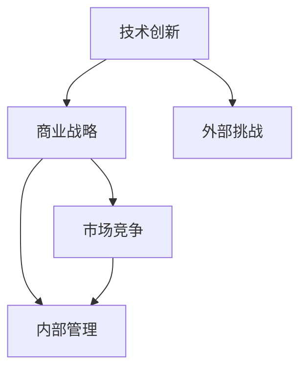

                 

# 硅谷科技巨头的兴衰:从HP到谷歌

## 1. 背景介绍

### 1.1 问题由来

硅谷，作为全球高科技的孵化器和创新中心，孕育了众多世界级的科技巨头。然而，正如科技创新不息，科技巨头的兴衰也伴随着历史的演进。本文将以惠普（HP）和谷歌（Google）为例，探讨硅谷科技巨头从辉煌到落幕的传奇故事，剖析背后的技术变迁、商业战略以及市场竞争等因素。

惠普（HP）成立于1939年，由帕卡德和帕卡德共同创立，总部位于美国加利福尼亚州帕洛阿尔托。它曾是一家电脑硬件巨头，生产了全球第一台商用电脑以及众多著名的计算机产品。然而，随着科技的快速发展，惠普经历了多次业务重组，最终逐渐失去竞争力，未能跟上时代的步伐，最终在2015年被思科收购。

谷歌（Google）成立于1998年，由拉里·佩奇和谢尔盖·布林创立。谷歌最初是一个提供搜索服务的网站，但由于其技术创新和商业模式，很快成长为全球最大的互联网公司之一。谷歌旗下产品如Google Maps、YouTube、Google Photos等风靡全球，成为人们日常生活不可或缺的一部分。

通过研究这两个科技巨头的兴衰史，我们可以更深入地理解硅谷科技公司的成长、成熟和衰落，以及这些公司如何适应变化万千的市场环境。

### 1.2 问题核心关键点

探讨硅谷科技巨头的兴衰，我们需要关注以下核心关键点：

- **技术创新与突破**：科技巨头依赖于持续的技术创新来实现市场领导地位，并应对市场竞争。
- **商业战略与决策**：科技公司的成长和衰落，往往与它们的战略决策紧密相关。
- **市场竞争与环境**：市场环境的变化，包括技术发展、消费者需求、法规政策等，都会对科技公司产生重大影响。
- **内部管理与文化**：内部管理水平和文化氛围，影响科技公司的效率和创新能力。
- **外部挑战与机遇**：外部挑战，如经济危机、政策变化、竞争对手行动等，对科技公司产生重大影响。

通过分析这些关键点，我们可以更全面地理解科技公司的成长和衰落机制。

## 2. 核心概念与联系

### 2.1 核心概念概述

硅谷科技巨头的故事涉及到多个核心概念，包括：

- **技术创新**：持续的技术创新是科技公司保持市场领导地位的关键。
- **商业战略**：科技公司的成长和衰落，往往与它们的商业战略决策紧密相关。
- **市场竞争**：市场竞争激烈，科技公司需要不断适应变化的市场环境。
- **内部管理**：内部管理水平和文化氛围，影响科技公司的效率和创新能力。
- **外部挑战**：外部挑战，如经济危机、政策变化、竞争对手行动等，对科技公司产生重大影响。

这些概念之间的逻辑关系可以通过以下Mermaid流程图来展示：



这个流程图展示了这个网络中各个概念之间的相互作用关系：

1. 技术创新推动了商业战略的制定和执行。
2. 商业战略决定了公司如何应对市场竞争。
3. 市场竞争要求公司不断进行内部管理和文化建设。
4. 外部挑战也对公司的内部管理和市场竞争产生影响。
5. 技术创新和外部挑战相互交织，影响公司的整体表现。

## 3. 核心算法原理 & 具体操作步骤

### 3.1 算法原理概述

硅谷科技巨头的兴衰涉及到的算法原理主要是系统的持续监控和优化，包括：

- **动态系统优化**：持续监控公司运营状况，动态调整策略。
- **市场预测**：通过数据分析预测市场需求，调整产品和服务。
- **风险管理**：评估和应对潜在风险，确保公司健康成长。

### 3.2 算法步骤详解

科技巨头的持续优化和市场预测通常包括以下步骤：

1. **数据收集**：收集公司运营数据、市场数据、消费者反馈等。
2. **数据分析**：运用统计学、机器学习等方法，分析数据，找出趋势和模式。
3. **模型构建**：构建预测模型，预测市场需求、产品接受度等。
4. **策略调整**：根据预测结果和数据分析结果，调整商业策略。
5. **执行和监控**：实施调整后的策略，并持续监控效果。

### 3.3 算法优缺点

科技巨头的持续优化和市场预测算法具有以下优点：

- **实时性**：能够快速响应市场变化，灵活调整策略。
- **精准性**：通过数据分析和模型构建，预测准确性较高。

但同时也存在以下缺点：

- **复杂性**：模型构建和数据分析过程复杂，需要大量计算资源。
- **数据依赖**：预测结果依赖于数据的质量和全面性，数据偏差可能影响结果。

### 3.4 算法应用领域

硅谷科技巨头的算法应用涵盖了多个领域，包括：

- **运营优化**：如库存管理、供应链优化等。
- **产品开发**：如市场接受度预测、产品设计优化等。
- **市场扩展**：如潜在市场分析、竞争者分析等。

这些应用领域的成功案例，展示了算法在科技巨头战略决策中的重要作用。

## 4. 数学模型和公式 & 详细讲解 & 举例说明

### 4.1 数学模型构建

硅谷科技巨头使用多种数学模型进行市场预测和运营优化，其中主要包括：

- **回归分析**：用于预测市场需求，如销售额预测。
- **时间序列分析**：用于分析市场趋势，如季节性需求变化。
- **聚类分析**：用于市场细分，如客户群体分类。

### 4.2 公式推导过程

以销售额预测为例，常用的回归分析模型为线性回归，公式如下：

$$
y = \beta_0 + \beta_1x_1 + \beta_2x_2 + ... + \beta_nx_n + \epsilon
$$

其中，$y$ 为销售额，$x_i$ 为影响因素，$\beta_i$ 为回归系数，$\epsilon$ 为误差项。

### 4.3 案例分析与讲解

以谷歌为例，谷歌在预测搜索流量和广告收入时，采用线性回归模型分析多个影响因素，如搜索量、广告点击率、点击成本等，构建预测模型。通过不断调整回归系数和数据集，谷歌能够精准预测市场变化，及时调整广告投放策略。

## 5. 项目实践：代码实例和详细解释说明

### 5.1 开发环境搭建

在进行市场预测实践前，我们需要准备好开发环境。以下是使用Python进行Scikit-learn开发的环境配置流程：

1. 安装Anaconda：从官网下载并安装Anaconda，用于创建独立的Python环境。

2. 创建并激活虚拟环境：
```bash
conda create -n market-env python=3.8 
conda activate market-env
```

3. 安装Scikit-learn：
```bash
pip install scikit-learn
```

4. 安装各类工具包：
```bash
pip install numpy pandas scikit-learn matplotlib tqdm jupyter notebook ipython
```

完成上述步骤后，即可在`market-env`环境中开始市场预测实践。

### 5.2 源代码详细实现

下面我们以谷歌市场预测为例，给出使用Scikit-learn进行线性回归预测的Python代码实现。

```python
from sklearn.linear_model import LinearRegression
from sklearn.metrics import mean_squared_error
from sklearn.model_selection import train_test_split

# 数据加载
X = pd.read_csv('market_data.csv', index_col='date')
y = pd.read_csv('sales_data.csv', index_col='date')

# 数据预处理
X = X.dropna()
y = y.dropna()

# 特征工程
X = X[X.columns[:-1]]

# 模型构建和训练
X_train, X_test, y_train, y_test = train_test_split(X, y, test_size=0.2)
model = LinearRegression()
model.fit(X_train, y_train)

# 模型评估
y_pred = model.predict(X_test)
mse = mean_squared_error(y_test, y_pred)
print(f"MSE: {mse}")
```

### 5.3 代码解读与分析

让我们再详细解读一下关键代码的实现细节：

**数据加载**：
- `pd.read_csv`：使用Pandas库读取市场数据和销售数据，将日期作为索引。

**数据预处理**：
- `X.dropna()` 和 `y.dropna()`：删除缺失数据，确保数据完整性。

**特征工程**：
- `X[X.columns[:-1]]`：保留所有特征，去掉最后的时间戳列。

**模型构建和训练**：
- `train_test_split`：将数据集划分为训练集和测试集。
- `LinearRegression`：构建线性回归模型。
- `model.fit`：对模型进行训练。

**模型评估**：
- `model.predict`：对测试集进行预测。
- `mean_squared_error`：计算预测值与真实值之间的均方误差。

## 6. 实际应用场景

### 6.1 谷歌搜索流量预测

谷歌是全球最大的搜索引擎，每天处理数亿次搜索请求。通过市场预测算法，谷歌能够精确预测不同时间段和关键词的搜索流量，从而优化搜索引擎的资源配置和广告投放策略。

### 6.2 谷歌广告收入预测

谷歌广告收入的预测是谷歌市场预测的重要应用之一。通过分析历史广告数据、搜索量、点击率等关键指标，谷歌能够预测未来的广告收入，帮助企业制定合理的广告预算。

### 6.3 谷歌产品推广预测

谷歌旗下产品众多，如Google Maps、YouTube、Google Photos等。通过市场预测算法，谷歌能够预测不同产品的市场接受度和推广效果，优化产品推广策略。

### 6.4 未来应用展望

随着市场预测技术的不断发展，硅谷科技巨头的预测算法将更加智能和高效，推动更多领域的应用。

在智慧城市治理中，市场预测算法可以用于交通流量预测、能源消耗预测等，提升城市管理的智能化水平。

在金融领域，市场预测算法可以用于股票市场预测、货币汇率预测等，帮助投资者做出更明智的决策。

在教育领域，市场预测算法可以用于预测学生成绩、课程需求等，优化教育资源配置。

未来，随着科技的进一步发展，市场预测算法将更加广泛地应用于各个领域，为社会发展和企业决策提供强有力的支持。

## 7. 工具和资源推荐

### 7.1 学习资源推荐

为了帮助开发者系统掌握市场预测的理论基础和实践技巧，这里推荐一些优质的学习资源：

1. 《Python数据分析与可视化》系列博文：由知名数据分析师撰写，详细介绍数据分析和可视化工具的使用，适合初学者入门。

2. 《统计学习基础》课程：由斯坦福大学提供，系统讲解统计学和机器学习基础，适合进一步深入学习。

3. 《机器学习实战》书籍：详细介绍了机器学习算法的实现和应用，适合动手实践。

4. Scikit-learn官方文档：Scikit-learn库的官方文档，提供了丰富的示例代码和文档，是学习市场预测算法的必备资源。

5. Kaggle平台：全球知名的数据科学竞赛平台，提供了丰富的市场预测数据集和社区资源，适合实践和交流。

通过对这些资源的学习实践，相信你一定能够快速掌握市场预测技术的精髓，并用于解决实际的商业问题。

### 7.2 开发工具推荐

高效的开发离不开优秀的工具支持。以下是几款用于市场预测开发的常用工具：

1. Python：全球最流行的编程语言之一，拥有丰富的库和工具，支持高效的数据分析和建模。

2. Scikit-learn：基于Python的开源机器学习库，提供了丰富的回归、分类、聚类等算法，是市场预测开发的利器。

3. TensorFlow：由Google主导开发的开源机器学习框架，支持分布式计算，适合大规模数据处理和模型训练。

4. Weights & Biases：模型训练的实验跟踪工具，可以记录和可视化模型训练过程中的各项指标，方便对比和调优。

5. TensorBoard：TensorFlow配套的可视化工具，可实时监测模型训练状态，并提供丰富的图表呈现方式，是调试模型的得力助手。

6. Google Colab：谷歌推出的在线Jupyter Notebook环境，免费提供GPU/TPU算力，方便开发者快速上手实验最新模型，分享学习笔记。

合理利用这些工具，可以显著提升市场预测任务的开发效率，加快创新迭代的步伐。

### 7.3 相关论文推荐

市场预测技术的发展源于学界的持续研究。以下是几篇奠基性的相关论文，推荐阅读：

1. "Forecasting future sales using historical sales data"：展示了如何使用历史销售数据进行市场预测。

2. "Linear regression analysis for stock market prediction"：介绍了如何使用线性回归模型进行股票市场预测。

3. "Time series analysis for market trend prediction"：讲述了时间序列分析在市场趋势预测中的应用。

4. "Machine learning techniques for customer behavior prediction"：介绍了机器学习算法在客户行为预测中的应用。

5. "Random forests for product market prediction"：介绍了随机森林在产品市场预测中的应用。

这些论文代表了大市场预测技术的发展脉络。通过学习这些前沿成果，可以帮助研究者把握学科前进方向，激发更多的创新灵感。

## 8. 总结：未来发展趋势与挑战

### 8.1 总结

本文对硅谷科技巨头的兴衰进行了全面系统的介绍，分析了技术创新、商业战略、市场竞争、内部管理、外部挑战等关键因素。通过分析惠普和谷歌的兴衰史，展示了科技巨头在成长、成熟和衰落过程中的核心变化，以及这些变化如何影响公司的市场表现。

通过本文的系统梳理，可以看到，硅谷科技巨头之所以能够成为全球科技行业的领军企业，源于其在技术创新、商业策略、市场预测等方面的持续努力和优化。然而，随着市场环境的变化和科技发展的加速，这些科技巨头也面临着诸多挑战，需要不断调整策略，适应新的市场环境。

### 8.2 未来发展趋势

展望未来，硅谷科技巨头的市场预测技术将呈现以下几个发展趋势：

1. **智能化预测**：随着机器学习和深度学习技术的发展，市场预测将更加智能化，能够处理更复杂的数据结构和更大规模的数据集。

2. **实时化预测**：实时数据流的引入，使得市场预测能够实时反应市场变化，快速调整策略。

3. **多模态预测**：结合图像、语音、文本等多种数据源，提升市场预测的准确性和全面性。

4. **自动化预测**：引入自动机器学习（AutoML）技术，降低人工调参成本，提升预测效率。

5. **集成预测**：通过集成多个预测模型的结果，提升预测的鲁棒性和稳定性。

6. **跨领域应用**：市场预测技术将应用于更多领域，如金融、医疗、教育等，推动更多行业的发展。

这些趋势预示着市场预测技术的未来发展方向，将为硅谷科技巨头的市场决策提供更强大的支持，推动更多的创新应用。

### 8.3 面临的挑战

尽管市场预测技术已经取得了显著成就，但在迈向更加智能化、实时化应用的过程中，它仍面临着诸多挑战：

1. **数据质量和多样性**：高质量、多样化的数据是市场预测的前提，但数据获取和处理难度大。

2. **模型复杂性和解释性**：复杂的预测模型难以解释，可能存在“黑箱”问题，影响模型的可靠性和可信度。

3. **计算资源需求**：高复杂度的模型需要大量的计算资源，成本较高。

4. **隐私和安全问题**：市场预测涉及大量个人和企业数据，数据隐私和安全问题不容忽视。

5. **跨领域应用难度**：不同领域的预测需求和数据结构差异大，跨领域应用需要更多研究。

这些挑战需要科技巨头和研究机构共同努力，寻找解决方案，确保市场预测技术的健康发展和广泛应用。

### 8.4 研究展望

未来的市场预测研究需要在以下几个方面寻求新的突破：

1. **无监督和半监督预测**：摆脱对大规模标注数据的依赖，利用无监督和半监督学习方法，最大限度利用非结构化数据，实现更加灵活高效的预测。

2. **多模态融合预测**：结合图像、语音、文本等多种数据源，提升市场预测的准确性和全面性。

3. **自动化预测系统**：引入自动机器学习技术，降低人工调参成本，提升预测效率。

4. **数据治理和安全**：加强数据治理和安全保护，确保市场预测过程中的数据隐私和安全。

5. **跨领域应用推广**：推动市场预测技术在更多领域的推广和应用，提升各行业的智能化水平。

通过这些研究方向的探索，市场预测技术将更加成熟和完善，为更多领域的决策提供强有力的支持，推动硅谷科技巨头的持续成长和成功。

## 9. 附录：常见问题与解答

**Q1：市场预测模型是否适用于所有行业？**

A: 市场预测模型在多个行业都有广泛应用，如金融、零售、制造业等。但不同行业的数据特点和预测目标有所不同，需要根据具体情况进行调整和优化。

**Q2：市场预测模型的学习速度是否足够快？**

A: 市场预测模型通常需要大量的历史数据进行训练，学习速度相对较慢。但随着数据量的增加和算法的优化，预测模型的学习速度正在不断提升。

**Q3：市场预测模型是否需要大量计算资源？**

A: 复杂模型确实需要大量的计算资源，但随着硬件技术的进步和算法优化，市场预测模型的计算成本正在逐步降低。

**Q4：市场预测模型的预测准确度如何？**

A: 市场预测模型的预测准确度受到数据质量、模型选择、参数调优等多方面因素的影响。在实际应用中，需要不断调整和优化，才能达到理想的预测效果。

**Q5：市场预测模型在实际应用中是否可靠？**

A: 市场预测模型的可靠性与数据质量、模型复杂度、算法选择等多方面因素有关。需要结合实际应用场景，选择合适的模型和算法，确保预测结果的可靠性和可信度。

通过本文的系统梳理，可以看到，硅谷科技巨头的市场预测技术在多个领域发挥了重要作用，推动了企业的决策优化和业务发展。未来，随着技术的发展和应用的推广，市场预测技术将更加智能化和实时化，为硅谷科技巨头带来更多的发展机遇和挑战。

