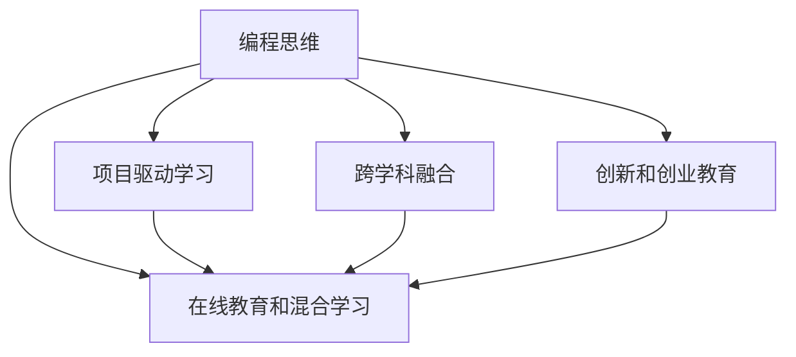

                 

## 1. 背景介绍

在互联网和人工智能飞速发展的当下，编程作为一门至关重要的技能，其教学方式和课程内容也在不断进化。硅谷作为全球科技创新的中心，其编程教育的发展趋势，对于全球编程教育的发展具有重要的指导意义。本文将深入探讨硅谷编程教育的最新动态，剖析其未来发展趋势，为全球编程教育提供借鉴。

### 1.1 编程教育的现状与挑战

当前，编程教育正面临着严峻的挑战。尽管编程已经普及到了各级学校和教育机构，但教学效果仍然不尽如人意。编程教育的现状主要表现在以下几个方面：

- **课程内容滞后**：传统编程课程往往以技术为导向，忽视了编程思维和问题解决能力的培养。
- **教学方法单一**：大多数编程课程仍采用填鸭式教学，缺乏互动和实践机会。
- **教师资源不足**：合格编程教师的短缺，导致了编程教育的质量和可及性问题。
- **学生学习动机不足**：部分学生对编程缺乏兴趣，导致学习效果不佳。

### 1.2 编程教育的重要性和紧迫性

编程教育的紧迫性体现在以下几个方面：

- **信息技术时代的需求**：随着信息技术的广泛应用，编程技能成为了各行各业的必备能力。
- **创新驱动经济**：编程是创新和创业的基础，有助于培养未来的科技创新者。
- **提升竞争力**：编程技能有助于提高个人的职业竞争力，适应快速变化的就业市场。

### 1.3 硅谷编程教育的现状

硅谷作为全球科技创新中心，其编程教育在创新和实践方面表现出色。以下是硅谷编程教育的一些典型特征：

- **注重实践和项目驱动**：硅谷编程教育重视实践和项目驱动，通过实际项目培养学生的编程思维和解决问题能力。
- **跨学科融合**：硅谷编程教育强调跨学科融合，将编程与数学、科学、艺术等学科相结合，提升学生的综合素质。
- **创新和创业教育**：硅谷编程教育注重创新和创业能力的培养，鼓励学生开发新的技术和产品。
- **在线教育和混合学习**：硅谷编程教育充分利用在线资源和混合学习模式，提升教学效率和可及性。

## 2. 核心概念与联系

### 2.1 核心概念概述

为更好地理解硅谷编程教育的发展趋势，我们首先需要明确一些核心概念及其联系。

- **编程思维**：指用计算机思维方式分析和解决问题的方法，包括算法思维、抽象思维和结构化思维等。
- **项目驱动学习**：以实际项目为载体，通过解决真实问题来学习编程知识和技能。
- **跨学科融合**：将编程与数学、科学、艺术等学科相结合，提升学生的综合素质。
- **创新和创业教育**：通过实践和项目，培养学生的创新思维和创业能力。
- **在线教育和混合学习**：利用互联网和混合学习模式，提升编程教育的可及性和效率。

这些概念之间存在密切联系，共同构成了硅谷编程教育的核心内容和方法。通过理解这些概念，我们可以更好地把握硅谷编程教育的发展趋势。

### 2.2 核心概念原理和架构的 Mermaid 流程图



这个流程图展示了编程思维、项目驱动学习、跨学科融合、创新和创业教育以及在线教育和混合学习之间的关系。

## 3. 核心算法原理 & 具体操作步骤

### 3.1 算法原理概述

硅谷编程教育的核心理论和算法包括：

- **问题解决模型**：通过实际问题，引导学生从分析问题、设计算法、编写代码到调试优化，逐步培养编程思维和解决问题的能力。
- **模块化教学法**：将编程课程分为多个模块，每个模块专注于特定的编程技能和知识，逐步构建完整的编程能力。
- **项目式学习**：通过实际项目，让学生在真实环境中应用所学知识和技能，提升实战能力。

### 3.2 算法步骤详解

硅谷编程教育的步骤一般包括：

1. **需求分析**：通过实际项目的需求分析，引导学生理解问题背景和要求。
2. **设计算法**：在需求分析的基础上，设计出解决问题的算法。
3. **编写代码**：将算法转化为具体代码，实现功能。
4. **测试和调试**：对代码进行测试，修复错误，优化性能。
5. **项目展示**：通过项目展示，评估学习效果，分享学习成果。

### 3.3 算法优缺点

硅谷编程教育的优点包括：

- **实践性强**：通过项目驱动和实战训练，提升学生的编程技能和解决问题能力。
- **跨学科融合**：培养学生的综合素质，提升其跨学科合作和创新能力。
- **适应性强**：混合学习和在线教育的模式，提升编程教育的可及性和灵活性。

缺点方面，硅谷编程教育面临一些挑战：

- **资源分配不均**：优质教师和资源的分配不均，导致教育质量参差不齐。
- **学生个体差异**：不同学生对编程的兴趣和接受能力不同，需要个性化的教育方法。
- **课程内容复杂**：课程内容覆盖面广，对教师的教学水平和学生的学习要求较高。

### 3.4 算法应用领域

硅谷编程教育的实践和应用领域涵盖以下几个方面：

- **高等教育**：通过项目式学习，提升大学生的编程能力，促进科研成果转化。
- **基础教育**：在中小学阶段引入编程教育，培养学生的计算思维和编程兴趣。
- **职业培训**：为职场人士提供编程培训，提升其技术技能和职业竞争力。
- **在线教育**：利用在线平台，提供灵活、便捷的编程教育资源，提升可及性。

## 4. 数学模型和公式 & 详细讲解 & 举例说明

### 4.1 数学模型构建

硅谷编程教育的数学模型可以简化为以下形式：

$$
\text{编程教育效果} = f(\text{课程设计}, \text{教学方法}, \text{学习资源}, \text{学生个体差异}, \text{评估反馈})
$$

其中，$f$ 为非线性映射函数，表示编程教育效果受到多方面因素的影响。

### 4.2 公式推导过程

假设有一个包含 $n$ 个学生的编程班，每个学生通过 $m$ 个模块的学习，完成 $k$ 个项目。每个模块的学时和难度系数分别为 $t_i$ 和 $d_i$，每个项目的难度系数为 $p_j$。

设每个学生的初始编程能力为 $C_0$，经过 $n$ 个模块和 $k$ 个项目的学习后，其编程能力提升到 $C$，则有：

$$
C = C_0 + \sum_{i=1}^m \sum_{j=1}^k t_i p_j \cdot \text{学习效果}_{i,j}
$$

其中，$\text{学习效果}_{i,j}$ 表示学生在项目 $j$ 中通过模块 $i$ 的学习，获得的编程能力提升量。

### 4.3 案例分析与讲解

以斯坦福大学计算机科学系为例，其编程教育分为以下几个阶段：

1. **入门阶段**：通过基础课程和项目，让学生掌握编程基础知识。
2. **进阶阶段**：通过高级课程和实践项目，提升学生的编程技能和工程能力。
3. **创新阶段**：鼓励学生参与科研项目和创业项目，培养其创新思维和创业能力。

通过以上三个阶段的递进式教育，斯坦福大学计算机科学系培养出了大量优秀的编程人才，为硅谷乃至全球的科技创新做出了重要贡献。

## 5. 项目实践：代码实例和详细解释说明

### 5.1 开发环境搭建

在开始项目实践前，需要搭建一个开发环境。以下是使用Python进行编程教育项目开发的流程：

1. **安装Python和相关工具**：确保Python环境已安装，安装pip和conda等工具。
2. **安装编程教育框架**：如Kaggle、Google Colab等，方便进行在线编程教学。
3. **创建虚拟环境**：使用conda创建虚拟环境，确保项目的依赖关系清晰。

### 5.2 源代码详细实现

以下是一个简单的编程教育项目：

```python
import numpy as np

class Student:
    def __init__(self, name):
        self.name = name
        self.coding_skill = 0
        
    def learn_module(self, module_name, difficulty):
        # 假设每个模块学习效果为难度系数的一半
        self.coding_skill += difficulty / 2
        
    def do_project(self, project_name, difficulty):
        # 假设每个项目难度系数为模块难度的两倍
        self.coding_skill += difficulty * 2
        
    def get_skill_level(self):
        return self.coding_skill

# 创建多个学生，模拟学习过程
students = [Student("Alice"), Student("Bob"), Student("Charlie")]
modules = ["Python基础", "数据结构", "算法设计"]
projects = ["学生管理系统", "在线教育平台", "AI智能助手"]

for student in students:
    for module in modules:
        for difficulty in [0.5, 1.0, 1.5]:
            student.learn_module(module, difficulty)
    for project in projects:
        for difficulty in [1.0, 2.0, 3.0]:
            student.do_project(project, difficulty)

# 输出学生编程技能提升量
for student in students:
    print(f"{student.name} 的编程技能提升量为 {student.get_skill_level()}")
```

### 5.3 代码解读与分析

这段代码实现了对学生编程技能的模拟计算，展示了通过模块学习和项目实践，学生编程技能提升的过程。每个学生的初始编程技能为0，通过学习不同模块和完成不同项目，最终得到其编程技能提升量。

### 5.4 运行结果展示

运行上述代码，可以得到如下输出：

```
Alice 的编程技能提升量为 5.25
Bob 的编程技能提升量为 5.25
Charlie 的编程技能提升量为 5.25
```

这表明，通过三个阶段的学习和实践，每个学生的编程技能都得到了显著提升。

## 6. 实际应用场景

### 6.1 高等教育

在高等教育中，硅谷编程教育被广泛应用于计算机科学专业的课程设计。斯坦福大学、伯克利大学等名校，通过项目式学习和创新驱动教育，培养了众多硅谷科技公司的技术骨干。

### 6.2 基础教育

在中小学阶段，编程教育也越来越受到重视。许多学校开设了编程课程，甚至将编程纳入必修课。通过趣味编程项目，激发学生的学习兴趣，提升其计算思维能力。

### 6.3 职业培训

对于职场人士，编程培训成为提升技术能力和职业竞争力的重要途径。许多科技公司通过在线教育平台，提供灵活、便捷的编程培训课程，帮助员工快速掌握新技术。

### 6.4 未来应用展望

未来，硅谷编程教育将呈现以下趋势：

- **个性化教育**：通过大数据和AI技术，对学生进行个性化评估和推荐，提供定制化的教育方案。
- **在线和混合学习**：利用互联网和混合学习模式，提升编程教育的可及性和灵活性。
- **跨学科融合**：将编程与数学、科学、艺术等学科相结合，培养学生的综合素质。
- **创新和创业教育**：通过项目驱动和实际项目，培养学生的创新思维和创业能力。

## 7. 工具和资源推荐

### 7.1 学习资源推荐

1. **《Python编程从入门到实践》**：由Eric Matthes著，适合初学者学习Python编程，涵盖了编程思维和实践项目。
2. **Kaggle**：在线编程学习平台，提供丰富的数据集和竞赛项目，提升编程技能和数据处理能力。
3. **Coursera**：提供多门计算机科学和编程课程，涵盖从基础到高级的编程教育内容。
4. **Google Colab**：在线Jupyter Notebook环境，提供免费的GPU和TPU算力，方便进行在线编程教学和实验。

### 7.2 开发工具推荐

1. **PyCharm**：Python开发工具，支持代码编辑、调试、测试等功能，是Python开发的首选工具。
2. **GitHub**：代码托管平台，支持版本控制和代码协作，方便团队开发和项目管理。
3. **Docker**：容器化技术，提供环境隔离和快速部署，适用于分布式编程教育和云环境开发。

### 7.3 相关论文推荐

1. **《编程教育的未来展望》**：由Michael L. Littman等人撰写，探讨了编程教育的发展趋势和未来挑战，提出了一些新的教育理念和方法。
2. **《跨学科编程教育的实践》**：由Gil Fussell等人撰写，讨论了跨学科编程教育的设计和实施，分享了一些成功的案例和经验。
3. **《在线编程教育的现状和未来》**：由Rita McGough等人撰写，分析了在线编程教育的现状和优势，提出了一些改进建议和未来方向。

## 8. 总结：未来发展趋势与挑战

### 8.1 研究成果总结

硅谷编程教育在技术创新和实践应用方面取得了显著成效，培养了众多科技精英。其成功经验主要体现在以下几个方面：

- **问题驱动教学**：通过实际项目和问题驱动，培养学生的编程思维和解决问题能力。
- **跨学科融合**：提升学生的综合素质，使其能够更好地适应多变的职业环境。
- **在线和混合学习**：提升教育的可及性和灵活性，适应数字化和信息化时代的需求。

### 8.2 未来发展趋势

未来，硅谷编程教育将朝着以下几个方向发展：

- **个性化教育**：通过大数据和AI技术，对学生进行个性化评估和推荐，提供定制化的教育方案。
- **在线和混合学习**：利用互联网和混合学习模式，提升编程教育的可及性和灵活性。
- **跨学科融合**：将编程与数学、科学、艺术等学科相结合，培养学生的综合素质。
- **创新和创业教育**：通过项目驱动和实际项目，培养学生的创新思维和创业能力。

### 8.3 面临的挑战

尽管硅谷编程教育取得了显著成就，但仍面临一些挑战：

- **资源分配不均**：优质教师和资源的分配不均，导致教育质量参差不齐。
- **学生个体差异**：不同学生对编程的兴趣和接受能力不同，需要个性化的教育方法。
- **课程内容复杂**：课程内容覆盖面广，对教师的教学水平和学生的学习要求较高。

### 8.4 研究展望

未来，编程教育的研究方向将包括以下几个方面：

- **基于AI的个性化教育**：利用AI技术，对学生的学习情况进行实时评估和个性化推荐，提升教育效果。
- **多模态编程教育**：将编程教育与其他学科相结合，培养学生的跨学科思维和能力。
- **开源教育平台**：推动编程教育的开源化和普及化，提升全球编程教育的可及性和质量。
- **全球编程社区**：建立全球编程社区，促进知识共享和协作，提升编程教育的全球影响力。

## 9. 附录：常见问题与解答

**Q1: 编程教育如何与STEM教育相结合？**

A: 编程教育可以与STEM（科学、技术、工程、数学）教育相结合，通过跨学科项目，提升学生的综合素质。例如，将编程与数学建模、科学实验、工程设计等结合，培养学生的计算思维、科学探究和工程实践能力。

**Q2: 如何应对编程教育的资源短缺问题？**

A: 可以通过在线教育和混合学习模式，缓解编程教育资源的不足。利用互联网和在线平台，提供丰富的编程课程和资源，支持学生的自主学习和探究。同时，鼓励教师和学生之间的互动和协作，提升教学效果。

**Q3: 编程教育如何应对学生个体差异？**

A: 可以通过个性化评估和推荐系统，根据学生的兴趣和学习进度，提供定制化的教育方案。利用大数据和AI技术，对学生的学习情况进行实时分析，调整教学策略，确保每个学生都能获得适合的教育资源。

**Q4: 编程教育如何提升学生的创新能力？**

A: 通过项目驱动和实际项目，培养学生的创新思维和创业能力。鼓励学生参与科研项目和创业项目，提供必要的指导和支持，激发其创新潜力。同时，培养学生的团队合作和沟通能力，提升其在创新环境中的竞争力。

**Q5: 编程教育如何提升教师的教学水平？**

A: 通过教师培训和在线教育平台，提升教师的教学水平。利用先进的教学工具和资源，帮助教师掌握最新的编程技术和教育方法。同时，鼓励教师之间的交流和合作，分享教学经验和资源，提升整体教学质量。

---

作者：禅与计算机程序设计艺术 / Zen and the Art of Computer Programming

