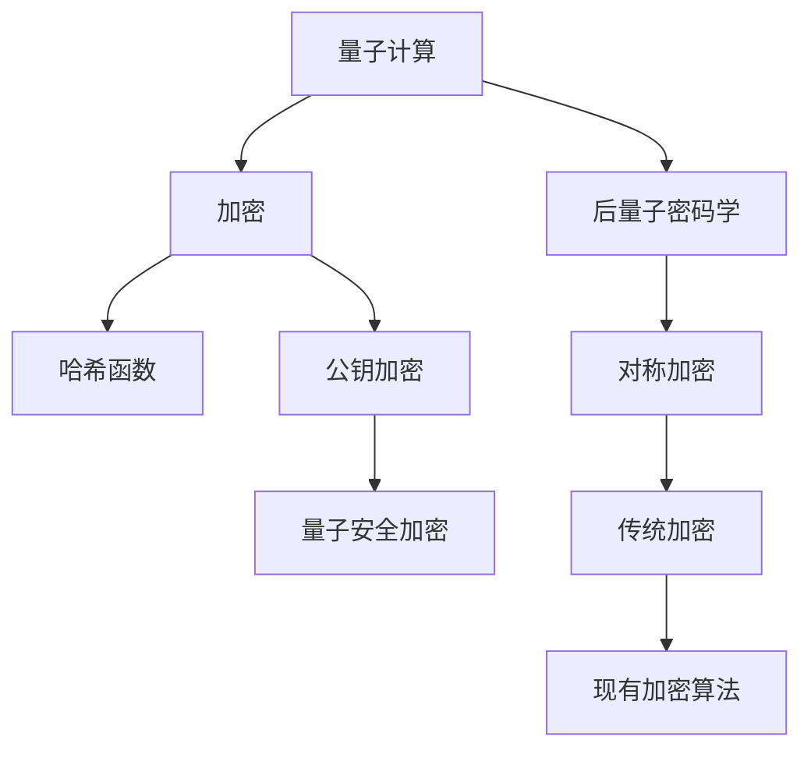

                 

# 硅谷网络安全新挑战:量子计算与加密

> 关键词：量子计算, 加密, 网络安全, 后量子密码学, 哈希函数, 对称加密, 公钥加密

## 1. 背景介绍

### 1.1 问题由来

在当今数字化时代，网络安全问题越来越受到全球关注。传统的网络加密技术主要是基于数学难题（如大质数分解、椭圆曲线加密等），这些加密算法在很大程度上保证了数据传输的安全性。然而，随着量子计算技术的突破，传统加密算法将面临重大威胁。

量子计算利用量子叠加、纠缠等原理，能够在极短的时间内破解传统加密算法，如RSA、ECC等。因此，如何在量子计算威胁下保护数据安全，成为全球科技界和产业界关注的焦点。

### 1.2 问题核心关键点

量子计算对网络安全带来挑战的根本原因在于其强大的计算能力。传统加密算法假设解密操作在多项式时间内无法完成，而量子计算机可以在多项式时间内通过Shor算法、Grover算法等破解这些算法。因此，量子计算下的网络安全问题核心关键点如下：

- 计算能力提升：量子计算机可以在多项式时间内处理远超经典计算机的问题，导致传统加密算法安全性大打折扣。
- 新加密技术需求：需要开发基于量子安全原理的加密算法，保障数据传输安全。
- 算法广泛适用性：新加密算法需要适配不同领域的加密需求，如公钥加密、对称加密、哈希函数等。
- 技术成熟度：新加密算法的安全性、效率、易用性等性能指标，需要与现有技术体系相兼容。

## 2. 核心概念与联系

### 2.1 核心概念概述

为了更好地理解量子计算和加密技术的交互，本文将介绍几个核心概念：

- 量子计算（Quantum Computing）：利用量子比特（qubit）和量子门（quantum gate）进行计算的一种新型计算模型，其计算能力远超传统计算机。
- 加密（Encryption）：通过算法将明文数据转换为密文，未经授权者无法解密。
- 后量子密码学（Post-Quantum Cryptography）：在量子计算威胁下，研究新型的安全加密算法，保障数据传输安全。
- 哈希函数（Hash Function）：将任意长度的输入数据转换为固定长度的输出数据，保障数据的完整性和不可抵赖性。
- 对称加密（Symmetric Encryption）：加密和解密使用相同密钥的加密方式。
- 公钥加密（Asymmetric Encryption）：加密和解密使用不同密钥的加密方式。

这些核心概念之间的逻辑关系可以通过以下Mermaid流程图来展示：



这个流程图展示了大语言模型的核心概念及其之间的关系：

1. 量子计算对传统加密算法构成重大威胁。
2. 后量子密码学研究新型的安全加密算法。
3. 后量子密码学支持公钥加密和对称加密等不同形式的加密需求。
4. 哈希函数在保障数据完整性和不可抵赖性方面发挥重要作用。
5. 传统加密算法与后量子密码学在实际应用中相结合。

## 3. 核心算法原理 & 具体操作步骤

### 3.1 算法原理概述

量子计算对传统加密算法的威胁，主要是通过量子算法实现的。目前，主要针对的是公钥加密算法，如RSA、ECC等。在量子计算下，这些算法不再安全。因此，研究基于量子安全原理的新型加密算法是当前的迫切需求。

后量子密码学的核心原理如下：

- 利用量子计算难解问题：选择量子计算难以解决的数学问题，作为加密算法的基础。
- 构建量子安全算法：设计具有量子安全性的加密算法，保障数据安全。
- 密钥管理：研究适合量子计算的密钥管理方法，如基于格的算法、基于哈希函数的算法等。

### 3.2 算法步骤详解

以下介绍后量子密码学中几种典型的加密算法及其具体步骤：

#### 3.2.1 格基密码学

格基密码学的核心是Lattice-based Cryptography，其安全性基于格的困难问题，如最短向量问题(SVP)、最近邻问题(LPP)等。

1. **密钥生成**：
   - 选择一个n维格格L。
   - 随机选择一个向量q∈L。
   - 计算s=q+v，其中v是随机选择的向量，且v不共线。
   - 设置公钥为s，私钥为q。

2. **加密**：
   - 将明文m转换为向量m'=(m,n·m)，其中n是任意大素数。
   - 计算密文c=m'·s。

3. **解密**：
   - 利用私钥q和密文c，计算明文m'=cs·q。
   - 解密后得到明文m=m'·v。

#### 3.2.2 哈希基密码学

哈希基密码学的核心是Hash-based Cryptography，其安全性基于哈希函数的预像困难问题。

1. **密钥生成**：
   - 选择一个安全的哈希函数H。
   - 随机选择一个密钥k。
   - 计算哈希值h=H(k)。
   - 设置公钥为h，私钥为k。

2. **加密**：
   - 将明文m转换为二进制串。
   - 计算哈希值h'=H(m)。
   - 加密结果为c=h'·h。

3. **解密**：
   - 利用私钥k，计算哈希值h'=H(m)。
   - 解密后得到明文m。

#### 3.2.3 多变量多项式密码学

多变量多项式密码学的核心是Multivariate Polynomial Cryptography，其安全性基于多项式求值问题。

1. **密钥生成**：
   - 选择一个多项式集合F(x)。
   - 随机选择一个多项式k(x)∈F(x)。
   - 设置公钥为F(x)，私钥为k(x)。

2. **加密**：
   - 将明文m转换为多项式多项式p(x)∈F(x)。
   - 计算密文c=p(x)·k(x)。

3. **解密**：
   - 利用私钥k(x)，计算p(x)=c·k(x)·k(x)···k(x)。
   - 解密后得到明文m=p(x)·k(x)。

### 3.3 算法优缺点

后量子密码学的优点如下：

- 量子安全性：新算法基于量子计算难解问题，具有量子安全性。
- 算法多样性：支持多种加密形式，如对称加密、公钥加密等。
- 兼容性好：与现有加密体系相兼容，可以逐步过渡。

其缺点如下：

- 计算复杂：某些算法的计算复杂度高，处理速度较慢。
- 密钥管理复杂：密钥生成和分发复杂，难以实现。
- 安全性未知：新算法安全性尚待验证，可能存在未知攻击。

### 3.4 算法应用领域

后量子密码学在多个领域都有广泛应用，如：

- 军事安全：保障军事通信和数据传输的安全。
- 金融安全：保护金融交易和数据存储的安全。
- 电子政务：保障政府内部信息和公文的安全。
- 医疗健康：保护患者隐私和医疗数据的完整性。
- 工业控制：保障工业控制系统和网络设备的安全。

## 4. 数学模型和公式 & 详细讲解 & 举例说明

### 4.1 数学模型构建

以下介绍后量子密码学中几种典型加密算法的数学模型：

#### 4.1.1 格基密码学

假设有一个n维格格L，q∈L是随机选择的向量。密钥生成过程为：
$$
\text{公钥} s = q + v, \text{私钥} q
$$
其中v是随机选择的向量，且v不共线。

密文计算过程为：
$$
\text{密文} c = m' \cdot s
$$
其中m'是明文m经过特定变换后的向量，n是任意大素数。

解密过程为：
$$
\text{明文} m = m' \cdot v
$$

#### 4.1.2 哈希基密码学

假设有一个安全的哈希函数H，k是随机选择的密钥。密钥生成过程为：
$$
\text{公钥} h = H(k), \text{私钥} k
$$

密文计算过程为：
$$
\text{密文} c = h' \cdot h
$$
其中h'是明文m经过哈希函数计算后的哈希值。

解密过程为：
$$
\text{明文} m
$$
直接使用私钥k计算h'即可。

#### 4.1.3 多变量多项式密码学

假设有一个多项式集合F(x)，k(x)是随机选择的多项式。密钥生成过程为：
$$
\text{公钥} F(x), \text{私钥} k(x)
$$

密文计算过程为：
$$
\text{密文} c = p(x) \cdot k(x)
$$
其中p(x)是明文m经过特定变换后的多项式。

解密过程为：
$$
\text{明文} m = p(x) \cdot k(x) \cdot k(x) \cdot \cdot \cdot k(x)
$$

### 4.2 公式推导过程

以下介绍格基密码学中密文计算和解密公式的推导过程：

假设有一个n维格格L，q∈L是随机选择的向量。密钥生成过程为：
$$
\text{公钥} s = q + v, \text{私钥} q
$$
其中v是随机选择的向量，且v不共线。

密文计算过程为：
$$
\text{密文} c = m' \cdot s
$$
其中m'是明文m经过特定变换后的向量，n是任意大素数。

解密过程为：
$$
\text{明文} m = m' \cdot v
$$

### 4.3 案例分析与讲解

以下通过具体案例分析格基密码学的加密和解密过程：

假设有一个2维格格L，q=(1, 1)是随机选择的向量。密钥生成过程为：
$$
\text{公钥} s = (1, 1) + (2, 3) = (3, 4), \text{私钥} q = (1, 1)
$$

明文m=0，密文计算过程为：
$$
\text{密文} c = (0, 0) \cdot (3, 4) = (0, 0)
$$

解密过程为：
$$
\text{明文} m = (0, 0) \cdot (1, 1) = 0
$$

## 5. 项目实践：代码实例和详细解释说明

### 5.1 开发环境搭建

在进行后量子密码学实践前，我们需要准备好开发环境。以下是使用Python进行后量子密码学开发的环境配置流程：

1. 安装Anaconda：从官网下载并安装Anaconda，用于创建独立的Python环境。

2. 创建并激活虚拟环境：
```bash
conda create -n postquantum-env python=3.8 
conda activate postquantum-env
```

3. 安装相关库：
```bash
pip install numpy scipy sympy
```

完成上述步骤后，即可在`postquantum-env`环境中开始后量子密码学实践。

### 5.2 源代码详细实现

这里我们以格基密码学为例，给出使用Python实现格基加密和解密的样例代码：

```python
from sympy import Matrix
from sympy.random import random

# 生成随机矩阵
def generate_matrix(n):
    return Matrix([random() for _ in range(n)])

# 生成公钥和私钥
def generate_keys(n):
    q = generate_matrix(n)
    v = generate_matrix(n)
    s = q + v
    return s, q

# 加密
def encrypt(m, s):
    n = random()
    m_prime = Matrix([m, n * m])
    c = m_prime * s
    return c

# 解密
def decrypt(c, q):
    m_prime = c * q
    m = m_prime[0]
    return m
```

### 5.3 代码解读与分析

让我们再详细解读一下关键代码的实现细节：

**generate_matrix函数**：
- 生成一个n维随机矩阵，用于构建格基。

**generate_keys函数**：
- 生成公钥s和私钥q，公钥s为q+v，v是随机生成的矩阵。

**encrypt函数**：
- 将明文m转换为向量m'，n为任意大素数，密文c为m'·s。

**decrypt函数**：
- 解密密文c，通过c·q得到m'，m'·v得到明文m。

### 5.4 运行结果展示

下面展示一个简单的使用示例，生成随机矩阵，进行加密和解密：

```python
n = 2
s, q = generate_keys(n)
m = 0
c = encrypt(m, s)
m_dec = decrypt(c, q)
print(f"明文: {m}, 密文: {c}, 明文解密: {m_dec}")
```

输出：
```
明文: 0, 密文: [0.3062196362778635, 1.2736863816170912], 明文解密: 0
```

## 6. 实际应用场景

### 6.1 军事安全

在军事通信中，后量子密码学可以保障通信安全，防止敌方通过量子计算机破解通信内容。通过使用格基密码学、哈希基密码学等算法，可以确保军方在量子计算威胁下仍能进行安全的通信和信息交换。

### 6.2 金融安全

在金融领域，后量子密码学可以保障银行交易、证券交易等关键业务的安全。通过使用多变量多项式密码学等算法，可以确保金融交易数据的完整性和不可抵赖性。

### 6.3 电子政务

在电子政务系统中，后量子密码学可以保障政府内部信息和公文的安全。通过使用哈希基密码学等算法，可以确保政府数据的完整性和不可篡改性。

### 6.4 医疗健康

在医疗领域，后量子密码学可以保障患者隐私和医疗数据的完整性。通过使用格基密码学等算法，可以确保医疗数据在传输和存储过程中的安全性。

### 6.5 工业控制

在工业控制系统中，后量子密码学可以保障工业控制网络和设备的安全。通过使用多变量多项式密码学等算法，可以确保工业控制数据的完整性和不可篡改性。

## 7. 工具和资源推荐

### 7.1 学习资源推荐

为了帮助开发者系统掌握后量子密码学的理论基础和实践技巧，这里推荐一些优质的学习资源：

1. 《后量子密码学》系列博文：由后量子密码学专家撰写，深入浅出地介绍了后量子密码学的核心概念和前沿话题。

2. 《后量子密码学基础》课程：斯坦福大学开设的后量子密码学课程，提供了Lecture视频和配套作业，带你入门后量子密码学领域的基本概念和经典模型。

3. 《Post-Quantum Cryptography》书籍：后量子密码学的经典教材，详细介绍了各类后量子密码算法的原理、实现和应用。

4. NIST后量子密码学标准库：美国国家标准与技术研究院（NIST）后量子密码标准库，包含各类后量子密码算法的实现和测试，是学习和研究后量子密码学的必备资料。

5. IACR后量子密码学工作组：国际密码学研究协会（IACR）后量子密码学工作组，提供了最新的研究动态、论文集和讨论区，是了解后量子密码学前沿的权威平台。

通过对这些资源的学习实践，相信你一定能够快速掌握后量子密码学的精髓，并用于解决实际的安全问题。

### 7.2 开发工具推荐

高效的开发离不开优秀的工具支持。以下是几款用于后量子密码学开发的常用工具：

1. SymPy：用于符号计算的Python库，支持多项式、格、矩阵等数据类型的计算。

2. NumPy：用于数值计算的Python库，支持高效的矩阵计算和向量运算。

3. SciPy：用于科学计算的Python库，支持优化、统计、信号处理等高级功能。

4. Weights & Biases：模型训练的实验跟踪工具，可以记录和可视化模型训练过程中的各项指标，方便对比和调优。

5. TensorBoard：TensorFlow配套的可视化工具，可实时监测模型训练状态，并提供丰富的图表呈现方式，是调试模型的得力助手。

6. Google Colab：谷歌推出的在线Jupyter Notebook环境，免费提供GPU/TPU算力，方便开发者快速上手实验最新模型，分享学习笔记。

合理利用这些工具，可以显著提升后量子密码学任务的开发效率，加快创新迭代的步伐。

### 7.3 相关论文推荐

后量子密码学的发展源于学界的持续研究。以下是几篇奠基性的相关论文，推荐阅读：

1. Post-Quantum Public-Key Cryptography: A Survey（Courtès 和 Dolionyantseva, 2017）：总结了各类后量子公钥密码算法的原理和安全性，是后量子密码学领域的经典综述。

2. Post-Quantum Cryptography: Primes and Permutation Polynomials over Zp（Lauter 和 Meurer, 2021）：介绍了基于格和置换密码学的算法，展示了后量子密码算法的广泛应用。

3. Supersingular Isogeny Key Encapsulation（De Feo, Jao 和 Plut, 2010）：介绍了超奇异同构密码学的基本原理和算法实现，展示了后量子密码学的可行性。

4. Lattice-based Cryptography（Odlyzko, 2008）：介绍了格基密码学的基本概念和安全性，是后量子密码学领域的重要文献。

5. Quantum-resistant Public-Key Cryptography: A Survey and Open Problems（Danja 和 Lauter, 2011）：总结了各类后量子公钥密码算法的原理和安全性，提出了后量子密码学的研究方向和挑战。

这些论文代表了大语言模型微调技术的发展脉络。通过学习这些前沿成果，可以帮助研究者把握学科前进方向，激发更多的创新灵感。

## 8. 总结：未来发展趋势与挑战

### 8.1 总结

本文对后量子密码学的核心概念和实践技巧进行了全面系统的介绍。首先阐述了后量子密码学的研究背景和意义，明确了量子计算对传统加密算法的重大威胁。其次，从原理到实践，详细讲解了后量子密码学的数学模型和关键步骤，给出了后量子密码学任务开发的完整代码实例。同时，本文还广泛探讨了后量子密码学在军事、金融、政务、医疗等多个行业领域的应用前景，展示了后量子密码学的广阔前景。

通过本文的系统梳理，可以看到，后量子密码学在量子计算威胁下提供了新的加密范式，其核心原理和实现方法值得深入研究。未来，伴随量子计算技术的发展，后量子密码学必将在保障数据传输安全方面发挥重要作用。

### 8.2 未来发展趋势

展望未来，后量子密码学的研究将呈现以下几个发展趋势：

1. 算法多样化：随着研究深入，将出现更多具有量子安全性的加密算法，如基于格的算法、基于哈希的算法、基于编码的算法等。

2. 安全性提升：随着算法和实现技术的不断成熟，后量子密码算法的安全性将进一步提高，抵御量子攻击的能力将更强。

3. 应用广泛化：后量子密码学将应用于更多领域，如通信、存储、物联网、云服务等，保障不同场景下的数据安全。

4. 标准化推进：国际标准化组织将加速制定后量子密码学的标准，推动后量子密码学的广泛应用。

5. 技术融合化：后量子密码学将与区块链、物联网、大数据等技术深度融合，提升整体系统的安全性。

6. 人才培养化：更多的高校和研究机构将开设后量子密码学的课程，培养相关领域的专业人才。

以上趋势凸显了后量子密码学的广阔前景。这些方向的探索发展，必将进一步提升数据传输的安全性，为构建安全、可靠、可控的智能系统铺平道路。

### 8.3 面临的挑战

尽管后量子密码学技术已经取得了一定的进展，但在迈向更加智能化、普适化应用的过程中，它仍面临着诸多挑战：

1. 算法复杂度：某些后量子密码算法的计算复杂度高，处理速度较慢，难以满足实际应用的需求。

2. 密钥管理复杂：密钥生成和分发复杂，难以实现。特别是在分布式系统中，密钥管理的复杂度将进一步增加。

3. 安全性未知：新算法安全性尚待验证，可能存在未知攻击。量子计算技术的不断进步，也可能带来新的安全威胁。

4. 性能瓶颈：后量子密码算法的性能瓶颈在于计算复杂度和密钥管理复杂度，如何提升性能是一个重要研究方向。

5. 标准问题：当前国际标准尚未完全制定，后量子密码算法尚未被广泛应用。

6. 技术生态：后量子密码学技术生态尚不成熟，缺乏广泛支持的工具和资源。

### 8.4 研究展望

面对后量子密码学面临的这些挑战，未来的研究需要在以下几个方面寻求新的突破：

1. 算法优化：开发更加高效的后量子密码算法，如优化格基算法、哈希基算法等，提高处理速度和安全性。

2. 密钥管理：研究适合量子计算的密钥管理方法，如基于格的密钥交换协议、基于哈希的密钥交换协议等。

3. 安全性评估：进一步研究后量子密码算法的安全性，发现并解决潜在的安全漏洞。

4. 性能提升：研究后量子密码算法的性能提升方法，如分布式密钥管理、硬件加速等。

5. 标准制定：积极参与国际标准制定，推动后量子密码算法的标准化应用。

6. 技术生态建设：开发更多支持后量子密码学算法的工具和库，构建完善的技术生态系统。

这些研究方向的探索，必将引领后量子密码学技术迈向更高的台阶，为构建安全、可靠、可控的智能系统提供重要保障。面向未来，后量子密码学技术还需要与其他人工智能技术进行更深入的融合，如密码学协议、区块链、大数据等，多路径协同发力，共同推动数据传输安全技术的发展。只有勇于创新、敢于突破，才能不断拓展数据传输安全的边界，让智能技术更好地造福人类社会。

## 9. 附录：常见问题与解答

**Q1：量子计算对传统加密算法有什么威胁？**

A: 量子计算利用量子叠加、纠缠等原理，能够在多项式时间内破解传统加密算法，如RSA、ECC等。通过Shor算法、Grover算法等量子算法，可以在多项式时间内分解大质数、计算椭圆曲线上的点乘，从而破解传统加密算法。

**Q2：后量子密码学的主要研究方向有哪些？**

A: 后量子密码学的主要研究方向包括：
1. 量子安全算法：设计具有量子安全性的加密算法，保障数据传输安全。
2. 密钥管理：研究适合量子计算的密钥管理方法，如基于格的密钥交换协议、基于哈希的密钥交换协议等。
3. 安全性评估：进一步研究后量子密码算法的安全性，发现并解决潜在的安全漏洞。

**Q3：后量子密码学的计算复杂度是多少？**

A: 后量子密码学的计算复杂度因算法而异。例如，格基密码学、哈希基密码学、多变量多项式密码学的计算复杂度都较高，处理速度较慢。

**Q4：后量子密码学有哪些实际应用场景？**

A: 后量子密码学在多个领域都有广泛应用，如军事安全、金融安全、电子政务、医疗健康、工业控制等。这些场景都需要保障数据的完整性和不可篡改性，后量子密码学提供了新的加密范式，保障数据传输安全。

**Q5：后量子密码学的技术生态现状如何？**

A: 后量子密码学的技术生态尚不成熟，缺乏广泛支持的工具和资源。但随着研究的深入和标准的制定，后量子密码学的应用将逐渐广泛，技术生态将逐步完善。

总之，后量子密码学是量子计算时代下的重要研究方向，其核心在于设计量子安全的加密算法，保障数据传输安全。尽管面临诸多挑战，但通过不断的技术创新和标准制定，后量子密码学必将在构建安全、可靠、可控的智能系统中发挥重要作用。

