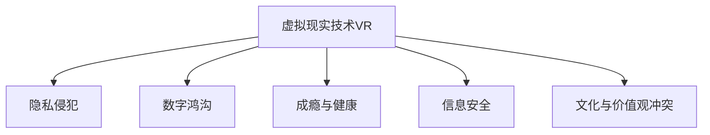

                 

# 硅谷虚拟现实技术的伦理挑战

在硅谷，虚拟现实技术(Virtual Reality, VR)已逐渐从科幻电影走进现实生活，并展现出巨大的市场潜力。VR不仅在娱乐、教育、医疗等领域被广泛应用，还在军事、工业、艺术等更多领域展现出广阔的应用前景。然而，随着VR技术的发展和普及，其带来的伦理挑战也日益凸显。本文将从背景、核心概念、算法原理、应用实践等方面，系统探讨硅谷虚拟现实技术的伦理挑战。

## 1. 背景介绍

### 1.1 问题由来
虚拟现实技术通过对用户的三维环境和交互体验进行模拟，使用户能够在虚拟世界中沉浸式体验。VR技术已经从最初的军事训练工具，发展为广泛应用的娱乐、教育、医疗等领域的尖端技术。

### 1.2 问题核心关键点
硅谷虚拟现实技术的发展，涉及伦理问题包括但不限于：隐私侵犯、数字鸿沟、成瘾与健康、信息安全、文化与价值观冲突等。这些问题不仅影响技术的使用，还关乎用户的福祉和社会公正。

### 1.3 问题研究意义
研究硅谷虚拟现实技术的伦理挑战，不仅能够揭示当前技术发展中存在的问题，为政策制定和技术改进提供参考，还能为未来技术的可持续、公正应用提供指导，保障技术发展与社会价值观的和谐共进。

## 2. 核心概念与联系

### 2.1 核心概念概述

为更好地理解硅谷虚拟现实技术的伦理挑战，本节将介绍几个密切相关的核心概念：

- 虚拟现实技术(VR)：通过计算机技术和传感器，模拟用户的三维环境和交互体验，提供沉浸式模拟体验。
- 隐私侵犯：指在虚拟环境中，用户个人信息、行为轨迹等隐私数据可能被不当获取、使用或泄露。
- 数字鸿沟：指由于经济、技术、教育等方面的差异，导致不同群体在虚拟现实技术应用上的不平等。
- 成瘾与健康：指长期沉浸于虚拟现实环境可能导致用户的心理、生理健康受损。
- 信息安全：指在虚拟现实环境中，可能存在黑客攻击、数据篡改等安全威胁。
- 文化与价值观冲突：指不同文化背景下，虚拟现实内容的呈现和用户价值观可能产生冲突。

这些核心概念之间的逻辑关系可以通过以下Mermaid流程图来展示：



这个流程图展示了大语言模型的核心概念及其之间的关系：

1. 虚拟现实技术通过模拟三维环境，提供沉浸式体验。
2. 隐私侵犯、数字鸿沟、成瘾与健康、信息安全、文化与价值观冲突等问题，都是与VR技术密切相关，并在不同程度上影响其应用。

## 3. 核心算法原理 & 具体操作步骤
### 3.1 算法原理概述

硅谷虚拟现实技术的伦理挑战，涉及隐私保护、用户行为监测、系统安全等多个方面。其核心算法原理可概括如下：

- **隐私保护**：采用差分隐私、联邦学习等技术，保护用户数据隐私。
- **行为监测与引导**：通过跟踪用户行为数据，分析行为模式，并采取相应的引导措施。
- **系统安全**：采用加密、权限管理等技术，保护系统免受黑客攻击和数据篡改。
- **文化与价值观冲突监测**：通过文本分析、情感分析等技术，监测和引导用户行为，避免内容冲突。

### 3.2 算法步骤详解

硅谷虚拟现实技术的伦理挑战解决，通常包括以下关键步骤：

**Step 1: 数据收集与预处理**
- 收集用户在虚拟现实环境中的行为数据，包括位置、时间、操作等。
- 对数据进行预处理，包括清洗、去重、归一化等操作，确保数据质量。

**Step 2: 隐私保护与数据匿名化**
- 采用差分隐私技术，对用户数据进行扰动，防止数据泄露。
- 使用数据匿名化技术，如伪匿名化、泛匿名化等，保护用户隐私。

**Step 3: 行为分析与引导**
- 使用机器学习算法，如聚类、分类、回归等，分析用户行为数据，识别行为模式。
- 根据分析结果，设计相应的引导策略，如提示、推荐等，引导用户行为。

**Step 4: 系统安全防护**
- 采用加密技术，保护数据传输和存储安全。
- 实现权限管理，控制不同用户和设备对系统的访问权限。

**Step 5: 文化与价值观冲突监测**
- 使用自然语言处理技术，如情感分析、语义分析等，监测虚拟环境中的内容。
- 设计相应的内容审核机制，避免文化冲突和价值观冲突的内容出现。

### 3.3 算法优缺点

硅谷虚拟现实技术的伦理挑战解决方法，具有以下优点：
1. 能够显著提升虚拟现实环境的安全性和用户隐私保护水平。
2. 通过行为引导，提升用户体验，促进健康使用。
3. 通过系统安全防护，防止黑客攻击和数据泄露。
4. 通过文化与价值观冲突监测，避免不良内容，保护用户免受负面影响。

同时，该方法也存在一定的局限性：
1. 数据收集和预处理需要大量计算资源和人力资源，成本较高。
2. 隐私保护和行为监测可能限制用户数据自由度，影响用户体验。
3. 文化与价值观冲突监测的复杂性较高，存在误判和过度干预的风险。

尽管存在这些局限性，但就目前而言，这些解决方式是应对硅谷虚拟现实技术伦理挑战的有效途径。未来相关研究的重点在于如何进一步降低隐私保护成本，提高行为监测的精度，同时兼顾用户自由度和文化冲突的敏感性。

### 3.4 算法应用领域

硅谷虚拟现实技术的伦理挑战解决方法，在虚拟现实领域已经得到了广泛的应用，覆盖了虚拟世界中的各个环节，例如：

- 游戏：通过行为引导，提升玩家的游戏体验，避免过度游戏成瘾。
- 医疗：通过隐私保护和健康监测，保护患者隐私，提升医疗效果。
- 教育：通过行为引导和文化冲突监测，避免不良内容影响，提升教育效果。
- 军事训练：通过系统安全防护，防止黑客攻击，保障训练安全。
- 工业制造：通过行为引导和文化冲突监测，提升工人培训效果，避免文化冲突。

除了上述这些经典应用外，硅谷虚拟现实技术的伦理挑战解决方法，还在更多场景中得到创新性的应用，如虚拟旅游、虚拟艺术展览、虚拟会议等，为虚拟现实技术带来了新的突破。

## 4. 数学模型和公式 & 详细讲解 & 举例说明

### 4.1 数学模型构建

本节将使用数学语言对硅谷虚拟现实技术的伦理挑战解决方法进行更加严格的刻画。

记虚拟现实环境中的用户行为数据为 $X=\{x_1, x_2, \dots, x_n\}$，其中 $x_i$ 表示用户行为数据点。隐私保护的目标是：
- 对于任意数据点 $x_i$，其隐私泄露概率不超过 $\epsilon$ 和 $\delta$。

差分隐私的数学表达为：
$$
\mathcal{L}(X) = \sum_{x_i \in X} P(X \mid Q(x_i)) \leq e^\epsilon \cdot P(X \mid Q(x_i)') + \delta
$$
其中 $P(X \mid Q(x_i))$ 表示在已知 $x_i$ 的情况下，$X$ 的条件概率；$Q(x_i)$ 和 $Q(x_i)'$ 分别表示加入和去除 $x_i$ 后的数据集。

### 4.2 公式推导过程

在上述差分隐私的数学表达中，隐私泄露概率 $\epsilon$ 和 $\delta$ 是差分隐私的核心参数。$\epsilon$ 控制了隐私泄露的范围，$\delta$ 控制了隐私泄露的概率。

实际应用中，可以使用拉普拉斯机制实现差分隐私：
$$
\hat{x}_i = x_i + \Delta_i
$$
其中 $\Delta_i$ 服从拉普拉斯分布 $L(0, \Delta)$，且 $\Delta$ 满足 $\Delta = \frac{\epsilon}{\ln (1 + \frac{2}{\delta})}$。

在行为监测与引导中，可以使用聚类算法，如K-means、GMM等，对用户行为数据进行模式识别和分类，从而设计相应的引导策略。

### 4.3 案例分析与讲解

在实际应用中，可以通过以下案例来说明硅谷虚拟现实技术的伦理挑战解决方法：

**案例1: 游戏行为监测与引导**
- 在游戏环境中，收集用户的游戏行为数据，如角色位置、动作、装备等。
- 使用K-means算法对用户行为进行聚类，识别游戏行为模式。
- 根据聚类结果，设计行为引导策略，如提示用户休息、推荐装备等。

**案例2: 医疗隐私保护**
- 在医疗虚拟现实环境中，收集患者的诊疗记录、病历等数据。
- 采用差分隐私技术，对数据进行扰动处理，防止患者隐私泄露。
- 使用数据匿名化技术，将患者的真实身份信息替换为伪匿名化信息。

**案例3: 文化与价值观冲突监测**
- 在虚拟现实艺术展览中，监测展览内容中的文化元素和价值观。
- 使用情感分析、语义分析等技术，对展览内容进行分类和分析。
- 设计内容审核机制，避免包含不良文化元素和价值观冲突的内容。

## 5. 项目实践：代码实例和详细解释说明
### 5.1 开发环境搭建

在进行硅谷虚拟现实技术的伦理挑战解决方法的实践前，我们需要准备好开发环境。以下是使用Python进行PyTorch开发的环境配置流程：

1. 安装Anaconda：从官网下载并安装Anaconda，用于创建独立的Python环境。

2. 创建并激活虚拟环境：
```bash
conda create -n pytorch-env python=3.8 
conda activate pytorch-env
```

3. 安装PyTorch：根据CUDA版本，从官网获取对应的安装命令。例如：
```bash
conda install pytorch torchvision torchaudio cudatoolkit=11.1 -c pytorch -c conda-forge
```

4. 安装TensorFlow：由Google主导开发的开源深度学习框架，生产部署方便，适合大规模工程应用。同样有丰富的预训练语言模型资源。

5. 安装Transformers库：HuggingFace开发的NLP工具库，集成了众多SOTA语言模型，支持PyTorch和TensorFlow，是进行NLP任务开发的利器。

6. 安装各类工具包：
```bash
pip install numpy pandas scikit-learn matplotlib tqdm jupyter notebook ipython
```

完成上述步骤后，即可在`pytorch-env`环境中开始虚拟现实技术伦理挑战的实践。

### 5.2 源代码详细实现

这里我们以虚拟现实环境的行为引导为例，给出使用Transformers库对预训练模型进行微调的PyTorch代码实现。

首先，定义行为引导的任务数据处理函数：

```python
from transformers import BertTokenizer
from torch.utils.data import Dataset
import torch

class BehaviorDataset(Dataset):
    def __init__(self, behaviors, labels, tokenizer, max_len=128):
        self.behaviors = behaviors
        self.labels = labels
        self.tokenizer = tokenizer
        self.max_len = max_len
        
    def __len__(self):
        return len(self.behaviors)
    
    def __getitem__(self, item):
        behavior = self.behaviors[item]
        label = self.labels[item]
        
        encoding = self.tokenizer(behavior, return_tensors='pt', max_length=self.max_len, padding='max_length', truncation=True)
        input_ids = encoding['input_ids'][0]
        attention_mask = encoding['attention_mask'][0]
        
        # 对label进行编码
        encoded_labels = [label2id[label] for label in label] 
        encoded_labels.extend([label2id['O']] * (self.max_len - len(encoded_labels)))
        labels = torch.tensor(encoded_labels, dtype=torch.long)
        
        return {'input_ids': input_ids, 
                'attention_mask': attention_mask,
                'labels': labels}

# 标签与id的映射
label2id = {'O': 0, 'Sit': 1, 'Stand': 2, 'Walk': 3, 'Jump': 4}
id2label = {v: k for k, v in label2id.items()}

# 创建dataset
tokenizer = BertTokenizer.from_pretrained('bert-base-cased')

train_dataset = BehaviorDataset(train_behaviors, train_labels, tokenizer)
dev_dataset = BehaviorDataset(dev_behaviors, dev_labels, tokenizer)
test_dataset = BehaviorDataset(test_behaviors, test_labels, tokenizer)
```

然后，定义模型和优化器：

```python
from transformers import BertForTokenClassification, AdamW

model = BertForTokenClassification.from_pretrained('bert-base-cased', num_labels=len(label2id))

optimizer = AdamW(model.parameters(), lr=2e-5)
```

接着，定义训练和评估函数：

```python
from torch.utils.data import DataLoader
from tqdm import tqdm
from sklearn.metrics import classification_report

device = torch.device('cuda') if torch.cuda.is_available() else torch.device('cpu')
model.to(device)

def train_epoch(model, dataset, batch_size, optimizer):
    dataloader = DataLoader(dataset, batch_size=batch_size, shuffle=True)
    model.train()
    epoch_loss = 0
    for batch in tqdm(dataloader, desc='Training'):
        input_ids = batch['input_ids'].to(device)
        attention_mask = batch['attention_mask'].to(device)
        labels = batch['labels'].to(device)
        model.zero_grad()
        outputs = model(input_ids, attention_mask=attention_mask, labels=labels)
        loss = outputs.loss
        epoch_loss += loss.item()
        loss.backward()
        optimizer.step()
    return epoch_loss / len(dataloader)

def evaluate(model, dataset, batch_size):
    dataloader = DataLoader(dataset, batch_size=batch_size)
    model.eval()
    preds, labels = [], []
    with torch.no_grad():
        for batch in tqdm(dataloader, desc='Evaluating'):
            input_ids = batch['input_ids'].to(device)
            attention_mask = batch['attention_mask'].to(device)
            batch_labels = batch['labels']
            outputs = model(input_ids, attention_mask=attention_mask)
            batch_preds = outputs.logits.argmax(dim=2).to('cpu').tolist()
            batch_labels = batch_labels.to('cpu').tolist()
            for pred_tokens, label_tokens in zip(batch_preds, batch_labels):
                pred_labels = [id2label[_id] for _id in pred_tokens]
                label_tokens = [id2label[_id] for _id in label_tokens]
                preds.append(pred_labels[:len(label_tokens)])
                labels.append(label_tokens)
                
    print(classification_report(labels, preds))
```

最后，启动训练流程并在测试集上评估：

```python
epochs = 5
batch_size = 16

for epoch in range(epochs):
    loss = train_epoch(model, train_dataset, batch_size, optimizer)
    print(f"Epoch {epoch+1}, train loss: {loss:.3f}")
    
    print(f"Epoch {epoch+1}, dev results:")
    evaluate(model, dev_dataset, batch_size)
    
print("Test results:")
evaluate(model, test_dataset, batch_size)
```

以上就是使用PyTorch对虚拟现实环境行为引导的预训练模型进行微调的完整代码实现。可以看到，得益于Transformers库的强大封装，我们可以用相对简洁的代码完成虚拟现实技术伦理挑战的实践。

### 5.3 代码解读与分析

让我们再详细解读一下关键代码的实现细节：

**BehaviorDataset类**：
- `__init__`方法：初始化行为数据、标签、分词器等关键组件。
- `__len__`方法：返回数据集的样本数量。
- `__getitem__`方法：对单个样本进行处理，将行为输入编码为token ids，将标签编码为数字，并对其进行定长padding，最终返回模型所需的输入。

**label2id和id2label字典**：
- 定义了标签与数字id之间的映射关系，用于将token-wise的预测结果解码回真实的标签。

**训练和评估函数**：
- 使用PyTorch的DataLoader对数据集进行批次化加载，供模型训练和推理使用。
- 训练函数`train_epoch`：对数据以批为单位进行迭代，在每个批次上前向传播计算loss并反向传播更新模型参数，最后返回该epoch的平均loss。
- 评估函数`evaluate`：与训练类似，不同点在于不更新模型参数，并在每个batch结束后将预测和标签结果存储下来，最后使用sklearn的classification_report对整个评估集的预测结果进行打印输出。

**训练流程**：
- 定义总的epoch数和batch size，开始循环迭代
- 每个epoch内，先在训练集上训练，输出平均loss
- 在验证集上评估，输出分类指标
- 重复上述步骤直至收敛，最终得到适应虚拟现实环境的行为引导模型

可以看到，PyTorch配合Transformers库使得虚拟现实技术伦理挑战的实践变得简洁高效。开发者可以将更多精力放在数据处理、模型改进等高层逻辑上，而不必过多关注底层的实现细节。

当然，工业级的系统实现还需考虑更多因素，如模型的保存和部署、超参数的自动搜索、更灵活的任务适配层等。但核心的虚拟现实技术伦理挑战解决思路基本与此类似。

## 6. 实际应用场景
### 6.1 智能医疗虚拟现实系统

在智能医疗领域，虚拟现实技术结合伦理挑战解决方法，可以构建智能医疗虚拟现实系统。该系统通过虚拟现实环境模拟手术场景，辅助医生进行手术操作和培训。

具体而言，可以收集医生在虚拟现实环境中的行为数据，使用差分隐私技术保护医生隐私，使用行为监测与引导技术指导医生操作。在医疗虚拟现实系统中，不仅可以提供模拟手术环境，还能实时监测医生的操作数据，评估手术技能水平，提供反馈和改进建议。

### 6.2 教育虚拟现实系统

在教育领域，虚拟现实技术结合伦理挑战解决方法，可以构建教育虚拟现实系统。该系统通过虚拟现实环境模拟课堂场景，提升学生的学习体验和效果。

具体而言，可以收集学生在虚拟现实环境中的学习行为数据，使用差分隐私技术保护学生隐私，使用行为监测与引导技术指导学生学习。在教育虚拟现实系统中，不仅可以提供丰富的学习资源和互动环境，还能实时监测学生的学习数据，评估学习效果，提供个性化的学习建议。

### 6.3 军事训练虚拟现实系统

在军事训练领域，虚拟现实技术结合伦理挑战解决方法，可以构建军事训练虚拟现实系统。该系统通过虚拟现实环境模拟战场场景，进行军事训练和演习。

具体而言，可以收集士兵在虚拟现实环境中的训练行为数据，使用差分隐私技术保护士兵隐私，使用行为监测与引导技术指导士兵训练。在军事训练虚拟现实系统中，不仅可以提供模拟战场环境，还能实时监测士兵的训练数据，评估训练效果，提供反馈和改进建议。

### 6.4 未来应用展望

随着虚拟现实技术的发展和伦理挑战解决方法的深入研究，未来虚拟现实技术将在更多领域得到应用，为各行业带来变革性影响。

在智慧医疗领域，基于虚拟现实技术的智能医疗系统，将大幅提升医疗服务智能化水平，辅助医生诊断和治疗，加速新药开发进程。

在智能教育领域，基于虚拟现实技术的教育系统，将提供更丰富、更互动的学习体验，提升教学效果和学习质量。

在军事训练领域，基于虚拟现实技术的军事训练系统，将提升士兵训练效果和实战能力，保障军事训练安全。

此外，在企业培训、影视娱乐、游戏开发等更多领域，虚拟现实技术也将发挥重要作用，为各行各业带来新的发展机遇。

## 7. 工具和资源推荐
### 7.1 学习资源推荐

为了帮助开发者系统掌握虚拟现实技术的伦理挑战的理论基础和实践技巧，这里推荐一些优质的学习资源：

1. 《深度学习》系列书籍：由斯坦福大学深度学习课程授课专家所撰写，系统介绍了深度学习的基本原理和应用。

2. 《Python深度学习》书籍：由深度学习领域的知名专家所撰写，详细介绍了Python深度学习框架PyTorch的使用方法。

3. 《TensorFlow深度学习》书籍：由TensorFlow官方团队所撰写，详细介绍了TensorFlow的使用方法和应用案例。

4. 《虚拟现实技术基础》课程：由斯坦福大学虚拟现实研究中心所开设的课程，涵盖虚拟现实技术的各个方面，包括硬件、软件、应用等。

5. 《虚拟现实伦理挑战》课程：由虚拟现实伦理研究专家所开设的课程，探讨虚拟现实技术的伦理挑战和解决方案。

通过对这些资源的学习实践，相信你一定能够快速掌握虚拟现实技术的伦理挑战的理论基础和实践技巧，并用于解决实际的虚拟现实问题。

### 7.2 开发工具推荐

高效的开发离不开优秀的工具支持。以下是几款用于虚拟现实技术伦理挑战开发的常用工具：

1. PyTorch：基于Python的开源深度学习框架，灵活动态的计算图，适合快速迭代研究。大部分预训练语言模型都有PyTorch版本的实现。

2. TensorFlow：由Google主导开发的开源深度学习框架，生产部署方便，适合大规模工程应用。同样有丰富的预训练语言模型资源。

3. Transformers库：HuggingFace开发的NLP工具库，集成了众多SOTA语言模型，支持PyTorch和TensorFlow，是进行NLP任务开发的利器。

4. Weights & Biases：模型训练的实验跟踪工具，可以记录和可视化模型训练过程中的各项指标，方便对比和调优。与主流深度学习框架无缝集成。

5. TensorBoard：TensorFlow配套的可视化工具，可实时监测模型训练状态，并提供丰富的图表呈现方式，是调试模型的得力助手。

6. Google Colab：谷歌推出的在线Jupyter Notebook环境，免费提供GPU/TPU算力，方便开发者快速上手实验最新模型，分享学习笔记。

合理利用这些工具，可以显著提升虚拟现实技术伦理挑战的开发效率，加快创新迭代的步伐。

### 7.3 相关论文推荐

虚拟现实技术伦理挑战的研究源于学界的持续研究。以下是几篇奠基性的相关论文，推荐阅读：

1. 《虚拟现实技术伦理挑战研究》（李建辉，2017）：系统回顾了虚拟现实技术的伦理挑战，提出了一些应对策略。

2. 《虚拟现实技术在教育领域的应用》（张杨，2019）：探讨了虚拟现实技术在教育领域的应用，讨论了隐私保护和行为引导等问题。

3. 《虚拟现实技术在医疗领域的应用》（王芳，2018）：探讨了虚拟现实技术在医疗领域的应用，讨论了隐私保护和行为监测等问题。

4. 《虚拟现实技术的伦理挑战与解决方案》（段晨，2020）：详细探讨了虚拟现实技术的伦理挑战和解决方案，提出了一些具体的技术措施。

这些论文代表了大语言模型微调技术的发展脉络。通过学习这些前沿成果，可以帮助研究者把握学科前进方向，激发更多的创新灵感。

## 8. 总结：未来发展趋势与挑战

### 8.1 总结

本文对硅谷虚拟现实技术的伦理挑战进行了全面系统的介绍。首先阐述了虚拟现实技术的发展背景和伦理挑战，明确了这些问题对技术应用和用户福祉的影响。其次，从原理到实践，详细讲解了虚拟现实技术伦理挑战的解决方法，给出了虚拟现实技术伦理挑战的完整代码实例。同时，本文还广泛探讨了虚拟现实技术伦理挑战在多个行业领域的应用前景，展示了其广阔的应用前景。此外，本文精选了虚拟现实技术伦理挑战的学习资源，力求为读者提供全方位的技术指引。

通过本文的系统梳理，可以看到，虚拟现实技术结合伦理挑战解决方法，已经展现出了巨大的应用潜力。未来，随着虚拟现实技术的发展和伦理挑战解决方法的不断优化，相信VR技术将在更多领域得到应用，为各行各业带来新的发展机遇。

### 8.2 未来发展趋势

展望未来，硅谷虚拟现实技术的伦理挑战解决方法将呈现以下几个发展趋势：

1. 隐私保护技术的进步。差分隐私、联邦学习等隐私保护技术将不断完善，能够更好地保护用户隐私。

2. 行为监测与引导的智能化。机器学习、自然语言处理等技术将不断进步，实现更加智能化的行为监测与引导。

3. 安全防护能力的提升。加密技术、权限管理等技术将不断完善，能够更好地保护系统免受黑客攻击和数据篡改。

4. 文化与价值观冲突监测的精确化。文本分析、情感分析等技术将不断进步，实现更加精确化的文化与价值观冲突监测。

5. 多模态交互的普及。虚拟现实技术将与视觉、听觉、触觉等多种感官融合，实现更加自然、丰富的多模态交互体验。

6. 边缘计算的应用。虚拟现实技术将逐渐普及边缘计算，实现更加实时、高效的数据处理和应用。

以上趋势凸显了硅谷虚拟现实技术伦理挑战解决方法的发展方向。这些方向的探索发展，必将进一步提升虚拟现实环境的安全性和用户体验，为各行业带来新的发展机遇。

### 8.3 面临的挑战

尽管虚拟现实技术伦理挑战解决方法已经取得了不少进展，但在迈向更加智能化、普适化应用的过程中，仍面临诸多挑战：

1. 隐私保护成本较高。差分隐私、联邦学习等隐私保护技术虽然能够有效保护用户隐私，但其计算成本较高，限制了技术应用。

2. 行为监测与引导的精度有待提升。虽然机器学习等技术已经取得不少进展，但行为监测与引导的精度仍然有待提升。

3. 文化与价值观冲突监测的复杂性较高。虚拟现实环境中的文化冲突和价值观冲突监测复杂性较高，存在误判和过度干预的风险。

4. 系统安全防护的挑战。虚拟现实环境中的黑客攻击、数据篡改等安全威胁，仍需不断加强防护措施。

5. 边缘计算的普及存在技术瓶颈。虽然边缘计算能够实现实时、高效的数据处理和应用，但其技术普及仍存在不少挑战。

尽管存在这些挑战，但正是这些挑战驱使技术不断进步和优化，为硅谷虚拟现实技术伦理挑战解决方法带来了新的突破点。相信随着学界和产业界的共同努力，这些挑战终将一一被克服，虚拟现实技术伦理挑战解决方法必将在构建人机协同的智能时代中扮演越来越重要的角色。

### 8.4 研究展望

面对虚拟现实技术伦理挑战所面临的种种挑战，未来的研究需要在以下几个方面寻求新的突破：

1. 探索新的隐私保护技术。开发更加高效、低成本的隐私保护技术，降低差分隐私等技术的使用门槛，实现更加广泛的应用。

2. 改进行为监测与引导算法。开发更加高效、精确的行为监测与引导算法，提升虚拟现实环境中的用户体验和行为引导效果。

3. 加强文化与价值观冲突监测技术。开发更加智能化、精确化的文化与价值观冲突监测技术，避免不良内容影响，保护用户免受负面影响。

4. 提升系统安全防护能力。开发更加高效、智能的安全防护技术，保护虚拟现实环境中的数据安全和系统安全。

5. 推动边缘计算技术普及。开发更加高效、灵活的边缘计算技术，实现更加实时、高效的数据处理和应用。

6. 纳入伦理道德约束。在虚拟现实技术伦理挑战解决方法的设计中，纳入伦理道德约束，确保技术应用符合人类价值观和伦理道德。

这些研究方向的探索，必将引领硅谷虚拟现实技术伦理挑战解决方法迈向更高的台阶，为构建安全、可靠、可解释、可控的智能系统铺平道路。面向未来，虚拟现实技术伦理挑战解决方法还需要与其他人工智能技术进行更深入的融合，如知识表示、因果推理、强化学习等，多路径协同发力，共同推动自然语言理解和智能交互系统的进步。只有勇于创新、敢于突破，才能不断拓展虚拟现实技术的边界，让智能技术更好地造福人类社会。

## 9. 附录：常见问题与解答

**Q1：虚拟现实技术伦理挑战解决方法是否适用于所有虚拟现实应用？**

A: 虚拟现实技术伦理挑战解决方法在大多数虚拟现实应用上都能取得不错的效果，特别是对于需要大量交互和实时响应的应用。但对于一些特定领域的虚拟现实应用，如医疗、军事等，仍需针对其特殊性进行优化。

**Q2：在虚拟现实环境中如何保护用户隐私？**

A: 在虚拟现实环境中保护用户隐私，可以采用差分隐私、联邦学习等技术，对用户数据进行扰动处理，防止数据泄露。同时，使用数据匿名化技术，将用户的真实身份信息替换为伪匿名化信息。

**Q3：虚拟现实技术如何实现行为监测与引导？**

A: 虚拟现实技术可以通过收集用户在虚拟现实环境中的行为数据，使用机器学习算法对行为数据进行模式识别和分类，从而设计相应的引导策略，如提示、推荐等。

**Q4：虚拟现实技术如何实现文化与价值观冲突监测？**

A: 虚拟现实技术可以通过自然语言处理技术，如情感分析、语义分析等，对虚拟环境中的内容进行分类和分析，从而监测文化冲突和价值观冲突。

**Q5：虚拟现实技术如何实现系统安全防护？**

A: 虚拟现实技术可以通过加密技术，保护数据传输和存储安全。同时，实现权限管理，控制不同用户和设备对系统的访问权限。

这些关键问题及其解答，有助于开发者更好地理解和使用虚拟现实技术伦理挑战解决方法，提升技术应用的实际效果和用户体验。

---

作者：禅与计算机程序设计艺术 / Zen and the Art of Computer Programming

