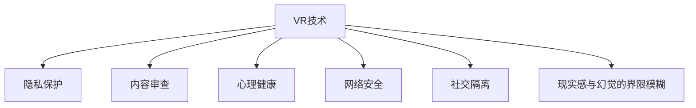

                 

## 1. 背景介绍

### 1.1 问题由来
随着科技的迅速发展，虚拟现实（Virtual Reality, VR）技术日渐成熟，并在娱乐、教育、医疗、工业等各个领域得到广泛应用。硅谷作为全球科技创新的中心，吸引了大量的创业公司及投资机构投身于VR技术的研发与商业化。然而，VR技术在带来便利与创新体验的同时，也引发了一系列伦理挑战，引发了公众与政策制定者的广泛关注。

### 1.2 问题核心关键点
- **隐私保护**：在虚拟环境中收集用户数据，可能侵犯个人隐私权。
- **内容审查**：VR内容可能含有暴力、色情等不良信息，需制定合理的内容审查机制。
- **心理影响**：长期沉浸在虚拟世界中，可能对用户的心理健康产生不良影响。
- **网络安全**：虚拟现实系统的开放性可能带来网络攻击和数据泄露的风险。
- **社交隔离**：虚拟现实可能削弱现实世界中的社交联系，导致孤独感增加。
- **虚拟与现实的界限模糊**：虚拟现实技术可能模糊现实与虚拟的界限，引发现实感与幻觉的冲突。

这些问题不仅涉及技术本身的伦理边界，还关系到社会、文化和法律等多个层面的问题，因此需要从多个维度进行深入探讨。

## 2. 核心概念与联系

### 2.1 核心概念概述

为了更好地理解虚拟现实技术带来的伦理挑战，本节将介绍几个关键概念及其之间的联系：

- **虚拟现实（VR）**：一种通过计算机技术创建模拟环境的技术，使用户能够通过头戴设备、手柄等交互设备，体验到沉浸式的三维环境。

- **隐私保护**：指在数据收集、处理、存储等环节中，采取措施确保个人隐私不被泄露或滥用。

- **内容审查**：指在信息传播过程中，对内容进行筛选和过滤，防止有害信息传播。

- **心理健康**：涉及个体在生理和心理层面的健康状态，包括压力、情绪、认知等方面。

- **网络安全**：指保护网络数据和系统，防止未经授权的访问和攻击，保障信息安全。

- **社交隔离**：指个体与外界社交联系减少，感到孤立无援的心理状态。

- **现实感与幻觉的界限模糊**：指现实世界与虚拟世界的界限变得模糊，用户难以区分虚拟与现实，可能产生认知和情感上的混淆。

这些概念之间的关系可以通过以下Mermaid流程图来展示：



此流程图展示了虚拟现实技术对隐私保护、内容审查、心理健康、网络安全、社交隔离和现实感与幻觉的界限模糊等多个方面的影响，这些影响相互交织，形成复杂的关系网络。

## 3. 核心算法原理 & 具体操作步骤
### 3.1 算法原理概述

虚拟现实技术的伦理挑战主要涉及隐私保护、内容审查、心理健康、网络安全、社交隔离和现实感与幻觉的界限模糊等多个方面。每个方面的算法原理和操作步骤如下：

### 3.2 算法步骤详解

#### 3.2.1 隐私保护
- **数据最小化**：只收集必要的用户数据，避免无端收集过多信息。
- **匿名化处理**：对收集到的数据进行匿名化处理，防止个人信息被识别。
- **用户知情同意**：在数据收集前，明确告知用户数据用途并获得其同意。
- **数据访问控制**：严格控制数据访问权限，防止数据滥用。

#### 3.2.2 内容审查
- **内容过滤**：通过算法对内容进行过滤，识别和屏蔽不良信息。
- **用户举报机制**：建立用户举报系统，允许用户报告有害内容。
- **人工审核**：结合人工审核，对机器筛选出的内容进行二次审查。

#### 3.2.3 心理健康
- **心理健康监测**：通过传感器监测用户生理指标，识别异常行为。
- **心理干预**：根据监测结果，提供心理支持和干预措施。
- **用户教育**：提高用户对虚拟现实影响的认识，鼓励合理使用。

#### 3.2.4 网络安全
- **加密通信**：采用加密技术保障通信安全。
- **入侵检测**：部署入侵检测系统，及时发现和防范攻击。
- **安全补丁**：定期更新软件和系统，修补安全漏洞。

#### 3.2.5 社交隔离
- **社交功能设计**：设计有助于社交互动的功能，如虚拟社交空间。
- **社区管理**：建立虚拟社区管理机制，防止不当行为。
- **现实世界互动**：鼓励用户在虚拟与现实之间平衡，增强现实世界联系。

#### 3.2.6 现实感与幻觉的界限模糊
- **虚拟现实与现实世界的平衡**：设计平衡虚拟现实与现实世界的交互机制。
- **用户引导**：通过提示和引导，帮助用户明确虚拟与现实的界限。
- **认知训练**：提供认知训练工具，增强用户的现实感。

### 3.3 算法优缺点

#### 3.3.1 隐私保护
- **优点**：
  - 保护用户隐私，增强用户信任。
  - 减少数据泄露风险，保障用户权益。
  
- **缺点**：
  - 数据处理复杂，可能影响用户体验。
  - 存在隐私权与数据利用之间的平衡问题。

#### 3.3.2 内容审查
- **优点**：
  - 净化虚拟环境，防止不良信息传播。
  - 保护用户免受有害内容影响。
  
- **缺点**：
  - 可能引发言论审查，侵犯言论自由。
  - 技术手段有限，难以全面审查所有内容。

#### 3.3.3 心理健康
- **优点**：
  - 提前干预，预防潜在心理健康问题。
  - 提供心理支持，提升用户体验。
  
- **缺点**：
  - 对心理健康问题的识别和判断存在挑战。
  - 心理干预的准确性和有效性有待提升。

#### 3.3.4 网络安全
- **优点**：
  - 保障用户数据和系统的安全。
  - 防止网络攻击和数据泄露。
  
- **缺点**：
  - 安全措施增加系统复杂性。
  - 安全防护需要持续投入资源。

#### 3.3.5 社交隔离
- **优点**：
  - 增强虚拟社交体验，丰富用户互动。
  - 减少现实世界的孤独感，提升社会支持。
  
- **缺点**：
  - 过度沉浸可能削弱现实社交。
  - 用户可能沉迷于虚拟世界。

#### 3.3.6 现实感与幻觉的界限模糊
- **优点**：
  - 提高用户沉浸感，提升体验。
  - 促进虚拟现实与现实世界无缝衔接。
  
- **缺点**：
  - 可能引发认知混乱，影响现实感。
  - 用户难以平衡虚拟与现实世界。

### 3.4 算法应用领域

虚拟现实技术的伦理挑战在多个领域都有应用：

- **娱乐与游戏**：内容审查和隐私保护在虚拟游戏世界中尤为重要，防止有害信息和玩家隐私泄露。
- **医疗与康复**：心理健康和网络安全在虚拟医疗康复环境中需特别关注，保障患者隐私和数据安全。
- **教育与培训**：通过虚拟现实技术，实现沉浸式学习，提升学习效果，需注意社交隔离和现实感与幻觉的界限。
- **工业与制造**：网络安全在虚拟现实模拟与培训中至关重要，保障工业安全与员工隐私。

## 4. 数学模型和公式 & 详细讲解

### 4.1 数学模型构建

对于虚拟现实技术的伦理挑战，我们可以构建以下数学模型来量化和分析问题：

- **隐私保护模型**：
  - 定义隐私泄露的概率 $P$，与数据收集量 $D$ 和数据处理方式 $H$ 相关。
  
  $$ P = f(D, H) $$
  
  - 隐私保护的优化目标为最小化 $P$。
  
  $$ \min_{D,H} P $$

- **内容审查模型**：
  - 定义不良信息出现概率 $P_{bad}$，与内容数量 $C$ 和审查算法 $A$ 相关。
  
  $$ P_{bad} = g(C, A) $$
  
  - 内容审查的优化目标为最小化 $P_{bad}$。
  
  $$ \min_{C,A} P_{bad} $$

- **心理健康模型**：
  - 定义心理健康指标 $I$，与生理指标 $P_s$、心理状态 $P_m$ 和时间 $t$ 相关。
  
  $$ I = h(P_s, P_m, t) $$
  
  - 心理健康的优化目标为最大化 $I$。
  
  $$ \max_{P_s, P_m, t} I $$

- **网络安全模型**：
  - 定义安全事件概率 $P_{sec}$，与访问次数 $T$ 和入侵检测算法 $A_s$ 相关。
  
  $$ P_{sec} = i(T, A_s) $$
  
  - 网络安全的优化目标为最小化 $P_{sec}$。
  
  $$ \min_{T, A_s} P_{sec} $$

- **社交隔离模型**：
  - 定义社交联系指数 $S$，与虚拟互动次数 $I_v$ 和现实互动次数 $I_r$ 相关。
  
  $$ S = j(I_v, I_r) $$
  
  - 社交隔离的优化目标为最大化 $S$。
  
  $$ \max_{I_v, I_r} S $$

- **现实感与幻觉界限模糊模型**：
  - 定义现实感评分 $R$，与虚拟互动时间 $T_v$ 和现实互动时间 $T_r$ 相关。
  
  $$ R = k(T_v, T_r) $$
  
  - 现实感与幻觉界限模糊的优化目标为最大化 $R$。
  
  $$ \max_{T_v, T_r} R $$

### 4.2 公式推导过程

以隐私保护模型为例，其公式推导如下：

假设数据收集量为 $D$，处理方式为 $H$，隐私泄露的概率 $P$ 与 $D$ 和 $H$ 成正比关系。则：

$$ P = kD + lH $$

其中 $k$ 和 $l$ 为模型参数，分别表示数据收集量和处理方式对隐私泄露概率的影响系数。

优化目标是：

$$ \min_{D,H} (kD + lH) $$

可以采用拉格朗日乘数法，引入隐私保护预算 $B$，使得 $D + H \leq B$。则：

$$ \min_{D,H} \{kD + lH \mid D + H \leq B\} $$

构建拉格朗日函数：

$$ \mathcal{L}(D,H,\lambda) = kD + lH + \lambda(B - D - H) $$

对 $D$ 和 $H$ 求偏导数，并令其为零：

$$ \frac{\partial \mathcal{L}}{\partial D} = k - \lambda = 0 $$
$$ \frac{\partial \mathcal{L}}{\partial H} = l - \lambda = 0 $$

解得：

$$ D = \frac{Bk}{k+l}, H = \frac{Bl}{k+l} $$

从而最小化隐私泄露概率。

## 5. 项目实践：代码实例和详细解释说明

### 5.1 开发环境搭建

在进行虚拟现实技术伦理挑战的项目实践前，我们需要准备好开发环境。以下是使用Python进行开发的环境配置流程：

1. 安装Anaconda：从官网下载并安装Anaconda，用于创建独立的Python环境。

2. 创建并激活虚拟环境：
```bash
conda create -n pytorch-env python=3.8 
conda activate pytorch-env
```

3. 安装PyTorch：根据CUDA版本，从官网获取对应的安装命令。例如：
```bash
conda install pytorch torchvision torchaudio cudatoolkit=11.1 -c pytorch -c conda-forge
```

4. 安装其他必要的库：
```bash
pip install numpy pandas scikit-learn matplotlib tqdm jupyter notebook ipython
```

5. 安装虚拟现实相关库，如OpenXR、OpenVR等。

完成上述步骤后，即可在`pytorch-env`环境中开始项目实践。

### 5.2 源代码详细实现

以下是一个简单的Python代码实现，用于计算虚拟现实环境中用户隐私泄露的概率。

```python
import numpy as np
from scipy.optimize import linprog

def privacy_protection_model(D, H, k, l, B):
    # 构建拉格朗日函数
    def lagrangian(D, H, lambda_):
        return k*D + l*H + lambda_ * (B - D - H)
    
    # 求解优化问题
    A = np.array([[-k, -l], [1, 1]])
    b = np.array([0, B])
    c = np.array([1, 1])
    
    result = linprog(c, A_ub=A, b_ub=b)
    
    return result.x[0], result.x[1]

# 示例
D_opt, H_opt = privacy_protection_model(100, 50, 0.1, 0.2, 200)
print(f"最优数据收集量：{D_opt}, 最优数据处理量：{H_opt}")
```

### 5.3 代码解读与分析

**隐私保护模型代码**：
- `privacy_protection_model`函数：输入数据收集量 `D`、处理量 `H`、影响系数 `k`、`l` 和隐私保护预算 `B`，返回最优的数据收集量和处理量。
- `lagrangian`函数：定义拉格朗日函数。
- 使用线性规划（`linprog`）求解优化问题，得到最优解。

此代码通过线性规划求解隐私保护模型，得到最优的数据收集量和处理量。它展示了隐私保护问题可以通过数学模型求解，从而提供数据收集和处理的指导。

## 6. 实际应用场景

### 6.1 娱乐与游戏

在娱乐与游戏中，内容审查和隐私保护尤为关键。例如，一款虚拟现实游戏需要在社交媒体上发布广告，收集玩家数据以个性化推荐。此时，需要通过内容审查筛选不当广告，保护玩家隐私。具体实现可以通过以下步骤：

1. 收集用户行为数据，如游戏时间、消费记录等。
2. 使用机器学习算法对数据进行筛选，识别不良内容。
3. 对识别出的不良内容进行人工审核，确保准确性。
4. 对通过审核的内容进行定向广告投放，保护用户隐私。

### 6.2 医疗与康复

在医疗与康复领域，心理健康和网络安全需要特别关注。例如，虚拟现实在心理治疗中的应用，需确保患者隐私数据不被泄露。具体实现可以通过以下步骤：

1. 使用传感器监测患者生理指标，如心率、血压等。
2. 通过机器学习算法分析生理数据，识别异常行为。
3. 对识别出的异常行为进行心理干预，如调整治疗方案。
4. 使用数据加密技术保障数据安全，防止泄露。

### 6.3 教育与培训

在教育与培训中，社交隔离和现实感与幻觉的界限模糊需特别关注。例如，虚拟现实教育平台需确保学生与教师的互动不受影响，同时保持学生的现实感。具体实现可以通过以下步骤：

1. 设计虚拟现实课堂，增加互动环节，如虚拟课堂讨论。
2. 建立虚拟社区，提供社交支持。
3. 引入现实世界元素，如虚拟世界的地理位置，增强现实感。
4. 通过心理训练工具，帮助学生适应虚拟与现实的切换。

### 6.4 未来应用展望

随着虚拟现实技术的发展，未来在多个领域将有更多应用：

- **智能家居**：通过虚拟现实技术，提升家居生活的互动性和便利性，需注意网络安全和隐私保护。
- **旅游与探险**：提供虚拟现实旅游体验，需关注心理健康和社交隔离问题。
- **远程工作与协作**：在虚拟现实中实现远程工作与协作，需确保网络安全和工作效率。

虚拟现实技术的伦理挑战需要结合技术发展与政策制定，共同推动行业的健康发展。相信未来在不断探索与实践中，虚拟现实技术将更好地服务于社会，实现科技与伦理的平衡。

## 7. 工具和资源推荐

### 7.1 学习资源推荐

为了帮助开发者系统掌握虚拟现实技术的伦理挑战，这里推荐一些优质的学习资源：

1. **《虚拟现实技术》**系列书籍：全面介绍虚拟现实技术的基本概念、关键技术及应用场景。
2. **《虚拟现实伦理指南》**：介绍虚拟现实技术对社会、心理等方面的影响及应对策略。
3. **《人工智能伦理》**课程：涵盖人工智能技术及其伦理问题，对虚拟现实技术有深入分析。
4. **OpenXR官方文档**：介绍虚拟现实硬件与软件的标准，帮助开发者理解虚拟现实系统的设计和实现。

通过对这些资源的学习实践，相信你一定能够全面掌握虚拟现实技术的伦理挑战，并应用于实际开发中。

### 7.2 开发工具推荐

高效的开发离不开优秀的工具支持。以下是几款用于虚拟现实技术伦理挑战开发的常用工具：

1. **Unity**：一款流行的虚拟现实游戏引擎，支持多种虚拟现实设备，适合进行虚拟现实应用开发。
2. **Unreal Engine**：另一款流行的虚拟现实引擎，支持复杂场景渲染和动态交互。
3. **OpenXR SDK**：支持虚拟现实硬件的标准化接口，方便开发者跨平台开发。
4. **VRServer**：一款虚拟现实服务器软件，支持多用户互动和数据同步。
5. **Pymplib**：用于虚拟现实仿真和测试的Python库，提供强大的建模和交互功能。

合理利用这些工具，可以显著提升虚拟现实技术伦理挑战的开发效率，加快创新迭代的步伐。

### 7.3 相关论文推荐

虚拟现实技术的发展离不开学界的持续研究。以下是几篇奠基性的相关论文，推荐阅读：

1. **《虚拟现实伦理：挑战与对策》**：探讨虚拟现实技术对隐私、安全、社交等方面的影响及对策。
2. **《虚拟现实内容审查技术研究》**：介绍虚拟现实内容审查的技术方法和应用实例。
3. **《虚拟现实心理健康评估与干预》**：探讨虚拟现实技术对心理健康的影响及干预方法。
4. **《虚拟现实网络安全防护》**：介绍虚拟现实系统的网络安全威胁及防护措施。
5. **《虚拟现实社交隔离与现实感研究》**：研究虚拟现实对社交隔离和现实感的影响及应对策略。

这些论文代表了大语言模型微调技术的发展脉络。通过学习这些前沿成果，可以帮助研究者把握学科前进方向，激发更多的创新灵感。

## 8. 总结：未来发展趋势与挑战

### 8.1 总结

本文对虚拟现实技术的伦理挑战进行了全面系统的介绍。首先阐述了虚拟现实技术对隐私保护、内容审查、心理健康、网络安全、社交隔离和现实感与幻觉的界限模糊等多个方面的影响，明确了技术发展的复杂性与挑战性。其次，从原理到实践，详细讲解了隐私保护、内容审查、心理健康、网络安全、社交隔离和现实感与幻觉的界限模糊等多个方面的算法原理和操作步骤，给出了代码实例进行解释说明。同时，本文还探讨了虚拟现实技术在娱乐与游戏、医疗与康复、教育与培训等多个领域的应用前景，展示了技术的多样性和广阔前景。最后，本文精选了虚拟现实技术的伦理挑战的学习资源、开发工具及相关论文，力求为读者提供全方位的技术指引。

通过本文的系统梳理，可以看到，虚拟现实技术的伦理挑战复杂且多样，涉及技术、社会、文化等多个层面。解决这些问题需要跨学科的合作与深入研究。相信在学界与业界的共同努力下，虚拟现实技术将不断优化，更好地服务于社会，促进人类福祉。

### 8.2 未来发展趋势

展望未来，虚拟现实技术的伦理挑战将呈现以下几个发展趋势：

1. **隐私保护技术进步**：随着隐私保护技术的发展，数据收集和处理将更加安全可靠。
2. **内容审查机制完善**：通过技术进步和政策完善，内容审查机制将更加严格和有效。
3. **心理健康监测提升**：通过多模态传感器和人工智能，心理健康监测将更加精准和及时。
4. **网络安全防护增强**：随着网络安全技术的进步，虚拟现实系统将更加安全。
5. **社交隔离减轻**：通过虚拟现实技术的设计优化，社交隔离问题将得到缓解。
6. **现实感增强**：虚拟现实技术将更好地平衡虚拟与现实，增强用户的现实感。

这些趋势预示着虚拟现实技术将不断优化，更好地服务于社会，提升用户体验。

### 8.3 面临的挑战

尽管虚拟现实技术在多个领域取得了显著成果，但在迈向更加智能化、普适化应用的过程中，它仍面临诸多挑战：

1. **技术标准与兼容性**：不同平台和设备间的兼容性问题仍需解决。
2. **用户隐私与安全**：如何在保障用户体验的同时，确保数据安全隐私。
3. **伦理与社会责任**：如何在技术发展中平衡社会伦理与个人权益。
4. **心理健康与认知**：长期沉浸在虚拟世界可能对用户认知和心理健康产生影响。
5. **法律与政策**：制定合理的法律法规，规范虚拟现实技术的应用。
6. **成本与可及性**：高昂的技术成本可能限制虚拟现实技术的普及。

这些挑战需要在技术、政策、社会多方面共同应对，确保虚拟现实技术的健康发展。

### 8.4 研究展望

未来的研究需要在以下几个方面寻求新的突破：

1. **隐私保护技术创新**：探索新的隐私保护算法和技术，保障用户隐私权益。
2. **内容审查算法优化**：开发更高效的内容审查算法，提升审查的准确性和效率。
3. **心理健康干预模型**：构建更精准的心理健康监测与干预模型，提高用户的心理健康水平。
4. **网络安全防护技术**：开发新的安全防护技术，保障虚拟现实系统的安全性。
5. **社交隔离缓解方法**：设计更友好的虚拟现实社交环境，减少用户的社交隔离感。
6. **现实感与幻觉界限模糊的平衡**：优化虚拟现实设计与体验，增强用户的现实感。

这些研究方向的探索，必将引领虚拟现实技术伦理挑战的发展，推动技术的进步与社会福祉的提升。

## 9. 附录：常见问题与解答

**Q1：虚拟现实技术在隐私保护方面有哪些主要措施？**

A: 虚拟现实技术在隐私保护方面主要采取以下措施：

1. 数据最小化：只收集必要的用户数据，避免无端收集过多信息。

2. 匿名化处理：对收集到的数据进行匿名化处理，防止个人信息被识别。

3. 用户知情同意：在数据收集前，明确告知用户数据用途并获得其同意。

4. 数据访问控制：严格控制数据访问权限，防止数据滥用。

**Q2：内容审查在虚拟现实技术中扮演什么角色？**

A: 内容审查在虚拟现实技术中扮演着重要的角色，主要体现在以下几个方面：

1. 净化虚拟环境：防止有害信息和不良内容传播。

2. 保护用户免受影响：保护用户免受不良信息的伤害。

3. 符合法律法规：确保内容符合法律法规要求。

**Q3：虚拟现实技术对心理健康有哪些影响？**

A: 虚拟现实技术对心理健康的影响主要体现在以下几个方面：

1. 增强沉浸感：增强用户的沉浸感，提高体验。

2. 引发认知混乱：可能引发认知混乱，影响现实感。

3. 需要心理干预：需要通过心理训练和干预，帮助用户适应虚拟与现实。

**Q4：虚拟现实技术在工业与制造中的应用前景是什么？**

A: 虚拟现实技术在工业与制造中的应用前景主要体现在以下几个方面：

1. 工业仿真与培训：用于员工培训和操作指导，提高效率。

2. 远程协作：实现远程现场操作与监控，提升生产安全。

3. 设备维护：通过虚拟现实技术进行设备维护和故障诊断，提高维修效率。

**Q5：未来虚拟现实技术的发展方向是什么？**

A: 未来虚拟现实技术的发展方向主要包括以下几个方面：

1. 隐私保护技术创新：探索新的隐私保护算法和技术，保障用户隐私权益。

2. 内容审查算法优化：开发更高效的内容审查算法，提升审查的准确性和效率。

3. 心理健康监测与干预：构建更精准的心理健康监测与干预模型，提高用户的心理健康水平。

4. 网络安全防护技术：开发新的安全防护技术，保障虚拟现实系统的安全性。

5. 社交隔离缓解方法：设计更友好的虚拟现实社交环境，减少用户的社交隔离感。

6. 现实感与幻觉界限模糊的平衡：优化虚拟现实设计与体验，增强用户的现实感。

通过不断的技术创新和应用实践，虚拟现实技术将更好地服务于社会，促进人类福祉。

---

作者：禅与计算机程序设计艺术 / Zen and the Art of Computer Programming

