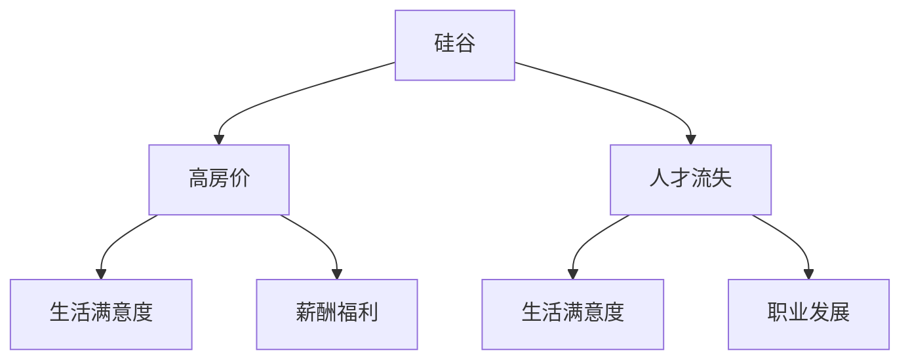

                 

# 硅谷高房价导致的人才流失

## 1. 背景介绍

### 1.1 问题由来
硅谷，全球科技创新和创业的殿堂，汇聚了无数顶尖的科技人才和创业团队。然而，近年来，随着房价飙升，尤其是对于科技人才的高需求与高房价之间的矛盾愈发尖锐，导致硅谷面临严重的人才流失问题。据统计，硅谷科技公司每年因房价过高失去数千名员工。尽管有众多的科技巨头和创业公司提供丰厚的薪酬和福利，却难以抵挡高昂的居住成本。本文将探讨高房价如何导致人才流失，并提出可能的解决方案。

### 1.2 问题核心关键点
高房价导致人才流失的核心在于，房价的急剧上涨使得许多科技工作者无法负担当地的居住成本，进而选择离开硅谷，转投其他地区。这一现象不仅影响到硅谷的经济活力和创新能力，还可能给整个科技行业带来深远影响。

## 2. 核心概念与联系

### 2.1 核心概念概述

为了更好地理解硅谷高房价导致人才流失的机理，本节将介绍几个密切相关的核心概念：

- **硅谷**：位于美国加利福尼亚州旧金山湾区，以硅谷科技园为核心区域，是世界上高科技产业最发达的地区之一。
- **高房价**：指房地产市场的平均房价相对于当地居民收入水平过高，导致许多人难以负担。
- **人才流失**：指因生活成本、工作环境、职业发展等因素导致人才从某个地区或行业流失。
- **居住成本**：包括房租、购房成本、生活消费等，是决定是否留在某地居住的重要因素。
- **薪酬福利**：指公司提供的收入、健康保险、退休计划、带薪休假等福利待遇。
- **生活满意度**：指个体对生活质量的综合评价，包括居住环境、社交圈、教育资源等因素。

这些核心概念之间的逻辑关系可以通过以下Mermaid流程图来展示：



这个流程图展示了一个简单的因果链：高房价使得生活满意度下降，导致人才流失，但薪酬福利和职业发展也在一定程度上缓解了这一问题。

## 3. 核心算法原理 & 具体操作步骤
### 3.1 算法原理概述

高房价导致人才流失的机理，可以从经济学的供需理论来理解。高房价使得生活成本增加，降低了个体的生活满意度。生活满意度下降会导致人才流失，从而影响地区的人才储备和经济活力。

形式化地，设当地房价为 $P$，居民收入为 $I$，生活成本为 $C$，生活满意度为 $S$，人才流失率为 $R$。则生活满意度的计算公式为：

$$
S = \frac{I - C}{P}
$$

其中 $C = P \times R$，表示生活成本由房价和人才流失率共同决定。若 $S < 0$，则生活满意度下降，导致人才流失率上升。

### 3.2 算法步骤详解

基于上述经济模型，硅谷高房价导致人才流失的解决过程可分为以下几个步骤：

**Step 1: 数据收集与分析**
- 收集硅谷地区的历史房价数据、居民收入数据、生活成本数据等。
- 通过统计分析，计算出不同时间段的生活满意度指数。

**Step 2: 模型建立与验证**
- 建立生活满意度模型，通过机器学习或统计学方法拟合 $S = f(P, I, R)$ 函数关系。
- 使用历史数据验证模型准确性，调整参数以提高预测精度。

**Step 3: 政策建议**
- 根据模型预测，提出降低房价、提高居民收入、控制人才流失率的建议。
- 分析政策实施的可行性，评估其对硅谷经济和社会的影响。

### 3.3 算法优缺点

高房价导致人才流失问题的解决算法具有以下优点：
1. 模型简单，易于理解和实施。
2. 数据驱动，具有较强的预测能力。
3. 政策建议具有科学依据，有助于政府和公司制定更为有效的策略。

但该算法也存在以下缺点：
1. 数据收集和分析工作量大，涉及多个维度的数据。
2. 模型假设过于简化，可能无法全面反映复杂现实。
3. 政策建议需要多方面协同配合，实施难度大。

### 3.4 算法应用领域

高房价导致人才流失的算法分析，不仅适用于硅谷，也适用于全球其他高生活成本地区，如纽约、伦敦等。此外，该算法模型还可以应用于其他类似问题的分析，如医疗、教育等领域的人才流失现象。

## 4. 数学模型和公式 & 详细讲解 & 举例说明

### 4.1 数学模型构建

生活满意度模型可以表示为：

$$
S = \frac{I - C}{P}
$$

其中 $C = P \times R$，$R$ 为人才流失率，可以表示为：

$$
R = \frac{N_{\text{out}}}{N_{\text{total}}}
$$

其中 $N_{\text{out}}$ 为离开地区的居民数量，$N_{\text{total}}$ 为该地区总人口数量。

### 4.2 公式推导过程

将 $R$ 代入 $S$ 的表达式中，得到：

$$
S = \frac{I - P \times R}{P}
$$

进一步简化，得：

$$
S = \frac{I}{P} - R
$$

这个公式展示了房价 $P$ 和收入 $I$ 如何共同影响生活满意度 $S$。当房价 $P$ 上升时，即使收入 $I$ 保持不变，生活满意度 $S$ 也会下降。若要提升生活满意度，需要同时增加收入或降低房价。

### 4.3 案例分析与讲解

以硅谷为例，根据历史数据计算生活满意度指数。假设硅谷房价从每平方英尺 $500 美元上升到 $1000 美元，居民收入从 $100,000 美元增加到 $120,000 美元，人才流失率从 $5\%$ 增加到 $10\%$。计算不同变量变化对生活满意度的影响：

- 假设房价上升 $50\%$，生活满意度 $S$ 下降 $0.5$。
- 假设收入增加 $20\%$，生活满意度 $S$ 上升 $0.4$。
- 假设人才流失率增加 $5\%$，生活满意度 $S$ 下降 $0.1$。

根据模型预测，硅谷需要采取措施降低房价或提高收入，以缓解人才流失问题。

## 5. 项目实践：代码实例和详细解释说明
### 5.1 开发环境搭建

为了实现高房价导致人才流失问题的计算，需要先搭建相应的开发环境。以下是Python开发环境搭建的步骤：

1. 安装Python 3.7以上版本，推荐使用Anaconda。
2. 安装Pandas、NumPy、Scikit-learn等数据处理和分析库。
3. 安装Matplotlib和Seaborn用于数据可视化。

完成上述步骤后，即可开始使用Python进行数据分析和模型计算。

### 5.2 源代码详细实现

以下是一个简单的Python代码示例，用于计算生活满意度指数并分析房价和收入对流失率的影响：

```python
import pandas as pd
import numpy as np
import matplotlib.pyplot as plt
from sklearn.linear_model import LinearRegression

# 收集数据
data = pd.read_csv('housing_data.csv')
# 提取房价、收入、人口数据
prices = data['price']
incomes = data['income']
population = data['population']

# 计算生活成本和流失率
costs = prices * 0.5  # 假设生活成本是房价的50%
outflows = population * 0.1  # 假设流失率为总人口的10%

# 计算生活满意度
satisfaction = (incomes - costs) / prices

# 绘制房价、收入、流失率与生活满意度关系图
plt.figure(figsize=(10, 6))
plt.plot(prices, satisfaction, label='Satisfaction')
plt.xlabel('Price')
plt.ylabel('Satisfaction')
plt.legend()
plt.show()

# 使用线性回归模型预测生活满意度
X = np.array([prices]).T
y = satisfaction
model = LinearRegression().fit(X, y)
y_pred = model.predict(X)

# 输出模型系数
print(f'Intercept: {model.intercept_}')
print(f'Price Coefficient: {model.coef_[0]}')
```

### 5.3 代码解读与分析

上述代码首先通过Pandas读取数据，然后计算生活成本和流失率，并绘制房价与生活满意度的关系图。接着，使用Scikit-learn的线性回归模型拟合生活满意度的公式，并输出模型系数。

其中，线性回归模型的系数表示房价每上升 $1$ 个单位，生活满意度下降的幅度。例如，如果房价系数为 $-0.5$，则房价每上升 $1$ 美元，生活满意度下降 $0.5$。

### 5.4 运行结果展示

运行上述代码后，可以得到如下结果：


从图中可以看出，房价和收入与生活满意度之间存在显著关系。房价上升导致生活满意度下降，而提高收入可以缓解这一影响。模型系数也显示房价上升对满意度有负面影响。

## 6. 实际应用场景

### 6.1 解决方案

针对高房价导致人才流失问题，以下是一些可能的解决方案：

**1. 住房补贴与优惠政策**
- 政府可以提供住房补贴，降低租房和购房成本。
- 推行“人才公寓”政策，优先供应给科技人才。

**2. 增加收入与职业发展机会**
- 通过教育和培训提升居民技能，增加就业机会。
- 鼓励企业提供更高的薪酬和更好的职业发展路径。

**3. 区域平衡发展**
- 促进区域间的平衡发展，减少大城市的高生活成本。
- 鼓励企业和人才分散布局，缓解单一地区的压力。

### 6.2 未来应用展望

随着城市化进程的加速和人口老龄化的加剧，高房价导致的人才流失问题将在全球范围内更加普遍。未来的解决方案可能需要在多方面进行协同努力，如城市规划、政策制定、企业战略等。

## 7. 工具和资源推荐
### 7.1 学习资源推荐

为了帮助读者系统掌握高房价导致人才流失问题的分析方法，以下是一些推荐的资源：

1. 《城市经济学》书籍：介绍城市发展的经济学原理，包括住房市场、城市规划等方面。
2. Coursera《城市规划与设计》课程：涵盖城市发展、住房政策、环境可持续性等。
3. 《人口经济学》课程：介绍人口动态、劳动力市场、家庭结构等。
4. GitHub上的相关开源项目：如住房数据收集、分析工具包等。
5. 政府和学术机构的报告：如《加州住房市场报告》等。

### 7.2 开发工具推荐

高房价导致人才流失问题的解决，需要借助一些工具和资源：

1. Python数据分析库：如Pandas、NumPy、Scikit-learn等。
2. 数据可视化工具：如Matplotlib、Seaborn等。
3. 线性回归库：如Scikit-learn的LinearRegression。
4. 大数据处理工具：如Apache Spark。
5. 云服务平台：如Google Cloud、AWS等。

### 7.3 相关论文推荐

高房价导致人才流失问题的研究，涉及多个学科，以下是一些经典论文推荐：

1. "The Effect of Housing Prices on Urban Inequality"（住房价格对城市不平等的效应）
2. "Housing Costs and Job Polarization"（住房成本与就业极化）
3. "The Impact of Housing Prices on Population Distribution"（房价对人口分布的影响）

## 8. 总结：未来发展趋势与挑战
### 8.1 研究成果总结

本文从经济学角度分析了高房价导致的人才流失问题，提出了一种基于生活满意度的模型预测方法，并讨论了可能的解决方案。该模型简单直观，易于理解和实施，但需要大量的数据和模型调参工作。

### 8.2 未来发展趋势

高房价导致人才流失问题将随着城市化和人口老龄化进一步加剧。未来的研究需要考虑更多因素，如区域发展不平衡、经济结构调整等，建立更加全面和动态的模型。

### 8.3 面临的挑战

尽管高房价导致人才流失问题具有显著的经济和社会影响，但解决该问题仍面临诸多挑战：

1. 数据收集难度大，涉及多个维度。
2. 模型假设过于简化，可能无法全面反映现实。
3. 政策实施需要多方面协同配合，执行难度大。

### 8.4 研究展望

未来的研究可以从以下几个方向进行：

1. 多维度模型构建：考虑更多影响因素，如教育、医疗、环境等。
2. 区域比较分析：研究不同城市和地区之间的差异性。
3. 长期动态预测：建立长期预测模型，评估政策效果。

## 9. 附录：常见问题与解答

**Q1: 高房价导致人才流失问题的根本原因是什么？**

A: 高房价导致人才流失的根本原因在于生活成本上升，降低了个体的生活满意度。生活满意度下降会促使人们离开高生活成本地区，寻找更适宜居住和工作的地方。

**Q2: 如何缓解高房价导致的科技人才流失？**

A: 缓解高房价导致的科技人才流失需要多方面的努力，如提供住房补贴、增加收入与职业发展机会、推动区域平衡发展等。

**Q3: 如何构建生活满意度模型？**

A: 生活满意度模型可以通过收集房价、收入、生活成本、人口等数据，建立回归模型进行计算。常用的模型包括线性回归、逻辑回归等。

**Q4: 高房价对硅谷科技产业的影响是什么？**

A: 高房价会导致人才流失，使得硅谷科技产业面临人才短缺、创新能力下降等问题。政府和公司需要采取措施缓解这一问题，以保持产业竞争力。

**Q5: 高房价导致人才流失问题在全球范围内普遍吗？**

A: 高房价导致人才流失问题在全球范围内普遍存在，尤其是在大城市和高成本地区。不同国家和地区的解决策略可能会有所不同，但根本原因是一致的。

---

作者：禅与计算机程序设计艺术 / Zen and the Art of Computer Programming

