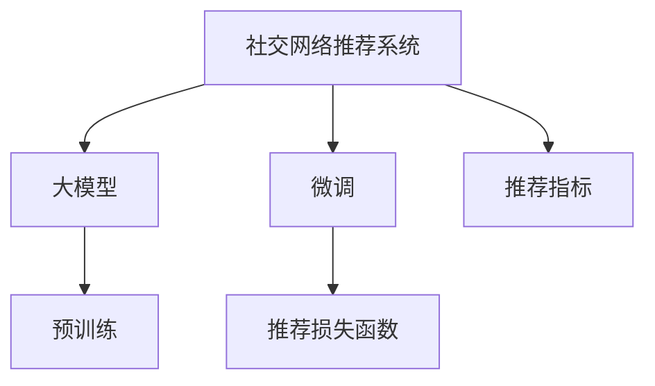

                 

# 社交网络推荐：大模型的发展方向

## 1. 背景介绍

### 1.1 问题由来

在社交网络时代，推荐系统成为连接用户和内容的重要桥梁。推荐系统通过分析用户的兴趣和行为，精准推荐符合用户需求的内容，提升用户体验和满意度。传统的推荐系统往往基于用户历史行为数据进行相似度匹配，难以应对快速变化的用户兴趣和多样化的内容形式。而基于大模型的推荐系统，通过学习海量用户和内容数据，能够更全面、准确地理解用户偏好，推荐内容质量更高，同时也能处理更多样化的数据类型。

### 1.2 问题核心关键点

目前，基于大模型的社交网络推荐系统主要有以下几类：

1. **显式反馈推荐**：通过收集用户显式的评分、点击、收藏等反馈数据，训练模型预测用户对这些内容的评分，实现个性化推荐。
2. **隐式反馈推荐**：利用用户的访问行为数据（如页面浏览、点击、停留时间等），通过计算用户和内容的相似度进行推荐。
3. **序列推荐**：结合用户的历史行为序列，利用序列模型（如RNN、GRU等）学习用户兴趣的动态变化，进行连续内容的推荐。
4. **多模态推荐**：结合文本、图片、视频等多模态数据，利用多模态模型（如Vision Transformer、Text-Emotion等）实现跨模态内容推荐。

这些推荐方法的核心在于利用深度学习模型学习用户和内容的复杂关系，从而实现更精准的推荐。而基于大模型的推荐方法，通过预训练和微调技术，在提升推荐效果的同时，也能更好地适应特定场景和数据类型。

### 1.3 问题研究意义

研究基于大模型的社交网络推荐系统，对于提升社交网络的智能化水平、改善用户体验、推动内容分发机制的变革具有重要意义：

1. **个性化推荐**：通过学习用户的多样化需求，实现内容的个性化推荐，提升用户满意度和粘性。
2. **内容发现**：在大模型基础上进行内容生成和分类，发现更多优质内容，满足用户不断变化的兴趣。
3. **互动增强**：利用推荐系统促进用户与内容之间的互动，提升社交网络的活跃度和粘性。
4. **数据分析**：基于大模型的推荐系统能够进行更深入的用户行为分析和趋势预测，为广告投放、用户增长等提供数据支撑。
5. **技术创新**：推动推荐技术的不断进步，推动社交网络的智能化和自动化发展。

## 2. 核心概念与联系

### 2.1 核心概念概述

为更好地理解基于大模型的社交网络推荐系统，本节将介绍几个密切相关的核心概念：

- **大模型**：指通过大规模数据预训练得到的深度学习模型，如BERT、GPT等。这些模型通常具有强大的语言表示能力，可以用于处理自然语言、图像、视频等多种数据类型。
- **预训练**：指在大规模无标签数据上，通过自监督学习任务训练大模型的过程。预训练使得模型学习到广泛的知识和表示能力。
- **微调**：指在预训练模型的基础上，使用社交网络推荐任务的数据，通过有监督学习优化模型在该任务上的性能。通常只更新模型的顶层或部分参数。
- **社交网络推荐系统**：利用大模型技术，对社交网络上的用户行为数据进行分析和建模，实现个性化内容的推荐。
- **多模态推荐**：结合文本、图片、视频等多种数据类型，利用多模态模型进行跨模态内容推荐。
- **推荐损失函数**：用于衡量推荐系统预测与真实用户行为之间的差异，常见的有交叉熵损失、均方误差损失等。
- **推荐指标**：用于评估推荐系统性能的指标，如准确率、召回率、F1值等。

这些核心概念之间的逻辑关系可以通过以下Mermaid流程图来展示：



这个流程图展示了大模型、预训练、微调、推荐系统和推荐指标之间的关联关系。

## 3. 核心算法原理 & 具体操作步骤
### 3.1 算法原理概述

基于大模型的社交网络推荐系统，本质上是一个有监督的细粒度迁移学习过程。其核心思想是：将大模型视作一个强大的特征提取器，通过在社交网络推荐任务上使用有标签数据进行微调，使得模型能够精确地预测用户对内容的偏好，从而实现个性化推荐。

形式化地，假设社交网络推荐任务为 $T$，大模型为 $M_{\theta}$，其中 $\theta$ 为预训练得到的模型参数。给定社交网络推荐任务 $T$ 的标注数据集 $D=\{(x_i,y_i)\}_{i=1}^N$，微调的目标是找到新的模型参数 $\hat{\theta}$，使得：

$$
\hat{\theta}=\mathop{\arg\min}_{\theta} \mathcal{L}(M_{\theta},D)
$$

其中 $\mathcal{L}$ 为针对任务 $T$ 设计的损失函数，用于衡量模型预测输出与真实标签之间的差异。常见的损失函数包括交叉熵损失、均方误差损失等。

通过梯度下降等优化算法，微调过程不断更新模型参数 $\theta$，最小化损失函数 $\mathcal{L}$，使得模型输出逼近真实标签。由于 $\theta$ 已经通过预训练获得了较好的初始化，因此即便在社交网络推荐数据集 $D$ 上进行微调，也能较快收敛到理想的模型参数 $\hat{\theta}$。

### 3.2 算法步骤详解

基于大模型的社交网络推荐系统一般包括以下几个关键步骤：

**Step 1: 准备大模型和数据集**
- 选择合适的预训练大模型 $M_{\theta}$ 作为初始化参数，如 BERT、GPT 等。
- 准备社交网络推荐任务 $T$ 的标注数据集 $D$，划分为训练集、验证集和测试集。一般要求标注数据与预训练数据的分布不要差异过大。

**Step 2: 设计推荐模型**
- 根据任务类型，设计合适的推荐模型，通常包括嵌入层、中间层和输出层。嵌入层用于将用户和内容转换为向量表示。中间层进行特征提取和信息融合。输出层进行最终推荐预测。
- 选择适当的模型结构，如深度神经网络、注意力机制、Transformer等。

**Step 3: 设置微调超参数**
- 选择合适的优化算法及其参数，如 AdamW、SGD 等，设置学习率、批大小、迭代轮数等。
- 设置正则化技术及强度，包括权重衰减、Dropout、Early Stopping 等。
- 确定冻结预训练参数的策略，如仅微调顶层，或全部参数都参与微调。

**Step 4: 执行梯度训练**
- 将训练集数据分批次输入模型，前向传播计算损失函数。
- 反向传播计算参数梯度，根据设定的优化算法和学习率更新模型参数。
- 周期性在验证集上评估模型性能，根据性能指标决定是否触发 Early Stopping。
- 重复上述步骤直到满足预设的迭代轮数或 Early Stopping 条件。

**Step 5: 测试和部署**
- 在测试集上评估微调后模型 $M_{\hat{\theta}}$ 的性能，对比微调前后的精度提升。
- 使用微调后的模型对新样本进行推理预测，集成到实际的应用系统中。
- 持续收集新的数据，定期重新微调模型，以适应数据分布的变化。

以上是基于大模型的社交网络推荐系统的一般流程。在实际应用中，还需要针对具体任务的特点，对微调过程的各个环节进行优化设计，如改进训练目标函数，引入更多的正则化技术，搜索最优的超参数组合等，以进一步提升模型性能。

### 3.3 算法优缺点

基于大模型的社交网络推荐系统具有以下优点：
1. 简单高效。只需准备少量标注数据，即可对预训练模型进行快速适配，获得较大的性能提升。
2. 通用适用。适用于各种社交网络推荐任务，包括物品推荐、内容推荐、话题推荐等，设计简单的推荐模型即可实现微调。
3. 泛化能力强。大模型具备强大的语言表示能力，可以处理多种数据类型，适应不同领域的推荐需求。
4. 效果显著。在学术界和工业界的诸多推荐任务上，基于微调的方法已经刷新了最先进的性能指标。

同时，该方法也存在一定的局限性：
1. 依赖标注数据。推荐系统的效果很大程度上取决于标注数据的质量和数量，获取高质量标注数据的成本较高。
2. 泛化能力有限。当目标任务与预训练数据的分布差异较大时，推荐系统的性能提升有限。
3. 可解释性不足。推荐系统的决策过程通常缺乏可解释性，难以对其推理逻辑进行分析和调试。

尽管存在这些局限性，但就目前而言，基于大模型的推荐系统仍是最主流范式。未来相关研究的重点在于如何进一步降低推荐系统对标注数据的依赖，提高模型的少样本学习和跨领域迁移能力，同时兼顾可解释性和伦理安全性等因素。

### 3.4 算法应用领域

基于大模型的社交网络推荐系统在推荐技术领域已经得到了广泛的应用，覆盖了几乎所有常见推荐任务，例如：

- **个性化推荐**：如电商网站的商品推荐、视频平台的个性化视频推荐等。通过微调使模型学习用户的多样化需求，进行精准推荐。
- **内容推荐**：如新闻网站的新闻推荐、博客平台的文章推荐等。通过微调使模型学习内容的语义表示，进行相关内容的推荐。
- **话题推荐**：如社交网络上的话题推荐、论坛中的帖子推荐等。通过微调使模型学习用户的兴趣点和讨论主题，推荐相关话题。
- **搜索推荐**：如搜索引擎的搜索推荐、广告平台的关键词推荐等。通过微调使模型学习搜索行为，进行相关的搜索结果和广告推荐。

除了上述这些经典任务外，基于大模型的推荐系统还被创新性地应用到更多场景中，如可控推荐、冷启动推荐、跨领域推荐等，为推荐技术带来了全新的突破。随着大模型的演进和推荐技术的不断进步，相信社交网络推荐技术将在更广阔的应用领域大放异彩。

## 4. 数学模型和公式 & 详细讲解 & 举例说明
### 4.1 数学模型构建

本节将使用数学语言对基于大模型的社交网络推荐系统进行更加严格的刻画。

记社交网络推荐任务为 $T$，其中用户行为数据为 $X=\{x_i\}_{i=1}^N$，推荐内容数据为 $Y=\{y_i\}_{i=1}^N$。定义推荐模型为 $M_{\theta}$，其中 $\theta$ 为模型参数。推荐模型在数据集 $D=\{(x_i,y_i)\}_{i=1}^N$ 上的损失函数为：

$$
\mathcal{L}(\theta) = -\frac{1}{N} \sum_{i=1}^N \log P(y_i|x_i;\theta)
$$

其中 $P(y_i|x_i;\theta)$ 为模型在给定用户行为数据 $x_i$ 下的推荐概率分布，可以使用softmax函数进行归一化。

### 4.2 公式推导过程

以下我们以个性化推荐为例，推导推荐模型的训练目标函数和优化过程。

假设推荐模型 $M_{\theta}$ 在用户行为数据 $x_i$ 上的推荐概率分布为 $P(y_i|x_i;\theta)$，则推荐模型的训练目标函数为：

$$
\mathcal{L}(\theta) = -\frac{1}{N} \sum_{i=1}^N \log P(y_i|x_i;\theta)
$$

根据贝叶斯公式，推荐概率分布可以表示为：

$$
P(y_i|x_i;\theta) = \frac{P(y_i|x_i;\theta)P(x_i|y_i;\theta)}{P(x_i)}
$$

其中 $P(x_i)$ 为用户行为数据的先验概率，可以通过统计所有用户行为数据的出现次数进行估计。将 $P(y_i|x_i;\theta)$ 和 $P(x_i|y_i;\theta)$ 代入目标函数，得：

$$
\mathcal{L}(\theta) = -\frac{1}{N} \sum_{i=1}^N [\log P(y_i|x_i;\theta) + \log P(x_i|y_i;\theta)]
$$

进一步简化，得：

$$
\mathcal{L}(\theta) = -\frac{1}{N} \sum_{i=1}^N [\log P(y_i|x_i;\theta) + \log P(x_i|y_i;\theta)]
$$

在训练过程中，通过反向传播计算模型参数 $\theta$ 的梯度，使用优化算法（如AdamW、SGD等）进行更新，直至收敛。

### 4.3 案例分析与讲解

假设推荐系统有 $N=1000$ 个用户，每个用户 $x_i$ 的行为数据包含 $D=1000$ 个物品，推荐系统需要预测用户对每个物品的评分 $y_i$，其中 $y_i \in [0,1]$。

假设推荐模型 $M_{\theta}$ 是一个两层的深度神经网络，其中嵌入层将用户和物品转换为向量表示，中间层进行特征提取和信息融合，输出层进行最终推荐预测。模型在训练集 $D$ 上的损失函数为：

$$
\mathcal{L}(\theta) = -\frac{1}{N} \sum_{i=1}^N \log P(y_i|x_i;\theta)
$$

其中 $P(y_i|x_i;\theta)$ 为推荐模型的预测概率分布，可以使用softmax函数进行归一化。

在训练过程中，推荐模型使用AdamW优化算法进行参数更新，设置学习率为 $2e-5$，批大小为 $256$，迭代轮数为 $10$。训练过程中，模型在验证集上评估性能，若验证集上的性能提升达到 $0.5\%$，则提前停止训练。

## 5. 项目实践：代码实例和详细解释说明
### 5.1 开发环境搭建

在进行推荐系统开发前，我们需要准备好开发环境。以下是使用Python进行PyTorch开发的环境配置流程：

1. 安装Anaconda：从官网下载并安装Anaconda，用于创建独立的Python环境。

2. 创建并激活虚拟环境：
```bash
conda create -n pytorch-env python=3.8 
conda activate pytorch-env
```

3. 安装PyTorch：根据CUDA版本，从官网获取对应的安装命令。例如：
```bash
conda install pytorch torchvision torchaudio cudatoolkit=11.1 -c pytorch -c conda-forge
```

4. 安装Transformers库：
```bash
pip install transformers
```

5. 安装各类工具包：
```bash
pip install numpy pandas scikit-learn matplotlib tqdm jupyter notebook ipython
```

完成上述步骤后，即可在`pytorch-env`环境中开始推荐系统开发。

### 5.2 源代码详细实现

下面我们以个性化推荐任务为例，给出使用Transformers库对BERT模型进行微调的PyTorch代码实现。

首先，定义推荐任务的数据处理函数：

```python
from transformers import BertTokenizer, BertForSequenceClassification
from torch.utils.data import Dataset
import torch

class RecommendationDataset(Dataset):
    def __init__(self, user_behaviors, item_labels, tokenizer, max_len=128):
        self.user_behaviors = user_behaviors
        self.item_labels = item_labels
        self.tokenizer = tokenizer
        self.max_len = max_len
        
    def __len__(self):
        return len(self.user_behaviors)
    
    def __getitem__(self, item):
        user_behavior = self.user_behaviors[item]
        item_label = self.item_labels[item]
        
        encoding = self.tokenizer(user_behavior, return_tensors='pt', max_length=self.max_len, padding='max_length', truncation=True)
        input_ids = encoding['input_ids'][0]
        attention_mask = encoding['attention_mask'][0]
        
        # 对token-wise的标签进行编码
        encoded_labels = [item_label] * self.max_len
        labels = torch.tensor(encoded_labels, dtype=torch.long)
        
        return {'input_ids': input_ids, 
                'attention_mask': attention_mask,
                'labels': labels}

# 创建dataset
tokenizer = BertTokenizer.from_pretrained('bert-base-cased')

train_dataset = RecommendationDataset(train_user_behaviors, train_item_labels, tokenizer)
dev_dataset = RecommendationDataset(dev_user_behaviors, dev_item_labels, tokenizer)
test_dataset = RecommendationDataset(test_user_behaviors, test_item_labels, tokenizer)
```

然后，定义模型和优化器：

```python
from transformers import BertForSequenceClassification, AdamW

model = BertForSequenceClassification.from_pretrained('bert-base-cased', num_labels=1)

optimizer = AdamW(model.parameters(), lr=2e-5)
```

接着，定义训练和评估函数：

```python
from torch.utils.data import DataLoader
from tqdm import tqdm
from sklearn.metrics import accuracy_score

device = torch.device('cuda') if torch.cuda.is_available() else torch.device('cpu')
model.to(device)

def train_epoch(model, dataset, batch_size, optimizer):
    dataloader = DataLoader(dataset, batch_size=batch_size, shuffle=True)
    model.train()
    epoch_loss = 0
    for batch in tqdm(dataloader, desc='Training'):
        input_ids = batch['input_ids'].to(device)
        attention_mask = batch['attention_mask'].to(device)
        labels = batch['labels'].to(device)
        model.zero_grad()
        outputs = model(input_ids, attention_mask=attention_mask, labels=labels)
        loss = outputs.loss
        epoch_loss += loss.item()
        loss.backward()
        optimizer.step()
    return epoch_loss / len(dataloader)

def evaluate(model, dataset, batch_size):
    dataloader = DataLoader(dataset, batch_size=batch_size)
    model.eval()
    preds, labels = [], []
    with torch.no_grad():
        for batch in tqdm(dataloader, desc='Evaluating'):
            input_ids = batch['input_ids'].to(device)
            attention_mask = batch['attention_mask'].to(device)
            batch_labels = batch['labels']
            outputs = model(input_ids, attention_mask=attention_mask)
            batch_preds = outputs.predictions.argmax(dim=1).to('cpu').tolist()
            batch_labels = batch_labels.to('cpu').tolist()
            for pred, label in zip(batch_preds, batch_labels):
                preds.append(pred)
                labels.append(label)
                
    print('Accuracy: %.2f%%' % (accuracy_score(labels, preds) * 100))
```

最后，启动训练流程并在测试集上评估：

```python
epochs = 5
batch_size = 16

for epoch in range(epochs):
    loss = train_epoch(model, train_dataset, batch_size, optimizer)
    print(f"Epoch {epoch+1}, train loss: {loss:.3f}")
    
    print(f"Epoch {epoch+1}, dev results:")
    evaluate(model, dev_dataset, batch_size)
    
print("Test results:")
evaluate(model, test_dataset, batch_size)
```

以上就是使用PyTorch对BERT进行个性化推荐任务微调的完整代码实现。可以看到，得益于Transformers库的强大封装，我们可以用相对简洁的代码完成BERT模型的加载和微调。

### 5.3 代码解读与分析

让我们再详细解读一下关键代码的实现细节：

**RecommendationDataset类**：
- `__init__`方法：初始化用户行为、标签、分词器等关键组件。
- `__len__`方法：返回数据集的样本数量。
- `__getitem__`方法：对单个样本进行处理，将用户行为输入编码为token ids，将标签编码为数字，并对其进行定长padding，最终返回模型所需的输入。

**tokenizer**：
- 定义了用户行为和标签的token化方式，用于将文本数据转换为模型可接受的格式。

**训练和评估函数**：
- 使用PyTorch的DataLoader对数据集进行批次化加载，供模型训练和推理使用。
- 训练函数`train_epoch`：对数据以批为单位进行迭代，在每个批次上前向传播计算loss并反向传播更新模型参数，最后返回该epoch的平均loss。
- 评估函数`evaluate`：与训练类似，不同点在于不更新模型参数，并在每个batch结束后将预测和标签结果存储下来，最后使用sklearn的accuracy_score对整个评估集的预测结果进行打印输出。

**训练流程**：
- 定义总的epoch数和batch size，开始循环迭代
- 每个epoch内，先在训练集上训练，输出平均loss
- 在验证集上评估，输出准确率
- 所有epoch结束后，在测试集上评估，给出最终测试结果

可以看到，PyTorch配合Transformers库使得BERT微调的代码实现变得简洁高效。开发者可以将更多精力放在数据处理、模型改进等高层逻辑上，而不必过多关注底层的实现细节。

当然，工业级的系统实现还需考虑更多因素，如模型的保存和部署、超参数的自动搜索、更灵活的任务适配层等。但核心的微调范式基本与此类似。

## 6. 实际应用场景
### 6.1 个性化推荐

基于大模型的推荐系统可以广泛应用于个性化推荐场景，如电商平台的商品推荐、视频平台的个性化视频推荐等。通过收集用户的历史行为数据，构建用户画像，结合商品的特征信息，利用大模型进行微调，精准推荐用户可能感兴趣的商品或视频。

在技术实现上，可以收集用户的浏览、购买、评价等行为数据，并提取商品或视频的标题、描述、标签等文本内容。将文本内容作为模型输入，用户的后续行为（如点击、购买等）作为监督信号，在此基础上微调预训练语言模型。微调后的模型能够从文本内容中准确把握用户的兴趣点。在生成推荐列表时，先用候选物品或视频的文本描述作为输入，由模型预测用户的兴趣匹配度，再结合其他特征综合排序，便可以得到个性化程度更高的推荐结果。

### 6.2 内容推荐

基于大模型的推荐系统还可以应用于内容推荐场景，如新闻网站的新闻推荐、博客平台的文章推荐等。通过收集用户的阅读行为数据，构建用户画像，结合新闻或文章的特征信息，利用大模型进行微调，精准推荐用户可能感兴趣的新闻或文章。

在技术实现上，可以收集用户的阅读历史、评论、点赞等行为数据，并提取新闻或文章的标题、摘要、标签等文本内容。将文本内容作为模型输入，用户的后续行为（如点击、阅读等）作为监督信号，在此基础上微调预训练语言模型。微调后的模型能够从文本内容中准确把握用户的兴趣点。在生成推荐列表时，先用候选新闻或文章的文本描述作为输入，由模型预测用户的兴趣匹配度，再结合其他特征综合排序，便可以得到个性化程度更高的推荐结果。

### 6.3 话题推荐

基于大模型的推荐系统还可以应用于话题推荐场景，如社交网络上的话题推荐、论坛中的帖子推荐等。通过收集用户的阅读、评论、点赞等行为数据，构建用户画像，结合话题的特征信息，利用大模型进行微调，精准推荐用户可能感兴趣的话题。

在技术实现上，可以收集用户的阅读历史、评论、点赞等行为数据，并提取话题的标签、摘要、发布者等文本内容。将文本内容作为模型输入，用户的后续行为（如点击、阅读等）作为监督信号，在此基础上微调预训练语言模型。微调后的模型能够从文本内容中准确把握用户的兴趣点。在生成推荐列表时，先用候选话题的文本描述作为输入，由模型预测用户的兴趣匹配度，再结合其他特征综合排序，便可以得到个性化程度更高的推荐结果。

### 6.4 未来应用展望

随着大模型和推荐技术的不断发展，基于大模型的推荐系统将在更多领域得到应用，为推荐技术带来新的突破。

在智慧医疗领域，基于大模型的推荐系统可以用于推荐医疗信息、健康建议、治疗方案等，辅助医生诊疗，提升医疗服务质量。

在智能教育领域，基于大模型的推荐系统可以用于推荐学习资源、学习路径、学习伙伴等，因材施教，促进教育公平，提高教学质量。

在智慧城市治理中，基于大模型的推荐系统可以用于推荐城市事件、服务、旅游信息等，提升城市管理的自动化和智能化水平，构建更安全、高效的未来城市。

此外，在企业生产、社会治理、文娱传媒等众多领域，基于大模型的推荐系统也将不断涌现，为经济社会发展注入新的动力。相信随着技术的日益成熟，基于大模型的推荐系统必将在更广阔的应用领域大放异彩。

## 7. 工具和资源推荐
### 7.1 学习资源推荐

为了帮助开发者系统掌握大模型推荐系统的理论基础和实践技巧，这里推荐一些优质的学习资源：

1. 《深度学习推荐系统》书籍：介绍深度学习在推荐系统中的应用，包括大模型推荐系统的基本概念和实现方法。
2. 《推荐系统实战》课程：动手实践，从零开始构建推荐系统，学习推荐系统的评估指标和优化方法。
3. Coursera的《Machine Learning for Recommender Systems》课程：由IBM提供的深度学习推荐系统课程，涵盖从推荐基础到深度学习的推荐系统实现。
4. Kaggle上的推荐系统竞赛：通过实际比赛项目，学习推荐系统的前沿技术和优化策略。
5. arXiv上的相关论文：最新推荐系统研究的论文，了解推荐系统的前沿动态和研究方向。

通过对这些资源的学习实践，相信你一定能够快速掌握大模型推荐系统的精髓，并用于解决实际的推荐问题。
### 7.2 开发工具推荐

高效的开发离不开优秀的工具支持。以下是几款用于大模型推荐系统开发的常用工具：

1. PyTorch：基于Python的开源深度学习框架，灵活动态的计算图，适合快速迭代研究。大部分预训练语言模型都有PyTorch版本的实现。
2. TensorFlow：由Google主导开发的开源深度学习框架，生产部署方便，适合大规模工程应用。同样有丰富的预训练语言模型资源。
3. Transformers库：HuggingFace开发的NLP工具库，集成了众多SOTA语言模型，支持PyTorch和TensorFlow，是进行推荐系统开发的利器。
4. Weights & Biases：模型训练的实验跟踪工具，可以记录和可视化模型训练过程中的各项指标，方便对比和调优。与主流深度学习框架无缝集成。
5. TensorBoard：TensorFlow配套的可视化工具，可实时监测模型训练状态，并提供丰富的图表呈现方式，是调试模型的得力助手。

合理利用这些工具，可以显著提升大模型推荐系统的开发效率，加快创新迭代的步伐。

### 7.3 相关论文推荐

大模型推荐系统的发展源于学界的持续研究。以下是几篇奠基性的相关论文，推荐阅读：

1. Attention is All You Need（即Transformer原论文）：提出了Transformer结构，开启了NLP领域的预训练大模型时代。
2. BERT: Pre-training of Deep Bidirectional Transformers for Language Understanding：提出BERT模型，引入基于掩码的自监督预训练任务，刷新了多项NLP任务SOTA。
3. Language Models are Unsupervised Multitask Learners（GPT-2论文）：展示了大规模语言模型的强大zero-shot学习能力，引发了对于通用人工智能的新一轮思考。
4. Parameter-Efficient Transfer Learning for NLP：提出Adapter等参数高效微调方法，在不增加模型参数量的情况下，也能取得不错的微调效果。
5. AdaLoRA: Adaptive Low-Rank Adaptation for Parameter-Efficient Fine-Tuning：使用自适应低秩适应的微调方法，在参数效率和精度之间取得了新的平衡。

这些论文代表了大模型推荐系统的发展脉络。通过学习这些前沿成果，可以帮助研究者把握学科前进方向，激发更多的创新灵感。

## 8. 总结：未来发展趋势与挑战

### 8.1 总结

本文对基于大模型的社交网络推荐系统进行了全面系统的介绍。首先阐述了大模型和推荐系统的发展背景和意义，明确了推荐系统在智能化、个性化、社交化等方向上的发展趋势。其次，从原理到实践，详细讲解了推荐系统的数学模型和关键步骤，给出了推荐系统开发的完整代码实例。同时，本文还广泛探讨了推荐系统在社交网络、电商、内容等多个领域的应用前景，展示了推荐系统带来的巨大价值。此外，本文精选了推荐系统的各类学习资源，力求为开发者提供全方位的技术指引。

通过本文的系统梳理，可以看到，基于大模型的推荐系统正在成为社交网络推荐系统的重要范式，极大地拓展了推荐系统的应用边界，催生了更多的落地场景。受益于大规模语料的预训练和深度学习模型的强大能力，推荐系统能够更全面、准确地理解用户需求，提供更个性化、多样化的内容推荐。未来，伴随预训练语言模型和推荐技术的不断进步，相信推荐系统将在更广阔的应用领域大放异彩，深刻影响人类的生产生活方式。

### 8.2 未来发展趋势

展望未来，基于大模型的社交网络推荐系统将呈现以下几个发展趋势：

1. **模型规模持续增大**：随着算力成本的下降和数据规模的扩张，预训练语言模型的参数量还将持续增长。超大规模语言模型蕴含的丰富语言知识，有望支撑更加复杂多变的推荐任务。
2. **推荐方法日趋多样**：除了传统的全参数微调外，未来会涌现更多参数高效的微调方法，如Prefix-Tuning、LoRA等，在节省计算资源的同时也能保证推荐精度。
3. **持续学习成为常态**：随着数据分布的不断变化，推荐系统也需要持续学习新知识以保持性能。如何在不遗忘原有知识的同时，高效吸收新样本信息，将成为重要的研究课题。
4. **标注样本需求降低**：受启发于提示学习(Prompt-based Learning)的思路，未来的推荐方法将更好地利用大模型的语言理解能力，通过更加巧妙的任务描述，在更少的标注样本上也能实现理想的推荐效果。
5. **多模态推荐崛起**：当前的推荐主要聚焦于纯文本数据，未来会进一步拓展到图像、视频、语音等多种数据类型。多模态信息的融合，将显著提升推荐系统对现实世界的理解和建模能力。
6. **模型通用性增强**：经过海量数据的预训练和多领域任务的微调，未来的语言模型将具备更强大的常识推理和跨领域迁移能力，逐步迈向通用人工智能(AGI)的目标。

以上趋势凸显了大模型推荐系统的广阔前景。这些方向的探索发展，必将进一步提升推荐系统的性能和应用范围，为推荐技术带来新的突破。

### 8.3 面临的挑战

尽管基于大模型的推荐系统已经取得了瞩目成就，但在迈向更加智能化、普适化应用的过程中，它仍面临着诸多挑战：

1. **标注成本瓶颈**：虽然推荐系统的效果很大程度上取决于标注数据的质量和数量，但对于长尾应用场景，难以获得充足的高质量标注数据，成为制约推荐系统性能的瓶颈。如何进一步降低推荐系统对标注数据的依赖，将是一大难题。
2. **模型鲁棒性不足**：当前推荐系统面对域外数据时，泛化性能往往大打折扣。对于测试样本的微小扰动，推荐系统的预测也容易发生波动。如何提高推荐系统的鲁棒性，避免灾难性遗忘，还需要更多理论和实践的积累。
3. **推理效率有待提高**：大规模语言模型虽然精度高，但在实际部署时往往面临推理速度慢、内存占用大等效率问题。如何在保证性能的同时，简化模型结构，提升推理速度，优化资源占用，将是重要的优化方向。
4. **可解释性亟需加强**：当前推荐系统通常像"黑盒"系统，难以解释其内部工作机制和决策逻辑。对于医疗、金融等高风险应用，算法的可解释性和可审计性尤为重要。如何赋予推荐系统更强的可解释性，将是亟待攻克的难题。
5. **安全性有待保障**：预训练语言模型难免会学习到有偏见、有害的信息，通过推荐系统传递到用户，产生误导性、歧视性的输出，给实际应用带来安全隐患。如何从数据和算法层面消除推荐系统的偏见，避免恶意用途，确保输出的安全性，也将是重要的研究课题。
6. **知识整合能力不足**。现有的推荐系统往往局限于任务内数据，难以灵活吸收和运用更广泛的先验知识。如何让推荐过程更好地与外部知识库、规则库等专家知识结合，形成更加全面、准确的信息整合能力，还有很大的想象空间。

正视推荐系统面临的这些挑战，积极应对并寻求突破，将是大模型推荐系统迈向成熟的必由之路。相信随着学界和产业界的共同努力，这些挑战终将一一被克服，基于大模型的推荐系统必将在构建人机协同的智能推荐系统中扮演越来越重要的角色。

### 8.4 研究展望

面对大模型推荐系统所面临的种种挑战，未来的研究需要在以下几个方面寻求新的突破：

1. **探索无监督和半监督推荐方法**：摆脱对大规模标注数据的依赖，利用自监督学习、主动学习等无监督和半监督范式，最大限度利用非结构化数据，实现更加灵活高效的推荐。
2. **研究参数高效和计算高效的推荐范式**：开发更加参数高效的推荐方法，在固定大部分预训练参数的同时，只更新极少量的任务相关参数。同时优化推荐模型的计算图，减少前向传播和反向传播的资源消耗，实现更加轻量级、实时性的部署。
3. **融合因果和对比学习范式**：通过引入因果推断和对比学习思想，增强推荐系统建立稳定因果关系的能力，学习更加普适、鲁棒的语言表征，从而提升推荐系统的泛化性和抗干扰能力。
4. **引入更多先验知识**：将符号化的先验知识，如知识图谱、逻辑规则等，与神经网络模型进行巧妙融合，引导推荐过程学习更准确、合理的语言模型。同时加强不同模态数据的整合，实现视觉、语音等多模态信息与文本信息的协同建模。
5. **结合因果分析和博弈论工具**：将因果分析方法引入推荐系统，识别出推荐决策的关键特征，增强推荐结果的因果性和逻辑性。借助博弈论工具刻画人机交互过程，主动探索并规避推荐系统的脆弱点，提高系统稳定性。
6. **纳入伦理道德约束**：在推荐系统训练目标中引入伦理导向的评估指标，过滤和惩罚有偏见、有害的输出倾向。同时加强人工干预和审核，建立推荐系统的监管机制，确保输出符合人类价值观和伦理道德。

这些研究方向的探索，必将引领基于大模型的推荐系统技术迈向更高的台阶，为构建安全、可靠、可解释、可控的智能推荐系统铺平道路。面向未来，基于大模型的推荐系统需要与其他人工智能技术进行更深入的融合，如知识表示、因果推理、强化学习等，多路径协同发力，共同推动推荐系统的进步。只有勇于创新、敢于突破，才能不断拓展推荐系统的边界，让智能推荐技术更好地造福人类社会。

## 9. 附录：常见问题与解答

**Q1：大模型推荐系统是否适用于所有推荐任务？**

A: 大模型推荐系统在大多数推荐任务上都能取得不错的效果，特别是对于数据量较小的任务。但对于一些特定领域的任务，如医学、法律等，仅仅依靠通用语料预训练的模型可能难以很好地适应。此时需要在特定领域语料上进一步预训练，再进行微调，才能获得理想效果。此外，对于一些需要时效性、个性化很强的任务，如对话、推荐等，推荐方法也需要针对性的改进优化。

**Q2：推荐过程中如何选择合适的学习率？**

A: 推荐系统的效果很大程度上取决于学习率的选择。如果学习率过小，模型更新缓慢，收敛速度慢；如果学习率过大，模型更新剧烈，容易过拟合。一般建议从1e-5开始调参，逐步减小学习率，直至收敛。也可以使用warmup策略，在开始阶段使用较小的学习率，再逐渐过渡到预设值。需要注意的是，不同的优化器(如AdamW、Adafactor等)以及不同的学习率调度策略，可能需要设置不同的学习率阈值。

**Q3：采用大模型推荐时会面临哪些资源瓶颈？**

A: 目前主流的预训练大模型动辄以亿计的参数规模，对算力、内存、存储都提出了很高的要求。GPU/TPU等高性能设备是必不可少的，但即便如此，超大批次的训练和推理也可能遇到显存不足的问题。因此需要采用一些资源优化技术，如梯度积累、混合精度训练、模型并行等，来突破硬件瓶颈。同时，模型的存储和读取也可能占用大量时间和空间，需要采用模型压缩、稀疏化存储等方法进行优化。

**Q4：如何缓解推荐过程中的过拟合问题？**

A: 过拟合是推荐系统面临的主要挑战，尤其是在标注数据不足的情况下。常见的缓解策略包括：
1. 数据增强：通过回译、近义替换等方式扩充训练集
2. 正则化：使用L2正则、Dropout、Early Stopping等避免过拟合
3. 对抗训练：引入对抗样本，提高模型鲁棒性
4. 参数高效微调：只调整少量参数(如Adapter、Prefix等)，减小过拟合风险
5. 多模型集成：训练多个推荐模型，取平均输出，抑制过拟合

这些策略往往需要根据具体任务和数据特点进行灵活组合。只有在数据、模型、训练、推理等各环节进行全面优化，才能最大限度地发挥大模型推荐系统的威力。

**Q5：推荐系统在落地部署时需要注意哪些问题？**

A: 将推荐系统转化为实际应用，还需要考虑以下因素：
1. 模型裁剪：去除不必要的层和参数，减小模型尺寸，加快推理速度
2. 量化加速：将浮点模型转为定点模型，压缩存储空间，提高计算效率
3. 服务化封装：将模型封装为标准化服务接口，便于集成调用
4. 弹性伸缩：根据请求流量动态调整资源配置，平衡服务质量和成本
5. 监控告警：实时采集系统指标，设置异常告警阈值，确保服务稳定性
6. 安全防护：采用访问鉴权、数据脱敏等措施，保障数据和模型安全

大模型推荐系统为推荐技术提供了新的发展方向，但如何将强大的性能转化为稳定、高效、安全的业务价值，还需要工程实践的不断打磨。唯有从数据、算法、工程、业务等多个维度协同发力，才能真正实现人工智能技术在推荐领域的应用。总之，推荐系统需要开发者根据具体任务，不断迭代和优化模型、数据和算法，方能得到理想的效果。

---

作者：禅与计算机程序设计艺术 / Zen and the Art of Computer Programming

