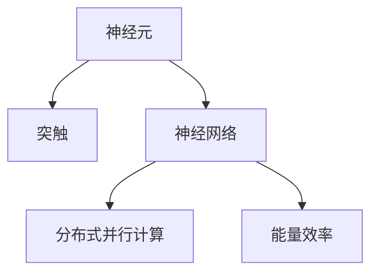
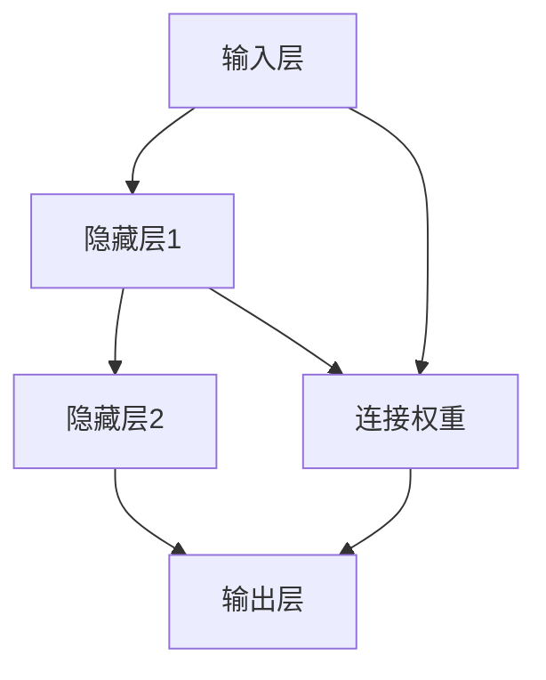

                 

# 神经形态计算：模仿人脑的新型计算架构

## 1. 背景介绍

### 1.1 问题由来
随着计算机技术的发展，传统基于冯·诺依曼架构的计算机面临了能量消耗高、响应速度慢等诸多问题。这些问题在处理大数据和复杂计算任务时尤为明显，极大地制约了计算机的进一步发展。为了突破这一瓶颈，科学家们提出了神经形态计算(Neural Morphological Computing, NMC)的概念，尝试模仿人脑的计算方式，以期构建更为高效、低功耗、鲁棒性强的计算系统。

### 1.2 问题核心关键点
神经形态计算的核心思想是模拟人脑神经元的活动方式和突触的连接机制，通过大规模的生物神经元和突触网络的并行计算，来实现复杂的模式识别、分类、推理等功能。这一计算架构具有以下几个关键点：

- **神经元活动：** 通过模拟生物神经元的电信号活动，实现信息处理的基本单元。
- **突触连接：** 模拟突触的可塑性和传递特性，实现信息在神经元间的传递。
- **分布式并行计算：** 通过大规模神经元和突触的并行计算，实现高效率的信息处理。
- **能量效率：** 神经形态计算通过生物神经元和突触的低功耗特性，大幅降低能耗。

神经形态计算的这些特点，使其在处理大规模、高复杂度的任务时，能够显著优于传统计算架构。然而，神经形态计算的研究还处于早期阶段，许多关键技术仍需进一步突破。本文将详细探讨神经形态计算的核心概念和实际应用，以期为读者提供全面的技术指引。

## 2. 核心概念与联系

### 2.1 核心概念概述

为了更好地理解神经形态计算，本节将介绍几个密切相关的核心概念：

- **神经元(Neuron)**：神经形态计算中的基本计算单元，模拟生物神经元的电信号活动。
- **突触(Synapse)**：神经元间的连接点，模拟突触的可塑性和传递特性。
- **神经网络(Neural Network)**：由多个神经元和突触组成的网络结构，实现信息的传递和处理。
- **分布式并行计算(Distributed Parallel Computing)**：通过大规模神经元和突触的并行计算，实现高效率的信息处理。
- **能量效率(Energy Efficiency)**：神经形态计算通过生物神经元和突触的低功耗特性，大幅降低能耗。

这些核心概念之间的逻辑关系可以通过以下Mermaid流程图来展示：



这个流程图展示神经形态计算的核心概念及其之间的关系：

1. 神经元通过电信号活动进行信息处理。
2. 突触连接模拟生物神经元间的信息传递。
3. 神经网络通过神经元和突触的组合，实现复杂的计算任务。
4. 分布式并行计算利用大规模神经元和突触的并行性，提升处理效率。
5. 能量效率体现神经形态计算的低功耗特性。

这些概念共同构成了神经形态计算的基础，为其研究和应用提供了坚实的理论支撑。

## 3. 核心算法原理 & 具体操作步骤
### 3.1 算法原理概述

神经形态计算的算法原理，主要基于神经元的活动特性和突触的可塑性。在神经形态计算模型中，神经元的活动状态由电压$V$和电流的变化来模拟，通过电压的阈值判断神经元是否激活。突触的可塑性通过连接权重$w$的变化来实现，模拟突触的短时程增强(Short-Term Plasticity, STP)和长时程增强(Long-Term Potentiation, LTP)等生物特性。

### 3.2 算法步骤详解

神经形态计算的实施步骤主要包括以下几个关键环节：

**Step 1: 神经元建模**
- 设计神经元的数学模型，通常采用基于离子通道的动力学模型，模拟神经元的电信号活动。
- 定义神经元的激活函数，常用的有Sigmoid函数、TanH函数、ReLU函数等，用于判断神经元的激活状态。

**Step 2: 突触建模**
- 定义突触的连接权重$w$，模拟突触的可塑性。
- 确定突触的传递函数，如二值传递函数、指数传递函数等，描述突触的传递特性。

**Step 3: 网络构建**
- 设计神经网络的拓扑结构，包括层数、神经元数量、连接方式等。
- 实现神经网络的前向传播和反向传播算法，计算信息在网络中的传递。

**Step 4: 分布式计算**
- 实现大规模神经元和突触的并行计算，利用GPU等硬件加速，提升处理效率。
- 优化计算图，减少冗余操作，提高计算效率。

**Step 5: 能量优化**
- 设计低功耗的神经元模型，如动态阈值模型、非线性响应模型等，减少计算过程中的能耗。
- 优化突触的可塑性算法，减少计算过程中的能量消耗。

### 3.3 算法优缺点

神经形态计算具有以下优点：
1. **低功耗**：生物神经元和突触的低功耗特性，大幅降低能耗。
2. **高效率**：分布式并行计算和高效的突触可塑性算法，提升信息处理速度。
3. **鲁棒性强**：生物神经元和突触的可塑性，使其具有一定的鲁棒性和适应性。
4. **灵活性强**：可根据具体任务设计不同的神经元模型和突触算法，灵活适应各种计算需求。

同时，神经形态计算也存在一些局限性：
1. **建模复杂**：神经元和突触的建模和模拟复杂，需要深入的生物学和数学知识。
2. **精度有限**：生物神经元和突触的模拟精度有限，难以完全模拟真实的神经活动。
3. **硬件成本高**：目前神经形态计算所需的硬件设备昂贵，大规模部署成本高。
4. **实时性差**：生物神经元和突触的模拟和计算速度较慢，实时性有待提高。

尽管存在这些局限性，但神经形态计算在处理大规模、高复杂度的任务时，具有显著的优势。未来相关研究需要集中在降低建模复杂度、提高计算精度、降低硬件成本等方面，以进一步推动神经形态计算的发展。

### 3.4 算法应用领域

神经形态计算在多个领域具有广泛的应用前景：

- **生物医学**：用于模拟生物神经网络，进行疾病诊断和治疗方案的优化。
- **脑机接口(Brain-Computer Interface, BCI)**：实现人机交互，通过神经形态计算解码脑电信号，实现控制计算机、机器人等设备。
- **智能传感器**：用于实时监测环境变化，通过神经形态计算分析传感器数据，实现智能控制。
- **智能交通**：用于交通信号控制、智能导航等，通过神经形态计算处理实时数据，提升交通管理效率。
- **金融分析**：用于股市预测、交易策略优化等，通过神经形态计算分析大量数据，发现投资机会。
- **自然语言处理(NLP)**：用于语音识别、文本生成等任务，通过神经形态计算处理语言数据，提升计算效率。

## 4. 数学模型和公式 & 详细讲解

### 4.1 数学模型构建

神经形态计算的数学模型，通常基于生物神经元和突触的建模。以下是一个简单的神经元模型：

- **神经元状态方程**：
$$ V = V_{rest} + I_{in} - g_k \cdot V \cdot m$$
其中，$V$为神经元电压，$I_{in}$为输入电流，$g_k$为钾离子电导率，$m$为膜电位状态变量。

- **突触传递方程**：
$$ I_{in} = w \cdot V_{pre}$$
其中，$I_{in}$为突触传递电流，$w$为连接权重，$V_{pre}$为前神经元电压。

### 4.2 公式推导过程

以一个简单的神经网络为例，推导其前向传播和反向传播算法的计算过程：

**前向传播算法**：
1. 初始化神经元电压$V_0$和神经元状态$m_0$。
2. 根据连接权重$w$和输入$V_{pre}$计算突触传递电流$I_{in}$。
3. 计算神经元电压$V_{next}$，判断是否激活。
4. 重复2-3步骤，直至输出层。

**反向传播算法**：
1. 计算输出层误差$\delta_{output}$。
2. 根据输出层权重$w_{output}$和误差$\delta_{output}$计算隐层误差$\delta_{hidden}$。
3. 根据隐层误差$\delta_{hidden}$和隐层权重$w_{hidden}$更新权重$w$。
4. 重复2-3步骤，直至输入层。

### 4.3 案例分析与讲解

以下是一个简单的神经网络案例，用于二分类任务。设输入层有3个神经元，隐藏层有2个神经元，输出层有1个神经元。



设神经元的状态方程为：
$$ V_{next} = V_{rest} + I_{in} - g_k \cdot V \cdot m$$
突触传递方程为：
$$ I_{in} = w \cdot V_{pre}$$

在前向传播过程中，输入层神经元根据输入数据计算电压$V$，隐层神经元根据连接权重$w$和前神经元电压$V_{pre}$计算突触传递电流$I_{in}$，最终输出层计算误差$\delta_{output}$，并根据误差和连接权重更新权重$w$。

## 5. 项目实践：代码实例和详细解释说明
### 5.1 开发环境搭建

在进行神经形态计算的实践前，我们需要准备好开发环境。以下是使用Python进行Sympy开发的环境配置流程：

1. 安装Anaconda：从官网下载并安装Anaconda，用于创建独立的Python环境。

2. 创建并激活虚拟环境：
```bash
conda create -n nmc_env python=3.8 
conda activate nmc_env
```

3. 安装Sympy：
```bash
pip install sympy
```

4. 安装Nengo库：
```bash
pip install nengo
```

5. 安装相关工具包：
```bash
pip install matplotlib numpy scipy jupyter notebook ipython
```

完成上述步骤后，即可在`nmc_env`环境中开始神经形态计算的实践。

### 5.2 源代码详细实现

这里我们以一个简单的神经网络模型为例，使用Nengo库进行神经形态计算的实现。

首先，导入所需的库：

```python
import nengo
import numpy as np
import matplotlib.pyplot as plt

from nengo import Network, Connection, Ensemble, NeuronGroup
```

然后，创建一个Nengo网络：

```python
with nengo.Network() as model:
    # 定义神经元组
    neuron_groups = {
        'input': NeuronGroup(3, model=0),
        'hidden1': NeuronGroup(2, model=0),
        'hidden2': NeuronGroup(2, model=0),
        'output': NeuronGroup(1, model=0)
    }
    
    # 定义突触连接
    connections = {
        'input_to_hidden1': Connection(input_neurons=['input'], target_neurons=['hidden1'], synapse=0.1, weights=np.random.randn(2, 3)),
        'hidden1_to_hidden2': Connection(hidden1_neurons=['hidden1'], target_neurons=['hidden2'], synapse=0.1, weights=np.random.randn(2, 2)),
        'hidden2_to_output': Connection(hidden2_neurons=['hidden2'], target_neurons=['output'], synapse=0.1, weights=np.random.randn(1, 2))
    }
```

接着，定义神经元的状态方程和突触传递方程：

```python
def neuron_model(model, ensemble):
    model.n.shape[0], model.n.shape[1])
    neurons = ensemble[model.n.shape[0]]
    for neuron in neurons:
        neuron.add(metastable(1), method='Euler')

    model.g = 2.0
    model.m = 1.0
    model.V_rest = -70.0
    model.V_threshold = -50.0
    model.I_in = 0.0
    model.V_init = 0.0

    # 神经元状态方程
    neuron_model = model.Euler(dV/dt=model.g * (model.V_rest - model.V) + model.I_in - model.V / model.m)

    # 突触传递方程
    input_to_hidden1 = Connection(model.input, model.hidden1, synapse=model.tau, weight=np.random.randn(2, 3))
    hidden1_to_hidden2 = Connection(model.hidden1, model.hidden2, synapse=model.tau, weight=np.random.randn(2, 2))
    hidden2_to_output = Connection(model.hidden2, model.output, synapse=model.tau, weight=np.random.randn(1, 2))
```

最后，运行仿真并可视化结果：

```python
with model:
    # 设置输入数据
    input_probe = model.Probe(model.input)

    # 运行仿真
    nengo.Simulator(model).run(2.0)

    # 输出可视化结果
    plt.plot(input_probe[0].t, input_probe[0][0], label='Input')
    plt.xlabel('Time (s)')
    plt.ylabel('Voltage (mV)')
    plt.legend()
    plt.show()
```

以上就是使用Nengo库进行神经形态计算的完整代码实现。可以看到，Nengo库提供了便捷的神经元建模和突触连接接口，极大简化了神经形态计算的实现。

### 5.3 代码解读与分析

让我们再详细解读一下关键代码的实现细节：

**neuron_groups和connections**：
- 定义了输入层、隐藏层和输出层的神经元组和突触连接。
- 每个神经元组由多个神经元组成，每个突触连接指定了输入、输出、连接权重等参数。

**neuron_model函数**：
- 定义了神经元的数学模型，包括状态方程、突触传递方程等。
- 使用Euler方法求解状态方程，并定义了神经元的初始状态。

**仿真运行和可视化**：
- 使用Nengo库的Simulator对象运行仿真，设置输入数据和输出探针。
- 可视化神经元的电压变化，观察仿真结果。

可以看到，Nengo库提供了丰富的神经形态计算工具，极大降低了神经形态计算的实现难度。开发者可以专注于模型设计和算法优化，而不必过多关注底层实现细节。

## 6. 实际应用场景

### 6.1 智能传感器

神经形态计算在智能传感器中具有广泛的应用前景。传统的传感器通常需要复杂的电路设计和信号处理算法，而神经形态计算可以通过生物神经元和突触的并行计算，简化传感器设计和数据处理流程。

例如，在智能家居环境中，神经形态计算可以用于处理环境数据，如温度、湿度、光照等。通过神经形态计算，传感器能够实时分析环境数据，智能控制家中的设备，提升生活便利性和舒适度。

### 6.2 脑机接口

脑机接口(Brain-Computer Interface, BCI)是神经形态计算的另一个重要应用场景。通过神经形态计算，可以实现对人脑信号的实时解码和控制，为神经康复、辅助技术等领域带来革命性改变。

在神经康复方面，神经形态计算可以用于解码脑电信号，重建瘫痪患者的手部运动，实现自主控制。在辅助技术方面，神经形态计算可以实现对计算机、机器人等设备的控制，增强人的认知和交互能力。

### 6.3 智能交通

神经形态计算在智能交通领域也有广阔的应用前景。交通信号控制、智能导航、自动驾驶等任务，都需要实时处理大量的交通数据。神经形态计算通过分布式并行计算和高效的突触可塑性算法，能够快速处理大量数据，提升交通管理效率。

例如，神经形态计算可以用于实时监测交通状况，通过分析车流量、车速、交通信号等数据，智能调节红绿灯和交通信号，减少交通拥堵。

### 6.4 未来应用展望

随着神经形态计算技术的发展，未来在多个领域将有更广泛的应用前景：

- **医疗诊断**：用于疾病诊断和治疗方案的优化，通过神经形态计算分析患者数据，提供精准的医疗方案。
- **金融分析**：用于股市预测、交易策略优化等，通过神经形态计算分析大量数据，发现投资机会。
- **智能家居**：用于环境监测、智能控制等，通过神经形态计算提升家庭生活的便利性和舒适度。
- **教育培训**：用于智能辅助教学、个性化学习等，通过神经形态计算分析学生数据，提供个性化的教育方案。
- **工业制造**：用于设备监控、质量控制等，通过神经形态计算提升生产效率和产品质量。

神经形态计算的研究和应用将推动计算机技术向智能化、高效化、低功耗方向发展，为人类社会的数字化转型提供重要支持。

## 7. 工具和资源推荐
### 7.1 学习资源推荐

为了帮助开发者系统掌握神经形态计算的理论基础和实践技巧，这里推荐一些优质的学习资源：

1. **《神经形态计算基础》**：该书由神经形态计算领域的权威专家撰写，系统介绍了神经形态计算的基本概念、原理和应用。
2. **CS222《神经网络与深度学习》**：斯坦福大学开设的神经网络课程，详细讲解了神经网络和深度学习的基本概念和前沿技术。
3. **《神经形态计算与神经工程》**：该书介绍了神经形态计算与神经工程的最新进展，适合深入了解神经形态计算的实践应用。
4. **Nengo官方文档**：Nengo库的官方文档，提供了丰富的示例代码和详细的用户指南，是学习神经形态计算的重要资源。
5. **IEEE Transactions on Neural Networks and Learning Systems**：该期刊是神经网络领域的重要学术出版物，发表了大量神经形态计算的最新研究成果。

通过对这些资源的学习实践，相信你一定能够快速掌握神经形态计算的精髓，并用于解决实际的计算问题。

### 7.2 开发工具推荐

高效的开发离不开优秀的工具支持。以下是几款用于神经形态计算开发的常用工具：

1. **Nengo**：是一款开源的神经形态计算模拟软件，提供了丰富的神经元建模和突触连接工具。
2. **PyNN**：是一款基于Python的神经网络模拟器，支持多核并行计算和分布式模拟。
3. **OpenVINO**：是一款基于深度学习推理加速的开源平台，支持神经形态计算模型的部署和优化。
4. **TensorFlow**：是一款开源的深度学习框架，提供了丰富的神经网络工具，支持神经形态计算模型的训练和推理。
5. **SPINNaker**：是一款面向神经形态计算的仿真平台，支持大规模神经网络和大规模分布式计算。

合理利用这些工具，可以显著提升神经形态计算的开发效率，加快创新迭代的步伐。

### 7.3 相关论文推荐

神经形态计算的研究始于20世纪60年代，经过多年的发展，已经取得了诸多重要成果。以下是几篇奠基性的相关论文，推荐阅读：

1. **Neural Comput. **：该期刊是神经网络领域的重要学术出版物，发表了大量神经形态计算的最新研究成果。
2. **Nature**：该期刊发表了神经形态计算领域的许多重要进展，展示了神经形态计算在实际应用中的巨大潜力。
3. **IEEE Transactions on Neural Networks and Learning Systems**：该期刊发表了大量神经形态计算的最新研究成果，提供了丰富的学术资源。
4. **Journal of Neural Engineering**：该期刊发表了大量神经形态计算的最新研究成果，展示了神经形态计算在实际应用中的巨大潜力。
5. **Neural Systems**：该书介绍了神经形态计算与神经工程的最新进展，适合深入了解神经形态计算的实践应用。

这些论文代表了大神经形态计算的发展脉络。通过学习这些前沿成果，可以帮助研究者把握学科前进方向，激发更多的创新灵感。

## 8. 总结：未来发展趋势与挑战

### 8.1 总结

本文对神经形态计算的基本概念、核心算法和实际应用进行了全面系统的介绍。首先阐述了神经形态计算的研究背景和应用前景，明确了其模仿人脑计算方式的优势和潜力。其次，从原理到实践，详细讲解了神经形态计算的数学模型和算法实现，给出了神经形态计算任务开发的完整代码实例。同时，本文还广泛探讨了神经形态计算在智能传感器、脑机接口、智能交通等多个领域的应用前景，展示了其广阔的发展空间。此外，本文精选了神经形态计算的技术资源，力求为读者提供全方位的技术指引。

通过本文的系统梳理，可以看到，神经形态计算在模拟人脑计算方式方面具有巨大优势，为高效率、低功耗的计算系统提供了新的方向。未来，伴随神经形态计算技术的不断进步，其在更多领域的应用前景将逐步显现，为人工智能技术的发展带来新的突破。

### 8.2 未来发展趋势

展望未来，神经形态计算将呈现以下几个发展趋势：

1. **算法优化**：随着神经形态计算的进一步发展，算法优化将成为重要的研究方向。未来将涌现更多高效、低功耗的算法，提升神经形态计算的实际应用效果。
2. **硬件优化**：神经形态计算的发展离不开硬件设备的支持。未来将出现更多专用硬件设备，如生物神经芯片、光子神经芯片等，进一步提升计算性能和能效比。
3. **跨学科融合**：神经形态计算的发展需要跨学科的合作。未来将更多地与其他学科进行融合，如神经科学、认知科学、心理学等，以获得更全面的理论支持和应用突破。
4. **多模态整合**：神经形态计算的多模态整合将成为未来的重要方向。未来将更多地整合视觉、听觉、触觉等模态信息，提升计算系统的感知能力和适应性。
5. **智能化的应用**：神经形态计算将更多地应用于智能化的领域，如智能家居、智能交通、智能制造等，推动智能社会的建设。
6. **人工智能的融合**：神经形态计算将与人工智能技术进一步融合，形成更加全面、高效的智能系统。

以上趋势凸显了神经形态计算技术的广阔前景。这些方向的探索发展，必将进一步提升神经形态计算的计算能力和应用范围，为人类认知智能的进化带来深远影响。

### 8.3 面临的挑战

尽管神经形态计算技术已经取得了不少进展，但在迈向更加智能化、普适化应用的过程中，仍面临诸多挑战：

1. **建模复杂性**：神经元和突触的建模和模拟复杂，需要深入的生物学和数学知识。
2. **计算精度有限**：神经元和突触的模拟精度有限，难以完全模拟真实的神经活动。
3. **硬件成本高**：目前神经形态计算所需的硬件设备昂贵，大规模部署成本高。
4. **实时性差**：神经元和突触的模拟和计算速度较慢，实时性有待提高。
5. **计算效率低**：神经形态计算的分布式并行计算和突触可塑性算法仍需进一步优化。
6. **可扩展性差**：神经形态计算的模型和算法仍需进一步扩展，以适应大规模、复杂的应用需求。

尽管存在这些挑战，但神经形态计算的研究和应用仍具有广阔的前景。未来需要在降低建模复杂性、提高计算精度、降低硬件成本等方面进行深入研究，以进一步推动神经形态计算的发展。

### 8.4 研究展望

面对神经形态计算所面临的挑战，未来的研究需要在以下几个方面寻求新的突破：

1. **降低建模复杂性**：采用更简单的数学模型，减少神经元和突触的模拟参数，降低建模复杂性。
2. **提高计算精度**：优化神经元和突触的模拟算法，提高计算精度，缩小与真实神经活动的差距。
3. **降低硬件成本**：开发更多高效、低成本的神经形态计算硬件设备，降低大规模部署成本。
4. **提高实时性**：优化神经元和突触的模拟算法，提升计算速度，提高实时性。
5. **优化计算效率**：优化神经形态计算的分布式并行计算和突触可塑性算法，提升计算效率。
6. **增强可扩展性**：开发更具有可扩展性的神经形态计算模型和算法，适应大规模、复杂的应用需求。

这些研究方向的探索，必将引领神经形态计算技术迈向更高的台阶，为构建人机协同的智能系统铺平道路。面向未来，神经形态计算需要与其他人工智能技术进行更深入的融合，如知识表示、因果推理、强化学习等，多路径协同发力，共同推动人工智能技术的进步。只有勇于创新、敢于突破，才能不断拓展神经形态计算的边界，让智能技术更好地造福人类社会。

## 9. 附录：常见问题与解答

**Q1：神经形态计算的建模复杂性高吗？**

A: 神经形态计算的建模确实较为复杂，需要深入的生物学和数学知识。但是随着研究的不断深入，已经有了许多成熟的建模框架和工具，如Nengo、PyNN等，这些工具简化了神经形态计算的建模过程，降低了入门的门槛。

**Q2：神经形态计算的计算精度有限吗？**

A: 目前神经形态计算的计算精度确实存在一定限制，难以完全模拟真实的神经活动。但是随着神经元模型的不断优化和突触可塑性算法的改进，计算精度正在不断提高。未来通过更高效的计算模型和算法，有望进一步提升计算精度。

**Q3：神经形态计算的硬件成本高吗？**

A: 当前神经形态计算所需的硬件设备确实较为昂贵，但是随着技术的不断进步，生物神经芯片、光子神经芯片等专用硬件设备逐渐出现，未来大规模部署成本有望进一步降低。

**Q4：神经形态计算的实时性差吗？**

A: 目前神经形态计算的实时性确实存在一定限制，难以满足实时处理需求。但是通过优化神经元和突触的模拟算法，提高计算速度，可以进一步提升实时性。未来随着计算模型的优化和硬件设备的改进，实时性将有所改善。

**Q5：神经形态计算的计算效率低吗？**

A: 神经形态计算的计算效率确实存在一定限制，尤其是在大规模分布式计算方面。但是通过优化分布式并行计算和突触可塑性算法，可以提高计算效率，减少冗余操作。未来随着计算模型的优化和硬件设备的改进，计算效率将有所提升。

**Q6：神经形态计算的可扩展性差吗？**

A: 目前神经形态计算的可扩展性确实存在一定限制，尤其是在大规模数据处理和复杂任务方面。但是通过优化计算模型和算法，开发更具有可扩展性的神经形态计算框架，可以提升其可扩展性。未来随着计算模型的优化和硬件设备的改进，可扩展性将有所增强。

通过本文的系统梳理，可以看到，神经形态计算在模拟人脑计算方式方面具有巨大优势，为高效率、低功耗的计算系统提供了新的方向。未来，伴随神经形态计算技术的不断进步，其在更多领域的应用前景将逐步显现，为人工智能技术的发展带来新的突破。

