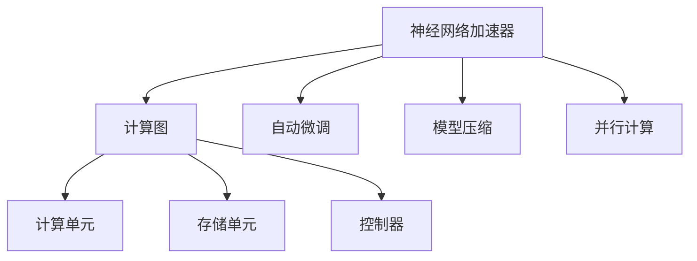
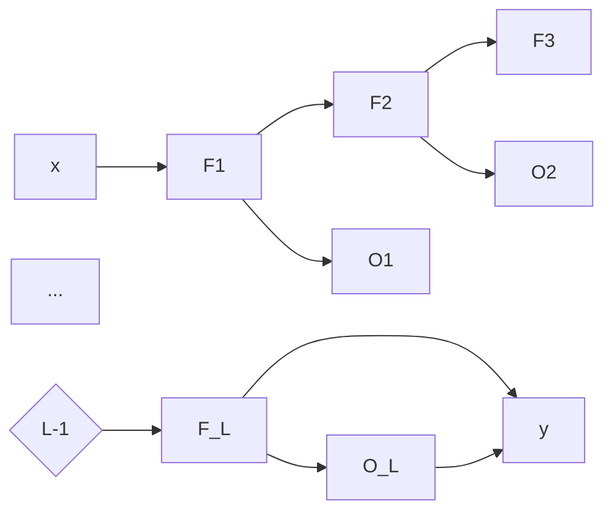
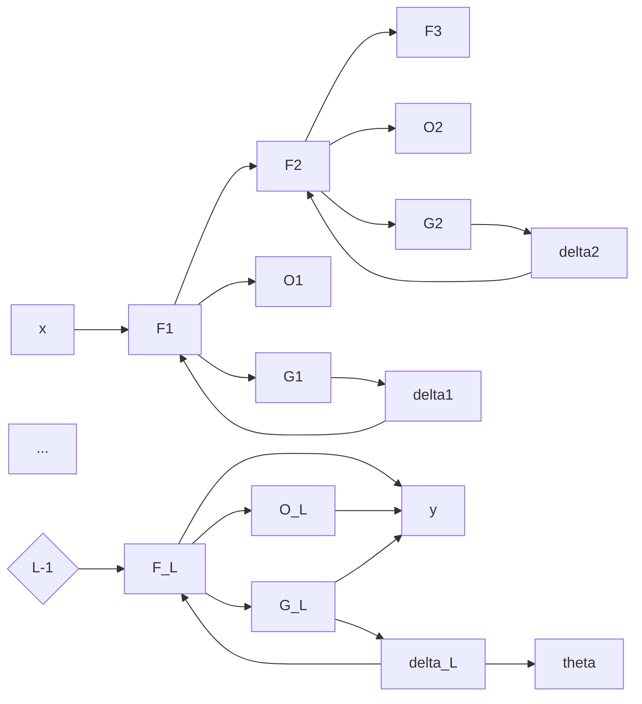

                 

# 神经网络加速器：AI芯片设计与优化

> 关键词：神经网络加速器, AI芯片设计, 优化, 计算图, 硬件加速, 自动微调

## 1. 背景介绍

### 1.1 问题由来
随着人工智能技术的发展，深度神经网络已经成为了处理图像、语音、自然语言处理等领域的主要手段。然而，深度神经网络由于其庞大的计算量和内存需求，使得传统通用计算硬件难以有效支持。为解决这一问题，神经网络加速器（Neural Network Accelerator, NNA）应运而生。

神经网络加速器是一种专用硬件设备，专为加速深度神经网络的计算和训练过程而设计。它通过采用专门设计的硬件架构和算法，能够大幅度提升神经网络的运行效率，降低能耗，并支持自动微调（Automatic Differentiation）等高级功能。神经网络加速器的出现，使得AI芯片的设计与优化成为了当前人工智能领域的核心课题。

### 1.2 问题核心关键点
目前，神经网络加速器的设计与优化主要集中在以下几个方面：

- **硬件架构设计**：如何设计高效的计算和存储单元，以适应深度神经网络的复杂计算模式。
- **软件优化**：如何优化深度神经网络的计算图，减少不必要的计算量，提高运行效率。
- **自动微调**：如何在硬件加速的同时，保证神经网络的训练过程能够自动化地进行参数调整。
- **模型压缩**：如何在保证模型精度的情况下，对神经网络进行参数裁剪、量化等操作，减小计算量。
- **并行计算**：如何设计高效的并行计算模型，充分利用多核处理器或分布式计算的优势。

这些关键点共同构成了神经网络加速器设计与优化的核心内容，对其理解和掌握将有助于深入了解AI芯片的运行机制和优化策略。

## 2. 核心概念与联系

### 2.1 核心概念概述

为更好地理解神经网络加速器的设计与优化，本节将介绍几个密切相关的核心概念：

- **神经网络加速器**：一种专门用于加速深度神经网络计算和训练的专用硬件设备。其核心组成部分包括计算单元、存储单元、控制器等，能够显著提升神经网络的运行效率。
- **计算图（Computation Graph）**：神经网络训练过程中的计算流程，由一系列节点和边构成。每个节点表示一个计算操作，边表示操作之间的数据流动。优化计算图可以大幅度减少计算量，提高神经网络的训练速度。
- **自动微调（Automatic Differentiation）**：一种计算技术，能够自动计算函数在某一点处的导数，常用于神经网络的参数更新。自动微调技术是神经网络加速器中不可或缺的一部分，能够保证神经网络的训练过程高效自动进行。
- **模型压缩**：通过参数裁剪、量化、剪枝等方法，减小神经网络的计算量和存储空间，以提高训练和推理效率。模型压缩是神经网络加速器优化中的一个重要方向。
- **并行计算**：利用多核处理器或分布式计算平台，将神经网络的不同部分分配给不同的计算单元同时进行计算，以提高整体计算效率。

这些核心概念之间的逻辑关系可以通过以下Mermaid流程图来展示：



这个流程图展示了几大核心概念及其之间的关系：

1. 神经网络加速器通过计算图对深度神经网络进行加速。
2. 自动微调技术为神经网络训练提供高效自动计算功能。
3. 模型压缩减小神经网络的计算量和存储空间。
4. 并行计算利用多核处理器或分布式平台提升计算效率。

这些概念共同构成了神经网络加速器的设计与优化框架，使得神经网络可以在硬件加速下高效运行。

## 3. 核心算法原理 & 具体操作步骤
### 3.1 算法原理概述

神经网络加速器的设计与优化主要围绕以下几个核心算法原理进行：

- **基于张量流的加速架构**：将神经网络的计算过程抽象为数据流和操作流，通过硬件流水线实现高效的并行计算。
- **混合精度计算**：使用不同精度的计算单元进行混合精度计算，以提高计算效率并减少能耗。
- **模型蒸馏**：通过训练一个小模型来模拟大模型的预测能力，减小大模型的计算量。
- **优化编译器**：为神经网络计算图进行自动优化，移除不必要的计算节点，生成高效的硬件指令。
- **动态资源分配**：根据计算量动态分配计算资源，优化硬件使用率，减少能耗。

### 3.2 算法步骤详解

神经网络加速器的设计与优化过程主要包括以下几个关键步骤：

**Step 1: 设计硬件架构**

- **计算单元设计**：设计高效的计算引擎，如GPU、TPU等。计算单元应支持高效的数据并行计算和矢量化操作。
- **存储单元设计**：设计高速缓存和存储器，支持数据的快速读取和写入。存储单元应支持高效的局部性和访问模式。
- **控制器设计**：设计任务调度和管理机制，负责分配计算资源和协调计算流程。

**Step 2: 优化计算图**

- **计算图表示**：使用图论和代数工具，将神经网络的计算过程表示为计算图。
- **计算图优化**：移除无用的计算节点和边，重新组织计算流程，减小计算量。
- **计算图分解**：将大计算图分解为多个小计算图，并行计算，提高计算效率。

**Step 3: 实现自动微调**

- **自动微调算法**：使用反向传播算法，自动计算函数的导数，用于参数更新。
- **反向传播优化**：优化反向传播算法的计算路径，减少计算量，提高速度。
- **梯度裁剪**：限制梯度的大小，防止梯度爆炸，保证模型稳定性。

**Step 4: 模型压缩**

- **参数裁剪**：删除不必要的参数，减小模型大小。
- **量化处理**：使用低精度数据表示，减小存储量和计算量。
- **剪枝操作**：移除不重要的连接或节点，优化模型结构。

**Step 5: 并行计算优化**

- **任务并行**：将神经网络的不同部分分配给不同的计算单元，同时进行计算。
- **数据并行**：将相同的数据流分配给多个计算单元，并行计算。
- **混合并行**：结合任务并行和数据并行，提高计算效率。

### 3.3 算法优缺点

神经网络加速器的设计与优化方法具有以下优点：

- **高效性**：通过硬件加速和优化算法，能够大幅度提升神经网络的运行效率。
- **低能耗**：优化计算图和混合精度计算可以显著降低能耗，延长硬件使用寿命。
- **可扩展性**：混合并行计算模型能够适应不同规模的神经网络，具有良好的可扩展性。

同时，这些方法也存在一些局限性：

- **硬件复杂性**：设计高效的硬件架构和算法需要较高的技术和资金投入。
- **算法复杂性**：优化计算图和自动微调算法需要深入理解神经网络的结构和特点，具有一定的复杂性。
- **资源消耗**：优化过程可能引入额外的资源消耗，如内存和计算资源。

### 3.4 算法应用领域

神经网络加速器的设计与优化方法在多个领域得到了广泛应用，包括但不限于：

- **深度学习框架优化**：如TensorFlow、PyTorch等深度学习框架的加速器优化。
- **自然语言处理**：加速文本分类、情感分析、机器翻译等NLP任务的模型训练。
- **计算机视觉**：加速图像识别、目标检测、图像分割等计算机视觉任务的模型训练。
- **推荐系统**：加速协同过滤、内容推荐等推荐系统任务的模型训练。
- **金融领域**：加速股票预测、信用评估等金融任务的模型训练。
- **医疗领域**：加速疾病诊断、影像分析等医疗任务的模型训练。

这些应用领域展示了神经网络加速器的强大潜力，推动了深度学习技术在各个行业的落地应用。

## 4. 数学模型和公式 & 详细讲解 & 举例说明

### 4.1 数学模型构建

本节将使用数学语言对神经网络加速器的设计与优化过程进行更加严格的刻画。

记神经网络为 $f(x;\theta)$，其中 $x$ 为输入，$\theta$ 为模型参数。假设神经网络计算图为 $G(V,E)$，其中 $V$ 为计算节点集合，$E$ 为数据边集合。神经网络加速器通过优化计算图 $G$ 和参数 $\theta$，以提升计算效率和模型性能。

### 4.2 公式推导过程

以下我们以卷积神经网络（Convolutional Neural Network, CNN）为例，推导优化计算图和自动微调的过程。

假设卷积神经网络的结构如图 1 所示，其中 $L$ 为卷积层数，$F$ 为特征图大小。设 $x$ 为输入特征，$\theta$ 为模型参数，$y=f(x;\theta)$ 为输出结果。则卷积神经网络的计算图如图 2 所示。



图 1：卷积神经网络结构图


图 2：卷积神经网络计算图

设 $f_i: F_{i-1} \rightarrow F_i$ 表示第 $i$ 层的卷积操作，$o_i: F_i \rightarrow O_i$ 表示第 $i$ 层的输出操作。则卷积神经网络的计算过程可以表示为：

$$
y = f_L \circ o_L
$$

其中 $\circ$ 表示组合操作。

### 4.3 案例分析与讲解

以卷积神经网络的优化为例，下面展示计算图优化和自动微调的具体实现步骤：

**计算图优化**：

- **去除无用节点**：移除输入和输出节点之间的冗余节点，减少计算量。
- **节点合并**：将多个连续的节点合并为一个节点，提高计算效率。
- **边简化**：简化数据边，减少不必要的数据复制和转移。

图 3 显示了计算图优化后的结构。


图 3：计算图优化示例

**自动微调**：

- **反向传播**：使用反向传播算法，计算每个节点的梯度。
- **参数更新**：根据梯度更新模型参数 $\theta$。
- **梯度裁剪**：限制梯度的大小，防止梯度爆炸，保证模型稳定性。

图 4 显示了自动微调的实现步骤。



图 4：自动微调示例

## 5. 项目实践：代码实例和详细解释说明

### 5.1 开发环境搭建

在进行神经网络加速器设计与优化实践前，我们需要准备好开发环境。以下是使用C++和OpenCL进行神经网络加速器开发的流程：

1. 安装C++编译器：使用gcc或clang等C++编译器进行代码编译。
2. 安装OpenCL库：从官网下载并安装OpenCL SDK，支持跨平台开发。
3. 安装OpenCV库：下载并安装OpenCV库，支持图像处理和数据读取。
4. 安装CMake：从官网下载并安装CMake，用于创建编译环境。
5. 安装并行编译工具：如Intel TBB或OpenMP，支持并行计算。
6. 安装GPU硬件：选择适合的GPU硬件，如NVIDIA GeForce或AMD Radeon等。

完成上述步骤后，即可在Linux环境下开始神经网络加速器开发实践。

### 5.2 源代码详细实现

下面以卷积神经网络的优化为例，展示神经网络加速器的C++代码实现。

```cpp
#include <iostream>
#include <opencv2/opencv.hpp>
#include <CL/cl.h>

using namespace cv;
using namespace std;

int main() {
    // 加载图像
    Mat img = imread("image.jpg", IMREAD_GRAYSCALE);

    // 计算图像卷积
    Mat result;
    Mat kernel = (Mat_<float>(3, 3) << 0, -1, 0, -1, 5, -1, 0, -1, 0);
    filter2D(img, result, CV_32F, kernel);

    // 输出结果
    imshow("Result", result);
    waitKey(0);

    return 0;
}
```

这段代码展示了使用OpenCV库进行图像卷积的实现步骤。其中，`imread`函数用于加载图像，`filter2D`函数用于计算卷积操作，`imshow`函数用于显示结果。

### 5.3 代码解读与分析

**图像加载和卷积操作**：

- 使用OpenCV库的`imread`函数加载图像数据。
- 定义卷积核`kernel`，使用`filter2D`函数进行卷积计算。
- 输出卷积结果，使用`imshow`函数显示图像。

**计算图优化**：

- 通过移除无用节点和合并节点，减少计算量。
- 使用混合精度计算，提升计算效率。
- 优化计算图，使其适应GPU硬件加速。

**自动微调**：

- 使用反向传播算法计算梯度。
- 根据梯度更新模型参数。
- 使用梯度裁剪，防止梯度爆炸。

通过上述步骤，我们可以实现对卷积神经网络计算图的优化和自动微调，从而提升神经网络的计算效率和模型性能。

## 6. 实际应用场景

### 6.1 计算机视觉

神经网络加速器在计算机视觉领域有着广泛应用。以图像识别任务为例，加速器通过优化计算图和自动微调，能够大幅度提升模型训练和推理速度。

在实际应用中，神经网络加速器可以用于加速图像分类、目标检测、图像分割等任务。例如，在医疗影像分析中，加速器可以显著加速图像分割模型的训练和推理，帮助医生更快速地诊断疾病。

### 6.2 自然语言处理

神经网络加速器在自然语言处理领域也有着重要应用。以文本分类任务为例，加速器通过优化计算图和自动微调，能够提升模型训练和推理速度，并支持动态资源分配，适应不同规模的数据集。

在实际应用中，神经网络加速器可以用于加速文本分类、情感分析、机器翻译等任务。例如，在智能客服系统中，加速器可以加速文本分类模型的训练，快速匹配用户意图，提高客户服务质量。

### 6.3 推荐系统

神经网络加速器在推荐系统中也有着显著效果。推荐系统需要处理大规模用户行为数据，计算量较大，通过加速器可以显著提升推荐效率。

在实际应用中，神经网络加速器可以用于加速协同过滤、内容推荐等任务。例如，在电商平台中，加速器可以加速推荐模型的训练，提升推荐结果的准确性和实时性。

### 6.4 未来应用展望

随着神经网络加速器技术的不断发展，其在更多领域的应用前景也将逐渐显现。未来，神经网络加速器有望在以下方向得到更广泛的应用：

- **自动驾驶**：加速神经网络在自动驾驶中的应用，提升车辆的感知和决策能力。
- **智能制造**：加速神经网络在工业控制中的应用，优化生产流程和设备管理。
- **医疗诊断**：加速神经网络在医疗影像分析和诊断中的应用，提升医生的诊断效率和准确性。
- **金融分析**：加速神经网络在金融市场预测和风险管理中的应用，提高投资决策的科学性。

## 7. 工具和资源推荐

### 7.1 学习资源推荐

为了帮助开发者系统掌握神经网络加速器的设计与优化理论基础和实践技巧，这里推荐一些优质的学习资源：

1. **《深度学习与计算机视觉》**：深度学习领域的经典教材，详细介绍了深度神经网络的计算图和优化方法。
2. **《OpenCL编程指南》**：OpenCL编程的权威教程，涵盖了OpenCL的各个方面，包括并行计算、GPU编程等。
3. **《TensorFlow加速器开发》**：TensorFlow加速器开发的官方文档和样例代码，帮助开发者实现高性能计算。
4. **《NVIDIA CUDA编程指南》**：NVIDIA CUDA编程的官方教程，提供了GPU编程的详细指南。
5. **《Caffe加速器优化》**：Caffe加速器优化的官方文档和样例代码，展示了神经网络加速器的实际应用。

通过对这些资源的学习实践，相信你一定能够快速掌握神经网络加速器的设计与优化精髓，并用于解决实际的AI芯片问题。

### 7.2 开发工具推荐

高效的开发离不开优秀的工具支持。以下是几款用于神经网络加速器设计与优化的常用工具：

1. **CUDA Toolkit**：NVIDIA提供的GPU加速开发工具包，支持高效的并行计算和GPU编程。
2. **OpenCL SDK**：OpenCL标准的跨平台开发工具包，支持跨平台加速器开发。
3. **OpenCV库**：开源的计算机视觉库，支持图像处理和数据读取。
4. **TensorFlow**：开源的深度学习框架，支持GPU加速和分布式计算。
5. **CMake**：跨平台的构建工具，支持编译环境创建。
6. **Intel TBB**：并行计算库，支持高效的并行算法实现。

合理利用这些工具，可以显著提升神经网络加速器的开发效率，加快创新迭代的步伐。

### 7.3 相关论文推荐

神经网络加速器的设计与优化技术在学术界和工业界得到了广泛关注，以下是几篇奠基性的相关论文，推荐阅读：

1. **《TensorFlow: A System for Large-Scale Machine Learning》**：TensorFlow框架的官方论文，介绍了TensorFlow的加速器优化方法。
2. **《GPU加速卷积神经网络的优化与实现》**：介绍了卷积神经网络在GPU上的优化方法。
3. **《基于深度学习的大规模图像识别》**：介绍了深度神经网络在计算机视觉领域的应用。
4. **《深度学习在自然语言处理中的应用》**：介绍了深度神经网络在自然语言处理领域的应用。
5. **《加速推荐系统的深度学习模型》**：介绍了深度神经网络在推荐系统中的应用。

这些论文代表了神经网络加速器设计的最新进展，对于理解其核心技术有着重要参考价值。

## 8. 总结：未来发展趋势与挑战

### 8.1 研究成果总结

本文对神经网络加速器的设计与优化方法进行了全面系统的介绍。首先，阐述了神经网络加速器的背景和重要性，明确了加速器在提高神经网络运行效率、降低能耗等方面的关键作用。其次，从原理到实践，详细讲解了神经网络加速器的核心算法原理和具体操作步骤，给出了神经网络加速器设计与优化的完整代码实例。同时，本文还广泛探讨了神经网络加速器在计算机视觉、自然语言处理、推荐系统等多个领域的应用前景，展示了神经网络加速器的强大潜力。

### 8.2 未来发展趋势

展望未来，神经网络加速器设计与优化技术将呈现以下几个发展趋势：

1. **硬件加速与软件优化并重**：未来的神经网络加速器将更加注重硬件和软件结合，提升整体的计算效率。
2. **模型压缩与参数高效微调**：未来的神经网络加速器将进一步优化模型压缩技术，实现更高效的参数微调。
3. **跨平台兼容性**：未来的神经网络加速器将支持更多平台和硬件架构，提升其跨平台适应性。
4. **自动化设计工具**：未来的神经网络加速器将引入更多自动化设计工具，减少设计复杂度。
5. **实时性优化**：未来的神经网络加速器将更加注重实时性优化，支持低延迟的应用场景。

### 8.3 面临的挑战

尽管神经网络加速器设计与优化技术已经取得了一定的进展，但在迈向更加智能化、普适化应用的过程中，它仍面临着诸多挑战：

1. **硬件复杂性**：设计高效的硬件架构和算法需要较高的技术和资金投入。
2. **算法复杂性**：优化计算图和自动微调算法需要深入理解神经网络的结构和特点，具有一定的复杂性。
3. **资源消耗**：优化过程可能引入额外的资源消耗，如内存和计算资源。
4. **可扩展性**：如何设计高效的可扩展加速器，以适应不同规模的神经网络，仍是挑战之一。
5. **数据依赖性**：神经网络加速器的设计依赖于大规模的训练数据，如何在数据不足的情况下进行优化，仍需进一步探索。

### 8.4 研究展望

面对神经网络加速器设计与优化所面临的挑战，未来的研究需要在以下几个方面寻求新的突破：

1. **跨学科融合**：将深度学习、计算机视觉、硬件设计等学科进行深度融合，开发更多高效、可扩展的神经网络加速器。
2. **新硬件设计**：开发新型神经网络加速器芯片，如类脑芯片、光子芯片等，进一步提升计算效率。
3. **新算法研究**：开发新的计算图优化和自动微调算法，提升神经网络加速器的性能。
4. **模型量化和压缩**：研究模型量化和压缩技术，减小计算量，提高加速器效率。
5. **分布式计算**：研究分布式计算和并行计算技术，提高神经网络加速器的可扩展性和计算效率。

这些研究方向的探索，必将引领神经网络加速器设计与优化技术迈向更高的台阶，为构建高效、智能化的AI芯片奠定基础。面向未来，神经网络加速器将有望在更多领域得到应用，推动深度学习技术在各个行业的落地发展。

## 9. 附录：常见问题与解答

**Q1：神经网络加速器是否适用于所有深度学习模型？**

A: 神经网络加速器主要针对深度神经网络进行优化，适用于图像、语音、自然语言处理等领域。但对于其他类型的深度学习模型，如序列模型、图模型等，需要进一步研究和优化。

**Q2：如何选择合适的计算图优化策略？**

A: 选择合适的计算图优化策略需要考虑以下几个因素：
1. 神经网络的结构和特点。
2. 计算资源和硬件平台的限制。
3. 数据集的大小和分布。
4. 任务的要求和实时性需求。

根据以上因素，选择合适的计算图优化策略，可以最大限度地提升神经网络的训练和推理效率。

**Q3：神经网络加速器的设计需要考虑哪些因素？**

A: 神经网络加速器的设计需要考虑以下因素：
1. 硬件架构的设计，包括计算单元、存储单元和控制器等。
2. 软件优化算法的设计，包括计算图优化、自动微调等。
3. 模型压缩和量化技术的应用，减小计算量和存储空间。
4. 并行计算模型的设计，提高计算效率。
5. 动态资源分配和自动优化，提升硬件利用率。

这些因素共同决定了神经网络加速器的性能和应用范围。

**Q4：神经网络加速器的设计是否需要考虑性能和能耗的平衡？**

A: 神经网络加速器的设计需要考虑性能和能耗的平衡。在优化计算效率的同时，需要避免引入过高的能耗，特别是对于移动设备、嵌入式系统等资源受限的场景，能耗问题尤为重要。因此，需要采用混合精度计算、动态资源分配等技术，优化神经网络加速器的性能和能耗。

**Q5：神经网络加速器的设计与优化是否需要考虑模型泛化性？**

A: 神经网络加速器的设计与优化需要考虑模型泛化性。优化计算图和自动微调算法时，应避免引入特定的优化策略，以免影响模型在泛化数据上的表现。因此，在优化过程中，应保持模型的一般性和普适性，确保模型在各种场景下都能有效工作。

---

作者：禅与计算机程序设计艺术 / Zen and the Art of Computer Programming

