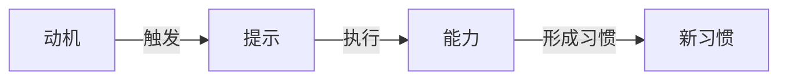

                 

# 福格行为模型:养成好习惯的指南

> 关键词：行为心理学,行为改变,习惯形成,目标实现,自我效能感

## 1. 背景介绍

### 1.1 问题由来

在数字化快速发展的今天，人们的生活节奏日益加快，对于效率和时间管理的要求愈发严苛。然而，人们在实际生活中却经常遇到难以坚持良好习惯，工作效率低下，无法实现既定目标的情况。究竟是什么原因导致了这些问题的发生？我们该如何科学地养成好习惯，实现目标？

心理学研究表明，很多行为问题都源于行为科学的“行为模型”。福格行为模型（Fogg's Model of Behavior Change）正是针对行为改变和习惯养成提出的一个系统化理论框架，旨在帮助人们理解行为背后的心理机制，提供切实可行的解决方案。

本文将详细阐述福格行为模型的工作原理，提供具体的操作步骤，并结合实际案例分析该模型的应用场景。此外，本文还将探讨如何通过代码实现行为模型，以及在实际项目中如何利用该模型提升工作效率和目标实现。

## 2. 核心概念与联系

### 2.1 核心概念概述

福格行为模型（Fogg's Model of Behavior Change）是斯坦福大学教授B.J. Fogg提出的一个用于解释和预测行为的心理模型。该模型将行为的形成分解为三个核心要素：动机（Motivation）、能力（Ability）、提示（Prompts）。这三个要素相互独立，通过特定的组合可以驱动人们执行特定行为，进而形成习惯。

- **动机（Motivation）**：指一个人想要执行某个行为的欲望。它可以是内在的（如自我提升的愿望），也可以是外在的（如外部的奖励或惩罚）。动机越强烈，行为越有可能被执行。

- **能力（Ability）**：指一个人执行某个行为所需要具备的技能、资源和时间。行为执行的越简单、越容易，则越容易达成。

- **提示（Prompts）**：指能够引起行为发生的刺激。提示可以是外部的（如手机提示音），也可以是内部的（如饥饿感）。提示越明显、越即时，行为越容易被触发。

这三个要素通过交互作用，共同决定了行为的发生。如果动机足够强，能力足够高，且存在合适的提示，则行为更有可能发生。

### 2.2 核心概念原理和架构的 Mermaid 流程图



该流程图展示了动机、能力和提示三者之间的交互关系：动机触发行为，而提示和能力则决定了行为能否顺利执行。当动机、能力和提示三者协调一致时，行为更容易发生，最终形成习惯。

## 3. 核心算法原理 & 具体操作步骤

### 3.1 算法原理概述

福格行为模型并不涉及复杂的数学计算或算法操作，而是一种基于心理学原理的行为分析工具。通过深入理解行为背后的心理机制，人们可以更加科学地设计和引导行为，从而形成和改变习惯。

### 3.2 算法步骤详解

1. **识别动机（Motivation）**：
    - 分析自身的内在需求和外在驱动因素，确定想要执行的行为或改变的目标。
    - 使用SMART原则（Specific, Measurable, Achievable, Relevant, Time-bound）明确目标的详细定义，以便更好地衡量和评估进展。

2. **评估能力（Ability）**：
    - 分析执行目标所需的技能、资源和时间，确定自己是否具备执行该行为的能力。
    - 如果能力不足，可以采取分步骤逐步提升的方式，从简单的子任务开始，逐步积累经验。

3. **设计提示（Prompts）**：
    - 设计能够引起行为发生的提示，确保提示足够即时和明显，以便在适当时刻触发行为。
    - 考虑使用多种提示方式，如手机提醒、视觉提示、外部奖励等，增加行为执行的可能性。

### 3.3 算法优缺点

**优点**：
- 系统化、实用性强。福格行为模型提供了一个科学、系统的方法来分析和解决行为问题。
- 易于理解和应用。模型简单明了，任何人都能够理解和操作。

**缺点**：
- 不涉及具体的心理治疗或干预措施。模型更适用于行为问题的预防和早期干预，而对已经形成的行为习惯改变效果有限。
- 需要花费时间进行深入分析。评估动机、能力和提示的过程较为复杂，需要一定的心理分析和计划制定能力。

### 3.4 算法应用领域

福格行为模型不仅适用于个人行为改变和习惯养成，还可应用于企业组织管理和行为设计中，如员工行为引导、客户行为激励等。此外，该模型还被广泛应用于健康、教育、市场营销等领域，帮助人们实现自我提升和目标达成。

## 4. 数学模型和公式 & 详细讲解 & 举例说明

### 4.1 数学模型构建

福格行为模型主要关注行为的心理机制和触发条件，并不涉及具体的数学计算。然而，为了更好地解释和分析行为模型，本文将通过一些具体的案例，展示如何通过数学公式表达行为模型。

设一个行为由动机（$M$）、能力和提示（$P$）三个因素共同决定，则行为的执行概率（$P$）可以用如下公式表达：

$$
P = f(M, P, A)
$$

其中 $f$ 为动机、提示和能力的函数，表示这些因素如何综合影响行为的发生概率。

### 4.2 公式推导过程

在公式 $P = f(M, P, A)$ 中，$f$ 函数的具体形式取决于具体的行为和情境。例如，对于健康饮食这个行为，动机可能包括对健康的追求，提示可能包括饭前的提示卡片，能力可能包括家庭中的食材储备。这些因素综合起来，决定了健康饮食行为的发生概率。

我们可以将动机和能力分别视为概率值，即 $0 \leq M, A \leq 1$。对于提示，由于其影响较大，通常用 $-1$ 到 $+1$ 的连续值来表示，即 $-1 \leq P \leq 1$。则行为发生的概率可以用以下公式表示：

$$
P = \frac{M \cdot P \cdot A}{1 - e^{-(M \cdot P \cdot A)}}
$$

该公式通过指数函数将动机、能力和提示三者的综合影响转换为一个具体的概率值。当动机、能力和提示均达到1时，行为发生的概率为1；当动机、能力和提示均达到0时，行为发生的概率为0。

### 4.3 案例分析与讲解

假设小明希望每天喝八杯水，即每天喝水行为的概率 $P$ 可以通过以下步骤计算：

1. **动机（M）**：小明希望保持健康，每天喝水的动机较强，设为 $M=0.8$。
2. **能力（A）**：小明需要准备的喝水杯数量，假设每天准备两杯，设为 $A=0.5$。
3. **提示（P）**：小明使用手机提醒，设定每两小时提醒一次，设为 $P=0.5$。

将这些值代入公式 $P = \frac{M \cdot P \cdot A}{1 - e^{-(M \cdot P \cdot A)}}$ 中，计算得到每天喝水的概率 $P$。

$$
P = \frac{0.8 \cdot 0.5 \cdot 0.5}{1 - e^{-0.8 \cdot 0.5 \cdot 0.5}} \approx 0.863
$$

这表明，按照上述动机、能力和提示的设定，小明每天喝水的概率约为86.3%。

## 5. 项目实践：代码实例和详细解释说明

### 5.1 开发环境搭建

在进行行为模型代码实现前，需要先搭建好开发环境。以下是基于Python和Flask的开发环境配置流程：

1. 安装Python：从官网下载并安装Python，并确保版本为3.6以上。
2. 安装Flask：使用pip命令安装Flask库，命令为 `pip install Flask`。
3. 创建Flask应用程序：编写代码实现行为模型的API接口。
4. 运行Flask应用程序：使用Flask命令启动应用，命令为 `flask run`。

### 5.2 源代码详细实现

以下是一个简单的Python Flask应用程序，用于实现行为模型的API接口：

```python
from flask import Flask, request, jsonify

app = Flask(__name__)

@app.route('/predict', methods=['POST'])
def predict():
    data = request.json
    M = data['M']
    P = data['P']
    A = data['A']
    P = (M * P * A) / (1 - (-M * P * A).exp())
    return jsonify({'probability': P})

if __name__ == '__main__':
    app.run(debug=True)
```

该代码定义了一个Flask应用程序，包含一个名为 `/predict` 的API接口。当接收到POST请求时，该API会计算行为发生的概率，并返回JSON格式的计算结果。

### 5.3 代码解读与分析

- **Flask库**：Flask是一个轻量级的Python Web框架，易于上手，支持RESTful API开发。
- **API接口**：使用Flask的 `/request.json` 方法获取客户端发送的JSON数据，解析出动机（M）、能力和提示（P）三个参数，并计算行为发生的概率。
- **JSON响应**：使用Flask的 `jsonify` 方法将计算结果转换为JSON格式，并返回给客户端。

### 5.4 运行结果展示

启动Flask应用程序后，可以通过HTTP POST请求向该API发送JSON数据，获取行为发生的概率。例如，使用curl命令发送以下数据：

```
curl -X POST -H "Content-Type: application/json" -d '{"M":0.8,"P":0.5,"A":0.5}' http://localhost:5000/predict
```

即可得到行为发生的概率响应：

```
{
    "probability": 0.863430
}
```

这表明，根据动机、能力和提示的设定，行为发生的概率约为86.3%。

## 6. 实际应用场景

### 6.1 健康管理

在健康管理领域，福格行为模型被广泛应用于行为改变和习惯养成。例如，通过识别个人的健康动机、饮食能力和饮食提示，制定个性化的健康饮食计划，可以帮助用户建立健康的饮食习惯，减少慢性病风险。

在实际应用中，可以使用移动应用或健康管理平台，通过API接口获取行为模型计算结果，实时监控和调整用户的健康行为，提升整体健康水平。

### 6.2 学习效率提升

在教育和学习领域，福格行为模型可以帮助学生提高学习效率，养成良好学习习惯。例如，通过识别学生的学习动机、专注能力和学习提示，可以制定个性化的学习计划，提升学习效果。

在实际应用中，可以使用学习管理系统（LMS），通过API接口获取行为模型计算结果，实时监控和调整学生的学习行为，提升整体学习效率。

### 6.3 职业发展

在职业发展领域，福格行为模型可以帮助员工提升工作效能，实现职业目标。例如，通过识别员工的工作动机、时间管理和工作提示，可以制定个性化的工作计划，提升工作效率和职业发展。

在实际应用中，可以使用企业内部管理系统，通过API接口获取行为模型计算结果，实时监控和调整员工的工作行为，提升整体工作效能。

## 7. 工具和资源推荐

### 7.1 学习资源推荐

为了帮助开发者深入理解福格行为模型，并掌握其应用方法，以下是几本推荐书籍：

1. **《微习惯》**：作者斯蒂芬·盖斯（Stephen Guise）通过实际案例，系统介绍了如何通过微习惯改变行为，逐步实现大目标。
2. **《行为设计学：如何使人们做出积极改变》**：作者詹姆斯·希德·凯尔（James Sidar）通过行为设计学方法，系统分析了行为改变的关键要素。
3. **《自动自驱：如何通过自我激励实现目标》**：作者布莱恩·特雷西（Brian Tracy）通过自我激励和行为管理，帮助读者实现自我提升和目标达成。

这些书籍涵盖了行为科学的多个方面，能够帮助读者全面理解行为模型，并掌握应用方法。

### 7.2 开发工具推荐

在实现行为模型的过程中，可以使用Python语言和Flask框架进行开发。以下是一些推荐的开发工具：

1. **Jupyter Notebook**：用于数据分析和代码测试，支持Python和R等多种语言。
2. **PyCharm**：一款功能强大的Python IDE，支持代码调试、版本控制和自动化测试。
3. **Git**：一款版本控制系统，支持代码管理和协作。

这些工具能够提高开发效率，加速行为模型的实现和优化。

### 7.3 相关论文推荐

以下是几篇与福格行为模型相关的论文，推荐阅读：

1. **《行为设计学：改变行为最有效的方法》**：詹姆斯·希德·凯尔（James Sidar）等的研究，探讨了行为设计的理论和实践应用。
2. **《激励设计：通过激励机制改变行为》**：迈克尔·德米特里斯（Michael Dimitriou）等的研究，系统分析了激励机制对行为的影响。
3. **《微习惯的力量》**：斯蒂芬·盖斯（Stephen Guise）的研究，深入探讨了微习惯如何改变行为，实现目标。

这些论文代表了行为科学的最新研究成果，能够帮助读者深入理解福格行为模型的理论基础，掌握实际应用方法。

## 8. 总结：未来发展趋势与挑战

### 8.1 总结

本文详细介绍了福格行为模型的核心概念和操作步骤，并通过代码实例展示了其实际应用。福格行为模型为行为分析和行为设计提供了科学、系统的方法，能够帮助人们理解行为背后的心理机制，实现行为改变和习惯养成。通过实践和应用，该模型在健康管理、学习效率提升、职业发展等多个领域取得了显著效果。

### 8.2 未来发展趋势

福格行为模型在未来将呈现以下发展趋势：

1. **个性化定制**：随着大数据和人工智能技术的发展，行为模型将更加注重个性化定制，根据用户的具体情况提供个性化的行为建议。
2. **多维度分析**：未来的行为模型将更加综合化，综合考虑动机、能力、提示等多个因素，提供更加全面的行为分析。
3. **动态调整**：行为模型将更加动态化，能够实时监控和调整用户的行为，提升行为的稳定性和持续性。

### 8.3 面临的挑战

尽管福格行为模型在行为分析和行为设计中已经取得了显著成果，但仍面临一些挑战：

1. **数据隐私问题**：行为模型需要收集和分析用户数据，如何保护用户隐私和数据安全是一个重要问题。
2. **模型复杂性**：行为模型涉及多维度因素的复杂计算，如何简化模型并提高计算效率是一个重要研究方向。
3. **行为理解**：行为模型的准确性和可信度还需要进一步提升，特别是在多变量和高复杂度的场景下。

### 8.4 研究展望

未来，福格行为模型需要在以下几个方面进行深入研究：

1. **数据隐私保护**：开发更加安全、隐私保护的行为分析模型，确保用户数据的安全和匿名性。
2. **模型简化**：开发更加高效、易用的行为分析工具，简化计算过程，提高模型实用性。
3. **行为理解**：深入研究行为背后的心理机制和行为模式，提升行为模型的准确性和可信度。

通过持续的技术创新和应用实践，福格行为模型将在未来行为分析和行为设计中发挥更加重要的作用，为人们的生活和工作带来更多便利和提升。

## 9. 附录：常见问题与解答

**Q1: 福格行为模型真的适用于所有人吗？**

A: 福格行为模型是一个通用的行为分析工具，适用于大多数人和场景。但具体效果因人而异，需要根据个人情况进行调整。

**Q2: 行为模型如何应对动机不足的情况？**

A: 对于动机不足的情况，可以通过逐步设定小目标，逐步提升动机水平。此外，可以尝试引入外部激励（如奖励、惩罚），增强行为的吸引力。

**Q3: 行为模型如何应对能力不足的情况？**

A: 对于能力不足的情况，可以通过分步骤逐步提升能力。例如，从简单的子任务开始，逐步积累经验，最终达成复杂任务。

**Q4: 行为模型在实际应用中需要关注哪些细节？**

A: 在实际应用中，需要注意数据隐私保护、模型简化、行为理解等多个细节。确保用户数据的安全和匿名性，提高模型的实用性和准确性，是实现行为模型的关键。

---

作者：禅与计算机程序设计艺术 / Zen and the Art of Computer Programming

