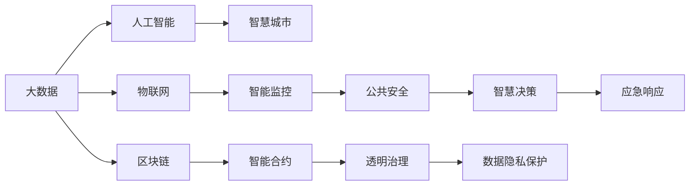

                 

# 科技创新：社会治理的新思路

在数字时代，科技创新已成为社会治理的重要驱动力。从智慧城市到智慧医疗，从智能制造到智慧农业，科技创新正在开启社会治理的新篇章。本文将从科技创新对社会治理的贡献、核心技术原理与实现、实际应用场景、未来发展趋势与挑战等多个角度，深入探讨科技创新在社会治理中的新思路。

## 1. 背景介绍

### 1.1 问题由来
随着科技的迅猛发展，现代社会正经历着深刻变革。社会治理面临着信息化、智能化、精细化的新要求。传统的以人力为主的社会治理模式已难以适应现代化社会的复杂多变。科技创新为社会治理带来了新的思路和工具，通过智能技术提升治理效率，降低治理成本，改善治理质量，构建更安全、高效、公平的治理体系。

### 1.2 问题核心关键点
科技创新在社会治理中的应用，主要体现在以下几个方面：
- 数据驱动治理：通过采集、分析大量数据，实现精准、及时的决策支持。
- 智能监控与预警：利用图像识别、自然语言处理等技术，实现对社会治安、公共卫生等领域的智能监控和预警。
- 智慧决策支持：通过大数据、机器学习等技术，提升政府决策的科学性和合理性。
- 公共服务创新：利用智能技术，提升公共服务的便捷性、高效性，满足公民的多样化需求。
- 应急响应与管理：通过智能分析技术，提高突发事件预测和应对能力，保障社会稳定。

这些关键点体现了科技创新在社会治理中的多维度和深度。本文将从这些关键点出发，系统梳理科技创新在社会治理中的实践应用。

## 2. 核心概念与联系

### 2.1 核心概念概述

为了更好地理解科技创新在社会治理中的应用，本节将介绍几个密切相关的核心概念：

- **大数据**：指在一定时间内，通过信息技术采集、处理、存储的数据集合，具有体量大、类型多、更新快、价值密度低等特点。
- **人工智能**：使用算法和模型，通过计算机模拟人类智能行为，实现自动化决策、智能监控、自然语言处理等功能。
- **物联网**：通过传感器、通信设备等技术，实现物理世界与信息世界的互联，支持智能设备的广泛应用。
- **区块链**：一种去中心化的分布式账本技术，可以实现数据透明、不可篡改、安全可信。
- **云计算**：通过网络提供计算资源和应用服务，支持大规模数据处理和分布式协作。
- **智慧城市**：利用智能技术，实现城市管理、公共服务、社会治理的智慧化，提升城市治理效能。

这些核心概念之间相互关联，共同构成了科技创新在社会治理中的技术框架。通过合理应用这些技术，可以实现数据驱动、智能决策、高效响应等治理目标。

### 2.2 核心概念原理和架构的 Mermaid 流程图



这个流程图展示了大数据、人工智能、物联网、区块链、云计算和智慧城市之间的逻辑关系：

1. 大数据提供基础数据支持。
2. 人工智能基于数据，实现智能监控、决策支持等功能。
3. 物联网实现物理世界与信息世界的互联，支持智能设备的广泛应用。
4. 区块链提供数据透明、可信的基础设施。
5. 云计算提供强大的计算和存储能力。
6. 智慧城市集成以上技术，实现城市治理的智能化、高效化。

这些核心概念共同构成了科技创新在社会治理中的技术支撑，推动了智慧城市建设、智能服务应用、社会治理智能化等各个方面。

## 3. 核心算法原理 & 具体操作步骤

### 3.1 算法原理概述

科技创新在社会治理中的应用，涉及多种算法和技术的融合。以下是对核心算法原理的概述：

- **数据挖掘与分析算法**：从海量数据中提取有用信息，如聚类、分类、关联规则等。
- **自然语言处理(NLP)**：理解和生成自然语言，实现智能问答、文本分类、情感分析等功能。
- **计算机视觉(CV)**：处理和分析图像、视频数据，实现智能监控、人脸识别、物体检测等功能。
- **机器学习与深度学习**：通过模型训练，实现智能预测、决策优化、智能推荐等。
- **智能推荐系统**：基于用户行为数据，实现个性化推荐服务。
- **区块链技术**：实现去中心化、分布式账本管理，保障数据透明、安全可信。

这些算法和技术通过合理组合，可以实现数据驱动、智能决策、高效响应等治理目标。

### 3.2 算法步骤详解

科技创新在社会治理中的应用，通常包括以下关键步骤：

**Step 1: 数据采集与预处理**
- 采集来自各类传感器、监控设备、社交媒体等渠道的数据。
- 清洗、去噪、标注数据，保证数据质量。

**Step 2: 数据存储与分析**
- 将清洗后的数据存储到云端数据库或分布式存储系统中。
- 使用大数据分析工具，进行数据挖掘、聚类、分类等分析。

**Step 3: 模型训练与优化**
- 选择适当的算法，构建数据驱动的模型。
- 使用训练集训练模型，并根据验证集结果进行调参优化。
- 使用测试集评估模型效果，确保模型泛化性能。

**Step 4: 系统集成与部署**
- 将训练好的模型集成到社会治理系统中。
- 在实际环境中测试模型性能，进行系统优化。
- 部署系统，提供智能服务。

**Step 5: 持续监控与改进**
- 实时监控系统运行状态，收集用户反馈。
- 根据反馈结果，持续优化模型和系统。
- 定期更新模型和数据，保持系统稳定和高效。

这些步骤体现了科技创新在社会治理中的实现流程，通过合理应用多种技术，可以实现高效、智能的社会治理。

### 3.3 算法优缺点

科技创新在社会治理中的应用，具有以下优点：
- 数据驱动：通过数据分析，实现精准、及时的决策支持。
- 智能高效：利用智能算法，提升治理效率和响应速度。
- 低成本：智能技术降低了人力成本，提高了治理效率。
- 透明可控：智能系统可实现全过程监控和记录，保障治理透明度和可控性。

同时，也存在一些局限：
- 数据隐私：大规模数据采集和存储可能引发隐私问题。
- 技术依赖：智能系统的稳定运行需要技术保障，可能面临技术故障。
- 数据质量：数据质量直接影响治理效果，需要持续优化。
- 伦理风险：智能决策可能引发伦理问题，需要重视伦理保障。

尽管存在这些局限，但科技创新在社会治理中的应用前景广阔，能够显著提升治理效能，推动社会进步。

### 3.4 算法应用领域

科技创新在社会治理中的应用，涵盖了智慧城市、智能交通、公共安全、智慧医疗、智能环保等多个领域，具体包括：

- **智慧城市**：通过智能技术，实现城市交通、公共服务、环境监测等领域的智慧化管理，提升城市治理效率。
- **智能交通**：利用智能监控、大数据分析等技术，优化交通流量，提高交通效率。
- **公共安全**：通过智能监控、人脸识别、智能预警等技术，实现公共安全事件的早期预警和应对。
- **智慧医疗**：利用大数据、人工智能等技术，优化医疗资源配置，提升医疗服务质量。
- **智能环保**：利用智能监测、大数据分析等技术，实现环境污染的智能预警和治理。

这些应用领域体现了科技创新在社会治理中的广泛应用和深远影响。

## 4. 数学模型和公式 & 详细讲解 & 举例说明

### 4.1 数学模型构建

本节将使用数学语言对科技创新在社会治理中的应用进行更加严格的刻画。

设社会治理系统由 $n$ 个传感器、 $m$ 种数据类型构成，采集的数据矩阵为 $D \in \mathbb{R}^{n \times m}$，其中 $D_{i,j}$ 表示第 $i$ 个传感器采集的第 $j$ 种数据。设数据预处理后的特征向量为 $X \in \mathbb{R}^{n \times p}$，其中 $X_{i,j}$ 表示第 $i$ 个传感器采集的第 $j$ 种特征。

假设社会治理问题可以表示为分类任务，设分类标签向量为 $Y \in \mathbb{R}^{n \times 1}$，其中 $Y_i$ 表示第 $i$ 个传感器的分类标签。

定义分类模型的损失函数为：

$$
L(Y, \hat{Y}) = -\frac{1}{n} \sum_{i=1}^n \log \hat{Y}_i
$$

其中 $\hat{Y}_i$ 为模型预测的第 $i$ 个传感器的分类概率。

### 4.2 公式推导过程

以下我们以智能交通系统为例，推导分类模型的损失函数及其梯度计算公式。

设智能交通系统中有 $n$ 个传感器，采集到的数据类型有 $m$ 种，分别为车流量、车速、交通事故等。预处理后的特征向量为 $X \in \mathbb{R}^{n \times p}$，分类标签向量为 $Y \in \mathbb{R}^{n \times 1}$。

定义分类模型的损失函数为：

$$
L(Y, \hat{Y}) = -\frac{1}{n} \sum_{i=1}^n \log \hat{Y}_i
$$

其中 $\hat{Y}_i$ 为模型预测的第 $i$ 个传感器的分类概率。

根据链式法则，损失函数对特征向量 $X$ 的梯度为：

$$
\frac{\partial L(Y, \hat{Y})}{\partial X} = -\frac{1}{n} \sum_{i=1}^n \frac{1}{\hat{Y}_i} (Y_i - \hat{Y}_i) \frac{\partial \hat{Y}_i}{\partial X}
$$

其中 $\frac{\partial \hat{Y}_i}{\partial X}$ 为模型对特征向量 $X$ 的梯度，可以通过自动微分技术高效计算。

在得到损失函数的梯度后，即可带入优化算法进行模型训练，最小化损失函数。重复上述过程直至收敛，最终得到适应智能交通系统的高效分类模型。

### 4.3 案例分析与讲解

以智能交通系统为例，分析科技创新在实际应用中的表现和效果。

智能交通系统通过采集车流量、车速、交通事故等数据，利用大数据分析、机器学习等技术，实现智能交通管理。具体步骤如下：

**Step 1: 数据采集与预处理**
- 利用各类传感器采集交通流量数据。
- 清洗、去噪、标注数据，生成特征向量 $X$。

**Step 2: 模型训练与优化**
- 选择适当的分类算法，如决策树、随机森林、神经网络等。
- 使用训练集训练模型，并根据验证集结果进行调参优化。
- 使用测试集评估模型效果，确保模型泛化性能。

**Step 3: 系统集成与部署**
- 将训练好的模型集成到交通管理系统。
- 在实际环境中测试模型性能，进行系统优化。
- 部署系统，提供智能服务。

**Step 4: 持续监控与改进**
- 实时监控系统运行状态，收集用户反馈。
- 根据反馈结果，持续优化模型和系统。
- 定期更新模型和数据，保持系统稳定和高效。

智能交通系统通过上述步骤，实现了对交通流量的智能监控、预测和优化，提高了交通效率，减少了交通事故，改善了城市交通状况。

## 5. 项目实践：代码实例和详细解释说明

### 5.1 开发环境搭建

在进行科技创新在社会治理中的应用开发前，我们需要准备好开发环境。以下是使用Python进行项目开发的流程：

1. 安装Python：从官网下载并安装Python，确保安装版本为3.7或以上。
2. 安装必要的库：安装TensorFlow、Keras、NumPy、Pandas等库，用于数据处理和模型训练。
3. 准备数据：收集和预处理来自智能交通系统的数据，确保数据质量。

### 5.2 源代码详细实现

下面以智能交通系统为例，给出使用TensorFlow进行模型训练的PyTorch代码实现。

首先，定义数据处理函数：

```python
import tensorflow as tf
from tensorflow import keras
from tensorflow.keras import layers

def load_data(file_path):
    data = tf.data.TFRecordDataset(file_path)
    data = data.map(lambda x: parse_record(x))
    data = data.batch(batch_size)
    data = data.prefetch(buffer_size=tf.data.experimental.AUTOTUNE)
    return data
```

然后，定义模型和优化器：

```python
model = keras.Sequential([
    layers.Dense(64, activation='relu', input_shape=(input_size,)),
    layers.Dense(32, activation='relu'),
    layers.Dense(1, activation='sigmoid')
])

optimizer = tf.keras.optimizers.Adam(learning_rate=0.001)
```

接着，定义训练和评估函数：

```python
@tf.function
def train_step(inputs, labels):
    with tf.GradientTape() as tape:
        logits = model(inputs)
        loss = tf.reduce_mean(tf.losses.BinaryCrossentropy()(labels, logits))
    gradients = tape.gradient(loss, model.trainable_variables)
    optimizer.apply_gradients(zip(gradients, model.trainable_variables))
    return loss

@tf.function
def evaluate_step(inputs, labels):
    logits = model(inputs)
    predictions = tf.round(logits)
    accuracy = tf.reduce_mean(tf.cast(tf.equal(predictions, labels), tf.float32))
    return accuracy
```

最后，启动训练流程并在测试集上评估：

```python
epochs = 10
batch_size = 32

for epoch in range(epochs):
    for inputs, labels in train_dataset:
        loss = train_step(inputs, labels)
        if epoch % 10 == 0:
            accuracy = evaluate_step(test_dataset, test_labels)
            print(f'Epoch {epoch+1}, loss: {loss.numpy()}, accuracy: {accuracy.numpy()}')

print(f'Total training loss: {total_loss.numpy()}, total accuracy: {total_accuracy.numpy()}')
```

以上就是使用TensorFlow对智能交通系统进行模型训练的完整代码实现。

### 5.3 代码解读与分析

让我们再详细解读一下关键代码的实现细节：

**load_data函数**：
- 定义了一个函数，用于加载和预处理数据。通过TFRecordDataset加载数据文件，使用map函数将记录解析成数据，使用batch和prefetch函数进行批次化和预取，确保数据高效加载。

**model和optimizer定义**：
- 定义了一个包含三个全连接层的神经网络模型，使用ReLU激活函数和sigmoid输出函数。
- 定义了Adam优化器，设置学习率为0.001。

**train_step和evaluate_step函数**：
- 使用tf.function装饰函数，提高函数执行效率。
- 在train_step函数中，使用GradientTape记录梯度，并应用优化器更新模型参数。
- 在evaluate_step函数中，计算模型的预测准确率。

**训练流程**：
- 定义总的训练轮数和批次大小。
- 在每个epoch内，对训练集进行迭代，计算损失并优化模型。
- 每十个epoch输出一次评估结果。
- 最后输出总的训练损失和准确率。

通过上述代码，可以看到TensorFlow在模型训练和评估中的高效实现。开发者可以将更多精力放在数据处理、模型改进等高层逻辑上，而不必过多关注底层的实现细节。

## 6. 实际应用场景

### 6.1 智慧城市

智慧城市是科技创新在社会治理中应用最为广泛的领域之一。通过智能监控、大数据分析、智能决策等技术，智慧城市可以实现高效、智能的治理。

具体应用场景包括：
- **智能交通管理**：通过智能监控、大数据分析等技术，实现交通流量预测、智能信号灯控制、事故预警等。
- **公共安全监控**：利用视频监控、图像识别等技术，实现公共安全事件的实时预警和应对。
- **环境监测与管理**：通过智能传感器、大数据分析等技术，实现环境污染的智能预警和治理。

智慧城市通过智能技术，提高了城市治理的效率和质量，改善了市民的生活环境。

### 6.2 智能交通

智能交通是科技创新在社会治理中应用的重要领域之一。通过智能监控、大数据分析等技术，智能交通可以实现交通流量的智能管理，提高交通效率，减少交通事故。

具体应用场景包括：
- **智能信号灯控制**：通过智能传感器采集交通数据，实现实时交通流量的预测和智能信号灯控制。
- **事故预警与处理**：利用视频监控、图像识别等技术，实现交通事故的实时预警和应对。
- **交通信息服务**：通过智能应用，提供实时交通信息、路线规划等服务，提升用户体验。

智能交通通过智能技术，实现了交通流量的智能管理，提高了交通效率，改善了市民的出行体验。

### 6.3 公共安全

公共安全是科技创新在社会治理中应用的重要领域之一。通过智能监控、视频分析等技术，公共安全可以实现实时预警和应对，保障社会稳定。

具体应用场景包括：
- **视频监控与分析**：利用视频监控、图像识别等技术，实现公共安全事件的实时预警和应对。
- **人脸识别与身份验证**：通过人脸识别技术，实现人员身份验证和异常行为识别。
- **智能预警与应对**：利用大数据分析技术，实现公共安全事件的智能预警和应对。

公共安全通过智能技术，实现了实时预警和应对，提高了社会安全水平，保障了市民的安全。

## 7. 工具和资源推荐

### 7.1 学习资源推荐

为了帮助开发者系统掌握科技创新在社会治理中的应用理论基础和实践技巧，这里推荐一些优质的学习资源：

1. **《深度学习》课程**：斯坦福大学开设的深度学习课程，涵盖深度学习的基本概念、算法和应用。
2. **《数据科学导论》课程**：哈佛大学开设的数据科学导论课程，涵盖数据科学的基本概念和工具。
3. **《智慧城市》书籍**：介绍智慧城市的基本概念、技术框架和应用案例。
4. **《人工智能伦理》书籍**：探讨人工智能伦理问题，如隐私、安全、公平性等。

通过这些资源的学习实践，相信你一定能够快速掌握科技创新在社会治理中的应用精髓，并用于解决实际的治理问题。

### 7.2 开发工具推荐

高效的开发离不开优秀的工具支持。以下是几款用于科技创新在社会治理中应用开发的常用工具：

1. **TensorFlow**：基于Python的开源深度学习框架，支持分布式计算，适用于大规模模型训练。
2. **PyTorch**：基于Python的开源深度学习框架，动态计算图，适合快速迭代研究。
3. **Keras**：基于Python的深度学习框架，易于使用，适合初学者。
4. **Jupyter Notebook**：交互式编程环境，支持Python、R等多种语言，适合数据分析和模型训练。
5. **Hadoop**：开源的分布式计算框架，适用于大规模数据处理。
6. **OpenCV**：计算机视觉库，支持图像处理、视频分析等功能。

合理利用这些工具，可以显著提升科技创新在社会治理中的应用开发效率，加快创新迭代的步伐。

### 7.3 相关论文推荐

科技创新在社会治理中的应用源于学界的持续研究。以下是几篇奠基性的相关论文，推荐阅读：

1. **《智慧城市的未来：科技驱动的智慧治理》**：探讨智慧城市的基本概念、技术框架和应用案例。
2. **《智能交通系统的设计与实现》**：介绍智能交通系统的基本概念、技术架构和应用案例。
3. **《公共安全智能监控与预警技术研究》**：探讨公共安全智能监控与预警的基本概念、技术架构和应用案例。
4. **《深度学习在智慧城市中的应用》**：介绍深度学习在智慧城市中的基本概念、算法和应用案例。
5. **《数据驱动的智慧城市治理模型研究》**：探讨数据驱动智慧城市治理的基本概念、技术架构和应用案例。

这些论文代表了大数据、人工智能、物联网、区块链等技术在社会治理中的应用方向，帮助研究者把握学科前进方向，激发更多的创新灵感。

## 8. 总结：未来发展趋势与挑战

### 8.1 总结

本文对科技创新在社会治理中的应用进行了全面系统的介绍。首先阐述了科技创新对社会治理的贡献，明确了数据驱动、智能决策、高效响应等治理目标。其次，从原理到实践，详细讲解了科技创新在社会治理中的数学模型和关键算法，给出了智能交通系统的代码实例。最后，系统梳理了科技创新在智慧城市、智能交通、公共安全等实际应用场景中的表现和效果，展望了未来发展趋势与挑战。

通过本文的系统梳理，可以看到，科技创新在社会治理中的应用前景广阔，能够显著提升治理效能，推动社会进步。

### 8.2 未来发展趋势

展望未来，科技创新在社会治理中的应用将呈现以下几个发展趋势：

1. **数据驱动的治理**：随着数据采集技术的提升和数据处理能力的增强，数据驱动的治理将成为社会治理的重要手段，实现精准、及时的决策支持。
2. **智能决策与预测**：通过智能算法和机器学习，实现对社会事件的高效预测和智能决策，提升治理效率和响应速度。
3. **区块链技术的应用**：区块链技术的去中心化、透明性等特点，将广泛应用于社会治理，保障数据安全和隐私。
4. **智能合约的推广**：智能合约技术能够实现自动化的智能治理，提高治理效率和公平性。
5. **多模态数据的融合**：利用图像、视频、语音等多模态数据，提升社会治理的全面性和准确性。
6. **隐私保护与伦理保障**：随着数据隐私和安全问题的日益突出，隐私保护和伦理保障将成为社会治理的重要课题。

以上趋势凸显了科技创新在社会治理中的广阔前景。这些方向的探索发展，必将进一步提升社会治理的效率和质量，构建更安全、高效、公平的社会治理体系。

### 8.3 面临的挑战

尽管科技创新在社会治理中的应用前景广阔，但在迈向更加智能化、普适化应用的过程中，仍面临诸多挑战：

1. **数据隐私**：大规模数据采集和存储可能引发隐私问题，需要采取有效的隐私保护措施。
2. **技术依赖**：智能系统的稳定运行需要技术保障，可能面临技术故障和维护困难。
3. **数据质量**：数据质量直接影响治理效果，需要持续优化数据采集和预处理过程。
4. **伦理风险**：智能决策可能引发伦理问题，需要重视伦理保障和技术监管。
5. **成本问题**：科技创新在社会治理中的应用需要大量的投资和技术支持，成本较高。

尽管存在这些挑战，但通过持续的科技创新和政策引导，这些挑战有望逐步克服，科技创新将在社会治理中发挥更大的作用。

### 8.4 研究展望

面向未来，科技创新的研究方向可以从以下几个方面进行探索：

1. **多模态数据融合**：将图像、视频、语音等多模态数据与文本数据融合，提升社会治理的全面性和准确性。
2. **隐私保护与伦理保障**：研究隐私保护和伦理保障技术，确保数据安全和公平性。
3. **智能合约与去中心化治理**：利用智能合约技术，实现自动化的智能治理，提高治理效率和公平性。
4. **智能系统优化与优化算法**：研究智能系统的优化算法，提高治理效率和稳定性。
5. **人工智能伦理与社会责任**：研究人工智能伦理问题，制定规范和标准，确保人工智能技术在社会治理中的应用符合社会责任和伦理规范。

这些研究方向将进一步推动科技创新在社会治理中的应用，为构建更安全、高效、公平的社会治理体系提供技术保障。

## 9. 附录：常见问题与解答

**Q1：科技创新在社会治理中的应用是否适用于所有领域？**

A: 科技创新在社会治理中的应用，具有广泛适用性。无论是智慧城市、智能交通，还是公共安全、智慧医疗，科技创新都能提供高效、智能的治理手段。但需要根据具体场景和需求，选择合适的技术和方法。

**Q2：数据驱动的治理是否存在隐私问题？**

A: 数据驱动的治理存在隐私问题，需要采取有效的隐私保护措施。通过数据匿名化、加密、分布式存储等技术，可以实现数据的隐私保护。

**Q3：智能系统的稳定性如何保障？**

A: 智能系统的稳定性需要技术保障。通过合理设计算法和模型，使用可靠的硬件设备和网络基础设施，可以提高系统的稳定性和可靠性。

**Q4：如何优化数据质量？**

A: 数据质量直接影响治理效果，需要持续优化数据采集和预处理过程。通过数据清洗、去噪、标注等步骤，提高数据质量。

**Q5：如何处理伦理问题？**

A: 智能决策可能引发伦理问题，需要重视伦理保障和技术监管。制定规范和标准，确保人工智能技术在社会治理中的应用符合社会责任和伦理规范。

通过解答这些常见问题，可以更好地理解科技创新在社会治理中的应用挑战和解决方法。

---

作者：禅与计算机程序设计艺术 / Zen and the Art of Computer Programming

