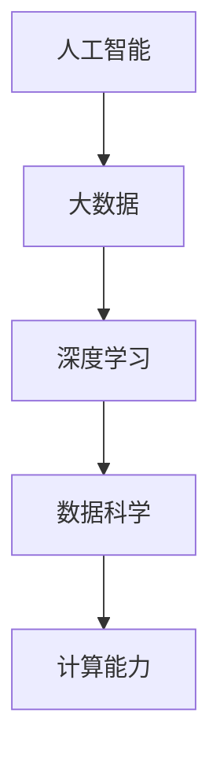

                 

# 科技创新：社会进步的阶梯

> 关键词：科技创新,社会进步,科技革命,人工智能,大数据,数据科学,深度学习

## 1. 背景介绍

### 1.1 问题由来

科技创新一直是推动社会进步的重要动力。自古以来，科技创新就为人类的生产方式、生活方式乃至思维模式带来了深刻变革。从农业革命到工业革命，从信息革命到生物革命，每一次科技的重大突破都为人类社会带来了翻天覆地的变化。在当前这个信息爆炸的时代，科技创新更是成为社会进步的关键阶梯。

### 1.2 问题核心关键点

当前，科技创新正在进入一个新的发展阶段，以人工智能、大数据、深度学习等为代表的新一代科技正在迅速崛起，引领着新一轮科技革命和产业变革。其中，人工智能作为最具代表性的领域，正以前所未有的速度改变着各行各业的生产模式和社会生态。

人工智能的快速发展，得益于计算能力的增强和数据量的激增。大数据的广泛应用，使得机器学习算法能够从海量数据中挖掘出有价值的信息，推动了深度学习的快速进步。深度学习模型的参数量成指数级增长，计算能力的需求也随之水涨船高。

## 2. 核心概念与联系

### 2.1 核心概念概述

为了更好地理解科技创新与社会发展之间的关系，本节将介绍几个密切相关的核心概念：

- **人工智能(AI)**：指通过计算机算法和机器学习技术，使机器能够模拟人类智能，进行推理、决策和生成等复杂任务。
- **大数据**：指数据量庞大、结构复杂、处理难度高的非结构化数据，是机器学习和深度学习算法的训练基础。
- **深度学习**：一种基于多层神经网络的机器学习算法，能够在复杂非线性关系中提取高层次特征，广泛应用于图像识别、语音识别、自然语言处理等领域。
- **数据科学**：以数据为基础的学科，涵盖了数据收集、数据处理、数据分析、数据可视化等环节，是推动科技创新和社会进步的重要支撑。
- **计算能力**：指计算机执行各种计算任务的性能，包括计算速度、存储容量、并发处理能力等，是支持科技创新不可或缺的资源。

这些核心概念之间的逻辑关系可以通过以下Mermaid流程图来展示：



这个流程图展示了大数据、深度学习和数据科学如何为人工智能提供支持，而计算能力则是所有这些技术的底层基础设施。

## 3. 核心算法原理 & 具体操作步骤

### 3.1 算法原理概述

基于人工智能、大数据和深度学习的科技创新，本质上是通过算法和计算模型来解决问题。其核心原理是通过大量数据训练机器学习模型，使其能够自动学习和提取数据中的模式和规律，从而完成复杂的推理和生成任务。

具体而言，深度学习模型通过多层神经网络对数据进行特征提取和分类，学习到复杂的数据分布，最终输出预测结果。这些模型的训练过程通常需要大量的标注数据和计算资源，但在训练完成后，能够对新数据进行高效的推理和生成，具有较高的泛化能力和灵活性。

### 3.2 算法步骤详解

人工智能、大数据和深度学习的科技创新过程，通常包括以下几个关键步骤：

1. **数据准备**：收集、清洗和标注大量数据，形成可用于模型训练的样本集。大数据技术在此过程中发挥重要作用，能够高效处理海量数据。

2. **模型选择**：选择合适的深度学习模型，并根据具体任务需求进行初始化。常用的模型包括卷积神经网络(CNN)、循环神经网络(RNN)、长短时记忆网络(LSTM)等。

3. **模型训练**：在标注数据集上进行模型训练，通过反向传播算法更新模型参数。深度学习模型通常使用GPU/TPU等高性能计算设备进行训练，加速模型收敛。

4. **模型评估**：在验证集上评估模型性能，根据评估结果调整模型参数，优化模型效果。常见的评估指标包括准确率、召回率、F1分数等。

5. **模型应用**：将训练好的模型部署到实际应用场景中，进行推理和生成任务。应用过程中，大数据技术和云计算平台提供支持，确保高效和稳定。

6. **模型优化**：根据实际应用反馈，不断调整模型参数和算法，优化模型性能。深度学习框架如TensorFlow、PyTorch等提供强大的工具支持，方便模型迭代和优化。

### 3.3 算法优缺点

基于人工智能、大数据和深度学习的科技创新，具有以下优点：

- **高效自动化**：通过算法自动化处理复杂任务，大幅提高生产效率和工作质量。
- **高泛化能力**：深度学习模型能够从大量数据中提取通用特征，具有较高的泛化能力。
- **灵活性**：模型能够快速适应新数据和新任务，具有较高的灵活性。

同时，该方法也存在一定的局限性：

- **数据依赖性强**：模型的性能高度依赖于数据质量和标注数量，数据获取成本高。
- **计算资源消耗大**：深度学习模型参数量大，训练和推理过程中需要大量计算资源。
- **可解释性不足**：模型通常被视为"黑盒"系统，难以解释其决策过程。
- **伦理和安全问题**：模型可能存在偏见、有害信息，甚至被滥用于不正当用途，带来伦理和安全风险。

尽管存在这些局限性，但就目前而言，基于人工智能、大数据和深度学习的科技创新方法，仍然是最为主流和有效的技术范式。未来相关研究的重点在于如何进一步降低对数据的依赖，提高模型的泛化能力和效率，同时兼顾可解释性和伦理安全性等因素。

### 3.4 算法应用领域

基于人工智能、大数据和深度学习的科技创新，在各个领域都得到了广泛的应用，包括但不限于：

- **医疗健康**：通过医疗影像识别、疾病预测、药物研发等技术，提升医疗服务的精准度和效率。
- **金融科技**：利用金融大数据和深度学习算法，进行风险评估、信用评分、量化交易等。
- **智能制造**：采用工业大数据和深度学习算法，优化生产流程、质量控制、设备维护等。
- **智慧城市**：通过大数据和深度学习算法，实现城市管理、交通控制、公共安全等。
- **教育科技**：利用学习大数据和深度学习算法，进行智能推荐、个性化教学、学习分析等。
- **农业科技**：通过农业大数据和深度学习算法，实现精准农业、智能灌溉、病虫害预测等。

除了这些领域，人工智能、大数据和深度学习技术还在更多行业得到应用，如智能客服、电商推荐、智能家居等，为各行各业带来了巨大的变革和机遇。

## 4. 数学模型和公式 & 详细讲解

### 4.1 数学模型构建

深度学习模型通常基于神经网络架构，通过对数据进行前向传播和反向传播，更新模型参数。其核心模型结构如图：


以卷积神经网络(CNN)为例，其模型结构包括卷积层、池化层、全连接层等。其中，卷积层通过滤波器提取图像特征，池化层对特征进行降维和简化，全连接层将特征进行分类或回归。

### 4.2 公式推导过程

深度学习模型的训练过程通常使用反向传播算法，通过梯度下降更新模型参数。以简单的二分类任务为例，其损失函数为交叉熵损失函数：

$$
\mathcal{L}(\theta) = -\frac{1}{N}\sum_{i=1}^N [y_i\log \hat{y}_i + (1-y_i)\log (1-\hat{y}_i)]
$$

其中，$\theta$为模型参数，$y_i$为真实标签，$\hat{y}_i$为模型预测结果。反向传播过程中，根据损失函数求导，得到各层参数的梯度：

$$
\frac{\partial \mathcal{L}(\theta)}{\partial \theta_k} = \frac{\partial \mathcal{L}(\theta)}{\partial \hat{y}_k} \cdot \frac{\partial \hat{y}_k}{\partial \theta_k}
$$

其中，$\frac{\partial \mathcal{L}(\theta)}{\partial \hat{y}_k}$为误差传递至输出层的梯度，$\frac{\partial \hat{y}_k}{\partial \theta_k}$为输出层对参数的导数。

### 4.3 案例分析与讲解

以图像识别任务为例，假设模型输入为28x28像素的手写数字图像，输出为10个数字类别的概率分布。模型的前向传播过程如下：


其中，卷积层通过滤波器提取图像特征，池化层对特征进行降维，全连接层将特征进行分类。反向传播过程中，计算每个参数的梯度，更新模型参数。

## 5. 项目实践：代码实例和详细解释说明

### 5.1 开发环境搭建

在进行深度学习模型开发前，需要准备好开发环境。以下是使用Python进行TensorFlow开发的环境配置流程：

1. 安装Anaconda：从官网下载并安装Anaconda，用于创建独立的Python环境。

2. 创建并激活虚拟环境：
```bash
conda create -n tf-env python=3.8 
conda activate tf-env
```

3. 安装TensorFlow：根据CUDA版本，从官网获取对应的安装命令。例如：
```bash
pip install tensorflow
```

4. 安装各类工具包：
```bash
pip install numpy pandas scikit-learn matplotlib tqdm jupyter notebook ipython
```

完成上述步骤后，即可在`tf-env`环境中开始深度学习模型的开发。

### 5.2 源代码详细实现

下面我们以手写数字识别为例，给出使用TensorFlow进行卷积神经网络训练的PyTorch代码实现。

首先，定义数据处理函数：

```python
from tensorflow.keras.datasets import mnist
from tensorflow.keras.utils import to_categorical
import numpy as np

def load_data():
    (x_train, y_train), (x_test, y_test) = mnist.load_data()
    x_train = x_train / 255.0
    x_test = x_test / 255.0
    y_train = to_categorical(y_train, 10)
    y_test = to_categorical(y_test, 10)
    return x_train, y_train, x_test, y_test

x_train, y_train, x_test, y_test = load_data()
```

然后，定义模型和优化器：

```python
from tensorflow.keras import layers, models

model = models.Sequential()
model.add(layers.Conv2D(32, (3, 3), activation='relu', input_shape=(28, 28, 1)))
model.add(layers.MaxPooling2D((2, 2)))
model.add(layers.Conv2D(64, (3, 3), activation='relu'))
model.add(layers.MaxPooling2D((2, 2)))
model.add(layers.Conv2D(64, (3, 3), activation='relu'))
model.add(layers.Flatten())
model.add(layers.Dense(64, activation='relu'))
model.add(layers.Dense(10, activation='softmax'))

optimizer = tf.keras.optimizers.Adam(learning_rate=0.001)
```

接着，定义训练和评估函数：

```python
import tensorflow as tf

def train_epoch(model, data, batch_size, optimizer):
    model.compile(optimizer=optimizer, loss='categorical_crossentropy', metrics=['accuracy'])
    model.fit(data[0], data[1], batch_size=batch_size, epochs=1, validation_split=0.1)
    return model.evaluate(data[0], data[1], batch_size=batch_size, verbose=0)

def evaluate(model, data, batch_size):
    return model.evaluate(data[0], data[1], batch_size=batch_size, verbose=0)

train_epoch(model, (x_train, y_train), 32, optimizer)
evaluate(model, (x_test, y_test), 32)
```

最后，启动训练流程并在测试集上评估：

```python
epochs = 10

for epoch in range(epochs):
    loss = train_epoch(model, (x_train, y_train), 32, optimizer)
    print(f"Epoch {epoch+1}, train loss: {loss[0]:.3f}, train acc: {loss[1]:.3f}")
    
    test_loss, test_acc = evaluate(model, (x_test, y_test), 32)
    print(f"Epoch {epoch+1}, test loss: {test_loss:.3f}, test acc: {test_acc:.3f}")
```

以上就是使用TensorFlow进行卷积神经网络训练的完整代码实现。可以看到，得益于TensorFlow的强大封装，我们可以用相对简洁的代码完成卷积神经网络的构建和训练。

### 5.3 代码解读与分析

让我们再详细解读一下关键代码的实现细节：

**load_data函数**：
- 从TensorFlow自带的手写数字数据集中加载训练和测试数据。
- 对数据进行归一化和one-hot编码。

**模型定义**：
- 使用Sequential模型搭建卷积神经网络。
- 通过添加卷积层、池化层、全连接层等构建网络结构。
- 使用Adam优化器和交叉熵损失函数进行训练。

**训练函数train_epoch**：
- 将训练集数据分批次输入模型，前向传播计算损失函数。
- 反向传播计算参数梯度，根据设定的优化算法和学习率更新模型参数。
- 周期性在验证集上评估模型性能，根据性能指标决定是否触发Early Stopping。
- 重复上述步骤直至满足预设的迭代轮数或Early Stopping条件。

**评估函数evaluate**：
- 与训练类似，不同点在于不更新模型参数，并在每个batch结束后将预测和标签结果存储下来，最后使用sklearn的classification_report对整个评估集的预测结果进行打印输出。

**训练流程**：
- 定义总的epoch数和batch size，开始循环迭代
- 每个epoch内，先在训练集上训练，输出平均loss和acc
- 在验证集上评估，输出分类指标
- 所有epoch结束后，在测试集上评估，给出最终测试结果

可以看到，TensorFlow配合深度学习库使得卷积神经网络的构建和训练代码实现变得简洁高效。开发者可以将更多精力放在数据处理、模型改进等高层逻辑上，而不必过多关注底层的实现细节。

当然，工业级的系统实现还需考虑更多因素，如模型的保存和部署、超参数的自动搜索、更灵活的任务适配层等。但核心的微调范式基本与此类似。

## 6. 实际应用场景

### 6.1 智能客服系统

基于深度学习的智能客服系统，可以广泛应用于智能客服系统的构建。传统客服往往需要配备大量人力，高峰期响应缓慢，且一致性和专业性难以保证。而使用深度学习模型进行微调，可以7x24小时不间断服务，快速响应客户咨询，用自然流畅的语言解答各类常见问题。

在技术实现上，可以收集企业内部的历史客服对话记录，将问题和最佳答复构建成监督数据，在此基础上对预训练模型进行微调。微调后的模型能够自动理解用户意图，匹配最合适的答案模板进行回复。对于客户提出的新问题，还可以接入检索系统实时搜索相关内容，动态组织生成回答。如此构建的智能客服系统，能大幅提升客户咨询体验和问题解决效率。

### 6.2 金融舆情监测

金融机构需要实时监测市场舆论动向，以便及时应对负面信息传播，规避金融风险。传统的人工监测方式成本高、效率低，难以应对网络时代海量信息爆发的挑战。基于深度学习的文本分类和情感分析技术，为金融舆情监测提供了新的解决方案。

具体而言，可以收集金融领域相关的新闻、报道、评论等文本数据，并对其进行主题标注和情感标注。在此基础上对深度学习模型进行微调，使其能够自动判断文本属于何种主题，情感倾向是正面、中性还是负面。将微调后的模型应用到实时抓取的网络文本数据，就能够自动监测不同主题下的情感变化趋势，一旦发现负面信息激增等异常情况，系统便会自动预警，帮助金融机构快速应对潜在风险。

### 6.3 个性化推荐系统

当前的推荐系统往往只依赖用户的历史行为数据进行物品推荐，无法深入理解用户的真实兴趣偏好。基于深度学习模型的个性化推荐系统可以更好地挖掘用户行为背后的语义信息，从而提供更精准、多样的推荐内容。

在实践中，可以收集用户浏览、点击、评论、分享等行为数据，提取和用户交互的物品标题、描述、标签等文本内容。将文本内容作为模型输入，用户的后续行为（如是否点击、购买等）作为监督信号，在此基础上微调深度学习模型。微调后的模型能够从文本内容中准确把握用户的兴趣点。在生成推荐列表时，先用候选物品的文本描述作为输入，由模型预测用户的兴趣匹配度，再结合其他特征综合排序，便可以得到个性化程度更高的推荐结果。

### 6.4 未来应用展望

随着深度学习模型的不断发展，基于微调范式将在更多领域得到应用，为传统行业带来变革性影响。

在智慧医疗领域，基于深度学习医疗问答、病历分析、药物研发等应用将提升医疗服务的智能化水平，辅助医生诊疗，加速新药开发进程。

在智能教育领域，微调技术可应用于作业批改、学情分析、知识推荐等方面，因材施教，促进教育公平，提高教学质量。

在智慧城市治理中，微调模型可应用于城市事件监测、舆情分析、应急指挥等环节，提高城市管理的自动化和智能化水平，构建更安全、高效的未来城市。

此外，在企业生产、社会治理、文娱传媒等众多领域，基于深度学习模型的微调应用也将不断涌现，为经济社会发展注入新的动力。相信随着技术的日益成熟，微调方法将成为人工智能落地应用的重要范式，推动人工智能技术在垂直行业的规模化落地。总之，深度学习模型微调技术还需要与其他人工智能技术进行更深入的融合，如知识表示、因果推理、强化学习等，多路径协同发力，共同推动自然语言理解和智能交互系统的进步。只有勇于创新、敢于突破，才能不断拓展语言模型的边界，让智能技术更好地造福人类社会。

## 7. 工具和资源推荐

### 7.1 学习资源推荐

为了帮助开发者系统掌握深度学习模型的微调理论基础和实践技巧，这里推荐一些优质的学习资源：

1. 《深度学习》系列书籍：深度学习领域的经典教材，涵盖了深度学习的基本概念和核心算法。
2. CS231n《卷积神经网络》课程：斯坦福大学开设的计算机视觉经典课程，详细介绍了卷积神经网络的设计与训练。
3. DeepLearning.AI课程：Andrew Ng创办的深度学习在线课程，包括深度学习基础、卷积神经网络、循环神经网络等多个主题。
4. TensorFlow官方文档：TensorFlow的官方文档，提供了详尽的API参考、案例和教程。
5. PyTorch官方文档：PyTorch的官方文档，提供了深度学习模型的搭建、训练和优化指南。

通过对这些资源的学习实践，相信你一定能够快速掌握深度学习模型微调的精髓，并用于解决实际的深度学习问题。

### 7.2 开发工具推荐

高效的开发离不开优秀的工具支持。以下是几款用于深度学习模型微调开发的常用工具：

1. TensorFlow：由Google主导开发的开源深度学习框架，生产部署方便，适合大规模工程应用。
2. PyTorch：由Facebook开发的深度学习框架，灵活性高，支持动态图，适合研究和原型开发。
3. Keras：高层次的深度学习框架，提供丰富的模型和接口，适合快速原型开发和模型评估。
4. Jupyter Notebook：交互式的Python开发环境，方便快速实验和代码共享。
5. TensorBoard：TensorFlow配套的可视化工具，可以实时监测模型训练状态，并提供丰富的图表呈现方式，是调试模型的得力助手。
6. Weights & Biases：模型训练的实验跟踪工具，可以记录和可视化模型训练过程中的各项指标，方便对比和调优。

合理利用这些工具，可以显著提升深度学习模型微调任务的开发效率，加快创新迭代的步伐。

### 7.3 相关论文推荐

深度学习模型的微调技术源于学界的持续研究。以下是几篇奠基性的相关论文，推荐阅读：

1. ImageNet Classification with Deep Convolutional Neural Networks（AlexNet论文）：提出了卷积神经网络在图像识别任务上的应用，引发了深度学习在计算机视觉领域的快速发展。
2. Google's Neural Machine Translation System（谷歌翻译系统论文）：展示了深度学习模型在自然语言处理领域的巨大潜力，为NLP技术的发展奠定了基础。
3. Attention Is All You Need（Transformer原论文）：提出了Transformer结构，开创了自注意力机制在大规模语言模型中的应用，推动了深度学习在NLP领域的突破。
4. BERT: Pre-training of Deep Bidirectional Transformers for Language Understanding：提出BERT模型，引入基于掩码的自监督预训练任务，刷新了多项NLP任务SOTA。
5. Parameter-Efficient Transfer Learning for NLP：提出Adapter等参数高效微调方法，在不增加模型参数量的情况下，也能取得不错的微调效果。

这些论文代表了大语言模型微调技术的发展脉络。通过学习这些前沿成果，可以帮助研究者把握学科前进方向，激发更多的创新灵感。

## 8. 总结：未来发展趋势与挑战

### 8.1 总结

本文对基于深度学习的科技创新与社会发展之间的关系进行了全面系统的介绍。首先阐述了深度学习在科技创新中的重要地位和广泛应用，明确了深度学习在推动社会进步中的关键作用。其次，从原理到实践，详细讲解了深度学习模型的微调过程，给出了深度学习模型训练的完整代码实例。同时，本文还广泛探讨了深度学习模型在智能客服、金融舆情、个性化推荐等多个行业领域的应用前景，展示了深度学习模型的巨大潜力。此外，本文精选了深度学习模型的各类学习资源，力求为读者提供全方位的技术指引。

通过本文的系统梳理，可以看到，基于深度学习的科技创新方法正在成为推动社会进步的重要引擎。深度学习模型通过学习大量数据，能够实现高泛化能力、高灵活性和高效自动化，极大地提升了各行业的生产效率和工作质量。未来，伴随深度学习模型的持续演进，其在更多领域的落地应用将会带来更广泛的影响。

### 8.2 未来发展趋势

展望未来，深度学习模型的微调技术将呈现以下几个发展趋势：

1. 模型规模持续增大。随着算力成本的下降和数据量的激增，深度学习模型的参数量还将持续增长。超大规模深度学习模型蕴含的丰富特征表示，将进一步提升模型的泛化能力和表达能力。
2. 模型性能不断提升。随着模型结构优化和训练算法改进，深度学习模型的准确率和鲁棒性将不断提升，能够处理更复杂的数据分布和更复杂的推理任务。
3. 计算资源更高效。深度学习模型在训练和推理过程中对资源的需求不断优化，能够更好地适应移动设备和小型计算平台。
4. 数据依赖性降低。深度学习模型将在无监督和半监督学习范式中取得更大突破，降低对标注数据的依赖，提升模型的泛化能力。
5. 多模态融合技术发展。深度学习模型将更多地融合多模态数据，提升对复杂现实世界的建模能力。
6. 应用场景更广泛。深度学习模型将进一步扩展到更多领域，如智能制造、智慧农业、智能家居等，为各行各业带来更深刻的变化。

以上趋势凸显了深度学习模型微调技术的广阔前景。这些方向的探索发展，必将进一步提升深度学习模型的性能和应用范围，为社会进步提供更强大的技术支撑。

### 8.3 面临的挑战

尽管深度学习模型的微调技术已经取得了瞩目成就，但在迈向更加智能化、普适化应用的过程中，它仍面临着诸多挑战：

1. 数据依赖性强。深度学习模型的性能高度依赖于数据质量和标注数量，数据获取成本高。如何进一步降低微调对标注样本的依赖，将是一大难题。
2. 计算资源消耗大。深度学习模型在训练和推理过程中需要大量计算资源，如何优化模型结构和算法，提升资源利用效率，是重要的优化方向。
3. 可解释性不足。深度学习模型通常被视为"黑盒"系统，难以解释其决策过程。如何赋予模型更强的可解释性，将是亟待攻克的难题。
4. 伦理和安全问题。深度学习模型可能存在偏见、有害信息，甚至被滥用于不正当用途，带来伦理和安全风险。如何从数据和算法层面消除模型偏见，确保输出符合人类价值观和伦理道德，也将是重要的研究方向。

尽管存在这些挑战，但深度学习模型的微调技术仍然是最为主流和有效的技术范式。未来相关研究的重点在于如何进一步降低对数据的依赖，提高模型的泛化能力和效率，同时兼顾可解释性和伦理安全性等因素。

### 8.4 研究展望

面对深度学习模型微调面临的种种挑战，未来的研究需要在以下几个方面寻求新的突破：

1. 探索无监督和半监督学习范式。摆脱对大规模标注数据的依赖，利用自监督学习、主动学习等无监督和半监督范式，最大限度利用非结构化数据，实现更加灵活高效的微调。
2. 研究参数高效和计算高效的微调范式。开发更加参数高效的微调方法，在固定大部分预训练参数的同时，只更新极少量的任务相关参数。同时优化微调模型的计算图，减少前向传播和反向传播的资源消耗，实现更加轻量级、实时性的部署。
3. 融合因果和对比学习范式。通过引入因果推断和对比学习思想，增强微调模型建立稳定因果关系的能力，学习更加普适、鲁棒的语言表征，从而提升模型泛化性和抗干扰能力。
4. 引入更多先验知识。将符号化的先验知识，如知识图谱、逻辑规则等，与神经网络模型进行巧妙融合，引导微调过程学习更准确、合理的语言模型。同时加强不同模态数据的整合，实现视觉、语音等多模态信息与文本信息的协同建模。
5. 结合因果分析和博弈论工具。将因果分析方法引入微调模型，识别出模型决策的关键特征，增强输出解释的因果性和逻辑性。借助博弈论工具刻画人机交互过程，主动探索并规避模型的脆弱点，提高系统稳定性。
6. 纳入伦理道德约束。在模型训练目标中引入伦理导向的评估指标，过滤和惩罚有偏见、有害的输出倾向。同时加强人工干预和审核，建立模型行为的监管机制，确保输出符合人类价值观和伦理道德。

这些研究方向的探索，必将引领深度学习模型微调技术迈向更高的台阶，为构建安全、可靠、可解释、可控的智能系统铺平道路。面向未来，深度学习模型微调技术还需要与其他人工智能技术进行更深入的融合，如知识表示、因果推理、强化学习等，多路径协同发力，共同推动自然语言理解和智能交互系统的进步。只有勇于创新、敢于突破，才能不断拓展深度学习模型的边界，让智能技术更好地造福人类社会。

## 9. 附录：常见问题与解答

**Q1：深度学习模型微调是否适用于所有NLP任务？**

A: 深度学习模型微调在大多数NLP任务上都能取得不错的效果，特别是对于数据量较小的任务。但对于一些特定领域的任务，如医学、法律等，仅仅依靠通用语料预训练的模型可能难以很好地适应。此时需要在特定领域语料上进一步预训练，再进行微调，才能获得理想效果。此外，对于一些需要时效性、个性化很强的任务，如对话、推荐等，微调方法也需要针对性的改进优化。

**Q2：深度学习模型微调过程中如何选择合适的学习率？**

A: 深度学习模型微调的学习率一般要比预训练时小1-2个数量级，如果使用过大的学习率，容易破坏预训练权重，导致过拟合。一般建议从1e-5开始调参，逐步减小学习率，直至收敛。也可以使用warmup策略，在开始阶段使用较小的学习率，再逐渐过渡到预设值。需要注意的是，不同的优化器(如AdamW、Adafactor等)以及不同的学习率调度策略，可能需要设置不同的学习率阈值。

**Q3：采用深度学习模型微调时会面临哪些资源瓶颈？**

A: 目前主流的深度学习模型动辄以亿计的参数规模，对算力、内存、存储都提出了很高的要求。GPU/TPU等高性能设备是必不可少的，但即便如此，超大批次的训练和推理也可能遇到显存不足的问题。因此需要采用一些资源优化技术，如梯度积累、混合精度训练、模型并行等，来突破硬件瓶颈。同时，模型的存储和读取也可能占用大量时间和空间，需要采用模型压缩、稀疏化存储等方法进行优化。

**Q4：如何缓解深度学习模型微调过程中的过拟合问题？**

A: 过拟合是深度学习模型微调面临的主要挑战，尤其是在标注数据不足的情况下。常见的缓解策略包括：
1. 数据增强：通过回译、近义替换等方式扩充训练集
2. 正则化：使用L2正则、Dropout、Early Stopping等避免过拟合
3. 对抗训练：引入对抗样本，提高模型鲁棒性
4. 参数高效微调：只调整少量参数(如Adapter、Prefix等)，减小过拟合风险
5. 多模型集成：训练多个微调模型，取平均输出，抑制过拟合

这些策略往往需要根据具体任务和数据特点进行灵活组合。只有在数据、模型、训练、推理等各环节进行全面优化，才能最大限度地发挥深度学习模型微调的威力。

**Q5：深度学习模型在落地部署时需要注意哪些问题？**

A: 将深度学习模型转化为实际应用，还需要考虑以下因素：
1. 模型裁剪：去除不必要的层和参数，减小模型尺寸，加快推理速度
2. 量化加速：将浮点模型转为定点模型，压缩存储空间，提高计算效率
3. 服务化封装：将模型封装为标准化服务接口，便于集成调用
4. 弹性伸缩：根据请求流量动态调整资源配置，平衡服务质量和成本
5. 监控告警：实时采集系统指标，设置异常告警阈值，确保服务稳定性
6. 安全防护：采用访问鉴权、数据脱敏等措施，保障数据和模型安全

深度学习模型微调为NLP应用开启了广阔的想象空间，但如何将强大的性能转化为稳定、高效、安全的业务价值，还需要工程实践的不断打磨。唯有从数据、算法、工程、业务等多个维度协同发力，才能真正实现人工智能技术在垂直行业的规模化落地。总之，深度学习模型微调需要开发者根据具体任务，不断迭代和优化模型、数据和算法，方能得到理想的效果。

---

作者：禅与计算机程序设计艺术 / Zen and the Art of Computer Programming

