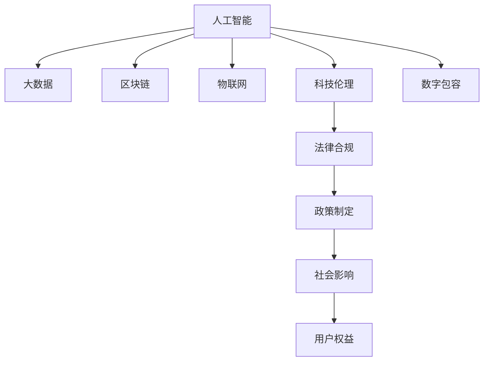

                 

# 科技发展：人类福祉的保障

> 关键词：人工智能, 大数据, 区块链, 物联网, 科技伦理, 数字包容

## 1. 背景介绍

### 1.1 问题由来

随着信息技术的迅猛发展，科技在提升人类生活质量和社会进步方面发挥了巨大作用。然而，科技的进步也带来了许多新的挑战，如隐私保护、数据安全、网络安全、算法偏见等问题。如何在享受科技带来的便捷和福祉的同时，妥善应对这些挑战，保障人类的基本权益，成为了当前科技界和政策制定者共同关心的重要议题。

### 1.2 问题核心关键点

科技发展的核心问题在于如何在提升技术创新的同时，确保技术的应用对人类的福祉是有益的。这涉及到以下几方面的核心问题：

1. **隐私与数据安全**：在数字化时代，个人隐私和数据安全成为关注的焦点。如何保障用户的隐私权，防止数据泄露和滥用，是大数据和人工智能领域的重要挑战。
2. **算法偏见与公平性**：机器学习模型的决策往往依赖于数据样本的分布，如果数据存在偏见，模型将不可避免地产生偏见。如何检测和纠正算法偏见，保证模型决策的公平性，是当前研究的重要方向。
3. **网络安全与信任**：随着物联网、5G等技术的普及，网络攻击和数据泄露的风险也随之增加。如何构建安全可靠的网络环境，增强用户的信任，是科技应用的关键。
4. **数字包容与普惠**：科技的发展往往集中在城市和发达地区，而欠发达地区和弱势群体可能被边缘化。如何实现科技的普及和普惠，缩小数字鸿沟，是科技发展的长期目标。

## 2. 核心概念与联系

### 2.1 核心概念概述

为更好地理解科技发展对人类福祉的影响，本节将介绍几个密切相关的核心概念：

- **人工智能(AI)**：通过模拟人类的认知功能，实现自动化、智能化的技术。
- **大数据(Big Data)**：指规模巨大、类型多样的数据集，用于分析和提取有价值的信息。
- **区块链(Blockchain)**：一种分布式数据库技术，具有去中心化、透明、不可篡改的特性，常用于加密货币和智能合约。
- **物联网(IoT)**：通过传感器、智能设备等手段，实现物与物的互联互通。
- **科技伦理(Ethics of Technology)**：研究科技发展对社会、伦理和法律的影响，强调科技应用的道德责任。
- **数字包容(Digital Inclusion)**：确保所有人都能平等访问和利用数字技术，特别是弱势群体。

这些核心概念之间的逻辑关系可以通过以下Mermaid流程图来展示：



这个流程图展示了许多科技概念之间的内在联系：

1. 人工智能、大数据、区块链、物联网等技术的发展，为科技伦理和数字包容提供了技术支撑。
2. 科技伦理与法律合规相互促进，确保科技应用的合法性和道德性。
3. 政策制定和社会影响共同作用，促进科技的普及和应用。
4. 用户权益的保护和提升，是科技发展的最终目标。

## 3. 核心算法原理 & 具体操作步骤
### 3.1 算法原理概述

科技发展对人类福祉的保障，可以通过以下几个方面的算法原理来实现：

1. **数据隐私保护**：通过差分隐私、联邦学习等技术，确保数据的匿名性和隐私性，防止数据泄露。
2. **算法公平性检测**：通过对抗样本生成、公平性指标评估等方法，检测和纠正算法偏见，提升模型的公平性。
3. **网络安全防御**：通过加密算法、威胁检测、入侵防御等技术，构建安全可靠的网络环境。
4. **数字包容策略**：通过简化技术使用流程、提供技术培训等措施，降低数字技术的门槛，促进数字包容。

### 3.2 算法步骤详解

以下将详细介绍这些算法步骤的详细步骤：

**步骤1：数据隐私保护**

- **差分隐私(Differential Privacy)**：在数据分析时，通过引入噪声，使得单个样本的加入不会对分析结果产生显著影响。例如，可以使用加性噪声、乘性噪声等方法。
- **联邦学习(Federated Learning)**：通过分布式计算，让多个本地设备共同参与模型的训练，而不是将数据集中到一个服务器。这样可以避免数据泄露和滥用，同时提升模型性能。

**步骤2：算法公平性检测**

- **对抗样本生成(Adversarial Examples)**：通过生成对抗性样本，检测模型在不同类别数据上的表现是否平衡。
- **公平性指标评估(Fairness Metrics)**：使用如公平差异(fairness disparity)、误差率(fairness error rate)等指标，评估模型在不同群体上的表现是否公平。

**步骤3：网络安全防御**

- **加密算法(Encryption)**：使用公钥加密、对称加密等算法，保护数据的机密性。
- **威胁检测(Threat Detection)**：通过入侵检测系统(IDS)、入侵防御系统(IPS)等工具，实时监控网络活动，检测异常行为。
- **安全协议(Security Protocols)**：使用如SSL/TLS协议，确保数据在传输过程中的安全。

**步骤4：数字包容策略**

- **简化技术使用流程(Simplify Usage)**：通过简化操作界面、提供自动提示等措施，降低用户的技术门槛。
- **提供技术培训(Provide Training)**：通过技术培训班、在线教程等形式，提升用户的数字素养。

### 3.3 算法优缺点

**数据隐私保护**

- **优点**：有效防止数据泄露和滥用，保障用户隐私权。
- **缺点**：可能会引入噪声，影响数据分析的准确性；联邦学习需要较高的通信成本。

**算法公平性检测**

- **优点**：检测和纠正算法偏见，提升模型公平性。
- **缺点**：对抗样本生成和公平性指标评估可能较复杂，需要大量计算资源。

**网络安全防御**

- **优点**：构建安全可靠的网络环境，增强用户信任。
- **缺点**：加密算法和威胁检测可能需要较高的计算资源，安全协议的维护也较为复杂。

**数字包容策略**

- **优点**：降低数字技术的门槛，促进数字包容。
- **缺点**：简化技术使用流程和提供技术培训可能需要较多的人力资源投入。

### 3.4 算法应用领域

这些算法广泛应用于多个领域，以下是对每个领域的详细介绍：

**在人工智能领域**

- **数据隐私保护**：在训练和部署过程中，确保数据的隐私性和匿名性。例如，在图像识别中，使用差分隐私保护图像数据。
- **算法公平性检测**：在招聘、贷款等敏感领域，确保模型的公平性，防止算法偏见。

**在大数据领域**

- **数据隐私保护**：在数据分析时，使用差分隐私保护个人隐私。例如，在医疗数据分析中，使用差分隐私保护患者数据。
- **算法公平性检测**：在大数据分析中，使用公平性指标评估模型性能，确保不同群体数据的平衡。

**在区块链领域**

- **数据隐私保护**：在智能合约和加密货币中，使用加密算法保护交易数据。例如，在NFT交易中，使用加密算法保护所有权信息。
- **网络安全防御**：在去中心化应用中，使用安全协议保护数据传输安全。例如，在DeFi平台中，使用SSL/TLS协议保护交易数据。

**在物联网领域**

- **网络安全防御**：在智能家居、工业物联网中，使用入侵防御系统保护设备安全。例如，在智慧城市中，使用IDS/IPS保护传感器数据。
- **数字包容策略**：在智能穿戴设备中，简化操作界面，提升用户体验。例如，在老年智能手表中，提供大字体和语音提示。

## 4. 数学模型和公式 & 详细讲解
### 4.1 数学模型构建

本节将使用数学语言对科技发展对人类福祉保障的算法原理进行更加严格的刻画。

假设有一个机器学习模型 $M$，其输入为 $X$，输出为 $Y$，且 $X \in \mathcal{X}, Y \in \mathcal{Y}$。我们希望在使用该模型时，既能保证数据隐私，又能检测算法偏见，同时确保网络安全，促进数字包容。

### 4.2 公式推导过程

**差分隐私**

- **定义**：对于数据集 $D=\{x_1, x_2, \dots, x_n\}$，如果存在 $\epsilon > 0$ 和隐私预算 $\delta$，对于任意两个相邻数据集 $D_1$ 和 $D_2$，有：
  $$
  \mathbb{P}[M(D_1) = M(D_2)] \leq e^{-\epsilon} + \delta
  $$
  其中 $e$ 为自然对数的底数。

**公平性指标评估**

- **公平差异(fairness disparity)**：
  $$
  \text{FD} = \frac{1}{n} \sum_{i=1}^n |\text{TPR}_i - \text{TPR}|
  $$
  其中 $\text{TPR}_i$ 为模型在数据集 $i$ 上的真正例率(True Positive Rate)。

**网络安全防御**

- **加密算法**：对称加密算法如AES，公开密钥加密算法如RSA。

**数字包容策略**

- **简化技术使用流程**：例如，在智能家居设备中，使用语音识别和触摸屏，简化用户操作。
- **提供技术培训**：例如，在社区中心提供计算机基础培训课程。

### 4.3 案例分析与讲解

**案例1：智能医疗系统的隐私保护**

在智能医疗系统中，数据隐私保护尤为重要。患者的数据需要保密，防止泄露给未经授权的用户。可以使用差分隐私技术，在数据分析时引入噪声，确保单个样本的加入不会对分析结果产生显著影响。

**案例2：AI辅助招聘系统的公平性检测**

在AI辅助招聘系统中，确保招聘决策的公平性至关重要。可以使用对抗样本生成技术，检测模型在不同种族、性别等群体上的表现是否平衡。同时，使用公平性指标评估模型性能，确保不同群体数据的平衡。

**案例3：智能合约的加密和安全性**

在区块链上的智能合约中，交易数据的加密和安全性至关重要。可以使用公钥加密算法，保护交易数据的安全性。同时，使用安全协议如SSL/TLS，确保数据在传输过程中的安全。

## 5. 项目实践：代码实例和详细解释说明
### 5.1 开发环境搭建

在进行项目实践前，我们需要准备好开发环境。以下是使用Python进行数据隐私保护、算法公平性检测和网络安全防御的环境配置流程：

1. 安装Anaconda：从官网下载并安装Anaconda，用于创建独立的Python环境。

2. 创建并激活虚拟环境：
```bash
conda create -n privacy-env python=3.8 
conda activate privacy-env
```

3. 安装相关库：
```bash
pip install numpy pandas scikit-learn transformers pytorch torchvision transformers-differential-privacy adversarial-robustness-toolkit
```

完成上述步骤后，即可在`privacy-env`环境中开始项目实践。

### 5.2 源代码详细实现

以下是使用Python进行数据隐私保护、算法公平性检测和网络安全防御的代码实现。

**数据隐私保护**

```python
import numpy as np
from transformers import AutoTokenizer, AutoModelForSequenceClassification
from differential_privacy import DPWrapper

# 加载模型和分词器
model = AutoModelForSequenceClassification.from_pretrained('bert-base-uncased')
tokenizer = AutoTokenizer.from_pretrained('bert-base-uncased')

# 定义隐私预算
epsilon = 1.0
delta = 0.1

# 创建差分隐私包装器
dp_wrapper = DPWrapper(model, epsilon=epsilon, delta=delta)

# 加载数据集
data = load_dataset('path/to/data')
# 对数据集应用差分隐私保护
dp_data = dp_wrapper(data)
```

**算法公平性检测**

```python
import numpy as np
from sklearn.metrics import roc_auc_score
from adversarial-robustness-toolkit import AdversarialExamples

# 加载模型
model = load_model('path/to/model')

# 生成对抗性样本
adversarial_examples = AdversarialExamples(model, dataset)

# 检测公平性
roc_auc = roc_auc_score(dataset['labels'], adversarial_examples['y_true'])
print(f"Fairness AUC: {roc_auc}")
```

**网络安全防御**

```python
import numpy as np
from cryptography.hazmat.primitives.ciphers.aead import AESGCM

# 定义加密密钥
key = b'ThisIsASecretKey'

# 定义加密算法
cipher = AESGCM(key)

# 加密数据
data = b'This is some data to be encrypted.'
nonce = np.random.randint(0, 2**128).to_bytes(16, 'big')
ciphertext, tag = cipher.encrypt(nonce, data)

# 解密数据
plaintext = cipher.decrypt(nonce, ciphertext, tag)
```

### 5.3 代码解读与分析

让我们再详细解读一下关键代码的实现细节：

**数据隐私保护**

- `AutoModelForSequenceClassification`：加载预训练的BERT模型，用于序列分类任务。
- `DPWrapper`：使用差分隐私包装器，将模型进行隐私保护。
- `load_dataset`：加载数据集。
- `dp_wrapper(data)`：对数据集应用差分隐私保护。

**算法公平性检测**

- `AdversarialExamples`：使用对抗样本生成工具，生成对抗性样本。
- `roc_auc_score`：使用ROC-AUC指标评估模型的公平性。

**网络安全防御**

- `cryptography.hazmat`：加密库，提供AES加密算法。
- `AESGCM`：AES-GCM模式，提供加密和解密功能。

## 6. 实际应用场景

### 6.1 智能医疗系统

在智能医疗系统中，数据隐私保护和算法公平性检测至关重要。通过差分隐私和对抗性样本生成等技术，可以确保患者的隐私得到保护，同时检测模型的公平性，避免医疗决策中的偏见。

### 6.2 AI辅助招聘系统

在AI辅助招聘系统中，确保招聘决策的公平性是关键。通过对抗性样本生成和公平性指标评估，可以检测模型在不同种族、性别等群体上的表现是否平衡，避免歧视。

### 6.3 智能合约平台

在区块链上的智能合约平台，确保交易数据的加密和安全性是核心。通过公钥加密算法和SSL/TLS协议，可以保护交易数据的安全性，防止数据泄露和篡改。

## 7. 工具和资源推荐

### 7.1 学习资源推荐

为了帮助开发者系统掌握科技发展对人类福祉保障的算法原理和实践技巧，这里推荐一些优质的学习资源：

1. **《深度学习》课程**：斯坦福大学开设的深度学习课程，涵盖了深度学习的基本概念和算法。
2. **《区块链原理与应用》课程**：比特币大学的区块链课程，讲解了区块链技术的基本原理和应用。
3. **《物联网基础》课程**：北京大学开设的物联网课程，介绍了物联网的基本概念和应用。
4. **《科技伦理》课程**：麻省理工学院开设的科技伦理课程，探讨了科技发展对社会的影响。
5. **《数字包容》报告**：联合国发布的数字包容报告，提供了关于数字鸿沟和数字包容的详细数据和分析。

通过对这些资源的学习实践，相信你一定能够快速掌握科技发展对人类福祉保障的算法原理和实践技巧，并用于解决实际的科技问题。

### 7.2 开发工具推荐

高效的开发离不开优秀的工具支持。以下是几款用于数据隐私保护、算法公平性检测和网络安全防御的常用工具：

1. **Anaconda**：用于创建和管理Python环境，支持虚拟环境、包管理等功能。
2. **PyTorch**：基于Python的开源深度学习框架，支持分布式训练和模型部署。
3. **TensorFlow**：由Google主导开发的开源深度学习框架，支持分布式计算和模型部署。
4. **diffprivlib**：差分隐私库，提供差分隐私算法的实现。
5. **adversarial-robustness-toolkit**：对抗样本生成工具，用于检测和生成对抗性样本。
6. **cryptography**：加密库，提供多种加密算法和协议。

合理利用这些工具，可以显著提升科技发展对人类福祉保障的算法原理和实践技巧，加快创新迭代的步伐。

### 7.3 相关论文推荐

科技发展对人类福祉保障的算法原理和实践技巧的研究源于学界的持续研究。以下是几篇奠基性的相关论文，推荐阅读：

1. **《Differential Privacy》**：Dwork等人提出差分隐私算法，确保数据分析的隐私性。
2. **《Fairness in Machine Learning》**：Dwork等人探讨机器学习中的公平性问题，提出公平性指标和算法。
3. **《Adversarial Machine Learning》**：Biggio等人研究对抗性样本生成，检测和生成对抗性样本。
4. **《Blockchain Technology》**：Nakamoto等人提出区块链技术，保障数据的安全性和去中心化。
5. **《Internet of Things》**：Ioannou等人研究物联网技术，实现物与物的互联互通。

这些论文代表了大语言模型微调技术的发展脉络。通过学习这些前沿成果，可以帮助研究者把握学科前进方向，激发更多的创新灵感。

## 8. 总结：未来发展趋势与挑战

### 8.1 总结

本文对科技发展对人类福祉保障的算法原理进行了全面系统的介绍。首先阐述了科技发展在提升人类生活质量和社会进步方面的重要作用，同时指出了科技发展带来的挑战。其次，从隐私保护、算法公平性检测、网络安全防御和数字包容策略等方面，详细讲解了保障人类福祉的算法原理和操作步骤。最后，探讨了科技发展的未来发展趋势和面临的挑战，给出了研究方向和突破点。

通过本文的系统梳理，可以看到，科技发展在保障人类福祉方面具有巨大的潜力。通过隐私保护、算法公平性检测、网络安全防御和数字包容策略等算法，可以有效地应对科技发展带来的挑战，提升科技应用的道德性和安全性，确保技术的应用对人类的福祉是有益的。

### 8.2 未来发展趋势

展望未来，科技发展对人类福祉保障的算法将呈现以下几个发展趋势：

1. **隐私保护的深度融合**：随着技术的进步，差分隐私等隐私保护算法将与机器学习、深度学习等技术深度融合，提升数据隐私保护的效果。
2. **算法公平性检测的多样化**：未来的算法公平性检测将不仅限于对抗样本生成和公平性指标评估，还将引入更多的公平性检测算法和工具。
3. **网络安全防御的智能化**：未来的网络安全防御将借助人工智能技术，实现实时威胁检测和入侵防御，提升网络安全性。
4. **数字包容策略的普及化**：未来的数字包容策略将更加普及化，通过简化技术使用流程和提供技术培训，提升数字包容性。

### 8.3 面临的挑战

尽管科技发展对人类福祉保障的算法取得了一定的进展，但在迈向更加智能化、普惠化应用的过程中，仍面临诸多挑战：

1. **隐私保护的复杂性**：差分隐私等隐私保护算法在实际应用中可能面临计算成本高、复杂度高的问题。如何降低隐私保护算法的计算复杂度，提高隐私保护的效率，将是一大挑战。
2. **算法公平性检测的公正性**：公平性检测算法可能存在偏见，如何保证公平性检测算法的公正性，避免引入新的偏见，是未来研究的方向。
3. **网络安全防御的挑战**：随着技术的进步，新的网络攻击手段层出不穷，如何构建动态、智能的网络安全防御系统，将是未来研究的重点。
4. **数字包容策略的普适性**：数字包容策略需要在不同国家和地区推广，但各国的文化、教育水平、技术基础设施等差异，可能影响数字包容策略的效果。

### 8.4 研究展望

未来的研究需要在以下几个方面寻求新的突破：

1. **隐私保护算法的优化**：开发更加高效、实用的隐私保护算法，降低隐私保护的计算成本，提高隐私保护的效率。
2. **算法公平性检测的公平性**：研究公平性检测算法的公正性，避免引入新的偏见，确保模型决策的公平性。
3. **网络安全防御的智能化**：借助人工智能技术，实现实时威胁检测和入侵防御，提升网络安全性。
4. **数字包容策略的普适性**：推广数字包容策略，缩小数字鸿沟，促进全球数字包容性。

这些研究方向的探索，将引领科技发展对人类福祉保障的算法走向更高的台阶，为构建安全、可靠、可解释、可控的智能系统铺平道路。面向未来，科技发展对人类福祉保障的算法还需要与其他人工智能技术进行更深入的融合，如知识表示、因果推理、强化学习等，多路径协同发力，共同推动科技发展的普惠性和安全性。只有勇于创新、敢于突破，才能不断拓展科技发展的边界，让科技更好地服务于人类社会。

## 9. 附录：常见问题与解答

**Q1：如何在科技应用中确保数据隐私？**

A: 在科技应用中，确保数据隐私可以通过差分隐私、联邦学习等技术实现。差分隐私通过引入噪声，确保单个样本的加入不会对分析结果产生显著影响。联邦学习通过分布式计算，让多个本地设备共同参与模型的训练，而不是将数据集中到一个服务器，从而避免数据泄露和滥用。

**Q2：如何检测和纠正算法偏见？**

A: 检测和纠正算法偏见可以通过对抗样本生成和公平性指标评估实现。对抗样本生成技术可以生成对抗性样本，检测模型在不同类别数据上的表现是否平衡。公平性指标评估可以通过公平差异、误差率等指标，评估模型在不同群体上的表现是否公平。

**Q3：如何构建安全可靠的网络环境？**

A: 构建安全可靠的网络环境可以通过加密算法、威胁检测、入侵防御等技术实现。加密算法可以保护数据的机密性，防止数据泄露。威胁检测和入侵防御技术可以实时监控网络活动，检测异常行为，防止网络攻击。

**Q4：如何促进数字包容性？**

A: 促进数字包容性可以通过简化技术使用流程和提供技术培训实现。简化技术使用流程可以通过语音识别、触摸屏等技术，降低用户的技术门槛。提供技术培训可以通过技术培训班、在线教程等形式，提升用户的数字素养。

---

作者：禅与计算机程序设计艺术 / Zen and the Art of Computer Programming

