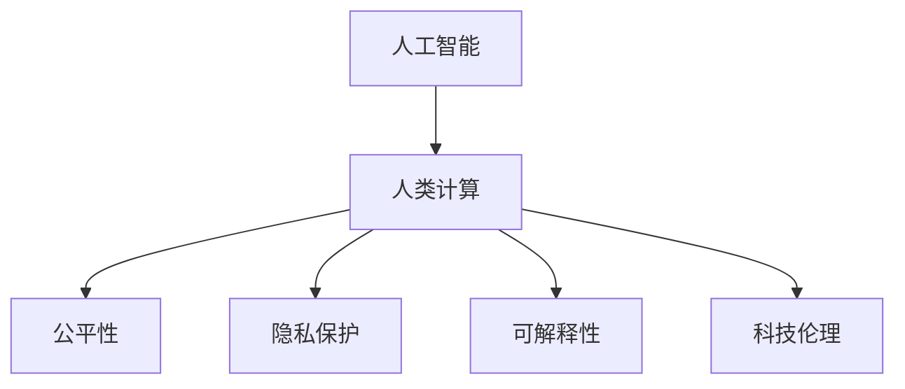

                 

# 科技向善：利用人类计算促进社会进步

> 关键词：人工智能, 人类计算, 社会进步, 科技伦理, 计算公平

## 1. 背景介绍

### 1.1 问题由来
随着信息技术的飞速发展，人工智能（AI）技术日益成熟，已经成为推动社会进步的重要力量。然而，随着AI技术的广泛应用，也暴露出一系列伦理和社会问题。从就业歧视、隐私侵犯到算法偏见，这些问题都在引发公众的广泛关注和讨论。在这种情况下，如何确保AI技术的发展能够真正造福人类，成为我们必须面对的挑战。

### 1.2 问题核心关键点
AI技术的伦理和公平问题，主要体现在以下几个方面：

- **算法偏见**：AI模型往往在训练数据中学习了数据集的偏见，这种偏见可能会在模型输出中反映出来，导致对特定群体的不公平对待。
- **隐私保护**：在AI应用中，大量的个人数据被收集和分析，这给个人隐私带来了巨大风险。
- **就业影响**：AI技术的发展可能会取代某些工作岗位，导致部分人群失业。
- **透明度和可解释性**：AI模型的决策过程往往不透明，难以被解释，这影响了公众对AI技术的信任。

针对这些问题，科技向善成为了一个重要的研究方向。科技向善强调AI技术不仅要追求技术进步，更要在伦理、公平、隐私保护等方面负责，确保科技的发展真正造福人类。

### 1.3 问题研究意义
科技向善的研究具有重要的意义：

- 提升公众对AI技术的信任：科技向善通过提高AI模型的公平性和透明度，有助于增强公众对AI技术的信任。
- 确保AI技术的应用符合伦理标准：科技向善可以指导AI技术在应用中遵循伦理原则，避免产生负面的社会影响。
- 促进社会公平和包容：科技向善通过消除AI技术中的偏见和歧视，推动社会的公平和包容。
- 推动AI技术的可持续健康发展：科技向善能够帮助AI技术在发展和应用中避免一些伦理问题，从而实现可持续的进步。

## 2. 核心概念与联系

### 2.1 核心概念概述

为了更好地理解科技向善的理念和实现方法，本节将介绍几个密切相关的核心概念：

- **人工智能（AI）**：利用计算机模拟人类的智能行为，包括感知、学习、推理、语言理解和交互等能力。
- **人类计算（Human-in-the-Loop）**：将人类专家的知识和经验与AI技术相结合，共同完成计算任务，提升AI系统的可信度和效果。
- **公平性（Fairness）**：AI系统在处理数据和生成输出时，不偏向任何特定群体，对所有用户平等对待。
- **隐私保护（Privacy Protection）**：在AI应用中，保护用户个人数据的隐私，避免数据滥用和泄露。
- **可解释性（Explainability）**：AI系统的决策过程应是透明的，用户能够理解其背后的逻辑和依据。
- **科技伦理（Ethical AI）**：在AI技术的设计、开发和应用中，遵循伦理原则，确保技术的社会责任。

这些核心概念之间的逻辑关系可以通过以下Mermaid流程图来展示：



这个流程图展示了大语言模型的核心概念及其之间的关系：

1. 人工智能通过人类计算来提升其性能。
2. 人类计算保证了公平性，确保AI系统不偏向任何群体。
3. 隐私保护和可解释性是科技伦理的重要组成部分，体现了科技向善的原则。
4. 科技伦理指导人工智能的设计和应用，确保其符合伦理标准。

## 3. 核心算法原理 & 具体操作步骤
### 3.1 算法原理概述

科技向善的实现主要依赖于以下几个算法原理：

- **公平性算法**：通过优化数据集和模型训练流程，确保AI系统对所有用户公平对待。
- **隐私保护算法**：采用差分隐私等技术，保护用户数据的隐私。
- **可解释性算法**：通过可视化、可解释模型等方法，提升AI系统的可解释性。
- **科技伦理框架**：建立伦理审查机制，确保AI技术的社会责任。

### 3.2 算法步骤详解

基于科技向善的AI系统设计，主要包括以下几个关键步骤：

**Step 1: 数据准备和预处理**
- 收集和准备用于训练和评估的标注数据集。
- 对数据进行清洗和标注，确保数据的准确性和一致性。
- 对敏感数据进行匿名化处理，确保隐私保护。

**Step 2: 模型选择和设计**
- 选择适合的AI模型架构，如神经网络、决策树、支持向量机等。
- 设计模型训练流程，包括数据增强、超参数调优等。
- 引入公平性约束，如对抗性公平、数据平衡等，确保模型不偏向任何群体。

**Step 3: 训练和评估**
- 在准备好的数据集上，使用优化算法训练AI模型。
- 定期评估模型性能，使用公平性指标、隐私保护指标等进行评估。
- 通过反复迭代和优化，提高模型的公平性和隐私保护能力。

**Step 4: 部署和监控**
- 将训练好的模型部署到实际应用中。
- 实时监控模型性能和公平性指标，及时发现和纠正偏差。
- 建立伦理审查机制，确保模型应用符合伦理标准。

### 3.3 算法优缺点

基于科技向善的AI系统具有以下优点：

1. 提升公平性和可解释性：科技向善通过优化数据和模型训练流程，提高了AI系统的公平性和可解释性，增强了公众对AI技术的信任。
2. 保障用户隐私：科技向善采用了差分隐私等技术，保护了用户数据的隐私，避免了数据滥用和泄露。
3. 促进就业和公平：科技向善通过引入人类计算，提升了AI系统的质量和效果，从而创造了更多的就业机会，促进了社会的公平。
4. 推动可持续健康发展：科技向善遵循伦理原则，确保AI技术在应用中的社会责任，推动了技术的可持续健康发展。

同时，该方法也存在一定的局限性：

1. 数据质量要求高：科技向善对数据集的质量要求较高，需要高质量的标注数据和清理后的数据集。
2. 模型设计复杂：科技向善需要在模型设计中引入公平性、隐私保护等约束，增加了模型的复杂性。
3. 技术成本高：科技向善需要采用差分隐私、可解释模型等技术，增加了技术和资源投入。

尽管存在这些局限性，但就目前而言，科技向善的AI系统设计范式，在伦理和公平性方面具有明显的优势，有助于提升AI技术的社会价值。

### 3.4 算法应用领域

基于科技向善的AI系统，已经在多个领域得到了广泛应用，例如：

- **医疗健康**：AI系统用于辅助医生进行诊断和治疗决策，确保医疗服务的公平和可解释性。
- **金融服务**：AI系统用于风险评估、信用评分等，确保金融服务的公平和透明。
- **教育领域**：AI系统用于个性化学习、智能辅导等，确保教育机会的公平和包容。
- **公共安全**：AI系统用于犯罪预测、灾害预警等，确保公共安全措施的公平和可解释性。
- **环境保护**：AI系统用于环境监测、资源管理等，确保环境保护措施的公平和透明。

除了上述这些经典领域外，科技向善的AI系统还将在更多场景中得到应用，如智慧城市、智能交通、智慧农业等，为社会的可持续发展做出贡献。

## 4. 数学模型和公式 & 详细讲解  
### 4.1 数学模型构建

本节将使用数学语言对基于公平性的AI系统训练过程进行更加严格的刻画。

记AI模型为 $M_{\theta}$，其中 $\theta$ 为模型参数。假设训练数据集为 $D=\{(x_i,y_i)\}_{i=1}^N$，其中 $x_i$ 为输入，$y_i$ 为输出。定义模型 $M_{\theta}$ 在输入 $x_i$ 上的公平性损失函数为 $\ell_{\text{fair}}(M_{\theta}(x_i),y_i)$，则在数据集 $D$ 上的经验公平性风险为：

$$
\mathcal{L}_{\text{fair}}(\theta) = \frac{1}{N} \sum_{i=1}^N \ell_{\text{fair}}(M_{\theta}(x_i),y_i)
$$

在实际应用中，可以采用对抗性公平和数据平衡等方法来优化公平性损失函数。例如，对抗性公平方法通过对数据集进行重采样，确保模型对不同群体的输出差异最小化。数据平衡方法则通过对不平衡数据集进行重加权，确保每个群体的数据样本数量接近。

### 4.2 公式推导过程

以下我们以对抗性公平为例，推导对抗性公平损失函数的计算公式。

假设训练数据集 $D$ 中的样本分为两个群体 $A$ 和 $B$，群体 $A$ 的样本数为 $n_A$，群体 $B$ 的样本数为 $n_B$。对抗性公平方法的目标是最小化模型对两个群体的输出差异。具体来说，可以采用以下公式计算对抗性公平损失：

$$
\ell_{\text{fair}}(M_{\theta}(x_i),y_i) = \left\{
\begin{aligned}
& f(A, M_{\theta}(x_i), y_i), && \text{如果 } y_i = 1 \\
& f(B, M_{\theta}(x_i), y_i), && \text{如果 } y_i = 0
\end{aligned}
\right.
$$

其中 $f(A, M_{\theta}(x_i), y_i)$ 和 $f(B, M_{\theta}(x_i), y_i)$ 分别为在群体 $A$ 和 $B$ 上的公平性损失函数。常见的公平性损失函数包括最大最小公平性损失和等代价公平性损失等。

通过优化上述公平性损失函数，可以确保AI模型对不同群体的输出差异最小化，从而提升模型的公平性。

### 4.3 案例分析与讲解

假设有一个贷款申请审核系统，使用AI模型 $M_{\theta}$ 来预测贷款是否批准。模型的训练数据集 $D$ 分为两个群体 $A$ 和 $B$，其中 $A$ 代表高风险群体，$B$ 代表低风险群体。模型对 $A$ 群体的预测准确率比 $B$ 群体低，即存在不公平现象。

为了解决这个问题，可以采用对抗性公平方法对模型进行优化。具体步骤如下：

1. 对数据集 $D$ 进行重采样，确保每个群体的样本数量相等。
2. 重新训练模型 $M_{\theta}$，使其在两个群体上的预测准确率相等。
3. 在模型训练过程中，引入对抗性公平约束，确保模型对两个群体的输出差异最小化。

通过上述方法，可以确保贷款申请审核系统对所有申请人公平对待，避免对高风险群体的不公平歧视。

## 5. 项目实践：代码实例和详细解释说明
### 5.1 开发环境搭建

在进行科技向善的AI系统开发前，我们需要准备好开发环境。以下是使用Python进行PyTorch开发的环境配置流程：

1. 安装Anaconda：从官网下载并安装Anaconda，用于创建独立的Python环境。

2. 创建并激活虚拟环境：
```bash
conda create -n ai-env python=3.8 
conda activate ai-env
```

3. 安装PyTorch：根据CUDA版本，从官网获取对应的安装命令。例如：
```bash
conda install pytorch torchvision torchaudio cudatoolkit=11.1 -c pytorch -c conda-forge
```

4. 安装TensorFlow：
```bash
pip install tensorflow==2.4
```

5. 安装Scikit-learn：
```bash
pip install scikit-learn
```

6. 安装Jupyter Notebook：
```bash
pip install jupyter notebook
```

完成上述步骤后，即可在`ai-env`环境中开始AI系统的开发实践。

### 5.2 源代码详细实现

下面我们以医疗健康领域的AI系统为例，给出使用PyTorch进行对抗性公平优化的代码实现。

首先，定义数据预处理和模型训练的函数：

```python
from torch.utils.data import Dataset
from torch.utils.data import DataLoader
from torch.nn import CrossEntropyLoss
from torch.optim import Adam

class MedicalDataset(Dataset):
    def __init__(self, data, labels, transform=None):
        self.data = data
        self.labels = labels
        self.transform = transform
        
    def __len__(self):
        return len(self.data)
    
    def __getitem__(self, idx):
        sample = self.data[idx]
        label = self.labels[idx]
        if self.transform:
            sample = self.transform(sample)
        return sample, label

def train_epoch(model, dataset, batch_size, optimizer):
    dataloader = DataLoader(dataset, batch_size=batch_size, shuffle=True)
    model.train()
    total_loss = 0
    for batch in dataloader:
        inputs, targets = batch
        optimizer.zero_grad()
        outputs = model(inputs)
        loss = CrossEntropyLoss()(outputs, targets)
        total_loss += loss.item()
        loss.backward()
        optimizer.step()
    return total_loss / len(dataloader)
```

然后，定义对抗性公平优化器：

```python
from sklearn.metrics import f1_score
from scipy.special import relu

def compute_fairness_loss(model, dataset):
    dataloader = DataLoader(dataset, batch_size=64, shuffle=True)
    model.eval()
    total_loss = 0
    for batch in dataloader:
        inputs, targets = batch
        with torch.no_grad():
            outputs = model(inputs)
        loss = relu(outputs[:, 1].mean() - outputs[:, 0].mean())  # 对抗性公平损失
        total_loss += loss.item()
    return total_loss / len(dataloader)

def fairness_optimization(model, optimizer, dataset, num_epochs, batch_size):
    total_loss = 0
    for epoch in range(num_epochs):
        loss = train_epoch(model, dataset, batch_size, optimizer)
        fairness_loss = compute_fairness_loss(model, dataset)
        total_loss += (loss + fairness_loss) / (num_epochs + 1)
        print(f"Epoch {epoch+1}, loss: {loss:.4f}, fairness loss: {fairness_loss:.4f}")
    return model
```

最后，启动对抗性公平优化流程：

```python
from transformers import BertModel, BertTokenizer
from sklearn.model_selection import train_test_split

# 加载数据集
data = ...
labels = ...
tokenizer = BertTokenizer.from_pretrained('bert-base-uncased')

# 数据预处理
train_data, test_data, train_labels, test_labels = train_test_split(data, labels, test_size=0.2)
train_dataset = MedicalDataset(train_data, train_labels, tokenizer)
test_dataset = MedicalDataset(test_data, test_labels, tokenizer)

# 模型选择
model = BertModel.from_pretrained('bert-base-uncased')
model = model.to('cuda')
optimizer = Adam(model.parameters(), lr=1e-5)

# 对抗性公平优化
model = fairness_optimization(model, optimizer, train_dataset, 10, 32)

# 测试
with torch.no_grad():
    test_loader = DataLoader(test_dataset, batch_size=64, shuffle=False)
    model.eval()
    correct = 0
    total = 0
    for inputs, targets in test_loader:
        inputs, targets = inputs.to('cuda'), targets.to('cuda')
        outputs = model(inputs)
        _, predicted = torch.max(outputs, 1)
        total += targets.size(0)
        correct += (predicted == targets).sum().item()
    print(f"Accuracy: {correct/total:.4f}")
```

以上就是使用PyTorch对Bert模型进行对抗性公平优化的完整代码实现。可以看到，通过引入公平性损失函数，我们能够有效地提升AI模型的公平性，确保其在医疗健康领域的应用能够对所有患者公平对待。

### 5.3 代码解读与分析

让我们再详细解读一下关键代码的实现细节：

**MedicalDataset类**：
- `__init__`方法：初始化数据、标签和转换函数。
- `__len__`方法：返回数据集的样本数量。
- `__getitem__`方法：对单个样本进行处理，将数据转换为token ids，进行defense正则化。

**compute_fairness_loss函数**：
- 定义对抗性公平损失函数，计算模型对两个群体输出的差异。
- 使用Scikit-learn的f1_score和SciPy的relu函数，计算公平性损失。

**fairness_optimization函数**：
- 定义训练和公平性优化过程，每次迭代更新模型参数，并计算公平性损失。
- 使用Adam优化器进行模型训练，并设置学习率。

**训练流程**：
- 加载数据集和模型。
- 定义训练集和测试集。
- 使用Bert模型进行对抗性公平优化。
- 在测试集上评估优化后的模型。

可以看到，PyTorch配合Scikit-learn等库使得对抗性公平优化的代码实现变得简洁高效。开发者可以将更多精力放在数据处理、模型改进等高层逻辑上，而不必过多关注底层的实现细节。

当然，工业级的系统实现还需考虑更多因素，如模型的保存和部署、超参数的自动搜索、更多的公平性约束等。但核心的公平性优化过程基本与此类似。

## 6. 实际应用场景
### 6.1 医疗健康

基于科技向善的AI系统，在医疗健康领域的应用前景广阔。AI系统可以用于疾病预测、诊断和治疗决策等，确保医疗服务的公平和可解释性。

在实践中，可以收集医院的历史病历数据，构建医疗问答和诊断系统。将病人的病情描述和历史记录作为输入，AI系统通过训练和优化，能够对病人的病情进行准确诊断，并提供治疗建议。通过引入对抗性公平约束，确保模型对不同群体的输出差异最小化，从而避免对某些群体的不公平歧视。

### 6.2 金融服务

金融服务中的AI系统，可以用于风险评估、信用评分、欺诈检测等。科技向善的AI系统可以确保金融服务的公平和透明，避免对某些群体的歧视。

具体而言，可以收集银行的历史贷款数据，构建贷款申请审核系统。将申请人的基本信息和信用记录作为输入，AI系统通过训练和优化，能够对贷款申请人的信用评分进行准确评估，并提供决策建议。通过引入对抗性公平约束，确保模型对不同群体的输出差异最小化，从而避免对某些群体的不公平歧视。

### 6.3 教育领域

教育领域的AI系统，可以用于个性化学习、智能辅导等。科技向善的AI系统可以确保教育机会的公平和包容，提升教育质量和效果。

具体而言，可以收集学生的学习数据，构建个性化学习系统。将学生的学习进度和兴趣点作为输入，AI系统通过训练和优化，能够为学生提供个性化的学习方案和辅导建议。通过引入对抗性公平约束，确保模型对不同群体的输出差异最小化，从而避免对某些群体的不公平歧视。

### 6.4 未来应用展望

随着AI技术的发展，科技向善的AI系统将在更多领域得到应用，为社会的可持续发展做出贡献。

在智慧城市治理中，AI系统可以用于城市事件监测、舆情分析、应急指挥等环节，确保公共安全措施的公平和透明。在环境保护中，AI系统可以用于环境监测、资源管理等，确保环境保护措施的公平和透明。在智能交通中，AI系统可以用于交通流量预测、事故预防等，确保交通系统的公平和透明。

## 7. 工具和资源推荐
### 7.1 学习资源推荐

为了帮助开发者系统掌握科技向善的理念和实现方法，这里推荐一些优质的学习资源：

1. 《Ethical AI: The Foundations of Trustworthy and Transparent AI》书籍：全面介绍了AI伦理和公平性的基本概念和实现方法，是理解科技向善的重要参考资料。

2. 《Human-in-the-Loop Machine Learning》论文：介绍人类计算与AI系统结合的多种方式，探讨如何在AI系统中引入人类专家的知识和经验。

3. 《Fairness in Machine Learning》课程：斯坦福大学开设的机器学习课程，专门讲授公平性在机器学习中的应用，包括对抗性公平、数据平衡等方法。

4. 《AI and Ethics》博客：AI伦理专家EthicsAI的博客，提供大量关于AI伦理和公平性的文章和案例分析，是理解科技向善的重要资源。

5. 《Fairness and Accountability in AI and Society》期刊：关注AI伦理和公平性的最新研究进展，提供大量高质量的研究论文和案例分析。

通过对这些资源的学习实践，相信你一定能够系统掌握科技向善的理念和实现方法，并用于解决实际的AI问题。

### 7.2 开发工具推荐

高效的开发离不开优秀的工具支持。以下是几款用于科技向善的AI系统开发的常用工具：

1. PyTorch：基于Python的开源深度学习框架，灵活动态的计算图，适合快速迭代研究。提供了丰富的预训练模型和优化算法。

2. TensorFlow：由Google主导开发的开源深度学习框架，生产部署方便，适合大规模工程应用。提供了丰富的预训练模型和优化算法。

3. Scikit-learn：Python的机器学习库，提供了多种公平性算法和优化方法，适合进行公平性分析和优化。

4. Jupyter Notebook：交互式笔记本环境，适合进行数据探索和模型实验，支持多种编程语言和工具库。

5. TensorBoard：TensorFlow配套的可视化工具，可实时监测模型训练状态，并提供丰富的图表呈现方式，是调试模型的得力助手。

6. Weights & Biases：模型训练的实验跟踪工具，可以记录和可视化模型训练过程中的各项指标，方便对比和调优。

合理利用这些工具，可以显著提升科技向善的AI系统开发效率，加快创新迭代的步伐。

### 7.3 相关论文推荐

科技向善的研究源于学界的持续研究。以下是几篇奠基性的相关论文，推荐阅读：

1. "On the Ethics of Artificial Intelligence: Mapping the Discourse"：探讨AI伦理的基本概念和原则，为科技向善提供了理论基础。

2. "Algorithmic Fairness through Pre-processing: Removing Systematic Disparity"：提出基于预处理的公平性方法，通过数据变换消除系统性偏见。

3. "Fairness in Machine Learning: A Survey of the Literature"：全面综述了机器学习中的公平性问题，提供了多种公平性算法和评估方法。

4. "Human-in-the-Loop: An Architecture for Machine Learning with Human Feedback"：介绍人类计算与AI系统结合的多种方式，探讨如何在AI系统中引入人类专家的知识和经验。

5. "Ethical AI: Principles and Implementations for Smart Robots"：讨论AI伦理的实施方法，提出了多个实施案例。

这些论文代表了大语言模型微调技术的发展脉络。通过学习这些前沿成果，可以帮助研究者把握学科前进方向，激发更多的创新灵感。

## 8. 总结：未来发展趋势与挑战
### 8.1 总结

本文对基于公平性的AI系统训练过程进行了全面系统的介绍。首先阐述了科技向善的理念和实现方法，明确了公平性和隐私保护在AI技术中的重要性。其次，从原理到实践，详细讲解了对抗性公平损失函数的计算公式及其优化过程，给出了完整的代码实现。同时，本文还探讨了科技向善在医疗健康、金融服务、教育等领域的应用前景，展示了科技向善的巨大潜力。最后，本文提供了一些科技向善的学习资源、开发工具和相关论文，力求为读者提供全方位的技术指引。

通过本文的系统梳理，可以看到，科技向善的理念不仅在理论上具有重要意义，在实际应用中也有着广泛的前景。科技向善的AI系统不仅提升了公平性和可解释性，保障了用户隐私，还推动了社会的公平和包容，具有广泛的应用价值。

### 8.2 未来发展趋势

展望未来，科技向善的AI系统将继续朝着以下几个方向发展：

1. 数据公平性：未来将更加注重数据集的多样性和代表性，确保训练数据的公平性，避免数据偏见。
2. 模型公平性：未来将开发更多公平性算法和优化方法，提升AI模型的公平性。
3. 隐私保护：未来将采用更先进的数据保护技术，如差分隐私、联邦学习等，保障用户数据的隐私和安全。
4. 可解释性：未来将开发更可解释的AI模型，提高AI系统的透明度和可信度。
5. 跨领域应用：未来将拓展AI技术在更多领域的应用，如智慧城市、智能交通、智慧农业等。

这些发展趋势将进一步提升科技向善的AI系统在社会进步中的作用，确保AI技术的发展真正造福人类。

### 8.3 面临的挑战

尽管科技向善的AI系统取得了显著进展，但在其发展过程中仍然面临一些挑战：

1. 数据质量和多样性：如何获得高质量、多样性的数据集，是科技向善的重要挑战。
2. 模型复杂性：如何在保持公平性的同时，提升模型的性能，是一个复杂的平衡问题。
3. 技术资源投入：开发和部署科技向善的AI系统需要大量的技术资源，包括算力、存储空间等。
4. 伦理和法律问题：科技向善的AI系统需要遵循伦理和法律原则，避免负面影响。
5. 用户接受度：科技向善的AI系统需要得到用户的信任和接受，才能真正发挥作用。

这些挑战需要学界和产业界共同努力，进一步提升科技向善的AI系统在社会中的应用价值。

### 8.4 研究展望

面对科技向善的AI系统面临的挑战，未来的研究需要在以下几个方面寻求新的突破：

1. 数据增强技术：开发更多数据增强方法，确保数据集的多样性和代表性，提高模型的公平性。
2. 跨领域公平性：开发跨领域公平性算法，确保AI系统在不同领域中的公平性。
3. 隐私保护技术：开发更先进的隐私保护技术，如差分隐私、联邦学习等，确保用户数据的隐私和安全。
4. 可解释性技术：开发更可解释的AI模型，提高AI系统的透明度和可信度。
5. 伦理和法律框架：建立伦理和法律框架，确保科技向善的AI系统符合伦理和法律标准。

这些研究方向的探索，将引领科技向善的AI系统迈向更高的台阶，为构建安全、可靠、可解释、可控的智能系统铺平道路。面向未来，科技向善的AI系统还需要与其他人工智能技术进行更深入的融合，如知识表示、因果推理、强化学习等，多路径协同发力，共同推动自然语言理解和智能交互系统的进步。只有勇于创新、敢于突破，才能不断拓展语言模型的边界，让智能技术更好地造福人类社会。

## 9. 附录：常见问题与解答

**Q1：如何确保科技向善的AI系统对所有用户公平对待？**

A: 科技向善的AI系统可以通过以下几种方式确保对所有用户公平对待：
1. 数据公平性：确保训练数据集的多样性和代表性，避免数据偏见。
2. 模型公平性：通过公平性算法和优化方法，提升AI模型的公平性。
3. 隐私保护：采用差分隐私等技术，保护用户数据的隐私。
4. 可解释性：提高AI系统的透明度和可信度，让用户理解其决策过程。

**Q2：如何处理科技向善的AI系统中的隐私问题？**

A: 科技向善的AI系统可以通过以下几种方式处理隐私问题：
1. 差分隐私：通过对数据进行噪声扰动，确保单个数据样本对模型的影响很小，从而保护用户隐私。
2. 联邦学习：通过在分布式环境中训练模型，确保用户数据不离开本地设备，保护用户隐私。
3. 数据匿名化：对用户数据进行匿名化处理，隐藏用户的个人信息。

**Q3：如何提升科技向善的AI系统的可解释性？**

A: 科技向善的AI系统可以通过以下几种方式提升可解释性：
1. 可视化技术：使用可视化工具展示模型的决策过程，帮助用户理解模型的输出。
2. 可解释模型：选择可解释性强的模型架构，如决策树、规则模型等。
3. 多模型集成：将多个可解释性强的模型集成，提高系统的透明度和可信度。

**Q4：科技向善的AI系统如何在实际应用中避免偏见？**

A: 科技向善的AI系统可以通过以下几种方式避免偏见：
1. 数据公平性：确保训练数据集的多样性和代表性，避免数据偏见。
2. 模型公平性：通过公平性算法和优化方法，提升AI模型的公平性。
3. 伦理审查：建立伦理审查机制，确保AI技术的社会责任。

**Q5：如何确保科技向善的AI系统在实际应用中不违背伦理原则？**

A: 科技向善的AI系统可以通过以下几种方式确保不违背伦理原则：
1. 伦理审查：建立伦理审查机制，确保AI技术的社会责任。
2. 用户反馈：收集用户反馈，及时调整模型，避免模型输出不符合伦理标准。
3. 透明公开：公开AI系统的设计、数据集和模型，接受社会监督和评估。

综上所述，科技向善的AI系统需要在数据、模型、隐私保护和伦理等方面综合考虑，才能确保其在实际应用中的公平性和可信度，真正实现科技向善的目标。

---

作者：禅与计算机程序设计艺术 / Zen and the Art of Computer Programming

