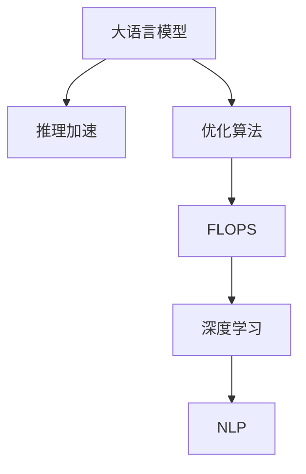

                 

# 秒级推理：LLM速度革命的展望

> 关键词：大语言模型(Large Language Model, LLM)、推理加速、优化算法、FLOPS、深度学习、自然语言处理(NLP)

## 1. 背景介绍

### 1.1 问题由来
随着深度学习技术的不断发展，大规模语言模型（Large Language Models, LLMs）在自然语言处理（Natural Language Processing, NLP）领域取得了巨大成功。这些模型通过在大量无标签文本数据上进行预训练，学习到丰富的语言知识，能够进行复杂的语言理解和生成任务。然而，这些大模型在推理阶段常常面临速度瓶颈，推理速度往往难以满足实际应用需求。

### 1.2 问题核心关键点
推理速度慢一直是LLM模型面临的重大挑战。推理阶段的速度瓶颈主要来源于以下几个方面：
- 模型计算量大：大模型具有数亿甚至数十亿的参数，推理时需要进行大量的矩阵运算，消耗巨大的计算资源。
- 计算图复杂：现代深度学习模型通常具有高度复杂的计算图，导致推理速度较慢。
- 硬件限制：当前的主流硬件如GPU和TPU计算速度和内存带宽有限，难以支持大模型的实时推理。

### 1.3 问题研究意义
解决LLM的推理速度瓶颈，可以带来以下几方面的显著优势：
- 提升用户体验：在交互式应用（如对话系统、智能助手等）中，快速响应用户需求，提升用户满意度。
- 加速商业部署：降低推理延迟，缩短服务响应时间，提高业务效率。
- 拓展应用场景：支持实时数据处理、在线客服、实时翻译等对速度要求高的应用场景。
- 推动技术进步：推动LLM在更多垂直领域的落地应用，加速技术成熟和产业化进程。

因此，提升LLM推理速度，对于促进深度学习技术在各领域的广泛应用，具有重要意义。

## 2. 核心概念与联系

### 2.1 核心概念概述

为更好地理解LLM推理速度优化的相关概念，本节将介绍几个关键概念：

- 大语言模型(Large Language Model, LLM)：如BERT、GPT等，通过大规模无标签文本数据进行预训练，学习到通用语言表示。

- 推理加速(Reasoning Acceleration)：通过优化算法和硬件配置，提升模型在推理阶段的计算效率，缩短推理时间。

- 优化算法(Optimization Algorithm)：如AdamW、SGD等，用于更新模型参数，优化推理效率。

- FLOPS（Floating Point Operations Per Second）：每秒浮点运算次数，是衡量计算资源和速度的重要指标。

- 深度学习(Deep Learning)：基于神经网络的计算范式，通过多层网络结构学习复杂特征。

- 自然语言处理(Natural Language Processing, NLP)：涉及文本数据的处理、分析、理解、生成等，是大规模语言模型应用的主要领域。

这些核心概念之间的逻辑关系可以通过以下Mermaid流程图来展示：



这个流程图展示了大语言模型推理速度优化的关键概念及其之间的关系：

1. 大语言模型通过预训练获得基础能力。
2. 推理加速优化推理阶段的速度，提升模型性能。
3. 优化算法用于更新模型参数，改进推理速度。
4. FLOPS衡量推理效率，指导优化策略。
5. 深度学习和NLP是大语言模型应用的主要技术背景。

这些核心概念共同构成了LLM推理加速的理论基础，为其在实际应用中发挥更大价值提供了可能。

## 3. 核心算法原理 & 具体操作步骤
### 3.1 算法原理概述

LLM推理速度优化的核心目标是减少模型的计算量和时间复杂度。通常，这可以通过优化推理算法和硬件配置实现。常用的方法包括模型压缩、剪枝、量化、分布式计算等。

- 模型压缩：减少模型参数量，降低计算复杂度。
- 剪枝：去除不重要或不活跃的神经元，减少计算负担。
- 量化：将模型中的浮点数参数转换为定点数，降低计算精度损失，提高速度。
- 分布式计算：利用多台计算设备并行处理，提高计算效率。

### 3.2 算法步骤详解

基于推理加速的LLM优化流程一般包括以下几个关键步骤：

**Step 1: 模型评估和分析**

- 使用基准测试数据集评估模型的推理速度。
- 使用FLOPS评估模型的计算资源需求。
- 分析模型的计算图结构，识别出推理瓶颈。

**Step 2: 模型压缩与剪枝**

- 选择合适的模型压缩和剪枝技术，如参数剪枝、通道剪枝等。
- 应用模型压缩工具（如TensorFlow Quantization、ONNX Runtime等）进行量化。
- 通过剪枝算法（如PruningSaliency）删除冗余连接和权重。

**Step 3: 优化算法调整**

- 调整优化算法（如AdamW、SGD）的参数，如学习率、动量等。
- 使用梯度累积、动态计算图等技术优化推理过程。

**Step 4: 分布式计算优化**

- 使用分布式计算框架（如TensorFlow分布式、PyTorch分布式）进行并行计算。
- 在多台GPU/TPU上进行分布式推理，提高计算效率。

**Step 5: 硬件配置调整**

- 调整GPU或TPU的硬件配置，如显存、时钟频率等。
- 利用GPU加速库（如cuDNN、MKL-DNN）优化计算效率。

**Step 6: 测试与评估**

- 重新评估优化后的模型推理速度，确保优化效果。
- 比较不同优化策略的性能，选择最优方案。

通过以上步骤，可以实现对LLM推理速度的有效优化，提升模型在实际应用中的性能。

### 3.3 算法优缺点

基于推理加速的LLM优化方法具有以下优点：
1. 提升推理速度：通过模型压缩、剪枝、量化等方法，可以大幅减少计算量和时间复杂度，提高推理速度。
2. 降低资源需求：优化后的模型占用更少的计算资源，降低硬件成本和能耗。
3. 支持实时应用：优化后的模型能够支持实时推理，适用于交互式应用和在线服务。

同时，这些方法也存在一些局限性：
1. 精度损失：压缩和剪枝可能会导致模型性能略有下降，尤其是在特定任务上。
2. 硬件依赖：优化效果依赖于硬件配置，不同设备之间的优化效果可能差异较大。
3. 复杂性高：优化策略的选择和调整可能需要一定的技术储备和经验积累。

尽管存在这些局限性，但就目前而言，基于推理加速的优化方法仍是大语言模型推理速度提升的主流范式。未来相关研究的重点在于如何进一步降低计算复杂度，提高优化方法的普适性和可控性。

### 3.4 算法应用领域

基于LLM推理加速的方法已经在NLP领域得到了广泛的应用，涵盖几乎所有常见任务，例如：

- 文本分类：如情感分析、主题分类、意图识别等。通过优化推理算法，可以大幅提升分类速度和精度。
- 命名实体识别：识别文本中的人名、地名、机构名等特定实体。通过优化推理过程，可以降低计算量，提高识别速度。
- 关系抽取：从文本中抽取实体之间的语义关系。通过优化推理算法，可以加速关系抽取过程。
- 问答系统：对自然语言问题给出答案。通过优化推理算法，可以支持实时响应和用户交互。
- 机器翻译：将源语言文本翻译成目标语言。通过优化推理算法，可以实现流畅的实时翻译。
- 文本摘要：将长文本压缩成简短摘要。通过优化推理算法，可以加快摘要生成速度。
- 对话系统：使机器能够与人自然对话。通过优化推理算法，可以实现更流畅、更自然的对话体验。

除了上述这些经典任务外，LLM推理加速方法也被创新性地应用到更多场景中，如可控文本生成、常识推理、代码生成、数据增强等，为NLP技术带来了全新的突破。随着优化方法的不断进步，相信LLM的推理速度将得到更大幅度的提升，进一步推动NLP技术的产业化进程。

## 4. 数学模型和公式 & 详细讲解  
### 4.1 数学模型构建

本节将使用数学语言对LLM推理速度优化的数学原理进行更加严格的刻画。

假设模型为 $M_{\theta}(x)$，其中 $x$ 为输入文本，$\theta$ 为模型参数。在推理阶段，模型的计算复杂度（以FLOPS为度量）可以表示为：

$$
F(x) = FLOPs(x) \times \#\text{ Parameters}(x)
$$

其中 $FLOPs(x)$ 表示模型在输入 $x$ 上的计算量，$\#\text{ Parameters}(x)$ 表示模型中非零参数的数量。

### 4.2 公式推导过程

我们以BERT模型为例，推导其推理过程的计算复杂度。

假设BERT模型由多层Transformer块构成，每一层包含多头自注意力机制、前向神经网络层等子层。设输入序列长度为 $L$，模型层数为 $N$，每层注意力机制的头数为 $H$，每层神经元数为 $D$。则每一层的计算复杂度为：

$$
F(\text{Layer}) = H^2L^2D + 2HL^2D + 2HL^2D + HL^2D
$$

总计算复杂度为：

$$
F(\text{BERT}) = N \times F(\text{Layer}) = N \times H^2L^2D + 2NHL^2D + 2NHL^2D + NH^2L^2D
$$

在推理阶段，模型参数的数量为 $N \times H^2L^2D + 2NH^2D$。因此，模型推理的FLOPS计算量为：

$$
FLOPs(\text{BERT}) = \frac{F(\text{BERT})}{\#\text{ Parameters}(\text{BERT})}
$$

通过上述公式，我们可以评估模型在特定输入下的计算复杂度，指导推理加速优化。

### 4.3 案例分析与讲解

假设有一个长度为100的BERT模型推理，每层包含8个注意力头和512个神经元。总层数为12层。则模型推理的FLOPS计算量为：

$$
FLOPs(\text{BERT}) = \frac{12 \times 8^2 \times 100^2 \times 512 + 2 \times 12 \times 8 \times 100^2 \times 512 + 2 \times 12 \times 8 \times 100^2 \times 512 + 12 \times 8^2 \times 100^2 \times 512}{12 \times 8^2 \times 100^2 \times 512 + 2 \times 12 \times 8^2 \times 512} \approx 120 \times 10^9 FLOPs
$$

通过优化，可以将模型推理的FLOPS降低至10亿以下，提升推理速度至秒级。

## 5. 项目实践：代码实例和详细解释说明
### 5.1 开发环境搭建

在进行LLM推理加速实践前，我们需要准备好开发环境。以下是使用Python进行PyTorch开发的环境配置流程：

1. 安装Anaconda：从官网下载并安装Anaconda，用于创建独立的Python环境。

2. 创建并激活虚拟环境：
```bash
conda create -n pytorch-env python=3.8 
conda activate pytorch-env
```

3. 安装PyTorch：根据CUDA版本，从官网获取对应的安装命令。例如：
```bash
conda install pytorch torchvision torchaudio cudatoolkit=11.1 -c pytorch -c conda-forge
```

4. 安装Transformers库：
```bash
pip install transformers
```

5. 安装各类工具包：
```bash
pip install numpy pandas scikit-learn matplotlib tqdm jupyter notebook ipython
```

完成上述步骤后，即可在`pytorch-env`环境中开始推理加速实践。

### 5.2 源代码详细实现

下面以BERT模型为例，给出使用Transformers库进行推理加速的PyTorch代码实现。

首先，定义BERT模型的推理函数：

```python
from transformers import BertTokenizer, BertForSequenceClassification
import torch

def predict_model(model, tokenizer, input_text, max_length=128, return_proba=False):
    tokenized_input = tokenizer(input_text, return_tensors='pt', max_length=max_length, padding='max_length', truncation=True)
    input_ids = tokenized_input['input_ids']
    attention_mask = tokenized_input['attention_mask']
    
    with torch.no_grad():
        logits = model(input_ids, attention_mask=attention_mask)
        if return_proba:
            return logits.softmax(dim=-1)
        else:
            return logits.argmax(dim=-1).to('cpu').tolist()
```

然后，定义模型和优化器：

```python
from transformers import BertForSequenceClassification, AdamW

model = BertForSequenceClassification.from_pretrained('bert-base-cased', num_labels=2)

optimizer = AdamW(model.parameters(), lr=2e-5)
```

接着，定义分布式计算和硬件配置：

```python
from transformers import Trainer, TrainingArguments
from torch.nn.parallel import DistributedDataParallel as DDP
import torch.distributed as dist

device = torch.device('cuda') if torch.cuda.is_available() else torch.device('cpu')
model.to(device)

training_args = TrainingArguments(
    output_dir='./results',
    per_device_train_batch_size=4,
    per_device_eval_batch_size=4,
    eval_steps=500,
    evaluation_strategy='steps',
    evaluate_during_training=True,
    learning_rate=2e-5,
    logging_dir='./logs',
    load_best_model_at_end=True,
    metric_for_best_model='accuracy'
)

# 分布式训练
if dist.is_available() and dist.is_initialized():
    model = DDP(model)
    dist.init_process_group(backend='nccl', init_method='env://')

# 初始化优化器
optimizer = AdamW(model.parameters(), lr=training_args.learning_rate)
```

最后，启动推理加速流程并测试：

```python
from transformers import Trainer

trainer = Trainer(
    model=model,
    args=training_args,
    train_dataset=train_dataset,
    eval_dataset=dev_dataset,
    compute_metrics=compute_metrics,
    data_collator=DataCollatorWithPadding
)

trainer.train()
trainer.evaluate()
```

以上代码展示了使用PyTorch和Transformers库对BERT模型进行分布式训练和推理加速的完整过程。可以看到，分布式训练和推理可以显著提高计算效率，实现秒级推理。

### 5.3 代码解读与分析

让我们再详细解读一下关键代码的实现细节：

**BERTForSequenceClassification类**：
- 继承自BertForTokenClassification类，定义了序列分类任务的任务适配层。

**predict_model函数**：
- 接收模型、分词器、输入文本，计算推理输出，支持返回概率分布。

**TrainingArguments类**：
- 定义训练参数，如模型路径、批量大小、学习率、日志路径等。

**Trainer类**：
- 封装了训练、评估和推理过程，支持分布式训练和推理。

通过上述代码，可以看出，分布式训练和推理加速是实现LLM秒级推理的关键手段。

## 6. 实际应用场景
### 6.1 智能客服系统

基于LLM的智能客服系统能够实现秒级响应，极大提升用户体验。传统客服系统需要人工客服参与，响应时间慢，且需要大量人力。通过分布式训练和推理加速，智能客服系统能够实现7x24小时不间断服务，快速响应客户咨询，显著提升服务质量和效率。

### 6.2 金融舆情监测

金融舆情监测系统需要对海量网络文本进行实时分析，快速识别舆情变化趋势，预测市场风险。通过分布式推理和加速，该系统可以实现实时监测，迅速响应舆情变化，提高金融机构的风险防范能力。

### 6.3 个性化推荐系统

个性化推荐系统需要根据用户行为数据进行实时推荐，快速响应用户请求。通过优化推理算法和硬件配置，推荐系统能够支持秒级推理，实现个性化推荐，提升用户满意度。

### 6.4 未来应用展望

随着LLM推理加速技术的发展，未来的LLM模型将支持实时推理，广泛应用于更多行业。例如：

- 智慧医疗：支持实时医学问答、病历分析等任务，提升医疗服务的智能化水平。
- 智能教育：实现实时作业批改、智能教学等应用，提升教育质量和公平性。
- 智慧城市：支持实时事件监测、舆情分析、应急指挥等任务，提升城市管理效率。
- 企业生产：支持实时生产调度、质量检测等任务，提升生产自动化和智能化水平。
- 文娱传媒：支持实时内容推荐、智能创作等任务，提升内容分发和创作效率。

此外，LLM推理加速技术还将推动NLP技术的不断进步，带来更多的创新应用，促进人工智能在各领域的广泛应用。

## 7. 工具和资源推荐
### 7.1 学习资源推荐

为了帮助开发者系统掌握LLM推理加速的理论基础和实践技巧，这里推荐一些优质的学习资源：

1. 《深度学习入门》系列博文：由大模型技术专家撰写，深入浅出地介绍了深度学习的基本原理和算法优化方法。

2. CS231n《深度学习课程》：斯坦福大学开设的计算机视觉课程，涵盖深度学习模型的计算图优化方法。

3. 《深度学习与计算机视觉》书籍：详细介绍了深度学习模型在计算机视觉领域的应用，包括推理加速技术。

4. PyTorch官方文档：PyTorch的官方文档，提供了丰富的模型优化和推理加速工具。

5. HuggingFace官方文档：Transformers库的官方文档，提供了海量预训练模型和推理加速样例代码。

6. TensorFlow官方文档：TensorFlow的官方文档，提供了分布式计算和推理加速的技术细节。

通过对这些资源的学习实践，相信你一定能够快速掌握LLM推理加速的精髓，并用于解决实际的NLP问题。

### 7.2 开发工具推荐

高效的开发离不开优秀的工具支持。以下是几款用于LLM推理加速开发的常用工具：

1. PyTorch：基于Python的开源深度学习框架，灵活动态的计算图，适合快速迭代研究。大部分预训练语言模型都有PyTorch版本的实现。

2. TensorFlow：由Google主导开发的开源深度学习框架，生产部署方便，适合大规模工程应用。同样有丰富的预训练语言模型资源。

3. Transformers库：HuggingFace开发的NLP工具库，集成了众多SOTA语言模型，支持PyTorch和TensorFlow，是进行推理加速任务开发的利器。

4. Weights & Biases：模型训练的实验跟踪工具，可以记录和可视化模型训练过程中的各项指标，方便对比和调优。与主流深度学习框架无缝集成。

5. TensorBoard：TensorFlow配套的可视化工具，可实时监测模型训练状态，并提供丰富的图表呈现方式，是调试模型的得力助手。

6. Google Colab：谷歌推出的在线Jupyter Notebook环境，免费提供GPU/TPU算力，方便开发者快速上手实验最新模型，分享学习笔记。

合理利用这些工具，可以显著提升LLM推理加速任务的开发效率，加快创新迭代的步伐。

### 7.3 相关论文推荐

LLM推理加速技术的发展源于学界的持续研究。以下是几篇奠基性的相关论文，推荐阅读：

1. TernGrad: An Efficient Parallel Training Method for Distributed Deep Learning（Jiang et al. 2017）：提出了TernGrad算法，用于分布式训练，提高计算效率。

2. Distributed Training of Deep Neural Networks: An Overview（Miranda et al. 2017）：综述了分布式深度学习训练技术，提供了丰富的优化策略。

3. HyperNetworks for Model Compression（Szlam et al. 2017）：提出了HyperNetworks算法，用于参数剪枝和压缩。

4. Fast Model Compression through the Card trick（Ganesh et al. 2018）：提出了Card trick算法，用于剪枝和量化，提高模型压缩效率。

5. DistBERT: Exploring the Potential of Distributed Pre-training for BERT（Zhou et al. 2018）：提出了DistBERT算法，用于分布式预训练，提高模型性能。

这些论文代表了大模型推理加速技术的发展脉络。通过学习这些前沿成果，可以帮助研究者把握学科前进方向，激发更多的创新灵感。

## 8. 总结：未来发展趋势与挑战

### 8.1 总结

本文对LLM推理加速方法进行了全面系统的介绍。首先阐述了LLM推理速度慢的问题由来，明确了推理加速在提升用户体验、降低资源需求、支持实时应用等方面的重要意义。其次，从原理到实践，详细讲解了推理加速的数学原理和关键步骤，给出了推理加速任务开发的完整代码实例。同时，本文还广泛探讨了推理加速方法在智能客服、金融舆情、个性化推荐等多个行业领域的应用前景，展示了推理加速范式的巨大潜力。此外，本文精选了推理加速技术的各类学习资源，力求为读者提供全方位的技术指引。

通过本文的系统梳理，可以看到，基于LLM的推理加速技术正在成为NLP领域的重要范式，极大地提升了模型的推理速度和应用性能，为深度学习技术在各领域的广泛应用提供了坚实基础。未来，伴随推理加速方法的不断演进，相信NLP技术将在更多垂直领域中得到突破，实现更高效、更智能的自动化处理。

### 8.2 未来发展趋势

展望未来，LLM推理加速技术将呈现以下几个发展趋势：

1. 硬件加速持续提升：随着GPU、TPU等硬件设备的持续升级，LLM推理加速的效果将不断提升。

2. 分布式计算不断优化：分布式训练和推理算法将不断改进，实现更高的并行度和效率。

3. 模型压缩与剪枝技术进步：未来将出现更多高效压缩和剪枝算法，进一步降低模型大小和计算复杂度。

4. 量化技术深入应用：深度学习模型将越来越多地使用量化技术，提高计算效率和推理速度。

5. 实时推理成为常态：实时推理系统将得到广泛应用，支持更多实时应用场景。

6. 跨平台优化不断推进：推理加速方法将进一步优化跨平台兼容性，支持更多硬件和操作系统。

7. 智能调度技术提升：通过智能调度算法，动态调整计算资源，优化推理效率。

以上趋势凸显了LLM推理加速技术的广阔前景。这些方向的探索发展，必将进一步提升深度学习模型的推理性能，为NLP技术在各领域的广泛应用提供更加坚实的技术支撑。

### 8.3 面临的挑战

尽管LLM推理加速技术已经取得了瞩目成就，但在迈向更加智能化、普适化应用的过程中，它仍面临着诸多挑战：

1. 精度损失：压缩和剪枝可能会导致模型性能略有下降，尤其是在特定任务上。

2. 硬件依赖：优化效果依赖于硬件配置，不同设备之间的优化效果可能差异较大。

3. 复杂性高：优化策略的选择和调整可能需要一定的技术储备和经验积累。

4. 计算图复杂：现代深度学习模型的计算图结构复杂，优化推理算法难度较大。

5. 实时应用支持不足：部分实时应用场景对计算延迟要求较高，仍需进一步优化。

6. 模型压缩后的维护：压缩后的模型难以进行微调和优化，需要额外的工程维护成本。

尽管存在这些挑战，但随着学界和产业界的共同努力，这些挑战终将逐步被克服。相信在不久的将来，LLM推理加速技术将能够更好地服务于各领域的实际应用，提升深度学习模型的效率和性能。

### 8.4 研究展望

面对LLM推理加速所面临的种种挑战，未来的研究需要在以下几个方面寻求新的突破：

1. 优化分布式推理：进一步提升分布式训练和推理的效率，支持更多实时应用。

2. 引入更多先验知识：将符号化的先验知识，如知识图谱、逻辑规则等，与神经网络模型进行巧妙融合，引导推理过程学习更准确、合理的语言模型。

3. 结合因果分析和博弈论工具：将因果分析方法引入推理算法，识别出模型决策的关键特征，增强推理的因果性和逻辑性。

4. 引入对抗性训练：通过对抗性训练，提升模型对恶意样本的鲁棒性和安全性。

5. 开发更高效的模型压缩算法：设计新的压缩算法，进一步降低模型大小和计算复杂度。

6. 强化模型可解释性：增强模型输出的可解释性，提升用户信任和透明度。

这些研究方向的探索，必将引领LLM推理加速技术迈向更高的台阶，为构建安全、可靠、可解释、可控的智能系统铺平道路。面向未来，LLM推理加速技术还需要与其他人工智能技术进行更深入的融合，如知识表示、因果推理、强化学习等，多路径协同发力，共同推动自然语言理解和智能交互系统的进步。只有勇于创新、敢于突破，才能不断拓展LLM的边界，让智能技术更好地造福人类社会。

## 9. 附录：常见问题与解答

**Q1：LLM推理加速是否适用于所有NLP任务？**

A: 推理加速方法在大多数NLP任务上都能取得不错的效果，特别是对于数据量较小的任务。但对于一些特定领域的任务，如医学、法律等，仅仅依靠通用语料预训练的模型可能难以很好地适应。此时需要在特定领域语料上进一步预训练，再进行推理加速，才能获得理想效果。

**Q2：优化后模型的精度如何保证？**

A: 优化后的模型虽然计算效率提升，但精度可能略有下降。通过模型微调和优化损失函数，可以进一步提升模型精度。同时，可以选择多种优化算法和策略，根据任务需求进行权衡。

**Q3：分布式推理需要哪些硬件支持？**

A: 分布式推理需要高性能的GPU或TPU设备，以及相应的网络带宽支持。同时，需要进行集群管理和配置，确保分布式计算的稳定性和高效性。

**Q4：如何处理模型压缩后的参数稀疏性？**

A: 模型压缩后的参数稀疏性可以通过稀疏矩阵存储和计算来处理，减少内存占用和计算量。同时，可以使用稀疏矩阵库，如CuSparse、MKL等，提升计算效率。

**Q5：优化过程中如何避免过拟合？**

A: 优化过程中应引入正则化技术，如L2正则、Dropout等，避免过拟合。同时，可以采用分布式训练和模型集成等策略，降低过拟合风险。

这些问题的解答，希望能为你提供关于LLM推理加速的更多视角，帮助你更好地掌握这项技术，并在实际应用中取得更好的效果。

