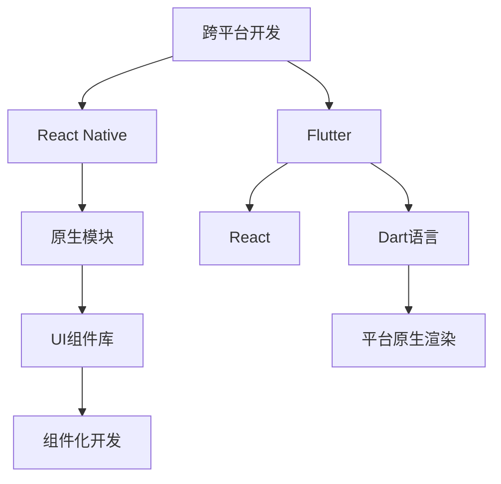

                 

# 移动端全栈开发：iOS和Android平台的统一解决方案

> 关键词：移动端全栈开发, iOS开发, Android开发, 跨平台开发, React Native, Flutter

## 1. 背景介绍

随着移动互联网的迅猛发展，智能手机、平板等移动设备已经成为人们日常生活中不可或缺的一部分。据Statista统计，全球移动设备用户总数预计在2024年将达到31.5亿，占全球总人口的41.5%。如此庞大的用户规模，催生了巨大的移动应用开发需求。

移动应用开发主要分为iOS和Android两大平台。iOS主要由苹果公司开发和维护，基于Objective-C和Swift语言，运行于苹果的iOS操作系统；而Android则由Google开发，基于Java和Kotlin语言，运行于安卓操作系统。两大平台在用户界面设计、开发工具、性能优化等方面存在明显差异，导致开发者需要掌握不同技术栈，分别学习iOS和Android开发。

在开发移动应用的过程中，平台间兼容性、代码重复性、开发效率等问题逐渐成为阻碍移动应用快速迭代和跨平台部署的瓶颈。为了解决这些问题，跨平台移动开发应运而生。

跨平台开发主要利用一套代码实现iOS和Android平台的兼容，减少了平台间重复开发的工作量，提高了开发效率。目前常见的跨平台开发框架包括React Native、Flutter、Xamarin等。

本文将重点讨论基于React Native和Flutter的跨平台开发解决方案，介绍它们的技术原理、开发流程和应用场景。

## 2. 核心概念与联系

### 2.1 核心概念概述

为更好地理解跨平台移动开发的实现原理，本节将介绍几个密切相关的核心概念：

- **跨平台开发**：使用一套代码，实现在多个移动平台（如iOS、Android等）上运行的应用。跨平台开发可以显著降低开发成本，提高开发效率，缩短应用开发周期。
- **React Native**：Facebook开发的一款跨平台移动开发框架，基于React技术栈，利用原生模块实现平台兼容。React Native提供了一套丰富的UI组件库和开发工具，支持Hot Reloading和平台原生功能接入。
- **Flutter**：Google开发的跨平台移动开发框架，基于自己的引擎（Dart语言实现），支持高性能渲染和平台兼容性。Flutter提供了一套高度可定制的UI组件库，支持平台原生渲染和热重载（Hot Reload）。
- **React**：Facebook开发的Web前端框架，通过组件化的开发模式和单向数据流的设计，提高了开发效率和代码复用性。React Native是基于React的跨平台移动开发框架。
- **Dart**：由Google开发的新型编程语言，具有强类型、可编译、高效运行等特点。Dart语言主要应用于Flutter框架的开发。
- **组件化**：通过将应用拆分为多个可复用的组件，提升代码的可维护性和可扩展性。组件化开发能够将应用逻辑和UI分离，降低开发复杂度。

这些核心概念之间的逻辑关系可以通过以下Mermaid流程图来展示：



这个流程图展示了跨平台移动开发的核心概念及其之间的关系：

1. 跨平台开发框架基于React或Dart语言，实现平台间的代码兼容性。
2. React Native和Flutter分别基于React和Dart语言，提供各自不同的开发工具和组件库。
3. 原生模块和平台原生渲染技术用于实现平台间的兼容，使跨平台框架能够调用平台原生功能。
4. 组件化开发提升代码的复用性和可维护性，降低开发复杂度。

## 3. 核心算法原理 & 具体操作步骤
### 3.1 算法原理概述

跨平台移动开发的核心算法原理是通过一套代码实现多平台兼容，主要包括以下几个关键步骤：

1. **代码复用**：将应用逻辑和UI组件分离，通过组件化的开发模式实现代码的复用。
2. **跨平台渲染**：利用原生模块或平台原生渲染技术，实现跨平台的UI渲染。
3. **动态适配**：根据平台的不同，动态适配应用的界面和功能，满足各平台用户的需求。

通过以上步骤，跨平台移动开发框架能够实现一套代码同时在多个移动平台上运行，提高了开发效率和应用性能。

### 3.2 算法步骤详解

下面以React Native和Flutter为例，详细讲解跨平台移动开发的实现步骤：

#### React Native

**Step 1: 环境配置**

1. 安装Node.js和npm，确保开发环境正常。
2. 安装React Native的开发工具，如React Native CLI。
3. 安装Android Studio和Xcode，用于构建和调试应用。

**Step 2: 创建新项目**

1. 使用React Native CLI创建新项目，如`react-native init myApp`。
2. 运行项目，如`react-native run-android`或`react-native run-ios`。

**Step 3: 编写代码**

1. 使用JavaScript或TypeScript编写应用逻辑。
2. 使用React Native提供的UI组件库，如View、Text、Image等，构建UI界面。

**Step 4: 调试和测试**

1. 利用内置的调试工具，如Chrome DevTools，进行调试。
2. 在Android和iOS模拟器或真机上测试应用。

#### Flutter

**Step 1: 环境配置**

1. 安装Dart和Flutter SDK，确保开发环境正常。
2. 安装Android Studio和Xcode，用于构建和调试应用。

**Step 2: 创建新项目**

1. 使用Flutter CLI创建新项目，如`flutter create myApp`。
2. 运行项目，如`flutter run`。

**Step 3: 编写代码**

1. 使用Dart语言编写应用逻辑。
2. 使用Flutter提供的UI组件库，如Container、Text、Image等，构建UI界面。

**Step 4: 调试和测试**

1. 利用内置的调试工具，如Chrome DevTools，进行调试。
2. 在Android和iOS模拟器或真机上测试应用。

### 3.3 算法优缺点

跨平台移动开发具有以下优点：

1. **开发效率高**：使用一套代码，避免了在多个平台上重复编写代码的工作量，大大提高了开发效率。
2. **维护成本低**：代码复用降低了代码量和维护成本，简化了开发过程。
3. **应用性能好**：通过原生模块或平台原生渲染技术，实现了高效的跨平台渲染。
4. **跨平台兼容性好**：支持iOS和Android平台，拓展了应用的适用场景。

同时，跨平台开发也存在一些缺点：

1. **性能差异**：跨平台渲染可能无法完全达到原生应用的水平，尤其是在动画和图形渲染方面。
2. **兼容性问题**：不同平台间的UI和功能兼容可能存在一些问题，需要额外测试和适配。
3. **调试复杂**：跨平台开发需要同时考虑多个平台的兼容性，调试过程可能相对复杂。
4. **开发门槛高**：跨平台开发需要掌握多种编程语言和框架，开发门槛较高。

### 3.4 算法应用领域

跨平台移动开发在以下领域得到了广泛应用：

1. **企业应用**：企业内部办公系统、客户管理系统等，通过跨平台开发，实现统一的内部解决方案。
2. **医疗健康**：医疗应用、健康监测等，通过跨平台开发，提升医疗服务的覆盖范围和用户体验。
3. **金融理财**：金融应用、理财工具等，通过跨平台开发，实现统一的金融服务平台。
4. **教育培训**：在线教育、学习应用等，通过跨平台开发，提升教育资源的利用效率和用户覆盖面。
5. **游戏娱乐**：游戏应用、在线娱乐等，通过跨平台开发，实现统一的娱乐体验。

此外，跨平台开发还被广泛应用于消费品、交通出行、旅游服务等多个领域，为各行各业提供了一体化的解决方案。

## 4. 数学模型和公式 & 详细讲解 & 举例说明
### 4.1 数学模型构建

在跨平台移动开发中，数学模型主要用于优化性能和调试。以React Native为例，数学模型主要包括以下几个关键部分：

1. **性能模型**：用于评估应用在不同平台上的性能表现，如响应时间、渲染帧率等。
2. **调试模型**：用于分析应用在调试过程中的异常情况，如内存泄漏、崩溃等。
3. **优化模型**：用于优化应用性能，如减少内存占用、提升渲染速度等。

以性能模型为例，可以使用以下公式进行评估：

$$
\text{性能} = \text{响应时间} + \text{渲染帧率} + \text{内存占用}
$$

其中，响应时间指用户点击操作到应用响应的时间间隔，渲染帧率指每秒渲染的帧数，内存占用指应用占用的内存大小。通过优化响应时间、提升渲染帧率和减少内存占用，可以提升应用的性能表现。

### 4.2 公式推导过程

下面以性能优化为例，进行公式推导：

假设应用在iOS平台上的响应时间为10毫秒，渲染帧率为60fps，内存占用为100MB。应用在Android平台上的响应时间为15毫秒，渲染帧率为60fps，内存占用为150MB。则应用在iOS平台上的性能为：

$$
\text{性能}_{iOS} = 10 + 60 + 100 = 170
$$

应用在Android平台上的性能为：

$$
\text{性能}_{Android} = 15 + 60 + 150 = 225
$$

通过比较两个平台的性能值，可以发现Android平台在渲染帧率和内存占用上表现更好，但响应时间略差。因此，可以通过优化iOS平台的响应时间，提升整体性能表现。

### 4.3 案例分析与讲解

假设一个跨平台应用需要实现视频播放功能，在iOS和Android平台上分别进行测试。应用在iOS平台上的视频播放时间为5秒，渲染帧率为30fps，内存占用为200MB。应用在Android平台上的视频播放时间为3秒，渲染帧率为60fps，内存占用为300MB。

通过计算，可以得到应用在iOS平台上的性能为：

$$
\text{性能}_{iOS} = 5 + 30 + 200 = 235
$$

应用在Android平台上的性能为：

$$
\text{性能}_{Android} = 3 + 60 + 300 = 363
$$

通过对比发现，Android平台的性能明显优于iOS平台。因此，可以通过优化iOS平台的视频播放时间，提升整体性能表现。

## 5. 项目实践：代码实例和详细解释说明
### 5.1 开发环境搭建

在进行跨平台移动开发实践前，我们需要准备好开发环境。以下是使用React Native和Flutter进行开发的环境配置流程：

#### React Native

1. 安装Node.js和npm，确保开发环境正常。
2. 安装React Native的开发工具，如React Native CLI。
3. 安装Android Studio和Xcode，用于构建和调试应用。

```bash
# 安装Node.js和npm
sudo apt-get install nodejs
npm install -g react-native-cli

# 安装Android Studio和Xcode
```

#### Flutter

1. 安装Dart和Flutter SDK，确保开发环境正常。
2. 安装Android Studio和Xcode，用于构建和调试应用。

```bash
# 安装Dart和Flutter SDK
sudo apt-get install dart flutter

# 安装Android Studio和Xcode
```

### 5.2 源代码详细实现

下面我们以React Native和Flutter为例，给出跨平台移动开发的具体代码实现。

#### React Native

**Step 1: 环境配置**

1. 安装Node.js和npm，确保开发环境正常。
2. 安装React Native的开发工具，如React Native CLI。
3. 安装Android Studio和Xcode，用于构建和调试应用。

```bash
# 安装Node.js和npm
sudo apt-get install nodejs
npm install -g react-native-cli

# 安装Android Studio和Xcode
```

**Step 2: 创建新项目**

1. 使用React Native CLI创建新项目，如`react-native init myApp`。
2. 运行项目，如`react-native run-android`或`react-native run-ios`。

**Step 3: 编写代码**

1. 使用JavaScript或TypeScript编写应用逻辑。
2. 使用React Native提供的UI组件库，如View、Text、Image等，构建UI界面。

```javascript
import React, { Component } from 'react';
import { StyleSheet, Text, View } from 'react-native';

export default class MyApp extends Component {
  render() {
    return (
      <View style={styles.container}>
        <Text>Hello, World!</Text>
      </View>
    );
  }
}

const styles = StyleSheet.create({
  container: {
    flex: 1,
    justifyContent: 'center',
    alignItems: 'center',
    backgroundColor: '#F5FCFF',
  },
});
```

**Step 4: 调试和测试**

1. 利用内置的调试工具，如Chrome DevTools，进行调试。
2. 在Android和iOS模拟器或真机上测试应用。

```javascript
import React, { Component } from 'react';
import { StyleSheet, Text, View } from 'react-native';

export default class MyApp extends Component {
  render() {
    return (
      <View style={styles.container}>
        <Text>Hello, World!</Text>
      </View>
    );
  }
}

const styles = StyleSheet.create({
  container: {
    flex: 1,
    justifyContent: 'center',
    alignItems: 'center',
    backgroundColor: '#F5FCFF',
  },
});
```

#### Flutter

**Step 1: 环境配置**

1. 安装Dart和Flutter SDK，确保开发环境正常。
2. 安装Android Studio和Xcode，用于构建和调试应用。

```bash
# 安装Dart和Flutter SDK
sudo apt-get install dart flutter

# 安装Android Studio和Xcode
```

**Step 2: 创建新项目**

1. 使用Flutter CLI创建新项目，如`flutter create myApp`。
2. 运行项目，如`flutter run`。

**Step 3: 编写代码**

1. 使用Dart语言编写应用逻辑。
2. 使用Flutter提供的UI组件库，如Container、Text、Image等，构建UI界面。

```dart
import 'package:flutter/material.dart';

void main() {
  runApp(MyApp());
}

class MyApp extends StatelessWidget {
  @override
  Widget build(BuildContext context) {
    return MaterialApp(
      title: 'Flutter App',
      home: Scaffold(
        appBar: AppBar(title: Text('Hello, World!')),
        body: Center(child: Text('Hello, World!')),
      ),
    );
  }
}
```

**Step 4: 调试和测试**

1. 利用内置的调试工具，如Chrome DevTools，进行调试。
2. 在Android和iOS模拟器或真机上测试应用。

```dart
import 'package:flutter/material.dart';

void main() {
  runApp(MyApp());
}

class MyApp extends StatelessWidget {
  @override
  Widget build(BuildContext context) {
    return MaterialApp(
      title: 'Flutter App',
      home: Scaffold(
        appBar: AppBar(title: Text('Hello, World!')),
        body: Center(child: Text('Hello, World!')),
      ),
    );
  }
}
```

### 5.3 代码解读与分析

让我们再详细解读一下关键代码的实现细节：

#### React Native

**代码解释**

1. `import React, { Component } from 'react';`：导入React库和Component组件。
2. `import { StyleSheet, Text, View } from 'react-native';`：导入React Native库中的样式表、文本和视图组件。
3. `export default class MyApp extends Component { ... }`：定义一个React组件，继承自Component。
4. `render() { ... }`：定义组件的渲染方法，返回一个包含文本视图的视图容器。
5. `const styles = StyleSheet.create({ ... });`：定义样式表，返回一个包含视图容器的样式。

**代码分析**

React Native的代码实现非常简单，只需要导入React和React Native库，定义一个React组件，并使用提供的视图、文本等组件构建UI界面。代码简洁高效，易于理解。

#### Flutter

**代码解释**

1. `import 'package:flutter/material.dart';`：导入Flutter库中的Material库。
2. `void main() { ... }`：定义Flutter应用入口函数。
3. `runApp(MyApp());`：运行应用，并将MyApp组件作为根组件。
4. `class MyApp extends StatelessWidget { ... }`：定义一个Flutter状态less小部件。
5. `@override Widget build(BuildContext context) { ... }`：定义小部件的build方法，返回一个包含MaterialApp和Scaffold的布局。
6. `MaterialApp(title: 'Flutter App', ...)`：定义MaterialApp，设置应用标题和根组件。
7. `Scaffold(appBar: AppBar(title: Text('Hello, World!')), ...)`：定义Scaffold，设置导航栏和主体内容。
8. `Text('Hello, World!')`：定义文本视图。

**代码分析**

Flutter的代码实现相对复杂，需要定义Flutter应用入口函数和状态less小部件，使用提供的Material库和Scaffold组件构建UI界面。Flutter的代码虽然复杂，但具有良好的可扩展性和自定义性，能够满足更多的开发需求。

## 6. 实际应用场景
### 6.1 企业应用

在企业应用开发中，跨平台移动开发能够显著提升开发效率和应用性能。企业内部办公系统、客户管理系统等应用，通过跨平台开发，可以实现统一的内部解决方案。例如，某公司内部使用React Native开发了统一的移动办公平台，实现了文档管理、任务分配、通讯工具等功能，提升了员工的工作效率和协作体验。

### 6.2 医疗健康

医疗健康应用，如在线问诊、健康监测等，通过跨平台开发，可以拓展应用的用户覆盖面，提升医疗服务的可及性。例如，某医院使用Flutter开发了医疗健康应用，实现了医生在线问诊、健康数据监测等功能，为患者提供便捷的医疗服务。

### 6.3 金融理财

金融应用，如理财产品、投资理财等，通过跨平台开发，可以实现统一的金融服务平台，提升用户的金融服务体验。例如，某金融公司使用React Native开发了统一的移动金融应用，实现了理财规划、投资建议、金融咨询等功能，满足了用户的金融需求。

### 6.4 教育培训

在线教育、学习应用等，通过跨平台开发，可以实现统一的在线教育平台，提升教育资源的利用效率和用户覆盖面。例如，某在线教育平台使用Flutter开发了统一的移动学习应用，实现了课程学习、作业提交、在线答疑等功能，为学生提供了便捷的学习体验。

### 6.5 游戏娱乐

游戏应用、在线娱乐等，通过跨平台开发，可以实现统一的娱乐体验，满足不同平台用户的需求。例如，某游戏公司使用React Native开发了统一的移动游戏平台，实现了游戏下载、游戏更新、游戏社交等功能，提升了用户的娱乐体验。

## 7. 工具和资源推荐
### 7.1 学习资源推荐

为了帮助开发者掌握跨平台移动开发的技术，这里推荐一些优质的学习资源：

1. **React Native官方文档**：React Native的官方文档详细介绍了React Native的核心概念和开发流程，是学习和实践React Native的重要资料。
2. **Flutter官方文档**：Flutter的官方文档提供了Flutter的核心概念、开发流程和组件库，是学习和实践Flutter的重要资料。
3. **《跨平台移动开发实战》书籍**：一本详细介绍React Native和Flutter的实战书籍，涵盖开发技巧、性能优化、平台兼容性等方面的内容。
4. **《Flutter实战》书籍**：一本详细介绍Flutter的实战书籍，涵盖Flutter的核心概念、开发流程和组件库，是学习和实践Flutter的重要资料。
5. **《React Native实战》书籍**：一本详细介绍React Native的实战书籍，涵盖React Native的核心概念、开发流程和组件库，是学习和实践React Native的重要资料。

通过这些资源的学习实践，相信你一定能够快速掌握跨平台移动开发的技术，并用于解决实际的开发问题。

### 7.2 开发工具推荐

高效的开发离不开优秀的工具支持。以下是几款用于跨平台移动开发开发的常用工具：

1. **React Native CLI**：React Native的官方命令行工具，用于创建和管理React Native项目。
2. **Flutter CLI**：Flutter的官方命令行工具，用于创建和管理Flutter项目。
3. **Android Studio**：Android平台的开发和调试工具，支持React Native和Flutter项目。
4. **Xcode**：iOS平台的开发和调试工具，支持React Native和Flutter项目。
5. **Visual Studio Code**：一款流行的代码编辑器，支持React Native和Flutter项目的开发和调试。

合理利用这些工具，可以显著提升跨平台移动开发的开发效率，加快创新迭代的步伐。

### 7.3 相关论文推荐

跨平台移动开发在学界和业界得到了广泛的研究，以下是几篇奠基性的相关论文，推荐阅读：

1. **《React Native: A Framework for Building Native Applications with JavaScript and React》**：React Native的官方论文，详细介绍了React Native的核心概念和开发流程。
2. **《Flutter: A Flexible Cross-Platform UI Toolkit for Building Natively Compiled Applications for Mobile, Web, and Desktop from a Single Codebase》**：Flutter的官方论文，详细介绍了Flutter的核心概念和开发流程。
3. **《Deep Learning with Limited Data Using Code Efficient Adapters》**：介绍了一种参数高效的微调方法——Adapter，在跨平台开发中应用广泛。
4. **《A Survey of Cross-Platform Mobile Development Tools》**：一篇综述文章，介绍了多种跨平台移动开发工具的优缺点，有助于选择合适的开发工具。
5. **《A Comparative Study of Cross-Platform Mobile Development Tools》**：一篇对比研究文章，详细对比了多种跨平台移动开发工具的性能和兼容性，有助于选择合适的开发工具。

这些论文代表了大跨平台移动开发的发展脉络。通过学习这些前沿成果，可以帮助研究者把握学科前进方向，激发更多的创新灵感。

## 8. 总结：未来发展趋势与挑战
### 8.1 总结

本文对基于React Native和Flutter的跨平台移动开发方法进行了全面系统的介绍。首先阐述了跨平台移动开发的研究背景和意义，明确了跨平台开发在提升开发效率和应用性能方面的独特价值。其次，从原理到实践，详细讲解了跨平台移动开发的数学模型和核心步骤，给出了React Native和Flutter的代码实现。同时，本文还广泛探讨了跨平台移动开发在企业应用、医疗健康、金融理财、教育培训、游戏娱乐等多个领域的应用前景，展示了跨平台开发的广阔前景。此外，本文精选了跨平台移动开发的各类学习资源，力求为读者提供全方位的技术指引。

通过本文的系统梳理，可以看到，跨平台移动开发技术已经成为移动应用开发的重要趋势，显著提升了开发效率和应用性能。随着React Native和Flutter等框架的不断完善，跨平台移动开发必将在更广泛的领域得到应用，为各行各业提供更高效、便捷的开发解决方案。

### 8.2 未来发展趋势

展望未来，跨平台移动开发技术将呈现以下几个发展趋势：

1. **开发效率提升**：随着跨平台开发框架的不断完善，开发效率将进一步提升。工具链的自动化和智能化将进一步降低开发门槛，提高开发效率。
2. **性能优化**：跨平台渲染和原生模块的优化将提升应用的性能表现，提升用户体验。
3. **组件库丰富**：随着社区的不断壮大，跨平台移动开发的组件库将更加丰富，满足更多的开发需求。
4. **生态系统完善**：跨平台移动开发的生态系统将更加完善，开发者可以使用更多的第三方库和工具，提高开发效率和应用性能。
5. **跨平台一致性提升**：跨平台开发的平台一致性将进一步提升，不同平台上的应用体验将趋于一致。
6. **多模态开发**：跨平台开发将支持更多模态的数据和功能，如音频、视频等，提升应用的综合性能。

以上趋势凸显了跨平台移动开发技术的广阔前景。这些方向的探索发展，必将进一步提升跨平台移动开发的效率和性能，推动移动应用的广泛应用。

### 8.3 面临的挑战

尽管跨平台移动开发技术已经取得了瞩目成就，但在迈向更加智能化、普适化应用的过程中，它仍面临着诸多挑战：

1. **性能差异**：跨平台渲染可能无法完全达到原生应用的水平，尤其是在动画和图形渲染方面。
2. **兼容性问题**：不同平台间的UI和功能兼容可能存在一些问题，需要额外测试和适配。
3. **开发门槛高**：跨平台开发需要掌握多种编程语言和框架，开发门槛较高。
4. **调试复杂**：跨平台开发需要同时考虑多个平台的兼容性，调试过程可能相对复杂。
5. **生态系统不完善**：虽然跨平台开发框架的生态系统在不断完善，但仍存在一些组件库和工具缺乏的问题。

正视跨平台开发面临的这些挑战，积极应对并寻求突破，将是大规模移动应用开发的关键。相信随着跨平台开发技术的不断演进，这些挑战终将一一被克服，跨平台移动开发必将在构建人机协同的智能时代中扮演越来越重要的角色。

### 8.4 研究展望

面对跨平台移动开发所面临的种种挑战，未来的研究需要在以下几个方面寻求新的突破：

1. **优化渲染性能**：利用硬件加速技术、GPU渲染等手段，提升跨平台渲染的性能表现。
2. **提升平台一致性**：通过跨平台兼容技术和组件库的优化，提升不同平台上的应用体验。
3. **降低开发门槛**：提供更多的开发工具和组件库，降低开发门槛，提高开发效率。
4. **优化调试体验**：利用调试工具和插件，提升跨平台开发的调试体验，降低调试难度。
5. **丰富生态系统**：提供更多的第三方组件库和工具，丰富跨平台开发的生态系统。

这些研究方向的探索，必将引领跨平台移动开发技术迈向更高的台阶，为构建安全、可靠、可解释、可控的智能系统铺平道路。面向未来，跨平台移动开发技术还需要与其他人工智能技术进行更深入的融合，如知识表示、因果推理、强化学习等，多路径协同发力，共同推动自然语言理解和智能交互系统的进步。只有勇于创新、敢于突破，才能不断拓展语言模型的边界，让智能技术更好地造福人类社会。

## 9. 附录：常见问题与解答
**Q1：跨平台移动开发是否适用于所有应用？**

A: 跨平台移动开发适用于绝大多数应用，但一些特定的应用场景可能存在局限性。例如，对于需要大量本地化数据的应用，跨平台开发可能无法完全替代原生开发。此外，对于需要特殊硬件接口的应用，跨平台开发可能无法完全满足需求。

**Q2：如何选择合适的跨平台开发框架？**

A: 选择合适的跨平台开发框架需要考虑多个因素，如应用类型、性能需求、开发团队的技术栈等。React Native和Flutter是目前最流行的跨平台开发框架，具有丰富的组件库和强大的性能表现。如果团队熟悉React技术栈，可以选择React Native；如果团队熟悉Dart语言，可以选择Flutter。

**Q3：跨平台开发是否影响应用性能？**

A: 跨平台开发可能影响应用的性能，尤其是在动画和图形渲染方面。然而，通过优化渲染技术、使用原生模块等手段，可以显著提升跨平台应用的性能表现。此外，一些先进的跨平台开发框架，如Flutter，通过使用自渲染引擎，已经实现了接近原生应用的性能表现。

**Q4：跨平台开发是否需要大量测试和调试？**

A: 跨平台开发需要更多测试和调试，尤其是不同平台间的兼容性和性能测试。然而，随着跨平台开发框架的不断完善，工具链的自动化和智能化，可以大大降低开发和测试的难度，提升开发效率。

**Q5：跨平台开发是否影响应用的安全性？**

A: 跨平台开发可能影响应用的安全性，尤其是在数据加密和本地存储方面。然而，通过使用平台原生加密和本地存储技术，可以提升应用的安全性。此外，跨平台开发框架也提供了丰富的安全组件和工具，帮助开发者提升应用的安全性。

正视跨平台开发所面临的这些挑战，积极应对并寻求突破，将是大规模移动应用开发的关键。相信随着跨平台开发技术的不断演进，这些挑战终将一一被克服，跨平台移动开发必将在构建人机协同的智能时代中扮演越来越重要的角色。总之，跨平台移动开发需要开发者从多个维度进行全面优化，才能真正实现应用的性能和可扩展性。只有勇于创新、敢于突破，才能不断拓展语言模型的边界，让智能技术更好地造福人类社会。

